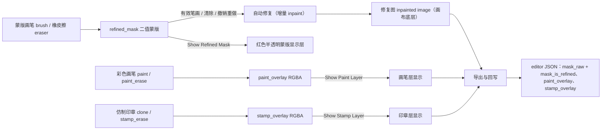
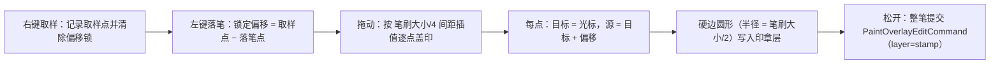

# 蒙版绘制与仿制印章

当自动生成的修复蒙版漏掉文字残影、多盖住背景，或者图片上还有水印、网格、气泡线等需要手动抹掉的内容时，可以在编辑器左侧的“图像编辑”分组中切换蒙版画笔、彩色画笔和仿制印章，直接在画布上修改修复蒙版或修补图像。本页说明这三类工具的写入目标、显示控制、自动修复触发、撤销与持久化格式；工具入口、指针语义、缩放平移与选区见[画布工具与选区](./canvas-tools-and-selection.md)，修复器本身的模型与参数见[设置 → 蒙版与修复](../settings/mask-and-inpainting.md)，快捷键与焦点规则见[快捷键](./shortcuts.md)。

## 功能边界

- 蒙版画笔（`brush`）和橡皮擦（`eraser`）编辑的是**优化蒙版**（`refined_mask`，二值数组 0/255），不是检测输出的原始蒙版；每次有效笔画提交一个 `MaskEditCommand`，并触发一次自动修复。
- 彩色画笔（`paint`、`paint_erase`）写入**画笔图层**（`paint_overlay`，RGBA）；仿制印章（`clone`、`stamp_erase`）写入**印章图层**（`stamp_overlay`，RGBA）。这两层是覆盖在修复图之上的独立透明层，不参与蒙版二值化。
- “清除所有蒙版”清空的是优化蒙版（没有优化蒙版时以原始蒙版为起点清零）；“清除画笔图层”“清除印章图层”分别清空对应 RGBA 层，三者都走可撤销命令。
- 本页不负责工具按钮切换、选区、缩放平移、右键菜单和快捷键注册（见[画布工具与选区](./canvas-tools-and-selection.md)与[快捷键](./shortcuts.md)），也不负责修复器模型、修复尺寸、精度和逐块修复等全局参数（见[设置 → 蒙版与修复](../settings/mask-and-inpainting.md)）。

## UI 操作

### 在属性面板选择图层与工具

打开编辑器后，左侧默认显示“属性编辑”（`Property Editor`）。在“图像编辑”（`Image Editing`）分组中有 `Mask`、`Paint`、`Clone Stamp` 三个页签，各页签提供一组互斥工具按钮；三个页签共用一个按钮组，因此选中任一页签的工具都会取消其他页签的按钮。切换页签时，如果当前工具不属于新页签，会自动切回新页签的“不选择”（`No Selection`），避免跨页工具冲突。三个页签还共享同一个“笔刷大小：”（`Brush Size:`）字段。

### 蒙版页签：画笔与橡皮擦

1. 打开“蒙版”（`Mask`）页签。
2. 点击“画笔”（`Brush`）或“橡皮擦”（`Eraser`）；也可以直接按 `W` / `E` 切换，无需打开面板。
3. 拖动“笔刷大小：”（`Brush Size:`）滑条调整笔画粗细，范围 5–200，初始 30；在画布上按住 `Shift+滚轮` 每格 ±1 调整同一个字段。
4. 在画布上按住左键拖动：画笔把笔画位置写为 255，橡皮擦把笔画位置清为 0。松开后整笔作为一个可撤销命令提交，并触发一次自动修复。
5. 勾选“显示优化蒙版”（`Show Refined Mask`）在画布上以半透明红色显示优化蒙版；点击“清除所有蒙版”（`Clear All Masks`）把优化蒙版整体清空。

### 画笔页签：彩色画笔

1. 打开“画笔”（`Paint`）页签。
2. 选择“画笔”（`Brush`）或“橡皮擦”（`Eraser`）：前者用“画笔颜色：”（`Brush Color:`）选择的颜色写入画笔图层，后者擦除画笔图层。
3. 画笔颜色默认 `#ffffff`（白色），点击颜色按钮打开“选择画笔颜色”（`Select brush color`）对话框；空值会规范化到 `#ff0000`。
4. “显示画笔层”（`Show Paint Layer`）只控制画笔图层是否显示，不删除数据，默认勾选。“清除画笔图层”（`Clear Paint Layer`）把整层清空，可通过撤销恢复。

### 印章页签：取样与涂抹

1. 打开“印章”（`Clone Stamp`）页签，选择“仿制印章”（`Clone Stamp`；英文实际显示为 `Clone`）。
2. 在画布上**右键**点击要复制的源位置进行取样；仿制印章活动时右键不再打开上下文菜单。
3. 按住**左键**拖动涂抹：落笔瞬间锁定“取样点 − 落笔点”的偏移，之后源位置跟随光标保持该偏移；拖动过程中逐点把源像素盖印到印章图层。
4. 需要修正误盖时，选择同一页签的“橡皮擦”（`Eraser`），按住左键拖动擦除印章图层。
5. 勾选“显示印章层”（`Show Stamp Layer`）控制印章图层显示，默认勾选；点击“清除印章层”（`Clear Stamp Layer`）清空整层，可通过撤销恢复。

### 控件文案

| UI 调用 key | English 实际值 | 简体中文实际值 |
| --- | --- | --- |
| `Property Editor` | Property Editor | 属性编辑 |
| `Image Editing` | Image Editing | 图像编辑 |
| `Mask` | Mask | 蒙版 |
| `Paint` | Paint | 画笔 |
| `Clone Stamp` | Clone | 印章 |
| `No Selection` | No Selection | 不选择 |
| `Selection Tool` | Selection Tool | 选择工具 |
| `Brush` | Brush | 画笔 |
| `Brush Tool` | Brush Tool | 画笔工具 |
| `Eraser` | Eraser | 橡皮擦 |
| `Eraser Tool` | Eraser Tool | 橡皮擦工具 |
| `Brush Size:` | Brush Size: | 笔刷大小: |
| `Brush Color:` | Brush Color: | 画笔颜色： |
| `Show Refined Mask` | Show Refined Mask | 显示优化蒙版 |
| `Clear All Masks` | Clear All Masks | 清除所有蒙版 |
| `Show Paint Layer` | Show Paint Layer | 显示画笔层 |
| `Clear Paint Layer` | Clear Paint Layer | 清除画笔图层 |
| `Show Stamp Layer` | Show Stamp Layer | 显示印章层 |
| `Clear Stamp Layer` | Clear Stamp Layer | 清除印章层 |
| `Select brush color` | Select brush color | 选择画笔颜色 |
| `Clone Stamp Hint` | Clone stamp: right-click to sample, left-drag to paint | 仿制印章：右键取样，左键拖动涂抹 |

`Clone Stamp` 的英文显示值是 `Clone` 而不是 `Clone Stamp`；`Brush Size:` 的简体中文值是 `笔刷大小:`（半角冒号），`Brush Color:` 是 `画笔颜色：`（全角冒号），两者都是 locale 原文，不是排版差异。

## 图层与数据流

工具按钮、写入目标、显示层和导出之间的数据流如下。蒙版类工具最终影响的是修复蒙版和自动修复结果；画笔/印章类工具写入的是两个独立的 RGBA 覆盖层，不进入蒙版二值化。

修复图、画笔层、印章层都叠加在画布底图之上，文字区域渲染在最上层；仿制印章的取样源正是“画布当前可见内容”（修复图优先，否则原图，再叠加画笔层和本笔已盖印的印章内容），因此同一笔内可以继续传递仿制内容。

## 运行机理

### 蒙版笔画与自动修复

- `_build_stroke_mask` 把落笔点连成带圆头的折线，再按“笔刷大小 × 蒙版/图像尺寸比”换算成蒙版分辨率下的二值笔画；蒙版分辨率以 `refined_mask` 为准，没有优化蒙版时以底图像素尺寸为准。
- 提交时比较新旧蒙版，只有实际变化才构造 `MaskEditCommand`（记录变化包围盒内的旧/新像素补丁），通过 `QUndoStack` 执行。
- 画笔提交后调用 `force_inpaint_stroke(stroke_mask)`，只用本次笔画包围盒（外扩 50px）做增量修复，而不是整图重跑；橡皮擦提交后走 `refined_mask_changed` 信号，由缓存蒙版快照计算“新增/移除”区域后增量修复，移除区域直接恢复为底图像素。
- 修复请求带代数号 `_inpaint_request_generation`：新笔画会取消并取代未完成的旧请求，所以连续快速涂抹时，画面最终以最后一次请求的结果为准。
- 修复器本身使用设置中的 `inpainter`、`inpainting_size`、`inpainting_precision`、`force_use_torch_inpainting`，设备为 `cuda`（开启 GPU 且可用时）或 `cpu`，详见[设置 → 蒙版与修复](../settings/mask-and-inpainting.md)。
- 笔画预览颜色：蒙版画笔为半透明红色、橡皮擦为半透明蓝色、彩色画笔为所选颜色、画笔/印章擦除为半透明青色；仿制印章直接显示真实盖印像素。

### 画笔与印章图层

- 两层的运行态都是 `(H, W, 4)` 的 RGBA uint8 数组，尺寸始终与底图像素一致；空层在显示端隐藏，提交时若与旧层完全一致则跳过。
- `paint` 用所选颜色写入 RGB 并置 alpha=255；`paint_erase`/`stamp_erase` 把笔画位置的 alpha 清为 0（不物理删除数组）。
- 每次拖动画笔、橡皮或印章擦除的完整笔画提交一个 `PaintOverlayEditCommand`，同样只记录变化包围盒，undo/redo 只恢复该包围盒像素。

### 仿制印章算法

- 取样圈是画布顶层虚线圆，半径随笔刷大小变化；偏移锁定前停在取样点，锁定后跟随光标显示“源位置 = 光标 + 偏移”。
- 单点盖印是像素格对齐的硬边圆，圆内取复合源的 RGB 写入印章层并把 alpha 置 255，边缘不随拖动方向变化。
- `Escape` 或画布失焦会取消进行中的盖印，不提交。

### 显示与清除

- 蒙版显示用 `build_mask_display_frame`：二值蒙版转成红色（255,0,0）、alpha=128 的预乘 RGBA，预览按最大 200 万像素降采样；优化蒙版 z=11、原始蒙版 z=10。
- 画笔层 z=5、印章层 z=6，都在修复图（z=1）之上、文字区域之下；“显示画笔层/显示印章层”只切换 `layer_visible`，不删除数据。
- “清除所有蒙版”清空优化蒙版后照常触发自动修复；“清除画笔图层/清除印章图层”在有内容时提交清空命令，空层直接返回。

## 撤销与重做

蒙版笔画、清除所有蒙版、画笔/印章笔画和图层清除都进入同一个 `QUndoStack`：

- `MaskEditCommand`：undo/redo 通过补丁或全量数组写回 `refined_mask`；写回同样触发 `refined_mask_changed`，因此撤销/重做蒙版编辑也会重新触发自动修复。
- `PaintOverlayEditCommand`：`layer='paint'` 作用于画笔层，`layer='stamp'` 作用于印章层；undo/redo 只改对应层像素，不触发修复。
- 撤销粒度是“整笔”，不是单个取样点；`Ctrl+Z`/`Ctrl+Y` 的焦点规则见[快捷键](./shortcuts.md)。

## 依赖与冲突

- 蒙版类工具依赖修复器配置可加载（模型、尺寸、精度）；加载失败或模型缺失时蒙版仍会更新，但修复图不会刷新，日志记录错误。
- 画笔类工具左键总是绘制，不能点选或拖动区域；区域操作必须先切回“选择”。
- 切换页签会把活动工具切回新页签的“不选择”，蒙版画笔与彩色画笔不会同时处于活动状态。
- `Shift+滚轮` 调整的是三个页签共享的笔刷大小（5–200），不会缩放画布；`Ctrl+滚轮` 调整选中区域字号，两者都归[快捷键](./shortcuts.md)。
- 仿制印章活动时右键被取样占用，右键菜单完全屏蔽；`Escape`/失焦丢弃未提交笔画。
- 笔画数据按底图全分辨率保存（RGBA 层为 H×W×4），超大图片会占用较多内存；显示层会降采样，但落笔与盖印都在全分辨率进行。
- 画笔/印章层、优化蒙版都随导出写入工程文件；导出与回写格式见[导入导出与回写](./import-export-and-writeback.md)。

## 关联文件与格式

| 文件/格式 | 本页实际作用 | 手改与兼容注意 |
| --- | --- | --- |
| 会话状态 `active_tool`、`brush_size`、`brush_color`、`display_mask_type` | 工具与画笔参数的运行态 | 默认 `select`、`30`、`#ffffff`、`none`；只在编辑器会话内存中，不写配置文件 |
| `refined_mask` / 二值 uint8 数组 | 蒙版画笔与橡皮擦的读写对象 | 编辑后的蒙版导出时写入 `mask_raw`（base64 PNG）并标记 `mask_is_refined: true`，后端跳过蒙版优化 |
| `paint_overlay` / `stamp_overlay`（RGBA uint8） | 彩色画笔与仿制印章的写入目标 | 导出时以 base64 PNG 写入 JSON 键 `paint_overlay` / `stamp_overlay`；旧版单文件 PNG 仅作画笔层兼容兜底 |
| `*_translations.json` | 编辑器工程持久化 | 只记录格式与键名，不展示真实用户图片或工程文件 |

## 源码依据 {#source-evidence}

| 层级 | 文件 | 本页核对内容 |
| --- | --- | --- |
| UI | `desktop_qt_ui/ui/widgets/property_panel.py` | 图像编辑分组三页签、共享互斥按钮组、笔刷大小/颜色、显示与清除控件、信号与页签切换复位 |
| 会话状态 | `desktop_qt_ui/editor/session.py`、`editor_model.py`、`editor_controller.py` | `active_tool`/`brush_size`/`brush_color`/`display_mask_type` 默认值与信号转发 |
| 画布输入 | `desktop_qt_ui/ui/editor/graphics_view_input.py` | 笔画收集、蒙版写入、画笔/印章层写入、仿制取样与盖印、预览、提交与取消 |
| 撤销/重做 | `desktop_qt_ui/editor/commands.py` | `MaskEditCommand`、`PaintOverlayEditCommand` 的补丁与写回 |
| 自动修复 | `desktop_qt_ui/editor/controller_inpaint_service.py` | 增量修复、代数取消、`clear_all_masks`、图层清除 |
| 显示层 | `desktop_qt_ui/ui/editor/mask_layer.py`、`overlay_layer.py`、`editor/image_utils.py` | 蒙版红色显示、画笔/印章层 z 值、降采样预览 |
| 持久化/导出 | `desktop_qt_ui/services/export_service.py`、`services/file_service.py`、`editor/document_load_worker.py`、`editor/controller_export_service.py` | `mask_raw`/`paint_overlay`/`stamp_overlay` 写盘与读回、内存载荷直通 |
| UI/i18n | `desktop_qt_ui/locales/en_US.json`、`zh_CN.json` | 表格中 key 与两种语言实际显示值 |
| 接线 | `desktop_qt_ui/ui/editor/view.py`、`desktop_qt_ui/app_logic.py` | 属性面板信号到 controller；应用逻辑不含蒙版/画笔运行态（仅修复配置与关闭清理） |

## 验证记录 {#verification}

| 验证内容 | 状态 | 说明 |
| --- | --- | --- |
| BLUEPRINT、PAGE_GUIDELINES、TODO | 完成 | 已完整读取并按页面合同编写；本页 TODO 保持 `[未开工]`，由主代理统一勾选 |
| UI 布局与调用 | 完成 | 静态核对属性面板三页签、view 信号接线、画布输入分支 |
| `en_US` / `zh_CN` 实际 locale | 完成 | 页面表格逐项记录 key、English、简体中文实际值，含 `Clone Stamp`→`Clone` 差异 |
| 蒙版/画笔/仿制印章运行链 | 完成 | 静态核对笔画提交、增量修复、印章盖印与撤销命令 |
| 脱敏运行验证 | 待后续 | 未启动 GUI、未截图；未读取真实用户图片、`.env`、密钥或私有工程文件 |
| VitePress | 待运行 | 由协调代理在合并前运行 `npm run docs:build --prefix doc/wiki` 及镜像/源码检查 |