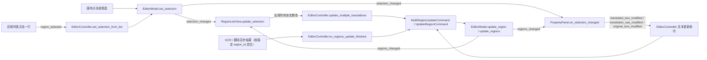

# 区域列表与文本编辑

当你在编辑器里需要逐条核对 OCR 结果、调整某句台词或重新识别某个文字框时，使用左栏的“可编辑译文”（`Editable Translation`）区域列表和属性面板的“文本内容”（`Text Content`）区。本页介绍区域列表的浏览、查找替换、批量应用，以及属性面板中的原文/译文编辑和列表同步；样式、富文本、蒙版与导入导出分别见对应页面。

## 功能边界 {#feature-boundary}

- 左栏包含两个路由：“可编辑译文”（`Editable Translation`，区域列表）与“属性编辑”（`Property Editor`，属性面板），默认显示后者。本页覆盖区域列表的全部交互，以及属性面板“文本内容”（`Text Content`）与“操作”（`Actions`）两个分区。
- 区域列表每一行显示“编号: 原文”和可编辑译文框；行内修改只是列表草稿，必须点击“应用所有译文修改”（`Apply All Translation Changes`）才写入模型。
- 属性面板文本区维护三个文本字段：原文 `text`、最终译文 `translation`、替换前译文 `translation_raw`。“显示替换前译文”（`Show Translation (Raw)`）默认勾选，勾选时编辑的是 `translation_raw`。
- 不覆盖：样式设置（`Style Settings`）见[样式属性](./style-properties.md)；浮动富文本编辑器见[浮动富文本](./floating-rich-text.md)；蒙版、画笔与印章见[蒙版绘制与仿制印章](./mask-paint-and-clone-stamp.md)；导入导出与写回见[导入导出与回写](./import-export-and-writeback.md)；快捷键见[快捷键](./shortcuts.md)。

## UI 操作 {#ui-operations}

### 打开左栏并浏览区域列表 {#open-region-list}

1. 在编辑器打开一张图片后，左栏默认显示“属性编辑”（`Property Editor`）。点击“可编辑译文”（`Editable Translation`）切到区域列表。
2. 列表每一行显示 `1: 原文` 形式的编号加原文，以及一个可编辑译文框。译文框的占位提示是源码中未经 i18n 的中文字面量“译文”，没有 `en_US`/`zh_CN` 对照，也不会随语言切换。
3. 在画布上点击或框选区域，模型选区变化会反向选中对应列表行；点击列表行也会通过 controller 把该区域设为画布和属性面板的当前选区。
4. 直接编辑某行译文只修改列表草稿；点击“应用所有译文修改”（`Apply All Translation Changes`）才把有变化的行批量提交。

### 查找替换与应用所有译文修改 {#find-replace-apply}

1. 在“查找”（`Find`）输入要查找的文字，在“替换为”（`Replace with`）输入替换文字。
2. 点击“全部替换”（`Replace All`）会在所有列表行的译文框草稿中执行纯文本替换（`str.replace`，非正则）；查找内容为空时不执行。
3. “全部替换”只改列表草稿；点击“应用所有译文修改”（`Apply All Translation Changes`）后，controller 汇总所有行译文，跳过未变化的区域，把变化区域合并为一次可撤销的批量更新命令。
4. 正在编辑（持焦点）的列表行在模型刷新时不会被覆盖，避免丢焦点、光标或 IME 组合字。

### 在属性面板编辑文本 {#edit-text-in-property-panel}

单选区域后，“文本内容”（`Text Content`）区启用；多选时文本区禁用，样式区与操作区仍可用。

1. “原文:”（`Original Text:`）输入框直接写回区域原文 `text` 字段。
2. “显示替换前译文”（`Show Translation (Raw)`）默认勾选：此时“译文:”（`Translated Text:`）框编辑的是 `translation_raw`，每次变化实时经过替换规则生成 `translation`；取消勾选后编辑的是最终 `translation`。
3. 译文框用 `↵` 显示换行；保存时 `↵` 转换为模型存储的 `[BR]`，显示时 `[BR]`、` `、`【BR】` 和真实换行都会转成 `↵`。
4. 点击“占位符”（`Placeholder`）在译文框光标处插入全角下划线 `＿`；点击“换行↵”（`Newline↵`）插入 `↵`。
5. “字符数: 0”（`Character count: 0`）标签在源码中是静态文案，当前没有动态字符计数逻辑（见[验证记录](#verification)）。
6. 选择“OCR模型:”（`OCR Model:`）后点击“识别”（`Recognize`）对当前选区重新 OCR；选择“翻译器：”（`Translator:`）与“目标语言：”（`Target Language:`）后点击“翻译”（`Translate`）翻译当前选区。三个下拉的选项来自配置显示映射，不是固定 i18n 枚举。

### 复制、粘贴与删除区域 {#copy-paste-delete}

“操作”（`Actions`）区在单选和多选时都可用：

- “复制”（`Copy`）：把当前选区区域数据复制到内部剪贴板。
- “粘贴”（`Paste`）：单选时粘贴样式（保留位置与文本，覆盖字体、字号、颜色、对齐、方向、行距与字距）；多选或无选区时按鼠标位置或默认偏移粘贴整个区域。
- “删除”（`Delete`）：删除选中区域，一次操作可撤销。

## 选项中英对照 {#option-matrix}

| UI 调用 key | English 实际值 | 简体中文实际值 |
| --- | --- | --- |
| `Editable Translation` | Editable Translation | 可编辑译文 |
| `Property Editor` | Property Editor | 属性编辑 |
| `Find` | Find | 查找 |
| `Replace with` | Replace with | 替换为 |
| `Replace All` | Replace All | 全部替换 |
| `Apply All Translation Changes` | Apply All Translation Changes | 应用所有译文修改 |
| `Text Content` | Text Content | 文本内容 |
| `Original Text:` | Original Text: | 原文: |
| `Show Translation (Raw)` | Show Translation (Raw) | 显示替换前译文 |
| `Translated Text:` | Translated Text: | 译文: |
| `Placeholder` | Placeholder | 占位符 |
| `Newline↵` | Newline↵ | 换行↵ |
| `Insert placeholder ＿` | Insert placeholder ＿ | 插入占位符 ＿ |
| `Insert newline` | Insert newline | 插入换行符 |
| `Character count: 0` | Character count: 0 | 字符数: 0 |
| `OCR Model:` | OCR Model: | OCR模型: |
| `Recognize` | Recognize | 识别 |
| `Translator:` | Translator: | 翻译器： |
| `Translate` | Translate | 翻译 |
| `Target Language:` | Target Language: | 目标语言： |
| `Actions` | Actions | 操作 |
| `Copy` | Copy | 复制 |
| `Paste` | Paste | 粘贴 |
| `Delete` | Delete | 删除 |

以下界面文案在源码中是未经 i18n 的中文字面量，当前没有 key 对照，如实标记为缺失项：区域列表译文框占位提示“译文”；OCR/翻译进行中与完成提示（“正在识别...”、“正在翻译...”、“识别完成”、“翻译完成”等）由 controller 硬编码，不属于完整 i18n 表。

## 运行机理 {#runtime-behavior}

### 列表同步流程 {#list-sync-flow}

`EditorModel` 是区域状态的单一事实来源，所有区域改动都必须经过模型的 mutation 方法并广播 `RegionChange`。区域列表按 `reset`/`updated`/`inserted`/`removed` 四种 kind 做最小刷新；差量更新时保留未提交草稿，持焦点的译文框不被覆盖。

同步通道汇总：

| 方向 | 信号 / 动作 | 接收方 | 关键行为 |
| --- | --- | --- | --- |
| 列表 → 模型选区 | `region_selected` | `controller.set_selection_from_list` → `model.set_selection` | 点击列表行，画布与属性面板跟随切换 |
| 模型选区 → 列表 | `selection_changed` | `RegionListView.update_selection` | 画布/属性面板引发的选区变化反向选中列表项 |
| 模型区域 → 列表 | `regions_changed` | `RegionListView.on_regions_changed` | 按 kind 差量刷新，保留草稿、不覆盖持焦点行 |
| 列表 → 模型 | “应用所有译文修改” | `controller.update_multiple_translations` | 汇总草稿、跳过未变化区域、单次可撤销命令 |
| 属性面板 → 模型 | 文本修改信号 | `controller.update_translated_text` 等 | 实时写回 `translation`/`translation_raw`/`text` |
| 异步任务 → 模型 | 稳定 `region_id` 定位 | `controller.on_regions_update_finished` | 等待期间插入/删除区域不会写错目标 |

### 文本字段与换行存储 {#text-fields-and-breaks}

| 字段 | 存储值 | 用途与写回规则 |
| --- | --- | --- |
| `text` | 原文字符串 | “原文:”框直接写回；选区 OCR 结果也写入该字段 |
| `translation` | 最终译文，含 `[BR]` 换行标记 | 渲染消费；直接编辑时同步覆盖 `translation_raw`（替换规则不可逆） |
| `translation_raw` | 替换前译文 | 勾选“显示替换前译文”时编辑；每次变化实时跑替换规则生成 `translation`，规则失败回退原文 |
| `translation_rich` | 富文本文档 | 由浮动富文本编辑器或自动富文本规则维护；整段替换无可靠同步结果时删除并回退纯文本 |

换行标记转换：显示时把 `[BR]`、` `、`【BR】` 和真实换行归一为 `↵`；保存时把 `↵` 换回 `\n` 再合并为 `[BR]`。渲染端把 `[BR]` 视为强制换行，替换规则会自动跳过这些标记，避免标记内容被误替换。旧 `<H>` 局部横排协议已废除，编辑保存时会把存量 `<H></H>` 剥除（保留内文），渲染管线不再有 `<H>` 消费者。

## 依赖与冲突 {#dependencies-and-conflicts}

- 区域列表、属性面板和工具栏对齐/分布按钮都监听同一模型选区，不各自保存一份选区副本；任何一方改变选区都会让其余视图刷新。
- 正在编辑的列表行与属性面板文本框在常规刷新中不会被覆盖；只有异步任务（`source="async"`）写回时才强制刷新文本字段，防止陈旧文档覆盖模型。
- `translation` 与 `translation_raw` 是同一区域的两个字段，不是两个区域；“显示替换前译文”只改变编辑目标，不改变区域本身。
- “编辑时自动应用富文本规则”（`Auto Apply Rich Text Rules While Editing`）由编辑器菜单开关控制，富文本规则的定义与渲染时机归富文本规则页。
- 与批量管理的写回、替换规则的实时应用存在交互；批量写回、`.bak` 与恢复归批量管理页。
- 焦点在文本控件时，`Delete` 不删除区域、`Q`/`W`/`E`/`A`/`D` 被转发为文字而不是切换工具或图片，详见[快捷键](./shortcuts.md)。

## 关联文件与格式 {#related-files}

| 文件/格式 | 本页实际作用 | 手改与兼容注意 |
| --- | --- | --- |
| `<image-dir>/manga_translator_work/json/<stem>_translations.json` | 区域数据持久化：`regions` 数组含 `text`、`translation`、`translation_raw` 等字段 | 编辑器修改通过导出/回写保存；文档不展示真实用户路径与图片 |
| 旧版本 `*_translations.json` | 兼容读取旧路径 | 缺 `translation_raw` 时用 `translation` 回填，保证“替换前译文”框始终有值 |
| `config/text_replacements.yaml` | 替换规则 | 编辑 `translation_raw` 时实时应用；规则失败回退原文 |
| 富文本规则配置文件 | 自动富文本规则 | 由“编辑时自动应用富文本规则”开关触发，归富文本规则页 |
| `config/config.json` | 应用配置（含编辑器开关） | 不读取或展示真实用户文件，不提交私有绝对路径 |

## 源码依据 {#source-evidence}

| 层级 | 文件 | 本页核对内容 |
| --- | --- | --- |
| 区域列表 | `desktop_qt_ui/ui/widgets/region_list_view.py` | 行结构、差量同步、草稿保留、查找替换、选区回选 |
| 属性面板文本区 | `desktop_qt_ui/ui/widgets/property_panel.py` | 文本内容/操作区控件、`↵`/`[BR]` 转换、raw 模式、写回信号 |
| 视图接线 | `desktop_qt_ui/ui/editor/view.py` | 左栏路由、应用按钮、信号连接、语言刷新 |
| 模型 | `desktop_qt_ui/editor/editor_model.py`、`editor/session.py`、`editor/region_change.py` | 区域单一事实来源、`RegionChange` 通知 |
| 控制器 | `desktop_qt_ui/editor/editor_controller.py` | 文本/批量更新命令、raw 替换、异步 `region_id` 写回 |
| 加载/写回 | `desktop_qt_ui/editor/document_load_worker.py`、`editor/controller_document_service.py`、`services/file_service.py`、`editor/controller_export_service.py` | JSON 读取、旧字段回填、导出写盘 |
| 服务 | `desktop_qt_ui/services/ocr_service.py`、`translation_service.py` | 选区 OCR 与翻译请求 |
| 最终消费者 | `manga_translator/rendering/text_replacements.py`、`manga_translator/rendering/__init__.py` | 替换规则应用、`[BR]` 换行归一化 |
| i18n | `desktop_qt_ui/locales/en_US.json`、`zh_CN.json` | key 与中英实际值 |

## 验证记录 {#verification}

| 验证内容 | 状态 | 说明 |
| --- | --- | --- |
| BLUEPRINT、PAGE_GUIDELINES、TODO | 完成 | 已完整读取并按页面合同编写 |
| UI 布局与调用 | 完成 | 静态核对区域列表、左栏路由、属性面板文本/操作区 |
| `en_US` / `zh_CN` 实际 locale | 完成 | 三列表逐项核对；“译文”占位、OCR/翻译 Toast 为未 i18n 中文字面量 |
| 列表同步与文本写回 | 完成 | 静态核对差量同步、草稿保留、`region_id` 异步定位、`↵`/`[BR]` 转换 |
| 字符计数 | 待运行 | 静态源码中 `Character count: 0` 为固定文案，未见动态计数逻辑，需有头运行确认 |
| 脱敏运行验证 | 待后续 | 未读取真实 `.env`、用户 `config.json`、API key/token、用户名、用户图片或私有路径 |
| VitePress | 待运行 | 由协调代理在合并前运行 `npm run docs:build --prefix doc/wiki` 及镜像/源码检查 |