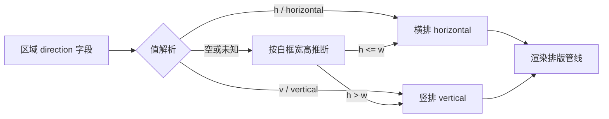
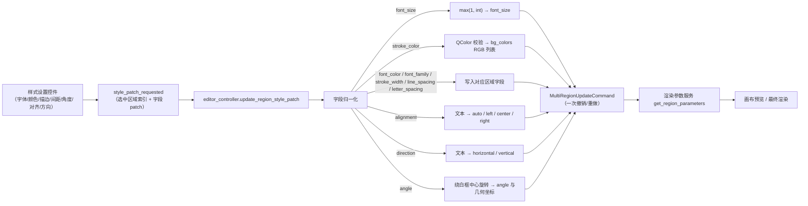

# 编辑器样式属性

当需要统一或微调文字区域的显示样式——字体、字号、文字颜色、描边、行距、字距、旋转角度、对齐和排版方向——使用属性面板中的“样式设置”（`Style Settings`）分区。本页只讲区域级基础样式：每个字段的修改作为一次样式 patch，作用于当前全部选中区域。逐段富文本样式（加粗、发光、注音、TCY 等）见[浮动富文本编辑器](./floating-rich-text.md)，文本内容与 OCR/翻译见[区域列表与文本编辑](./region-list-and-text-editing.md)，蒙版/画笔/仿制工具见[画布工具与选区](./canvas-tools-and-selection.md)，样式随项目 JSON 的导入导出见[导入导出与回写](./import-export-and-writeback.md)。

## 功能边界

- “样式设置”是属性面板三个分区之一，其余两个是“图像编辑”和“文本内容”；本页只覆盖样式分区。
- 样式字段是区域数据字段（`font_family`、`font_size`、`bg_colors` 等），不是全局渲染配置键。设置页“渲染”分组的全局参数只在区域没有对应字段时作为基础值参与计算。
- 单选时文本、样式、操作三区都启用；多选时文本区禁用、样式和操作区仍可用，修改任一样式字段会同时应用到全部选中区域；无选区时三区禁用。多选没有“混合值”显示，样式控件保留最近单选的值。
- 富文本“局部样式”（加粗、斜体、下划线、文字颜色、发光、外描边、TCY、注音、局部旋转等）作用于单个连续文本段，不写入这些区域字段。
- 样式组合（`Style Preset`）只保存区域级样式字段的子集，不保存字体大小与角度。

## UI 操作

### 打开属性面板与选择区域

1. 打开编辑器，左侧栏默认显示“属性编辑”（`Property Editor`）。
2. 在画布上单选一个区域：文本、样式、操作三区均启用，样式控件显示该区域的实际值。
3. 框选或多个区域：文本区禁用，样式区与操作区仍可用；修改任一样式字段会同时应用到所有选中区域。
4. 无选区：三个分区全部禁用，样式控件回到初始默认值。
5. 画布点击前会先强制保存属性面板中正在编辑的文本（`force_save_property_panel_edits()`），避免切换画布时丢失修改。

### 样式字段总览

| UI 调用 key | English 实际值 | 简体中文实际值 | 样式 patch 字段 | 控件 / 范围或初始值 |
| --- | --- | --- | --- | --- |
| `Style Settings` | Style Settings | 样式设置 | — | 分区标题 |
| `Style Preset:` | Style Preset: | 样式组合： | 整个样式组合 | 已保存样式下拉 + 保存/删除按钮 |
| `Font:` | Font: | 字体： | `font_family` | 系统字体下拉 |
| `Font Size:` | Font Size: | 字体大小： | `font_size` | 数值 8–1000；滑条 8–150 |
| `Font Color:` | Font Color: | 字体颜色： | `font_color` | 颜色选择器，组件默认 `#000000` |
| `Stroke Color:` | Stroke Color: | 描边颜色： | `stroke_color` | 颜色选择器，组件默认 `#ffffff` |
| `Stroke Width:` | Stroke Width: | 描边宽度： | `stroke_width` | 0–1，步长 0.01，初始 `0.07` |
| `Line Spacing:` | Line Spacing: | 行间距： | `line_spacing` | 0.1–5，步长 0.1，初始 `1.0` |
| `Letter Spacing:` | Letter Spacing: | 字间距： | `letter_spacing` | 0.1–5，步长 0.1，初始 `1.0` |
| `Angle:` | Angle: | 角度： | `angle` | -9999–9999°，步长 1，初始 `0.0` |
| `Alignment:` | Alignment: | 对齐： | `alignment` | 下拉：Auto / Left / Center / Right |
| `Direction:` | Direction: | 方向： | `direction` | 下拉：Horizontal / Vertical（不含 Auto） |

对齐与方向下拉的存储值和显示值：

| 存储值 | UI 调用 key | English 实际值 | 简体中文实际值 |
| --- | --- | --- | --- |
| `auto` | `alignment_auto` | Auto | 自动 |
| `left` | `alignment_left` | Left | 左对齐 |
| `center` | `alignment_center` | Center | 居中 |
| `right` | `alignment_right` | Right | 右对齐 |
| `h`（别名 `horizontal`） | `direction_horizontal` | Horizontal | 横排 |
| `v`（别名 `vertical`） | `direction_vertical` | Vertical | 竖排 |

### 修改颜色、描边与间距

- 点“字体颜色”或“描边颜色”的颜色按钮打开取色弹层。弹层包含“色板”（`Palette`）、“亮度”（`Brightness`）、“自定义”（`Custom`）、“常用颜色”（`Common`）、“曾经用过”（`Recent`）分组，可输入 HEX 或 RGB；点“屏幕取色”（`Pick screen color`）进入全屏取色器，左键取色，右键或 Esc 取消。
- “字体大小”由数值框（8–1000）和滑条（8–150）同步控制；两者范围不同，滑条只覆盖常用区间。
- “描边宽度”设为 `0` 时不绘制描边。
- 颜色选择器把选中的颜色记入“最近使用”并在应用配置中保存（最多 20 个），下次打开弹层可直接选用。

| UI 调用 key | English 实际值 | 简体中文实际值 |
| --- | --- | --- |
| `Palette` | Palette | 色板 |
| `Brightness` | Brightness | 亮度 |
| `Custom` | Custom | 自定义 |
| `Common` | Common | 常用颜色 |
| `Recent` | Recently used | 曾经用过 |
| `Pick screen color` | Pick screen color | 屏幕取色 |
| `Click to select color` | Click to select color | 点击选择颜色 |
| `Select font color` | Select font color | 选择字体颜色 |
| `Select stroke color` | Select stroke color | 选择描边颜色 |

### 保存与应用样式组合

1. 调整好样式后点保存按钮（悬停提示“保存当前样式组合”），输入名称并保存；名称不能为空，已存在时确认是否覆盖。
2. 从“样式组合：”下拉选择已保存的样式，即把该组合应用到当前全部选中区域；应用不改变字体大小与角度。
3. 点删除按钮（悬停提示“删除当前选中的已保存样式”）删除当前选中的组合，需二次确认。
4. 配置写盘失败时保存或删除会弹错误提示。

| UI 调用 key | English 实际值 | 简体中文实际值 |
| --- | --- | --- |
| `Save Style` | Save Style | 保存样式 |
| `Enter style preset name:` | Enter style preset name: | 输入样式名称： |
| `Save` | Save | 保存 |
| `Cancel` | Cancel | 取消 |
| `Style preset name cannot be empty` | Style preset name cannot be empty | 样式名称不能为空 |
| `Style preset '{name}' already exists. Overwrite?` | Style preset '{name}' already exists. Overwrite? | 样式“{name}”已存在，是否覆盖？ |
| `Failed to save style preset` | Failed to save style preset | 保存样式失败 |
| `Failed to delete style preset` | Failed to delete style preset | 删除样式失败 |
| `Please select a saved style` | Please select a saved style | 请选择一个已保存样式 |
| `Delete style preset '{name}'?` | Delete style preset '{name}'? | 确定删除样式“{name}”？ |
| `Select saved style` | Select saved style | 选择已保存样式 |
| `Choose a saved style to apply` | Choose a saved style to apply | 选择一个已保存样式并应用到当前选区 |
| `Save current style combination` | Save current style combination | 保存当前样式组合 |
| `Delete selected saved style` | Delete selected saved style | 删除当前选中的已保存样式 |
| `Delete Style` | Delete Style | 删除样式 |

### 从画布快速调整字号

在画布上按住 Ctrl 滚动滚轮，按当前字号约 5% 的步长调整所有选中区域的字体大小（最小钳制为 1）；即使没有选区，事件也会被吞掉，不会穿透成画布缩放。Shift+滚轮调整的是画笔大小，属于“图像编辑”分区，见[画布工具与选区](./canvas-tools-and-selection.md)。

## 参数与选项

以下字段全部是“样式 patch 字段”，即属性面板一次修改写回的区域数据键；控件范围来自 `property_panel.py`，不是核心渲染配置的取值范围。

#### `font_family` — 字体：/ Font: {#font-family}

- 控件：系统字体下拉框（`FontComboBox`，按当前界面语言排序）。
- 所在界面：属性面板 → 样式设置；UI 调用 key `Font:`。
- 存储值：区域字段 `font_family`，字体族名字符串（如 `Microsoft YaHei UI`）。
- 可选值：系统已安装字体；没有枚举下拉。
- 默认值：核心 `manga_translator/config.py#RenderConfig.font_family` 为 `None`（不强制字体）；Qt 字体下拉无固定初始项，区域缺省时显示为空；发行 `config/config-example.json` 的 `render.font_family` 为 `Microsoft YaHei UI`。
- 生效阶段：编辑器预览与最终渲染（排版/渲染）；属于 `_FONT_AFFECTING_FIELDS`，修改后同步重算白框尺寸。
- 原理：`_on_font_family_changed` 读取 `currentFamily()` 发出 `{"font_family": 名称}` patch；controller 校验后写入区域数据，渲染参数服务把区域 `font_family` 覆盖全局字体。
- 依赖与冲突：未安装的字体不会出现在下拉中；空值表示跟随全局渲染字体。
- 性能/API 成本：无网络成本；字体族变化会触发一次白框尺寸重算。
- 关联文件和调试产物：无独立文件；随区域数据写入项目 JSON。
- 图示：不需要：单一字体族选择，无分支、不改变处理阶段。
- 源码依据：控件 `desktop_qt_ui/ui/widgets/property_panel.py:715`；patch 发射 `:1804`；controller `desktop_qt_ui/editor/editor_controller.py:1313`。
- 验证状态：静态核对完成；界面运行待后续。

#### `font_size` — 字体大小：/ Font Size: {#font-size}

- 控件：整数数值框（8–1000）+ 滑条（8–150），两者同步。
- 所在界面：属性面板 → 样式设置；UI 调用 key `Font Size:`。
- 存储值：区域字段 `font_size`，非负整数。
- 可选值：整数；没有枚举下拉。数值框下限 8、上限 1000；controller 归一化时再钳制为 `max(1, int)`。
- 默认值：核心 `RenderConfig.font_size` 为 `None`（自动计算字号，约框高 0.8，上限 128）；Qt 控件无选区时清空显示回退为 `12`；发行 `config-example.json` 的 `render.font_size` 为 `null`。
- 生效阶段：编辑器预览与最终渲染；属于 `_FONT_AFFECTING_FIELDS`，修改后重算白框尺寸。
- 原理：数值框和滑条各自发出 patch；controller 按 `max(1, int(value))` 归一化并写入区域。画布 Ctrl+滚轮按当前字号约 5% 的步长调整全部选中区域。
- 依赖与冲突：`font_size` 与 `render.font_size_offset`、`font_scale_ratio`、`max_font_size` 是不同层级：前者是区域固定字号，后者是全局缩放偏移。
- 性能/API 成本：无网络成本；每次字号变化触发一次白框尺寸重算与重绘。
- 关联文件和调试产物：无独立文件；随区域数据写入项目 JSON。
- 图示：不需要：单一数值，无分支；白框尺寸由渲染参数管线按新字号重算。
- 源码依据：控件 `property_panel.py:720`；patch 发射 `:1780`、`:1793`；Ctrl+滚轮 `desktop_qt_ui/ui/editor/shortcut_manager.py:376`。
- 验证状态：静态核对完成；界面运行待后续。

#### `font_color` — 字体颜色：/ Font Color: {#font-color}

- 控件：颜色选择器（`ColorPickerWidget`）。
- 所在界面：属性面板 → 样式设置；UI 调用 key `Font Color:`；取色弹层标题 key `Select font color`。
- 存储值：区域字段 `font_color`，`#RRGGBB` 十六进制字符串；渲染时映射为前景色。
- 可选值：任意 HEX 颜色；没有枚举下拉。
- 默认值：核心 `RenderConfig.font_color` 为 `None`（沿用 OCR 检测的 `fg_colors`）；Qt 颜色选择器组件默认 `#000000`；发行 `config-example.json` 为 `null`。
- 生效阶段：编辑器预览与最终渲染；颜色本身不改变白框尺寸。
- 原理：`_on_font_color_changed` 发出 `{"font_color": "#rrggbb"}` patch；controller 校验为合法 `QColor` 后以字符串写入 `font_color`；显示时优先取 `font_color`，缺省才回退到 `fg_colors`。
- 依赖与冲突：`fg_colors` 是 OCR 给出的原始前景色；一旦设置 `font_color` 就以它为准。
- 性能/API 成本：无网络成本；只触发重绘。
- 关联文件和调试产物：选中的颜色会记入应用配置 `app.saved_colors`（最多 20 个）。
- 图示：不需要：单一颜色值，映射固定无分支。
- 源码依据：控件 `property_panel.py:731`；patch 发射 `:1814`；渲染映射 `desktop_qt_ui/services/render_parameter_service.py:266`。
- 验证状态：静态核对完成；界面运行待后续。

#### `stroke_color` — 描边颜色：/ Stroke Color: {#stroke-color}

- 控件：颜色选择器（`ColorPickerWidget`）。
- 所在界面：属性面板 → 样式设置；UI 调用 key `Stroke Color:`；取色弹层标题 key `Select stroke color`。
- 存储值：patch 字段是 `stroke_color`，写入时转换为区域字段 `bg_colors`（RGB 整数列表）；渲染时作为背景/描边色。
- 可选值：任意 HEX 颜色；没有枚举下拉。
- 默认值：Qt 颜色选择器组件默认 `#ffffff`；核心与发行配置没有独立的 `stroke_color` 键（渲染消费 `bg_color`/`bg_colors`）。
- 生效阶段：编辑器预览与最终渲染；颜色本身不改变白框尺寸。
- 原理：`_on_stroke_color_changed` 发出 `{"stroke_color": "#rrggbb"}`；controller 用 `QColor` 校验后把 `bg_colors` 写成 `[r, g, b]`；显示时优先取 `stroke_color`，其次 `bg_color`/`bg_colors`。
- 依赖与冲突：描边是否绘制由 `stroke_width` 决定；`stroke_width=0` 时颜色不生效。描边颜色选择器的 `saved_stroke_colors` 配置键在 `AppSection` 中没有对应模型字段，跨重启持久化需运行核对。
- 性能/API 成本：无网络成本；只触发重绘。
- 关联文件和调试产物：区域 `bg_colors` 随项目 JSON 保存。
- 图示：不需要：单一颜色值，`stroke_color → bg_colors → bg_color` 映射固定无分支。
- 源码依据：控件 `property_panel.py:744`；patch 发射 `:1820`；字段映射 `editor_controller.py:1373`；渲染映射 `render_parameter_service.py:272`。
- 验证状态：静态核对完成；`saved_stroke_colors` 持久化待运行核对。

#### `stroke_width` — 描边宽度：/ Stroke Width: {#stroke-width}

- 控件：双精度数值框（0–1，步长 0.01，两位小数）。
- 所在界面：属性面板 → 样式设置；UI 调用 key `Stroke Width:`。
- 存储值：区域字段 `stroke_width`，浮点数；含义是相对字号的描边宽度比例。
- 可选值：`0.0`–`1.0`；`0` 表示不绘制描边。
- 默认值：核心 `RenderConfig.stroke_width` 为 `0.07`（7%）；Qt 控件初始 `0.07`；发行 `config-example.json` 为 `0.07`。
- 生效阶段：编辑器预览与最终渲染；属于 `_FONT_AFFECTING_FIELDS`，修改后重算白框尺寸。
- 原理：数值变化直接发出 `{"stroke_width": float}` patch；controller 归一化为浮点写入区域；渲染时 `stroke_width` 按字号缩放描边粗细。
- 依赖与冲突：`stroke_width=0` 关闭描边；描边颜色由 `stroke_color` 决定。
- 性能/API 成本：无网络成本；触发白框尺寸重算与重绘。
- 关联文件和调试产物：无独立文件；随区域数据写入项目 JSON。
- 图示：不需要：单一数值偏移；`0` 关闭描边是取值语义而非独立处理分支。
- 源码依据：控件 `property_panel.py:760`；patch 发射 `:1826`；渲染消费 `desktop_qt_ui/editor/text_renderer_backend.py:154`。
- 验证状态：静态核对完成；界面运行待后续。

#### `line_spacing` — 行间距：/ Line Spacing: {#line-spacing}

- 控件：双精度数值框（0.1–5，步长 0.1，一位小数）。
- 所在界面：属性面板 → 样式设置；UI 调用 key `Line Spacing:`。
- 存储值：区域字段 `line_spacing`，行距倍率。
- 可选值：`0.1`–`5.0`；`1.0` 表示按默认行距。
- 默认值：核心 `RenderConfig.line_spacing` 为 `None`（运行时回退 `1.0`）；Qt 控件初始 `1.0`；发行 `config-example.json` 为 `1.0`。
- 生效阶段：编辑器预览与最终渲染；属于 `_FONT_AFFECTING_FIELDS`，修改后重算白框尺寸。
- 原理：区域值缺省时取渲染配置或 `1.0`；实际行距 = 字号 × 基础行距 × 倍率（横排基础 0.01、竖排基础 0.2）。
- 依赖与冲突：区域显式设置会覆盖渲染配置；`None` 才回退。
- 性能/API 成本：无网络成本；触发白框尺寸重算与重绘。
- 关联文件和调试产物：无独立文件；随区域数据写入项目 JSON。
- 图示：不需要：单一倍率，无分支；缺省回退路径固定。
- 源码依据：控件 `property_panel.py:768`；patch 发射 `:1832`；回退逻辑 `editor_controller.py:1381`；渲染消费 `text_renderer_backend.py:163`。
- 验证状态：静态核对完成；界面运行待后续。

#### `letter_spacing` — 字间距：/ Letter Spacing: {#letter-spacing}

- 控件：双精度数值框（0.1–5，步长 0.1，一位小数）。
- 所在界面：属性面板 → 样式设置；UI 调用 key `Letter Spacing:`。
- 存储值：区域字段 `letter_spacing`，字距倍率。
- 可选值：`0.1`–`5.0`；`1.0` 表示按默认字距。
- 默认值：核心 `RenderConfig.letter_spacing` 为 `None`（运行时回退 `1.0`）；Qt 控件初始 `1.0`；发行 `config-example.json` 为 `1.0`。
- 生效阶段：编辑器预览与最终渲染；属于 `_FONT_AFFECTING_FIELDS`，修改后重算白框尺寸。
- 原理：区域值缺省时取渲染配置或 `1.0`；实际字距 = 字体原始字距 × 倍率。
- 依赖与冲突：区域显式设置会覆盖渲染配置；`None` 才回退。
- 性能/API 成本：无网络成本；触发白框尺寸重算与重绘。
- 关联文件和调试产物：无独立文件；随区域数据写入项目 JSON。
- 图示：不需要：单一倍率，无分支；缺省回退路径固定。
- 源码依据：控件 `property_panel.py:777`；patch 发射 `:1838`；渲染消费 `text_renderer_backend.py:164`。
- 验证状态：静态核对完成；界面运行待后续。

#### `angle` — 角度：/ Angle: {#angle}

- 控件：双精度数值框（-9999–9999，步长 1，一位小数，带 `°` 后缀）。
- 所在界面：属性面板 → 样式设置；UI 调用 key `Angle:`。
- 存储值：区域字段 `angle`，旋转角度（度）。
- 可选值：`-9999.0`–`9999.0`；`0.0` 表示不旋转。
- 默认值：Qt 控件初始 `0.0`；核心与发行配置没有全局 `angle` 键，角度是区域几何字段。
- 生效阶段：编辑器预览与最终渲染；直接改变区域几何。
- 原理：controller 收到 `{"angle": float}` 后调用 `_build_rotated_region_data`，以白框中心为旋转中心重算区域几何坐标，并把 `angle` 写入区域；旋转后文本框随角度显示。
- 依赖与冲突：角度是几何变换，不参与“字号反算白框尺寸”的 `_FONT_AFFECTING_FIELDS`；多次修改会叠加到当前几何上。
- 性能/API 成本：无网络成本；触发一次几何重算与重绘。
- 关联文件和调试产物：区域几何与 `angle` 随项目 JSON 保存。
- 图示：不需要：单一数值几何变换，无分支；旋转行为见“运行机理”数据流图。
- 源码依据：控件 `property_panel.py:788`；patch 发射 `:1844`；几何旋转 `editor_controller.py:1071`。
- 验证状态：静态核对完成；旋转白框行为待运行验证。

#### `alignment` — 对齐：/ Alignment: {#alignment}

- 控件：下拉框。
- 所在界面：属性面板 → 样式设置；UI 调用 key `Alignment:`。
- 存储值：区域字段 `alignment`，枚举值 `auto` / `left` / `center` / `right`。
- 可选值：
  | 存储值 | UI 调用 key | English 实际值 | 简体中文实际值 |
  | --- | --- | --- | --- |
  | `auto` | `alignment_auto` | Auto | 自动 |
  | `left` | `alignment_left` | Left | 左对齐 |
  | `center` | `alignment_center` | Center | 居中 |
  | `right` | `alignment_right` | Right | 右对齐 |
- 默认值：核心 `RenderConfig.alignment` 为 `Alignment.auto`；Qt 下拉无固定初始项；发行 `config-example.json` 为 `auto`。
- 生效阶段：编辑器预览与最终渲染；控制文字在框内的对齐位置。
- 原理：下拉显示值来自 `get_display_mapping('alignment')`；patch 时先按文本反查存储值再写入区域；controller 用 `_normalize_alignment_value` 归一化。
- 依赖与冲突：`auto` 表示由排版管线自动决定；下拉修改不改变区域几何。
- 性能/API 成本：无网络成本；只触发重绘。
- 关联文件和调试产物：随区域数据写入项目 JSON。
- 图示：不需要：四选一显示偏好，直接写入 `alignment` 字段，不改变处理阶段或分支。
- 源码依据：映射 `desktop_qt_ui/app_logic.py:1093`；patch 发射 `property_panel.py:1960`；归一化 `editor_controller.py:810`。
- 验证状态：静态核对完成；界面运行待后续。

#### `direction` — 方向：/ Direction: {#direction}

- 控件：下拉框（排除 `auto`）。
- 所在界面：属性面板 → 样式设置；UI 调用 key `Direction:`。
- 存储值：区域字段 `direction`，`horizontal` 或 `vertical`（历史数据也可能存 `h`/`v` 别名）。
- 可选值：
  | 存储值 | UI 调用 key | English 实际值 | 简体中文实际值 |
  | --- | --- | --- | --- |
  | `h` / `horizontal` | `direction_horizontal` | Horizontal | 横排 |
  | `v` / `vertical` | `direction_vertical` | Vertical | 竖排 |
- 默认值：核心 `RenderConfig.direction` 为 `Direction.auto`；Qt 下拉不显示 `auto`，区域未设置方向时按白框宽高推断显示；发行 `config-example.json` 为 `auto`。
- 生效阶段：编辑器预览与最终渲染；横排与竖排进入不同的排版路径。
- 原理：显示时把区域值归一化后映射到 Horizontal/Vertical；区域为空或未知时读取白框宽高，`h > w` 显示竖排、否则横排。修改时按显示文本反查存储值写入区域。
- 依赖与冲突：`direction=auto` 只在全局配置中作为兜底；区域显式横排/竖排会覆盖它。方向属于 `_FONT_AFFECTING_FIELDS`，修改会重算白框尺寸。
- 性能/API 成本：无网络成本；触发白框尺寸重算与重绘。
- 关联文件和调试产物：随区域数据写入项目 JSON。
- 图示：必须，方向决定排版分支：

限制说明：下拉本身只有横排/竖排两项，`auto` 不进入编辑器下拉；未设置方向的旧区域会按白框宽高推断显示，推断只影响面板显示值，不写回区域数据。
- 源码依据：映射 `app_logic.py:1099`；显示推断 `property_panel.py:1633`；patch 发射 `:1965`；归一化 `editor_controller.py:832`。
- 验证状态：静态核对完成；界面运行待后续。

## 运行机理

样式设置控件的每次修改都会把“选中的区域索引 + 字段 patch”通过 `style_patch_requested` 交给 controller。controller 先做字段归一化（字号取整、颜色转 RGB、对齐/方向文本反查、角度几何旋转），再以一次 `MultiRegionUpdateCommand` 写入全部选中区域，因此一次修改对应一次可撤销的操作。区域数据随后经渲染参数服务解析，供画布预览和最终渲染使用。

限制说明：描边颜色写入的是 `bg_colors` 而不是同名区域字段；字号、字体、行距、字距、方向和描边宽度属于 `_FONT_AFFECTING_FIELDS`，修改后白框尺寸会同步重算，而颜色、对齐和角度不触发白框重算。

## 依赖与冲突

- 样式组合（`Style Preset`）保存的是字体、颜色、描边、间距、对齐和方向，不包含字体大小与角度；应用样式组合不会改变这两个字段。
- “复制区域/粘贴样式”只复制 `font_family`、`font_size`、`font_color`、`alignment`、`direction`、`line_spacing`、`letter_spacing`，不复制描边颜色、描边宽度和角度；右键菜单的“🎨 粘贴样式”是源码中文字面量，不经 i18n，不会随语言切换。
- 多选修改样式会把同一 patch 应用到全部选中区域，且以一次撤销命令记录；多选没有“混合值”显示。
- 画布 Ctrl+滚轮调字号是独立入口，与面板数值框共用 `font_size` 字段；Shift+滚轮调画笔大小属于“图像编辑”分区。
- `line_spacing`/`letter_spacing` 在区域缺省时回退到渲染配置（否则 `1.0`），显式设置会覆盖全局值。
- 描边颜色选择器使用 `saved_stroke_colors` 配置键，但 `AppSection` 只定义了 `saved_colors`，跨重启持久化需要运行核对。
- 样式字段只影响编辑器预览与最终渲染，不改变 OCR、翻译或蒙版阶段。

## 关联文件与格式

| 文件/配置 | 本页实际作用 | 注意 |
| --- | --- | --- |
| `config/config.json` | 保存 `app.saved_style_presets`、`app.saved_colors` 等应用配置 | 不读取或展示真实用户文件 |
| `config/config-example.json` | 发行默认：`render.font_family`、`render.stroke_width: 0.07`、`render.line_spacing: 1.0` 等；`app.saved_style_presets: null` | 只使用脱敏示例 |
| `desktop_qt_ui/core/config_models.py#AppSection` | `saved_colors`、`saved_style_presets` 模型字段 | `saved_stroke_colors` 没有对应字段 |
| 项目 JSON（如 `manga_translator_work/json/*_translations.json`） | 区域样式字段（`font_family`、`font_size`、`font_color`、`bg_colors`、`stroke_width`、`line_spacing`、`letter_spacing`、`angle`、`alignment`、`direction`）随区域保存 | 回写与导入导出见编辑器导入导出页 |
| `manga_translator/config.py#RenderConfig` | 全局渲染默认（`stroke_width`、`alignment`、`direction`、`font_color` 等） | 只在区域缺省时兜底 |

## 源码依据 {#source-evidence}

| 层级 | 文件 | 本页核对内容 |
| --- | --- | --- |
| UI | `desktop_qt_ui/ui/widgets/property_panel.py` | 样式区控件、范围与初始值、patch 发射、样式组合、多选语义 |
| 颜色 | `desktop_qt_ui/ui/widgets/color_picker.py` | 取色弹层、常用/最近颜色、屏幕取色 |
| 接线 | `desktop_qt_ui/ui/editor/view.py` | `style_patch_requested` → `update_region_style_patch` |
| Controller | `desktop_qt_ui/editor/editor_controller.py` | 字段归一化、`bg_colors` 映射、角度几何旋转、撤销命令 |
| 渲染参数 | `desktop_qt_ui/services/render_parameter_service.py` | 区域覆盖、`font_color`/`fg_colors`、`bg_colors` |
| 渲染管线 | `desktop_qt_ui/editor/render_layout_pipeline.py`、`text_render_pipeline.py`、`text_renderer_backend.py` | 行距/字距/描边/方向消费者 |
| 快捷键 | `desktop_qt_ui/ui/editor/shortcut_manager.py` | Ctrl+滚轮字号、Shift+滚轮画笔 |
| i18n | `desktop_qt_ui/locales/en_US.json`、`zh_CN.json` | key 与中英文实际值 |
| 核心默认 | `manga_translator/config.py` | `RenderConfig` 默认值 |

## 验证记录 {#verification}

| 验证内容 | 状态 | 说明 |
| --- | --- | --- |
| BLUEPRINT、PAGE_GUIDELINES、TODO | 完成 | 已完整读取并按页面合同编写 |
| 属性面板样式区 | 完成 | 静态核对控件范围、patch 字段、多选语义 |
| `en_US` / `zh_CN` 实际 locale | 完成 | 表格逐项记录 key、English、简体中文实际值 |
| 样式组合与颜色持久化 | 待运行核对 | `saved_style_presets` 写盘、`saved_stroke_colors` 缺模型字段 |
| 画布运行验证 | 待后续 | Ctrl+滚轮字号、屏幕取色、角度旋转与白框推断需有头模式验证 |
| VitePress | 待运行 | 协调代理在合并前运行 `npm run docs:build --prefix doc/wiki` 及镜像/源码检查 |
