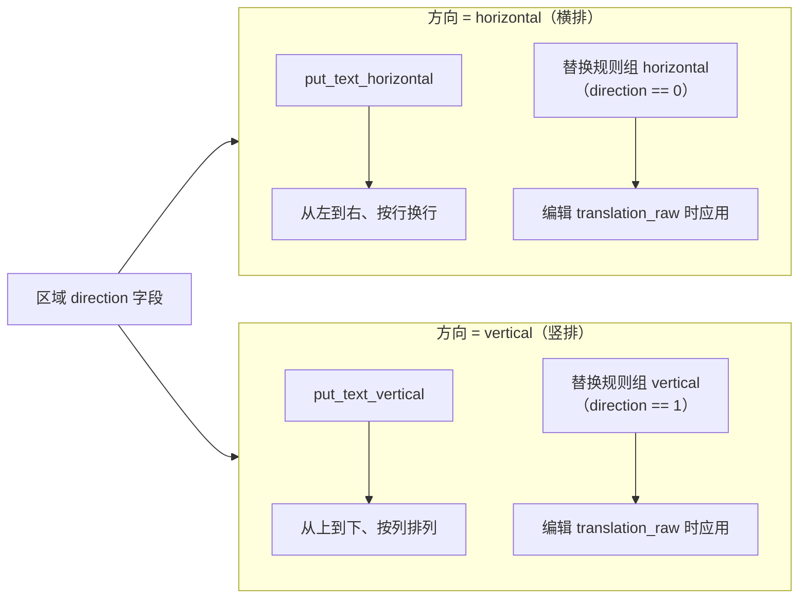

# 文本属性

当需要让某一句台词更醒目、把文字改成竖排、调整行距字距或旋转文字区域时，在编辑器的“属性编辑”（`Property Editor`）中修改文本排版属性。本页介绍属性面板中与文本排版有关的字段：字体、字号、字体颜色、行间距、字间距、角度、对齐与方向，以及这些字段的选区语义、保存时机和渲染消费者。

文本内容本身的编辑（原文、译文、替换前译文、占位符/换行按钮、OCR/翻译按钮）见[区域列表与文本编辑](./region-list-and-text-editing.md)；样式预设与描边见[样式属性](./style-properties.md)；画布上的区域对齐/分布见[显示、对比与排列](./display-compare-and-arrange.md)。

## 功能边界 {#feature-boundary}

- 左栏“属性编辑”（`Property Editor`）面板从上到下包含“图像编辑”（`Image Editing`）、“文本内容”（`Text Content`）、“样式设置”（`Style Settings`）和“操作”（`Actions`）四个分区。本页覆盖“样式设置”中改变文字外观的排版字段：`Font:`、`Font Size:`、`Font Color:`、`Line Spacing:`、`Letter Spacing:`、`Angle:`、`Alignment:`、`Direction:`。
- “文本内容”（`Text Content`）与“操作”（`Actions`）两个分区归[区域列表与文本编辑](./region-list-and-text-editing.md)，本页只引用其字段名与写回语义，不重复展开。
- “样式设置”中的“样式组合：”（`Style Preset:`）、“描边颜色：”（`Stroke Color:`）、“描边宽度：”（`Stroke Width:`）归[样式属性](./style-properties.md)。
- “图像编辑”中的蒙版/画笔/印章工具与图层归[画布工具与选区](./canvas-tools-and-selection.md)及[蒙版、画笔与仿制印章](./mask-paint-and-clone-stamp.md)。
- 属性面板的“对齐：”（`Alignment:`）是文字在文本框内的对齐方式（自动/左/居中/右），不是把多个文字框互相对齐的“排列”动作；后者归[显示、对比与排列](./display-compare-and-arrange.md)。

## UI 操作 {#ui-operations}

### 属性面板分区与选区语义 {#panel-sections-and-selection}

打开编辑器后，左栏默认显示“属性编辑”（`Property Editor`）。选区状态决定四个分区的可用性，由 `PropertyPanel.on_selection_changed()` 统一处理：

| 选区状态 | 文本内容 | 样式设置 | 操作 | 行为 |
| --- | --- | --- | --- | --- |
| 无选区 | 禁用 | 禁用 | 禁用 | 清空原文/译文框，字号重置为 12，行距/字距重置为 1.0，角度重置为 0，颜色恢复默认 |
| 单选 | 启用 | 启用 | 启用 | 面板显示该区域全部字段，可编辑文本与排版属性 |
| 多选 | 禁用 | 启用 | 启用 | 文本框清空但不禁用样式控件；排版修改以一条撤销命令同时应用到全部选中区域 |

多选时没有“混合值”专用 UI：样式控件保留原值，任何修改都会发出 `style_patch_requested(选中索引列表, patch)`，由 controller 归一化后合并成一次 `MultiRegionUpdateCommand`。

### 修改排版字段 {#edit-typography-fields}

1. 在画布上单选一个文字区域，“样式设置”（`Style Settings`）分区启用。
2. “字体：”（`Font:`）是带搜索的 `FontComboBox`，列出系统字体与项目 `fonts/` 目录注册的字体；选择后写回区域 `font_family`。
3. “字体大小：”（`Font Size:`）是数值框（8–1000）加滑条（8–150），两者联动；超出滑条范围的数值仍可通过数值框输入。
4. “字体颜色：”（`Font Color:`）是颜色选择器，最近使用的颜色会保存到配置的 `saved_colors`。
5. “行间距：”（`Line Spacing:`）与“字间距：”（`Letter Spacing:`）范围 0.1–5.0、步长 0.1，初始 1.0，按基本间距的倍率生效。
6. “角度：”（`Angle:`）范围 -9999–9999°，步长 1，带 `°` 后缀；修改会以白框中心为轴旋转区域几何。
7. “对齐：”（`Alignment:`）下拉提供自动/左对齐/居中/右对齐；“方向：”（`Direction:`）下拉只提供横排/竖排（`auto` 被排除，见[参数与选项](#parameters)）。
8. 每个控件变化都会立即发出样式补丁信号，不要求点击“保存”；同一批修改合并为一条可撤销命令。

### 文本内容与操作区 {#text-content-and-actions}

“文本内容”（`Text Content`）分区维护原文 `text`、最终译文 `translation`、替换前译文 `translation_raw` 三个字段；“显示替换前译文”（`Show Translation (Raw)`）默认勾选，勾选时编辑的是 `translation_raw`，并实时经过替换规则生成 `translation`。“操作”（`Actions`）分区提供复制/粘贴/删除。两者的字段写回、`↵`/`[BR]` 转换、占位符/换行按钮和 OCR/翻译按钮详见[区域列表与文本编辑](./region-list-and-text-editing.md)。

## UI 文案三列对照 {#ui-copy-matrix}

以下 key 均存在 `desktop_qt_ui/locales/en_US.json` 与 `zh_CN.json` 的实际值，取值与 `doc/wiki/data/i18n.generated.json` 一致。

| UI 调用 key | English 实际值 | 简体中文实际值 |
| --- | --- | --- |
| `Property Editor` | Property Editor | 属性编辑 |
| `Text Content` | Text Content | 文本内容 |
| `Style Settings` | Style Settings | 样式设置 |
| `Actions` | Actions | 操作 |
| `Image Editing` | Image Editing | 图像编辑 |
| `Original Text:` | Original Text: | 原文: |
| `Show Translation (Raw)` | Show Translation (Raw) | 显示替换前译文 |
| `Translated Text:` | Translated Text: | 译文: |
| `Placeholder` | Placeholder | 占位符 |
| `Newline↵` | Newline↵ | 换行↵ |
| `Character count: 0` | Character count: 0 | 字符数: 0 |
| `OCR Model:` | OCR Model: | OCR模型: |
| `Recognize` | Recognize | 识别 |
| `Translator:` | Translator: | 翻译器： |
| `Translate` | Translate | 翻译 |
| `Target Language:` | Target Language: | 目标语言： |
| `Font:` | Font: | 字体： |
| `Font Size:` | Font Size: | 字体大小： |
| `Font Color:` | Font Color: | 字体颜色： |
| `Line Spacing:` | Line Spacing: | 行间距： |
| `Letter Spacing:` | Letter Spacing: | 字间距： |
| `Angle:` | Angle: | 角度： |
| `Alignment:` | Alignment: | 对齐： |
| `Direction:` | Direction: | 方向： |
| `Copy` | Copy | 复制 |
| `Paste` | Paste | 粘贴 |
| `Delete` | Delete | 删除 |

“对齐：”下拉的四个存储值与“方向：”下拉的两个显示值：

| 存储值 | English 实际值 | 简体中文实际值 |
| --- | --- | --- |
| `auto`（`alignment_auto`） | Auto | 自动 |
| `left`（`alignment_left`） | Left | 左对齐 |
| `center`（`alignment_center`） | Center | 居中 |
| `right`（`alignment_right`） | Right | 右对齐 |
| `h`（`direction_horizontal`） | Horizontal | 横排 |
| `v`（`direction_vertical`） | Vertical | 竖排 |

## 参数与选项 {#parameters}

#### `font_family` — 字体 / Font {#font-family}

- 控件：带搜索的字体下拉（`FontComboBox`）。
- 所在界面：属性编辑 → 样式设置 → “字体：”；UI 调用 key 为 `Font:`。
- 存储值：Qt 字体族名（family name），不是字体文件路径；空字符串表示未设置。
- 可选值：系统字体与项目 `fonts/` 目录中注册的可缩放字体；显示名按当前语言本地化，存储值始终是字体族名。以 `[` 开头的家族名、位图字体与歧义家族会被过滤。
- 默认值：区域缺省无 `font_family`；渲染服务 `RenderParameters.font_family` 为空时回退配置 `render.font_family`，再不可用时回退 `text_render.DEFAULT_FONT_FAMILY`。
- 生效阶段：编辑器画布文本渲染与导出渲染（排版）。
- 原理：`FontComboBox.currentFamily()` 返回下拉项 data 中的字体族名；`_on_font_family_changed` 发出 `{"font_family": ...}` 补丁。渲染端 `apply_font_for_render()` 先 `set_font()` 再测量；字体不可用时记录警告并回退默认字体，不会让画布空白。
- 依赖与冲突：字体族名必须是 Qt 实际可解析的 family；手改 JSON 时写文件路径不会生效。
- 性能/API 成本：无网络成本；字体缺失时仅回退渲染，不阻塞其他阶段。
- 关联文件和调试产物：`fonts/` 目录（`.ttf`/`.otf`/`.ttc`）注册进 Qt，`text_render.register_font_file()`；区域数据 `font_family` 持久化到 `*_translations.json`。
- 图示：不需要（单一字体族选择，不切换处理阶段；缺失回退无用户可见分支差异）。
- 源码依据：控件 `desktop_qt_ui/utils/font_list.py#FontComboBox`；补丁 `desktop_qt_ui/ui/widgets/property_panel.py#_on_font_family_changed`；渲染 `desktop_qt_ui/editor/text_renderer_backend.py#apply_font_for_render`。
- 验证状态：源码/i18n 静态核对完成；GUI 字体选择待完整桌面验收。

#### `font_size` — 字号 / Font Size {#font-size}

- 控件：数值框（8–1000）加滑条（8–150），两者联动。
- 所在界面：属性编辑 → 样式设置 → “字体大小：”；UI 调用 key 为 `Font Size:`。
- 存储值：整数像素字号；区域 `font_size` 字段。
- 可选值：整数；滑条 8–150，数值框 8–1000，controller 归一化时下限钳制为 1。
- 默认值：面板无选区重置为 12；区域缺省读 `region_data.get("font_size", 12)`；渲染服务 `RenderParameters.font_size` 为 12；导出时区域缺省回退 16；新区域按白框高度 60% 自动估算（8–72）。三者按来源分别记录，不应合并。
- 生效阶段：编辑器画布文本渲染与导出渲染（排版）。
- 原理：数值框/滑条任一变化都发出 `{"font_size": int}` 补丁；字号属于字体影响字段，写回后 `_sync_white_frame_size_for_font_change()` 会按 `calc_box_from_font()` 反算白框尺寸，并保持正文中心不移动。
- 依赖与冲突：`Ctrl+滚轮` 会调整所有选中区域字号，见[快捷键](./shortcuts.md)；字号变化会改变白框尺寸，可能让框与相邻区域重叠。
- 性能/API 成本：无网络成本；字号越大渲染像素量越高。
- 关联文件和调试产物：区域数据 `font_size` 持久化到 `*_translations.json`；不产生独立调试文件。
- 图示：不需要（单数值偏移，无分支；白框联动见[样式补丁的合并与保存时机](#style-patch-flow)）。
- 源码依据：控件范围 `desktop_qt_ui/ui/widgets/property_panel.py:721`；补丁与钳制 `:1780`、`desktop_qt_ui/editor/editor_controller.py:1317`；白框同步 `editor_controller.py#_sync_white_frame_size_for_font_change`。
- 验证状态：源码/i18n 静态核对完成；滑条与数值框联动待运行验证。

#### `font_color` — 字体颜色 / Font Color {#font-color}

- 控件：颜色选择器（`ColorPickerWidget`）。
- 所在界面：属性编辑 → 样式设置 → “字体颜色：”；UI 调用 key 为 `Font Color:`。
- 存储值：`#RRGGBB` 十六进制字符串；区域 `font_color` 字段。
- 可选值：任意有效十六进制颜色；不是枚举下拉。
- 默认值：选择器组件默认 `#000000`；区域缺省先读 `font_color`，再读 OCR 的 `fg_colors`（RGB 列表），最后回退配置 `render.font_color`（默认 `#000000`）。
- 生效阶段：编辑器画布文本渲染与导出渲染（排版）。
- 原理：补丁 `{"font_color": hex}` 直接写回区域；`build_text_block_from_region()` 把十六进制转成 RGB 元组给 `fg_color`，`text_renderer_backend` 优先读当次渲染快照 `render_params['font_color']`，避免画布预览停留在旧 `fg_colors`。
- 依赖与冲突：最近使用颜色写入配置 `saved_colors`，属于应用配置而非区域数据；`disable_font_border` 只影响描边不影响字体颜色。
- 性能/API 成本：无。
- 关联文件和调试产物：区域数据 `font_color`/`fg_colors`；配置 `saved_colors` 记录最近颜色。
- 图示：不需要（颜色值无分支）。
- 源码依据：控件 `desktop_qt_ui/ui/widgets/property_panel.py:731`；补丁 `:1814`；渲染转换 `desktop_qt_ui/editor/text_render_pipeline.py#build_text_block_from_region`。
- 验证状态：源码/i18n 静态核对完成；颜色拾取交互待运行验证。

#### `line_spacing` — 行间距 / Line Spacing {#line-spacing}

- 控件：浮点数值框。
- 所在界面：属性编辑 → 样式设置 → “行间距：”；UI 调用 key 为 `Line Spacing:`。
- 存储值：0.1–5.0 的浮点倍率；区域 `line_spacing` 字段；`1.0` 表示基本行距。
- 可选值：步长 0.1；不是枚举下拉。
- 默认值：控件初始 1.0；区域缺省 1.0；渲染服务 `RenderParameters.line_spacing` 为 1.0。
- 生效阶段：编辑器画布文本渲染与导出渲染（排版）。
- 原理：补丁 `{"line_spacing": float}` 写回；渲染端作为 `line_spacing_multiplier` 传入 `put_text_horizontal`/`put_text_vertical`；属于字体影响字段，变化会触发白框尺寸反算。
- 依赖与冲突：多选时修改应用到全部选中区域；行距过大可能超出白框，需要重新同步尺寸。
- 性能/API 成本：无网络成本；不影响 API 请求。
- 关联文件和调试产物：区域数据 `line_spacing` 持久化到 `*_translations.json`。
- 图示：不需要（单一数值倍率，无分支）。
- 源码依据：控件 `desktop_qt_ui/ui/widgets/property_panel.py:762`；补丁 `:1832`；渲染 `desktop_qt_ui/editor/text_renderer_backend.py:163`。
- 验证状态：源码/i18n 静态核对完成；运行验证待完整桌面验收。

#### `letter_spacing` — 字间距 / Letter Spacing {#letter-spacing}

- 控件：浮点数值框。
- 所在界面：属性编辑 → 样式设置 → “字间距：”；UI 调用 key 为 `Letter Spacing:`。
- 存储值：0.1–5.0 的浮点倍率；区域 `letter_spacing` 字段；`1.0` 表示基本字距。
- 可选值：步长 0.1；不是枚举下拉。
- 默认值：控件初始 1.0；区域缺省 1.0；渲染服务 `RenderParameters.letter_spacing` 为 1.0。
- 生效阶段：编辑器画布文本渲染与导出渲染（排版）。
- 原理：补丁 `{"letter_spacing": float}` 写回；渲染端作为 `letter_spacing_multiplier` 传入文字渲染器；属于字体影响字段，变化触发白框尺寸反算。
- 依赖与冲突：与行间距同属间距倍率，互不影响；富文本浮动编辑器中的“字后间距”等是另一套按文本段的样式，见[浮动富文本](./floating-rich-text.md)。
- 性能/API 成本：无。
- 关联文件和调试产物：区域数据 `letter_spacing` 持久化到 `*_translations.json`。
- 图示：不需要（单一数值倍率，无分支）。
- 源码依据：控件 `desktop_qt_ui/ui/widgets/property_panel.py:770`；补丁 `:1838`；渲染 `desktop_qt_ui/editor/text_renderer_backend.py:164`。
- 验证状态：源码/i18n 静态核对完成；运行验证待完整桌面验收。

#### `angle` — 角度 / Angle {#angle}

- 控件：带 `°` 后缀的数值框。
- 所在界面：属性编辑 → 样式设置 → “角度：”；UI 调用 key 为 `Angle:`。
- 存储值：角度数值（-9999–9999）；区域 `angle` 字段。
- 可选值：步长 1；不是枚举下拉。
- 默认值：控件初始 0.0；区域缺省 0.0。
- 生效阶段：编辑器画布区域几何显示与导出渲染。
- 原理：`_on_angle_changed` 发出 `{"angle": float}` 补丁；controller 不把角度当纯样式存数，而是调用 `_build_rotated_region_data()` 以白框中心为轴旋转区域几何（中心、`lines`、白框），旋转结果写回区域数据。
- 依赖与冲突：角度会改写区域几何而非只改显示；与画布旋转手柄共用同一旋转数据通路；富文本浮动编辑器中的“局部旋转”是按文本段的独立样式，见[浮动富文本](./floating-rich-text.md)。
- 性能/API 成本：无网络成本；极端角度会放大渲染包围盒。
- 关联文件和调试产物：区域数据 `angle`、`lines`、`center`、白框字段持久化到 `*_translations.json`。
- 图示：不需要（数值旋转，无分支；几何旋转语义在参数说明中已表达）。
- 源码依据：控件 `desktop_qt_ui/ui/widgets/property_panel.py:778`；补丁 `:1844`；旋转 `desktop_qt_ui/editor/editor_controller.py#_build_rotated_region_data`、`editor/geometry_commit_pipeline.py`。
- 验证状态：源码/i18n 静态核对完成；旋转后几何一致性待运行验证。

#### `alignment` — 对齐 / Alignment {#alignment}

- 控件：下拉框。
- 所在界面：属性编辑 → 样式设置 → “对齐：”；UI 调用 key 为 `Alignment:`。
- 存储值：`auto` / `left` / `center` / `right`；区域 `alignment` 字段。
- 可选值：见[UI 文案三列对照](#ui-copy-matrix)中的对齐四项；映射定义在 `app_logic.py#get_display_mapping('alignment')`。
- 默认值：核心 `manga_translator/config.py#RenderConfig.alignment` 为 `auto`；渲染服务 `RenderParameters.alignment` 为 `center`；导出时区域缺省回退 `center`；`calculate_default_parameters()` 按框宽高自动给宽框 `center`、高窄框 `right`。
- 生效阶段：编辑器画布文本渲染与导出渲染（排版）。
- 原理：补丁 `{"alignment": text}` 经 `_normalize_alignment_value()` 归一化成存储值；`text_block.alignment` 直接传给 `put_text_horizontal`/`put_text_vertical`，控制文字在框内的水平/纵向对齐。
- 依赖与冲突：这是文字在框内的对齐；把多个文字框互相对齐的“排列”动作见[显示、对比与排列](./display-compare-and-arrange.md)。多选修改应用到全部选中区域。
- 性能/API 成本：无。
- 关联文件和调试产物：区域数据 `alignment` 持久化到 `*_translations.json`。
- 图示：不需要（四个取值进入同一渲染对齐参数，不切换算法分支）。
- 源码依据：映射 `desktop_qt_ui/app_logic.py:1093`；归一化 `desktop_qt_ui/editor/editor_controller.py#_normalize_alignment_value`；渲染 `desktop_qt_ui/editor/text_renderer_backend.py:185`。
- 验证状态：源码/i18n 静态核对完成；各对齐值渲染差异待运行验证。

#### `direction` — 方向 / Direction {#direction}

- 控件：下拉框。
- 所在界面：属性编辑 → 样式设置 → “方向：”；UI 调用 key 为 `Direction:`。
- 存储值：`horizontal` / `vertical`（内部也写作 `h` / `v`）；区域 `direction` 字段。
- 可选值：下拉排除 `auto`，只显示 `direction_horizontal`（Horizontal / 横排）与 `direction_vertical`（Vertical / 竖排）；`auto` 的 i18n 值存在但不在该下拉中。
- 默认值：核心 `manga_translator/config.py#RenderConfig.direction` 为 `auto`；渲染服务 `RenderParameters.direction` 为 `auto`；属性面板显示时，区域没有显式方向时按白框宽高推断（高大于宽显示竖排，否则横排）。
- 生效阶段：编辑器画布文本渲染、导出渲染，以及“显示替换前译文”模式下替换规则组的选择。
- 原理：补丁 `{"direction": text}` 经 `_normalize_direction_value()` 归一化成 `horizontal`/`vertical`；渲染端把 `horizontal` 映射为 `h`、`vertical` 映射为 `v`，横排走 `put_text_horizontal`、竖排走 `put_text_vertical`；替换规则按方向选择 `horizontal`/`vertical` 组（`apply_replacements(text, direction)`，0=横排、1=竖排）。
- 依赖与冲突：方向属于字体影响字段，变化触发白框尺寸反算；竖排时“横排”替换规则不执行。
- 性能/API 成本：无网络成本；不同方向只改变渲染与替换分组。
- 关联文件和调试产物：区域数据 `direction` 持久化到 `*_translations.json`；`config/text_replacements.yaml` 中的横/竖排规则组。
- 图示：必须有方向分支 Mermaid，见[方向如何改变渲染](#direction-render)。
- 源码依据：映射 `desktop_qt_ui/app_logic.py:1099`（`repopulate_options` 排除 `auto` 见 `property_panel.py:940`）；归一化 `editor_controller.py#_normalize_direction_value`；渲染 `desktop_qt_ui/editor/text_render_pipeline.py#build_text_block_from_region`、`text_renderer_backend.py:179`；替换 `manga_translator/rendering/text_replacements.py#apply_replacements`。
- 验证状态：源码/i18n 静态核对完成；横/竖排渲染与替换差异待运行验证。

## 运行机理 {#runtime-behavior}

### 样式补丁的合并与保存时机 {#style-patch-flow}

排版字段没有独立的“保存”按钮：控件变化即通过 `style_patch_requested` 发出补丁，`EditorController.update_region_style_patch()` 会先过滤 `_STYLE_PATCH_FIELDS`、归一化取值（`font_size` 下限 1、间距/描边转浮点、`stroke_color` 转 `bg_colors` RGB、`alignment`/`direction` 归一化），再把所有选中区域合并成一条 `MultiRegionUpdateCommand`，因此一次修改可以用 `Ctrl+Z` 整批撤销。`block_updates` 标志阻止面板回填时再次发信号造成循环。

```mermaid
flowchart LR
    A["排版控件变化\n（字体/字号/颜色/间距/角度/对齐/方向）"] --> B["style_patch_requested\n(选中索引, patch)"]
    B --> C["update_region_style_patch"]
    C --> D["过滤 _STYLE_PATCH_FIELDS 并归一化"]
    D --> E{"angle 在补丁中?"}
    E -->|是| R["以白框中心旋转区域几何"]
    E -->|否| F["逐字段比较旧值，跳过未变化区域"]
    R --> F
    F --> G["字体影响字段?\nfont_size/font_family/line_spacing/\nletter_spacing/direction"]
    G -->|是| S["同步白框尺寸\ncalc_box_from_font 反算"]
    G -->|否| H["MultiRegionUpdateCommand\n（一条撤销命令）"]
    S --> H
    H --> I["EditorModel 更新全部选中区域"]
    I --> J["画布重渲染 + 撤销历史"]
```

### 方向如何改变渲染 {#direction-render}

方向是唯一会切换渲染函数与替换规则组的排版字段：横排走 `put_text_horizontal` 并应用 `horizontal` 替换组，竖排走 `put_text_vertical` 并应用 `vertical` 替换组。编辑 `translation_raw` 时，`apply_replacements()` 按该区域当前方向选组，因此同一段替换前文本在横竖排下可能得到不同最终译文。

区域没有显式方向时，属性面板按白框宽高推断显示值（高大于宽显示竖排），但不会自动写入区域 `direction`；渲染服务则在 `calculate_default_parameters()` 中按宽高比给出默认方向（宽高比大于 2 为横排、小于 0.5 为竖排、否则 `auto`）。

## 依赖与冲突 {#dependencies-and-conflicts}

- 排版字段的写回依赖单选或纯样式多选：多选时文本内容区禁用，只有排版修改会广播到全部选中区域。
- 正在编辑的文本控件在常规刷新中不会被覆盖，只有异步任务写回（`source="async"`）才强制刷新，避免丢光标或 IME 组合字。
- 属性面板的滑条、数值框和下拉只在自身获得键盘焦点时吞滚轮；未聚焦时滚轮交给父滚动区域，不会误改值。
- `Ctrl+滚轮` 调整所有选中区域字号、`Shift+滚轮` 调整共享画笔大小，这两类组合被快捷键管理器拦截，见[快捷键](./shortcuts.md)。
- 字号、字距、行距、方向属于字体影响字段，写回后同步白框尺寸；同步只改框的宽高和中心，正文中心保持不动。
- 属性面板“对齐：”是文字在框内的对齐；“排列”菜单的六向对齐/分布是把文字框互相对齐，两者不要混用。
- 字体不可用时不阻塞渲染，回退默认字体并记录警告；手改 JSON 时写入字体文件路径而不是字体族名不会生效。
- 描边颜色/宽度与样式预设归[样式属性](./style-properties.md)，本页不重复其参数定义。

## 关联文件与格式 {#related-files}

| 文件/格式 | 本页实际作用 | 手改与兼容注意 |
| --- | --- | --- |
| `<image-dir>/manga_translator_work/json/<stem>_translations.json` | 区域数据持久化：`regions` 数组含 `font_family`、`font_size`、`font_color`/`fg_colors`、`bg_colors`、`stroke_width`、`line_spacing`、`letter_spacing`、`angle`、`alignment`、`direction` 等字段 | 编辑器导出时写盘并标记 `skip_text_replacements=True`（编辑器 `translation` 已是终稿）；文档不展示真实用户路径与图片 |
| `fonts/` 目录（`.ttf`/`.otf`/`.ttc`） | 项目字体注册进 Qt，供“字体：”下拉与渲染使用 | 字体按族名匹配；以 `[` 开头的家族名会被改写，避免 Qt foundry 语法解析成空家族 |
| `config/text_replacements.yaml` | 横/竖排替换规则组 | 编辑 `translation_raw` 时按区域方向实时应用 |
| `config/config.json` | `render.font_color`、`render.font_family` 等渲染默认与 `saved_colors` | 不读取或展示真实用户文件，不提交私有绝对路径 |

## 源码依据 {#source-evidence}

| 层级 | 文件 | 本页核对内容 |
| --- | --- | --- |
| 属性面板 UI | `desktop_qt_ui/ui/widgets/property_panel.py` | 样式设置分区控件、选区启停、`_update_display` 回填、`style_patch_requested` 发射、方向/对齐映射填充 |
| 字体下拉 | `desktop_qt_ui/utils/font_list.py` | `FontComboBox`、系统/项目字体枚举、本地化显示、`currentFamily()` 存储值 |
| 控制器 | `desktop_qt_ui/editor/editor_controller.py` | `update_region_style_patch`、`_STYLE_PATCH_FIELDS`、归一化、角度旋转、`MultiRegionUpdateCommand`、白框同步 |
| 渲染参数 | `desktop_qt_ui/services/render_parameter_service.py` | `RenderParameters` 默认、`calculate_default_parameters`、`_apply_region_overrides`、`export_parameters_for_backend` |
| 渲染管线 | `desktop_qt_ui/editor/text_render_pipeline.py`、`text_renderer_backend.py` | `TextBlock` 构建、字体回退、`font_color` 解析、`put_text_horizontal`/`put_text_vertical` 消费者 |
| 替换规则 | `manga_translator/rendering/text_replacements.py` | `apply_replacements(text, direction)` 横/竖排分组 |
| 视图接线 | `desktop_qt_ui/ui/editor/view.py` | 属性面板文本/样式信号连接、异步强制刷新 |
| 持久化 | `desktop_qt_ui/services/export_service.py`、`editor/controller_export_service.py` | 区域 JSON 写盘、`skip_text_replacements`、缺省字段回退 |
| UI/i18n | `desktop_qt_ui/locales/en_US.json`、`zh_CN.json`、`doc/wiki/data/i18n.generated.json` | 表格中 key 与两种语言实际显示值 |

## 验证记录 {#verification}

| 验证内容 | 状态 | 说明 |
| --- | --- | --- |
| BLUEPRINT、PAGE_GUIDELINES、TODO | 完成 | 已完整读取并按页面合同编写；本页 TODO 保持 `[未开工]`，由主代理统一勾选 |
| UI 布局与调用 | 完成 | 静态核对属性面板四个分区、排版控件范围、`_update_display` 回填与样式补丁发射 |
| `en_US` / `zh_CN` 实际 locale | 完成 | 三列表逐项核对，与 `i18n.generated.json` 一致 |
| 排版属性运行链 | 完成 | 静态核对补丁合并、多选语义、白框同步、横/竖排渲染分支与替换分组 |
| 脱敏运行验证 | 待后续 | 未启动 GUI、未截图；未读取真实用户图片、`.env`、密钥或私有任务产物 |
| VitePress | 待运行 | 由协调代理在合并前运行 `npm run docs:build --prefix doc/wiki` 及镜像/源码检查 |