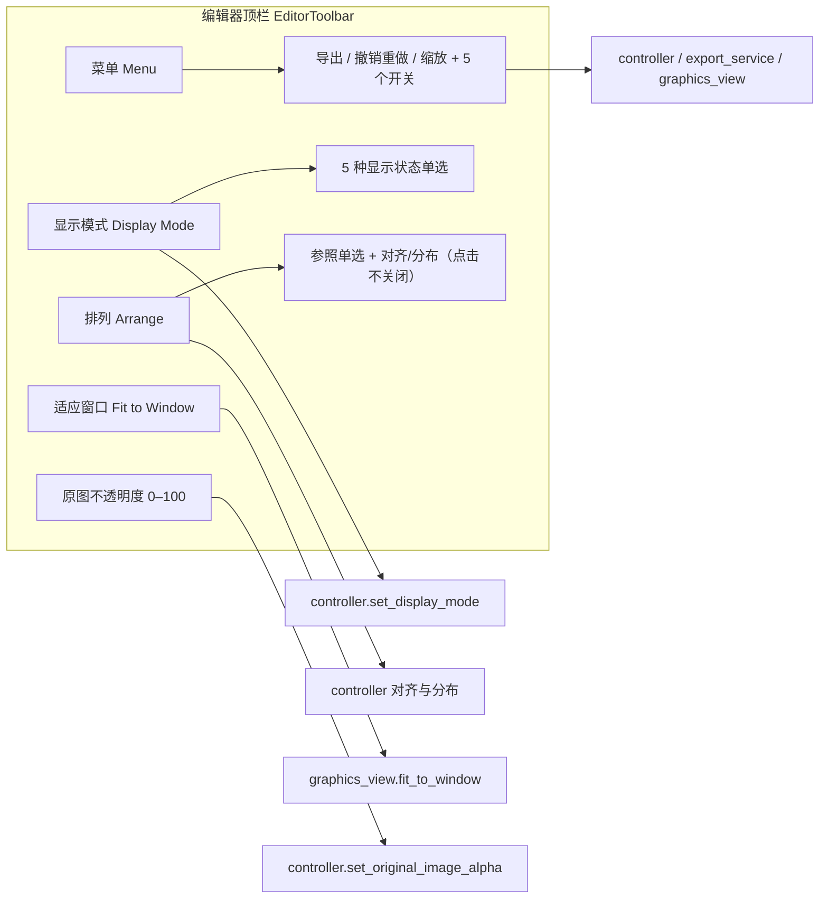

# 编辑器工具栏与菜单

进入编辑器后，顶部有一条固定的横向工具栏。它把高频操作收进三个单级下拉菜单（“菜单”、“显示模式”、“排列”），并保留“适应窗口”和“原图不透明度”两个常驻控件。本页说明这三个菜单的展开方式、每个菜单项的去向，以及五个编辑开关的存储与持久化。

“显示模式”和“排列”两个菜单的完整选项与画布效果见[显示、对比与排列](./display-compare-and-arrange.md)；画布工具、属性面板、富文本浮窗、快捷键和导入导出分别见[画布工具与选区](./canvas-tools-and-selection.md)、[文本属性](./text-properties.md)、[样式属性](./style-properties.md)、[浮动富文本](./floating-rich-text.md)、[快捷键](./shortcuts.md)和[导入导出与写回](./import-export-and-writeback.md)。

## 功能边界

- 工具栏本身不负责页面切换：返回主页的入口在主窗口侧边栏，不在编辑器顶栏。
- “菜单”下拉包含导出、撤销/重做、放大/缩小和五个可勾选开关；五个开关写入 `app` 段配置并持久化。
- “显示模式”是互斥单选，决定画布显示原图、文字、框线、都不显示或双栏对比；“排列”提供参照单选、对齐和间距分布。两者的完整选项归[显示、对比与排列](./display-compare-and-arrange.md)。
- 放大/缩小只是视图缩放：`Zoom In (+)` / `Zoom Out (-)` 每步按 1.15 倍缩放，画布倍率钳制在 `0.05`–`50.0`；“适应窗口”只做视图适配，两者都不修改任何区域数据。
- “原图不透明度”滑条（0–100）只控制画布中原图覆盖层的透明度，不是导出参数。
- 快捷键的真实注册不在工具栏：导出 `Ctrl+Q`、撤销 `Ctrl+Z`、重做 `Ctrl+Y` 由 `EditorShortcutManager` 全局注册，工具栏只显示提示文字，见[快捷键](./shortcuts.md)。

## UI 操作

### 三个下拉菜单

1. 打开“菜单”（`Menu`）：显示“导出图片”（`Export Image`，代码追加 `(Ctrl+Q)` 提示）、撤销/重做（`Undo` / `Redo`，提示 `Ctrl+Z` / `Ctrl+Y`）、放大/缩小（`Zoom In (+)` / `Zoom Out (-)`），以及五个带勾选标记的编辑开关。
2. 打开“显示模式”（`Display Mode`）：单选切换五种画布显示状态；详细效果见[显示、对比与排列](./display-compare-and-arrange.md)。
3. 打开“排列”（`Arrange`）：先选参照（选区/画布），再点对齐或分布；菜单在点击后保持打开，方便连续操作。详细选项见[显示、对比与排列](./display-compare-and-arrange.md)。

### 常驻控件

- 点击“适应窗口”（`Fit to Window`）：把当前图片完整缩放到画布可视区域，保持宽高比。
- 拖动“原图不透明度:”（`Original Image Opacity:`）滑条：`0` 表示完全透明（看到修复/去字后的底图），`100` 表示完全不透明（看到原图）；初始为 `0`。

## 选项中英对照

| UI 调用 key | English 实际值 | 简体中文实际值 |
| --- | --- | --- |
| `Menu` | Menu | 菜单 |
| `Display Mode` | Display Mode | 显示模式 |
| `Arrange` | Arrange | 排列 |
| `Fit to Window` | Fit to Window | 适应窗口 |
| `Original Image Opacity:` | Original Image Opacity: | 原图不透明度: |
| `Export Image` | Export Image | 导出图片 |
| `Undo` | Undo | 撤销 |
| `Redo` | Redo | 重做 |
| `Zoom In (+)` | Zoom In (+) | 放大 (+) |
| `Zoom Out (-)` | Zoom Out (-) | 缩小 (-) |
| `Enable Editor Snapping` | Enable Editor Snapping | 启用编辑器吸附 |
| `Scale Text Boxes from Center` | Scale Text Boxes from Center | 中心点缩放 |
| `Show Rich Text Editor Popup` | Show Rich Text Editor Popup | 显示富文本编辑弹窗 |
| `Auto Apply Rich Text Rules While Editing` | Auto Apply Rich Text Rules While Editing | 编辑时自动应用富文本规则 |
| `Auto Export on Image Switch` | Auto Export on Image Switch | 切图时自动导出 |

“导出图片”、“撤销”、“重做”后面的 `(Ctrl+Q)`、`(Ctrl+Z)`、`(Ctrl+Y)` 是代码在 i18n 值之后追加的提示文字，不是 locale 值的一部分；真正触发由快捷键管理器完成。“显示模式”与“排列”的完整选项值（如 `Show Text and Boxes`、`Align Left`、`Distribute Vertical Spacing`）在[显示、对比与排列](./display-compare-and-arrange.md)逐项列出。

## 运行机理

### 菜单展开与语言切换

三个下拉按钮都是单级菜单，没有二级子菜单；图标、勾选/单选标记和文字列独立排列：

- “菜单”使用带左侧选中标记列的 `CheckableMenu`：五个开关被勾选时显示标记列，图标列与文字列独立排列。
- “显示模式”的五个状态和“排列”的参照选项都是 `QActionGroup` 互斥单选。
- “排列”菜单是“点击不关闭”菜单：选择参照或执行一次对齐/分布后菜单保持展开，方便连续操作；点击菜单外或按 `Esc` 才关闭。
- 语言切换时 `EditorView.refresh_ui_texts()` 调用 `EditorToolbar.refresh_ui_texts()`，三个菜单整体重建，并从内部字段恢复显示模式、参照、开关和启用状态，避免状态丢失。
- 窗口过窄时工具栏内容放进横向滚动区，不换行、不折叠。

### 导出与切图自动导出

- 点击“导出图片”（或按 `Ctrl+Q`）：`EditorView.export_image()` → `controller.export_image()`，先 `commit_pending_edits()` 提交未保存编辑，再交给后台导出队列（`EditorControllerExportService`）执行；导出进度用 Toast 展示，失败有独立错误提示。
- 加载图片开始前 `toolbar.set_export_enabled(False)` 禁用导出，数据应用完成后再启用。
- “切图时自动导出”（`Auto Export on Image Switch`）控制切图时如何处理未保存编辑：
  - 开启：有未保存编辑时自动执行导出（`automatic=True`）；导出被拒绝则中止切图。
  - 关闭：弹出“未保存的编辑”三按钮对话框（“导出图片”/“不保存”/“取消”）。这三个按钮当前是源码硬编码中文，没有 i18n key，属于已知缺失项，不虚构英文标签。
- 自动导出的消费方在切图时直接读取配置，不依赖视图内存状态。

### 撤销与重做

- 撤销/重做通过 `QUndoStack`（`history_service`）实现；每次命令状态变化后由 controller 更新工具栏的撤销/重做启用状态。
- 工具栏上的快捷键文字只是提示；带焦点感知的实际注册在 `EditorShortcutManager`。

### 缩放与适应窗口

- “放大 (+)”/“缩小 (-)”每次调用 `_apply_zoom(1.15)` / `_apply_zoom(1 / 1.15)`，目标倍率钳制在 `0.05`–`50.0`。
- 画布滚轮同样缩放（向上放大、向下缩小，倍率 1.15），锚点在鼠标位置。
- “适应窗口”调用 `fitInView(..., KeepAspectRatio)` 把当前图片完整放入可视区。

### 原图不透明度

- 滑条值 `0`–`100` 映射为 `0.0`–`1.0`：`0` 完全透明（显示修复/去字底图），`100` 完全不透明（显示原图）。
- 加载图片时若用户尚未手动调整过透明度，默认值按“是否有修复图”决定：有修复图取 `0`，无修复图取 `1`；用户一旦拖动滑条，本次会话不再自动覆盖（`_user_adjusted_alpha`）。
- 滑条变化经模型 `original_image_alpha_changed` 信号反向同步回工具栏，外部修改也能刷新滑条位置。

### 五个开关的持久化

| 存储值 | English 实际值 | 简体中文实际值 | 默认值 | 写入路径 |
| --- | --- | --- | --- | --- |
| `app.editor_snap_enabled` | Enable Editor Snapping | 启用编辑器吸附 | `false` | 菜单 → `snap_enabled_changed` → `config_service.update_config` + `save_config_file` |
| `app.editor_center_scale_enabled` | Scale Text Boxes from Center | 中心点缩放 | `false` | 同上，`center_scale_enabled_changed` |
| `app.editor_rich_text_popup_enabled` | Show Rich Text Editor Popup | 显示富文本编辑弹窗 | `true` | 同上，`rich_text_popup_enabled_changed` |
| `app.editor_auto_rich_text_rules` | Auto Apply Rich Text Rules While Editing | 编辑时自动应用富文本规则 | `true` | 同上，`auto_rich_text_rules_changed` |
| `app.editor_auto_export_on_switch` | Auto Export on Image Switch | 切图时自动导出 | `true` | 同上，`auto_export_on_switch_changed` |

Qt 模型 `desktop_qt_ui/core/config_models.py#AppSection`、发行示例 `config/config-example.json` 和 `EditorToolbar` 构造默认值保持一致。配置变化通过 `config_changed` 信号回写工具栏按钮状态，外部修改或配置重载也能同步。

## 依赖与冲突

- 工具栏只显示快捷键文字而不注册 `QAction` 快捷键，避免与 `EditorShortcutManager` 的焦点感知注册双重触发。
- 焦点在文本框时，撤销/重做等编辑快捷键留给文本控件；`Q`/`W`/`E`/`A`/`D` 被转发为文字而不是切工具/切图；`Ctrl+Q` 导出不受影响。详见[快捷键](./shortcuts.md)。
- “排列”菜单的可用状态与选区数量相关：以画布为参照时选 1 个区域即可对齐，以选区为参照需 2 个，间距分布需 3 个。
- “切图时自动导出”依赖导出队列和图片加载流程：自动导出被拒绝会中止切图；手动选择“导出图片”时，切图会等导出完成后再继续。
- 导出是异步队列任务，与编辑器取消/清理共用状态机；应用关闭时先排空导出队列再退出。
- 关闭“显示富文本编辑弹窗”后，已显示的浮窗立即隐藏；画布仍保留焦点，不改变删除/快捷键语义。

## 关联文件与格式

| 文件/格式 | 本页实际作用 | 手改与兼容注意 |
| --- | --- | --- |
| `config/config-example.json` | 发行示例中五个编辑器开关的默认值 | 只使用脱敏示例；导入用户配置会覆盖内存设置 |
| `config/config.json` | 运行时用户设置的持久化位置 | 不读取或展示真实用户文件；不要把私有绝对路径提交到文档 |
| `desktop_qt_ui/locales/en_US.json` / `zh_CN.json` | “菜单”“显示模式”“排列”及全部菜单项/常驻控件的翻译 | 缺 key 时如实标记缺失/回退，不擅自补译 |
| `desktop_qt_ui/ui/widgets/editor_toolbar.py` | 工具栏全部控件与菜单构建 | 导出/撤销/重做的快捷键文字由代码追加，不属于 locale 值 |
| `desktop_qt_ui/ui/editor/view.py` | 工具栏创建、信号接线、配置同步与语言刷新 | 五个开关经 `config_service` 持久化 |

## Mermaid 数据流限制

上图描述源码确认的工具栏结构和信号去向，不代表所有操作都会触发导出或网络请求；导出失败、无选区、无图片等场景有各自的分支。本页没有伪造运行截图或私有任务产物。

## 源码依据 {#source-evidence}

| 层级 | 文件 | 本页核对内容 |
| --- | --- | --- |
| UI | `desktop_qt_ui/ui/widgets/editor_toolbar.py` | 三个下拉菜单、常驻控件、五个开关、勾选/单选/点击不关闭行为和语言重建 |
| 视图接线 | `desktop_qt_ui/ui/editor/view.py` | 工具栏创建与固定高度、信号接线、`_on_config_changed` 同步、`refresh_ui_texts` |
| 控制器/服务 | `desktop_qt_ui/editor/editor_controller.py`、`controller_export_service.py`、`controller_document_service.py` | 导出队列、切图自动导出/未保存对话框、撤销重做状态、透明度映射 |
| 画布视图 | `desktop_qt_ui/ui/editor/graphics_view_input.py`、`graphics_view.py` | 缩放倍率与钳制、滚轮缩放、适应窗口 |
| 配置模型 | `desktop_qt_ui/core/config_models.py`、`config/config-example.json` | 五个开关的 Qt 模型与发行默认值 |
| UI/i18n | `desktop_qt_ui/locales/en_US.json`、`zh_CN.json` | key 映射和实际中英文显示值 |

## 验证记录 {#verification}

| 验证内容 | 状态 | 说明 |
| --- | --- | --- |
| BLUEPRINT、PAGE_GUIDELINES、TODO | 完成 | 已完整读取并按页面合同编写（1.3 节、5.10 小节） |
| UI 布局与调用 | 完成 | 静态核对 `editor_toolbar.py`、`view.py` 及导出/切图服务 |
| `en_US` / `zh_CN` 实际 locale | 完成 | 页面表格逐项记录 key、English、简体中文实际值 |
| 运行链（导出、缩放、透明度、持久化） | 完成 | 静态核对 export service、graphics_view、config_service |
| 脱敏运行验证 | 待后续 | 本页未读取真实用户配置、密钥、用户图片或私有任务产物 |
| VitePress | 待运行 | 由协调代理在合并前运行 `npm run docs:build --prefix doc/wiki` 及镜像/源码检查 |
