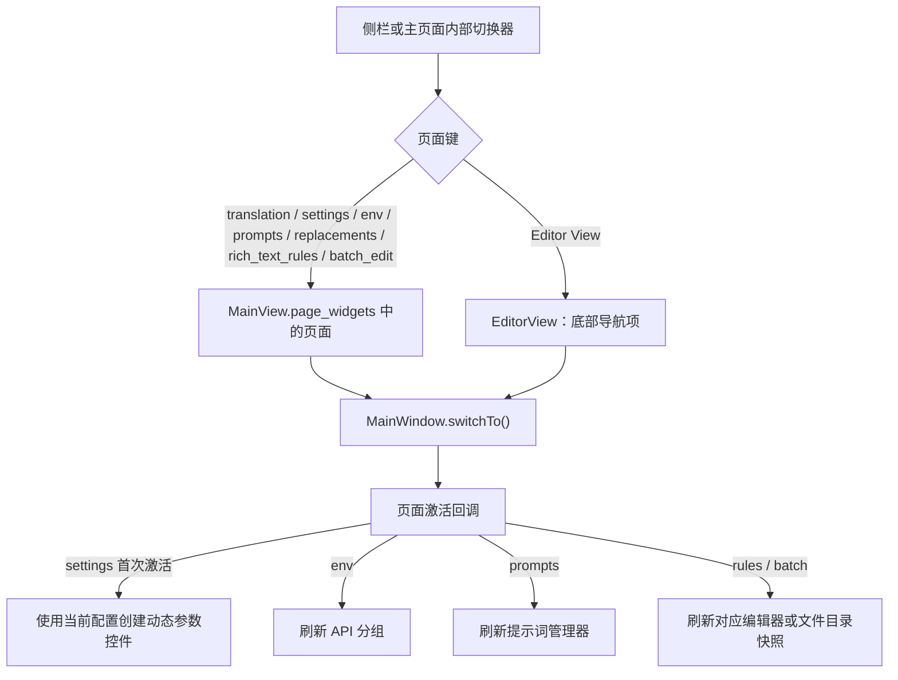

# 主导航与语言

本页说明桌面 Qt 窗口如何在翻译工作区、设置、API 管理、提示词、规则、批量管理和编辑器之间切换，并说明主题与界面语言的配置边界。文件列表、工作流按钮、编辑器内部工具和各二级弹窗分别由对应功能页负责。

## 功能边界 {#feature-boundary}

- 侧栏注册七个常规主页面；“编辑器视图”是单独的底部导航项，不属于这七个页面映射。
- 翻译页面是启动后的初始页面。侧栏收起时显示窄图标栏，悬停提示用于识别条目；展开宽度由窗口代码固定为 200px。
- 主题和语言控件位于主页面的“应用设置”区域，不是额外的侧栏导航项。语言切换影响桌面 UI 文本，不改变翻译目标语言。

## UI 操作 {#ui-operations}

### 使用主导航 {#use-main-navigation}

侧栏中的七个常规页面按以下顺序注册。表中的文字是代码调用的 i18n key 对应的两个 locale 实际值；图标只用于识别，不改变页面功能。

单独的底部导航项如下：

点击条目会切换到对应页面。翻译工作区内部的页面切换器同样按页面键调用窗口的 `switchTo()`；它不是另一套主页面注册表。

### 主题和语言 {#theme-and-language}

在主页面的应用设置中使用“主题：”和“语言：”下拉框。主题改变界面外观，语言改变控件文案；两者都会写入应用配置。

### 切换语言时会发生什么 {#switch-language}

1. 在“语言：”中选择目标语言。下拉框先隐藏弹出菜单，并把变更排到 Qt 事件循环的下一拍，避免同一次选择重复发射信号。
2. `MainWindow._change_language()` 调用 i18n 管理器设置 locale；成功后把 locale 写入 `app.ui_language`，更新 `config.json`，再调用全局文本刷新。
3. 窗口标题、内部动作、主页面文本、七个常规侧栏条目及收起状态提示会刷新。已创建的编辑器视图也会调用自身的 `refresh_ui_texts()`。
4. 切换语言只刷新文案和相关显示控件，不自动切换页面，也不调用 `switchTo()`；因此源码层面保持当前页。编辑器底部导航标签不在 `_refresh_navigation_texts()` 的七项字典中，不能把该标签的语言刷新写成已验证行为。

## 运行机理 {#runtime-behavior}

主窗口启动时注册七个页面并立即切换到翻译工作区。只有页面真正激活时才执行相应的刷新分支：设置页在尚未就绪时根据当前配置建立参数控件；API、提示词和规则页刷新其面板；批量页在收到主文件列表快照后刷新。翻译页没有专门的激活刷新分支。

切换语言后，新的语言会写入应用配置并触发全局文本刷新。Qt 原生对话框还会尝试加载对应的 Qt 翻译资源；资源不存在时不伪造翻译结果。

主题为 `system` 时，窗口检测 Windows 的浅色/深色系统设置。系统变暗时应用 `dark` 并保存此前的非深色主题偏好；系统恢复浅色时恢复该偏好。系统主题监听器每 5 秒检查一次。直接选择其他主题会停止监听并保存选择。

## 依赖与冲突 {#dependencies-and-conflicts}

- 语言切换依赖对应 locale 文件和 `I18nManager` 的可用语言映射；缺失的 locale 文件会按服务实现加载为空翻译字典，不能据此假定所有控件都有译文。
- 主题切换依赖当前应用的主题样式实现；`system` 只改变主题选择和系统监听，不改变语言。
- 侧栏页面激活会刷新部分面板。API、提示词、规则或批量页面的刷新可能触发文件、配置或后台任务读取；这些页面的具体失败提示见各自页面。
- 编辑器视图初始化独立于七个 `MainView.page_widgets` 页面。文件双击或翻译完成后的结果打开会切换到编辑器，但文件加载、导出和区域状态不属于本页。
- 当前源码没有把顶部菜单栏作为用户导航来源；保留的 `QAction` 仅供内部行为，不应把隐藏菜单写成可见入口。
