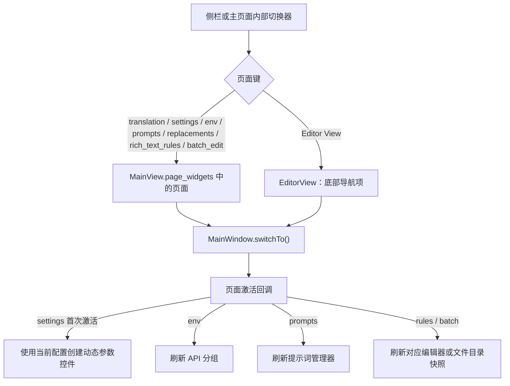

# 主导航与语言

本页说明桌面 Qt 窗口如何在翻译工作区、设置、API 管理、提示词、规则、批量管理和编辑器之间切换，并说明主题与界面语言的配置边界。文件列表、工作流按钮、编辑器内部工具和各二级弹窗分别由对应功能页负责。

## 功能边界 {#feature-boundary}

- 侧栏注册七个常规主页面；“编辑器视图”是单独的底部导航项，不属于这七个页面映射。
- 翻译页面是启动后的初始页面。侧栏收起时显示窄图标栏，悬停提示用于识别条目；展开宽度由窗口代码固定为 200px。
- 主题和语言控件位于主页面的“应用设置”区域，不是额外的侧栏导航项。语言切换影响桌面 UI 文本，不改变翻译目标语言。

## UI 操作 {#ui-operations}

### 使用主导航 {#use-main-navigation}

侧栏中的七个常规页面按以下顺序注册。表中的文字是代码调用的 i18n key 对应的两个 locale 实际值；图标只用于识别，不改变页面功能。

| 顺序 | 页面键 | UI 调用 key | English 实际值 | 简体中文实际值 | 图标 | 承载页面 |
| --- | --- | --- | --- | --- | --- | --- |
| 1 | `translation` | `Translation Interface` | Translation Interface | 翻译界面 | `FIF.HOME` | 翻译工作区 |
| 2 | `settings` | `Settings` | Settings | 设置 | `FIF.SETTING` | 参数设置 |
| 3 | `env` | `API Management` | API Management | API 管理 | `FIF.CONNECT` | API 管理 |
| 4 | `prompts` | `Prompt Management` | Prompt Management | 提示词管理 | `FIF.DOCUMENT` | 提示词管理 |
| 5 | `replacements` | `Replacement Rules` | Replacement Rules | 替换规则 | `FIF.EDIT` | 替换规则 |
| 6 | `rich_text_rules` | `Rich Text Rules` | Rich Text Rules | 富文本规则 | `FIF.FONT` | 富文本规则 |
| 7 | `batch_edit` | `Batch Management` | Batch Management | 批量管理 | `FIF.LIBRARY` | 批量管理 |

单独的底部导航项如下：

| UI 调用 key | English 实际值 | 简体中文实际值 | 位置 | 承载对象 |
| --- | --- | --- | --- | --- |
| `Editor View` | Editor View | 编辑器视图 | `NavigationItemPosition.BOTTOM` | `EditorView` |

点击条目会切换到对应页面。翻译工作区内部的页面切换器同样按页面键调用窗口的 `switchTo()`；它不是另一套主页面注册表。

### 主题和语言 {#theme-and-language}

在主页面的应用设置中使用“主题：”和“语言：”下拉框。主题改变界面外观，语言改变控件文案；两者都会写入应用配置。

| UI 调用 key | English 实际值 | 简体中文实际值 |
| --- | --- | --- |
| `Theme:` | Theme: | 主题： |
| `Language:` | Language: | 语言： |
| `Main View` | Main View | 主视图 |
| `Editor View` | Editor View | 编辑器视图 |
| `Light` | Light | 浅色 |
| `Dark` | Dark | 深色 |
| `Gray` | Gray | 灰色 |
| `Ocean` | Ocean | 海洋 |
| `Forest` | Forest | 森林 |
| `Sunset` | Sunset | 落日 |
| `Rose` | Rose | 玫瑰 |
| `Follow System` | Follow System | 跟随系统 |

主题的存储值和下拉显示值如下。顺序以 `THEME_OPTIONS` 为准。

| 存储值 | English | 简体中文 | 适用条件 |
| --- | --- | --- | --- |
| `light` | Light | 浅色 | 始终可用；默认主题 |
| `dark` | Dark | 深色 | 始终可用 |
| `gray` | Gray | 灰色 | 始终可用 |
| `ocean` | Ocean | 海洋 | 始终可用 |
| `forest` | Forest | 森林 | 始终可用 |
| `sunset` | Sunset | 落日 | 始终可用 |
| `rose` | Rose | 玫瑰 | 始终可用 |
| `system` | Follow System | 跟随系统 | 使用系统明暗状态；Windows 主题监听在该值下启用 |

语言下拉由 `I18nManager.get_available_locales()` 的固定有序映射填充，而不是从配置键名推导显示文字。

| 存储值 | English | 简体中文 | 来源 |
| --- | --- | --- | --- |
| `zh_CN` | Simplified Chinese | 简体中文 | `LocaleInfo.name`：简体中文 |
| `zh_TW` | Traditional Chinese | 繁體中文 | `LocaleInfo.name`：繁體中文 |
| `en_US` | English | English | `LocaleInfo.name`：English |
| `ja_JP` | Japanese | 日本語 | `LocaleInfo.name`：日本語 |
| `ko_KR` | Korean | 한국어 | `LocaleInfo.name`：한국어 |
| `es_ES` | Spanish | Español | `LocaleInfo.name`：Español |

### 切换语言时会发生什么 {#switch-language}

1. 在“语言：”中选择目标语言。下拉框先隐藏弹出菜单，并把变更排到 Qt 事件循环的下一拍，避免同一次选择重复发射信号。
2. `MainWindow._change_language()` 调用 i18n 管理器设置 locale；成功后把 locale 写入 `app.ui_language`，更新 `config.json`，再调用全局文本刷新。
3. 窗口标题、内部动作、主页面文本、七个常规侧栏条目及收起状态提示会刷新。已创建的编辑器视图也会调用自身的 `refresh_ui_texts()`。
4. 切换语言只刷新文案和相关显示控件，不自动切换页面，也不调用 `switchTo()`；因此源码层面保持当前页。编辑器底部导航标签不在 `_refresh_navigation_texts()` 的七项字典中，不能把该标签的语言刷新写成已验证行为。

## 选项中英对照 {#option-matrix}

本页的枚举选项集中在主题和语言下拉框。页面导航项不保存枚举值；其存储键仅用于窗口内部页面映射。

| 存储值 | English | 简体中文 | 使用位置 | i18n key 或来源 |
| --- | --- | --- | --- | --- |
| `light` | Light | 浅色 | 主题下拉框 | `Light`；`theme_registry.py` |
| `dark` | Dark | 深色 | 主题下拉框 | `Dark`；`theme_registry.py` |
| `gray` | Gray | 灰色 | 主题下拉框 | `Gray`；`theme_registry.py` |
| `ocean` | Ocean | 海洋 | 主题下拉框 | `Ocean`；`theme_registry.py` |
| `forest` | Forest | 森林 | 主题下拉框 | `Forest`；`theme_registry.py` |
| `sunset` | Sunset | 落日 | 主题下拉框 | `Sunset`；`theme_registry.py` |
| `rose` | Rose | 玫瑰 | 主题下拉框 | `Rose`；`theme_registry.py` |
| `system` | Follow System | 跟随系统 | 主题下拉框 | `Follow System`；`theme_registry.py` |
| `zh_CN` | Simplified Chinese | 简体中文 | 语言下拉框 | `I18nManager` 固定映射，无 locale JSON key |
| `zh_TW` | Traditional Chinese | 繁體中文 | 语言下拉框 | `I18nManager` 固定映射，无 locale JSON key |
| `en_US` | English | English | 语言下拉框 | `I18nManager` 固定映射，无 locale JSON key |
| `ja_JP` | Japanese | 日本語 | 语言下拉框 | `I18nManager` 固定映射，无 locale JSON key |
| `ko_KR` | Korean | 한국어 | 语言下拉框 | `I18nManager` 固定映射，无 locale JSON key |
| `es_ES` | Spanish | Español | 语言下拉框 | `I18nManager` 固定映射，无 locale JSON key |

## 运行机理 {#runtime-behavior}

主窗口启动时创建 `MainView`，注册七个页面并立即切换到 `translation_interface`。只有页面真正激活时才执行相应的刷新分支：设置页在尚未就绪时根据当前配置建立参数控件；API、提示词和规则页刷新其面板；批量页接收主文件列表的 `FileCatalogSnapshot` 后刷新。翻译页没有专门的激活刷新分支。

语言刷新链路是：语言下拉 -> `language_change_requested` -> `I18nManager.set_locale()` -> `app.ui_language` 配置写入 -> `_refresh_ui_texts()`。Qt 原生对话框翻译还会尝试加载 `qtbase_<locale>`、语言级别和 `qt_<locale>` 资源；资源不存在时不伪造翻译结果。

主题为 `system` 时，窗口检测 Windows 的 `AppsUseLightTheme`。系统变暗时应用 `dark` 并保存此前的非深色主题偏好；系统恢复浅色时恢复该偏好。系统主题监听器每 5 秒检查一次。直接选择其他主题会停止监听并保存选择。

## 依赖与冲突 {#dependencies-and-conflicts}

- 语言切换依赖对应 locale 文件和 `I18nManager` 的可用语言映射；缺失的 locale 文件会按服务实现加载为空翻译字典，不能据此假定所有控件都有译文。
- 主题切换依赖当前应用的主题样式实现；`system` 只改变主题选择和系统监听，不改变语言。
- 侧栏页面激活会刷新部分面板。API、提示词、规则或批量页面的刷新可能触发文件、配置或后台任务读取；这些页面的具体失败提示见各自页面。
- 编辑器视图初始化独立于七个 `MainView.page_widgets` 页面。文件双击或翻译完成后的结果打开会切换到编辑器，但文件加载、导出和区域状态不属于本页。
- 当前源码没有把顶部菜单栏作为用户导航来源；保留的 `QAction` 仅供内部行为，不应把隐藏菜单写成可见入口。

## 关联文件与格式 {#related-files}

| 文件或字段 | 本页中的作用 | 手改或分享注意事项 |
| --- | --- | --- |
| `config/config.json` | 持久化 `app.ui_language`、`app.theme` 和浅色系统下恢复用的主题偏好 | 不要复制包含个人路径或其他私有配置的用户文件；文档示例只使用字段名和公开值 |
| `desktop_qt_ui/locales/en_US.json` | 英文 UI 调用 key 的实际显示值 | 仅引用公开文案，不展示用户数据 |
| `desktop_qt_ui/locales/zh_CN.json` | 简体中文 UI 调用 key 的实际显示值 | 仅引用公开文案，不展示用户数据 |
| `desktop_qt_ui/services/i18n_service.py` | 可用 locale 顺序、语言名称和 locale 文件加载 | 其他语言文件缺失时遵循回退行为，不在页面中补写伪译文 |
| `desktop_qt_ui/theme_registry.py` | 主题存储值、显示 key 和默认主题 | 主题值必须来自注册表；不要把旧的 `Blue`、`Teal` 等 locale 文案误列为当前主题选项 |

## 截图与流程图 {#screenshots-and-diagrams}

本次源码核对未启动有头模式，也未生成截图。正式发布前应使用脱敏配置核对以下状态：七个常规导航项、底部编辑器项、侧栏收起/展开、语言切换前后、主题切换和深层页面切换。上面的 Mermaid 图只表达源码已确认的页面激活分支，不替代运行截图。

## 源码依据 {#source-evidence}

| 层级 | 文件 | 本页核对内容 |
| --- | --- | --- |
| 主窗口注册与切换 | `desktop_qt_ui/ui/main_window.py` | 七个页面顺序、图标、对象名、初始页面、编辑器底部位置、侧栏宽度和页面激活刷新 |
| 主页面映射与文本刷新 | `desktop_qt_ui/ui/main_page/view.py` | `page_widgets` 七项映射、主题/语言控件、页面文本刷新和内部页面切换器 |
| 主题/语言控件 | `desktop_qt_ui/ui/main_page/layout.py` | 主题注册表填充、locale 下拉填充、延迟发射语言变更信号 |
| 国际化服务 | `desktop_qt_ui/services/i18n_service.py` | 支持 locale 的固定顺序、语言显示名、locale 文件加载和回退 |
| 主题定义 | `desktop_qt_ui/theme_registry.py` | 当前主题存储值、`system` 选项和 `light` 默认值 |
| i18n 实际值 | `desktop_qt_ui/locales/en_US.json`、`desktop_qt_ui/locales/zh_CN.json` | 导航、主题、语言标签的 English 与简体中文实际值 |

## 验证记录 {#verification}

| 验证内容 | 状态 | 说明 |
| --- | --- | --- |
| 页面责任边界 | 完成 | 对照 `BLUEPRINT.md` 主导航 TODO 与 `research/desktop-main-navigation.md` |
| UI 调用 key 与三列文案 | 完成（静态） | 已核对 `en_US.json`、`zh_CN.json`；语言名称按 `I18nManager` 固定映射记录 |
| 页面激活与语言刷新 | 完成（静态） | 已核对 `main_window.py`、`main_page/view.py`、`main_page/layout.py` |
| 有头模式与截图 | 未执行 | 页面明确保留运行态验证，不展示伪造截图 |
| 中英路由镜像 | 待命令验证 | 页面写入后运行 `node doc/wiki/scripts/verify-route-mirror.mjs doc/wiki` |
| 源码依据检查 | 待命令验证 | 页面写入后运行 `node doc/wiki/scripts/verify-source-evidence.mjs doc/wiki` |
| VitePress 构建 | 待命令验证 | 页面写入后运行 `npm run docs:build --prefix doc/wiki` |

本页不包含 API Key、Token、用户名、私有绝对路径、用户图片或私有提示词。
