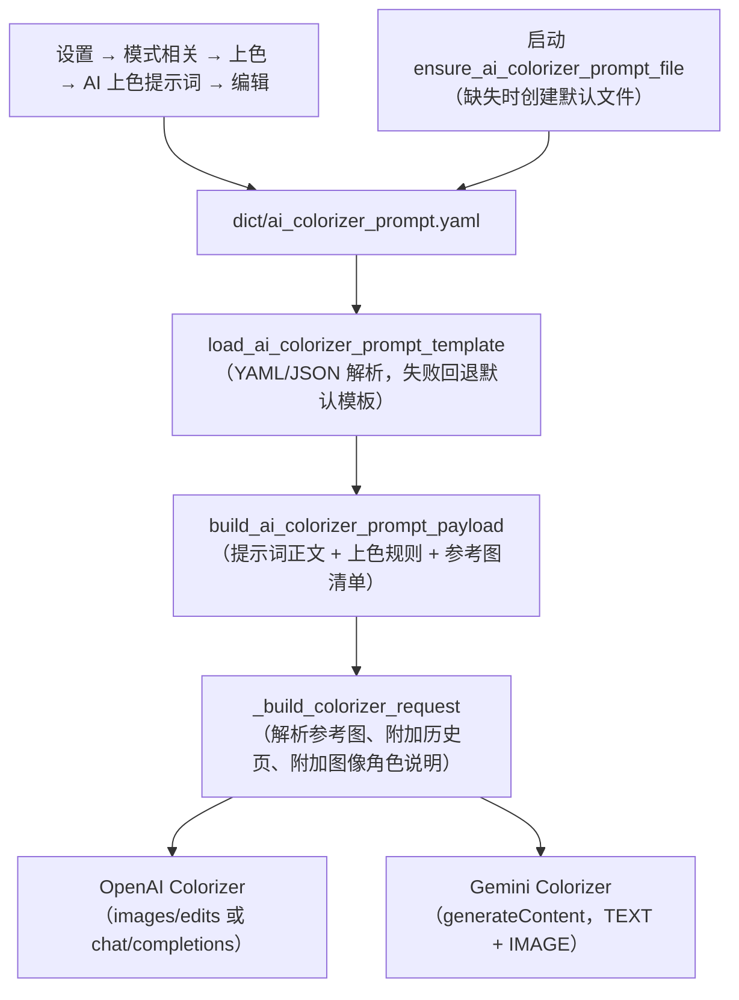
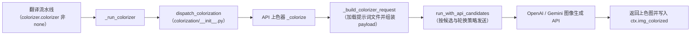

# AI 上色提示词

当选择 `OpenAI Colorizer` 或 `Gemini Colorizer` 给漫画页上色时，AI 上色器会读取一个固定的提示词文件，把上色指令、上色规则和参考图片随页面图片一起发送给图像生成模型。本页说明这个文件放在哪里、包含哪些字段、如何被加载并注入请求，以及它和翻译自定义 HQ 提示词的边界。上色模型、上色大小、降噪强度和历史页数的参数说明见[超分与上色](../settings/upscale-and-colorization.md)；提示词列表、应用与预览的完整流程见[提示词列表、应用与预览](./list-apply-and-preview.md)；翻译自定义提示词见[上下文与提示词](../translator/context-and-prompts.md)。

## 功能边界

- `colorizer.ai_colorizer_prompt_path` 是设置页“AI 上色提示词”（`label_ai_colorizer_prompt_path`）这一固定提示词编辑动作的 UI 调用键；它不是普通配置行，也没有像 `translator.high_quality_prompt_path` 那样的可选文件下拉框。
- 设置页编辑动作和运行时请求构建都固定使用默认路径 `dict/ai_colorizer_prompt.yaml`（`DEFAULT_AI_COLORIZER_PROMPT_PATH`）。Qt 模型 `ColorizerSettings` 和发行配置 `config/config-example.json` 都没有同名持久化字段；不要把这个键当成可切换的翻译提示词路径。
- 本页不展示真实提示词正文、API 密钥或用户参考图片路径；只说明文件结构、加载规则和注入路径。
- 离线上色器 `Manga Colorization v2`（`mc2`）不读取提示词文件；只有 `openai_colorizer` 和 `gemini_colorizer` 会加载 `dict/ai_colorizer_prompt.yaml`。

## UI 操作

### 在设置页编辑 AI 上色提示词

1. 打开“设置”（`Settings`），选择“模式相关”（`Mode Specific`）页签，找到“上色”（`Colorization`）分组。
2. 在“AI 上色提示词”（`label_ai_colorizer_prompt_path`）行点击“编辑”（`Edit`）。该行只有编辑动作，没有路径下拉框或数值输入；说明面板显示“OpenAI 上色 / Gemini 上色使用固定的 YAML 提示词文件。点击 Edit 直接编辑内容。”
3. 弹出的“编辑提示词”（`Edit Prompt`）对话框标题带文件名，默认打开“模板编辑”（`Template Edit`）页签，包含三个分区：
   - “提示词正文”（`Prompt Text`）：上色主提示词，多行文本框。
   - “上色规则”（`Colorization Rules`）：每行一条规则（`One rule per line`），保存时按行拆分为列表。
   - “参考图片”（`Reference Images`）：两列表格，列头为“路径”（`Path`）和“说明”（`Description`）；可用“添加参考图片”（`Add Reference Image`）选择图片文件并填写说明，用“删除行”（`Delete Row`）删除。
4. 可以用“添加字段”（`Add Section`）重新插入已删除的分区；分区可上下移动，但保存顺序不会改变运行时的加载顺序。
5. 切换到“源码编辑”（`Raw Edit`）页签可“直接编辑文件原始内容”（`Edit the raw file content directly`）；保存前校验 YAML/JSON 可解析，格式错误时状态栏显示“格式错误”（`Format Error`）。
6. 点击“保存”（`Save`）写回文件并关闭；成功显示“保存成功”（`Saved successfully`），失败显示“保存失败”（`Save failed`）或“序列化错误”（`Serialize Error`）。

### 从提示词管理页进入专用编辑器

“提示词管理”（`Prompt Management`）列表由 `get_hq_prompt_options()` 生成，会排除系统提示词以及 `ai_ocr_prompt`、`ai_colorizer_prompt`、`ai_renderer_prompt` 三个固定 AI 提示词文件名，因此 `dict/ai_colorizer_prompt.yaml` 本身不会出现在该列表中，避免被当作翻译自定义提示词应用。

如果用户自建文件的内容包含 `ai_colorizer_prompt`、`colorization_rules`、`reference_images` 等上色专用字段，`open_prompt_editor()` 会按内容识别（`is_ai_colorizer_prompt_file`）并打开同一个 `AIColorizerPromptEditorDialog`；预览面板也会显示“提示词正文 / 上色规则 / 参考图片”三个分区。否则回退到通用 `PromptEditorDialog`。

| UI 调用 key | English 实际值 | 简体中文实际值 |
| --- | --- | --- |
| `Settings` | Settings | 设置 |
| `Mode Specific` | Mode Specific | 模式相关 |
| `Colorization` | Colorization | 上色 |
| `label_colorizer` | Colorization Model | 上色模型 |
| `label_ai_colorizer_prompt_path` | AI Colorizer Prompt | AI 上色提示词 |
| `label_ai_colorizer_history_pages` | AI Colorizer History Pages | AI 上色历史页数 |
| `label_colorization_size` | Colorization Size | 上色大小 |
| `label_denoise_sigma` | Denoise Strength | 降噪强度 |
| `desc_colorizer_ai_colorizer_prompt_path` | Fixed YAML prompt file used by OpenAI Colorizer and Gemini Colorizer. Click Edit to modify it directly. | OpenAI 上色 / Gemini 上色使用固定的 YAML 提示词文件。点击 Edit 直接编辑内容。 |
| `desc_colorizer_ai_colorizer_history_pages` | Automatically attaches the previous already-colorized pages as reference images for the current AI colorization request. This is image-only context, not text. Set 0 to disable. | 自动把前面已经上完色的页面当作参考图附加到当前页上色请求中。这里只控制历史页数，不写文字，只传图片。设为 0 表示关闭。 |
| `Edit` | Edit | 编辑 |
| `Edit Prompt` | Edit Prompt | 编辑提示词 |
| `Template Edit` | Template Edit | 模板编辑 |
| `Raw Edit` | Raw Edit | 源码编辑 |
| `Prompt Text` | Prompt Text | 提示词正文 |
| `Colorization Rules` | Colorization Rules | 上色规则 |
| `Reference Images` | Reference Images | 参考图片 |
| `One rule per line` | One rule per line | 每行一条规则 |
| `Add Section` | Add Section | 添加字段 |
| `Add Reference Image` | Add Reference Image | 添加参考图片 |
| `Delete Row` | Delete Row | 删除行 |
| `Path` | Path | 路径 |
| `Description` | Description | 说明 |
| `Save` | Save | 保存 |
| `Cancel` | Cancel | 取消 |
| `Loaded successfully` | Loaded successfully | 加载成功 |
| `Saved successfully` | Saved successfully | 保存成功 |
| `Format Error` | Format Error | 格式错误 |
| `Serialize Error` | Serialize Error | 序列化错误 |
| `Save failed` | Save failed | 保存失败 |
| `All sections added` | All sections added | 所有字段已添加 |
| `Edit the raw file content directly` | Edit the raw file content directly | 直接编辑文件原始内容 |
| `Prompt Management` | Prompt Management | 提示词管理 |
| `Prompt List` | Prompt List | 提示词列表 |
| `Found {count} prompt files.` | Found {count} prompt files. | 找到 {count} 个提示词文件。 |
| `Prompt Preview` | Prompt Preview | 提示词预览 |
| `Apply Selected Prompt` | Apply Selected Prompt | 应用所选提示词 |

## 提示词文件与结构

### `dict/ai_colorizer_prompt.yaml` — AI 上色提示词文件 {#prompt-file}

- 存储格式：YAML（`.yaml` / `.yml`）或 JSON（`.json`）；加载器按 `.yaml` → `.yml` → `.json` 顺序查找同名文件。
- 默认模板：代码常量 `DEFAULT_AI_COLORIZER_PROMPT_TEMPLATE` 包含三个字段；文件缺失、解析失败或根节点不是对象时回退到 `DEFAULT_AI_COLORIZER_PROMPT`。
- 启动时 `ensure_ai_colorizer_prompt_file()`（`config_service` 与 `runtime_files`）会在文件缺失时创建带默认提示词的文件，不覆盖已有文件。

| 字段（存储值） | 语义 | 兼容别名（按序尝试） |
| --- | --- | --- |
| `ai_colorizer_prompt` | 上色主提示词正文 | `colorizer_prompt`、`prompt` |
| `colorization_rules` | 上色规则列表；字符串按行拆分 | `rules`、`style_guide` |
| `reference_images` | 参考图片列表；每项为字符串路径或 `{path, description}` 对象 | `reference_image_paths`、`images` |

参考图片对象的路径键依次尝试 `path`、`image_path`、`file`、`value`，说明键依次尝试 `description`、`note`、`label`、`purpose`。正文只记录结构与脱敏示例，不展示真实提示词和私有路径。

## 运行机理

### 提示词加载与请求注入 {#prompt-injection}

图下限制说明：只有 `colorizer.colorizer` 为 `openai_colorizer` 或 `gemini_colorizer` 时该文件才会被加载；`mc2`、`none` 以及不需要上色的工作流不会读取它。参考图缺失时只记录警告并跳过，不终止请求。

### 进入 AI 上色请求的路径 {#request-path}

说明：`colorize_only`（仅上色）工作流在上色完成后直接以 `ctx.img_colorized` 作为结果，跳过检测、OCR、翻译与排版；普通工作流中上色发生在超分之后、检测之前。AI 上色请求还会应用 `colorizer` 分区的自定义请求参数（见 API 管理页），与提示词文件相互独立。

### 历史页图像上下文 {#history-images}

`colorizer.ai_colorizer_history_pages`（`AI Colorizer History Pages` / `AI 上色历史页数`）只对 OpenAI/Gemini 上色器生效：每页上色成功后把结果图存入内存历史，下一次请求把最近 N 张已上色页面作为 `history_reference` 参考图附加，只传图像、不传文字；`0` 关闭。历史页不足时使用已有页，任务顺序与并发隔离会限制可用历史。

## 依赖与冲突

- 只影响 AI 上色器：`mc2` 与 `none` 不读取提示词文件；把文件内容改成翻译提示词不会让离线上色器改变行为。
- 与翻译自定义 HQ 提示词互不通用：`translator.high_quality_prompt_path` 是可选择的翻译提示词路径，`dict/ai_colorizer_prompt.yaml` 是固定的 AI 上色提示词文件；`get_hq_prompt_options()` 明确排除 `ai_colorizer_prompt` 等 AI 提示词文件名，防止把上色文件应用到翻译请求。
- 参考图片路径可能是用户私有路径；相对路径依次按提示词目录、图片目录、项目根目录和当前目录解析，绝对路径直接使用。公开文档与截图不得包含这些路径或图片。
- 提示词内容属于业务文本。共享日志、请求导出或调试目录前，必须删除提示词正文、参考图路径、历史页面图像和凭据。
- 编辑器 Raw 模式要求 YAML/JSON 可解析；根节点不是对象、字段类型不对或 PyYAML 缺失时，加载器回退默认模板，编辑器保存时给出格式或序列化错误。

## 关联文件与格式

| 文件/格式 | 本页实际作用 | 手改与兼容注意 |
| --- | --- | --- |
| `dict/ai_colorizer_prompt.yaml` | 默认 AI 上色提示词文件 | 结构需可解析；只记录脱敏结构，不展示真实提示词正文 |
| `.yaml` / `.yml` / `.json` | 提示词编辑器与加载器支持的格式 | 同名多格式时按 `.yaml` → `.yml` → `.json` 优先 |
| `dict/` 其它提示词文件 | 翻译 HQ、AI OCR、AI 渲染等提示词 | 与上色提示词互不通用，勿混用文件 |
| `config/config.json` | 用户设置持久化 | `colorizer` 段无 `ai_colorizer_prompt_path` 字段；不读取真实用户文件 |
| `desktop_qt_ui/ui/main_page/settings_tab_layout.json` | 设置页“模式相关”布局 | 固定提示词编辑动作的 UI 调用键来源 |
| `manga_translator_work/editor_base/` | 上色后的编辑器底图 | 属于运行产物，与提示词文件无关 |

## Mermaid 数据流限制

两图描述源码中的真实数据转换与最终 OpenAI/Gemini 消费者，不代表每次运行都会读取文件或发起网络请求。文件缺失、解析失败、非 AI 上色器、不需要上色的工作流等都会走对应旁路；文档没有伪造运行截图或私有任务产物。

## 源码依据 {#source-evidence}

| 层级 | 文件 | 本页核对内容 |
| --- | --- | --- |
| 设置 UI | `desktop_qt_ui/ui/main_page/dynamic_settings.py`、`settings_tab_layout.json` | 固定提示词编辑动作、label/description 与默认路径 |
| 专用编辑器 | `desktop_qt_ui/ui/secondary_pages/ai_colorizer_prompt_editor.py` | 模板/源码页签、三个分区、参考图表格、保存与状态 |
| 提示词管理 | `desktop_qt_ui/ui/main_page/layout.py`、`desktop_qt_ui/app_logic.py` | 列表排除规则、内容识别与编辑器分流 |
| 提示词加载 | `manga_translator/colorization/prompt_loader.py` | 字段别名、默认模板、参考图路径解析、payload 组装 |
| 请求构建 | `manga_translator/colorization/model_api_colorizer.py` | 提示词注入、参考图/历史页附加、OpenAI/Gemini 请求格式 |
| 流水线调度 | `manga_translator/manga_translator.py`、`manga_translator/colorization/__init__.py` | 上色入口、`_run_colorizer`、`colorize_only` 与历史页上下文 |
| 配置 | `manga_translator/config.py`、`desktop_qt_ui/core/config_models.py` | `Colorizer` 枚举、`ColorizerConfig` 与 Qt `ColorizerSettings` |
| 持久化/启动 | `desktop_qt_ui/services/config_service.py`、`manga_translator/runtime_files.py` | 启动时确保默认提示词文件存在 |

## 验证记录 {#verification}

| 验证内容 | 状态 | 说明 |
| --- | --- | --- |
| BLUEPRINT、PAGE_GUIDELINES、TODO | 完成 | 已读取 1.3 节与 5.7 小节并按页面合同编写 |
| UI 布局与调用 | 完成 | 静态核对设置布局、固定提示词编辑动作、专用编辑器与提示词管理分流 |
| `en_US` / `zh_CN` 实际 locale | 完成 | 页面表格逐项记录 key、English、简体中文实际值 |
| 提示词加载与注入链 | 完成 | 静态核对 loader、payload 组装、参考图/历史页附加与 OpenAI/Gemini 请求 |
| 路由镜像与源码依据脚本 | 完成 | `node scripts/verify-route-mirror.mjs .`、`node scripts/verify-source-evidence.mjs .` 通过 |
| 脱敏运行验证 | 待后续 | 本页未读取真实 `.env`、用户 `config.json`、API key/token、用户名、用户图片或私有提示词 |
| VitePress | 待运行 | 由协调代理在合并前运行 `npm run docs:build --prefix doc/wiki` |