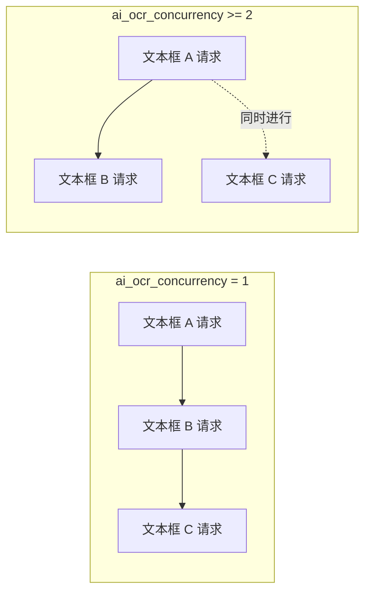
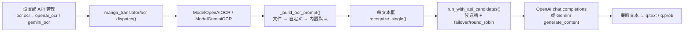

# AI OCR 提示词

当“OCR 模型”（`OCR Model`）选择 `openai_ocr` 或 `gemini_ocr` 时，AI OCR 会把一段提示词连同每个文本框截图一起发送给视觉模型。本页说明这段提示词的配置键、`dict/` 下的提示词文件、加载与注入方式、进入 AI OCR 请求的路径，以及与自定义 HQ 翻译提示词的边界。OCR 引擎整体选择、凭据和候选槽见[OCR、过滤与文本行合并](../settings/ocr-filter-and-merge.md)与[API 功能选择器](../api-management/feature-selectors.md)；提示词文件的通用列表与应用见[提示词列表、应用与预览](./list-apply-and-preview.md)。

## 功能边界 {#feature-boundary}

- `ocr.ai_ocr_prompt_path` 是设置页“AI OCR 提示词”行的固定提示词文件编辑动作，绑定后端 `dict/ai_ocr_prompt.yaml`（缺失时自动创建，旧版 `dict/ai_ocr_prompt.json` 会迁移），本身不写入 `config/config.json`。
- `ocr.ai_ocr_custom_prompt` 是可直接填写的备用提示词文本；`ocr.ai_ocr_concurrency` 限制同一张图内同时发出的 AI OCR 请求数。
- `dict/ai_ocr_prompt.yaml` 只被 `openai_ocr` / `gemini_ocr` 消费；`translator.high_quality_prompt_path` 是 HQ 翻译的自定义提示词，两者文件和配置键不能互换。
- 本页不复制真实提示词正文，也不展示 API Key；凭据、地址和模型见[API 凭据、地址与模型](../api-management/credentials-addresses-models.md)。

## UI 操作 {#ui-operations}

### 在设置页的“文字识别”分组配置 {#configure-in-settings}

1. 打开“设置”（`Settings`），选择“文字识别”（`OCR`）分组。
2. “AI OCR 提示词”（`AI OCR Prompt`）行是固定提示词文件动作；点击“编辑”（`Edit`）打开提示词编辑器。
3. “AI OCR 自定义提示词”（`AI OCR Custom Prompt`）输入框留空时按运行优先级使用文件或内置默认；非空时在文件为空/无有效键时参与。
4. “AI OCR 并发数”（`AI OCR Concurrency`）输入正整数，`1` 表示串行识别文本框，`2` 及以上并行识别。
5. 在“API 管理”的“文字识别”页签把功能选择器设为 OpenAI/Gemini 后，配置 `OCR_OPENAI_*` / `OCR_GEMINI_*` 凭据槽，见[API 功能选择器](../api-management/feature-selectors.md)。

### 编辑提示词文件 {#edit-prompt-file}

1. 在设置页点击“编辑”后打开提示词编辑器（`SimplePromptEditorDialog`），窗口标题为“编辑: ai_ocr_prompt.yaml”，卡片内显示相对路径提示 `dict/ai_ocr_prompt.yaml`。
2. 文本框预填当前文件内容；文件不存在时自动创建并预填内置默认提示词。
3. 修改后点击“保存”（`Save`）把纯文本写回文件（YAML `ai_ocr_prompt: |` 块）；点击“取消”（`Cancel`）放弃修改。写入失败弹出“错误”（`Error`）消息框，不覆盖原文件。

| UI 调用 key | English 实际值 | 简体中文实际值 |
| --- | --- | --- |
| `Settings` | Settings | 设置 |
| `OCR` | OCR | 文字识别 |
| `OCR Model:` | OCR Model: | OCR模型: |
| `label_ocr` | OCR Model | OCR模型 |
| `label_ai_ocr_prompt_path` | AI OCR Prompt | AI OCR 提示词 |
| `desc_ocr_ai_ocr_prompt_path` | Fixed YAML prompt file used by OpenAI OCR and Gemini OCR. Click Edit to modify it directly. | OpenAI OCR / Gemini OCR 使用固定的 YAML 提示词文件。点击 Edit 直接编辑内容。 |
| `label_ai_ocr_custom_prompt` | AI OCR Custom Prompt | AI OCR 自定义提示词 |
| `desc_ocr_ai_ocr_custom_prompt` | Custom prompt for OpenAI OCR and Gemini OCR. Leave empty to use the built-in default prompt that returns only recognized text with line breaks preserved. | OpenAI OCR / Gemini OCR 的自定义提示词。留空时使用内置默认提示词，只返回识别文本并保留换行。 |
| `label_ai_ocr_concurrency` | AI OCR Concurrency | AI OCR 并发数 |
| `desc_ocr_ai_ocr_concurrency` | Maximum concurrent API requests for OpenAI OCR and Gemini OCR. Set 1 for serial processing, 2 or higher to process multiple text boxes at the same time. | OpenAI OCR / Gemini OCR 的最大并发请求数。1 表示串行识别，2 及以上会同时请求多个文本框。 |
| `No OCR API required` | The current OCR does not require an OpenAI/Gemini API key. | 当前 OCR 不需要 OpenAI/Gemini API Key。 |
| `Edit` | Edit | 编辑 |
| `Save` | Save | 保存 |
| `Cancel` | Cancel | 取消 |
| `Error` | Error | 错误 |

## 参数与选项 {#parameters-and-options}

#### `ocr.ai_ocr_prompt_path` — AI OCR 提示词 / AI OCR Prompt {#ocr-ai-ocr-prompt-path}

- 控件：固定提示词文件编辑动作（标签行加“编辑”按钮），不是下拉框。
- 所在界面：设置 → 文字识别；UI 调用 key 为 `label_ai_ocr_prompt_path`。
- 存储值：不写入 `config/config.json`；后端始终把默认路径解析为 `dict/ai_ocr_prompt.yaml`（`DEFAULT_AI_OCR_PROMPT_PATH`）。
- 可选值：无枚举；文件内容是纯提示词文本。
- 默认值：核心代码 `manga_translator/ocr/prompt_loader.py#DEFAULT_AI_OCR_PROMPT` 内置一段默认英文提示词；首次运行由 `ensure_ai_ocr_prompt_file()` 写入 `dict/ai_ocr_prompt.yaml`；若存在旧版 `dict/ai_ocr_prompt.json` 则迁移其内容。
- 生效阶段：OCR。
- 原理：`ensure_ai_ocr_prompt_file()` 保证文件存在；`load_ai_ocr_prompt_file()` 用 `load_prompt_file()` 解析 YAML/JSON，并返回第一个非空的 `ai_ocr_prompt`、`ocr_prompt` 或 `prompt` 字符串。文件内容非空时优先于 `ai_ocr_custom_prompt`。
- 依赖与冲突：只被 `openai_ocr` / `gemini_ocr` 消费；与 `translator.high_quality_prompt_path` 无关联。
- 性能/API 成本：提示词长度计入每个文本框请求的 token 成本。
- 关联文件和调试产物：`dict/ai_ocr_prompt.yaml`、旧版 `dict/ai_ocr_prompt.json`；不产生调试图片。
- 图示：不需要：该键只是文件编辑入口，取值变化体现在文件内容，见[运行机理](#runtime-behavior)的注入路径图。

#### `ocr.ai_ocr_custom_prompt` — AI OCR 自定义提示词 / AI OCR Custom Prompt {#ocr-ai-ocr-custom-prompt}

- 控件：文本输入框（可选输入）。
- 所在界面：设置 → 文字识别；UI 调用 key 为 `label_ai_ocr_custom_prompt`。
- 存储值：字符串；空值表示不使用。
- 可选值：任意文本；无枚举。
- 默认值：核心代码 `manga_translator/config.py#OcrConfig.ai_ocr_custom_prompt` 为 `None`；Qt 模型 `desktop_qt_ui/core/config_models.py#OcrSettings.ai_ocr_custom_prompt` 为 `None`；发行配置 `config/config-example.json` 为 `null`。
- 生效阶段：OCR。
- 原理：在 `_build_ocr_prompt()` 中，只有固定文件为空或没有有效键时才回退到这里，最后再回退到内置默认。注意 UI 描述“留空时使用内置默认”省略了文件优先级：只要 `dict/ai_ocr_prompt.yaml` 非空，本输入框就不会生效。
- 依赖与冲突：与 `ocr.ai_ocr_prompt_path` 共享同一消费点；两者同时配置时文件优先。
- 性能/API 成本：与提示词长度相关，无额外固定开销。
- 关联文件和调试产物：不落盘；随 `OcrConfig` 进入 OCR 派发。
- 图示：不需要：无分支的字符串优先级，见[运行机理](#runtime-behavior)的加载优先级说明。

#### `ocr.ai_ocr_concurrency` — AI OCR 并发数 / AI OCR Concurrency {#ocr-ai-ocr-concurrency}

- 控件：整数输入框。
- 所在界面：设置 → 文字识别；UI 调用 key 为 `label_ai_ocr_concurrency`。
- 存储值：正整数；`_get_ai_ocr_concurrency()` 把 `0`、负数或解析失败兜底为 `1`。
- 可选值：整数；无枚举。
- 默认值：核心代码 `manga_translator/config.py#OcrConfig.ai_ocr_concurrency` 为 `1`；Qt 模型 `desktop_qt_ui/core/config_models.py#OcrSettings.ai_ocr_concurrency` 为 `1`；发行配置 `config/config-example.json` 为 `10`。
- 生效阶段：OCR 请求调度。
- 原理：`asyncio.Semaphore` 限制同一张图内同时发出的 AI OCR API 请求；`1` 串行识别文本框，`2` 及以上并行识别多个文本框。并行只作用于本图的待识别文本框，不代表整条图片流水线并发。
- 依赖与冲突：受 API 限流、配额、网络和内存约束；不影响检测、翻译、修复或排版的并发设置。
- 性能/API 成本：并发越高单图 OCR 越快，但越容易触发限流或候选槽冷却。
- 关联文件和调试产物：只影响内存中的请求调度，不产生文件。
- 图示：需要（见下）。

并发数只限制同一张图内 AI OCR API 请求的同时数量；候选槽轮换仍按每个请求独立进行，不因并发设置改变。

## 运行机理 {#runtime-behavior}

### 提示词文件加载与优先级 {#prompt-loading}

1. `ensure_ai_ocr_prompt_file()` 保证 `dict/ai_ocr_prompt.yaml` 存在：缺失时写入内置默认，若存在旧版 `dict/ai_ocr_prompt.json` 则迁移其内容。
2. `load_ai_ocr_prompt_file()` 用 `load_prompt_file()` 解析 `.yaml` / `.yml` / `.json`，根必须是字典，返回第一个非空字符串键：`ai_ocr_prompt` → `ocr_prompt` → `prompt`。
3. `_build_ocr_prompt()` 的优先级：文件内容 → `ai_ocr_custom_prompt` → `DEFAULT_AI_OCR_PROMPT`。
4. 识别响应经过 `_normalize_ocr_text()`：统一换行、去除首尾空白，并剥离首尾三反引号代码围栏（若模型返回了 Markdown）。

### 进入 AI OCR 请求的路径 {#request-path}

提示词以 `user` 消息的文本部分与文本框 PNG 图片一起发送：OpenAI 使用 `messages[0].content` 的 `text` + `image_url`（base64 data URL）；Gemini 使用 `contents[0].parts` 的 `text` + `inlineData`。启用自定义 API 参数时，`config/custom_api_params.json` 的 `ocr` 段（默认 `temperature: 0.0`）会合并进请求体；凭据与候选端点由 `resolve_runtime_api_config(feature="ocr", ...)` 从 `.env` / API 管理槽解析。

## 依赖与冲突 {#dependencies-and-conflicts}

- `ocr.ocr` 必须是 `openai_ocr` 或 `gemini_ocr`，否则 AI OCR 提示词不被消费；离线 OCR（48px、PaddleOCR 等）使用各自模型提示，与本页无关。
- 提示词文件只被 AI OCR 消费；`translator.high_quality_prompt_path` 是 HQ 翻译的自定义提示词，见[上下文与提示词](../translator/context-and-prompts.md)，两者文件不能互换。
- `ai_ocr_prompt` 属于系统提示词 stem，被“提示词管理”列表和 HQ 提示词下拉排除，因此不会出现在[提示词列表、应用与预览](./list-apply-and-preview.md)中；编辑入口只在设置页。
- AI OCR 请求还受 API 管理页的 Key/Base/Model、候选槽轮换与自定义请求参数影响；这些机制不改变提示词内容。
- 提示词正文属于用户内容；共享日志、请求导出或调试目录前必须删除提示词正文、文本框文本、路径与凭据。

## 关联文件与格式 {#files-and-formats}

| 文件/格式 | 本页实际作用 | 手改与兼容注意 |
| --- | --- | --- |
| `dict/ai_ocr_prompt.yaml` | AI OCR 固定提示词文件；根键 `ai_ocr_prompt` | 根必须是字典；编辑器保存为 YAML 块 |
| `dict/ai_ocr_prompt.json` | 旧版提示词文件 | 仅当默认 YAML 缺失且路径未自定义时迁移 |
| `.yaml` / `.yml` / `.json` | `load_ai_ocr_prompt_file()` 支持的格式 | 键按 `ai_ocr_prompt` → `ocr_prompt` → `prompt` 查找 |
| `config/custom_api_params.json` | 请求体额外参数（`ocr` 段，默认 `temperature: 0.0`） | 不负责提示词内容与凭据 |
| `config/config.json` | 用户配置持久化 | 固定提示词路径不写入；`ai_ocr_custom_prompt`、`ai_ocr_concurrency` 写入 |
| `config/config-example.json` | 发行示例默认 | `ai_ocr_concurrency: 10`、`ai_ocr_custom_prompt: null` |

## 源码依据 {#source-evidence}

| 层级 | 文件 | 本页核对内容 |
| --- | --- | --- |
| 设置布局 | `desktop_qt_ui/ui/main_page/settings_tab_layout.json` | OCR 分组及 `ocr.ai_ocr_prompt_path`、`ocr.ai_ocr_concurrency` 归属 |
| 动态设置与编辑入口 | `desktop_qt_ui/ui/main_page/dynamic_settings.py`、`desktop_qt_ui/ui/secondary_pages/simple_prompt_editor_dialog.py` | 固定提示词行、编辑弹窗、加载与保存 |
| 提示词加载 | `manga_translator/ocr/prompt_loader.py` | 默认路径、旧版迁移、键解析、加载/保存/列表 |
| 通用加载器 | `manga_translator/translators/prompt_loader.py` | YAML/JSON 解析与字典校验 |
| 配置 | `manga_translator/config.py`、`desktop_qt_ui/core/config_models.py`、`config/config-example.json` | 三类默认与字段定义 |
| UI/i18n | `desktop_qt_ui/app_logic.py`、`desktop_qt_ui/locales/en_US.json`、`zh_CN.json` | key 映射与实际中英文显示值 |
| 运行与消费者 | `manga_translator/ocr/__init__.py`、`manga_translator/ocr/model_api_ocr.py`、`manga_translator/manga_translator.py` | 派发、提示词构建、候选槽请求与 OpenAI/Gemini 消息 |
| 请求参数 | `manga_translator/custom_api_params.py`、`manga_translator/runtime_api_resolver.py`、`manga_translator/api_key_rotation.py` | `ocr` 段合并与候选端点轮换 |

## 验证记录 {#verification}

| 验证内容 | 状态 | 说明 |
| --- | --- | --- |
| BLUEPRINT、PAGE_GUIDELINES、TODO | 完成 | 已完整读取并按页面合同编写 |
| UI 布局与调用 | 完成 | 静态核对设置布局、固定提示词编辑器与 API 分组 |
| `en_US` / `zh_CN` 实际 locale | 完成 | 页面表格逐项记录 key、English、简体中文实际值 |
| 提示词加载与请求注入链 | 完成 | 静态核对文件加载优先级、OpenAI/Gemini 消息构造与候选端点 |
| 脱敏运行验证 | 待后续 | 本页未读取真实 `.env`、用户 `config.json`、API key/token、用户名、用户图片或私有提示词 |
| VitePress | 待运行 | 由协调代理在合并前运行 `npm run docs:build --prefix doc/wiki` 及镜像/源码检查 |