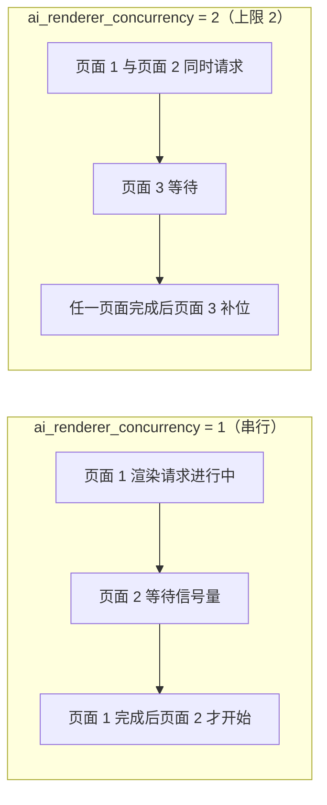
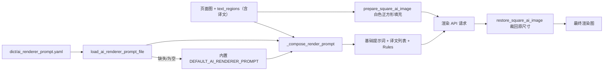
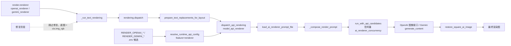

# AI 渲染提示词

当“渲染器”选择 `openai_renderer` 或 `gemini_renderer` 时，整页译文不再由本地字体排版绘制，而是把页面图和区域译文一起交给图像生成模型重绘。本页说明 AI 渲染使用的固定提示词文件、加载与注入方式、进入 AI 渲染请求的路径，以及它与自定义 HQ 翻译提示词的边界。

本页不覆盖渲染器枚举、字体和排版参数（见[排版与渲染](../settings/typesetting-and-rendering.md)），不覆盖 API 凭据、候选槽与轮询（见 API 管理页面），也不覆盖自定义 HQ 翻译提示词本身（见[上下文与提示词](../translator/context-and-prompts.md)）。

## 功能边界 {#feature-boundary}

- `render.renderer` 决定是否进入 AI 渲染：`openai_renderer` / `gemini_renderer` 走图像生成 API，`default` 走本地 Qt/text_render 绘制，`none` 跳过文本绘制。
- `render.ai_renderer_prompt_path` 是设置页“Typesetting”中固定提示词编辑动作的 UI 行键，不是持久化配置值，也不是可切换路径；它始终编辑 `dict/ai_renderer_prompt.yaml`。
- `render.ai_renderer_concurrency` 限制同一提供商同时进行的 AI 渲染 API 请求数。
- AI 渲染提示词是固定文件，与用户可选的自定义 HQ 提示词（`translator.high_quality_prompt_path`）属于不同功能，文件不能互换。

## UI 操作 {#ui-operations}

### 在设置页编辑 AI 渲染提示词 {#edit-in-settings}

1. 打开“设置”（`Settings`），选择“Typesetting”（排版）分组。
2. 找到“AI 渲染提示词”（`AI Renderer Prompt`）行，点击右侧“编辑”（`Edit`）按钮。
3. 弹出提示词编辑对话框（`SimplePromptEditorDialog`）：窗口标题为“编辑: ai_renderer_prompt.yaml”（`Edit` + 文件名），标题与章节名为“AI 渲染提示词”，说明文字来自 `desc_render_ai_renderer_prompt_path`，路径提示为 `dict/ai_renderer_prompt.yaml`（可选中复制）。
4. 编辑区为等宽字体文本框，默认显示当前提示词文件内容；文件不存在时显示内置默认提示词。点击“保存”（`Save`）后按 YAML 字面块写回文件；点击“取消”（`Cancel`）放弃修改；保存失败弹出“错误”（`Error`）对话框。

| UI 调用 key | English 实际值 | 简体中文实际值 |
| --- | --- | --- |
| `Settings` | Settings | 设置 |
| `Typesetting` | Typesetting | 排版 |
| `label_renderer` | Renderer | 渲染器 |
| `label_ai_renderer_prompt_path` | AI Renderer Prompt | AI 渲染提示词 |
| `desc_render_ai_renderer_prompt_path` | Fixed YAML prompt file used by OpenAI Renderer and Gemini Renderer. The final request is combined with numbered boxes and translated text for each region. | OpenAI 渲染 / Gemini 渲染使用固定的 YAML 提示词文件。实际请求会自动组合编号框图片和对应翻译文本。 |
| `label_ai_renderer_concurrency` | AI Renderer Concurrency | AI 渲染并发数 |
| `desc_render_ai_renderer_concurrency` | Maximum concurrent API requests for OpenAI Renderer and Gemini Renderer. This limits how many pages can be rendered at the same time during batch processing. | OpenAI 渲染 / Gemini 渲染的最大并发请求数。批量模式下可同时渲染多张页面。 |
| `Edit` | Edit | 编辑 |
| `Cancel` | Cancel | 取消 |
| `Save` | Save | 保存 |
| `Error` | Error | 错误 |
| renderer 显示映射（代码硬编码） | Default / OpenAI Renderer / Gemini Renderer / None | Default / OpenAI Renderer / Gemini Renderer / 无 |

### 与提示词管理页的边界 {#prompt-management-boundary}

打开“提示词管理”（`Prompt Management`）时，列表只包含用户提示词文件；`get_hq_prompt_options()` 扫描 `dict/` 下的 `.yaml`、`.yml`、`.json` 文件时会排除 `ai_renderer_prompt` 等系统提示词文件名。因此 AI 渲染提示词不会出现在“应用所选提示词”（`Apply Selected Prompt`）候选里，也不会被 HQ 提示词应用操作改写。提示词管理页的完整操作见[提示词列表、应用与预览](./list-apply-and-preview.md)。

| UI 调用 key | English 实际值 | 简体中文实际值 |
| --- | --- | --- |
| `Prompt Management` | Prompt Management | 提示词管理 |
| `Apply Selected Prompt` | Apply Selected Prompt | 应用所选提示词 |

## 参数与选项 {#parameters-and-options}

#### `render.renderer` — 渲染器 / Renderer {#render-renderer}

- 控件：下拉框。
- 所在界面：设置 → Typesetting；API 管理页的渲染功能选择器也绑定同一个键。
- 存储值：`default`、`openai_renderer`、`gemini_renderer`、`none`。
- 可选值（代码映射显示名）：`default` → Default；`openai_renderer` → OpenAI Renderer；`gemini_renderer` → Gemini Renderer；`none` → `translator_none`（None / 无）。
- 默认值：核心代码 `manga_translator/config.py#RenderConfig.renderer` 为 `Renderer.default`；Qt 模型 `desktop_qt_ui/core/config_models.py#RenderSettings.renderer` 为 `"default"`；发行配置 `config/config-example.json` 为 `"default"`。
- 生效阶段：文本渲染阶段开始前；选择 AI 渲染器还会让修复阶段被跳过。
- 原理：选择 `openai_renderer` / `gemini_renderer` 后，`_run_text_rendering` 调用 `rendering.dispatch`，后者进入 `model_api_renderer.dispatch_api_rendering`，把页面图和译文列表发给图像生成 API；`default` 走本地字体排版；`none` 不绘制译文。
- 依赖与冲突：AI 渲染器需要对应的 `.env` API Key；缺失时 UI 阻止开始翻译（见“依赖与冲突”）。选择 AI 渲染器后，`render.font_family`、`font_color`、`stroke_width` 等本地排版参数不再进入最终像素。
- 关联文件：`.env` 的 `RENDER_OPENAI_*` / `RENDER_GEMINI_*` 及回退键。
- 图示：见下文“进入 AI 渲染请求的路径”。
- 源码依据：定义 `manga_translator/config.py#Renderer`；界面绑定 `desktop_qt_ui/app_logic.py`、`dynamic_settings.py`；消费者 `manga_translator/rendering/__init__.py`、`model_api_renderer.py`。
- 验证状态：完成（静态源码核对）。

#### `render.ai_renderer_prompt_path` — AI 渲染提示词 / AI Renderer Prompt {#render-ai-renderer-prompt-path}

- 控件：固定提示词文件编辑动作（标签 + “编辑”按钮），不是输入框或路径选择器。
- 所在界面：设置 → Typesetting；UI 调用 key 为 `label_ai_renderer_prompt_path`。
- 存储值：不写入配置 JSON；点击“编辑”始终编辑 `dict/ai_renderer_prompt.yaml`（相对仓库根目录或打包后的资源目录）。
- 可选值：无枚举；文件内容由用户自由编辑，但必须保持 YAML 可解析。
- 默认值：文件缺失时由 `ensure_ai_renderer_prompt_file()` 写入内置 `DEFAULT_AI_RENDERER_PROMPT`；若文件内容命中旧版提示词字符串，也会被升级为默认提示词。核心代码、Qt 模型与发行配置都没有该路径字段，因为它不是配置值。
- 生效阶段：AI 渲染请求构造（`_build_base_prompt` / `_compose_render_prompt`）。
- 原理：加载器 `load_ai_renderer_prompt_file()` 解析 YAML，按 `AI_RENDERER_PROMPT_KEYS = ("ai_renderer_prompt", "renderer_prompt", "prompt")` 顺序取第一个非空字符串；保存时写为 `ai_renderer_prompt: |` 字面块。该正文会作为渲染请求提示词的“基础提示词”部分。
- 依赖与冲突：只被 AI 渲染器消费；不要把它与 HQ 翻译提示词或 AI OCR/上色提示词文件互换。
- 性能/API 成本：提示词越长，发送给图像生成 API 的文本 token 越多；与页面图尺寸一起影响请求成本。
- 关联文件和调试产物：`dict/ai_renderer_prompt.yaml`；请求附件文件名固定为 `numbered_page.png`（历史命名，不代表当前实现绘制编号框）。
- 图示：见下文“提示词文件加载与注入”。
- 源码依据：定义与加载 `manga_translator/rendering/prompt_loader.py`；UI `desktop_qt_ui/ui/main_page/dynamic_settings.py`；最终消费者 `model_api_renderer.py`。
- 验证状态：完成（静态源码核对）。

#### `render.ai_renderer_concurrency` — AI 渲染并发数 / AI Renderer Concurrency {#render-ai-renderer-concurrency}

- 控件：整数输入框。
- 所在界面：设置 → Typesetting；UI 调用 key 为 `label_ai_renderer_concurrency`。
- 存储值：正整数；运行时按 `max(int(value or 1), 1)` 解析，`0`、负数或非法值都回落为 `1`。
- 可选值：无枚举。
- 默认值：核心代码 `manga_translator/config.py#RenderConfig.ai_renderer_concurrency` 为 `1`；Qt 模型 `desktop_qt_ui/core/config_models.py#RenderSettings.ai_renderer_concurrency` 为 `1`；发行配置 `config/config-example.json` 为 `1`。
- 生效阶段：AI 渲染请求调度；只影响 `openai_renderer` / `gemini_renderer`。
- 原理：`model_api_renderer.py` 按提供商名称缓存一个 `asyncio.Semaphore`，`_resolve_concurrency()` 从 `render.ai_renderer_concurrency` 取值，信号量在 `render()` 中包住整个 API 候选请求。并发数改变的是“同一提供商同时允许几个页面请求”，不改变单页内的请求内容。
- 依赖与冲突：OpenAI 与 Gemini 使用各自的信号量；并发数越大越容易触发 API 限流或 429。批量模式下，不同页面共享同一个信号量实例。
- 性能/API 成本：并发数近似等于同时进行的图像生成请求数上限。
- 图示：下方并发对照图。
- 源码依据：定义 `manga_translator/config.py`、`desktop_qt_ui/core/config_models.py`；消费 `manga_translator/rendering/model_api_renderer.py`。
- 验证状态：完成（静态源码核对）。

并发限制按提供商分组：`openai_renderer` 和 `gemini_renderer` 各有独立的信号量，提高并发只影响同一种渲染器的页面；实际同时请求数还受 API 限流、候选轮换和网络往返影响，不一定等于并发上限。

## 提示词文件加载与注入 {#loading-and-injection}

### 固定文件加载 {#prompt-file-loading}

`dict/ai_renderer_prompt.yaml` 是 AI 渲染器的固定提示词文件。启动时 `ConfigService.__init__` 与 `runtime_files.ensure_runtime_files()` 都会调用 `ensure_ai_renderer_prompt_file()`：文件不存在时写入内置默认提示词，文件命中旧版提示词时升级为默认提示词，但不会覆盖用户已修改的内容。

`manga_translator/rendering/prompt_loader.py` 提供四个函数：

| 函数 | 作用 |
| --- | --- |
| `resolve_ai_renderer_prompt_path(path)` | 把相对路径拼到资源根目录（开发时为仓库根，打包后为可执行文件目录）；绝对路径原样规范化 |
| `load_ai_renderer_prompt_file(path)` | 解析 YAML/JSON，按 `ai_renderer_prompt`、`renderer_prompt`、`prompt` 顺序取第一个非空字符串；文件缺失或根不是对象时返回空串 |
| `save_ai_renderer_prompt_file(path, text)` | 以 `ai_renderer_prompt: |` YAML 字面块写回文件 |
| `ensure_ai_renderer_prompt_file(path)` | 缺失时写入默认提示词，命中旧版提示词时升级 |

### 注入到渲染请求 {#prompt-injection}

请求构造时 `_build_base_prompt()` 再次调用 `ensure_ai_renderer_prompt_file()` 并 `load_ai_renderer_prompt_file(None)`；加载失败或为空时回退到内置 `DEFAULT_AI_RENDERER_PROMPT`。`_compose_render_prompt()` 把基础提示词与以下内容拼接：

- 标题行“Translation list with original texts as reference:”；
- 每个有非空译文的区域一条 `- translation: ...`，附 `original: ...`（原文本参考）和 `direction: vertical|horizontal`；
- 固定的 `Rules:` 列表（逐条匹配气泡、渲染所有译文包括拟声词、保持页面布局与画作、只返回渲染图）。

译文值先经 `rich_text.plain_text_of()` 展平为纯文本，再把换行转义为 `\\n`。页面图在发送前用 `prepare_square_ai_image()` 填充到白色正方形，返回后按 `restore_square_ai_image()` 裁回原尺寸；若模型返回尺寸不一致再 LANCZOS 缩放到原图尺寸。

## 进入 AI 渲染请求的路径 {#request-path}

选择 `openai_renderer` / `gemini_renderer` 后，文本渲染阶段调用 `rendering.dispatch`（在 `manga_translator/rendering/__init__.py`），它先对区域执行 `prepare_text_replacements_for_layout()`（应用替换规则），再调用 `model_api_renderer.dispatch_api_rendering()`。后者按 `render.renderer` 创建 `OpenAIRenderer` 或 `GeminiRenderer`，执行 `BaseAPIRenderer.render()`：

1. `_read_runtime_config()` 通过 `resolve_runtime_api_config(feature="renderer", provider=...)` 读取 `.env` 候选；OpenAI 使用 `RENDER_OPENAI_API_KEY` / `RENDER_OPENAI_API_BASE` / `RENDER_OPENAI_MODEL`（回退 `OPENAI_API_KEY` / `OPENAI_API_BASE`），Gemini 使用 `RENDER_GEMINI_API_KEY` / `RENDER_GEMINI_API_BASE` / `RENDER_GEMINI_MODEL`（回退 `GEMINI_API_KEY` / `GEMINI_API_BASE`）。
2. 过滤出有非空译文的区域；没有可渲染区域时直接返回原图。
3. 构造提示词与正方形页面图（见上节）。
4. 获取信号量，调用 `run_with_api_candidates()` 按候选槽和策略发起请求；候选失败会重建客户端并继续轮换。
5. OpenAI 走 `request_openai_image_with_fallback()`（按兼容端点顺序尝试），Gemini 走 `generate_content()`（`responseModalities: ["TEXT", "IMAGE"]`，内置关闭安全阈值）。
6. 裁回原尺寸并返回。

另一个关键路径是修复阶段：`_should_skip_inpainting_for_ai_renderer()` 在 `render.renderer` 为 `openai_renderer` / `gemini_renderer` 时跳过修复，`ctx.img_inpainted = ctx.img_rgb`，即 AI 渲染的底图是原始工作图而不是修复图。

## 与自定义 HQ 提示词的边界 {#hq-prompt-boundary}

| 维度 | `translator.high_quality_prompt_path` | `render.ai_renderer_prompt_path` |
| --- | --- | --- |
| 功能 | OpenAI/Gemini HQ 翻译的自定义提示词 | OpenAI/Gemini AI 渲染的固定提示词 |
| 消费者 | `manga_translator/translators/openai_hq.py`、`gemini_hq.py` | `manga_translator/rendering/model_api_renderer.py` |
| 文件 | 用户可选 `dict/*.yaml/.yml/.json`（`get_hq_prompt_options()` 扫描，排除系统提示词） | 固定 `dict/ai_renderer_prompt.yaml` |
| 配置键 | 持久化路径配置（设置页文件编辑动作） | UI 行键，非持久化配置值 |
| 是否出现在提示词管理列表 | 是 | 否（`ai_renderer_prompt` 被排除） |
| 编辑器 | 设置页“自定义提示词”/提示词管理页 | 设置页“AI 渲染提示词”的“编辑”（`SimplePromptEditorDialog`） |

AI 渲染请求只读取 `dict/ai_renderer_prompt.yaml`，不会读取 HQ 自定义提示词；反之 HQ 翻译也不会读取 AI 渲染提示词。两者正文结构不同（HQ 提示词含占位符与输出格式，AI 渲染提示词是给图像模型的自由文本），文件互换会导致请求行为异常。

## 依赖与冲突 {#dependencies-and-conflicts}

- 选择 `openai_renderer` / `gemini_renderer` 但 `.env` 缺少对应 API Key 时，UI 在开始翻译前弹出“需要填写 API 密钥”（`API Keys Required`）并阻止启动；OpenAI 渲染器在配置了本地 Base 地址时允许空 Key（`allow_empty_api_key_for_local_base`），Gemini 渲染器必须有 Key。
- `RENDER_*` 键会进入 API 管理的候选槽与轮询（`API_ROTATION_ENV_GROUPS`），轮换不改变 `render.renderer` 与提示词文件。
- AI 渲染时跳过修复阶段，底图是原始工作图；蒙版、修复图和排版调试产物不会由 AI 渲染路径生成。
- 替换规则在进入 AI 渲染前应用到译文（`prepare_text_replacements_for_layout`），富文本规则在请求后的同步阶段应用。
- 并发数、API 限流与候选轮换共同决定实际吞吐；取消任务时不应分享中间请求或用户图像。
- 页面正文只记录提示词 schema 和脱敏占位，不展示真实提示词正文、密钥、用户名或私有绝对路径。

## 关联文件与格式 {#related-files-and-formats}

| 文件/格式 | 本页实际作用 | 手改与兼容注意 |
| --- | --- | --- |
| `dict/ai_renderer_prompt.yaml` | AI 渲染固定提示词 | 根必须是对象，键 `ai_renderer_prompt`（兼容 `renderer_prompt`、`prompt`）；保存统一写成 `ai_renderer_prompt: |` 字面块 |
| `manga_translator/rendering/prompt_loader.py` | 加载、保存、初始化 | 缺失自动写入默认提示词；旧版提示词会升级 |
| `config/config-example.json` | 发行默认 `render` 段 | `renderer`、`ai_renderer_concurrency` 默认值；不含凭据 |
| `config/config.json` | 运行时用户配置 | 不读取或展示真实用户文件 |
| `.env` | `RENDER_OPENAI_*` / `RENDER_GEMINI_*` 及回退键 | 不写真实 Key；本地 Base 允许空 Key 仅限 OpenAI 渲染器 |
| `.yaml` / `.yml` / `.json` | 提示词编辑器输入格式 | AI 渲染提示词固定为 YAML；其他格式仅用于 HQ 提示词列表 |

## Mermaid 数据流限制 {#mermaid-limits}

本页 Mermaid 描述源码中的真实数据转换与最终图像 API 消费者，不代表每次运行都发起网络请求。`renderer=default/none`、无可用 API Key、无译文区域、候选轮换或失败回退都会走相应旁路；文档没有伪造运行截图或私有任务产物。

## 源码依据 {#source-evidence}

| 层级 | 文件 | 本页核对内容 |
| --- | --- | --- |
| 设置 UI | `desktop_qt_ui/ui/main_page/settings_tab_layout.json`、`desktop_qt_ui/ui/main_page/dynamic_settings.py` | Typesetting 行、固定提示词编辑动作、`render.*` 控件 |
| 提示词编辑器 | `desktop_qt_ui/ui/secondary_pages/simple_prompt_editor_dialog.py` | 标题、说明、hint、加载/保存、取消/保存按钮 |
| UI/i18n | `desktop_qt_ui/app_logic.py`、`desktop_qt_ui/locales/en_US.json`、`zh_CN.json` | key 映射、renderer 显示映射和实际中英文文案 |
| 配置模型 | `desktop_qt_ui/core/config_models.py`、`manga_translator/config.py` | Qt、发行和核心默认值 |
| 提示词加载 | `manga_translator/rendering/prompt_loader.py` | 路径解析、键顺序、默认/旧版提示词升级、YAML 字面块保存 |
| 渲染调度 | `manga_translator/manga_translator.py`、`manga_translator/rendering/__init__.py` | AI 渲染器选择、修复跳过、dispatch 路径 |
| 最终消费者 | `manga_translator/rendering/model_api_renderer.py`、`manga_translator/utils/ai_image_preprocess.py` | 提示词组合、并发信号量、候选轮换、正方形填充/还原、OpenAI/Gemini 请求 |
| 初始化 | `desktop_qt_ui/services/config_service.py`、`manga_translator/runtime_files.py` | 启动时提示词文件初始化 |

## 验证记录 {#verification}

| 验证内容 | 状态 | 说明 |
| --- | --- | --- |
| BLUEPRINT、PAGE_GUIDELINES、TODO | 完成 | 已完整读取并按页面合同编写 |
| UI 布局与调用 | 完成 | 静态核对设置布局、固定提示词编辑动作和 SimplePromptEditorDialog |
| `en_US` / `zh_CN` 实际 locale | 完成 | 页面表格逐项记录 key、English、简体中文实际值 |
| 加载与注入运行链 | 完成 | 静态核对 prompt_loader、dispatch 路径、图像预处理和 OpenAI/Gemini 请求 |
| 脱敏运行验证 | 待后续 | 未读取真实 `.env`、用户 `config.json`、API key/token、用户名、用户图片或私有提示词 |
| VitePress | 待运行 | 由协调代理在合并前运行 `npm run docs:build --prefix doc/wiki` 及镜像/源码检查 |
