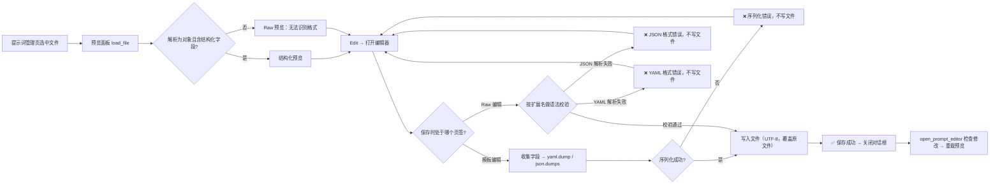

# 提示词结构化编辑器

当你需要编辑 `dict/` 下的自定义翻译提示词文件时，提示词管理页的“编辑”（`Edit`）会打开结构化编辑器。编辑器提供“模板编辑”（`Template Edit`）与“源码编辑”（`Raw Edit`）两种模式：前者把 YAML/JSON 中的结构化字段拆成表单，后者直接编辑文件原文。本页说明两种模式的判定、字段与格式、校验错误以及保存后文件如何被恢复和使用。

本页只覆盖编辑器本身；文件列表、新建/复制/重命名/删除和应用所选提示词见[提示词列表、应用与预览](./list-apply-and-preview.md)，系统提示词与输出格式的组合见[系统与翻译提示词](./system-and-translation-prompts.md)和[上下文与提示词](../translator/context-and-prompts.md)。

## 功能边界

- 结构化编辑器读写的是 `dict/` 下的用户提示词文件（`.yaml`、`.yml`、`.json`），不写 `.env`、`config.json` 或任何 API 凭据。
- 编辑器只负责“写回文件”；“应用所选提示词”（`Apply Selected Prompt`）把路径写入 `translator.high_quality_prompt_path` 属于提示词列表页。
- 内容包含 `ai_colorizer_prompt`、`colorization_rules` 或 `reference_images` 的文件会被识别为 AI 上色提示词，改由专用编辑器打开，不走通用结构化字段。
- AI OCR、AI 渲染的固定提示词在设置页使用各自的简单编辑器，不进入本页的模板字段；系统提示词文件（`system_prompt_hq`、`system_prompt_hq_format`、`system_prompt_line_break`、`glossary_extraction_prompt`）不出现在用户提示词列表中。
- 页面只记录结构和脱敏占位符，不展示真实提示词正文、密钥或私有路径。

## UI 操作

### 打开编辑器 {#open-editor}

1. 打开“提示词管理”（`Prompt Management`），在左侧“提示词列表”（`Prompt List`）中选中一个文件；右侧“提示词预览”（`Prompt Preview`）会显示结构化预览或原始内容。
2. 点击预览面板右上角的“编辑”（`Edit`）按钮，弹出“编辑提示词”（`Edit Prompt`）对话框，窗口标题形如“编辑提示词 – 文件名”。
3. 文件不存在时预览面板显示“文件不存在”（`File not found`）且“编辑”按钮不可用；文件读取失败时编辑器状态栏显示“错误：{error}”（`Error: {error}`）。
4. 设置页“翻译”（`Translation`）分组中的“自定义提示词”（`Custom Prompt`）是下拉框，只负责选择当前提示词文件；修改文件内容需要回到提示词管理页打开编辑器。

### 模板编辑与 Raw 编辑 {#editor-tabs}

编辑器顶部是两个页签：

- “模板编辑”（`Template Edit`）：只有文件能被解析为结构化字段时才出现，按字段拆分表单，并提供“添加字段”（`Add Section`）、上移/下移/删除等操作。
- “源码编辑”（`Raw Edit`）：始终出现，用等宽字体编辑文件原文，顶部提示“直接编辑文件原始内容”（`Edit the raw file content directly`）。

不符合格式的文件只显示“源码编辑”页签。两个页签共享同一个“保存”（`Save`）按钮和底部状态栏；保存后两个页签内容会同步。

### 编辑器文案 {#editor-copy}

| UI 调用 key | English 实际值 | 简体中文实际值 |
| --- | --- | --- |
| `Prompt Management` | Prompt Management | 提示词管理 |
| `Prompt List` | Prompt List | 提示词列表 |
| `Prompt Preview` | Prompt Preview | 提示词预览 |
| `Edit` | Edit | 编辑 |
| `Edit Prompt` | Edit Prompt | 编辑提示词 |
| `Template Edit` | Template Edit | 模板编辑 |
| `Raw Edit` | Raw Edit | 源码编辑 |
| `Edit the raw file content directly` | Edit the raw file content directly | 直接编辑文件原始内容 |
| `Add Section` | Add Section | 添加字段 |
| `All sections added` | All sections added | 所有字段已添加 |
| `Move Up` | Move Up | 上移 |
| `Move Down` | Move Down | 下移 |
| `Add Row` | Add Row | 添加行 |
| `Delete Row` | Delete Row | 删除行 |
| `One rule per line` | One rule per line | 每行一条规则 |
| `Double-click a row to edit details` | Double-click a row to edit details | 双击行可编辑详细信息 |
| `Save` | Save | 保存 |
| `Cancel` | Cancel | 取消 |
| `Loaded successfully` | Loaded successfully | 加载成功 |
| `Error: {error}` | Error: {error} | 错误：{error} |
| `Serialize Error` | Serialize Error | 序列化错误 |
| `Format Error` | Format Error | 格式错误 |
| `Saved successfully` | Saved successfully | 保存成功 |
| `Save failed` | Save failed | 保存失败 |
| `File not found` | File not found | 文件不存在 |
| `Select a prompt file to preview` | Select a prompt file to preview | 选择一个提示词文件以预览 |
| `Unrecognized format – showing raw content` | Unrecognized format – showing raw content | 无法识别格式 – 显示原始内容 |
| `Error reading file: {error}` | Error reading file: {error} | 读取文件出错：{error} |

预览面板和编辑器的结构化标题、表格表头、术语分类等文案也全部经 `_t(...)` 调用，实际值见下文“术语词典分类”与“编辑器文案”之外的对应表格。

## 结构化字段与判定 {#structured-fields}

### 结构化判定 {#structured-detection}

文件先按扩展名解析：`.yaml`/`.yml` 用 PyYAML `safe_load`，其余用 `json.load`。解析结果必须是对象（dict），并且包含以下任一字段才被判定为结构化：

| 判定字段 | 含义 | 在编辑器中的处理 |
| --- | --- | --- |
| `system_prompt` | 自定义系统提示词正文 | 模板编辑中的多行文本框 |
| `project_data` | 项目标题与术语表 | `title` 与 `terminology` 两个子字段 |
| `style_guide` | 风格指南规则列表 | 每行一条规则的多行文本框 |
| `translation_rules` | 翻译规则列表 | 每行一条规则的多行文本框 |
| `glossary` | 按分类组织的术语词典 | 按分类分页签的表格 |

解析失败、根不是对象、或不含上述字段时，预览显示“无法识别格式 – 显示原始内容”，编辑器只保留“源码编辑”页签。根类型错误在相关编辑器中对应文案为“JSON 顶层必须是对象”（`JSON root must be an object`）与“YAML 根节点必须是映射”（`YAML root must be a mapping`）。

### 字段与控件 {#fields-table}

模板编辑页签只按文件已有的字段建立区域，未出现的字段可通过“添加字段”（`Add Section`）补齐。每个字段区域可上移、下移或删除；字段顺序会影响保存后文件的键顺序。

| 字段 key | 控件 | 保存时的序列化结果 |
| --- | --- | --- |
| `system_prompt` | 多行文本框 | 字符串 |
| `project_data.title` | 单行输入框 | `project_data` 下的 `title` |
| `project_data.terminology` | 原文/翻译两列表格 | `project_data` 下的 `terminology` 映射 |
| `style_guide` | “每行一条规则”文本框 | 字符串列表 |
| `translation_rules` | “每行一条规则”文本框 | 字符串列表 |
| `glossary` | 按分类分页签的表格 | 分类到条目列表的映射 |

模板中没有对应控件的其他键会原样保留（“透传”），不会被模板保存丢弃；例如 `output_format`、`persona` 或未来扩展字段在收集数据时保持原值。

### 术语词典分类 {#glossary-categories}

`glossary` 下的分类页签按以下固定分类排序；分类名即存储值，不随界面语言翻译。标准分类显示在分类页签上的文字经 `_t(cat_key)` 翻译，注意 `Org` 的英文实际值不是 `Org`。

| 存储分类 | English 实际值（页签显示） | 简体中文实际值（页签显示） |
| --- | --- | --- |
| `Person` | Person | 人物 |
| `Location` | Location | 地点 |
| `Org` | Organization | 组织 |
| `Item` | Item | 物品 |
| `Skill` | Skill | 技能 |
| `Creature` | Creature | 生物 |

`Person` 分类使用四列表格（`Original` 原文、`Translation` 翻译、`Nicknames` 昵称、`Introduction` 介绍），双击行打开条目对话框，可修改 `Category` 分类并把条目移到其他分类；其余分类使用原文/翻译两列表格。`Person` 条目的 `nicknames` 和 `description` 只在非空时写入文件。空分类会保留，避免保存后 `glossary` 被塌缩成空对象。

## 校验、保存与恢复 {#validation-save-restore}

### 模板页签的保存 {#template-save}

1. 点击“保存”（`Save`）后，先从各控件收集数据（`_collect_template_data`）。
2. 按文件扩展名序列化：`.yaml`/`.yml` 用 `yaml.dump(allow_unicode=True, default_flow_style=False, sort_keys=False)`；`.json` 用 `json.dumps(indent=2, ensure_ascii=False)`。
3. 序列化异常时状态栏显示“❌ 序列化错误”（`Serialize Error`），不写文件。
4. 写入成功后在状态栏显示“✅ 保存成功”（`Saved successfully`），把自由编辑页签内容同步为同一份文本，并关闭对话框。

### Raw 页签的保存 {#raw-save}

Raw 页签保存前按扩展名做语法校验，校验失败不写文件：

- `.json`：`json.loads(content)` 失败 → “❌ JSON 格式错误”（`Format Error`）。
- `.yaml`/`.yml`：`yaml.safe_load(content)` 失败 → “❌ YAML 格式错误”（`Format Error`）。

校验只检查语法，不检查根类型；写入使用 UTF-8 编码，直接覆盖原文件。写入异常时显示“❌ 保存失败”（`Save failed`），对话框不关闭。

### 状态与错误 {#status-errors}

| 状态 | 触发条件 | 结果 |
| --- | --- | --- |
| `Loaded successfully` | 文件读取并完成解析 | 进入可编辑状态 |
| `Error: {error}` | 读取文件失败 | 状态栏显示错误，正文为空 |
| `Serialize Error` | 模板收集或序列化异常 | 不写文件，对话框不关闭 |
| `Format Error` | Raw 中 JSON/YAML 语法错误 | 不写文件，对话框不关闭 |
| `Save failed` | 写入文件异常 | 不写文件，对话框不关闭 |
| `Saved successfully` | 写入成功 | 同步两个页签并关闭对话框 |

### 关闭与恢复 {#close-restore}

- “取消”（`Cancel`）或关闭窗口不会写文件；已编辑内容只在本次会话的控件中。
- 编辑器关闭后，调用方读取 `get_was_modified()`；只要发生过保存，或 Raw 页签内容与打开时不同，就会重新加载预览面板，显示最新的文件内容。
- 提示词文件没有自动备份：编辑器是原地覆盖写入，保存前不会生成 `.bak`。要恢复旧内容需要靠你自己的副本或版本管理，这与批量方案写 `.bak` 的行为不同。
- 文件被改成无法解析后，翻译运行时不会崩溃，而是跳过自定义提示词继续使用内置基础系统提示词；修复文件后重新打开编辑器即可恢复。

## 运行时消费 {#runtime-consumption}

翻译开始前，`_load_and_prepare_prompts` 读取 `translator.high_quality_prompt_path`，用 `load_custom_prompt` 按扩展名解析文件（`.yaml` → `.yml` → `.json` 顺序查找，根不是对象时返回空）。解析出的结构化数据随后被 `_flatten_prompt_data` 递归拍平成文本块，注入到 OpenAI/Gemini 的系统提示词中；目标语言占位符（写作 `target_lang` 三层花括号占位符）会被替换为目标语言全称。

开启“自动提取新术语”（`Auto Extract Glossary`，键 `translator.extract_glossary`）后，翻译提取到的新术语会通过 `merge_glossary_to_file` 自动合并回提示词文件的 `glossary`（按扩展名写 YAML 或 JSON）。也就是说，除了编辑器，运行中的翻译也会在满足条件时写回该文件。

## 依赖与冲突

- 文件格式依赖运行时 PyYAML：`PyYAML` 缺失时 `.yaml`/`.yml` 无法解析，编辑器退化为 Raw 模式，运行时跳过自定义提示词。
- 提示词文件只影响翻译请求的系统提示词；它不保存 API 凭据、不选择翻译器、不参与 API 候选槽轮换。
- 结构化字段的模板保存会保留未知键，但 Raw 页签中手写的键与格式由你自己负责；错误的根类型（如顶层是列表）不会被结构化预览识别。
- 不要把 API Key、Token、用户名、私有绝对路径或业务敏感文本写进提示词文件；文件会被原样展平进请求，并可能出现在日志与调试产物中。
- 自动术语合并会修改当前提示词文件；如果你不希望运行时改动文件，关闭“自动提取新术语”或改用只读副本。

## 关联文件与格式

| 文件/格式 | 本页实际作用 | 手改与兼容注意 |
| --- | --- | --- |
| `dict/*.yaml`、`*.yml`、`*.json` | 结构化编辑器的输入输出格式 | YAML 用 `safe_load`/`dump`，JSON 用 `json.load`/`dumps`；根必须是对象 |
| `dict/prompt_example.yaml` | 新建提示词时的默认模板 | 含 `system_prompt: ""` 与六分类 `glossary`，只记录结构不展示私密正文 |
| `config/config.json` | 保存 `translator.high_quality_prompt_path` | 编辑器不写该文件；应用所选提示词才更新路径 |
| `dict/system_prompt_hq*.yaml` 等 | 系统提示词文件 | 不在用户提示词列表，也不走本页模板字段 |
| `desktop_qt_ui/locales/en_US.json`、`zh_CN.json` | 编辑器与预览文案 | key 与实际显示值见上文表格 |

## Mermaid 数据流限制

上图描述源码确认的“结构化/Raw 判定 → 页签保存 → 校验/序列化 → 写回 → 预览刷新”流程，不代表每次打开都必然保存或发起网络请求。未解析文件、根类型错误、Raw 语法错误、取消关闭等都会走对应旁路；文档没有伪造运行截图或私有任务产物。

## 源码依据 {#source-evidence}

| 层级 | 文件 | 本页核对内容 |
| --- | --- | --- |
| 编辑器 UI | `desktop_qt_ui/ui/secondary_pages/prompt_preview.py` | 结构化判定、模板/Raw 页签、字段控件、保存与校验状态 |
| 提示词页面 | `desktop_qt_ui/ui/main_page/pages/prompt_page.py`、`ui/main_page/layout.py` | 预览面板、Edit 入口、编辑器关闭后的刷新 |
| AI 上色分流 | `desktop_qt_ui/ui/secondary_pages/ai_colorizer_prompt_editor.py` | 专用字段判定与模板页签 |
| UI/i18n | `desktop_qt_ui/app_logic.py`、`desktop_qt_ui/locales/en_US.json`、`zh_CN.json` | key 映射与实际中英文显示值 |
| 文件加载 | `manga_translator/translators/prompt_loader.py`、`desktop_qt_ui/app_logic.py` | YAML/JSON 解析、扩展名查找、系统文件排除 |
| 运行消费 | `manga_translator/manga_translator.py`、`translators/common.py` | 提示词准备、展平、占位符替换、基础提示词回退 |
| 写回 | `manga_translator/translators/common.py` | 自动术语合并写回 `glossary` |

## 验证记录 {#verification}

| 验证内容 | 状态 | 说明 |
| --- | --- | --- |
| BLUEPRINT、PAGE_GUIDELINES、TODO | 完成 | 已读取 1.3 节与 5.7 小节并按页面合同编写 |
| 编辑器 UI 与调用链 | 完成 | 静态核对 `prompt_preview.py`、`prompt_page.py`、`layout.py` 与分流逻辑 |
| `en_US` / `zh_CN` 实际 locale | 完成 | 表格逐项记录 key、English、简体中文实际值 |
| 文件格式与运行时消费 | 完成 | 静态核对 `prompt_loader.py`、`manga_translator.py`、`common.py` |
| 脱敏运行验证 | 待后续 | 未读取真实 `.env`、用户 `config.json`、API key/token、用户名、用户图片或私有提示词 |
| VitePress | 待运行 | 由协调代理在合并前运行 `npm run docs:build --prefix doc/wiki` 及镜像/源码检查 |
