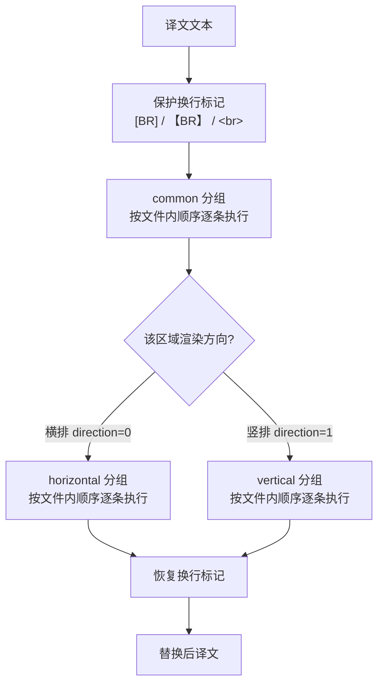
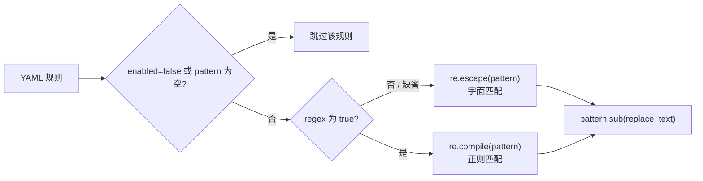
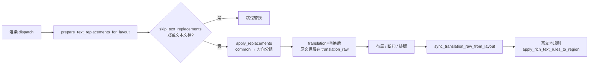

# 替换规则表：分组、顺序与匹配逻辑

当译文中的固定字词、标点符号或竖排字形需要统一改写时，可以使用“替换规则”（`Replacement Rules`）页维护一组在渲染前应用到译文的规则。每条规则从 `config/text_replacements.yaml` 读取，按“通用 → 横排/竖排”的固定顺序逐条执行；本页说明规则如何分组、排序和匹配。

本页负责表格视图的分组、执行顺序、字面/正则匹配和渲染链路调用位置。Raw YAML 编辑模式、正则语法细节以及保存/恢复默认的完整行为见[原始 YAML、正则与保存](./raw-yaml-regex-and-save.md)；替换完成后追加的富文本规则见[富文本规则表：表格、Raw 与匹配](../rich-text-rules/table-raw-and-match.md)。

## 功能边界 {#feature-boundary}

- 三个分组固定为 `common`、`horizontal`、`vertical`：`common` 始终执行，`horizontal` 只在横排渲染时执行，`vertical` 只在竖排渲染时执行。
- 每条规则有 `pattern`、`replace`、`regex`、`enabled`、`comment` 五个字段；表格视图用五列展示这些字段。
- 规则的执行顺序是文件内从上到下：同一分组内先写的规则先应用，替换结果会继续参与后续规则的匹配（级联）。
- 本页不涉及 Raw 编辑模式下的 YAML 语法校验和恢复默认（见[原始 YAML、正则与保存](./raw-yaml-regex-and-save.md)），也不涉及替换完成后的富文本规则（见[富文本规则](../rich-text-rules/table-raw-and-match.md)页面）。

## 在界面中编辑规则表 {#edit-rule-table}

在左侧主导航中打开“替换规则”（`Replacement Rules`）。页面标题下方的副标题提示替换规则的顺序（“通用（始终执行）→ 横排/竖排；规则由上到下级联替换”）。整个页面由一个标题卡片和一个编辑面板组成，没有其他页签或弹窗。

### 三个分组页签 {#group-tabs}

表格视图顶部有一个分组切换器，固定为三个页签。切换页签只会切换当前编辑的分组，不会修改其他分组的数据，也不会触发保存以外的任何运行行为。

| 存储值 | English | 简体中文 | 执行条件 |
| --- | --- | --- | --- |
| `common` | Common (Always) | 通用（始终执行） | 任何方向都执行，先于其他分组 |
| `horizontal` | Horizontal | 横排 | 区域按横排渲染（方向判定为横排）时执行，在 `common` 之后 |
| `vertical` | Vertical | 竖排 | 区域按竖排渲染（方向判定为竖排）时执行，在 `common` 之后 |

### 表格列与工具栏 {#table-columns-and-toolbar}

表格有五列：“启用”（`Enabled`）、“匹配”（`Pattern`）、“替换”（`Replace`）、“正则”（`Regex`）、“备注”（`Comment`）。启用和正则是文字列（`✓`/`✗`），双击单元格即可切换；`✓`/`✗` 是代码常量，不是 i18n key。

工具栏按钮从左到右为：“添加规则”（`Add Rule`）、“删除”（`Delete`）、上移/下移（`↑`/`↓`，只有图标且宽度固定）、“全部选中”（`Select All`）、“启用/禁用”（`Enable`/`Disable`）、“正则/取消正则”（`Regex`/`Cancel Regex`）、“恢复默认”（`Restore Default`）。

| UI 调用 key | English 实际值 | 简体中文实际值 |
| --- | --- | --- |
| `Replacement Rules` | Replacement Rules | 替换规则 |
| `Manage text replacement rules applied to translations before rendering` | Manage text replacements (order: Common (Always), then Horizontal/Vertical; rules cascade from top to bottom). | 管理应用到译文的文本替换规则（顺序：通用（始终执行）→ 横排/竖排；规则由上到下级联替换） |
| `Add Rule` | Add Rule | 添加规则 |
| `Delete` | Delete | 删除 |
| `Select All` | Select All | 全部选中 |
| `Enable` | Enable | 启用 |
| `Disable` | Disable | 禁用 |
| `Regex` | Regex | 正则 |
| `Cancel Regex` | Cancel Regex | 取消正则 |
| `Restore Default` | Restore Default | 恢复默认 |
| `Table View` | Table View | 表格视图 |
| `Raw Edit` | Raw Edit | 源码编辑 |
| `Common (Always)` | Common (Always) | 通用（始终执行） |
| `Horizontal` | Horizontal | 横排 |
| `Vertical` | Vertical | 竖排 |
| `Enabled` | Enabled | 启用 |
| `Pattern` | Pattern | 匹配 |
| `Replace` | Replace | 替换 |
| `Comment` | Comment | 备注 |
| `Filter:` | Filter: | 过滤: |
| `Type to filter by pattern / replace / comment...` | Type to filter by pattern / replace / comment... | 输入匹配 / 替换 / 备注以过滤... |
| `enabled` | enabled | 已启用 |
| `Saved automatically` | Saved automatically | 已自动保存 |
| `File not found` | File not found | 文件不存在 |
| `Load error` | Load error | 加载失败 |
| `Defaults restored` | Defaults restored | 已恢复默认 |
| `Restore default failed` | Restore default failed | 恢复默认失败 |
| `Parse Error` | Parse Error | 解析错误 |
| `Save Error` | Save Error | 保存错误 |
| `Save error` | Save error | 保存失败 |
| `Restore replacement rules to the built-in defaults? Current custom rules will be overwritten.` | Restore replacement rules to the built-in defaults? Current custom rules will be overwritten. | 要将替换规则恢复为内置默认值吗？当前自定义规则会被覆盖。 |
| `YAML syntax error, cannot switch to table view.` | YAML syntax error, cannot switch to table view. | YAML 语法错误，无法切换到表格视图。 |
| `YAML syntax error, changes not saved.` | YAML syntax error, changes not saved. | YAML 语法错误，修改尚未保存。 |

操作步骤：

1. 在某个分组页签下点击“添加规则”（`Add Rule`），表格末尾新增一行：启用为 `✓`、正则为 `✗`，匹配/替换/备注为空，随后自动进入“匹配”单元格编辑。
2. 在“匹配”和“替换”列输入内容；“正则”保持 `✗` 表示字面替换，双击改为 `✓` 表示正则替换。
3. 使用“上移/下移”（`↑`/`↓`）调整当前选中行在分组内的顺序；顺序决定级联匹配的先后。
4. 选中一行或多行后，点击“启用/禁用”（`Enable`/`Disable`）或“正则/取消正则”（`Regex`/`Cancel Regex`）批量切换；按钮文字按选中行的多数状态决定，例如多数已启用时显示“禁用”（`Disable`）。
5. 点击“删除”（`Delete`）删除当前行（每次一行）。编辑会触发 600ms 防抖自动保存，保存成功后状态条显示“已自动保存”（`Saved automatically`）。
6. 点击“恢复默认”（`Restore Default`）会弹出确认框；确认后把 `config/text_replacements.yaml` 覆盖为内置默认模板并重新加载。

“全部选中”（`Select All`）只选中当前分组中未被过滤隐藏的行；被过滤隐藏的行不会参与后续的启用/正则批量切换。

### 过滤与状态 {#filter-and-status}

过滤框的提示文字为“输入匹配 / 替换 / 备注以过滤...”（`Type to filter by pattern / replace / comment...`）。输入后只显示匹配、替换或备注命中该文字的当前分组行；过滤不会改变文件内容，切换分组页签会重新应用过滤。

状态条位于面板底部，格式为 `分组名: 已启用数/总数 已启用 ● [模式]`，例如 `common: 2/3 已启用 ● [表格视图]`。`●` 表示有未保存的修改；文件不存在时显示“文件不存在”（`File not found`），加载失败显示“加载失败”（`Load error`）。

## 规则字段 {#rule-fields}

以下五个字段是表格五列对应的存储字段。`regex`、`enabled`、`comment` 为可选字段，只有非默认值才会写回 YAML；表格保存时跳过“匹配”为空的整行。

#### `pattern` — 匹配 / Pattern {#rule-pattern}

- 控件：表格“匹配”列文本输入；通过“添加规则”新建后自动进入编辑。
- 所在界面：替换规则 → 表格视图 → 任意分组。
- 存储值：YAML 规则的 `pattern` 字符串。
- 可选值：任意文本；当 `regex: true` 时按 Python `re` 语法解析。
- 默认值：核心引擎要求非空（空值规则不参与编译）；表格新行默认空字符串。
- 生效阶段：渲染前文本替换（`apply_replacements` 与富文本条目版 `apply_replacements_to_entries`）。
- 原理：字面模式用 `re.escape(pattern)` 编译，正则模式用 `re.compile(pattern)` 编译；编译失败（正则语法错误）的规则被跳过，其余规则继续执行。
- 依赖与冲突：空 pattern 不会写入 YAML（表格保存时跳过）；换行标记保护占位符不会被误替换，见[匹配逻辑](#matching-logic)。
- 关联文件和调试产物：`config/text_replacements.yaml`。
- 源码依据：`manga_translator/rendering/text_replacements.py#_compile_rule`；表格列在 `desktop_qt_ui/ui/secondary_pages/replacements_editor.py`。
- 验证状态：完成（静态核对）。

#### `replace` — 替换 / Replace {#rule-replace}

- 控件：表格“替换”列文本输入。
- 所在界面：替换规则 → 表格视图 → 任意分组。
- 存储值：YAML 规则的 `replace` 字符串；可为空字符串（把匹配内容删除）。
- 可选值：任意文本；正则模式下支持反向引用（如 `\1`），详见[原始 YAML、正则与保存](./raw-yaml-regex-and-save.md)。
- 默认值：表格新行默认空字符串；引擎侧 `rule.get('replace', '')` 缺省为空。
- 生效阶段：渲染前文本替换。
- 原理：用 `compiled_pattern.sub(replace, text)` 替换所有非重叠命中；同一分组内后一条规则读取的是前一条规则的输出。
- 依赖与冲突：替换结果若再命中后续规则会继续被替换（级联）；富文本条目版替换出的新字符继承被替换段首字符的样式。
- 关联文件和调试产物：`config/text_replacements.yaml`。
- 源码依据：`manga_translator/rendering/text_replacements.py#apply_replacements`、`manga_translator/rendering/rich_text_sync.py#apply_replacements_to_entries`。
- 验证状态：完成（静态核对）。

#### `regex` — 正则 / Regex {#rule-regex}

- 控件：表格“正则”列（`✓`/`✗`），双击或选中后点“正则/取消正则”（`Regex`/`Cancel Regex`）切换。
- 所在界面：替换规则 → 表格视图 → 任意分组。
- 存储值：YAML 规则的 `regex` 布尔值；仅 `true` 时写入，`false` 省略。
- 可选值：`true`（正则匹配）、`false`/缺省（字面匹配）。
- 默认值：引擎 `rule.get('regex', False)`；表格新行 `✗`。
- 生效阶段：规则编译阶段决定匹配方式。
- 原理：字面模式把 pattern 中的正则特殊字符全部转义后按普通文本查找；正则模式按 Python `re` 语法编译并替换。
- 依赖与冲突：启用正则后 pattern 中的特殊字符（如 `.`、`*`）不再按字面处理；正则编译失败会跳过该条规则并记录警告日志。
- 关联文件和调试产物：`config/text_replacements.yaml`。
- 源码依据：`manga_translator/rendering/text_replacements.py#_compile_rule`。
- 验证状态：完成（静态核对）。

#### `enabled` — 启用 / Enabled {#rule-enabled}

- 控件：表格“启用”列（`✓`/`✗`），双击或选中后点“启用/禁用”（`Enable`/`Disable`）切换；禁用行整行灰显。
- 所在界面：替换规则 → 表格视图 → 任意分组。
- 存储值：YAML 规则的 `enabled` 布尔值；仅 `false` 时写入，`true` 省略。
- 可选值：`true`/缺省（执行）、`false`（跳过）。
- 默认值：引擎 `rule.get('enabled', True)`；表格新行 `✓`。
- 生效阶段：规则编译阶段；`enabled: false` 的规则直接不编译、不执行。
- 原理：禁用规则仍保留在文件中并显示在表格里，只是运行时跳过；需要时把该项改回 `✓` 即可。
- 依赖与冲突：禁用不会删除规则内容；状态条中的“已启用数/总数”按启用列统计。
- 关联文件和调试产物：`config/text_replacements.yaml`。
- 源码依据：`manga_translator/rendering/text_replacements.py#_compile_rule`、`desktop_qt_ui/ui/secondary_pages/replacements_editor.py#_on_toggle_enabled`。
- 验证状态：完成（静态核对）。

#### `comment` — 备注 / Comment {#rule-comment}

- 控件：表格“备注”列文本输入。
- 所在界面：替换规则 → 表格视图 → 任意分组。
- 存储值：YAML 规则的 `comment` 字符串；仅非空时写入。
- 可选值：任意文本；不参与匹配。
- 默认值：表格新行空字符串。
- 生效阶段：无（纯说明性字段）。
- 原理：备注不参与编译与替换；过滤框会把匹配、替换、备注三列合并后做大小写不敏感的子串匹配。
- 依赖与冲突：无运行期影响；建议写清规则的用途，便于过滤定位。
- 关联文件和调试产物：`config/text_replacements.yaml`。
- 源码依据：`desktop_qt_ui/ui/secondary_pages/replacements_editor.py#_add_rule_to_table`、`_apply_filter`。
- 验证状态：完成（静态核对）。

## 分组与执行顺序 {#groups-and-order}

对一段译文，引擎按以下顺序执行：先保护换行标记，再应用 `common` 分组，然后根据区域的渲染方向应用 `horizontal` 或 `vertical` 分组，最后恢复换行标记。

方向的判定来自 `_resolve_region_render_horizontal`：当区域被强制指定方向（`h`/`horizontal` → 横排，`v`/`vertical` → 竖排）时按强制值执行；否则回退到区域的检测方向（`region.horizontal` 属性，由目标语言预设或宽高比等推断）。渲染方向由渲染设置与检测结果共同决定，替换规则本身不修改方向。

同一分组内，先写的规则先执行，后一条规则在已替换的文本上继续匹配，因此顺序会直接影响结果。例如先执行 `A → B`，再执行 `B → C`，最终 `A` 会被替换为 `C`；如果两条规则顺序颠倒，`B → C` 不会命中 `A`。

## 匹配逻辑 {#matching-logic}

每条规则先被编译为 `(compiled_pattern, replace_string)`，再通过 `pattern.sub(replace, text)` 应用到文本。匹配方式由 `regex` 字段决定：

- 字面匹配：pattern 中的 `.`、`*`、`(` 等正则特殊字符全部被转义，按普通文本逐字符匹配。
- 正则匹配：pattern 按 Python `re` 语法编译，支持反向引用等能力；语法错误时该条规则被跳过并记录警告，不影响其他规则。
- 换行标记保护：`[BR]`、`【BR】`、` `、` `（大小写不敏感）在替换前被替换为占位符，替换结束后恢复，避免标记内容被误替换。
- 富文本条目版（`apply_replacements_to_entries`）会额外跳过空匹配和跨 `\n` 的命中；替换出的字符继承被替换段首字符的样式。
- 模块内还提供 `build_h2v_dict`/`build_v2h_dict` 两个辅助函数，从 vertical/horizontal 分组抽取单字符字面映射；当前渲染链路没有引用它们（静态核对结果）。

## 渲染链路中的调用位置 {#render-pipeline}

替换在渲染阶段、排版测量之前执行，替换结果写入 `region.translation`，替换前文本保留在 `region.translation_raw`；随后布局断句仍可修改译文，最后再同步回原文坐标并执行富文本规则。

- `skip_text_replacements` 为真时整页跳过替换：渲染过的 JSON 导出会写入 `skip_text_replacements: true`，避免导入重渲染时二次替换；编辑器导出的 JSON 恒标记跳过；JSON 缺省为 `false`，导入渲染时正常应用。
- 富文本文档（`is_rich_text_document`）与已生成替换记录的区域不会重复替换；替换前文本通过 `ReplacementLayoutRecord(raw_text, replaced_text)` 记录，供布局改动投影回原文坐标。
- 编辑器里编辑“替换前译文”（`translation_raw`）时，`editor_controller._apply_translation_replacements` 会实时用同一引擎同步到译文；失败时回退原文。
- 富文本同步（`rich_text_sync.py`）对富文本条目跑同一套 common + 方向分组的“条目版”替换，并把富文本规则放在替换之后。

## 依赖与冲突 {#dependencies-and-conflicts}

- 执行哪个方向分组取决于区域的渲染方向，与渲染设置的“方向”选项和检测结果有关；替换规则不改变方向。
- `text_replacements.yaml` 与 `rich_text_rules.yaml` 是独立文件：替换先于富文本规则执行，富文本规则读取的是替换完成后的译文。
- `batch_edit_schemes.yaml` 与替换规则同目录同 YAML 格式，但属于批量管理模块，不进入渲染管线。
- 启动时 `ensure_runtime_files` 会创建缺失的 `config/text_replacements.yaml`，并把历史默认模板（按 MD5 识别）升级为当前内置模板；用户自定义内容不会被覆盖。
- 规则内容可能包含业务术语或特殊文本。共享日志、请求导出或调试目录前应删除请求正文、历史页文本、路径和凭据。

## 关联文件与格式 {#related-files-and-formats}

| 文件/格式 | 本页实际作用 | 手改与兼容注意 |
| --- | --- | --- |
| `config/text_replacements.yaml` | 替换规则的持久化文件，表格视图直接读写 | 保持顶层三个分组（`common`/`horizontal`/`vertical`）为列表；表格保存按固定分组顺序重排键 |
| 内置默认模板（`_DEFAULT_REPLACEMENTS_YAML`） | “恢复默认”写入的内容；缺失文件时由启动逻辑创建 | 只使用脱敏示例；恢复默认会覆盖用户自定义规则 |
| `config/rich_text_rules.yaml` | 富文本规则文件，替换完成后执行 | 与替换规则独立，见富文本规则页面 |
| `config/batch_edit_schemes.yaml` | 批量方案文件 | 不参与渲染，见批量管理页面 |
| 翻译 JSON 的 `skip_text_replacements` 标志 | 记录某张图是否已应用替换，避免重渲染二次替换 | 缺省 `false`；不要手改该标志 |

## Mermaid 数据流限制 {#diagram-limits}

上面的三张图描述的是源码确认的分组顺序、匹配分支和渲染调用位置，不代表每次运行都一定执行替换：`skip_text_replacements`、富文本文档、空译文、加载失败和特殊工作流都会走对应旁路。本页没有伪造运行截图或私有任务产物；表格内容以脱敏示例为准。

## 源码依据 {#source-evidence}

| 层级 | 文件 | 本页核对内容 |
| --- | --- | --- |
| 页面入口 | `desktop_qt_ui/ui/main_page/pages/replacements_page.py` | 页面标题/副标题、编辑面板嵌入 |
| 主导航 | `desktop_qt_ui/ui/main_window.py` | “替换规则”导航项与语言切换刷新 |
| 编辑面板 | `desktop_qt_ui/ui/secondary_pages/replacements_editor.py` | 三分组页签、五列表格、工具栏、过滤、状态条、防抖自动保存、缓存失效、恢复默认 |
| UI/i18n | `desktop_qt_ui/locales/en_US.json`、`zh_CN.json` | key 映射与实际中英文显示值 |
| 引擎 | `manga_translator/rendering/text_replacements.py` | 分组解析、字面/正则编译、common → 方向分组顺序、换行标记保护、mtime 缓存、恢复默认 |
| 渲染调用 | `manga_translator/rendering/text_replacement_layout.py` | `prepare_text_replacements_for_layout`、`sync_translation_raw_from_layout`、`skip_text_replacements` |
| 方向判定与调度 | `manga_translator/rendering/__init__.py` | `_resolve_region_render_horizontal` 与两处调用点 |
| 富文本条目版 | `manga_translator/rendering/rich_text_sync.py` | `apply_replacements_to_entries`、样式继承、空匹配/跨行跳过 |
| 编辑器消费者 | `desktop_qt_ui/editor/editor_controller.py` | 编辑替换前译文时实时同步 |
| JSON 往返 | `manga_translator/manga_translator.py`、`desktop_qt_ui/services/export_service.py` | `skip_text_replacements` 写入与读取 |
| 运行时文件 | `manga_translator/runtime_files.py` | 启动创建、默认模板迁移 |

## 验证记录 {#verification}

| 验证内容 | 状态 | 说明 |
| --- | --- | --- |
| BLUEPRINT、PAGE_GUIDELINES、TODO | 完成 | 已完整读取并按页面合同编写 |
| UI 布局与调用 | 完成 | 静态核对导航、页面、编辑面板的分组/列/工具栏/过滤/状态 |
| `en_US` / `zh_CN` 实际 locale | 完成 | 三列表逐项记录 key、English、简体中文实际值 |
| 分组顺序与匹配逻辑 | 完成 | 静态核对 `text_replacements.py`、`text_replacement_layout.py`、`rich_text_sync.py` 与调用图 |
| 脱敏运行验证 | 待后续 | 未读取真实 `.env`、用户 `config.json`、API key/token、用户名、用户图片或私有规则正文 |
| VitePress | 待运行 | 由协调代理在合并前运行 `npm run docs:build --prefix doc/wiki` 及镜像/源码检查 |
