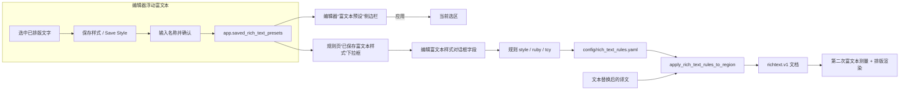

# 富文本样式与预设

当规则命中译文后，除了改变文字本身，还需要同时调整字号、颜色、描边、间距或方向时，本页用于配置每条富文本规则追加的样式字段，以及如何把编辑器里保存的样式预设直接载入规则。规则的匹配条件、表格与 Raw 编辑见[富文本规则：表格、Raw 与匹配](./table-raw-and-match.md)；在编辑器中手工创建样式预设见[浮动富文本编辑器](../editor/floating-rich-text.md)。

## 功能边界

- 每条规则的样式存放在 `config/rich_text_rules.yaml` 的 `style`、`ruby`、`tcy` 字段；“编辑富文本样式”（`Edit Rich Text Style`）对话框的每个控件都映射回这些字段。
- “已保存富文本样式：”（`Saved rich text style:`）下拉框只读取 `app.saved_rich_text_presets`，不在本页创建、重命名或删除预设；预设的增删改在编辑器浮动富文本面板的“富文本预设”（`Rich Text Presets`）侧边栏完成。
- 自动规则使用“只补缺、不覆盖”语义：已有手工富文本字段保留，规则只追加尚未设置的字段；编辑器增量场景改为 `skip` 语义，命中区间带手工痕迹时整段跳过。
- `editor_auto_rich_text_rules` 是编辑器打字时自动应用规则的开关，不是规则文件本身，也不控制渲染管线。
- 纵中横（TCY）与注音（Ruby）是节点级结构，不是 `TextStyle` 字段；规则通过顶层 `tcy` / `ruby` 两个独立字段写入。

## UI 操作

### 打开样式编辑对话框 {#open-style-dialog}

1. 打开“富文本规则”（`Rich Text Rules`）页面。
2. 保持在“表格视图”（`Table View`），在“通用（始终执行）”（`Common (Always)`）、“横排”（`Horizontal`）、“竖排”（`Vertical`）中选择规则所在分组。
3. 双击或选中目标行“富文本编辑”（`Rich Text Style`）列中的“编辑样式”（`Edit Style`）按钮，打开“编辑富文本样式”（`Edit Rich Text Style`）对话框。
4. 在对话框中只启用本规则需要追加的属性；未启用的字段不会写入规则。提示语为“只启用本条规则需要追加的样式属性；已有相同富文本属性会保留，不会被自动规则覆盖。”
5. 点击“确定”（`OK`）把字段序列化回规则并触发自动保存；点击“重置”（`Reset`）清空为无样式；“取消”（`Cancel`）丢弃修改。序列化失败会弹出“无效样式”（`Invalid Style`）警告。

### 载入已保存样式 {#load-saved-style}

1. 在“编辑富文本样式”对话框顶部，从“已保存富文本样式：”（`Saved rich text style:`）下拉框选择一个名称。
2. 选择后控件会一次性载入该预设的全部字段（含注音与纵中横），再按需要微调。
3. 列表第一项是“选择已保存富文本样式”（`Select saved rich text style`），不代表任何预设；下拉框提示为“选择一个已保存富文本样式并载入”（`Choose a saved rich text style to load`）。

### 样式摘要与过滤 {#style-summary}

- 表格“富文本编辑”列按钮用缩写显示已设置字段：`B` 加粗、`I` 斜体、`U` 下划线、`C` 颜色、`%` 字号倍率、`S` 字号、`F` 字体、`O` 描边、`OS` 外描边、`G` 发光、`D` 着重号、`FA` 强制推进、`K` 字后间距、`PK` 字前间距、`LK` 与前一行间距、`NK` 与后一行间距、`XY/Rot` 变换、`R` 注音、`T` 纵中横。
- 过滤框“按匹配内容、样式或备注筛选...”（`Type to filter by pattern / style / comment...`）会同时匹配样式 JSON，因此可以直接输入颜色值或字号定位规则。

### 对话框与页面文案 {#ui-strings}

| UI 调用 key | English 实际值 | 简体中文实际值 |
| --- | --- | --- |
| `Rich Text Rules` | Rich Text Rules | 富文本规则 |
| `Table View` | Table View | 表格视图 |
| `Raw Edit` | Raw Edit | 源码编辑 |
| `Common (Always)` | Common (Always) | 通用（始终执行） |
| `Horizontal` | Horizontal | 横排 |
| `Vertical` | Vertical | 竖排 |
| `Enabled` | Enabled | 启用 |
| `Pattern` | Pattern | 匹配 |
| `Rich Text Style` | Rich Text Style | 富文本编辑 |
| `Regex` | Regex | 正则 |
| `Comment` | Comment | 备注 |
| `Edit Style` | Edit Style | 编辑样式 |
| `Edit Rich Text Style` | Edit Rich Text Style | 编辑富文本样式 |
| `Saved rich text style:` | Saved rich text style: | 已保存富文本样式： |
| `Select saved rich text style` | Select saved rich text style | 选择已保存富文本样式 |
| `Choose a saved rich text style to load` | Choose a saved rich text style to load | 选择一个已保存富文本样式并载入 |
| `Enable only the style properties this rule should apply.` | Enable only the style properties this rule should add. Existing matching rich-text fields are preserved and are not overwritten. | 只启用本条规则需要追加的样式属性；已有相同富文本属性会保留，不会被自动规则覆盖。 |
| `Switches` | Switches | 开关 |
| `Bold` | Bold | 加粗 |
| `Underline` | Underline | 下划线 |
| `Emphasis` | Emphasis | 着重号 |
| `Vertical-in-Horizontal (TCY)` | Vertical-in-Horizontal (TCY) | 竖排内横排（纵中横） |
| `Ruby Text` | Ruby Text | 注音文本 |
| `Reset` | Reset | 重置 |
| `Cancel` | Cancel | 取消 |
| `OK` | OK | 确定 |
| `Invalid Style` | Invalid Style | 无效样式 |
| `Add Rule` | Add Rule | 添加规则 |
| `Delete` | Delete | 删除 |
| `Enable` | Enable | 启用 |
| `Restore Default` | Restore Default | 恢复默认 |
| `Filter:` | Filter: | 过滤: |
| `Saving...` | Saving... | 正在保存... |
| `All changes saved` | All changes saved | 所有修改已保存 |
| `Load error` | Load error | 加载失败 |
| `Save error` | Save error | 保存失败 |
| `YAML Error` | YAML Error | YAML 错误 |
| `YAML root must be a mapping` | YAML root must be a mapping | YAML 根节点必须是映射 |
| `Rich Text Presets` | Rich Text Presets | 富文本预设 |
| `No saved styles` | No saved styles | 暂无已保存样式 |
| `Choose a saved style to apply` | Choose a saved style to apply | 选择一个已保存样式并应用到当前选区 |
| `Rename preset` | Rename preset | 重命名预设 |
| `Delete preset` | Delete preset | 删除预设 |
| `Save Style` | Save Style | 保存样式 |
| `Enter style preset name:` | Enter style preset name: | 输入样式名称： |
| `Rich Text Preset` | Rich Text Preset | 富文本预设 |
| `Rename style preset` | Rename style preset | 重命名样式预设 |
| `Enter a new style preset name:` | Enter a new style preset name: | 输入新的样式名称： |
| `Style preset name cannot be empty` | Style preset name cannot be empty | 样式名称不能为空 |
| `Style preset '{name}' already exists. Overwrite?` | Style preset '{name}' already exists. Overwrite? | 样式“{name}”已存在，是否覆盖？ |
| `Delete style preset '{name}'?` | Delete style preset '{name}'? | 确定删除样式“{name}”？ |
| `Failed to save style preset` | Failed to save style preset | 保存样式失败 |

## 样式字段 {#style-fields}

每个样式字段对应 `richtext.v1` 的 `TextStyle` / `transform` 键。只有启用的字段会被 `text_style_from_control_values()` 写入规则；写入前统一经过 `TextStyle.from_dict().to_dict()` 归一化，未知键会让该条规则编译失败并被整体跳过。字段默认值是控件默认值，不是区域或区域样式默认值。

#### `bold` — 加粗 / Bold {#field-bold}

- 控件：勾选框（位于“开关”行）。
- 存储值：`style.bold: true`。
- 可选值：启用（写 `true`）/ 未启用（不写入）。
- 默认值：控件默认未勾选；协议默认 `false`。
- 生效阶段：排版渲染（选择加粗字形）。
- 原理：勾选后把 `bold: true` 写入规则样式；与 `underline`、`emphasis` 互不冲突，可同时启用。
- 图示：不需要：单一布尔值，无分支或状态变化。

#### `underline` — 下划线 / Underline {#field-underline}

- 控件：勾选框（位于“开关”行）。
- 存储值：`style.underline: true`。
- 可选值：启用 / 未启用。
- 默认值：控件默认未勾选；协议默认 `false`。
- 生效阶段：排版渲染（下划线）。
- 原理：勾选后写入 `underline: true`，渲染层为命中文本绘制下划线。
- 图示：不需要：单一布尔值，无分支。

#### `emphasis` — 着重号 / Emphasis {#field-emphasis}

- 控件：勾选框（位于“开关”行）。
- 存储值：`style.emphasis: true`。
- 可选值：启用 / 未启用。
- 默认值：控件默认未勾选；协议默认 `false`。
- 生效阶段：排版渲染（着重号）。
- 原理：勾选后写入 `emphasis: true`，渲染层为命中文本附加着重号。
- 图示：不需要：单一布尔值，无分支。

#### `tcy` — 竖排内横排（纵中横）/ Vertical-in-Horizontal (TCY) {#field-tcy}

- 控件：勾选框（位于“开关”行）。
- 存储值：规则顶层 `tcy: true`（不是 `style` 字段）。
- 可选值：`true` / `false`。
- 默认值：控件默认未勾选；内置默认竖排规则中有一条 `tcy: true` 示例（连续 `!?` 2–4 个）。
- 生效阶段：竖排排版；只在竖排方向生效。
- 原理：命中区间被包装为 `tcy` 节点，竖排中把这段字符按横排排版，例如连续问号和感叹号。
- 依赖与冲突：横排命中时该字段不生效；与 `ruby` 同区间时按规则产物节点处理，已有手工节点时编辑器 `skip` 语义跳过。
- 图示：不需要：方向布尔分支已在正文描述。

#### `ruby` — 注音文本 / Ruby Text {#field-ruby}

- 控件：文本输入框（占位符“注音文本”），需先勾选启用。
- 存储值：规则顶层 `ruby: "..."`（不是 `style` 字段）。
- 可选值：任意字符串；空字符串等价于没有注音。
- 默认值：未启用，无注音。
- 生效阶段：排版渲染（注音节点）。
- 原理：命中区间被包装为 `ruby` 节点，注音文字渲染在被注音字符旁。
- 依赖与冲突：`ruby: null`（YAML 空值）等价于无注音；注音不是字符串时该条规则编译失败。
- 图示：不需要：单值字段，无分支。

#### `italic` — 斜体角度 / Italic Angle {#field-italic}

- 控件：双精度数字框，范围 `[-85, 85]`，默认 `15`，步进 `1`。
- 存储值：`style.italic`：数字表示切变角度（度，正值向右倾）；`true` 表示默认 15 度斜体；`false` / `0` 表示无斜体。
- 可选值：布尔或数字；协议 `_parse_italic` 把 `0` 归一为 `False`。
- 默认值：控件默认 `15`；协议默认 `false`。
- 生效阶段：排版渲染（字形切变）。
- 原理：编辑器把 `italic: true` 映射为角度控件中的 `15.0`，避免把布尔误当成 1 度。
- 依赖与冲突：角度受控件范围限制；保存时经 `TextStyle` 校验。
- 图示：不需要：数值字段，无分支。

#### `color` — 文字颜色 / Text Color {#field-color}

- 控件：颜色选择器，默认 `#E53935`；常用颜色存入 `app.saved_colors`。
- 存储值：`style.color`（十六进制颜色字符串）。
- 可选值：任意十六进制颜色。
- 默认值：控件默认 `#E53935`；协议默认无颜色。
- 生效阶段：排版渲染（文字前景色）。
- 原理：颜色值原样写入 `style.color`；取色对话框标题为“选择富文本颜色”。
- 依赖与冲突：单值字段；颜色值随用户业务内容变化，注意脱敏。
- 图示：不需要：单值字段，无分支。

#### `fontSize` — 绝对字号 / Font Size {#field-font-size}

- 控件：整数数字框，范围 `[1, 1000]`，默认 `24`。
- 存储值：`style.fontSize`（数字）。
- 可选值：`1`–`1000` 的整数。
- 默认值：控件默认 `24`；协议默认无（沿用区域字号）。
- 生效阶段：排版渲染（局部字号）与富文本二次测量。
- 原理：命中文本使用该绝对字号；渲染时规则命中的区域会做第二次测量，让局部字号反映到最终渲染框。
- 依赖与冲突：与 `scale` 是不同维度：`fontSize` 是绝对值，`scale` 是相对倍率。
- 图示：不需要：数值字段，无分支。

#### `scale` — 字号倍率 / Scale {#field-scale}

- 控件：双精度数字框，范围 `[0.1, 10]`，默认 `1.2`，步进 `0.05`。
- 存储值：`style.scale`（倍率）。
- 可选值：`0.1`–`10` 的浮点数。
- 默认值：控件默认 `1.2`；协议默认 `1.0`（`to_dict` 在等于 `1.0` 时省略字段）。
- 生效阶段：排版渲染（相对字号缩放）。
- 原理：`scale` 相对区域字号缩放命中文本；与 `fontSize` 绝对值是不同维度。
- 依赖与冲突：`0.1` 是控件最小值而不是禁用语义；`scale=1.0` 归一化后不会写入字段。
- 图示：不需要：数值字段，无分支。

#### `verticalAdvance` — 强制推进 / Force Advance {#field-vertical-advance}

- 控件：下拉框，选项“半格推进”与“全角推进”。
- 存储值：`style.verticalAdvance`，值为 `half` 或 `full`。
- 可选值：`half` | Half Advance | 半格推进；`full` | Full Advance | 全角推进。
- 默认值：未启用；协议默认无。
- 生效阶段：竖排排版（字符推进量）。
- 原理：强制竖排中每个字符占据半格或全格推进，用于纠正标点占位。
- 依赖与冲突：协议只接受 `half` / `full`，其他值抛错。
- 图示：不需要：枚举值，正文已列全。

#### `fontFamily` — 字体 / Font Family {#field-font-family}

- 控件：字体下拉框（系统与项目字体目录，按当前 locale 排序）。
- 存储值：`style.fontFamily`（字体名）。
- 可选值：本机已安装字体与项目字体目录内容。
- 默认值：未启用；协议默认无。
- 生效阶段：排版渲染（字体选择）。
- 原理：选中字体名写入 `style.fontFamily`；渲染层按字体名加载字形。
- 依赖与冲突：字体列表随本机安装与目录内容变化，不是固定枚举。
- 图示：不需要：单值字段，无分支。

#### `stroke` — 描边 / Stroke {#field-stroke}

- 控件：颜色选择器（默认 `#FFFFFF`）+ 宽度数字框（范围 `[0, 20]`，默认 `0.07`，步进 `0.05`）。
- 存储值：`style.stroke: { color, width }`。
- 可选值：颜色与宽度组合。
- 默认值：控件默认颜色 `#FFFFFF`、宽度 `0.07`；协议默认无描边。
- 生效阶段：排版渲染（文字描边）。
- 原理：同时写入颜色与宽度；常用描边颜色存入 `app.saved_stroke_colors`。
- 依赖与冲突：与 `outerStroke` 是两套独立描边（内描边 vs 外描边）。
- 图示：不需要：两个子值，无分支。

#### `outerStroke` — 外描边 / Outer Stroke {#field-outer-stroke}

- 控件：颜色选择器（默认 `#000000`）+ 宽度数字框（默认 `0.20`）。
- 存储值：`style.outerStroke: { color, width }`。
- 可选值：颜色与宽度组合。
- 默认值：控件默认颜色 `#000000`、宽度 `0.20`；协议默认无外描边。
- 生效阶段：排版渲染（文字外描边）。
- 原理：外描边比内描边更靠外，常用于需要更强对比的场景；常用颜色存入 `app.saved_outer_stroke_colors`。
- 依赖与冲突：与 `stroke` 独立。
- 图示：不需要：两个子值，无分支。

#### `glow` — 发光 / Glow {#field-glow}

- 控件：颜色选择器（默认 `#00FFFF`）+ 模糊数字框（默认 `0.10`）。
- 存储值：`style.glow: { color, blur }`。
- 可选值：颜色与模糊值组合。
- 默认值：控件默认颜色 `#00FFFF`、模糊 `0.10`；协议默认无发光。
- 生效阶段：排版渲染（文字发光）。
- 原理：`blur` 控制光晕范围；常用发光颜色存入 `app.saved_glow_colors`。
- 依赖与冲突：与描边字段互不影响。
- 图示：不需要：两个子值，无分支。

#### `kerning` / `preKerning` / `lineKerning` / `nextKerning` — 四类间距 {#field-kernings}

- 控件：四个双精度数字框，范围 `[-5, 5]`，默认 `0`，步进 `0.05`。
- 存储值：`style.kerning`、`style.preKerning`、`style.lineKerning`、`style.nextKerning`。
- 可选值：`-5`–`5` 的浮点数；负数为收紧。
- 默认值：控件默认 `0`；协议默认 `0.0`（`lineKerning`、`nextKerning` 协议默认无，仅在有值时写入）。
- 生效阶段：排版渲染（字距 / 行距）。
- 原理：`kerning` 是字后间距，`preKerning` 是字前间距，`lineKerning` 是与前一行间距，`nextKerning` 是与后一行间距。
- 依赖与冲突：四个字段语义不同但控件一致；`0` 表示不调整。
- 图示：不需要：数值字段，无分支。

#### `transform` — 局部旋转与偏移 / Rotation and Offset {#field-transform}

- 控件：三个数字框：“局部旋转”（`[-180, 180]`，默认 `0`）、“水平偏移”（`[-500, 500]`，默认 `0`，后缀 `%`）、“垂直偏移”（`[-500, 500]`，默认 `0`，后缀 `%`）。
- 存储值：`style.transform: { rotation, offsetX, offsetY }`。
- 可选值：旋转角度与偏移百分比。
- 默认值：全部为 `0`；协议默认无变换。
- 生效阶段：排版渲染（字形旋转与位移）。
- 原理：竖排内置规则用 `rotation: -90` 把无专用字形符号旋转 90 度（引擎正角度为逆时针，竖排取顺时针即 `-90`）；`offsetX` / `offsetY` 以百分比位移。
- 依赖与冲突：`transform` 为嵌套 dict；只有启用字段才会写入。
- 图示：不需要：数值字段，无分支。

## 预设应用 {#preset-application}

### 在浮动富文本编辑器中保存预设 {#save-preset-in-editor}

在编辑器选中一段已排好样式的文字，打开浮动富文本编辑器，用“保存样式”（`Save Style`）按钮把当前选区的样式保存为预设。弹窗输入“输入样式名称：”（`Enter style preset name:`），名称默认为“富文本预设 N”。空名称提示“样式名称不能为空”；同名时确认“样式“{name}”已存在，是否覆盖？”。预设内容只包含 `style`、`ruby`、`tcy`，不包含匹配条件。

预设列表显示在“富文本预设”（`Rich Text Presets`）侧边栏，每个预设可应用（`Choose a saved style to apply`）到当前选区、重命名（`Rename preset`）或删除（`Delete preset`）；无预设时显示“暂无已保存样式”（`No saved styles`）。保存失败会提示“保存样式失败”（`Failed to save style preset`）。

### 在规则页载入预设 {#load-preset-in-rules-page}

规则页的“已保存富文本样式：”下拉框读取同一份 `app.saved_rich_text_presets`：每个预设先经 `normalize_rich_text_preset()` 校验，再经 `normalize_text_style()` 归一化，`tcy` 与 `ruby` 从载荷中提取后并入样式。选择某个名称后 `load_style()` 把全部字段写入样式对话框控件；下拉框只读不写，规则页不提供预设的增删改入口。

### 渲染时应用样式 {#render-time-application}

普通翻译流程中，规则在文本替换与断句完成后应用：`apply_rich_text_rules_to_region()` 读取替换后的 `translation`（或已有 `translation_rich`），按 `common` → 当前方向分组顺序匹配，把命中字符追加 `automatic_style`，再按“只补缺”合并进最终样式，生成 `richtext.v1` 文档；BR 标记随后转换为段落边界。规则命中的区域会做第二次富文本测量，让局部字号、倍率、描边等反映到最终渲染框。

### 预设与规则数据流 {#preset-data-flow}

## 依赖与冲突

- 规则应用顺序固定为 `common`（通用）→ 当前方向的 `horizontal` / `vertical`；后一条规则可在自动样式内覆盖前一条的同名字段，但已有的手工富文本字段始终保留。
- 样式对话框与批量管理的“设置富文本”动作共用 `RichTextStyleDialog`；本页只描述规则场景，批量场景见[批量管理：预览、应用与恢复](../batch-management/preview-apply-restore.md)。
- 预设与规则是两套存储：预设存 `app.saved_rich_text_presets`（用户 `config.json`），规则存 `config/rich_text_rules.yaml`；载入预设只是把字段填进对话框，不自动建立新规则。
- `editor_auto_rich_text_rules` 关闭时编辑器打字不再自动应用规则，但渲染管线仍然会应用 `config/rich_text_rules.yaml`。
- 样式值可能包含用户业务内容（颜色、字体名、注音）。共享日志、配置导出或调试目录前必须删除规则正文、预设名称、颜色与注音文本等私有内容。

## 关联文件与格式

| 文件/格式 | 本页实际作用 | 手改与兼容注意 |
| --- | --- | --- |
| `config/rich_text_rules.yaml` | 规则与样式持久化：顶层 `common` / `horizontal` / `vertical` 列表，规则含 `enabled` / `pattern` / `regex` / `style` / `ruby` / `tcy` / `comment` | 必须保持可解析 YAML；`style` 只接受 `TextStyle` 已知键，未知键使该条规则编译失败并被跳过 |
| `config/config.json` | `app.saved_rich_text_presets` 预设持久化 | 不读取或展示真实用户文件；预设载荷为 `{ style, ruby, tcy }` |
| `config/config-example.json` | 发行默认 `saved_rich_text_presets: null`、`editor_auto_rich_text_rules: true` | 只使用脱敏示例 |
| `app.saved_colors` / `saved_stroke_colors` / `saved_outer_stroke_colors` / `saved_glow_colors` | 颜色选择器的常用颜色列表 | 名称就是显示值和存储值，随用户使用累积 |
| `richtext.v1` 文档 | 规则产物与最终渲染输入 | 格式、块与行内结构由 `manga_translator/rendering/rich_text.py` 唯一实现 |

## Mermaid 数据流限制

上图描述的是源码确认的预设共享与规则应用路径。它不表示每次渲染都必须有预设：没有预设时下拉框为空、规则页只能手工填写字段；`editor_auto_rich_text_rules` 关闭、空命中、无效规则和特殊工作流都会走相应旁路。文档没有伪造运行截图或私有任务产物。

## 源码依据 {#source-evidence}

| 层级 | 文件 | 本页核对内容 |
| --- | --- | --- |
| 规则页 UI | `desktop_qt_ui/ui/main_page/pages/rich_text_rules_page.py` | 页面标题、副标题与面板挂载 |
| 样式对话框 | `desktop_qt_ui/ui/secondary_pages/rich_text_rules_editor.py` | `RichTextStyleControls` 字段、范围与默认值、`RichTextStyleDialog`、缩写摘要与过滤 |
| 样式归一化 | `desktop_qt_ui/editor/rich_text_editing.py` | `normalize_text_style`、`text_style_to_control_values`、`text_style_from_control_values` |
| 预设存储 | `desktop_qt_ui/editor/rich_text_presets.py` | `normalize_rich_text_preset`、`RichTextPresetStore` 读改写与失败回滚 |
| 预设 UI | `desktop_qt_ui/ui/widgets/rich_text_floating_editor.py`、`rich_text_editor_components.py` | 保存/应用/重命名/删除预设、侧边栏列表与提示 |
| 配置模型 | `desktop_qt_ui/core/config_models.py`、`config/config-example.json` | `app.saved_rich_text_presets`、`editor_auto_rich_text_rules` 默认值 |
| 规则加载/应用 | `manga_translator/rendering/rich_text_rules.py` | 默认规则 YAML、编译、缓存失效、`_merge_style`、只补缺、tcy/ruby |
| 渲染接入 | `manga_translator/rendering/text_replacement_layout.py`、`rendering/__init__.py` | 替换后应用规则、二次测量与最终渲染 |
| 编辑器自动规则 | `desktop_qt_ui/editor/rich_text_editor_state.py`、`manga_translator/rendering/rich_text_sync.py` | 打字时增量应用、`skip` 语义 |
| 协议与 i18n | `manga_translator/rendering/rich_text.py`、`desktop_qt_ui/locales/en_US.json`、`zh_CN.json` | `TextStyle` / `transform` 键、实际中英文显示值 |

## 验证记录 {#verification}

| 验证内容 | 状态 | 说明 |
| --- | --- | --- |
| BLUEPRINT、PAGE_GUIDELINES、TODO | 完成 | 已完整读取并按页面合同编写 |
| 样式控件与字段映射 | 完成 | 静态核对 `RichTextStyleControls` 字段、范围、默认值与 `text_style_from_control_values` |
| 预设读写与共享 | 完成 | 静态核对 `RichTextPresetStore`、浮动编辑器与规则页下拉框共用 `app.saved_rich_text_presets` |
| `en_US` / `zh_CN` 实际 locale | 完成 | 页面表格逐项记录 key、English、简体中文实际值 |
| 渲染期应用与二次测量 | 完成 | 静态核对 `text_replacement_layout.py`、`rich_text_rules.py`、`rendering/__init__.py` |
| 脱敏运行验证 | 待后续 | 本页未读取真实用户 `config.json`、私有规则正文、预设名称或颜色 |
| VitePress | 待运行 | 由协调代理在合并前运行 `npm run docs:build --prefix doc/wiki` 及镜像/源码检查 |