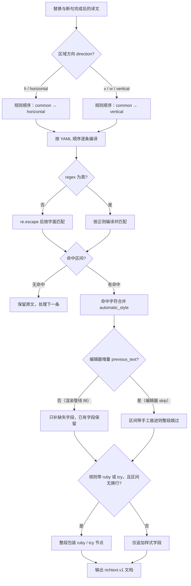

# 富文本规则表、Raw 编辑与匹配逻辑

当希望译文自动出现加粗、颜色、描边、注音或纵中横等效果，而不逐条手工编辑时，使用“富文本规则”（`Rich Text Rules`）页面。规则在文本替换完成后、渲染之前匹配译文，只“追加”尚未设置的富文本字段，不改变译文文字。本页介绍表格视图（`Table View`）与源码编辑（`Raw Edit`）两种编辑方式、每条规则的字段，以及匹配与执行流程。

文本替换规则见[替换规则：表格分组与顺序](../replacement-rules/table-groups-and-order.md)和[替换规则：Raw、正则与保存](../replacement-rules/raw-yaml-regex-and-save.md)；样式属性本身的字段含义、保存的样式预设和编辑器内的样式面板见[富文本样式与预设](./styles-and-presets.md)。

## 功能边界 {#feature-boundary}

- 富文本规则读取“替换及断句完成后的译文”：`[BR]`、`【BR】`、` ` 和换行会先被转换为段落边界，规则不会给标记本身加样式。
- 规则按组执行：`common`（通用，始终执行）→ 再根据区域方向选择 `horizontal`（横排）或 `vertical`（竖排）。
- 规则只追加样式、注音和纵中横节点，不替换文字、不删除已有手工富文本字段；命中区间是否带手工痕迹由“填充/跳过”策略决定（见匹配流程）。
- 本页不负责文本替换规则、编辑器手工样式或样式预设的保存/删除（见上方关联页面），也不保存 API 凭据或用户私有内容。

## UI 操作 {#ui-operations}

### 打开富文本规则页 {#open-page}

1. 打开左侧主导航中的“富文本规则”（`Rich Text Rules`）页；页面标题下方是规则编辑面板，底部状态栏显示加载与保存状态。
2. 面板顶部工具栏包含“添加规则”（`Add Rule`）、“删除”（`Delete`）、上移 `↑`、下移 `↓`、“启用”（`Enable`）、“正则”（`Regex`）和“恢复默认”（`Restore Default`）。
3. 工具栏下方是过滤框和“表格视图”（`Table View`）/“源码编辑”（`Raw Edit`）模式切换。

### 表格视图 {#table-view}

“表格视图”是默认模式，按组显示规则：

- 用“通用（始终执行）”（`Common (Always)`）、“横排”（`Horizontal`）、“竖排”（`Vertical`）三个页签切换当前组；对应 YAML 键 `common`、`horizontal`、`vertical`。
- 每行五列：`启用`（Enabled）、`匹配`（Pattern）、`富文本编辑`（Rich Text Style）、`正则`（Regex）、`备注`（Comment）。
- “启用”和“正则”列是 `✓`/`✗` 文本，双击单元格可切换；选中多行后点工具栏“启用”或“正则”可批量切换。
- “富文本编辑”列是样式按钮：未设置样式时显示“编辑样式”（`Edit Style`），设置后显示样式缩写（如 `B I C % S` 表示加粗、斜体、颜色、倍率、字号）；单击按钮打开“编辑富文本样式”对话框。
- “添加规则”在底部插入一行并直接进入“匹配”列编辑；“删除”删除选中行；`↑`/`↓` 移动选中行顺序。顺序决定后一条自动规则能否覆盖前一条的同名字段。
- 过滤框按“匹配、样式或备注”做包含筛选（`Type to filter by pattern / style / comment...`），只隐藏不匹配的行，不修改数据。

### 源码编辑（Raw） {#raw-edit}

1. 切换到“源码编辑”（`Raw Edit`）后，编辑区显示整份 YAML 原文，使用等宽字体和 YAML 语法高亮，提示“直接编辑原始 YAML 内容，修改会自动保存。”（`Edit raw YAML content directly. Changes are saved automatically.`）。
2. 从表格切到 Raw 时，当前表格数据会序列化为 YAML；从 Raw 切回表格时会解析并校验：根节点必须是映射、`common`/`horizontal`/`vertical` 必须是列表，否则弹出“YAML 错误”（`YAML Error`）警告并停留在 Raw 模式。
3. 修改后状态栏先显示“正在保存...”（`Saving...`），600 ms 防抖后写回文件并显示“所有修改已保存”（`All changes saved`）；写回失败显示“保存失败：{error}”（`Save error: {error}`），原始修改保留在编辑器里。

### 编辑样式对话框 {#style-dialog}

单击“富文本编辑”列的样式按钮打开“编辑富文本样式”（`Edit Rich Text Style`）对话框：

- 顶部可从“已保存富文本样式：”（`Saved rich text style:`）下拉框载入预设。
- “开关”（`Switches`）行提供“加粗”（`Bold`）、“下划线”（`Underline`）、“着重号”（`Emphasis`）、“竖排内横排（纵中横）”（`Vertical-in-Horizontal (TCY)`）。
- 其余字段都是可选字段，由行首 checkbox 控制是否启用：`注音文本`（Ruby Text）、`斜体角度`（Italic Angle）、`文字颜色`（Text Color）、`绝对字号`（Font Size）、`字号倍率`（Scale）、`强制推进`（Force Advance，半格/全格）、`字体`（Font Family）、`描边`（Stroke）、`外描边`（Outer Stroke）、`发光`（Glow）、`字后间距`（Kerning）、`字前间距`（Pre Kerning）、`与前一行间距`（Line Kerning）、`与后一行间距`（Next Kerning）、`局部旋转`（Rotation）、`水平偏移`（Offset X）、`垂直偏移`（Offset Y）。
- 对话框提示“只启用本条规则需要追加的样式属性；已有相同富文本属性会保留，不会被自动规则覆盖。”（`Enable only the style properties this rule should apply.`）。确定时校验样式，非法时弹出“无效样式”（`Invalid Style`）。

### 状态与错误 {#status-errors}

| UI 调用 key | English 实际值 | 简体中文实际值 |
| --- | --- | --- |
| `Rich Text Rules` | Rich Text Rules | 富文本规则 |
| `Automatically style text matched after replacement rules are applied` | Add rich-text styles after text replacements (order: Common (Always), Horizontal/Vertical, then rich-text rules). Existing matching rich-text fields are preserved, and BR markers remain paragraph boundaries. | 自动为文本替换完成后的译文追加富文本样式（顺序：替换规则中的“通用（始终执行）”→ 横/竖排 → 富文本规则；已有相同富文本属性不会覆盖；BR 标记会作为换行边界保护） |
| `Add Rule` | Add Rule | 添加规则 |
| `Delete` | Delete | 删除 |
| `Enable` | Enable | 启用 |
| `Regex` | Regex | 正则 |
| `Restore Default` | Restore Default | 恢复默认 |
| `Filter:` | Filter: | 过滤: |
| `Type to filter by pattern / style / comment...` | Type to filter by pattern / style / comment... | 按匹配内容、样式或备注筛选... |
| `Table View` | Table View | 表格视图 |
| `Raw Edit` | Raw Edit | 源码编辑 |
| `Common (Always)` | Common (Always) | 通用（始终执行） |
| `Horizontal` | Horizontal | 横排 |
| `Vertical` | Vertical | 竖排 |
| `Enabled` | Enabled | 启用 |
| `Pattern` | Pattern | 匹配 |
| `Rich Text Style` | Rich Text Style | 富文本编辑 |
| `Comment` | Comment | 备注 |
| `Edit Style` | Edit Style | 编辑样式 |
| `Edit Rich Text Style` | Edit Rich Text Style | 编辑富文本样式 |
| `Edit raw YAML content directly. Changes are saved automatically.` | Edit raw YAML content directly. Changes are saved automatically. | 直接编辑原始 YAML 内容，修改会自动保存。 |
| `All changes saved` | All changes saved | 所有修改已保存 |
| `Saving...` | Saving... | 正在保存... |
| `Load error` | Load error | 加载失败 |
| `Save error` | Save error | 保存失败 |
| `YAML Error` | YAML Error | YAML 错误 |
| `YAML root must be a mapping` | YAML root must be a mapping | YAML 根节点必须是映射 |
| `Rule group '{group}' must be a list` | Rule group '{group}' must be a list | 规则分组“{group}”必须是列表 |
| `Restore rich text rules to the built-in defaults? Current custom rules will be overwritten.` | Restore rich text rules to the built-in defaults? Current custom rules will be overwritten. | 要将富文本规则恢复为内置默认值吗？当前自定义规则会被覆盖。 |
| `Defaults restored` | Defaults restored | 已恢复默认 |
| `Restore default failed` | Restore default failed | 恢复默认失败 |
| `Invalid Style` | Invalid Style | 无效样式 |
| `Reset` | Reset | 重置 |
| `Cancel` | Cancel | 取消 |
| `OK` | OK | 确定 |
| `Bold` | Bold | 加粗 |
| `Underline` | Underline | 下划线 |
| `Emphasis` | Emphasis | 着重号 |
| `Vertical-in-Horizontal (TCY)` | Vertical-in-Horizontal (TCY) | 竖排内横排（纵中横） |
| `Ruby text` | Ruby text | 注音文本 |
| `Color` | Color | 颜色 |
| `Saved rich text style:` | Saved rich text style: | 已保存富文本样式： |
| `Select saved rich text style` | Select saved rich text style | 选择已保存富文本样式 |
| `Choose a saved rich text style to load` | Choose a saved rich text style to load | 选择一个已保存富文本样式并载入 |

## 参数与选项 {#parameters-and-options}

每条规则是 `config/rich_text_rules.yaml` 中某个分组列表里的一个映射。下表字段是规则映射的 YAML 键，界面上的控件与显示值以上文表格为准。

#### `enabled` — 启用 / Enabled {#rule-enabled}

- 控件：表格“启用”列（`✓`/`✗`）。
- 存储值：布尔；`true` 参与匹配，`false` 在编译阶段整条跳过。
- 可选值：YAML 布尔 `true` / `false`；表格显示为 `✓` / `✗`。
- 默认值：内置示例规则的 `enabled: false`，竖排内置规则为 `true`；首次启动由 `ensure_rich_text_rules_exists` 写入该文件。
- 生效阶段：渲染前富文本规则编译与匹配（也用于编辑器自动应用）。
- 原理：`_compile_rule` 对 `enabled` 为假或缺失的规则返回 `None`，不进入匹配。
- 依赖与冲突：关闭的规则不参与匹配，也不影响其他规则。
- 关联文件和调试产物：只影响 `config/rich_text_rules.yaml`，不产生调试图片。
- 图示：不需要：仅决定单条规则是否参与，无分支图信息量。
- 源码依据：`manga_translator/rendering/rich_text_rules.py#_compile_rule`、`desktop_qt_ui/ui/secondary_pages/rich_text_rules_editor.py#_insert`。
- 验证状态：完成（静态核对）。

#### `pattern` — 匹配 / Pattern {#rule-pattern}

- 控件：表格“匹配”列文本编辑。
- 存储值：字符串；空字符串的规则在编译阶段被跳过。
- 可选值：任意字符串；`regex: false` 时按字面文本匹配（内部用 `re.escape` 转义），`regex: true` 时按正则匹配。
- 默认值：内置示例 `pattern: "示例"`；竖排内置为符号字符类和 `[!?！？]{2,4}`。
- 生效阶段：匹配阶段，位于替换与断句之后。
- 原理：`_compile_rule` 按 `regex` 标志选择 `re.compile(pattern)` 或 `re.compile(re.escape(pattern))`；非法正则会记录警告并跳过该规则，界面不弹窗。匹配在“匹配文本”上逐条执行，零宽命中（`start == end`）会被忽略。
- 性能/API 成本：无 API 调用；规则数量和译文长度只影响 CPU 匹配时间。
- 图示：见“匹配与执行流程”。
- 源码依据：`rich_text_rules.py#_compile_rule`、`#apply_rich_text_rules`。
- 验证状态：完成（静态核对）。

#### `regex` — 正则 / Regex {#rule-regex}

- 控件：表格“正则”列（`✓`/`✗`）或工具栏“正则”批量切换。
- 存储值：布尔；`true` 把 `pattern` 作为 Python `re` 正则编译，`false` 作为字面文本。
- 可选值：YAML 布尔 `true` / `false`。
- 默认值：内置示例 `regex: false`；竖排内置为 `regex: true`。
- 生效阶段：编译与匹配阶段。
- 原理：正则开启时支持字符类、量词、捕获组与环视；字面模式会把元字符转义，因此写 `[!?]` 不会得到字符类。
- 依赖与冲突：正则错误只跳过本条规则并记录警告；命中区间决定哪些字符被应用样式。
- 图示：见“匹配与执行流程”。
- 源码依据：`rich_text_rules.py#_compile_rule`。
- 验证状态：完成（静态核对）。

#### `style` — 富文本样式 / Rich Text Style {#rule-style}

- 控件：表格“富文本编辑”列的样式按钮 → “编辑富文本样式”对话框。
- 存储值：映射；包含 `bold`、`italic`、`color`、`scale`、`fontSize`、`fontFamily`、`stroke`、`outerStroke`、`glow`、`emphasis`、`verticalAdvance`、`kerning`、`preKerning`、`lineKerning`、`nextKerning`、`transform`（旋转/偏移）、`ruby`、`tcy` 等键。没有样式、注音且没有 tcy 的规则在编译时被丢弃。
- 可选值：各字段的取值范围见“编辑样式对话框”小节；每个字段可独立启用或关闭。
- 默认值：内置竖排符号规则为 `transform: rotation: -90`；通用示例为 `style: {}`。
- 生效阶段：渲染前样式合并与编辑器自动应用。
- 原理：命中字符先把规则样式合并进 `automatic_style`（规则之间后一条覆盖前一条同名字段），最后用“只补缺失字段”的方式合入字符已有样式，因此手工字段永远保留。
- 依赖与冲突：已有手工富文本字段不被覆盖；编辑器的“跳过”策略会整段跳过带手工痕迹的命中。
- 图示：见“匹配与执行流程”。
- 源码依据：`rich_text_rules.py#_merge_style`、`#_add_missing_style`、`#_style_is_subset`。
- 验证状态：完成（静态核对）。

#### `ruby` — 注音文本 / Ruby text {#rule-ruby}

- 控件：“编辑富文本样式”对话框中的“注音文本”输入框。
- 存储值：字符串；YAML 空值（`null`）等价于没有注音，不使规则非法。
- 可选值：任意字符串；命中区间内逐字套用该注音。
- 默认值：内置规则均无注音。
- 生效阶段：渲染前的节点包装。
- 原理：命中区间没有换行标记（`[BR]`/换行等）且区间字符都没有手工节点时，整个命中区间被包装为 `ruby` 节点；已有手工节点的区间在“填充”策略下不重包。
- 依赖与冲突：注音与 `tcy` 互斥（`ruby` 优先）；换行标记会阻止节点包装。
- 图示：见“匹配与执行流程”。
- 源码依据：`rich_text_rules.py#apply_rich_text_rules`。
- 验证状态：完成（静态核对）。

#### `tcy` — 竖排内横排 / Vertical-in-Horizontal (TCY) {#rule-tcy}

- 控件：“编辑富文本样式”对话框中的“竖排内横排（纵中横）”开关。
- 存储值：布尔；仅竖排方向（`vertical` 组）生效。
- 可选值：YAML 布尔 `true` / `false`。
- 默认值：内置竖排第二规则为 `tcy: true`（连续 2–4 个问号/感叹号）。
- 生效阶段：渲染前的节点包装。
- 原理：只有区域方向为竖排时 `allow_tcy` 才为真；命中区间无换行且无手工节点时包装为 `tcy` 节点。
- 依赖与冲突：横排规则即使写 `tcy: true` 也不会生效。
- 图示：见“匹配与执行流程”。
- 源码依据：`rich_text_rules.py#apply_rich_text_rules`、`#_direction_group`。
- 验证状态：完成（静态核对）。

#### `comment` — 备注 / Comment {#rule-comment}

- 控件：表格“备注”列文本编辑。
- 存储值：字符串，仅用于界面展示与过滤，不参与匹配。
- 可选值：任意字符串。
- 默认值：内置规则带中文说明（如竖排符号旋转与纵中横示例）。
- 生效阶段：无（元数据）。
- 原理：过滤框会拼接“匹配、样式、备注”做包含判断。
- 依赖与冲突：无。
- 图示：不需要：纯备注字段，无分支。
- 源码依据：`rich_text_rules_editor.py#_filter`。
- 验证状态：完成（静态核对）。

#### 分组键 `common` / `horizontal` / `vertical` {#rule-groups}

- 控件：表格视图顶部的组页签。
- 存储值：YAML 顶层三个键，值必须是列表。
- 可选值：`common` | Common (Always) | 通用（始终执行）；`horizontal` | Horizontal | 横排；`vertical` | Vertical | 竖排。
- 默认值：内置文件含 `common` 一条示例（默认禁用）、`horizontal: []`、`vertical` 两条启用规则。
- 生效阶段：规则迭代顺序。
- 原理：`_iter_rules` 先产出 `common` 全部规则，再按区域方向产出对应方向组；区域方向取 `region.direction`（`h`/`v`/`vr` 等，`v`/`vr`/`vertical` 视为竖排，其余为横排）。
- 依赖与冲突：同一组内按 YAML 顺序执行；Raw 里手改分组键名会导致该组规则不被识别。
- 图示：见“匹配与执行流程”。
- 源码依据：`rich_text_rules.py#_iter_rules`、`#_direction_group`、`#_parse_rules`。
- 验证状态：完成（静态核对）。

## 匹配与执行流程 {#matching-flow}

- 字面匹配：`regex: false` 时 `pattern` 经 `re.escape` 转义，`[`、`(`、`*` 等元字符按普通字符对待。
- 增量语义：渲染管线不传 `previous_text`，所有命中都算新命中；编辑器在每次文字变更时传编辑前正文，只应用“编辑前不存在”的新命中，未改动文字上的旧命中不会被重复上样式（手工清掉的样式不会被顶回来）。
- 填充与跳过：渲染管线用 `fill` 策略按字段补缺；编辑器用 `skip` 策略，命中区间带任何“本规则给不出”的富文本（手工痕迹）时整段跳过，只有规则自身的残留样式允许整体补齐。
- 节点包装：`ruby` 或竖排 `tcy` 只在命中区间不含换行标记、且区间字符没有手工节点时整段包装。
- 第二次测量：命中自动规则的区域会标记 `_rich_text_rules_applied`，渲染时对这些区域用 `skip_text_replacements=True` 补做一次富文本测量，让局部字号、倍率、描边等样式反映到最终渲染框；BR 结构不会被再次改写。

## 依赖与冲突 {#dependencies-and-conflicts}

- 富文本规则依赖文本替换规则先执行：改文字会清掉命中区间的样式，所以样式必须放在替换之后。固定顺序为“属性 → 替换 → 富文本”。
- 规则只加样式不改字：编辑器应用规则后如果产物可见文字与译文不一致，会丢弃规则结果并保留同步结果。
- 竖排内置示例用 `transform.rotation: -90` 旋转符号（引擎正角度为逆时针，竖排取顺时针即 `-90`）；方向不同走不同规则组。
- 已有手工富文本字段不被自动规则覆盖；编辑器 `skip` 策略连命中区间都不改。
- 文件按 mtime 缓存：外部修改 `config/rich_text_rules.yaml` 后重新加载即可；UI 保存会主动失效缓存并重新加载。
- “编辑时自动应用富文本规则”（`Auto Apply Rich Text Rules While Editing`，键 `app.editor_auto_rich_text_rules`）是编辑器消费开关，不是规则文件内容；关闭后编辑器不再自动应用，但渲染管线仍会应用。
- 不要把 API Key、Token、用户名、私有绝对路径或业务敏感文本写进规则备注；规则文件可能出现在日志与调试产物中。

## 关联文件与格式 {#related-files}

| 文件/格式 | 本页实际作用 | 手改与兼容注意 |
| --- | --- | --- |
| `config/rich_text_rules.yaml` | 规则持久化文件；首次启动由 `ensure_rich_text_rules_exists` 创建 | 根节点必须是映射，`common`/`horizontal`/`vertical` 必须是列表；Raw 保存会写入 `\n` 换行文本 |
| 表格视图 ↔ Raw | 同一份数据的两种编辑视图 | 切换时双向同步；Raw 解析失败会停留在 Raw 模式并弹“YAML 错误” |
| `desktop_qt_ui/locales/en_US.json`、`zh_CN.json` | 页面与编辑器文案 | key 与实际显示值见上文“状态与错误”表格 |
| `desktop_qt_ui/core/config_models.py#AppSection` | `app.editor_auto_rich_text_rules` 默认 `true` | 只控制编辑器自动应用，不写入规则文件 |
| `config/config.json` | 保存 `app.editor_auto_rich_text_rules` 等应用设置 | 规则本身不保存在该文件；不读取或展示真实用户配置 |

## Mermaid 数据流限制 {#mermaid-limits}

上图描述源码确认的“方向分组 → 逐条编译 → 字面/正则匹配 → 样式合并 → fill/skip → 节点包装”流程，不代表每次运行都有命中或必然产生富文本文档。`enabled: false`、空 `pattern`、非法正则、无样式/注音/tcy 的规则、无命中、命中区间带换行或手工痕迹都会走对应旁路；文档没有伪造运行截图或私有任务产物。

## 源码依据 {#source-evidence}

| 层级 | 文件 | 本页核对内容 |
| --- | --- | --- |
| 页面与导航 | `desktop_qt_ui/ui/main_page/pages/rich_text_rules_page.py`、`ui/main_window.py`、`ui/main_page/view.py` | 页面标题/副标题、主导航入口、语言切换刷新 |
| 编辑器 UI | `desktop_qt_ui/ui/secondary_pages/rich_text_rules_editor.py` | 工具栏、过滤、表格/Raw 切换、自动保存、状态栏、样式对话框与可选字段 |
| UI/i18n | `desktop_qt_ui/app_logic.py`、`desktop_qt_ui/locales/en_US.json`、`zh_CN.json` | key 映射与实际中英文显示值 |
| 规则加载与匹配 | `manga_translator/rendering/rich_text_rules.py` | 分组顺序、字面/正则编译、fill/skip、增量语义、ruby/tcy 包装、mtime 缓存 |
| 渲染消费 | `manga_translator/rendering/text_replacement_layout.py`、`manga_translator/rendering/__init__.py` | 替换与断句后应用、BR 段落边界、自动富文本区域的第二次测量 |
| 编辑器消费 | `desktop_qt_ui/editor/rich_text_editor_state.py`、`manga_translator/rendering/rich_text_sync.py` | 编辑时增量应用、`styled_match_policy="skip"`、产物文字不一致时丢弃 |
| 配置文件 | `manga_translator/runtime_files.py`、`runtime_paths.py` | `config/rich_text_rules.yaml` 的初始化与路径 |
| 配置模型 | `desktop_qt_ui/core/config_models.py`、`services/config_service.py` | `app.editor_auto_rich_text_rules` 默认值与持久化 |

## 验证记录 {#verification}

| 验证内容 | 状态 | 说明 |
| --- | --- | --- |
| BLUEPRINT、PAGE_GUIDELINES、TODO | 完成 | 已读取 1.3 节与 5.8 小节并按页面合同编写 |
| 编辑器 UI 与调用链 | 完成 | 静态核对 `rich_text_rules_editor.py`、`rich_text_rules_page.py`、`main_window.py`、`view.py` |
| `en_US` / `zh_CN` 实际 locale | 完成 | 页面表格逐项记录 key、English、简体中文实际值 |
| 匹配与执行流程 | 完成 | 静态核对 `rich_text_rules.py`、`text_replacement_layout.py`、`rendering/__init__.py`、编辑器增量消费 |
| 路由镜像与源码检查 | 待运行 | 合并前运行 `node scripts/verify-route-mirror.mjs .` 与 `node scripts/verify-source-evidence.mjs .` |
| 脱敏运行验证 | 待后续 | 未读取真实 `.env`、用户 `config.json`、API key/token、用户名、用户图片或私有提示词 |
| VitePress | 待运行 | 由协调代理在合并前运行 `npm run docs:build --prefix doc/wiki` |
