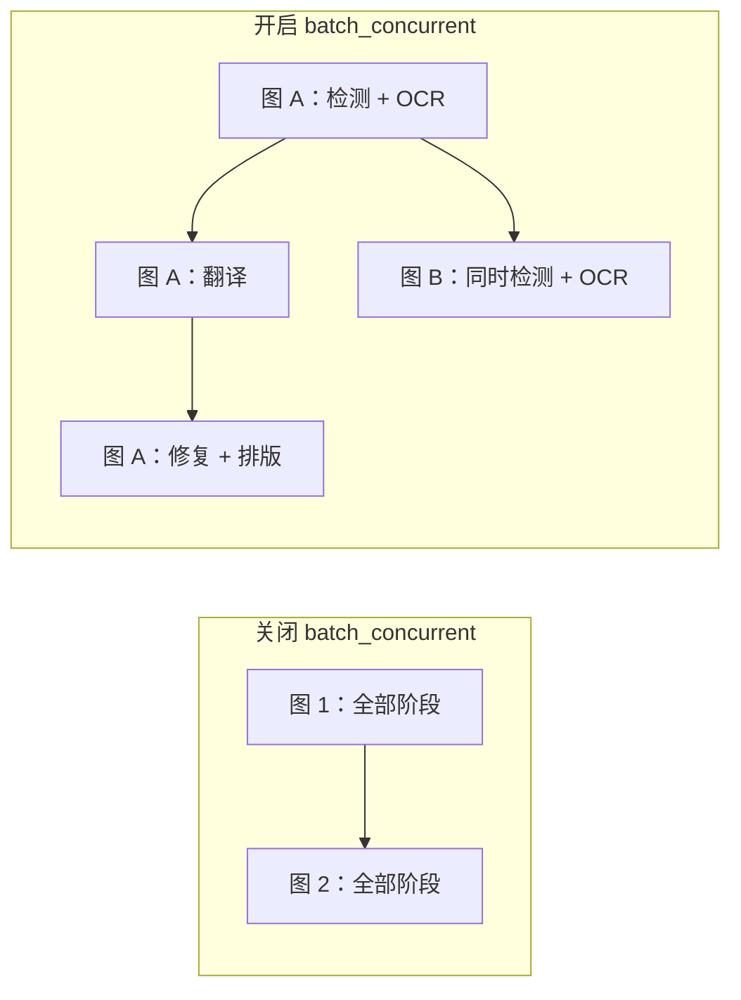
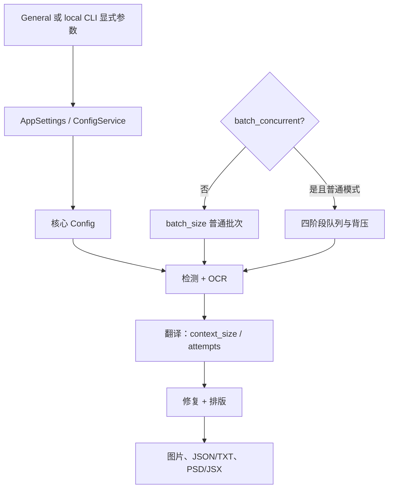

# CLI、批量与输出

本页覆盖 General 设置中 CLI、批量和输出字段，以及本地 `local` CLI 的显式覆盖；不覆盖 API 凭据、检测/OCR/翻译器/排版算法。配置文件和截图均须脱敏，不展示真实 key、token、用户名、私有绝对路径、用户图片或私有提示词。

## 功能边界 {#feature-boundary}

包含日志、错误隔离、GPU/ONNX、重试、翻译上下文、批次/流水线、格式/质量/覆盖、文本/JSON/TXT、原图目录、PSD/JSX、自定义 API 参数文件和翻译后模型清理。`context_size` 实际位于 Translation 页签；特殊工作流的按钮属于翻译工作区，本页只说明其对批量的影响。

## UI 操作 {#ui-operations}

打开“设置”并选择 General；数值是输入框，布尔项是开关，`format` 是下拉框。General 的布局来自 `settings_tab_layout.json` 的 `tab_custom_1`。修改会立即更新内存并合并写盘；导入配置/切换预设可能重建行。`use_custom_api_params` 旁的 `Edit` 是打开 JSON 的文件编辑动作，不是普通配置值。

| UI 调用 key | `en_US` 实际值 | `zh_CN` 实际值 | 控件/字段 |
| --- | --- | --- | --- |
| `label_verbose` | Verbose Logging | 详细日志 | `cli.verbose` 开关 |
| `label_attempts` | Retry Attempts | 重试次数 | `cli.attempts` 整数 |
| `label_ignore_errors` | Ignore Errors | 忽略错误 | `cli.ignore_errors` 开关 |
| `label_use_gpu` | Use GPU | 使用 GPU | `cli.use_gpu` 开关 |
| `label_disable_onnx_gpu` | Disable ONNX GPU Acceleration | 禁用 ONNX GPU 加速 | `cli.disable_onnx_gpu` 开关 |
| `label_context_size` | Context Pages | 上下文页数 | `cli.context_size` 整数 |
| `label_format` | Output Format | 输出格式 | `cli.format` 下拉 |
| `label_overwrite` | Overwrite Existing Files | 覆盖已存在文件 | `cli.overwrite` 开关 |
| `label_skip_no_text` | Skip Images Without Text | 跳过无文本图像 | `cli.skip_no_text` 开关 |
| `label_save_text` | Editable Image | 图片可编辑 | `cli.save_text` 开关 |
| `label_save_quality` | Image Save Quality | 图像保存质量 | `cli.save_quality` 整数 |
| `label_batch_size` | Batch Size | 批量大小 | `cli.batch_size` 整数 |
| `label_batch_concurrent` | Concurrent Batch Processing | 并发批量处理 | `cli.batch_concurrent` 开关 |
| `label_export_editable_psd` | Export Editable PSD | 导出可编辑PSD | `cli.export_editable_psd` 开关 |
| `label_psd_script_only` | Generate PSD Script Only | 仅生成PSD脚本 | `cli.psd_script_only` 开关 |
| `label_save_to_source_dir` | Save to Source Directory | 输出到原图目录 | `cli.save_to_source_dir` 开关 |
| `label_unload_models_after_translation` | Unload Models After Translation | 翻译完成后卸载模型 | `app.unload_models_after_translation` 开关 |
| `label_use_custom_api_params` | Use Custom API Params | 使用自定义API参数 | 根字段开关 + `Edit` |

本地 CLI 的正式入口来自 `manga_translator/args.py`：`python -m manga_translator local -i <脱敏输入> [-o <脱敏输出>]`。`-i/--input` 支持多个值；`--config`、`-v/--verbose`、`--overwrite`、`--use-gpu`、`--disable-onnx-gpu`、`--format`、`--batch-size`、`--attempts` 可覆盖配置，但**未传值不覆盖**。正式顶层子命令是 `local`、`web`、`ws`、`shared`；本页只讲 `local`。

## 选项中英对照 {#option-matrix}

| 存储值 | English | 简体中文 | 行为 |
| --- | --- | --- | --- |
| `不指定`/空/`none` | Not Specified | 不指定 | 保留原扩展名 |
| `png` | png | png | PNG |
| `jpg`/`jpeg`/`jfif` | jpg/jpeg/jfif | jpg/jpeg/jfif | JPEG（RGB 转换） |
| `webp` | webp | webp | 支持质量 |
| `avif` | avif | avif | 需 Pillow 编解码支持 |
| `bmp` | bmp | bmp | BMP（RGB 转换） |
| `tiff`/`tif` | tiff/tif | tiff/tif | TIFF |
| `heic`/`heif` | heic/heif | heic/heif | HEIF，需编解码支持 |

工作流文案也按源码链核对：

| UI 调用 key | English 实际值 | 简体中文实际值 | 字段 |
| --- | --- | --- | --- |
| `label_load_text` | Import Translation | 导入翻译 | `cli.load_text` |
| `label_translate_json_only` | Translate JSON Only | 仅翻译（JSON） | `cli.translate_json_only` |
| `label_template` | Export Original Text | 导出原文 | `cli.template` |
| `label_generate_and_export` | Export Translation | 导出翻译 | `cli.generate_and_export` |
| `label_replace_translation` | Replace Translation Mode | 替换翻译模式 | `cli.replace_translation` |
| `label_colorize_only` | 缺失（未在设置标签映射调用） | 缺失（同上） | `cli.colorize_only` |
| `label_upscale_only` | 缺失（未在设置标签映射调用） | 缺失（同上） | `cli.upscale_only` |
| `label_inpaint_only` | 缺失（未在设置标签映射调用） | 缺失（同上） | `cli.inpaint_only` |

### 参数与消费者

| 锚点/键 | 默认值（核心 / Qt / 发行示例） | 生效阶段与影响 | 最终消费者、依赖/冲突 |
| --- | --- | --- | --- |
| [`cli.verbose`](#cli-verbose) | `false / false / false` | 全流程日志、verbose 调试产物 | logger、`_result_path`；增加磁盘 I/O |
| [`cli.attempts`](#cli-attempts) | `-1 / -1 / 3` | 翻译请求/API 候选重试；`-1` 无限 | `retry.py`、`api_key_rotation.py`；不等同 HQ 质量重试 |
| [`cli.ignore_errors`](#cli-ignore-errors) | `false / false / false` | 逐图错误隔离 | 核心批处理/并发队列；继续后必须看错误汇总 |
| [`cli.use_gpu`](#cli-use-gpu) | `true / true / true` | 模型加载/推理 | Torch、各模型；驱动/显存不匹配会回退或失败 |
| [`cli.disable_onnx_gpu`](#cli-disable-onnx-gpu) | `false / false / false` | ONNX 会话 | ONNX provider；不关闭 Torch CUDA |
| [`cli.context_size`](#cli-context-size) | `0 / 3 / 3` | 翻译上下文页 | 最近非空历史页；增加 token/请求体 |
| [`cli.batch_size`](#cli-batch-size) | `1 / 1 / 3` | 翻译批次、并发队列上限、内存峰值 | `manga_translator.py`、并发流水线；特殊模式可强制 1 |
| [`cli.batch_concurrent`](#cli-batch-concurrent) | `调用控制 / false / false` | 检测+OCR、翻译、修复、排版流水线 | 四线程池/队列；特殊模式强制关闭 |
| [`cli.format`](#cli-format) | `不指定 / 不指定 / 不指定` | 扩展名、Pillow 编码/颜色模式 | `image_formats.py`/`save.py`；AVIF/HEIF 依赖编解码器 |
| [`cli.overwrite`](#cli-overwrite) | `true / true / true` | 开始前存在性检查/保存 | 图片及 TXT/JSON 工作流；关闭会产生 skipped |
| [`cli.skip_no_text`](#cli-skip-no-text) | `false / false / false` | OCR 后跳过无文本图 | 检测/OCR 结果；不是异常忽略 |
| [`cli.save_text`](#cli-save-text) | `false / true / true` | 导出 JSON/TXT 伴随数据 | JSON 序列化、TXT 工作流；不只是保存图片 |
| [`cli.save_quality`](#cli-save-quality) | `100 / 100 / 100` | 图片/修复/编辑器保存 | Pillow/export service；部分兼容回退读 95 |
| [`cli.save_to_source_dir`](#cli-save-to-source-dir) | `false / false / false` | 输出路径 | 原图旁 `manga_translator_work/result`；需可写 |
| [`cli.export_editable_psd`](#cli-export-editable-psd) | `false / false / false` | 最终 PSD/JSX 导出 | Photoshop/export service；需 Photoshop |
| [`cli.psd_script_only`](#cli-psd-script-only) | `false / false / false` | PSD 分支 | 只生成 JSX，不执行 Photoshop；脚本可能含路径 |
| [`use_custom_api_params`](#use-custom-api-params) | `false / false / false` | API 请求参数构建 | `custom_api_params.json`；不保存凭据，JSON/模型分区须有效 |
| [`app.unload_models_after_translation`](#app-unload-models-after-translation) | `false / false / false` | 批次完成后清理 | 桌面卸载模型；降低常驻内存、增加下次加载时间 |

#### `cli.verbose` — 详细日志 / Verbose Logging {#cli-verbose}

- 控件/覆盖：General 开关；`-v/--verbose`。阶段：全流程日志和调试图。默认三值均 `false`。消费者为 logger 与 `_result_path`；不改变结果，增加磁盘空间。

#### `cli.attempts` — 重试次数 / Retry Attempts {#cli-attempts}

- 控件/覆盖：整数；`--attempts N`。默认核心/Qt `-1`、发行 `3`；`-1` 表示无限。仅翻译/API 层，不是检测/OCR/渲染通用重试，也不等同质量重试。消费者为 `manga_translator.py`、`utils/retry.py`、`api_key_rotation.py`。

#### `cli.ignore_errors` — 忽略错误 / Ignore Errors {#cli-ignore-errors}

- 默认 `false/false/false`。开启后记录失败并继续其他图，不把失败变成功，也不吞取消；消费者为核心批处理、`concurrent_pipeline.py` 和桌面结果汇总。

#### `cli.use_gpu` — 使用 GPU / Use GPU {#cli-use-gpu}

- 默认 `true/true/true`；`--use-gpu` 显式覆盖。影响模型加载/推理；需匹配 Torch/CUDA、显存和模型后端，不能保证每个实现均使用 GPU。

#### `cli.disable_onnx_gpu` — 禁用 ONNX GPU 加速 / Disable ONNX GPU Acceleration {#cli-disable-onnx-gpu}

- 默认均 `false`；`--disable-onnx-gpu` 显式覆盖。只强制 ONNX CPU，不关闭 Torch CUDA；可绕开 provider 冲突但会变慢。

#### `cli.context_size` — 上下文页数 / Context Pages {#cli-context-size}

- Translation 页签整数，无正式 local CLI 参数；默认 `0/3/3`。取最近非空历史页，`0` 或负数禁用；增加 token。并发时完成顺序影响上下文可用性。

#### `cli.batch_size` — 批量大小 / Batch Size {#cli-batch-size}

- `--batch-size N` 显式覆盖；默认 `1/1/3`。控制每次翻译批量、并发队列上限和内存峰值，不等于同时运行图片数；特殊模式可能强制 1。

#### `cli.batch_concurrent` — 并发批量处理 / Concurrent Batch Processing {#cli-batch-concurrent}

- General 开关，local 可用 `--concurrent`。默认 Qt/发行 `false`。四阶段线程池通过队列并行，翻译队列按 batch size 背压。`load_text`、JSON-only、template+save_text、导出原文/翻译、仅上色/超分/修复、替换翻译强制关闭。

这不是所有图片同时请求 API；队列和 batch size 限制背压，特殊工作流会禁用它。

#### `cli.format` — 输出格式 / Output Format {#cli-format}

- 下拉/`--format`；默认均“不指定”。不指定保留原扩展名；指定值改 basename 扩展名。支持 png、jpg/jpeg/jfif、webp、avif、bmp、tiff/tif、heic/heif；RGB 格式需转换，AVIF/HEIF 依赖编解码器。

#### `cli.overwrite` — 覆盖已存在文件 / Overwrite Existing Files {#cli-overwrite}

- 默认均 `true`；`--overwrite` 只能显式打开。关闭时跳过已有图片，TXT/JSON 工作流检查对应文件，结果包含 skipped；消费者为桌面 `app_logic.py` 和 `mode/local.py`。

#### `cli.skip_no_text` — 跳过无文本图像 / Skip Images Without Text {#cli-skip-no-text}

- 默认均 `false`。检测/OCR 后无可翻译文本即跳过，属于正常分支而非 `ignore_errors`；消费者为核心 skip 状态和输出逻辑。

#### `cli.save_text` — 图片可编辑 / Editable Image {#cli-save-text}

- 默认核心/Qt/发行 `false/true/true`。导出 JSON（regions、原文/译文、尺寸和渲染字段）；与 template 组合导出原文 TXT。文件为 `manga_translator_work/json/*_translations.json`、`originals/*_original.txt`、`translations/*_translated.txt`。

#### `cli.save_quality` — 图像保存质量 / Image Save Quality {#cli-save-quality}

- 默认均 100；部分编辑器/修复兼容回退读 95。作用于 Pillow 图片/修复/编辑器保存；高值通常增大文件，具体格式语义由编码器决定。

#### `cli.save_to_source_dir` — 输出到原图目录 / Save to Source Directory {#cli-save-to-source-dir}

- 默认均 `false`。开启写原图旁 `manga_translator_work/result`，关闭用输出目录并尽量保留相对结构；要求目录可写，分享前清理输入旁产物。

#### `cli.export_editable_psd` — 导出可编辑PSD / Export Editable PSD {#cli-export-editable-psd}

- 默认均 `false`。最终阶段生成 Photoshop PSD/JSX；需要 Photoshop 执行脚本，不能当作普通图片格式。

#### `cli.psd_script_only` — 仅生成PSD脚本 / Generate PSD Script Only {#cli-psd-script-only}

- 默认均 `false`。依赖 PSD 分支，只生成 JSX 不执行 Photoshop；脚本可能含路径，禁止直接分享。

#### `use_custom_api_params` — 使用自定义API参数 / Use Custom API Params {#use-custom-api-params}

- General 开关 + `Edit` 文件动作；默认均 `false`。读取 `config/custom_api_params.json` 构建请求额外参数，不保存凭据/翻译器；JSON 分区和模型匹配必须有效。

#### `app.unload_models_after_translation` — 翻译完成后卸载模型 / Unload Models After Translation {#app-unload-models-after-translation}

- 默认均 `false`。桌面任务完成后主动卸载模型，降低常驻内存但增加下次加载时间；不同于服务 TTL 和子进程重启。

## 运行机理 {#runtime-behavior}

UI/配置文件进入 `AppSettings`/ConfigService，再进入内存配置、核心 `Config`、`MangaTranslator` 和导出消费者。`local` 在 `mode/local.py` 只把显式 CLI 值覆盖到 `cli`；桌面 `app_logic.py` 另外构造 `save_info`（输出目录、格式、覆盖和原图目录）。

`batch_size` 是翻译批量和并发翻译队列上限；`batch_concurrent` 是阶段流水线并行，不是 API 并发数。导入 TXT、JSON-only、导出原文/翻译、仅上色/超分/修复和替换翻译会关闭并发，以保证顺序与逐图文件回写。`context_size` 使用最近非空历史页构建消息；`attempts`、HQ 质量重试和 API 候选轮换是不同层次；取消不属于可忽略错误。

## 依赖与冲突 {#dependencies-and-conflicts}

GPU 后端需匹配驱动、Torch/CUDA/ONNX provider。增大批次、开启并发、增加上下文或输出高质量会增加资源/token/磁盘压力；OOM 应降低批量或关闭并发。关闭覆盖会跳过图片/TXT/JSON；模板和 JSON-only 依赖同名工作目录文件。PSD 执行依赖 Photoshop，JSX/JSON/TXT 可能泄露路径和文本，外发前清理。格式编码依赖 Pillow 及平台编解码器。

## 关联文件与格式 {#related-files-and-formats}

| 文件/目录 | 用途 | 风险 |
| --- | --- | --- |
| `config/config.json` | General/CLI/App 配置 | 未知键、类型错误、私有路径；不要公开真实配置 |
| `config/config-example.json` | 发行默认参考 | 与核心/Qt 默认不同，尤其 attempts/batch_size |
| `config/custom_api_params.json` | 自定义请求参数 | JSON/模型分区错误；不得放真实 Key |
| `manga_translator_work/json/*_translations.json` | save_text 的区域/文本/渲染数据 | 由序列化器维护，不要随意删兼容标志 |
| `manga_translator_work/originals/*_original.txt` | 导出原文/导入流程 | 文件名、编码、顺序必须匹配 |
| `manga_translator_work/translations/*_translated.txt` | 导出/导入译文 | 不与原文 TXT 混用 |
| `manga_translator_work/result/` | 原图目录输出 | 输入旁目录可能有用户文件 |
| `result/` | verbose 日志/条件调试产物 | 不是每次必有；分享前脱敏 |
| PSD/JSX | Photoshop 图层/脚本 | JSX 可能含绝对路径 |

## Mermaid、截图与安全边界 {#visual-and-security-boundary}

Mermaid 只表达实际阶段、队列和输出分支，英文与中文节点/连线镜像。本次没有有头运行或截图；未来须使用公开样例和脱敏配置，裁掉用户名、私有路径、Key/Token、图片、提示词和任务产物。

## 源码依据 {#source-evidence}

| 层级 | 文件 | 核对内容 |
| --- | --- | --- |
| UI 布局 | `desktop_qt_ui/ui/main_page/settings_tab_layout.json` | General 字段顺序；context_size 属于 Translation |
| UI/i18n | `desktop_qt_ui/app_logic.py`、`desktop_qt_ui/ui/main_page/dynamic_settings.py`、`desktop_qt_ui/locales/en_US.json`、`zh_CN.json` | key、实际文案、控件和文件编辑动作 |
| 配置 | `desktop_qt_ui/core/config_models.py`、`manga_translator/config.py`、`config/config-example.json` | 三类默认值 |
| CLI/执行 | `manga_translator/args.py`、`manga_translator/mode/local.py`、`manga_translator/manga_translator.py` | 子命令、覆盖、批量、上下文、重试、保存 |
| 并发 | `manga_translator/utils/concurrent_pipeline.py` | 四线程池、队列和背压 |
| 输出/文件 | `manga_translator/image_formats.py`、`save.py`、`desktop_qt_ui/services/export_service.py`、`desktop_qt_ui/services/workflow_service.py` | 格式、质量、PSD、TXT/JSON |

## 验证记录 {#verification}

| 内容 | 状态 | 说明 |
| --- | --- | --- |
| BLUEPRINT/PAGE_GUIDELINES/TODO | 完成 | 开始前完整读取 |
| 源码、默认值、UI/i18n 三列 | 完成 | 静态核对已完成；差异和缺失已标注 |
| CLI `--help` | 完成 | 正式 `local/web/ws/shared` 与 local 覆盖已核对 |
| 运行态和截图 | 待后续统一验收 | 未使用真实凭据、用户图片或私有路径 |
| 静态检查 | 待执行 | 路由镜像、源码依据、覆盖检查和 VitePress 构建 |
