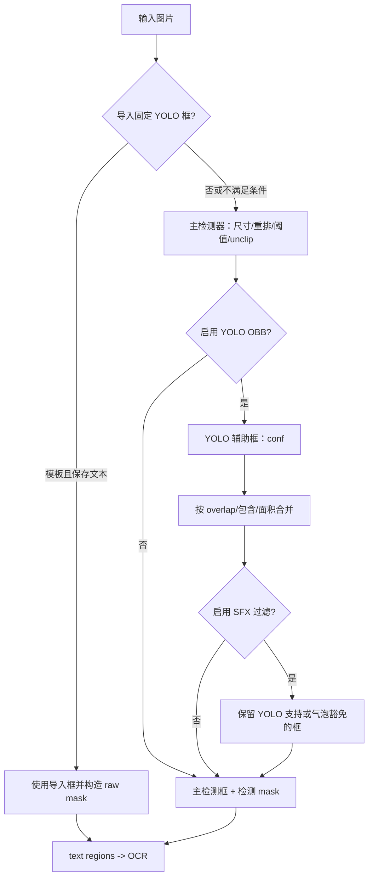
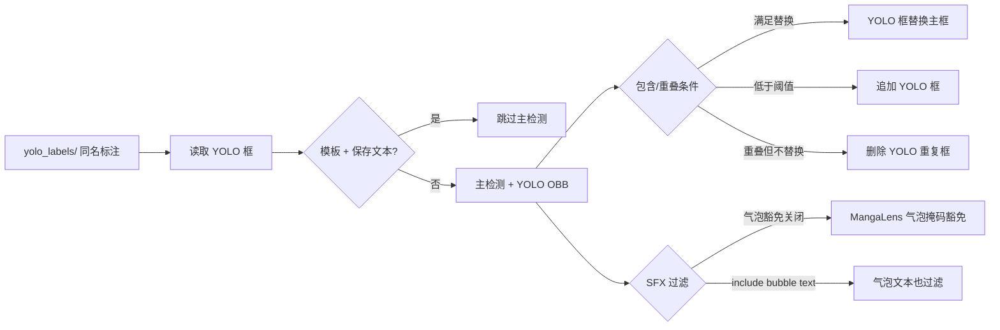

# 检测

检测页负责把输入图像转换为文本区域、检测蒙版和可供 OCR 使用的检测结果；OCR、文本行合并、蒙版细化和修复分别由其他设置页负责。本页只记录 Detection 页签中的控件、检测阶段行为和它实际读写的标注/调试文件。

## UI 操作

在桌面端打开“设置”，选择“Detection”页签（布局定义中的页签标题未经过翻译）。基础项位于页签顶部，`Advanced` 分隔线以下是尺寸、阈值和 YOLO 参数。动态设置页按当前配置类型创建下拉框、开关或数值输入框；编辑结束或切换开关后，配置服务更新内存配置并合并写入配置文件。

| UI 调用 key | English 实际值 | 简体中文实际值 |
| --- | --- | --- |
| `Detection`（布局标题） | Detection | Detection（源码硬编码，locale 不提供替换） |
| `label_detector` | Text Detector | 文本检测器 |
| `label_import_yolo_labels` | Import Fixed YOLO Boxes | 导入固定YOLO框 |
| `label_use_yolo_obb` | Enable YOLO Detection | 启用YOLO辅助检测 |
| `label_use_sfx_filter` | SFX Filter | 拟声词过滤 |
| `label_sfx_filter_include_bubble_text` | Include Bubble Text in SFX Filter | 气泡文本参与拟声词过滤 |
| `label_min_box_area_ratio` | Min Box Area Ratio | 最小检测框面积占比 |
| `label_detection_size` | Detection Size | 检测大小 |
| `label_det_rearrange_min_effective_short_side` | Long Image Rearrange Min Short Side | 长图重排最低有效短边 |
| `label_text_threshold` | Text Threshold | 文本阈值 |
| `label_box_threshold` | Box Generation Threshold | 边界框生成阈值 |
| `label_unclip_ratio` | Unclip Ratio | Unclip比例 |
| `label_yolo_obb_conf` | YOLO Confidence Threshold | YOLO置信度阈值 |
| `label_yolo_obb_overlap_threshold` | YOLO Overlap Removal Threshold | YOLO辅助检测重叠率删除阈值 |
| `Enabled` / `Disabled`（开关通用文案） | Enabled / Disabled | 启用 / 禁用 |

数值输入在失去焦点时提交；非法数值不会成为有效的核心配置。Detection 页的参数行名称由 `app_logic.py` 通过上述 `label_*` key 映射，不能把配置键或环境变量名当作界面标签。

## 选项中英对照

### `detector.detector` — 文本检测器 / Text Detector {#detector-detector}

| 存储值 | English | 简体中文 |
| --- | --- | --- |
| `default` | default | default |
| `dbconvnext` | dbconvnext | dbconvnext |
| `ctd` | ctd | ctd |
| `craft` | craft | craft |
| `none` | none | none |

这些枚举值在当前 UI 中直接显示存储值；源码注释说明 `default` 使用 DBNet+ResNet34、`ctd` 面向漫画文本、`craft` 是通用文本检测。`paddle` 已从枚举和调度表移除，不列为可选项。

### 开关值

| 存储值 | English | 简体中文 |
| --- | --- | --- |
| `true` | Enabled | 启用 |
| `false` | Disabled | 禁用 |

`import_yolo_labels`、`use_yolo_obb`、`use_sfx_filter` 和 `sfx_filter_include_bubble_text` 都是 ToggleSwitch；它们没有独立的枚举选项列表。

## 参数与运行机理

以下每个参数对应 Detection 页签的一行，并保留独立锚点。核心代码默认、Qt `AppSettings` 默认和示例发行配置默认分开列出；示例配置只用于公开默认参考，不读取用户的 `config.json`。

#### `detector.detector` — 文本检测器 / Text Detector {#detector-detector-parameter}

- 控件：下拉框；所在界面：设置 → Detection。
- 存储值：见上方枚举表；默认值：核心 `DetectorConfig.detector=default`；Qt `DetectorSettings.detector=default`；`config/config-example.json`=`default`。
- 生效阶段：检测；消费者：`manga_translator.detection.dispatch` 的 `DETECTORS` 映射，产生主检测框和检测蒙版。
- 原理：选择主检测器实例。`none` 返回空检测结果；启用 YOLO OBB 时，主结果仍先由该检测器产生，再进入混合合并。
- 依赖与冲突：检测器模型和其运行设备必须可用；`craft` 的源码注释明确不建议用于漫画。`load_text` 流程会强制关闭 YOLO OBB。
- 性能/API 成本：离线模型会按设备加载并缓存；检测器不同会改变速度、显存和结果分布。
- 关联文件和调试产物：verbose 检测可能产生 `bboxes_with_scores.png`、`mask_binary.png`、原始蒙版图；不会改变输入图片。
- 图示：不需要单独图示；检测器选择已在下方检测分支图中表达。
- 源码依据：`desktop_qt_ui/ui/main_page/settings_tab_layout.json`；`desktop_qt_ui/app_logic.py`；`manga_translator/config.py`；`manga_translator/detection/__init__.py`。
- 验证状态：源码、UI key 和 en/zh locale 已核对；运行截图属于未来统一验收。

#### `detector.detection_size` — 检测大小 / Detection Size {#detector-detection-size}

- 控件：整数输入框；默认值：核心 2048；Qt 2048；示例配置 2048。
- 生效阶段：检测预处理；消费者：主检测器和 YOLO OBB 的 `detect_size`。
- 原理：检测器使用该尺寸缩放图像。值越大通常保留更多小字细节，但计算和显存开销增加。
- 依赖与冲突：过大可能导致显存不足；与长图重排最低短边共同决定切块/重排后的有效分辨率。
- 关联文件和调试产物：调试目录名包含检测尺寸；长图分支可能写入 `rearrange_{n}.png` 与 `yolo_rearrange_{n}.png`（仅在对应分支和 verbose 条件下）。
- 图示：需要；见“检测分支与输出”。
- 源码依据：`config.py`、`manga_translator.py::_run_detection`、`detection/common.py`、`utils/rearrange.py`（调用链）。
- 验证状态：静态核对完成；运行边界待统一验收。

#### `detector.det_rearrange_min_effective_short_side` — 长图重排最低有效短边 / Long Image Rearrange Min Short Side {#detector-rearrange-short-side}

- 控件：整数输入框；默认值：核心 341；Qt 341；示例配置 341。
- 生效阶段：检测预处理；消费者：各检测器的长图重排函数。
- 原理：长图被重排/切块检测时，保留的最低有效短边分辨率由该值约束；提高它可保留更清晰的文字，代价是更多计算和显存。
- 依赖与冲突：只在长图检测重排路径有明显作用；并不替代 `detection_size`，也不改变 OCR 语言或合并策略。
- 关联文件和调试产物：对应分支可能写 `rearrange_{n}.png`、`yolo_rearrange_{n}.png`；这些是条件产物，不是每次运行必有。
- 图示：需要；见“检测分支与输出”。
- 源码依据：`config.py::DetectorConfig`、`detection/common.py`、`detection/ctd.py`、`detection/yolo_obb.py`。
- 验证状态：静态核对完成；长图运行截图待统一验收。

#### `detector.text_threshold` — 文本阈值 / Text Threshold {#detector-text-threshold}

- 控件：浮点输入框；默认值：核心 0.5；Qt 0.5；示例配置 0.5。
- 生效阶段：检测候选生成；消费者：DBNet/CRAFT 等检测器及其二值化调试蒙版。
- 原理：文本置信度阈值越高，候选更严格、漏检可能增加；降低会保留更多弱候选，也可能增加误检。源码将其传入主检测器，YOLO 辅助路径则使用独立的 `yolo_obb_conf`。
- 依赖与冲突：应保持在模型支持的概率范围；它与 `box_threshold` 分别作用于文本响应和框生成，不应混写。
- 关联文件和调试产物：verbose 模式可写 `mask_binary.png` 和带分数的框图。
- 图示：需要；见“检测分支与输出”。
- 源码依据：`config.py`、`detection/default.py`、`detection/craft.py`、`detection/common.py`。
- 验证状态：静态核对完成。

#### `detector.box_threshold` — 边界框生成阈值 / Box Generation Threshold {#detector-box-threshold}

- 控件：浮点输入框；默认值：核心 0.7；Qt 0.5；示例配置 0.5。三者不一致，不能合并写成一个默认值。
- 生效阶段：检测框生成；消费者：DBNet/CRAFT/YOLO 检测器的框表示器。
- 原理：控制候选响应转为文本框的置信度门槛；较低值通常保留更多框，较高值更严格。YOLO OBB 路径也将该值用于框筛选/IoU 参数。
- 依赖与冲突：需与 `text_threshold`、`unclip_ratio` 联调；阈值过低会把噪声传给 OCR。
- 关联文件和调试产物：影响框图、检测蒙版和后续 text regions 数量。
- 图示：需要；见“检测分支与输出”。
- 源码依据：`manga_translator/config.py`；`detection/__init__.py`；`detection/default_utils/dbnet_utils.py`。
- 验证状态：静态核对完成。

#### `detector.unclip_ratio` — Unclip 比例 / Unclip Ratio {#detector-unclip-ratio}

- 控件：浮点输入框；默认值：核心 2.3；Qt 2.5；示例配置 2.5。
- 生效阶段：检测框几何生成；消费者：DBNet 系列和其他使用通用检测接口的框表示器。
- 原理：从文本骨架扩展为框时控制扩张程度；值越大，框通常越大，可能覆盖更多背景或相邻文字。
- 依赖与冲突：与检测尺寸和阈值耦合；过大的框会增加 OCR 合并/蒙版覆盖风险。
- 关联文件和调试产物：影响检测框几何及其对应的蒙版，不直接写配置外的用户内容。
- 图示：不需要单独图示；无独立状态分支，几何影响已在检测流程图中标注。
- 源码依据：`config.py`；`detection/default_utils/dbnet_utils.py::unclip`；`detection/ctd_utils/utils/db_utils.py::unclip`。
- 验证状态：静态核对完成。

#### `detector.import_yolo_labels` — 导入固定 YOLO 框 / Import Fixed YOLO Boxes {#detector-import-yolo-labels}

- 控件：开关；默认值：核心 false；Qt false；示例配置 false。
- 生效阶段：检测输入/结果替换；消费者：`manga_translator.py::_run_detection` 的 YOLO 标签读取和蒙版构造。
- 原理：按图片同名关系从 `manga_translator_work/yolo_labels/` 读取标注。模板且保存文本的特定流程可跳过主检测直接使用导入框；普通流程在有导入框时以导入框替换检测框，并在缺少 raw mask 时构造蒙版。
- 依赖与冲突：标签文件必须匹配图片名称和约定格式；`load_text` 会改变后续替换条件。错误或缺失标签不会凭空生成结果。
- 关联文件和调试产物：`yolo_labels/`；导入框生成的 raw mask；不得在文档或截图中放用户图片和实际标注内容。
- 图示：需要；见“导入标签与混合检测”。
- 源码依据：`manga_translator/manga_translator.py`；`manga_translator/utils/path_manager.py`；`server/core/config_manager.py`。
- 验证状态：静态核对完成；脱敏运行验证待统一验收。

#### `detector.use_yolo_obb` — 启用 YOLO 辅助检测 / Enable YOLO Detection {#detector-use-yolo-obb}

- 控件：开关；默认值：核心 false；Qt false；示例配置 true。
- 生效阶段：检测框合并；消费者：`detection.dispatch` 的 YOLO OBB 辅助检测和 `merge_detection_boxes`。
- 原理：先运行主检测器，再运行 YOLO 有向边界框检测；重叠/包含关系决定替换、删除或追加。辅助检测失败时回退主检测结果。
- 依赖与冲突：需要 YOLO 模型；`load_text` 强制关闭它。`use_sfx_filter` 只有在此开关开启并有 YOLO 框时才有意义。
- 关联文件和调试产物：verbose 可写 `hybrid_detection_boxes.png`；YOLO 标签可继续供后续 `other` 框辅助合并。
- 图示：需要；见“导入标签与混合检测”。
- 源码依据：`detection/__init__.py`；`detection/yolo_obb.py`；`manga_translator.py::_run_detection`。
- 验证状态：静态核对完成。

#### `detector.yolo_obb_conf` — YOLO 置信度阈值 / YOLO Confidence Threshold {#detector-yolo-obb-conf}

- 控件：浮点输入框；默认值：核心 0.4；Qt 0.4；示例配置 0.4。
- 生效阶段：YOLO 辅助候选生成；消费者：YOLO OBB detector 的置信度参数。
- 原理：YOLO 辅助检测使用该值作为其文本阈值；提高会减少弱 YOLO 框，降低会增加候选和合并负担。
- 依赖与冲突：仅在 `use_yolo_obb=true` 时生效；不要用它替代主检测器的 `text_threshold`。
- 关联文件和调试产物：影响混合检测框图（若 verbose）。
- 图示：不需要单独图示；它是无额外状态的候选阈值。
- 源码依据：`DetectorConfig`；`detection/__init__.py`；`detection/yolo_obb.py`。
- 验证状态：静态核对完成。

#### `detector.yolo_obb_overlap_threshold` — YOLO 重叠率删除阈值 / YOLO Overlap Removal Threshold {#detector-yolo-obb-overlap-threshold}

- 控件：浮点输入框；默认值：核心 0.1；Qt 0.1；示例配置 0.1。
- 生效阶段：YOLO 与主检测框合并；消费者：`merge_detection_boxes` 的 AABB 重叠率和 YOLO 框去重逻辑。
- 原理：达到阈值的重叠框按包含、面积和其他未替换框条件决定替换/删除；低于阈值的 YOLO 框可追加。源码将阈值限制到有效范围并避免零阈值导致任意框通过。
- 依赖与冲突：仅在 YOLO 辅助检测启用时生效；过低可能删除/替换过多，过高可能保留重复框。
- 关联文件和调试产物：`hybrid_detection_boxes.png`（verbose 且辅助检测返回调试图时）。
- 图示：需要；见“导入标签与混合检测”。
- 源码依据：`detection/__init__.py::merge_detection_boxes`；`test/test_yolo_obb_sfx_filter.py`；`test/test_yolo_obb_rearrange_edge_merge.py`。
- 验证状态：静态核对完成；运行边界待统一验收。

#### `detector.use_sfx_filter` — 拟声词过滤 / SFX Filter {#detector-use-sfx-filter}

- 控件：开关；默认值：核心 false；Qt false；示例配置 false。
- 生效阶段：混合检测框合并；消费者：`_get_sfx_filtered_main_indices`。
- 原理：过滤既未被 YOLO `other` 框完整包裹、也未与非 `other` YOLO 框达到重叠阈值的主检测框。关闭时不执行此分支。
- 依赖与冲突：依赖 `use_yolo_obb`；关闭气泡文本参与开关时，MangaLens 气泡掩码可使气泡内文本得到豁免；气泡检测失败时该豁免不可用。
- 关联文件和调试产物：可能读取 MangaLens 模型结果生成的内存气泡掩码；不把用户图片写入文档。
- 图示：需要；见“导入标签与混合检测”。
- 源码依据：`detection/__init__.py`；`utils/bubble.py`；`test/test_yolo_obb_sfx_filter.py`。
- 验证状态：静态核对完成。

#### `detector.sfx_filter_include_bubble_text` — 气泡文本参与拟声词过滤 / Include Bubble Text in SFX Filter {#detector-sfx-filter-include-bubble-text}

- 控件：开关；默认值：核心 false；Qt false；示例配置 false。
- 生效阶段：SFX 过滤；消费者：`_get_sfx_filtered_main_indices`。
- 原理：false 时，未获 YOLO 支持的气泡内文本仍由气泡掩码保护；true 时跳过该气泡豁免，气泡内文本也进入过滤。它不单独启用 SFX 过滤。
- 依赖与冲突：只有 `use_sfx_filter=true`、YOLO 辅助检测有结果时才会影响输出；开启可能误删气泡对白。
- 关联文件和调试产物：MangaLens 气泡掩码仅在需要豁免时按需生成。
- 图示：需要；见“导入标签与混合检测”。
- 源码依据：`detection/__init__.py`；`utils/bubble.py`；对应英文/中文 description locale。
- 验证状态：静态核对完成。

#### `detector.min_box_area_ratio` — 最小检测框面积占比 / Min Box Area Ratio {#detector-min-box-area-ratio}

- 控件：浮点输入框；默认值：核心 0.0009（0.09%）；Qt 0.0009；示例配置 0（示例配置关闭面积过滤）。
- 生效阶段：检测结果后处理；消费者：`manga_translator.py` 的面积过滤和检测接口。
- 原理：面积比例按检测框面积相对整张图片像素计算；大于 0 时过滤面积小于等于阈值（并过滤极小面积）的框，设为 0 可关闭该过滤。
- 依赖与冲突：阈值过高会丢失小字；与检测尺寸、长图重排和 OCR 过滤共同影响最终 text regions。它不改变原始检测器模型。
- 关联文件和调试产物：影响后续 OCR 输入及检测框调试图，不写入敏感凭据。
- 图示：不需要单独图示；是单一后处理阈值，无独立状态机。
- 源码依据：`manga_translator/config.py`；`manga_translator/manga_translator.py`（面积过滤）；`detection/common.py`。
- 验证状态：静态核对完成。

## 运行机理

### 检测分支与输出 {#detection-flow}

长图重排会在检测预处理阶段切块并回映坐标；它可能增加检测时间、内存和显存。`mask_raw` 在这里指检测器返回或由导入框构造的原始蒙版，后续 OCR/蒙版细化是否使用它由后续阶段决定。

### 导入标签与混合检测 {#yolo-merge-flow}

图示只表达源码中已确认的分支；它不是每种模式的完整工作流图。截图边界：本页不伪造截图；未来有头验证应使用脱敏配置、空白/公开样例，隐藏用户目录、图片、令牌和标注内容，并同时提供中英 alt/图注。

## 依赖与冲突

- 主检测器离线模型必须能在所选设备加载；GPU/ONNX 后端问题会影响检测阶段，但本页不记录硬件安装教程。
- YOLO OBB 和 SFX 过滤需要辅助 YOLO 模型；没有辅助结果时主检测器结果仍作为回退。
- `load_text` 会关闭 YOLO OBB；导入 YOLO 标签在模板/保存文本条件下可跳过主检测，普通流程则替换检测框并尽量保留 raw mask。
- `text_threshold`、`box_threshold`、`unclip_ratio` 和面积比例是不同后处理层，不能互相替代。阈值过宽会把噪声交给 OCR，阈值过严会漏检。
- 长图重排、较大检测尺寸和 YOLO 辅助检测会增加资源消耗；OOM 或模型缺失时应降低尺寸/关闭辅助项，而不是共享真实运行凭据。

## 关联文件与格式

| 文件或目录 | 本页用途 | 格式与注意事项 |
| --- | --- | --- |
| `config/config-example.json` | 公开发行配置示例 | JSON；检测器示例默认与核心/Qt 默认可能不同；不要用用户配置覆盖文档事实 |
| `config/config.json` | 应用持久化配置位置 | JSON；只说明字段边界，不读取或展示用户实际内容 |
| `manga_translator_work/yolo_labels/` | 固定 YOLO 标签输入 | 按图片同名查找；标签格式和坐标约定必须与导入器一致，错误/缺失时不应伪造检测结果 |
| `result/` 每图调试目录 | verbose 检测产物 | 条件写入 `rearrange_{n}.png`、`yolo_rearrange_{n}.png`、`bboxes_with_scores.png`、`mask_binary.png`、`hybrid_detection_boxes.png`；只分享脱敏产物 |

检测结果进入内部 text regions 和 mask；本页不展开翻译 JSON 的全部字段，相关格式应在工作流/编辑器页面说明。

## 源码依据 {#source-evidence}

| 层级 | 文件 | 已核对内容 |
| --- | --- | --- |
| UI 布局 | `desktop_qt_ui/ui/main_page/settings_tab_layout.json` | Detection 页签、参数顺序、Advanced 分隔线 |
| UI 构造与绑定 | `desktop_qt_ui/ui/main_page/dynamic_settings.py` | bool 开关、数值输入、枚举下拉和提交时机 |
| UI 文案映射 | `desktop_qt_ui/app_logic.py` | 参数 key 到 `label_*` i18n key 的映射、Detector 枚举选项 |
| locale | `desktop_qt_ui/locales/en_US.json`、`zh_CN.json` | UI 调用 key、English 实际值、简体中文实际值和 description |
| Qt 配置 | `desktop_qt_ui/core/config_models.py` | `DetectorSettings` 默认值和持久化模型字段 |
| 核心配置 | `manga_translator/config.py` | `DetectorConfig` 默认值、字段语义和 `Config.detector` |
| 调度/消费者 | `manga_translator/manga_translator.py` | 参数传入、导入标签、面积过滤、调试产物 |
| 检测实现 | `manga_translator/detection/__init__.py`、`common.py`、`default.py`、`yolo_obb.py` | 主/YOLO 检测、合并、SFX 过滤和回退 |
| 回归依据 | `test/test_yolo_obb_sfx_filter.py`、`test/test_yolo_obb_rearrange_edge_merge.py` | SFX 和长图/边界合并的静态测试覆盖 |

## 安全审查与验证记录 {#verification}

- 未读取或展示真实 `.env`、用户配置、API key/token、用户名、私有绝对路径、用户图片、提示词或任务产物。
- 源码核对：完成；UI 布局与绑定：完成；en/zh locale 三列：完成；参数默认差异：完成。
- 静态验证：待运行 `node doc/wiki/scripts/verify-route-mirror.mjs doc/wiki`、`node doc/wiki/scripts/verify-source-evidence.mjs doc/wiki`、`node doc/wiki/scripts/verify-wiki-coverage.mjs doc/wiki` 和 `npm run docs:build --prefix doc/wiki`。
- 运行态截图、真实模型推理和 Mermaid 渲染属于未来统一验收，不阻塞本次静态正文完成。
