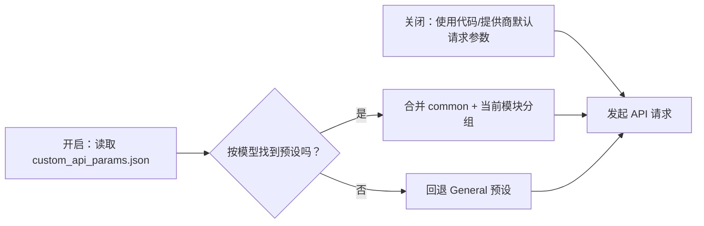
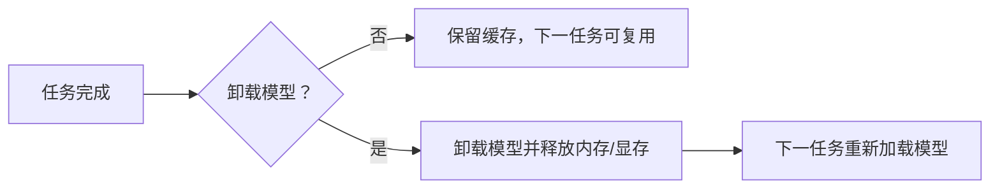
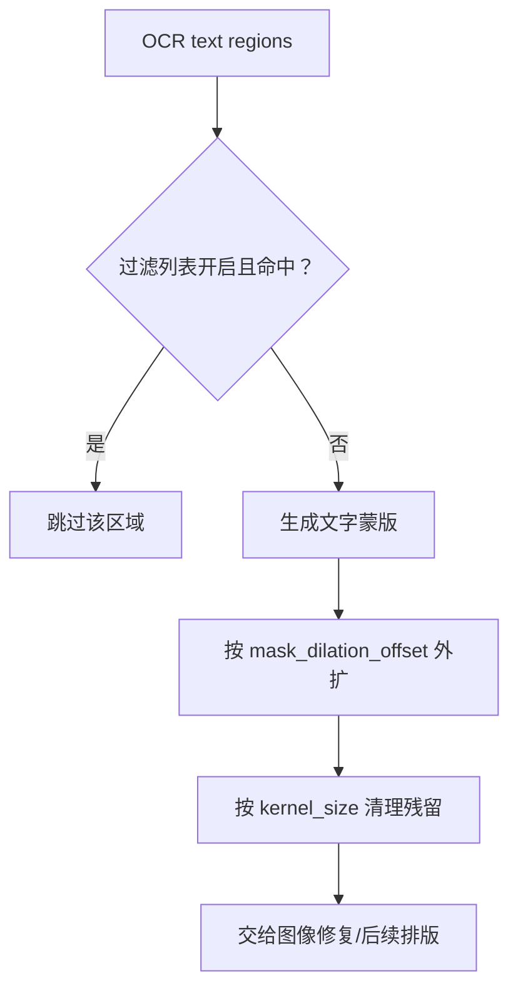

# 通用与应用设置

本页对应设置页的 “General” 分组，以及它所承载的应用级状态和通用处理开关。它负责语言、主题、API 参数文件开关、过滤列表、全局蒙版参数、模型卸载和编辑器偏好；检测、OCR、翻译、修复、排版、超分和上色的专用参数分别见对应设置页。

## 在界面中操作 {#ui-operations}

打开设置页并选择 “General”。动态设置行由布局文件中的存储键生成，点击一行会在右侧说明面板显示该键的说明。修改开关、数值或下拉框后，配置立即更新；配置服务随后合并写盘。数值输入框留空会写入 `null`，由对应消费者回退到默认语义。

### General 分组的 UI 调用 key 与实际文案

下表只记录 General 布局实际调用的设置键。动态行的标签经 `app_logic.py` 的 `labels` 映射，再由两个 locale 提供显示值；“主题”和“语言”是布局代码显式调用的 `Theme:` / `Language:`。

| UI 调用 key / 存储键 | English 实际值 | 简体中文实际值 |
| --- | --- | --- |
| `Theme:` / `app.theme` | Theme: | 主题： |
| `Language:` / `app.ui_language` | Language: | 语言： |
| `label_verbose` / `cli.verbose` | Verbose Logging | 详细日志 |
| `label_ignore_errors` / `cli.ignore_errors` | Ignore Errors | 忽略错误 |
| `label_use_gpu` / `cli.use_gpu` | Use GPU | 使用 GPU |
| `label_disable_onnx_gpu` / `cli.disable_onnx_gpu` | Disable ONNX GPU Acceleration | 禁用 ONNX GPU 加速 |
| `label_format` / `cli.format` | Output Format | 输出格式 |
| `label_overwrite` / `cli.overwrite` | Overwrite Existing Files | 覆盖已存在文件 |
| `label_skip_no_text` / `cli.skip_no_text` | Skip Images Without Text | 跳过无文本图像 |
| `label_save_text` / `cli.save_text` | Editable Image | 图片可编辑 |
| `label_save_quality` / `cli.save_quality` | Image Save Quality | 图像保存质量 |
| `label_attempts` / `cli.attempts` | Retry Attempts | 重试次数 |
| `label_batch_size` / `cli.batch_size` | Batch Size | 批量大小 |
| `label_batch_concurrent` / `cli.batch_concurrent` | Concurrent Batch Processing | 并发批量处理 |
| `label_use_custom_api_params` / `use_custom_api_params` | Use Custom API Params | 使用自定义API参数 |
| `label_save_to_source_dir` / `cli.save_to_source_dir` | Save to Source Directory | 输出到原图目录 |
| `label_export_editable_psd` / `cli.export_editable_psd` | Export Editable PSD | 导出可编辑PSD |
| `label_psd_script_only` / `cli.psd_script_only` | Generate PSD Script Only | 仅生成PSD脚本 |
| `label_unload_models_after_translation` / `app.unload_models_after_translation` | Unload Models After Translation | 翻译完成后卸载模型 |

“Use Custom API Params” 旁边的 “Edit” 按钮打开 `config/custom_api_params.json` 编辑器；它是文件编辑动作，不是把 JSON 内容嵌入 `AppSettings`。过滤列表的 “Edit Filter List” 按钮编辑过滤词文件。字体目录按钮位于 Typesetting，不属于本页。

### 主题、语言和预设

- “Theme:” 的选项由 `theme_registry.py` 的 `THEME_OPTIONS` 生成；选中后发出主题切换信号并立即刷新 Qt 样式。
- “Language:” 的选项由 `I18nManager.get_available_locales()` 生成，而不是从 `en_US.json` / `zh_CN.json` 动态猜测。选择后刷新桌面文本、Qt 内建控件翻译和导航，并保存 `app.ui_language`。
- API 预设工具栏显示当前 API 预设；切换预设会刷新 API 表单和凭据槽，不改变翻译器/检测器等核心实现。当前预设名称保存在 `app.current_preset`，是应用状态而非普通动态设置行。

## 选项中英对照 {#option-matrix}

### 枚举和模式

| 存储值 | English | 简体中文 | 使用和限制 |
| --- | --- | --- | --- |
| `light` | Light | 浅色 | 固定浅色主题 |
| `dark` | Dark | 深色 | 固定深色主题 |
| `gray` | Gray | 灰色 | 固定灰色主题 |
| `ocean` | Ocean | 海洋 | 固定海洋主题 |
| `forest` | Forest | 森林 | 固定森林主题 |
| `sunset` | Sunset | 落日 | 固定落日主题 |
| `rose` | Rose | 玫瑰 | 固定玫瑰主题 |
| `system` | Follow System | 跟随系统 | 根据系统外观选择已注册主题 |
| `auto` | Auto-detected language | 自动检测语言 | `app.ui_language` 启动时按系统 locale 选择；不是 locale 文件名 |
| `zh_CN` | Simplified Chinese | 简体中文 | `I18nManager` 注册的语言代码 |
| `zh_TW` | Traditional Chinese | 繁體中文 | `I18nManager` 注册的语言代码 |
| `en_US` | English | English | `I18nManager` 注册的语言代码 |
| `ja_JP` | Japanese | 日本語 | `I18nManager` 注册的语言代码 |
| `ko_KR` | Korean | 한국어 | `I18nManager` 注册的语言代码 |
| `es_ES` | Spanish | Español | `I18nManager` 注册的语言代码 |
| `不指定` | Not Specified | 不指定 | `cli.format` 保持输入格式；选项列表还包括核心支持的图片格式 |
| `PNG` / `JPG` / `JPEG` / `JFIF` / `WebP` / `AVIF` / `BMP` / `TIFF` / `TIF` / `HEIC` / `HEIF` | Same storage value | 同左 | `cli.format` 强制导出对应格式；实际可用集合由 `OUTPUT_IMAGE_FORMATS` 提供 |

### 开关和数值的默认值、阶段与消费者

“核心默认”来自 `manga_translator/config.py` 的 `Config`；“Qt 默认”来自 `desktop_qt_ui/core/config_models.py` 的 `AppSettings`；“发行默认”来自 `config/config-example.json`。发行默认不是用户当前配置，也不在文档中展开任何用户路径或私密值。

| 设置键（锚点） | Qt 默认 | 核心默认 | 发行默认 | 生效阶段 | 最终消费者与语义 |
| --- | ---: | ---: | ---: | --- | --- |
| `cli.verbose` {#cli-verbose} | `false` | `false` | `false` | 全流程/调试 | Qt 日志与 `result/` 调试产物；不改变翻译结果 |
| `cli.ignore_errors` {#cli-ignore-errors} | `false` | `false` | `false` | 各阶段错误边界 | 每图处理失败时是否继续后续图片 |
| `cli.use_gpu` {#cli-use-gpu} | `true` | `true` | `true` | 模型加载 | 设备选择；CPU/GPU 依赖必须匹配，GPU 不等于所有后端都使用 GPU |
| `cli.disable_onnx_gpu` {#cli-disable-onnx-gpu} | `false` | `false` | `false` | ONNX 模型加载 | 强制 ONNX Runtime 走 CPU；可与 `use_gpu=true` 同时存在 |
| `cli.format` {#cli-format} | `不指定` | `不指定` | `不指定` | 导出 | `save.py`/图像保存层选择输出格式 |
| `cli.overwrite` {#cli-overwrite} | `true` | `true` | `true` | 导出 | 关闭时跳过已有翻译输出 |
| `cli.skip_no_text` {#cli-skip-no-text} | `false` | `false` | `false` | 检测后 | 无文本图像不进入后续处理 |
| `cli.save_text` {#cli-save-text} | `true` | `true` | `true` | 导出 | 写出翻译 JSON，供编辑器继续修改 |
| `cli.save_quality` {#cli-save-quality} | `100` | `100` | `100` | 导出 | 有损图片保存质量，范围与 Pillow/保存实现共同约束 |
| `cli.attempts` {#cli-attempts} | `-1` | `-1` | `3` | API 请求 | `-1` 表示无限重试；普通重试不等于质量重试或 API 槽轮换 |
| `cli.batch_size` {#cli-batch-size} | `1` | `1` | `3` | 翻译 | 一次提交给翻译器的图片数量；影响上下文、token、延迟和错误面 |
| `cli.batch_concurrent` {#cli-batch-concurrent} | `false` | `false` | `false` | 全流程调度 | 启用并发流水线；特殊工作流可能强制关闭，详见批量页 |
| `use_custom_api_params` {#use-custom-api-params} | `false` | `false` | `true` | API 请求构造 | 从 JSON 按模型匹配预设，并合并 `common` 与当前 API 模块分组 |
| `cli.save_to_source_dir` {#cli-save-to-source-dir} | `false` | `false` | `false` | 导出 | 写入原图目录下的工作结果子目录；路径由运行时生成 |
| `cli.export_editable_psd` {#cli-export-editable-psd} | `false` | `false` | `false` | 导出 | 需要 Photoshop；生成分层 PSD |
| `cli.psd_script_only` {#cli-psd-script-only} | `false` | `false` | `false` | 导出 | 仅生成 JSX，不启动 Photoshop 且不直接生成 PSD |
| `app.unload_models_after_translation` {#app-unload-models} | `false` | 不适用 | `false` | 任务完成 | 释放模型内存/显存；下一次任务需要重新加载 |
| `filter_text_enabled` {#filter-text-enabled} | `true` | 不适用 | `false` | OCR 后过滤 | 过滤列表命中时跳过对应文本区域；按钮编辑过滤词文件 |
| `kernel_size` {#kernel-size} | `3` | `3` | `3` | 蒙版细化/修复前 | 卷积核清理残留文字；过大可能侵蚀线稿或气泡边框 |
| `mask_dilation_offset` {#mask-dilation-offset} | `70` | `20` | `50` | 蒙版细化 | 扩张文字蒙版以覆盖残留像素；与气泡蒙版限制选项共同决定范围 |

编辑器偏好属于 `AppSection`，但当前 `settings_tab_layout.json` 不把它们列为 General 动态行。它们仍是本页的应用级配置边界：`editor_snap_enabled=false`、`editor_center_scale_enabled=false`、`editor_rich_text_popup_enabled=true`、`editor_auto_export_on_switch=true`、`editor_auto_rich_text_rules=true`。编辑器视图和工具栏读取这些值；应在编辑器页面操作相关控件，不能误称为 General 页可见控件。

### `app.ui_language` — 语言 / Language {#app-ui-language}

- 控件：下拉框；显示值由 `LocaleInfo.name` 提供，存储 locale code。
- 默认值：核心/Qt/发行均为 `auto`。
- 生效阶段：应用启动和语言切换后的 UI 重建。
- 原理：`auto` 先检测系统语言，未注册时回退 `zh_CN`；显式语言切换刷新界面并保存配置。
- 依赖与冲突：locale 文件缺失的 key 会按 i18n 回退规则处理；它不改变翻译目标语言。
- 关联文件：`desktop_qt_ui/locales/*.json`；不会写入图片、JSON 翻译结果或 API 凭据。
- 图示：不需要；它只改变显示语言，不改变处理阶段或输出。

### `app.theme` — 主题 / Theme {#app-theme}

- 控件：下拉框，选项见上表。
- 默认值：核心/Qt/发行均为 `light`。
- 生效阶段：UI 样式应用；不进入检测、翻译或导出消费者。
- 原理：主题 key 经过主题注册表校验；历史主题值会迁移到注册表中的主题，非法值回退 `light`。
- 依赖与冲突：`system` 依赖操作系统外观；主题只影响 UI，不影响模型/API。
- 图示：不需要；纯显示偏好、无处理分支。

### `use_custom_api_params` — 使用自定义API参数 / Use Custom API Params {#custom-api-params}

- 控件：开关 + “Edit” 文件编辑按钮。
- 默认值：核心/Qt `false`，发行配置 `true`。
- 生效阶段：翻译、AI OCR、AI 渲染、AI 上色请求构造。
- 原理：开启后读取 `config/custom_api_params.json`，先按当前模型匹配预设，找不到时回退 General；每个 API 模块只读取 `common` 与自己的分组。
- 依赖与冲突：JSON 语法或结构错误会使自定义参数不可用；它不保存 Key、Base、Model，也不参与 API 候选槽轮换。
- 关联文件与格式：JSON；保留 `common`、`translator`、`ocr`、`colorizer`、`render` 等模块边界。不要把密钥、令牌或私有提示词写入该文件。
- 图示：必须说明开关改变请求体，见下图。

开启该开关只改变额外请求字段；不会改变当前翻译器或 API 凭据。上述图示不包含任何真实请求参数。

### `app.unload_models_after_translation` — 翻译完成后卸载模型 / Unload Models After Translation {#unload-models}

- 控件：General 页中的开关。
- 默认值：Qt/发行均为 `false`；核心没有同名字段，它是桌面任务生命周期策略。
- 生效阶段：每张图/任务完成后的清理阶段。
- 原理：完成后调用各模型的卸载路径，释放内存和显存；下次任务按需重新加载。
- 依赖与冲突：低显存时有助于降低常驻占用，但增加下一任务的加载时间；不等于取消任务，也不改变配置写盘。
- 图示：必须画出开关造成的资源生命周期差异。

### `filter_text_enabled`、`kernel_size`、`mask_dilation_offset` — 过滤与全局蒙版

- `filter_text_enabled` 在 General 动态设置中是开关 + “Edit Filter List”；默认 Qt `true`、发行配置 `false`。OCR 结果命中过滤词时跳过文本区域，过滤词文件由过滤列表编辑器维护。
- `kernel_size` 是整数，默认 `3`。它控制蒙版清理使用的卷积核，属于修复前蒙版阶段；值过大可能损伤线稿。
- `mask_dilation_offset` 是整数，Qt `70`、核心 `20`、发行 `50`。它控制文字蒙版外扩像素，0 表示不额外外扩；气泡约束由 Inpainting/OCR 专用开关进一步限制。

关闭过滤不会关闭蒙版细化；蒙版参数也不会改变 OCR 文本本身。需要查看气泡交集、膨胀限制和修复器的专用关系时，应转到 Inpainting 页面。

## 运行机理与配置生命周期 {#runtime}

设置页从 `ConfigService.get_config().model_dump()` 构建动态控件。每次控件变化经 `MainAppLogic.update_single_config()` 写回 Pydantic `AppSettings`；翻译器和目标语言会额外刷新翻译服务，`render.*` 会发出编辑器刷新信号。语言和主题使用专用信号，因此语言会重载 locale/Qt translator，主题会重设样式。

启动时配置优先级是：代码 `AppSettings` 默认 < `config/config-example.json` 等发行默认模板 < 用户 `config/config.json`。用户配置会按默认模板同步新增/删除键。普通设置写入 `config/config.json`；配置服务使用 250 ms 防抖合并写入，显式保存/切换操作会刷新待写队列。命令行显式参数只在 CLI 入口覆盖 `cli.*`，没有传入的参数不会被声称为覆盖。

General 页的 GPU、ONNX、批量、输出和重试设置最终进入核心 `Config.cli`；CLI/批处理页面负责这些字段的完整工作流和并发说明，本页只记录它们在 General 中的控件与边界。

## 依赖与冲突 {#dependencies}

- `cli.use_gpu` 需要匹配的 CUDA/硬件依赖；`cli.disable_onnx_gpu` 可单独关闭 ONNX GPU 后端，二者不是互斥开关。
- `cli.batch_concurrent` 受特殊输入/工作流和资源条件限制，不能保证所有模型或 API 请求同时执行。
- `cli.export_editable_psd` 需要 Photoshop；`cli.psd_script_only` 与它配合时只产生脚本，不能宣称已生成 PSD。
- `use_custom_api_params` 依赖可解析的 JSON 和匹配的模型配置；它与 `.env` 凭据、API Base、API 槽轮换分离。
- `mask_dilation_offset` 与 `kernel_size` 过大可能吞掉线稿、气泡边框；气泡蒙版限制需在 Inpainting/OCR 参数页配合验证。
- 开启卸载模型会降低常驻显存但牺牲下一任务的加载速度；它不保证第三方进程显存立即归还。

## 关联文件与格式 {#files-and-formats}

| 文件/目录 | 本页实际作用 | 手改/兼容注意 |
| --- | --- | --- |
| `config/config-example.json` | 发行默认模板，提供与 Qt/核心可能不同的默认值 | 只作为模板核对；不要复制用户路径或私密内容 |
| `config/config.json` | 用户设置持久化 | JSON 必须可解析；未知键会按同步逻辑处理；不要共享其中的路径或用户状态 |
| `config/custom_api_params.json` | “Edit” 按钮打开的额外 API 参数文件 | 仅保存请求参数分组，不放 Key/Token/私有提示词 |
| `desktop_qt_ui/locales/en_US.json` | English 文案和说明 | 缺失 key 按 i18n 回退处理 |
| `desktop_qt_ui/locales/zh_CN.json` | 简体中文文案和说明 | 与 English key 逐项核对 |
| `result/` | verbose 模式可能写日志和调试中间文件 | 分享前清理路径、用户名、令牌和用户图片 |

相关编辑器工作区和翻译 JSON 的字段不在本页展开；它们属于编辑器导入导出页面。

## Mermaid、截图与安全边界 {#visuals-and-security}

本页 Mermaid 只表达设置值改变的实际分支：自定义 API 参数改变请求体，卸载开关改变模型生命周期，过滤/蒙版开关改变 OCR 后路径。静态正文不伪造运行截图；未来截图必须使用有头模式、脱敏配置和公开样例，裁去用户名、绝对私有路径、密钥、令牌、用户图片和私有提示词。配置示例中的路径只以相对文件名出现。

## 源码依据 {#source-evidence}

| 层级 | 文件 | 核对内容 |
| --- | --- | --- |
| General 布局/UI | `desktop_qt_ui/ui/main_page/settings_tab_layout.json`、`desktop_qt_ui/ui/main_page/dynamic_settings.py` | General 行、控件类型、特殊 Edit 动作、主题/语言信号、模型卸载行 |
| UI 文案 | `desktop_qt_ui/app_logic.py`、`desktop_qt_ui/locales/en_US.json`、`desktop_qt_ui/locales/zh_CN.json` | labels 映射、English 与简体中文实际值、说明面板文本 |
| 应用模型 | `desktop_qt_ui/core/config_models.py` | Qt 默认值、应用状态、General 与编辑器字段 |
| 主题/语言 | `desktop_qt_ui/theme_registry.py`、`desktop_qt_ui/ui/main_page/layout.py`、`desktop_qt_ui/services/i18n_service.py` | 主题选项、语言代码与 LocaleInfo 名称 |
| 持久化 | `desktop_qt_ui/services/config_service.py`、`desktop_qt_ui/app_logic.py` | 配置优先级、Pydantic 更新、250 ms 防抖写盘 |
| 核心消费者 | `manga_translator/config.py`、`manga_translator/manga_translator.py`、`manga_translator/mode/local.py`、`manga_translator/save.py` | CLI 参数、设备/错误处理、输出、蒙版参数和 PSD 行为 |
| 编辑器消费者 | `desktop_qt_ui/ui/editor/view.py`、`desktop_qt_ui/editor/editor_controller.py`、`desktop_qt_ui/editor/controller_document_service.py` | 编辑器偏好、自动导出和富文本规则 |

## 验证记录 {#verification}

| 验证内容 | 状态 | 说明 |
| --- | --- | --- |
| 三份写作规范与 TODO | 完成 | 已完整读取 `BLUEPRINT.md`、`PAGE_GUIDELINES.md`、`TODO.md`，本次只覆盖本页及对应 TODO 行 |
| UI 布局、调用 key、双 locale | 完成 | 静态核对 General 布局、`app_logic.py` 映射及 `en_US.json`/`zh_CN.json` |
| 默认值、阶段、消费者和文件格式 | 完成 | 静态核对 Qt 模型、核心 Config、发行模板、持久化和消费者 |
| Mermaid/截图边界与安全审查 | 完成 | 图示覆盖实际分支；未读取或展示用户配置中的私密路径、密钥或图片 |
| 运行态 UI/真实截图 | 待统一验收 | 当前任务不启动应用、不伪造视觉验证 |
| VitePress 与静态校验 | 待运行 | 完成正文后运行可用的路由、源码依据和文档构建检查 |
