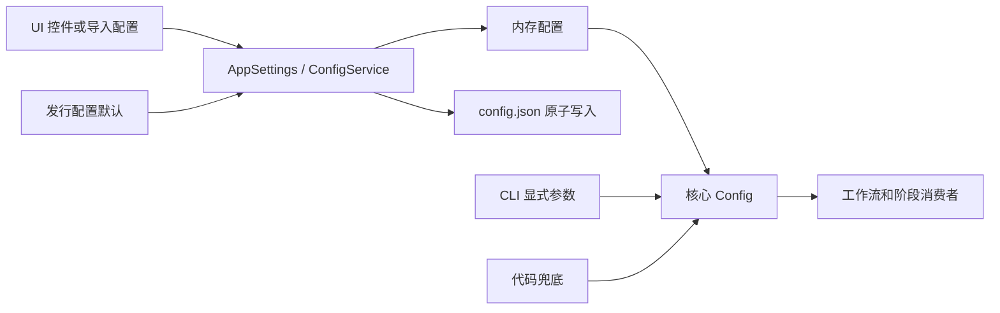

# 设置页与配置生命周期

设置页用于调整桌面端翻译流程的配置，并把修改后的值交给运行时配置模型。它负责设置页签、参数控件、导入/导出和自动保存；具体参数的算法含义分别见[通用与应用](./general-and-app.md)、[CLI、批量与输出](./cli-batch-and-output.md)、[检测](./detection.md)、[OCR、过滤与合并](./ocr-filter-and-merge.md)、[翻译](./translation.md)、[蒙版与修复](./mask-and-inpainting.md)、[排版与渲染](./typesetting-and-rendering.md)、[超分与上色](./upscale-and-colorization.md)和[模式专用参数](./mode-specific.md)。设置页不负责 API 凭据槽轮换、提示词列表、编辑器项目数据或九种工作流的具体处理步骤。

## 功能边界 {#feature-boundary}

- 设置页从 `settings_tab_layout.json` 读取七个 UI 分组：General、OCR、Detection、Translation、Inpainting、Typesetting、Mode Specific；布局文件中的 `Advanced` 和其他分隔线只是组内标题。
- 当前布局列出 110 个条目，其中 109 个是可见参数，1 个是未被当前动态设置渲染的条目。内部状态、已由工作流选择器代替的标志和废弃字段不会重复显示。
- 配置值分为三层：Qt 的 `AppSettings` 控件模型、核心 `Config` 处理模型和发行模板 `config/config-example.json`。三层不应被文档合并成一个默认值。
- 本页只解释设置页如何改变配置及其保存边界；检测、OCR、翻译、修复、排版、超分和上色的阶段消费者留在对应专题页。

## UI 操作 {#ui-operations}

启动桌面端后打开设置页面。页首显示“参数设置”和“调整翻译流程的各项参数。修改后将自动保存。”，右侧提供“导出配置”和“导入配置”。左侧为分段页签，中央为可滚动参数行，右侧为“参数说明”面板；点击参数行或其控件会显示配置键和说明。

### 页签与参数归属

| 布局 `title` / UI 调用 key | English 实际值 | 简体中文实际值 | 页面中显示的主要参数 |
| --- | --- | --- | --- |
| `General` | General | 通用 | 语言、主题、日志/错误、GPU/ONNX、格式、覆盖、重试、批次、输出和模型卸载 |
| `OCR` | OCR | 识别 | 主/次 OCR、混合 OCR、AI OCR、过滤、气泡约束和合并阈值 |
| `Detection` | Detection | 检测 | 检测器、YOLO、SFX、检测尺寸和检测阈值 |
| `Translation` | Translation | 翻译 | 翻译器、目标/保留语言、流式、术语、RPM、上下文和译后文本转换 |
| `Inpainting` | Inpainting | 修复 | 修复器、蒙版膨胀、气泡交集、纯色气泡、逐块处理、尺寸和精度 |
| `Typesetting` | Typesetting | 排版 | 渲染器、字体、断句、方向、颜色、间距、布局和 AI 渲染并发 |
| `Mode Specific` | Mode Specific | 模式相关 | 替换翻译对齐、超分倍率/瓦片、上色模型/尺寸/降噪 |
| `Advanced` | Advanced | 高级 | OCR、Detection、Inpainting 页签中的高级分隔线，不是独立页签 |

操作步骤：

1. 选择一个页签；动态布局按 `settings_tab_layout.json` 的顺序重建参数行。
2. 修改开关、输入框或下拉框。下拉框显示值通过 `AppLogic.get_display_mapping()` 映射回存储值；字体和提示词等运行时列表不应按固定枚举理解。
3. 对可选数值清空输入框表示写入 `null`，从而回到消费者的默认/自动语义；无效数值输入会回退为 `null`，并由配置模型继续校验。
4. 点击参数行查看右侧说明。固定 AI OCR、AI renderer、AI colorizer 提示词项是“文件编辑动作/资源路径”，点击“编辑”打开对应编辑器，不是把提示词正文存进普通参数字段。
5. 修改 API 参数开关时使用“编辑”打开 `config/custom_api_params.json`；点击过滤开关旁的编辑动作可打开过滤列表编辑器。字体行提供“打开目录”。
6. 点击“导出配置”选择外部 JSON 文件；点击“导入配置”载入 JSON，并按逐键深合并和 Pydantic 校验处理无效值。导入后整页可能重建，说明面板和 API/提示词相关控件也会刷新。

`app.ui_language` 或应用语言切换后，页签、标签、说明和下拉显示值重新从 locale 加载；存储值不因语言切换而改变。设置页没有单独的“应用”按钮，普通修改先立即更新内存，再由配置服务合并写盘。

## 选项中英对照 {#option-matrix}

| UI 调用 key / 存储值 | English | 简体中文 |
| --- | --- | --- |
| `Settings Page Title` | Settings | 参数设置 |
| `Settings Page Subtitle` | Adjust translation pipeline parameters. Changes are saved automatically. | 调整翻译流程的各项参数。修改后将自动保存。 |
| `Export Config` | Export Config | 导出配置 |
| `Import Config` | Import Config | 导入配置 |
| `Settings Desc Header` | Parameter Description | 参数说明 |
| `Settings Desc Placeholder` | Click any setting on the left to view details | 点击左侧任意设置项查看详细说明 |
| `General` | General | 通用 |
| `OCR` | OCR | 文字识别 |
| `Detection` | Detection | 检测 |
| `Translation` | Translation | 翻译 |
| `Inpainting` | Inpainting | 修复 |
| `Typesetting` | Typesetting | 排版 |
| `Mode Specific` | Mode Specific | 模式相关 |
| `Advanced` | Advanced | 高级 |
| `Theme:` | Theme: | 主题： |
| `Language:` | Language: | 语言： |
| `Edit` | Edit | 编辑 |
| `Open Directory` | Open Directory | 打开目录 |
| `Preset:` | Preset: | 预设： |
| `app.theme=light` | Light | Light |
| `app.theme=dark` | Dark | Dark |
| `app.theme=system` | Follow System | Follow System |
| `cli.format=Not Specified` | Not Specified | 不指定 |
| `upscale_ratio_not_use` | Not Use | 不使用 |
| `alignment_auto` | Auto | 自动 |
| `direction_vertical` | Vertical | 竖排 |
| `layout_mode_smart_scaling` | Smart Scaling | 智能缩放 |

`app.ui_language` 的固定语言名称由 `LocaleInfo.name` 提供；主题名称有些是 `theme_registry.py` 的字面量，因此不会强行添加不存在的 i18n key。参数完整的 value/UI 对照见[选项与 i18n 矩阵](../../reference/options-i18n-matrix.md)。

## 运行机理 {#runtime-behavior}

`ConfigService` 初始化 `AppSettings()`，先读取发行/默认 JSON，再以用户 `config.json` 覆盖；优先级是用户配置 > `config-example.json` > Qt 模型默认。核心 `Config()` 的字段和默认值仍由核心代码定义，CLI 显式参数可在进入核心配置时覆盖对应值；Web 运行时覆盖属于另一个入口。

参数修改由控制器更新 `AppSettings`，Pydantic 模型在 `update_config()` 或导入的逐键合并过程中校验。内存和 `os.environ` 的 API 值立即更新；普通 JSON 和 `.env` 写入使用 250 ms 防抖、单线程写入器、临时文件加 `os.replace` 原子替换。显式导出会等待写入完成；退出时 flush 待写快照。

- 选择翻译、OCR、上色或渲染实现后，API 管理区域刷新对应凭据组；这是提供商选择，不是候选槽轮换。
- 选择 `upscale.upscaler` 会动态重填倍率：普通模型写整数 2/3/4，Real-CUGAN 还写 `realcugan_model`，MangaJaNai 写 `x2`、`x4` 或 `DAT2 x4`；“不使用”写 `null`。
- `cli.batch_size` 是阶段内批量大小，`cli.batch_concurrent` 是图片级流水线并发，二者不是同一开关；特殊工作流可能强制改写 CLI 标志。
- 固定提示词编辑器写入对应 YAML/兼容格式文件；三种 AI 提示词分别消费，不共享一个提示词字段。

## 依赖与冲突 {#dependencies-and-conflicts}

- 使用 OpenAI/Gemini 翻译、AI OCR、AI 上色或 AI renderer 时，需要对应功能的环境变量和可用 API 地址；混合 OCR 选 AI 次 OCR 时还需要次 OCR 凭据。真实值不属于本文。
- GPU、ONNX GPU、Torch 修复精度和模型选择受硬件、安装依赖和显存影响；`disable_onnx_gpu` 不等同于 `use_gpu=false`。
- 混合 OCR、AI 并发、RPM、重试和批量并发会增加识别/网络压力和成本。
- `upscale_ratio` 依赖 `upscaler`；模板匹配对齐和粘贴蒙版膨胀只在替换翻译模式有意义。
- 导入未知键不会成为新控件；无效值回退默认并记录警告。不要在应用仍有待写入操作时手改同一份 JSON 或 `.env`。

## 关联文件与格式 {#related-files-and-formats}

| 文件/格式 | 设置页用途与边界 | 注意 |
| --- | --- | --- |
| `config/config.json` | 用户设置 UTF-8 JSON，优先于默认模板 | 错误值按字段回退；不要复制私有路径 |
| `config/config-example.json` | 发行/开发默认模板 | 与 Qt/Core 默认不完全相同 |
| `.env` | API Key、Base、Model 等 dotenv 文本 | 不写值、不截图、不共享凭据 |
| `config/custom_api_params.json` | API 额外请求参数 | 不承载凭据或槽轮换 |
| `dict/ai_ocr_prompt.yaml`、`dict/ai_renderer_prompt.yaml`、`dict/ai_colorizer_prompt.yaml` | 三个固定提示词编辑动作 | 分别由对应 AI 模块消费 |
| `config/filter_list.json` / `filter_list.txt` | 过滤列表 | 规则可能跳过 OCR 区域 |
| `config/translation_template.json` | 工作流文本扩展名模板 | 按文本模板解析，不是严格 JSON 配置 |
| `manga_translator_work/` | 翻译 JSON、TXT、蒙版/覆盖层和编辑器数据 | 可能含用户内容和绝对路径 |

## 截图与流程图边界 {#visual-boundary}

本页 Mermaid 只表达配置生命周期和优先级，没有伪造运行截图。当前未生成有头模式截图；未来应覆盖七个页签、说明面板、下拉、文件编辑、导入/导出和预设刷新，并裁掉用户名、私有路径、密钥、令牌、用户图片和私有提示词。调试 JSON、`mask_raw`、PSD/JSX 也按用户内容处理。

## 源码依据 {#source-evidence}

| 层级 | 文件 | 核对内容 |
| --- | --- | --- |
| 布局 | `desktop_qt_ui/ui/main_page/settings_tab_layout.json` | 七页签、顺序、分隔线；Phase 0 清单记录 110/109 |
| 页面外壳 | `desktop_qt_ui/ui/main_page/pages/settings_page.py` | 标题、导入/导出、页签和说明面板 |
| 动态控件 | `desktop_qt_ui/ui/main_page/dynamic_settings.py` | 控件类型、跳过字段、动态超分和提示词编辑 |
| i18n | `desktop_qt_ui/locales/en_US.json`、`zh_CN.json` | 实际双语文案 |
| 配置模型 | `desktop_qt_ui/core/config_models.py` | `AppSettings`、Qt 默认和校验 |
| 持久化 | `desktop_qt_ui/services/config_service.py` | 优先级、逐键校验、防抖、原子写入和 flush |
| 阶段消费者 | `manga_translator/config.py` 及检测、OCR、翻译、修复、渲染、超分、上色模块 | Core 默认、CLI 覆盖和最终消费 |
| 调查资料 | `doc/wiki/research/default-sources.md`、`phase0-options-i18n-matrix.md`、`phase0-related-files-formats-debug-safety.md` | 默认差异、选项、格式和敏感信息边界 |

## 验证记录 {#verification}

| 内容 | 状态 | 说明 |
| --- | --- | --- |
| 页面、布局、控件与持久化源码 | 完成 | 已静态核对 |
| i18n key → English → 简体中文 | 完成 | 操作文案来自两个 locale；字面量明确保留 |
| 默认值与优先级 | 静态完成 | Core 120、Qt 131、Release 131；未读取本机用户配置 |
| 有头 UI、导入/导出和写盘运行验证 | 待运行 | 未伪造截图 |
| Mermaid、路由镜像、源码字段检查 | 待站点统一验收 | 页面已保留锚点和证据字段 |
| VitePress 构建 | 待执行 | `npm ci --prefix doc/wiki`；`npm run docs:build --prefix doc/wiki` |
| 敏感信息审查 | 完成 | 无 Key、Token、用户名、私有路径、用户图片或私有提示词 |
