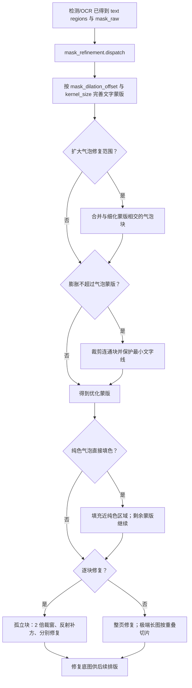

# 蒙版与图像修复

本页对应设置中的“修复”（`Inpainting`）分组：它决定如何把检测和 OCR 已形成的文字区域变成修复蒙版，并如何清除该蒙版内的原文。本页不改变检测器、OCR 识别或文本筛选结果，也不说明译文排版、字体或 AI 渲染器；这些内容分别属于 Detection、OCR 和 Typesetting 页面。

## 在界面中操作 {#ui-operations}

打开“设置”，选择“修复”（`Inpainting`）页签。布局依次显示修复器、蒙版膨胀、两个气泡范围开关、纯色填充和逐块修复；“高级”（`Advanced`）分隔线后是尺寸、精度、卷积核和 PyTorch 强制开关。动态设置行使用开关、整数输入框或下拉框：修改后会立即更新内存中的 `AppSettings`，由配置服务在 250 ms 合并写入配置文件。数值没有“应用”按钮；实际在下一次进入蒙版细化或修复阶段时读取。

气泡相关的两个存储键在 `ocr` 配置段，但界面有意将它们放在“修复”页，因为它们只作用于修复前的蒙版，不会重新识别或过滤 OCR 文字。开关依赖 MangaLens 气泡检测结果；未取到缓存或检测失败时，代码记录警告并保留原细化蒙版。

### UI 调用 key 与实际文案

标签由 `app_logic.py` 的 `labels` 映射调用 locale。页签及分隔线则直接使用布局中的 `Inpainting`、`Advanced` key。下表是本页全部可见设置；`English` 和 `简体中文` 均为实际 locale 值。

| UI 调用 key / 存储键 | English 实际值 | 简体中文实际值 |
| --- | --- | --- |
| `Inpainting` | Inpainting | 修复 |
| `label_inpainter` / `inpainter.inpainter` | Inpainting Model | 修复模型 |
| `label_mask_dilation_offset` / `mask_dilation_offset` | Mask Dilation Offset | 遮罩扩张偏移 |
| `label_limit_mask_dilation_to_bubble_mask` / `ocr.limit_mask_dilation_to_bubble_mask` | Keep Dilation Inside Bubble Mask | 膨胀不超过气泡蒙版 |
| `label_use_model_bubble_repair_intersection` / `ocr.use_model_bubble_repair_intersection` | Expand Bubble Repair Range | 扩大气泡修复范围 |
| `label_solid_fill_pure_bubbles` / `inpainter.solid_fill_pure_bubbles` | Solid Fill Pure Bubbles | 纯色气泡直接填色 |
| `label_per_block_inpainting` / `inpainter.per_block_inpainting` | Per-Block Inpainting | 逐块修复 |
| `Advanced` | Advanced | 高级 |
| `label_inpainting_size` / `inpainter.inpainting_size` | Inpainting Size | 修复大小 |
| `label_inpainting_precision` / `inpainter.inpainting_precision` | Inpainting Precision | 修复精度 |
| `label_kernel_size` / `kernel_size` | Kernel Size | 卷积核大小 |
| `label_force_use_torch_inpainting` / `inpainter.force_use_torch_inpainting` | Force Use PyTorch Inpainting | 强制使用PyTorch修复 |

## 选项、默认值与消费者 {#option-matrix}

“核心默认”来自 `manga_translator/config.py`， “Qt 默认”来自 `desktop_qt_ui/core/config_models.py`， “发行默认”来自 `config/config-example.json`。发行默认是随程序提供的模板，不是任何用户的配置。

### 下拉选项

动态下拉框的选项来自 `app_logic.py` 对 `Inpainter` 和 `InpaintPrecision` 枚举的遍历。这里没有为这些枚举建立显示映射，因此 UI 显示的 English/简体中文均为以下存储值，而不是擅自翻译的模型名。

| 存储值 | English | 简体中文 | 适用条件与实现 |
| --- | --- | --- | --- |
| `default` | `default` | `default` | AOT 实现 |
| `lama_large` | `lama_large` | `lama_large` | LaMa Large 实现；locale 说明称其质量最佳并推荐 |
| `lama_mpe` | `lama_mpe` | `lama_mpe` | LaMa MPE 实现；locale 说明称其较快 |
| `sd` | `sd` | `sd` | Stable Diffusion 修复；缺少可选依赖时加载会报不可用错误 |
| `none` | `none` | `none` | 不运行模型，将蒙版像素填为白色 |
| `original` | `original` | `original` | 返回原图副本，保留原文 |
| `fp32` | `fp32` | `fp32` | 修复精度；locale 说明为最准确、最慢 |
| `fp16` | `fp16` | `fp16` | 修复精度；locale 说明为平衡选项 |
| `bf16` | `bf16` | `bf16` | 修复精度；locale 说明为推荐选项 |

### 参数总表

| 设置键（独立锚点） | 控件与全部存储值 | Qt / 核心 / 发行默认 | 生效阶段 | 最终消费者 |
| --- | --- | --- | --- | --- |
| `inpainter.inpainter` {#inpainter-inpainter} | 下拉框；`default`、`lama_large`、`lama_mpe`、`sd`、`none`、`original` | `lama_mpe` / `lama_large` / `lama_large` | 修复 | `inpainting.get_inpainter()` 的实现映射与 `dispatch()` |
| `mask_dilation_offset` {#mask-dilation-offset} | 整数输入 | `70` / `20` / `50` | 蒙版细化 | `mask_refinement.dispatch()` 的 `dilation_offset` |
| `ocr.limit_mask_dilation_to_bubble_mask` {#limit-mask-dilation-to-bubble-mask} | 开关；`true`、`false` | `false` / `false` / `true` | 蒙版细化 | 气泡掩码裁剪和文字线保护 |
| `ocr.use_model_bubble_repair_intersection` {#use-model-bubble-repair-intersection} | 开关；`true`、`false` | `false` / `false` / `false` | 蒙版细化 | 与细化蒙版相交的气泡连通块合并 |
| `inpainter.solid_fill_pure_bubbles` {#solid-fill-pure-bubbles} | 开关；`true`、`false` | `false` / `false` / `false` | 修复前及修复 | `solid_fill_pure_bubbles()` |
| `inpainter.per_block_inpainting` {#per-block-inpainting} | 开关；`true`、`false` | `false` / `false` / `false` | 修复 | `inpaint_regions_per_block()` 与每块 `dispatch()` |
| `inpainter.inpainting_size` {#inpainting-size} | 整数输入 | `2048` / `2048` / `2048` | 修复 | 每个修复器的 `inpaint(..., inpainting_size)` |
| `inpainter.inpainting_precision` {#inpainting-precision} | 下拉框；`fp32`、`fp16`、`bf16` | `fp32` / `bf16` / `fp32` | 模型加载/修复 | `InpainterConfig` 及 LaMa 后端 |
| `kernel_size` {#kernel-size} | 整数输入 | `3` / `3` / `3` | 蒙版细化 | `complete_mask()` 的卷积核 |
| `inpainter.force_use_torch_inpainting` {#force-use-torch-inpainting} | 开关；`true`、`false` | `false` / `false` / `false` | 修复器加载 | `OfflineInpainter.load(..., force_torch=...)` |

### `inpainter.inpainter` — 修复模型 / Inpainting Model

- 原理：选择值映射到 AOT、LaMa Large、LaMa MPE、Stable Diffusion、白色填充或原图实现；修复分发先把蒙版二值化，极端长宽比大于 3 时再走重叠分块拼接。
- 依赖与冲突：`sd` 需要可选依赖，否则明示为不可用；`none` 不是“什么都不做”，而是白色填充；`original` 才会保留原文。AI 渲染器选择时，主流程会跳过修复并将原始工作图作为渲染底图。
- 图示：需要；模型值决定进入不同实现或跳过模型。

### `mask_dilation_offset` 与 `kernel_size` — 遮罩扩张偏移、卷积核大小 {#dilation-and-kernel}

- 原理：文字区域与原始蒙版先进入 `complete_mask()`；`mask_dilation_offset` 控制外扩以覆盖抗锯齿和残留笔画，`kernel_size` 控制清理卷积核。细化异常时，inpaint-only 流程以 `mask_dilation_offset // kernel_size` 次简单膨胀回退。
- 依赖与冲突：过大的偏移或卷积核会覆盖线稿、气泡边界或图案；`limit_mask_dilation_to_bubble_mask` 可以裁剪进入气泡之外的连通块，但不会在没有气泡结果时强行删掉蒙版。值为 `0` 的偏移不额外外扩；实际整数范围由输入控件和配置校验共同约束，源码没有为本页声明额外的枚举范围。
- 图示：需要；两个数值改变蒙版范围及回退次数。

### 气泡范围 — `ocr.limit_mask_dilation_to_bubble_mask` 与 `ocr.use_model_bubble_repair_intersection` {#bubble-range}

- `ocr.limit_mask_dilation_to_bubble_mask`：对每个细化蒙版连通块与内缩后的模型气泡蒙版求裁剪；相交块只保留交集，未相交块保留。随后会回填原来已有、又被最小文字线保护区裁掉的像素。它不扩大蒙版。
- `ocr.use_model_bubble_repair_intersection`：保留与细化蒙版相交的气泡连通块，并将这些块并入细化蒙版，因此可能扩大修复区域。没有检测到气泡时保持原蒙版。
- 默认与阶段：默认值见总表；两者在 OCR 配置中存储，却只在蒙版细化消费者读取，不影响 OCR 文字、气泡过滤或翻译。
- 依赖与冲突：两者都依赖 MangaLens 气泡结果。两者同开时先合并修复范围、再按气泡约束裁剪；这不是 OCR 的 `use_model_bubble_filter`，后者属于 OCR 过滤页面。
- 图示：需要；开关造成的合并与裁剪方向相反。

### `inpainter.solid_fill_pure_bubbles` — 纯色气泡直接填色 / Solid Fill Pure Bubbles

- 原理：用模型检测的气泡匹配文本区域，将气泡蒙版按比例内缩并扣除膨胀后的紧文字蒙版。剩余背景接近纯色时直接填背景色，从待修复蒙版中移除该区域；模型未命中的区域仍交给修复器。
- 依赖与冲突：需要文本区域和气泡模型结果；气泡检测失败时跳过此优化。它可与逐块修复同开，纯色填充后剩余蒙版再按块修复；若剩余蒙版为空，模型修复会被跳过。
- 图示：需要；开关决定纯色区域是否跳过模型。

### `inpainter.per_block_inpainting` — 逐块修复 / Per-Block Inpainting

- 原理：把优化后的蒙版拆为孤立连通块；每块取 2 倍裁窗、反射补齐为正方形，分别调用同一修复器再写回。关闭时整页一次送入模型。每块补方后不会进入极端长图的切片路径。
- 依赖与冲突：较小裁窗可降低 CPU 推理压力，但上下文减少，复杂背景可能变差。单独开此选项也会启用逐块路径；逐块操作出错时外层回退整页修复。
- 图示：需要；开关改变修复任务粒度和长图路径。

### `inpainter.inpainting_size` 与 `inpainter.inpainting_precision` — 修复大小、修复精度 {#size-and-precision}

- 原理：大小作为每次 `inpaint()` 的输入参数；尺寸越大通常质量越好但速度更慢，过大可能 OOM。精度为枚举 `fp32`、`fp16` 或 `bf16`，传入修复器配置。
- 依赖与冲突：可用精度取决于硬件和后端；核心默认 `bf16` 与 Qt/发行 `fp32` 不同，不能合并成单一“默认”。尺寸或高精度增加内存/显存压力；它们不改变蒙版几何。
- 图示：需要；大小和精度共同影响模型资源分支与 OOM 风险。

### `inpainter.force_use_torch_inpainting` — 强制使用PyTorch修复 / Force Use PyTorch Inpainting {#force-torch}

- 原理：离线修复器加载时把该布尔值传作 `force_torch`。locale 说明指出 CPU 默认优先 ONNX；遇到 ONNX 问题时可强制 PyTorch。
- 依赖与冲突：需要可加载的 PyTorch 后端及匹配设备依赖；它不是全局 GPU 开关，也不影响 `none`、`original` 这类不加载离线模型的实现。
- 图示：需要；开关改变离线修复器加载后端。

## 运行机理 {#runtime}

主流程以 `ctx.mask_raw`、文本区域和全局参数调用蒙版细化，得到 `ctx.mask` 后调用修复分发。若没有文本区域或蒙版为空，修复阶段跳过并保留原始工作图。若细化抛错，inpaint-only 路径采用简单膨胀作为回退；修复异常是否继续由通用 `cli.ignore_errors` 控制。AI renderer 被选中时，主流程明确跳过修复，后续渲染使用原图，这一渲染器边界不改变本页参数的存储值。

## 依赖与冲突 {#dependencies}

- 蒙版细化以前置的文字区域和原始蒙版为输入；没有文本区域时本页开关没有可处理对象。
- 两个气泡范围开关依赖 MangaLens 结果；缓存未命中、无检测或异常时保留细化蒙版。它们不应被描述为 OCR 重新检测或 OCR 过滤。
- 大尺寸、高精度和完整页修复会增加内存/显存压力；极端长图会按长边切成带重叠的块后拼接。
- 逐块修复以更少上下文换取小裁窗；它与“极端长图切片”不是同一个功能。
- `none` 白填、`original` 保留原图、AI renderer 跳过修复三者结果不同；不要互相替代。

## 关联文件与格式 {#files-and-formats}

| 文件或字段 | 本页实际关系 | 格式、兼容性与手改风险 |
| --- | --- | --- |
| `config/config-example.json` | 提供发行模板中的本页默认值 | JSON；只可作默认值来源，勿复制用户路径、凭据或私人配置 |
| `config/config.json` | 配置服务持久化当前设置 | JSON；由 Pydantic 模型校验，直接手改未知值或错误枚举可能导致回退/校验失败 |
| 翻译 JSON 的 `mask_raw` | 可保存原始或优化后的蒙版 | 可选 base64 PNG；保存 `ctx.mask` 时 `mask_is_refined=true`，加载时可跳过再次细化 |
| 翻译 JSON 的 `mask_is_refined` | 标记 `mask_raw` 是否已经是优化蒙版 | 布尔值；缺失或 `false` 不得当作已细化 |
| verbose `mask_bubble_clip_debug.png` | 气泡膨胀限制的调试覆盖图 | 仅在 verbose、该开关启用且写图成功时产生；含运行图像内容，分享前须脱敏 |

本页不展示、读取或要求填写真实密钥、用户配置、私有路径、图片或提示词。

## 源码依据 {#source-evidence}

| 层级 | 文件 | 已核对内容 |
| --- | --- | --- |
| UI 布局 | `desktop_qt_ui/ui/main_page/settings_tab_layout.json` | Inpainting 页签的十个设置及 Advanced 分隔线顺序 |
| UI 标签与枚举 | `desktop_qt_ui/app_logic.py` | labels 的 i18n 调用及 `Inpainter`、`InpaintPrecision` 选项来源 |
| locale | `desktop_qt_ui/locales/en_US.json`、`desktop_qt_ui/locales/zh_CN.json` | 全部 UI 调用 key 的实际双语标签及说明 |
| Qt 默认与持久化 | `desktop_qt_ui/core/config_models.py`、`desktop_qt_ui/services/config_service.py` | Qt 默认值、用户/发行/代码优先级和 250 ms 合并写入 |
| 核心定义 | `manga_translator/config.py` | 枚举、核心默认、字段语义 |
| 蒙版消费者 | `manga_translator/mask_refinement/__init__.py`、`manga_translator/manga_translator.py` | 膨胀、气泡合并/裁剪、回退和阶段调用 |
| 修复消费者 | `manga_translator/inpainting/__init__.py`、`manga_translator/inpainting/none.py`、`manga_translator/inpainting/original.py` | 修复器映射、Torch 载入、长图切片、白填和原图行为 |
| 蒙版序列化 | `manga_translator/manga_translator.py` | `mask_raw` base64 PNG 与 `mask_is_refined` 写入 |

## 验证记录 {#verification}

| 验证项 | 状态 | 记录 |
| --- | --- | --- |
| 布局、控件与 i18n 三列 | 完成 | 静态核对布局、`app_logic.py` 和 `en_US`/`zh_CN` 实际值 |
| 参数默认、枚举和消费者 | 完成 | 静态核对 Qt、核心、发行模板及修复/蒙版调用链 |
| UI 实机交互与气泡模型结果 | 未运行 | 不以静态源码代替运行验证；需要脱敏测试图与模型环境 |
| 每种修复器、精度、长图与逐块效果 | 未运行 | 需要可复现的脱敏运行验证；不展示用户图片或输出 |
| VitePress 构建 | 待本次页面构建 | 见本次提交的构建命令记录 |

## 敏感信息审查 {#sensitive-information-review}

- 已审查：页面不含 API Key、Token、用户名、用户 `config.json`、私有绝对路径、用户图片或提示词。
- 调试图仅记录条件性文件名和脱敏要求，未嵌入或引用任何实际运行图。
