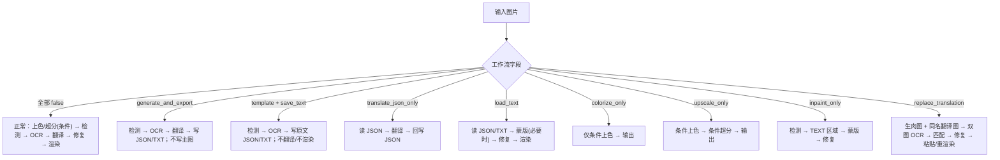
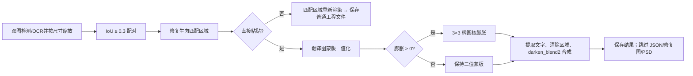

# 模式专用工作流与模板对齐

本页覆盖翻译页的九种工作流，以及设置页签“Mode Specific → Replace Translation”中的模板对齐参数。它不重复超分/上色字段（见[超分与上色](./upscale-and-colorization.md)）或各阶段通用参数。工作流是 `cli` 分支；模板对齐是 `render` 分支。GUI 选择模式时八个工作流标志先全部清零，因此一次选择只有一个模式；手工叠加多个标志不属于稳定契约。

## UI 操作

在翻译页“Translation Workflow Mode:”下拉框选择模式。切换立即保存配置并刷新说明和开始按钮；已有输出是否跳过仍由“覆盖已存在文件”决定。替换翻译还要求同名配对图。

| UI 调用 key | English 实际值 | 简体中文实际值 |
| --- | --- | --- |
| `Translation Workflow Mode:` | Translation Workflow Mode: | 翻译流程模式： |
| `Normal Translation` | Normal Translation | 正常翻译流程 |
| `Export Translation` | Export Translation | 导出翻译 |
| `Export Original Text` | Export Original Text | 导出原文 |
| `Translate JSON Only` | Translate JSON Only | 仅翻译（JSON） |
| `Import Translation and Render` | Import Translation and Render | 导入翻译并渲染 |
| `Colorize Only` | Colorize Only | 仅上色 |
| `Upscale Only` | Upscale Only | 仅超分 |
| `Inpaint Only` | Inpaint Only | 仅修复 |
| `Replace Translation` | Replace Translation | 替换翻译 |
| `Start Translation` | Start Translation | 开始翻译 |
| `Generate Original Text Template` | Generate Original Text Template | 仅生成原文模板 |
| `Start JSON Translation` | Start JSON Translation | 开始仅翻译（JSON） |
| `Start Colorizing` | Start Colorizing | 开始上色 |
| `Start Upscaling` | Start Upscaling | 开始超分 |
| `Start Inpainting` | Start Inpainting | 开始修复 |
| `Start Replace Translation` | Start Replace Translation | 开始替换翻译 |
| `label_enable_template_alignment` | Enable Direct Paste Mode | 启用直接粘贴模式 |
| `label_paste_mask_dilation_pixels` | Paste Mode Mask Dilation Pixels | 粘贴模式蒙版膨胀大小 |

“启用直接粘贴模式”和“粘贴模式蒙版膨胀大小”位于 Settings → Mode Specific → Replace Translation。前者是开关，后者为整数；`0` 禁用膨胀。模式选择器本身维护 `cli.generate_and_export`、`template`、`translate_json_only`、`load_text`、`colorize_only`、`upscale_only`、`inpaint_only`、`replace_translation`。

## 九种工作流与边界

阶段通常为：上色（条件）→ 超分（条件）→ 检测 → OCR → 文本行合并 → 翻译 → 蒙版细化 → 修复 → 排版/渲染。

| UI 模式 / 存储值 | 输入与发现 | 输出 | 阶段、跳过和冲突 |
| --- | --- | --- | --- |
| 正常翻译 / 全部模式字段 `false` | 主图片 | 主图；`save_text=true` 时 JSON，可能有修复图/编辑器底图 | 完整主链；唯一可进入 `batch_concurrent` |
| 导出翻译 / `cli.generate_and_export=true` | 主图和可选模板 | JSON、`<stem>_translated.<format>`；不写主图 | 到翻译/蒙版细化；跳过修复、渲染；禁用并发 |
| 导出原文 / `cli.template=true && save_text=true` | 主图和模板 | JSON、`<stem>_original.<format>` | 到 OCR/合并/蒙版细化；跳过翻译、修复、渲染；禁用并发 |
| 仅翻译（JSON） / `cli.translate_json_only=true` | 已有工程 JSON | 回写 JSON，成功后删除原文副文件 | 只读 JSON 翻译；跳过图像阶段；禁用并发 |
| 导入翻译并渲染 / `cli.load_text=true` | JSON 及同名原文/译文 TXT | 主图、更新 JSON，必要时修复图 | 导入→蒙版（必要时）→修复→渲染；跳过检测/OCR/翻译；禁用并发 |
| 仅上色 / `cli.colorize_only=true` | 主图 | 主图，条件性编辑器底图 | 仅条件上色；跳过超分和文字链；禁用并发 |
| 仅超分 / `cli.upscale_only=true` | 主图 | 主图，条件性编辑器底图 | 条件上色→条件超分；跳过文字链；不会自动关闭已选上色器；禁用并发 |
| 仅修复 / `cli.inpaint_only=true` | 主图和检测器 | 主图 | 条件预处理→检测→字面量 `TEXT` 区域→合并→蒙版→修复；跳过 OCR/翻译/渲染；禁用并发 |
| 替换翻译 / `cli.replace_translation=true` | 生肉图；`manga_translator_work/translated_images/<stem><ext>` 同名翻译图 | 主图；普通重渲染可写 JSON/修复图 | 双图检测/OCR/合并→按缩放区域 IoU `0.3` 匹配→修复→粘贴或重渲染；不调用翻译；禁用并发 |

模板 `output_format` 缺失或非法时回退 `json`；同名 JSON 新位置优先，兼容图片同级旧位置。仅超分不会自动禁用上色器，导出原文还需要 `save_text=true`。

## 参数

#### `cli.generate_and_export` — 导出翻译 / Export Translation {#cli-generate-and-export}

- 控件/存储：工作流下拉索引 1；布尔 `true/false`。
- 全部选项：`false` Normal Translation / 正常翻译流程；`true` Export Translation / 导出翻译。
- 默认：核心 `false`；Qt `false`；发行 `false`。
- 阶段/消费者：检测、OCR、合并、翻译、可选蒙版细化；`manga_translator.py` 导出分支和 TXT/JSON 保存器。
- 原理：导出翻译载荷，不修复、排版或保存主图。
- 依赖/冲突：主图、模板；与其他工作流和 `batch_concurrent` 冲突。
- 文件/图示：`work/json/`、`work/translations/`、`translation_template.json`；见[#工作流分支](#workflow-branches)。
- 源码：`runtime.py`、`config_models.py`、`manga_translator.py`、`path_manager.py`。

#### `cli.template` — 导出原文 / Export Original Text {#cli-template}

- 控件/存储：工作流下拉索引 2；布尔 `true/false`。
- 全部选项：`false` Normal Translation / 正常翻译流程；`true` Export Original Text / 导出原文。
- 默认：核心 `false`；Qt `false`；发行 `false`。
- 阶段/消费者：检测、OCR、合并、可选蒙版细化；模板导出和原文保存器。
- 原理：导出 OCR 原文供人工翻译；必须同时 `save_text=true`。
- 依赖/冲突：模板格式非法回退 `json`；跳过翻译、修复、渲染和并发。
- 文件/图示：`work/originals/<stem>_original.<format>`、JSON、模板；见工作流分支图。
- 源码：`runtime.py`、`config_models.py`、`manga_translator.py`、`translation_template.py`。

#### `cli.translate_json_only` — 仅翻译（JSON） / Translate JSON Only {#cli-translate-json-only}

- 控件/存储：索引 3；布尔 `true/false`。
- 全部选项：`false` Normal Translation / 正常翻译流程；`true` Translate JSON Only / 仅翻译（JSON）。
- 默认：核心/Qt/发行均 `false`。
- 阶段/消费者：JSON 读取→翻译→JSON 回写；跳过所有图像阶段。
- 原理：从 `regions` 或旧列表载荷读取原文，翻译后写回；成功删除同图原文副文件。
- 依赖/冲突：需要兼容 JSON；与其他模式和并发冲突；不受 `save_text` 控制。
- 文件/图示：`work/json/<stem>_translations.json` 和原文副文件；见工作流分支图。
- 源码：`runtime.py`、`config_models.py`、`manga_translator.py`、`path_manager.py`。

#### `cli.load_text` — 导入翻译并渲染 / Import Translation and Render {#cli-load-text}

- 控件/存储：索引 4；布尔 `true/false`。
- 全部选项：`false` Normal Translation / 正常翻译流程；`true` Import Translation and Render / 导入翻译并渲染。
- 默认：核心/Qt/发行均 `false`。
- 阶段/消费者：TXT/JSON 导入、蒙版、修复、排版；`manga_translator.py` 导入分支。
- 原理：读取 JSON 和 TXT（原文优先），有精炼蒙版则复用，否则细化后修复渲染；跳过检测/OCR/翻译。
- 依赖/冲突：需要同名 JSON；缺蒙版且启用 YOLO 导入时可能检测回退；禁用并发。
- 文件/图示：`work/originals/`、`translations/`、`json/`、`inpainted/`；见工作流分支图。
- 源码：`runtime.py`、`manga_translator.py`、`path_manager.py`、`translation_template.py`。

#### `cli.colorize_only` — 仅上色 / Colorize Only {#cli-colorize-only}

- 控件/存储：索引 5；布尔 `true/false`。
- 全部选项：`false` Normal Translation / 正常翻译流程；`true` Colorize Only / 仅上色。
- 默认：核心/Qt/发行均 `false`。
- 阶段/消费者：条件上色和保存；跳过超分、检测、OCR、翻译、蒙版、修复、渲染。
- 原理：调用当前上色器；`colorizer=none` 时原样输出。
- 依赖/冲突：AI 上色需相应 API；不强制选择上色器；禁用并发。
- 文件/图示：结果图、条件性 `editor_base/`；见工作流分支图。
- 源码：`runtime.py`、`manga_translator.py`、`colorization/`。

#### `cli.upscale_only` — 仅超分 / Upscale Only {#cli-upscale-only}

- 控件/存储：索引 6；布尔 `true/false`。
- 全部选项：`false` Normal Translation / 正常翻译流程；`true` Upscale Only / 仅超分。
- 默认：核心/Qt/发行均 `false`。
- 阶段/消费者：条件上色、超分和保存；跳过文字链；`upscale/` 和主调度器。
- 原理：倍率来自 `upscale.upscale_ratio`；为空时不超分，已选上色器仍可能先运行。
- 依赖/冲突：模型、设备、倍率和瓦片；禁用并发。
- 文件/图示：结果图、条件性 `editor_base/`；详见超分页和工作流分支图。
- 源码：`runtime.py`、`manga_translator.py`、`upscaling/`、`config.py`。

#### `cli.inpaint_only` — 仅修复 / Inpaint Only {#cli-inpaint-only}

- 控件/存储：索引 7；布尔 `true/false`。
- 全部选项：`false` Normal Translation / 正常翻译流程；`true` Inpaint Only / 仅修复。
- 默认：核心/Qt/发行均 `false`。
- 阶段/消费者：检测、合并、蒙版细化和修复；跳过 OCR、翻译、渲染。
- 原理：检测行改为字面量 `TEXT` 作为待清除区域；没有区域/蒙版则返回未修复图。
- 依赖/冲突：检测器、蒙版、修复器；AI renderer 可跳过真正修复；禁用并发。
- 文件/图示：结果图和条件性 `work/inpainted/`；见工作流分支图。
- 源码：`runtime.py`、`manga_translator.py`、`mask_refinement/`、`inpainting/`。

#### `cli.replace_translation` — 替换翻译 / Replace Translation {#cli-replace-translation}

- 控件/存储：索引 8；布尔 `true/false`。
- 全部选项：`false` Normal Translation / 正常翻译流程；`true` Replace Translation / 替换翻译。
- 默认：核心/Qt/发行均 `false`。
- 阶段/消费者：双图检测/OCR/合并、区域匹配、修复、粘贴或重渲染；`utils/replace_translation.py`。
- 原理：同名翻译图区域按目标尺寸缩放，以小框为基准 IoU `0.3` 匹配；不调用翻译；运行时强制 `disable_auto_wrap=true`、`layout_mode=strict`。
- 依赖/冲突：必须有 `translated_images/<stem><ext>`；禁用并发；直接粘贴时不写 JSON、修复图或 PSD。
- 文件/图示：配对图、结果图，普通渲染另有 JSON/修复图；见[#直接粘贴与重新渲染](#paste-branches)。
- 源码：`runtime.py`、`manga_translator.py`、`utils/replace_translation.py`、`utils/path_manager.py`。

#### `render.enable_template_alignment` — 启用直接粘贴模式 / Enable Direct Paste Mode {#render-enable-template-alignment}

- 控件/存储：开关；`true/false`。
- 全部选项：`false` Normal rendering / 普通重新渲染；`true` Direct paste / 直接粘贴。
- 默认：核心/Qt/发行均 `false`。
- 阶段/消费者：替换翻译最终渲染；`replace_translation.py`。
- 原理：开启时使用翻译图蒙版提取文字，清除修复底图区域并用 `darken_blend2` 合成；关闭时交给通用 renderer 重新排版。仅替换翻译消费。
- 依赖/冲突：翻译图无原始蒙版时回退生肉图蒙版；开启时跳过 JSON、修复图和 PSD 保存。
- 文件/图示：配对图、结果图、条件性 `debug_extracted_text.png`；见粘贴分支图。
- 源码：`config.py`、`config_models.py`、`dynamic_settings.py`、两份 locale、`replace_translation.py`。

#### `render.paste_mask_dilation_pixels` — 粘贴模式蒙版膨胀大小 / Paste Mode Mask Dilation Pixels {#render-paste-mask-dilation-pixels}

- 控件/存储：整数输入；整数值。
- 全部选项：正数按像素膨胀；`0` 或负数不膨胀（无 UI 枚举）。
- 默认：核心 `10`；Qt `10`；发行 `10`。
- 阶段/消费者：直接粘贴的蒙版预处理；OpenCV 阈值化、3×3 椭圆核和合成。
- 原理：先二值化；正值使用 `max(value // 3, 1)` 次 3×3 椭圆核迭代。值越大，覆盖范围越宽。
- 依赖/冲突：仅 `replace_translation=true` 且直接粘贴开启时消费；其他模式和普通重渲染忽略。
- 文件/图示：仅改变中间蒙版、提取文字和结果图；见粘贴分支图。
- 源码：`config.py`、`config_models.py`、`dynamic_settings.py`、两份 locale、`replace_translation.py`。

## 运行机理 {#workflow-branches}

### 直接粘贴与重新渲染 {#paste-branches}

`batch_size` 是非并发入口的批次大小；`batch_concurrent` 是跨图片并发开关。所有特殊模式均强制关闭并发，避免副文件顺序、上下文和失败隔离被破坏。

## 依赖与冲突

- 工作流字段由 GUI 互斥清理；手工叠加多个字段没有同时执行契约。
- `save_text` 是导出原文的必要条件；JSON-only 无条件回写 JSON。
- `colorizer` 和 `upscale_ratio` 不会被仅上色/仅超分自动改写；前置条件仍可能生效。
- 替换翻译需要同名翻译图；直接粘贴不是通用模板导入。
- 直接粘贴跳过 JSON、修复图和 PSD；普通重渲染依 `save_text` 保存工程文件。

## 关联文件与格式

| 文件/目录 | 用途 | 格式与注意事项 |
| --- | --- | --- |
| `config/config.json` | 持久化配置 | JSON；不展示用户值 |
| `config/config-example.json` | 发行默认 | JSON；`render.layout_mode=balloon_fill`、`upscale=mangajanai`、`tile_size=400` 与核心/Qt 可不同 |
| `config/translation_template.json` | TXT/JSON 模板 | 首个合法 `output_format` 决定扩展名；缺失/非法回退 `json` |
| `manga_translator_work/json/` | 工程 JSON | `<stem>_translations.json`；新目录优先，兼容旧位置 |
| `manga_translator_work/originals/` / `translations/` | 原文/译文 | `<stem>_original.<format>` / `<stem>_translated.<format>` |
| `manga_translator_work/translated_images/` | 替换配对图 | 同 stem；先同扩展名，再受支持扩展名 |
| `manga_translator_work/inpainted/`、`editor_base/` | 条件中间产物 | 不保证每次产生；直接粘贴不写修复图 |
| verbose 结果目录 | 调试 | 直接粘贴可有 `debug_extracted_text.png`；分享前脱敏清理 |

## 源码依据 {#source-evidence}

| 层级 | 文件 | 核对内容 |
| --- | --- | --- |
| UI 布局/绑定 | `desktop_qt_ui/ui/main_page/settings_tab_layout.json`、`runtime.py`、`dynamic_settings.py` | 页签行、九个索引、互斥写入、两个参数提交 |
| UI/i18n | `desktop_qt_ui/app_logic.py`、`desktop_qt_ui/locales/en_US.json`、`zh_CN.json` | UI 调用 key 和实际显示值 |
| 默认/定义 | `desktop_qt_ui/core/config_models.py`、`manga_translator/config.py`、`config/config-example.json` | Qt、核心、发行三类默认 |
| 调度/消费者 | `manga_translator/manga_translator.py`、`manga_translator/utils/replace_translation.py` | 特殊分支、跳过阶段、匹配、修复、粘贴和并发 |
| 文件格式 | `manga_translator/utils/path_manager.py`、`translation_template.py` | 工作目录、同名匹配、扩展名回退 |

## 验证记录与敏感信息审查 {#verification}

- 规范、页面责任边界、源码字段、UI/i18n 三列和三类默认：通过（静态核对）。
- Mermaid：已表达九种实际阶段分支及直接粘贴/重新渲染差异。
- 脱敏审查：通过；未展示真实密钥、令牌、用户名、私有绝对路径、用户图片或私有提示词。
- 脱敏 GUI/模型运行：未进行；不伪造截图或运行结论。
- 路由镜像、源码依据、覆盖率静态检查及 VitePress build：待完成后运行并记录。
