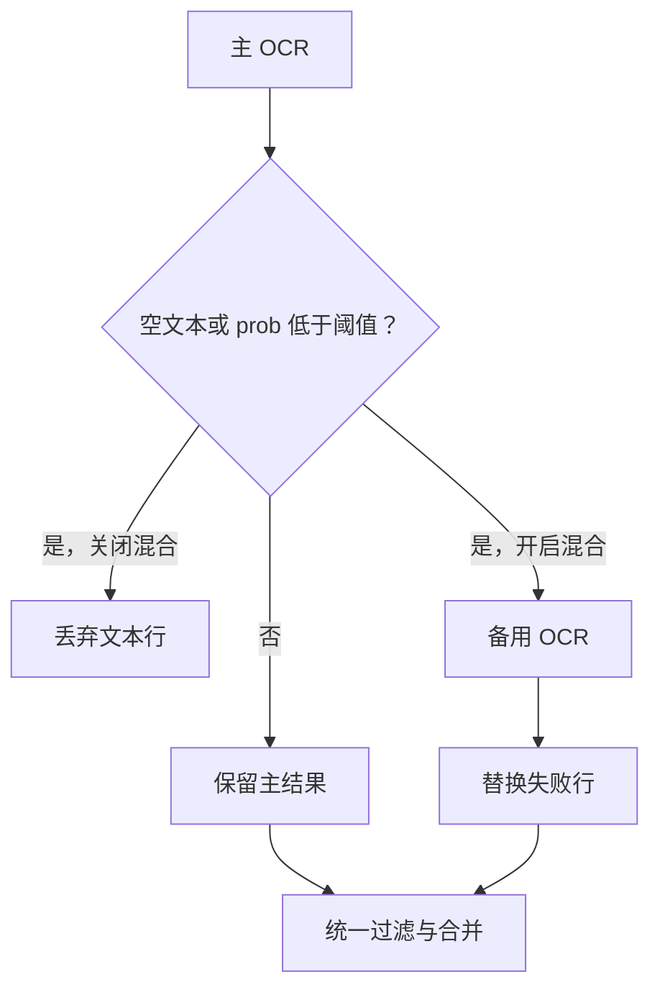
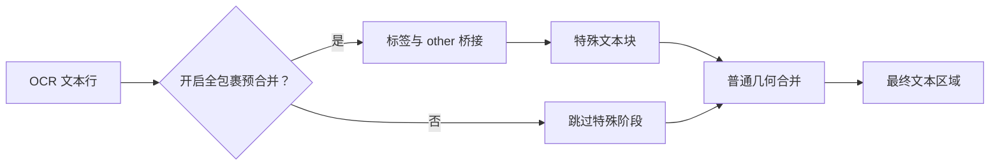
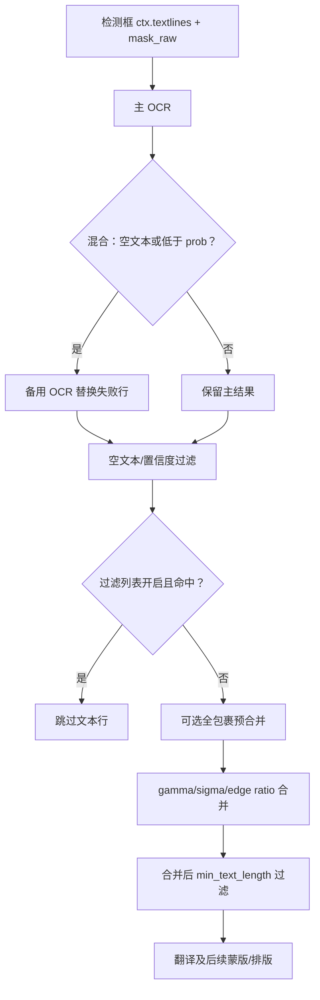

# OCR、过滤与文本行合并

本页对应设置中的 “OCR” 页签，覆盖检测框进入 OCR 后的识别、气泡/置信度筛选、过滤列表，以及文本行合并前后的约束。本页不负责检测器如何产生检测框（见 [Detection 设置](./detection.md)），也不负责翻译、修复或排版参数。

## 功能边界 {#feature-boundary}

处理顺序是：检测器产生 `ctx.textlines` 和 `mask_raw`，OCR 为每个框写入文本与概率，OCR 阶段过滤无效框，然后合并文本行成为文本区域；文本区域才会进入翻译。模型气泡修复选项虽然位于本页相关配置中，但最终消费者是蒙版细化，详细修复器行为属于 [Mask 与 Inpainting](./mask-and-inpainting.md)。

## UI 操作 {#ui-operations}

1. 打开设置并选择 “OCR”。普通开关、数值框和下拉框直接编辑配置；“Advanced” 分隔线后的字段仍属于同一页，只是面向高级调参。
2. “OCR Model” 选择主 OCR；打开 “Enable Hybrid OCR” 后，低置信或空文本行会交给 “Secondary OCR”。选择 OCR 模型、混合开关或备用 OCR 时，桌面 API 管理区域会按实现刷新所需的 API 组。
3. “AI OCR Prompt” 是文件编辑动作，不是普通 `OcrConfig` 字段；它打开固定的 AI OCR 提示词文件编辑器。不要把提示词正文或凭据写入本文。
4. “PaddleOCR-VL Language Hint” 只在选择 `paddleocr_vl` 时有意义；“PaddleOCR-VL Custom Prompt (Override)” 非空时覆盖内置语言/提示模式。
5. “Edit Filter List” 打开过滤列表编辑器。结构化页有 “Contains Filter”（每行一条包含规则）和 “Exact Filter”（每行一条精确规则）；“Raw Edit” 可直接编辑 JSON。用 “Refresh” 重读、“Cancel” 放弃、“Save” 校验并保存。
6. 空白规则会被丢弃；Raw JSON 根必须是对象。结构化保存保留未知顶层字段；JSON 语法错误显示 “JSON format error” 且不会保存坏配置。

### UI 调用 key 与实际文案

| UI 调用 key | English 实际值 | 简体中文实际值 |
| --- | --- | --- |
| `label_ocr` | OCR Model | OCR模型 |
| `label_use_hybrid_ocr` | Enable Hybrid OCR | 启用混合OCR |
| `label_secondary_ocr` | Secondary OCR | 备用OCR |
| `label_ai_ocr_prompt_path` | AI OCR Prompt | AI OCR 提示词 |
| `label_ai_ocr_concurrency` | AI OCR Concurrency | AI OCR 并发数 |
| `label_ocr_vl_language_hint` | PaddleOCR-VL Language Hint | PaddleOCR-VL 语言提示 |
| `label_ocr_vl_custom_prompt` | PaddleOCR-VL Custom Prompt (Override) | PaddleOCR-VL 自定义提示词（优先） |
| `label_use_model_bubble_filter` | Enable Model Bubble Filter | 启用模型气泡过滤 |
| `label_min_text_length` | Minimum Text Length | 最小文本长度 |
| `label_ignore_bubble` | Ignore Non-Bubble Text | 忽略非气泡文本 |
| `label_merge_special_require_full_wrap` | Require Full Wrap In Special Pre-Merge | 模型辅助合并 |
| `label_model_bubble_overlap_threshold` | Model Bubble Overlap Threshold | 模型气泡重叠阈值 |
| `label_filter_text_enabled` | Enable Filter List | 启用过滤列表 |
| `label_prob` | Text Region Min Probability | 文本区域最低概率 (prob) |
| `label_merge_gamma` | Merge Distance Tolerance | 合并-距离容忍度 |
| `label_merge_sigma` | Merge Outlier Tolerance | 合并-离群容忍度 |
| `label_merge_edge_ratio_threshold` | Merge Edge Ratio Threshold | 合并-边缘距离比例阈值 |
| `Edit Filter List` | Edit Filter List | 编辑过滤列表 |
| `Contains Filter` | Contains Filter | 包含过滤 |
| `Exact Filter` | Exact Filter | 精确过滤 |
| `Raw Edit` | Raw Edit | 原始编辑 |
| `Refresh` | Refresh | 刷新 |
| `Cancel` | Cancel | 取消 |
| `Save` | Save | 保存 |

## 选项中英对照 {#option-matrix}

### OCR 引擎

| 存储值 | English | 简体中文 | 适用条件 |
| --- | --- | --- | --- |
| `32px` | 32px | 32px | 离线 OCR |
| `48px` | 48px | 48px | 离线 OCR |
| `48px_ctc` | 48px CTC | 48px CTC | 离线 OCR |
| `mocr` | Manga OCR | Manga OCR | 延迟加载的 Manga OCR |
| `paddleocr` | PaddleOCR | PaddleOCR | PaddleOCR |
| `paddleocr_korean` | PaddleOCR Korean | PaddleOCR Korean | 韩文 OCR |
| `paddleocr_latin` | PaddleOCR Latin | PaddleOCR Latin | 拉丁文字 OCR |
| `paddleocr_thai` | PaddleOCR Thai | PaddleOCR Thai | 泰文 OCR |
| `paddleocr_vl` | PaddleOCR-VL | PaddleOCR-VL | VLM OCR |
| `openai_ocr` | OpenAI OCR | OpenAI OCR | 需要对应 API 配置 |
| `gemini_ocr` | Gemini OCR | Gemini OCR | 需要对应 API 配置 |

### PaddleOCR-VL 语言提示

| 存储值 | English | 简体中文 |
| --- | --- | --- |
| `auto` | Auto | 自动 |
| `multilingual` | Multilingual | 多语言 |
| `Arabic` | Arabic | 阿拉伯语 |
| `Simplified Chinese` | Simplified Chinese | 简体中文 |
| `Traditional Chinese` | Traditional Chinese | 繁体中文 |
| `English` | English | 英语 |
| `Japanese` | Japanese | 日语 |
| `Korean` | Korean | 韩语 |
| `Spanish` | Spanish | 西班牙语 |
| `French` | French | 法语 |
| `German` | German | 德语 |
| `Russian` | Russian | 俄语 |
| `Portuguese` | Portuguese | 葡萄牙语 |
| `Italian` | Italian | 意大利语 |
| `Thai` | Thai | 泰语 |
| `Vietnamese` | Vietnamese | 越南语 |
| `Indonesian` | Indonesian | 印尼语 |
| `Turkish` | Turkish | 土耳其语 |
| `Polish` | Polish | 波兰语 |
| `Ukrainian` | Ukrainian | 乌克兰语 |

## 参数、默认值与消费者 {#parameters}

核心默认来自 `manga_translator/config.py`，Qt 默认来自 `desktop_qt_ui/core/config_models.py`，发行默认来自 `config/config-example.json`。`—` 表示该层没有同名核心字段；`ocr.ai_ocr_prompt_path` 是文件动作字段，不是核心 `OcrConfig` 字段。

| 参数 | 核心默认 | Qt 默认 | 发行默认 | 影响阶段 | 最终消费者 | 依赖/冲突 |
| --- | ---: | ---: | ---: | --- | --- | --- |
| `ocr.ocr` | `48px` | `48px` | `48px` | OCR | `ocr.dispatch`/模型 | 模型或 API 组 |
| `ocr.use_hybrid_ocr` | `false` | `true` | `false` | OCR 回退 | `_run_ocr` | 备用引擎，增加成本 |
| `ocr.secondary_ocr` | `48px` | `mocr` | `mocr` | OCR 回退 | `ocr.dispatch` | 混合开启才使用 |
| `ocr.min_text_length` | `0` | `0` | `0` | 合并后过滤 | `manga_translator` | 不阻止合并 |
| `ocr.ignore_bubble` | `0.0` | `0.0` | `0.0` | OCR 框筛选 | `ocr.common`/bubble | 可叠加模型过滤 |
| `ocr.use_model_bubble_filter` | `false` | `false` | `false` | OCR 框筛选 | `ocr.common`/MangaLens | 需要气泡结果 |
| `ocr.model_bubble_overlap_threshold` | `0.1` | `0.1` | `0.1` | OCR/修复 | OCR、纯气泡填充 | 越低越宽松 |
| `ocr.use_model_bubble_repair_intersection` | `false` | `false` | `false` | 蒙版细化 | `mask_refinement` | 依赖 MangaLens mask |
| `ocr.limit_mask_dilation_to_bubble_mask` | `false` | `false` | `true` | 蒙版细化 | `mask_refinement` | 与膨胀联动 |
| `filter_text_enabled` | — | `true` | `false` | OCR 后过滤 | `text_filter`/主流程 | 依赖 `filter_list.json` |
| `ocr.prob` | `None` | `0.1` | `0.1` | OCR 回退/后过滤 | `_resolve_ocr_prob_threshold` | `None` 回退 0.1 |
| `ocr.merge_gamma` | `0.8` | `0.8` | `0.8` | 文本行合并 | `textline_merge` | 越高越易合并 |
| `ocr.merge_sigma` | `2.5` | `2.5` | `2.5` | 文本行合并 | `textline_merge` | 越高越容忍离群 |
| `ocr.merge_edge_ratio_threshold` | `0.0` | `0.0` | `0.0` | 文本行合并 | `textline_merge` | 0 禁用保护 |
| `ocr.merge_special_require_full_wrap` | `true` | `true` | `true` | 特殊预合并 | `textline_merge.dispatch` | 需要检测标签 |
| `ocr.ocr_vl_language_hint` | `auto` | `auto` | `Japanese` | VL OCR | PaddleOCR-VL | 仅 VL 有效 |
| `ocr.ocr_vl_custom_prompt` | `None` | `None` | `null` | VL OCR | PaddleOCR-VL | 非空覆盖提示 |
| `ocr.ai_ocr_prompt_path` | — | 文件动作 | — | API OCR | prompt loader | 非普通核心键 |
| `ocr.ai_ocr_concurrency` | `1` | `1` | `10` | API OCR | OpenAI/Gemini OCR | 受限流/配额/内存 |
| `ocr.ai_ocr_custom_prompt` | `None` | `None` | `null` | API OCR | API OCR backend | 仅 API OCR |

#### `ocr.ocr` — OCR 模型 / OCR Model {#ocr-ocr}

下拉框选择枚举中的 OCR。`ocr.dispatch` 选择并缓存模型；离线模型加载到所选设备，API 模型走对应 API 配置。模型依赖和凭据必须就绪；不改变检测框。图示：不需要，枚举表已表达分支。

#### `ocr.use_hybrid_ocr` 与 `ocr.secondary_ocr` — 混合 OCR / Hybrid OCR {#hybrid-ocr}

主 OCR 产生空文本或低于 `prob` 的行时，开启混合模式会调用备用引擎并替换失败行，之后仍统一过滤和合并。备用模型/API 必须可用，并增加加载、请求和延迟。

#### `ocr.prob` — 文本区域最低概率 / Text Region Min Probability {#ocr-prob}

可空数值框。核心 `None`、Qt/发行 `0.1`；`None` 在 `_resolve_ocr_prob_threshold` 中解析为 `0.1`。它同时决定混合回退和 OCR 后逐行过滤，不是检测器的 `text_threshold`。过高会增加回退并丢弃更多文本。

#### `ocr.ignore_bubble` — 忽略非气泡文本 / Ignore Non-Bubble Text {#ocr-ignore-bubble}

0–1 浮点框，0 关闭；值越高越严格。OCR backend 在识别前由 `ocr.common`/bubble 工具筛掉非气泡框。可与模型气泡过滤叠加，会减少 OCR 输入但不细化蒙版。

#### `ocr.use_model_bubble_filter` 与 `ocr.model_bubble_overlap_threshold` — 模型气泡过滤 / Model Bubble Filter {#model-bubble-filter}

MangaLens 文本框与气泡框达到阈值才保留，阈值越低越宽松；同一阈值还被纯气泡填充使用。依赖 MangaLens 结果，不能当作检测器阈值。

#### `ocr.min_text_length` — 最小文本长度 / Minimum Text Length {#ocr-min-text-length}

整数，0 不按长度删除。它在最终合并区域上读取 `region.text` 长度，短原始行仍可参与合并；过大可能删除单字或拟声词。

#### `filter_text_enabled` — 启用过滤列表 / Enable Filter List {#filter-text-enabled}

开关加 “Edit Filter List”；Qt 默认 true、发行默认 false，核心没有同名字段。OCR 后先丢弃空文本和低置信行，再按大小写不敏感的精确/包含规则匹配；命中行不参与合并、翻译、修复或排版。关闭它不会关闭概率、气泡或最小长度过滤。

#### `ocr.merge_gamma` 与 `ocr.merge_sigma` — 合并容忍度 / Merge Tolerances {#merge-tolerances}

浮点框，默认 `0.8` 与 `2.5`。`gamma` 放宽相邻行距离相对字体大小的条件，`sigma` 放宽距离离群标准差条件；过高可能跨气泡过度合并。

#### `ocr.merge_edge_ratio_threshold` — 合并边缘距离比例阈值 / Merge Edge Ratio Threshold {#merge-edge-ratio}

浮点框，0 禁用。启用且节点有多个邻居时，较长边与最近边的距离比超过阈值就断开较长边；过小会拆散文本，过大保护变弱。

#### `ocr.merge_special_require_full_wrap` — 模型辅助合并 / Require Full Wrap In Special Pre-Merge {#special-pre-merge}

开关，默认 true。开启时先按 strip/balloon 标签寻找完全包裹关系；`other` 框仅作桥接，不进入最终文本块，剩余框再走普通合并。关闭会跳过特殊阶段。

#### VL 与 AI OCR 参数 {#ocr-vl-and-ai}

`ocr.ocr_vl_language_hint` 默认 `auto`，发行示例为 `Japanese`；`ocr.ocr_vl_custom_prompt` 非空时覆盖内置提示，仅对 `paddleocr_vl` 生效。`ocr.ai_ocr_prompt_path` 是固定提示词文件编辑动作；`ocr.ai_ocr_custom_prompt` 默认空；`ocr.ai_ocr_concurrency` 核心/Qt 为 1、发行示例为 10。OpenAI/Gemini OCR 使用这些资源并限制同时 API 请求数。需要 API 配置，较高并发可能触发限流；本文不展示提示词或密钥。

## 运行机理 {#runtime}

OCR 后过滤在合并前，最小长度在合并后。AI OCR 的并发数只限制 OCR API 请求，不代表整条图片流水线并发。

## 依赖与冲突 {#dependencies}

- 离线 OCR 需要模型与设备后端；OpenAI/Gemini OCR 需要 API 管理页的凭据、地址和模型。
- 混合 OCR 与高 `prob` 会增加第二次推理/请求；过严气泡阈值会漏掉画外文字。
- 合并参数组合不当会造成跨气泡过度合并或碎片化；气泡修复交集和膨胀限制影响修复蒙版，不改变 OCR 文本。
- AI OCR 并发受 API 限流、配额、网络和内存约束。

## 关联文件与格式 {#files-and-formats}

| 文件/目录 | 作用 | 手改/安全注意 |
| --- | --- | --- |
| `config/config.json` | 用户设置持久化 | 不分享用户路径、凭据或状态 |
| `config/config-example.json` | 发行默认模板 | 不是用户当前配置 |
| `config/filter_list.json` | `contains`/`exact` 过滤词 JSON | UTF-8、根对象；空白规则被移除 |
| `config/filter_list.txt` | 旧版迁移来源 | 仅 JSON 不存在时迁移 |
| `dict/ai_ocr_prompt.yaml` | AI OCR 固定提示词资源 | 不展示正文或私有提示词 |
| `result/.../ocrs/` | verbose 时 OCR 调试目录 | 可能含用户图像/文本，分享前脱敏 |
| `result/.../mask_raw.png`、`bboxes_unfiltered*.png`、`bboxes.png` | 条件调试图 | 不是每次运行必有，禁止收录用户图片 |
| `result/.../mask_bubble_clip_debug.png` | 气泡约束膨胀调试图 | 可能暴露原图内容 |

过滤 JSON 最小结构为 `{ "contains": [], "exact": [] }`。匹配大小写不敏感，精确规则先于包含规则；保存会清除缓存，结构化编辑保留未知顶层字段，Raw 编辑要求 JSON 根为对象。

## Mermaid、截图与敏感信息审查 {#visuals-and-security}

Mermaid 表达混合回退、过滤和两级合并的实际分支；没有伪造截图。未来截图必须使用脱敏配置和公开样例，裁去用户名、私有绝对路径、Key、Token、用户图片和私有提示词。本文未读取或展示这些内容。

## 源码依据 {#source-evidence}

| 层级 | 文件 | 核对内容 |
| --- | --- | --- |
| 设置布局 | `desktop_qt_ui/ui/main_page/settings_tab_layout.json` | OCR 页签、Advanced 字段和归属 |
| 动态 UI/文件动作 | `desktop_qt_ui/ui/main_page/dynamic_settings.py` | 控件生成、过滤列表与 AI OCR 编辑器 |
| 标签/选项 | `desktop_qt_ui/app_logic.py` | 设置键到 i18n key、VL 选项 |
| i18n | `desktop_qt_ui/locales/en_US.json`、`desktop_qt_ui/locales/zh_CN.json` | 三列实际文案 |
| 默认/枚举 | `manga_translator/config.py`、`desktop_qt_ui/core/config_models.py`、`config/config-example.json` | 三类默认和 OCR 枚举 |
| OCR 调度 | `manga_translator/ocr/__init__.py`、`manga_translator/ocr/common.py`、`manga_translator/manga_translator.py` | 派发、气泡筛选、混合回退和置信过滤 |
| 过滤列表 | `manga_translator/utils/text_filter.py`、`desktop_qt_ui/ui/secondary_pages/filter_list_editor.py` | JSON/TXT、匹配、编辑、校验、缓存 |
| 合并/蒙版 | `manga_translator/textline_merge/__init__.py`、`manga_translator/mask_refinement/__init__.py` | 特殊预合并、几何合并、气泡蒙版消费者 |

## 验证记录 {#verification}

| 内容 | 状态 | 说明 |
| --- | --- | --- |
| 三份规范与页面边界 | 完成 | 已读取 BLUEPRINT、PAGE_GUIDELINES、TODO；只覆盖本页 |
| UI、key、en_US/zh_CN | 完成 | 静态核对布局、映射和 locale 实际值 |
| 参数、默认、选项、消费者 | 完成 | 静态核对核心、Qt、发行模板与消费者 |
| 文件格式、调试产物、安全 | 完成 | 核对过滤 JSON/TXT、条件产物；未展示敏感信息 |
| 中英镜像与 Mermaid | 完成 | 章节、显式锚点和图示保持镜像 |
| 运行态 UI/真实截图 | 待统一验收 | 未启动应用，不伪造视觉验证 |
| VitePress 与静态检查 | 待运行 | 页面提交前执行现有校验与构建 |
