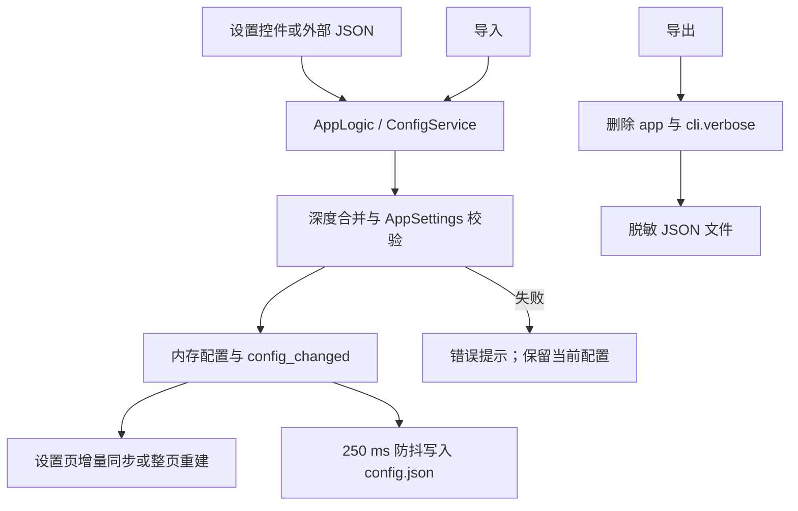

# 设置外壳、说明面板与配置导入导出

本页说明桌面端设置页如何组织分组、参数行和右侧说明，以及如何导出或导入设置 JSON。它不解释各检测、OCR、翻译、修复、排版、超分或上色参数的算法意义；这些内容分别见[设置页与配置生命周期](./index.md)及对应参数页。本页也不负责 API 凭据槽、预设管理、提示词列表或编辑器项目文件。

## 功能边界 {#feature-boundary}

- 设置页外壳由标题区、七个分组页签、可滚动参数列表、右侧说明面板组成；页首另有“导出配置”和“导入配置”。
- `settings_tab_layout.json` 当前定义 `General`、`OCR`、`Detection`、`Translation`、`Inpainting`、`Typesetting`、`Mode Specific` 七个页签。`Advanced`、`Replace Translation`、`Upscaling` 和 `Colorization` 是页签内分隔标题，不是独立页签。
- 动态设置代码会跳过内部状态、已由工作流选择器代替的字段和废弃字段；布局清单的 110 个条目中，Phase 0 统计为 109 个可见参数，不能把清单条目数当成屏幕行数。
- 配置导出只处理设置模型的 JSON 快照，并主动排除 `app` 临时状态和 `cli.verbose`；它不是 API 凭据或整个运行目录的备份。
- 配置导入把外部 JSON 深度合并到当前配置，保留当前 `app` 段，再由 `AppSettings` 校验；它不是导入 `.env`、提示词正文、翻译 JSON 或用户图片的功能。

## UI 操作 {#ui-operations}

### 设置页外壳与右侧说明 {#settings-shell}

1. 打开桌面端“设置”页面。页首显示标题和自动保存提示，右侧显示配置导入/导出按钮。
2. 选择一个分组页签。参数行按 `settings_tab_layout.json` 中的 `items` 顺序重建；分隔线只改变视觉分组。
3. 修改开关、输入框或下拉框。普通修改立即更新内存配置，随后由配置服务合并写盘；没有单独的“应用”按钮。
4. 点击参数行、标签或其控件，右侧“参数说明”面板会显示该行名称、格式化后的配置键和对应 `desc_<section>_<key>` 说明。没有说明时显示“暂无说明。”。
5. 可选数值输入框清空或输入无法解析的数字时，设置事件写入 `null`，由消费者解释为默认/自动语义；这不是把空字符串保存成数字。

### 文件编辑动作不是普通参数 {#file-edit-actions}

以下行仍显示在设置页，但其按钮打开资源编辑器或目录，不把文件内容塞进普通配置值：

| UI 调用 key | English 实际值 | 简体中文实际值 | 动作 |
| --- | --- | --- | --- |
| `Edit` | Edit | 编辑 | 打开固定 AI OCR、AI renderer 或 AI colorizer 提示词编辑器；也用于自定义 API 参数文件 |
| `btn_open_filter_list` | Open Filter List | 打开过滤列表 | 打开过滤列表编辑器 |
| `Open Directory` | Open Directory | 打开目录 | 字体行或提示词目录动作 |
| `label_ai_ocr_prompt_path` | AI OCR Prompt File | AI OCR 提示词文件 | 文件编辑动作/资源路径 |
| `label_ai_renderer_prompt_path` | AI Renderer Prompt File | AI 渲染提示词文件 | 文件编辑动作/资源路径 |
| `label_ai_colorizer_prompt_path` | AI Colorizer Prompt File | AI 上色提示词文件 | 文件编辑动作/资源路径 |

具体提示词格式和各自消费者留在提示词页面；本页只记录设置页的调用边界。

### 导出配置 {#export-config}

1. 点击“导出配置”（`Export Config`）。
2. 在系统保存文件对话框中选择位置；代码提供默认文件名 `manga_translator_config.json`，文件过滤器为 `JSON Files (*.json)`。
3. 取消对话框不会写文件，也不会弹成功提示。
4. 成功后显示“导出成功”和脱敏提示；失败显示“导出失败”及错误信息。

导出快照来自当前 `AppSettings.model_dump()`。导出前删除整个 `app` 段，并从 `cli` 删除 `verbose`；因此导出的 JSON 不含应用路径、收藏夹、当前预设等临时状态，也不包含 API Key。导出文件可能仍包含非凭据的流程参数，分享前应人工检查。

### 导入配置 {#import-config}

1. 点击“导入配置”（`Import Config`）。
2. 在系统打开文件对话框中选择 `JSON Files (*.json)` 文件；取消则不改变当前配置。
3. 文件按 UTF-8 JSON 读取，并将导入字典深度合并到当前配置。
4. 当前 `app` 段在合并后恢复，因此导入文件不能覆盖本机路径、主题、语言和其他应用临时状态。
5. `AppSettings.model_validate()` 成功后立即更新内存、请求保存并通知 UI；设置页可能整页重建，右侧说明、API 分组和提示词相关控件随之刷新。
6. 成功显示“导入成功”，并明确提示当前 API Key 和敏感信息已保留；解析、校验或保存异常显示“导入失败”。

代码没有为配置导入实现独立的“覆盖确认”对话框；导入是直接合并并保存。保存文件对话框是否由操作系统针对已有目标文件询问覆盖，当前仅静态核对，未作有头运行验证，不能写成应用保证的确认步骤。

## 选项中英对照 {#option-matrix}

| UI 调用 key / 存储值 | English | 简体中文 |
| --- | --- | --- |
| `Settings Page Title` | Settings | 参数设置 |
| `Settings Page Subtitle` | Adjust translation pipeline parameters. Changes are saved automatically. | 调整翻译流程的各项参数。修改后将自动保存。 |
| `Export Config` | Export Config | 导出配置 |
| `Import Config` | Import Config | 导入配置 |
| `Export Success` | Export Success | 导出成功 |
| `Export Failed` | Export Failed | 导出失败 |
| `Import Success` | Import Success | 导入成功 |
| `Import Failed` | Import Failed | 导入失败 |
| `Settings Desc Header` | Parameter Description | 参数说明 |
| `Settings Desc Placeholder` | Click any setting on the left to view details | 点击左侧任意设置项查看详细说明 |
| `Settings Desc Key` | Parameter Key: {config_key} | 参数键：{config_key} |
| `Settings Desc No Description` | No description available. | 暂无说明。 |
| `General` | General | 通用 |
| `OCR` | OCR | 文字识别 |
| `Detection` | Detection | 检测 |
| `Translation` | Translation | 翻译 |
| `Inpainting` | Inpainting | 修复 |
| `Typesetting` | Typesetting | 排版 |
| `Mode Specific` | Mode Specific | 模式相关 |
| `Advanced` | Advanced | 高级 |
| `Edit` | Edit | 编辑 |
| `Open Directory` | Open Directory | 打开目录 |
| `btn_open_filter_list` | Open Filter List | 打开过滤列表 |
| `Config exported successfully to:\n{path}\n\nNote: Sensitive information like API keys are not included.` | Config exported successfully to: … Note: Sensitive information like API keys are not included. | 配置已成功导出到：… 注意：API密钥等敏感信息未包含在导出文件中。 |
| `Config imported successfully!\n\nSource: {path}\n\nNote: Your API keys and sensitive information have been preserved.` | Config imported successfully! … Note: Your API keys and sensitive information have been preserved. | 配置已成功导入！… 注意：您的API密钥等敏感信息已保留，未被覆盖。 |
| `Error occurred while importing config:\n{error}\n\nPlease ensure the file format is correct.` | Error occurred while importing config: … Please ensure the file format is correct. | 导入配置时发生错误：… 请确保文件格式正确。 |

`{path}` 和 `{error}` 是运行时占位符；文档不展开实际路径或错误内容。布局页签的显示值来自 locale，完整参数枚举另见[选项与 i18n 矩阵](../../reference/options-i18n-matrix.md)。

## 运行机理 {#runtime-behavior}

普通设置事件通过控制器更新 `AppSettings`，并触发 UI 监听者。配置服务启动时按“用户配置 > 默认模板 > `AppSettings` 代码默认”加载；导入函数则从当前内存快照开始，深度合并外部键，恢复 `app` 后再进行一次完整 Pydantic 校验。未知键不会自动产生新的设置行；校验失败会进入错误反馈，不应把未经验证的外部 JSON 当作可信配置。

普通保存使用 250 ms 防抖、单线程写入器、临时文件和 `os.replace` 原子替换；显式文件保存会 flush。导入/导出按钮本身连接到 `AppLogic.export_config` 和 `AppLogic.import_config`，而不是直接让设置页读写文件。

## 依赖与冲突 {#dependencies-and-conflicts}

- 导入文件必须是可读取的 UTF-8 JSON；语法错误、类型错误或违反模型约束会使导入失败或让相关值回退到默认值。
- 导入不会更新 `.env`，也不会覆盖 `app` 段；API 凭据仍由 API 管理的 dotenv 边界维护。不得把导出的 JSON 当作凭据备份。
- 普通设置变更依赖 `AppSettings`、Pydantic 校验和配置写入器；程序退出或外部手改期间的待写快照可能覆盖手改内容。
- 选择功能提供商后 API 区域会刷新，这是功能配置联动，不是 API 候选槽轮换；具体轮换见 API 管理页面。
- 文件编辑动作依赖对应资源文件和编辑器；提示词编辑器、过滤列表编辑器、字体目录动作不是普通设置值。
- 导入成功后动态控件重建可能短暂刷新 API 组和说明面板；不要在重建过程中重复编辑同一行。

## 关联文件与格式 {#related-files-and-formats}

| 文件/格式 | 本页实际作用 | 手工编辑与兼容注意 |
| --- | --- | --- |
| `config/config.json` | 用户设置 JSON；启动时优先覆盖默认模板 | UTF-8；未知/无效字段可能被同步或回退；不要复制私有路径 |
| `config/config-example.json` | 默认/发行配置模板 | 与代码默认、Qt 默认可能不同 |
| `.env` | API Key、Base、Model 等敏感环境变量 | 本页不读写其真实值；不得截图或提交 |
| `config/custom_api_params.json` | `use_custom_api_params` 启用时的额外 API 请求参数 | 不承载凭据或设置页导入导出的普通字段 |
| `desktop_qt_ui/ui/main_page/settings_tab_layout.json` | 页签顺序、分隔线和参数键清单 | 修改布局会改变设置页外壳，必须同步 i18n/页面说明 |
| `dict/ai_ocr_prompt.yaml` | AI OCR 固定提示词编辑器的资源文件 | 只记录资源路径动作，正文格式见提示词页 |
| `dict/ai_renderer_prompt.yaml` | AI renderer 固定提示词编辑器的资源文件 | 与 OCR、上色提示词分开消费 |
| `dict/ai_colorizer_prompt.yaml` | AI colorizer 固定提示词编辑器的资源文件 | 与 OCR、renderer 提示词分开消费 |
| `config/filter_list.json` / `filter_list.txt` | 过滤列表编辑器关联文件 | 规则格式和应用阶段见 OCR/过滤页 |

导出 JSON 不包含 `app` 段和 `cli.verbose`，但仍可能包含流程参数；导入 JSON 也不应包含真实凭据、用户名、绝对私有路径、用户图片或私有提示词。`manga_translator_work/`、翻译 JSON/TXT、PSD/JSX 和调试图不属于本页导入/导出格式。

## 截图与流程图边界 {#visual-boundary}

本页 Mermaid 只表达外壳更新、导入校验和导出脱敏的数据流，不冒充运行截图。未来有头模式截图应至少覆盖：七个页签、中央滚动参数行、选中行与右侧说明（含配置键）、下拉显示值、三个提示词文件编辑动作、过滤列表/自定义 API 参数编辑动作、导出成功/失败、导入成功/失败、整页重建和已有目标文件情形。截图只能使用脱敏测试配置和公开样例；必须裁掉或替换用户名、绝对私有路径、密钥、令牌、用户图片和私有提示词。当前没有生成截图，系统文件对话框覆盖询问仍待运行确认。

## 源码依据 {#source-evidence}

| 层级 | 绝对路径 | 本页核对内容 |
| --- | --- | --- |
| 页面外壳 | `C:\\Users\\hgmzhn\\manga-image-translator\\manga-translator-ui-package\\desktop_qt_ui\\ui\\main_page\\pages\\settings_page.py` | 标题、导入/导出按钮、七页签容器、滚动参数区、右侧说明面板及信号连接 |
| 动态控件 | `C:\\Users\\hgmzhn\\manga-image-translator\\manga-translator-ui-package\\desktop_qt_ui\\ui\\main_page\\dynamic_settings.py` | 布局重建、控件类型、可选数值、文件编辑动作、行点击和配置绑定 |
| 布局 | `C:\\Users\\hgmzhn\\manga-image-translator\\manga-translator-ui-package\\desktop_qt_ui\\ui\\main_page\\settings_tab_layout.json` | 七个页签、参数键顺序和组内分隔线 |
| UI 刷新 | `C:\\Users\\hgmzhn\\manga-image-translator\\manga-translator-ui-package\\desktop_qt_ui\\ui\\main_page\\view.py` | 语言切换、右侧名称/配置键/说明刷新 |
| 导入/导出 | `C:\\Users\\hgmzhn\\manga-image-translator\\manga-translator-ui-package\\desktop_qt_ui\\app_logic.py` | 文件对话框、脱敏导出、保留 `app` 的导入深合并、成功/失败反馈 |
| 模型与校验 | `C:\\Users\\hgmzhn\\manga-image-translator\\manga-translator-ui-package\\desktop_qt_ui\\core\\config_models.py` | `AppSettings` 字段类型、默认值和 `layout_mode` 校验 |
| 持久化 | `C:\\Users\\hgmzhn\\manga-image-translator\\manga-translator-ui-package\\desktop_qt_ui\\services\\config_service.py` | 配置路径、优先级、逐键加载验证、250 ms 防抖、原子写入和 flush |
| i18n | `C:\\Users\\hgmzhn\\manga-image-translator\\manga-translator-ui-package\\desktop_qt_ui\\locales\\en_US.json` 与 `C:\\Users\\hgmzhn\\manga-image-translator\\manga-translator-ui-package\\desktop_qt_ui\\locales\\zh_CN.json` | 本页所有调用 key 的实际英文和简体中文值 |

## 安全审查 {#security-review}

- 未读取或展示本机 `.env`、用户 `config.json`、日志、任务产物、用户图片或私有提示词。
- 导出实现删除 `app` 和 `cli.verbose`，并在 UI 提示不包含 API Key；但分享导出文件前仍须检查流程配置是否含内部地址或其他敏感元数据。
- 导入会执行 JSON 解析、深度合并和 Pydantic 校验；未知键不渲染为控件。只从可信来源导入，避免将不明文件误认为配置。
- 本页源码依据使用仓库相对文件名与脱敏占位符；未写入真实密钥、token、用户名、私有绝对路径、用户图片或私有提示词。

## 验证记录 {#verification}

| 验证内容 | 状态 | 说明 |
| --- | --- | --- |
| 设置外壳、分组、参数行和右侧说明源码 | 完成 | 静态核对页面外壳、动态控件、布局和 view |
| UI 调用 key → English → 简体中文 | 完成 | 已核对 `en_US.json` 与 `zh_CN.json`；占位符仅保留 `{path}`、`{error}`、`{config_key}` |
| 导入/导出逻辑、校验、保留字段和持久化 | 完成 | 静态核对 `AppLogic`、`ConfigService`、`AppSettings` |
| 有头 UI、文件对话框覆盖询问和实际写盘 | 待运行 | 当前不伪造截图或运行结论 |
| Mermaid、路由镜像、标题/锚点和源码字段检查 | 待站点统一验收 | 本页已提供同构标题、显式锚点和源码表 |
| VitePress 生产构建 | 待执行 | 后续运行静态构建命令；不作为本页正文内容阻塞 |
| 敏感信息审查 | 完成 | 未发现密钥、token、用户名、私有绝对路径、用户图片或私有提示词 |
