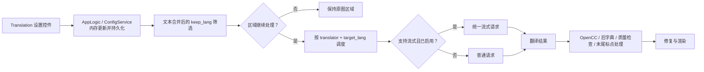

# 翻译设置

## 功能边界 {#feature-boundary}

此页只覆盖“Translation”设置页的 11 行：翻译器、目标/保留语言、流式传输、术语提取、RPM、上下文和可见的译后处理开关。它说明这些值怎样进入桌面配置和核心翻译阶段。

它不替代[翻译器选择与语言](../translator/selection-and-languages.md)的实现选择、[上下文与提示词](../translator/context-and-prompts.md)的提示词内容，或 API 管理页的密钥、模型、候选槽和轮换。`translator_chain`、`skip_lang`、高质量提示词路径及译后质量检查是核心/API 或 CLI 可接受的字段，但不是当前设置布局的行，故不把它们伪写成此页控件。

## UI 操作 {#ui-operations}

打开“设置”，选择“Translation”。下拉框直接选择存储值；开关和数字编辑器改变后，`AppLogic.update_single_config()` 立即更新内存配置并写入配置文件。更改“翻译器”还会更新桌面翻译服务的当前实现，更改“目标语言”会更新其当前目标语言。其余行由后续任务实际读取完整配置时生效。

1. 选择“翻译器”和“目标语言”；需要仅继续处理某种识别源语言时设置“保留源语言”，否则选“不过滤”。
2. 为支持的 OpenAI/Gemini 实现选择是否“启用流式传输”；用“每分钟最大请求数”限制请求速率，`0` 表示不限速。
3. 只有配套高质量提示词资源可用时才启用“自动提取新术语”。“不跳过目标语言文本”会强制翻译看似已是目标语言的结果。
4. 按项目需要启用末尾标点移除或单向简繁转换；“上下文大小”位于同一页，但存储在 `cli.context_size`。

### UI 调用与实际文案 {#ui-i18n}

| UI 调用 key | English 实际值 | 简体中文实际值 |
| --- | --- | --- |
| `label_translator` | Translator | 翻译器 |
| `label_target_lang` | Target Language | 目标语言 |
| `label_keep_lang` | Keep Source Language | 保留源语言 |
| `label_enable_streaming` | Enable Streaming | 启用流式传输 |
| `label_no_text_lang_skip` | Don't Skip Target Lang | 不跳过目标语言文本 |
| `label_extract_glossary` | Auto Extract Glossary | 自动提取新术语 |
| `label_remove_trailing_period` | Auto Remove Final Period/Comma | 自动移除末尾句号逗号 |
| `label_convert_to_traditional` | Convert to Traditional Chinese | 简体转繁体 |
| `label_convert_to_simplified` | Convert to Simplified Chinese | 繁体转简体 |
| `label_context_size` | Context Size | 上下文大小 |
| `label_max_requests_per_minute` | Max Requests Per Minute | 每分钟最大请求数 |
| `lang_filter_disabled` | No Filter | 不过滤 |

### 枚举与全部选项 {#option-matrix}

| 存储值 | English | 简体中文 | 用于 |
| --- | --- | --- | --- |
| `openai` | OpenAI | OpenAI | `translator.translator` |
| `openai_hq` | OpenAI High Quality | OpenAI高质量翻译 | `translator.translator` |
| `gemini` | Google Gemini | Google Gemini | `translator.translator` |
| `gemini_hq` | Gemini High Quality | Gemini高质量翻译 | `translator.translator` |
| `sakura` | Sakura | Sakura | `translator.translator` |
| `none` | None | 无 | `translator.translator` |
| `original` | Original | 原文 | `translator.translator` |
| `CHS`, `CHT`, `CSY`, `NLD`, `ENG`, `FRA`, `DEU`, `HUN`, `ITA`, `JPN`, `KOR`, `POL`, `PTB`, `ROM`, `RUS`, `ESP`, `TRK`, `UKR`, `VIN`, `ARA`, `SRP`, `HRV`, `THA`, `IND`, `FIL` | Simplified Chinese; Traditional Chinese; Czech; Dutch; English; French; German; Hungarian; Italian; Japanese; Korean; Polish; Portuguese (Brazil); Romanian; Russian; Spanish; Turkish; Ukrainian; Vietnamese; Arabic; Serbian; Croatian; Thai; Indonesian; Filipino (Tagalog) | 简体中文；繁体中文；捷克语；荷兰语；英语；法语；德语；匈牙利语；意大利语；日语；韩语；波兰语；葡萄牙语（巴西）；罗马尼亚语；俄语；西班牙语；土耳其语；乌克兰语；越南语；阿拉伯语；塞尔维亚语；克罗地亚语；泰语；印度尼西亚语；菲律宾语（他加禄语） | `translator.target_lang` |
| `none` 及 `KEEP_LANGUAGES` 提供的语言代码 | No Filter；对应语言名 | 不过滤；对应语言名 | `translator.keep_lang` |
| `true`, `false` | enabled, disabled | 启用，关闭 | 所有本页布尔开关 |
| 非负整数；`0` | request count; no limit | 请求数；不限制 | `translator.max_requests_per_minute` |
| 非负整数；`0` | page count; no history | 页数；不使用历史 | `cli.context_size` |

## 参数 {#parameters}

#### `translator.translator` — 翻译器 / Translator {#translator-translator}

- 控件与值：下拉框；全部枚举见上表。
- 默认值：核心 `openai_hq`；Qt UI `openai_hq`；发行示例 `openai`。
- 生效阶段与消费者：翻译；`TranslatorConfig.translator_gen` 或桌面 `TranslationService` 构造 `TranslatorChain`，实际调度器执行所选实现。
- 依赖与冲突：在线实现需要其 API 组；`none`/`original`不进行通常的在线翻译。它选择实现，不是 API 槽轮换，也不是 `translator_chain`。
- 图示：需要，选择会进入不同实现。

#### `translator.target_lang` — 目标语言 / Target Language {#translator-target-lang}

- 控件与值：下拉框；25 个代码和显示值见上表。
- 默认值：核心 `ENG`；Qt UI `CHS`；发行示例 `CHS`。
- 生效阶段与消费者：翻译；桌面即时调用 `set_target_language`，核心以该代码创建翻译器链并传入提示词和请求。
- 依赖与冲突：语言代码必须是服务支持的语言；与简繁转换组合时，转换发生在翻译结果之后。
- 图示：需要，改变翻译请求的目标语言及后续输出。

#### `translator.keep_lang` — 保留源语言 / Keep Source Language {#translator-keep-lang}

- 控件与值：下拉框；`none`/“不过滤”及 `KEEP_LANGUAGES` 语言代码。
- 默认值：核心、Qt UI、发行示例均为 `none`。
- 生效阶段与消费者：文本行合并后；`_run_textline_merge()` 对合并区域作语言筛选，不匹配的区域不修复、不翻译、不渲染。
- 依赖与冲突：依赖语言识别；不要与不可见的 `skip_lang` 混淆：后者在合并前删除 OCR 文本行。
- 图示：需要，改变哪些区域进入后续阶段。

#### `translator.enable_streaming` — 启用流式传输 / Enable Streaming {#translator-enable-streaming}

- 控件与值：开关；`true` 或 `false`。
- 默认值：核心、Qt UI均为 `true`；发行示例为 `false`。
- 生效阶段与消费者：在线翻译请求；翻译器公共 `parse_args()` 设置 `_enable_streaming`，支持的 OpenAI/Gemini（含 HQ）选择统一流式或普通请求传输。
- 依赖与冲突：仅支持该传输的实现有实际差异；它不等于开发者 HTTP API 的流帧协议。
- 图示：需要，改变请求传输分支。

#### `translator.no_text_lang_skip` — 不跳过目标语言文本 / Don't Skip Target Lang {#translator-no-text-lang-skip}

- 控件与值：开关；`true` 强制翻译，`false` 可保留与目标语言相同的文本。
- 默认值：核心、Qt UI、发行示例均为 `false`。
- 生效阶段与消费者：翻译；`_should_skip_identical_translation()` 比较原文和译文的纯文本。
- 依赖与冲突：开启会增加请求和成本；不是 `keep_lang` 的区域筛选。
- 图示：不需要：仅反转单一的相同文本跳过判定。

#### `translator.extract_glossary` — 自动提取新术语 / Auto Extract Glossary {#translator-extract-glossary}

- 控件与值：开关；`true` 或 `false`。
- 默认值：核心、Qt UI、发行示例均为 `false`。
- 生效阶段与消费者：高质量 OpenAI/Gemini 请求和响应解析；只有自定义高质量提示词已加载时才请求、解析 `new_terms`。
- 依赖与冲突：依赖高质量提示词资源；此页的开关不编辑提示词、不展示提示词内容，文件格式归属提示词页面。
- 图示：需要，资源缺失时不启用术语提取分支。

#### `translator.max_requests_per_minute` — 每分钟最大请求数 / Max Requests Per Minute {#translator-max-requests-per-minute}

- 控件与值：非负整数；`0` 为不限速。
- 默认值：核心、Qt UI、发行示例均为 `0`。
- 生效阶段与消费者：在线翻译；OpenAI/Gemini 翻译器在 `parse_args()` 设置每分钟请求上限。
- 依赖与冲突：用于主动降低限流概率；不处理服务端 429、重试次数或 API 候选切换。
- 图示：需要，`0` 和正数走不同的节流策略。

#### `translator.remove_trailing_period` — 自动移除末尾句号逗号 / Auto Remove Final Period/Comma {#translator-remove-trailing-period}

- 控件与值：开关；`true` 或 `false`。
- 默认值：核心、Qt UI为 `false`；发行示例为 `true`。
- 生效阶段与消费者：译后处理；仅当原文无末尾标点时，`remove_trailing_period_if_needed()` 去除译文末尾单个可移除句号/逗号，保留空白和闭合符号，不删除连续标点。
- 依赖与冲突：发生在术语/字典处理和可选质量检查之后；与渲染断句无关。
- 图示：不需要：单一尾字符条件处理。

#### `cli.context_size` — 上下文大小 / Context Size {#cli-context-size}

- 控件与值：非负整数；`0` 表示不使用历史。
- 默认值：核心、Qt UI、发行示例均为 `3`。
- 生效阶段与消费者：翻译；`_build_prev_context()` 从当前页之前最近的非空已译页面最多取该数目，构造成 user/assistant 历史轮次；OpenAI/Gemini 将其作为独立历史消息注入。
- 依赖与冲突：增加请求上下文和成本；空页不计入；不是 `batch_size`，也不保证并发页面可作为历史。
- 图示：需要，改变历史页筛选与消息构建。

#### `translator.convert_to_traditional` / `translator.convert_to_simplified` — 简体转繁体 / 繁体转简体 {#translator-chinese-conversion}

- 控件与值：两个开关；`true` 或 `false`。
- 默认值：核心、Qt UI、发行示例均为 `false`。
- 生效阶段与消费者：译后处理；任一为真时 `_apply_post_translation_processing()` 使用 OpenCC。两者同时为真时核心优先执行 `convert_to_traditional` 的 `s2twp`，否则执行 `t2s`。
- 依赖与冲突：需要 `opencc-python-reimplemented`；缺失时记录警告并跳过。先选目标语言，之后才作转换，避免把它当成目标语言选择器。
- 图示：需要，双开关具有优先顺序。

## 运行机理 {#runtime-behavior}

`context_size` 在请求前额外把最近非空历史页组成独立消息；`extract_glossary` 只在自定义高质量提示词存在时请求额外术语结果。核心固定的译后流程还包含括号/引号处理、后置字典、可选的质量检查及本页末尾标点处理；其中质量检查字段没有列在本 UI 布局中。

## 关联文件与格式 {#related-files-and-formats}

- `config/config.json`：持久化本页设置；导入覆盖和未知键规则见设置外壳页。不要公开真实用户配置或绝对路径。
- `config/config-example.json`：发行示例，提供独立于核心/UI 的默认值证据。
- `dict/prompt_example.yaml`：发行示例为高质量提示词资源路径；术语/提示词结构归属提示词页面。本页不展示提示词正文。
- 没有本页参数直接定义 API 密钥、模型、Base URL 或 API 槽；这些属于 API 管理页面。

## 源码依据 {#source-evidence}

| 层级 | 文件 | 核对内容 |
| --- | --- | --- |
| 设置布局 | `desktop_qt_ui/ui/main_page/settings_tab_layout.json` | Translation 页 11 个实际行 |
| UI 映射与保存 | `desktop_qt_ui/app_logic.py` | i18n labels、即时翻译器/目标语言更新、保存 |
| Qt 默认 | `desktop_qt_ui/core/config_models.py` | `TranslatorSettings` 与 `CliSettings.context_size` |
| i18n | `desktop_qt_ui/locales/en_US.json`、`zh_CN.json` | 本页 key 和实际双语值 |
| 核心定义 | `manga_translator/config.py` | `TranslatorConfig`、`Translator`、`CliConfig` 默认和链边界 |
| 调度与处理 | `manga_translator/manga_translator.py`、`manga_translator/translators/common.py` | 筛选、上下文、流式开关、译后处理 |
| 发行默认 | `config/config-example.json` | 发布示例配置 |

## 验证记录 {#verification}

| 验证内容 | 状态 | 说明 |
| --- | --- | --- |
| 布局、配置、消费者和 i18n | 完成 | 静态源码与 `en_US`/`zh_CN` 实际值已逐项核对 |
| 运行态：流式、API 限速、术语和上下文 | 待确认 | 需要脱敏测试凭据和可控请求；不展示密钥、提示词或用户数据 |
| VitePress 构建 | 完成 | 本次页面修改后通过 `npm run docs:build --prefix doc/wiki` |
| 敏感信息审查 | 完成 | 未记录真实密钥、用户配置、私有路径、图片或提示词 |
