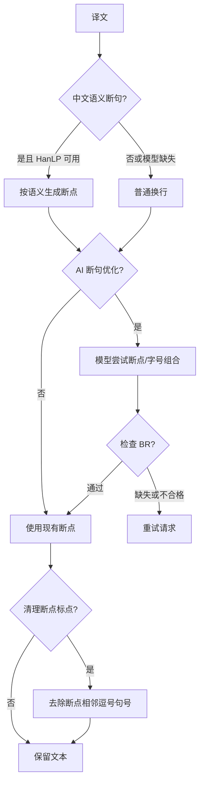
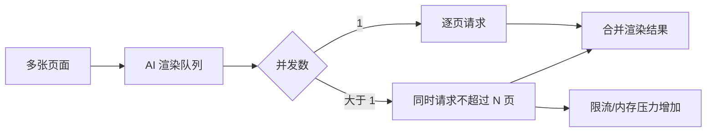
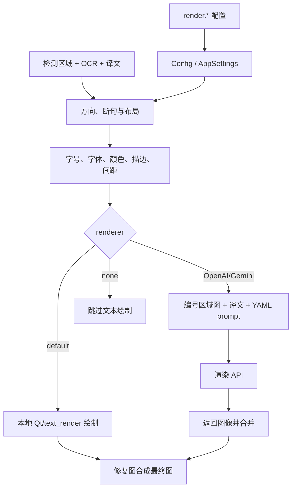

# 排版与渲染

本页覆盖设置页签“Typesetting”中的 `render.*` 参数，以及“Mode Specific”中的直接粘贴参数。它们决定译文在文本区域中的断句、字号、方向、颜色、描边和最终绘制方式；检测、OCR、翻译内容本身和图像修复分别见对应设置页。本页不记录 API 凭据，只说明 AI 渲染如何消费已配置的渲染 API。

## 在设置页操作

打开“设置”→“Typesetting”。动态设置行左侧显示字段标签，右侧是下拉框、复选框、数字/文本输入或“Edit”文件编辑动作；右侧说明面板显示当前字段的描述。修改后立即更新内存配置，`render.*` 变化会发出渲染设置变更信号，让编辑器刷新；配置服务随后写入配置文件。选择 `openai_renderer` 或 `gemini_renderer` 时，开始翻译前必须在 API 管理中配置对应功能的候选连接。

“字体”下拉框同时枚举操作系统字体和项目 `fonts/` 目录中的 `.ttf`、`.otf`、`.ttc` 文件。将字体文件放入该目录后重新打开下拉框刷新。AI 渲染提示词是文件编辑动作：点击“Edit”直接编辑固定 YAML 文件，不应当把路径当成普通渲染枚举值。

## UI 调用 key 与实际文案

下表保留界面调用 key，并以 locale 文件中的实际值为准。renderer 和字体列表中的若干显示值由 `app_logic.py` 硬编码映射，因此明确标为“代码映射（无 locale key）”。

| UI 调用 key | English 实际值 | 简体中文实际值 |
| --- | --- | --- |
| `label_renderer` | Renderer | 渲染器 |
| `label_font_family` | Font | 字体 |
| `label_ai_renderer_prompt_path` | AI Renderer Prompt | AI 渲染提示词 |
| `label_ai_renderer_concurrency` | AI Renderer Concurrency | AI 渲染并发数 |
| `label_alignment` | Alignment | 对齐方式 |
| `label_direction` | Text Direction | 文本方向 |
| `label_layout_mode` | Layout Mode | 排版模式 |
| `label_semantic_linebreak` | Chinese Semantic Line Break | 中文语义断句 |
| `label_disable_auto_wrap` | AI Line Breaking | AI 断句 |
| `label_optimize_line_breaks` | AI Line Break Auto Enlarge | AI断句自动扩大文字 |
| `label_check_br_and_retry` | AI Line Break Check | AI 断句检查 |
| `label_strict_smart_scaling` | Don't Expand Box on Auto Enlarge | 自动扩大文字时不扩展文本框 |
| `label_remove_linebreak_punctuation` | Trim Around Line Breaks | 去除换行符周围逗号句号 |
| `label_disable_font_border` | Disable Font Border | 禁用字体边框 |
| `label_stroke_width` | Stroke Width Ratio | 描边宽度比例 |
| `label_center_text_in_bubble` | Center in Bubble | 气泡内居中 |
| `label_font_size_offset` | Font Size Offset | 字体大小偏移量 |
| `label_font_size_minimum` | Minimum Font Size | 最小字体大小 |
| `label_max_font_size` | Maximum Font Size | 最大字体大小 |
| `label_font_scale_ratio` | Font Scale Ratio | 字体缩放比例 |
| `label_font_color` | Font Color | 字体颜色 |
| `label_line_spacing` | Line Spacing | 行间距 |
| `label_letter_spacing` | Letter Spacing | 字间距 |
| `label_font_size` | Font Size | 字体大小 |
| `label_uppercase` | Uppercase | 大写 |
| `label_lowercase` | Lowercase | 小写 |
| `label_no_hyphenation` | Disable Hyphenation | 禁用连字符 |
| `label_bubble_layout_english` | Bubble Layout (Force Horizontal) | 根据气泡排版(强制横排) |
| `label_rtl` | Right to Left | 从右到左 |
| `label_enable_template_alignment` | Enable Direct Paste Mode | 启用直接粘贴模式 |
| `label_paste_mask_dilation_pixels` | Paste Mode Mask Dilation Pixels | 粘贴模式蒙版膨胀像素 |
| `alignment_auto`（代码映射） | Auto | 自动 |
| `alignment_left`（代码映射） | Left | 左对齐 |
| `alignment_center`（代码映射） | Center | 居中 |
| `alignment_right`（代码映射） | Right | 右对齐 |
| `direction_auto`（代码映射） | Auto | 自动 |
| `direction_horizontal`（代码映射） | Horizontal | 横排 |
| `direction_vertical`（代码映射） | Vertical | 竖排 |
| `layout_mode_smart_scaling`（代码映射） | Smart Scaling | 智能缩放 |
| `layout_mode_strict`（代码映射） | Strict Boundary | 严格边界 |
| `layout_mode_balloon_fill`（代码映射） | Smart Bubble | 智能气泡 |
| renderer 映射（代码硬编码） | Default / OpenAI Renderer / Gemini Renderer / None | Default / OpenAI Renderer / Gemini Renderer / 不翻译 |

## 选项矩阵

| 配置键 | 存储值 | English | 简体中文 | 控件与适用条件 |
| --- | --- | --- | --- | --- |
| `render.renderer` | `default` | Default | Default | 本地 Qt 渲染 |
|  | `openai_renderer` | OpenAI Renderer | OpenAI Renderer | 需要 OpenAI 渲染 API |
|  | `gemini_renderer` | Gemini Renderer | Gemini Renderer | 需要 Gemini 渲染 API |
|  | `none` | None | 不翻译 | 跳过文本渲染 |
| `render.alignment` | `auto` / `left` / `center` / `right` | Auto / Left / Center / Right | 自动 / 左对齐 / 居中 / 右对齐 | 下拉；横排对齐 |
| `render.direction` | `auto` / `h` / `v` | Auto / Horizontal / Vertical | 自动 / 横排 / 竖排 | 下拉；覆盖方向检测 |
| `render.layout_mode` | `smart_scaling` / `strict` / `balloon_fill` | Smart Scaling / Strict Boundary / Smart Bubble | 智能缩放 / 严格边界 / 智能气泡 | 下拉；决定文本框适配算法 |
| 布尔参数 | `true` / `false` | Enabled / Disabled | 开启 / 关闭 | 见逐参数锚点；没有第三个隐式值 |
| `render.font_color` | 空、`RRGGBB` 或 `RRGGBB:RRGGBB` | Auto / explicit foreground (and optional background) | 自动 / 指定前景色（可选背景色） | 文本输入；不得填写敏感内容 |
| `render.line_spacing`, `letter_spacing` | `0.1`–`5.0` | multiplier | 倍率 | 数字输入，默认 1.0 |
| `render.font_size` | 空或正整数 | Auto / fixed size | 自动 / 固定大小 | 空值才启用自动字号 |
| `render.font_size_offset` | 整数 | signed offset | 有符号偏移 | 自动字号的增减 |
| `render.font_size_minimum`, `max_font_size` | `0` 或正整数 | limit (`0` means implementation-specific default/no upper limit) | 限制（`0` 为实现默认/无上限） | 与自动字号共同生效 |
| `render.font_scale_ratio` | 正浮点数 | scale ratio | 缩放倍率 | 自动布局前的整体倍率 |
| `render.stroke_width` | `0.0`–`1.0` | stroke ratio | 描边比例 | 0 关闭描边；常用默认 0.07 |
| `render.ai_renderer_concurrency` | 正整数 | maximum concurrent requests | 最大并发请求数 | 仅 OpenAI/Gemini/Vertex 渲染 |
| `render.ai_renderer_prompt_path` | 文件路径 | fixed YAML prompt file | 固定 YAML 提示词文件 | Edit 文件动作；AI 渲染时读取 |

## 参数逐项说明

以下每个参数都有独立锚点。默认值按三层分开：核心 `manga_translator/config.py`、Qt `RenderSettings`、发行示例 `config/config-example.json`。发行示例不是用户私有配置，也不代表已保存配置。

#### `render.renderer` — 渲染器 / Renderer

- 控件：下拉框；消费者：`manga_translator.manga_translator` 的排版阶段或 AI renderer provider。
- 默认值：核心 `default`；Qt `default`；发行示例 `default`。
- 生效阶段：排版/渲染；`none` 跳过渲染。
- 依赖与冲突：两个 API renderer 需要对应 API 候选；本地 `default` 不需要网络。它不是翻译器选择，也不参与 API 槽轮换。
- 机理：选择实现后，文本区域和译文进入本地绘制或模型图像请求；模板直接粘贴模式另有工作流限制。
- 源码依据：`manga_translator/config.py` 的 `Renderer`；`manga_translator/manga_translator.py`；`desktop_qt_ui/app_logic.py` renderer 映射与保存。

#### `render.font_family` — 字体 / Font

- 控件：字体下拉框；存储值：字体家族名或空字符串。
- 默认值：核心 `None`；Qt 空字符串；发行示例 `Microsoft YaHei UI`（发行配置可按平台调整）。
- 生效阶段：排版/渲染及可编辑 PSD 文本层；消费者：Qt text renderer、PSD 导出。
- 依赖与冲突：字体必须可由系统或 `fonts/` 目录找到；缺字形会导致回退字体或显示差异。字体文件本身可能受许可证约束。
- 关联格式：`fonts/*.ttf|*.otf|*.ttc`；只写公开字体名，不写用户路径。
- 源码依据：`desktop_qt_ui/app_logic.py` 字体列表；`manga_translator/config.py`；`desktop_qt_ui/locales/*` 描述。

#### `render.alignment` — 对齐方式 / Alignment

- 存储值/全部选项：`auto|left|center|right` → Auto/Left/Center/Right → 自动/左对齐/居中/右对齐。
- 默认值：核心/Qt/发行均 `auto`；生效：排版；消费者：`manga_translator.rendering` 文本布局。
- 原理：`auto` 根据区域与方向推断，其余值直接约束横排文本的水平对齐；不改变翻译内容。
- 依赖与冲突：竖排主要由方向和列布局控制，不能把对齐当作方向开关。
- 源码依据：`config.py` `Alignment`；`app_logic.py:get_display_mapping`；`locales/en_US.json`、`zh_CN.json`。

#### `render.direction` — 文本方向 / Text Direction

- 存储值/全部选项：`auto|h|v` → Auto/Horizontal/Vertical → 自动/横排/竖排。
- 默认值：核心/Qt/发行均 `auto`；生效：排版断句、文本绘制、区域排序；消费者：renderer/text_render。
- 原理：自动值使用区域/语言判断，`h` 与 `v` 强制横/竖排；方向会改变换行轴、字距和对齐解释。
- 依赖与冲突：`bubble_layout_english=true` 会强制横排；RTL 是阅读顺序，不等于竖排。
- 源码依据：`config.py` `Direction`；`rendering/__init__.py`；i18n 实际值。

#### `render.layout_mode` — 排版模式 / Layout Mode

- 存储值/全部选项：`smart_scaling|strict|balloon_fill` → Smart Scaling/Strict Boundary/Smart Bubble → 智能缩放/严格边界/智能气泡。
- 默认值：核心/Qt `smart_scaling`；发行示例 `balloon_fill`。核心 validator 拒绝其他值。
- 生效阶段：排版字号与换行；消费者：文本布局算法。
- 原理：`smart_scaling` 在可读性与区域适配间缩放；`strict` 不越过区域边界；`balloon_fill` 按气泡形状填充。
- 依赖与冲突：固定 `font_size`、`max_font_size`、`strict_smart_scaling` 会进一步限制可用字号；复杂背景不会由此改变修复阶段。
- 源码依据：`config.py:VALID_LAYOUT_MODES` 和 validator；`config_models.py`；发行示例。

#### `render.font_color` — 字体颜色 / Font Color

- 存储值/全部选项：空（自动）、`RRGGBB`（前景）、`RRGGBB:RRGGBB`（前景:背景）。UI locale 描述举例使用带 `#` 的写法，但核心解析会去除 `#`。
- 默认值：核心/Qt/发行均空或 `null`；生效：排版；消费者：字体颜色解析和绘制。
- 原理：空值采用 OCR/区域颜色检测；显式颜色覆盖检测结果，冒号后的值提供背景色。
- 依赖与冲突：非法十六进制值会在配置/绘制时失败；不要把 API Key 或私有文本放进颜色字段。
- 源码依据：`config.py` `font_color_fg/font_color_bg`；`config_models.py`；`locales/*`。

#### `render.stroke_width` / `render.disable_font_border` — 描边 / Stroke

- 存储值：描边比例 `0.0–1.0`；开关 `true|false`。默认核心/Qt/发行分别 `0.07/0.07/0.07` 与 `false/false/false`。
- 生效：排版绘制；消费者：text renderer。比例相对字体大小；0 或禁用开关会去除边框。
- 依赖与冲突：描边过大会侵入邻近字形；禁用开关优先于比例。图示：不需要，两个值只改变绘制外沿，不改变阶段。
- 源码依据：`config.py` 字段说明；`config_models.py`；`desc_render_stroke_width` 与 `desc_render_disable_font_border`。

#### `render.font_size`, `font_size_offset`, `font_size_minimum`, `max_font_size`, `font_scale_ratio` — 字号 / Font Size

- 存储值/全部选项：固定字号为空或正整数；偏移为整数；下限/上限为 `0` 或正整数；倍率为正浮点数。
- 默认值：核心：`font_size=null`、offset `0`、minimum `-1`（按图片尺寸推导）、max `0`（无限制）、ratio `1.0`；Qt：`null/0/0/0/1.0`；发行示例：`null/0/0/0/1.0`。
- 生效：排版自动测量与布局；消费者：`text_render` 测量、换行和绘制。
- 原理：固定字号跳过自动字号；否则先计算区域可容纳字号，应用 offset 与 scale ratio，再受 minimum/max 限制。`max_font_size=0` 表示无上限；Qt 的 minimum=0 与核心 `-1` 是默认来源差异。
- 依赖与冲突：AI 自动扩大、严格模式和禁用自动换行会改变搜索空间；过小下限可能溢出，过大固定值可能裁切。
- 源码依据：`config.py:RenderConfig`；`config_models.py:RenderSettings`；`rendering/__init__.py`。

#### `render.line_spacing` / `render.letter_spacing` — 行距与字距 / Spacing

- 存储值/全部选项：可空或 `0.1–5.0` 浮点倍率；默认核心/Qt/发行均 `1.0`（核心空值由 renderer 使用默认倍率）。
- 生效：排版测量与绘制；消费者：`calc_text_block_dimensions`、横排/竖排 text_render。
- 原理：行距影响行/列基线间距，字距影响 glyph advance；横排和竖排使用不同基础间距。空值回退 renderer 默认。
- 依赖与冲突：固定字号、方向和断句共同决定最终占用；极端倍率可能使文本超出区域。图示：不需要，连续倍率只改变几何量。
- 源码依据：`config.py` 字段注释；`manga_translator/rendering/__init__.py`；`rendering/text_render.py`。

#### `render.semantic_linebreak`, `disable_auto_wrap`, `optimize_line_breaks`, `strict_smart_scaling`, `check_br_and_retry`, `remove_linebreak_punctuation`, `no_hyphenation` — 断句 / Line Breaking

- 存储值/全部选项：每项 `true|false`；核心默认依次 `false/false/false/false/false/false/false`，Qt 默认 `false/true/false/false/false/false/false`，发行示例与核心相同。
- 生效阶段：翻译结果清理后、排版换行和 AI 请求；消费者：`rendering/chinese_linebreak.py`、renderer、翻译器重试层。
- 原理：`semantic_linebreak` 对中文使用本地 HanLP 按语义插入断点，缺模型或非中文回退普通换行；`disable_auto_wrap` 禁用 renderer 自动换行（AI 断句时推荐开启）；`optimize_line_breaks` 搜索断句组合并调整字号；`strict_smart_scaling` 禁止扩大文本框，只缩小字号；`check_br_and_retry` 检查 AI 是否产生 `[BR]` 并在缺失时重试；`remove_linebreak_punctuation` 清理断点相邻逗号/句号；`no_hyphenation` 禁止英文单词以连字符拆分。
- 依赖与冲突：AI 优化依赖 OpenAI/Gemini 翻译器；检查重试可能循环，应谨慎使用；语义断句依赖本地 HanLP 模型。`[BR]` 是文本协议标记，不是提示词密钥。
- 图示：断句开关会改变阶段，见下方 Mermaid。
- 源码依据：`config.py` 字段 docstring；`rendering/chinese_linebreak.py`；`desktop_qt_ui/locales/*`。

#### `render.uppercase` / `render.lowercase` — 大小写 / Case

- 存储值/全部选项：`true|false`；默认核心/Qt/发行均关闭。
- 生效：排版前文本规范化；消费者：renderer。两个开关同时开启时属于冲突配置，最终行为依实现顺序，不应同时启用。
- 依赖：只对有大小写概念的文字有效；中文等文字无变化。图示：不需要，单纯文本变换。
- 源码依据：`config.py`、`config_models.py`、locale 描述。

#### `render.bubble_layout_english` / `render.center_text_in_bubble` — 气泡布局 / Bubble Layout

- 存储值/全部选项：各 `true|false`；默认核心/Qt/发行均关闭。
- 生效：气泡内排版；消费者：bubble layout 与 renderer。
- 原理：`bubble_layout_english` 对所有语言启用气泡形状布局并强制横排；`center_text_in_bubble` 将文本块在气泡内居中。英文的发行行为可由发行配置另行覆盖。
- 依赖与冲突：与 `direction=v` 冲突时强制横排开关优先；气泡检测/蒙版需已有有效区域。
- 源码依据：`config.py` docstring；`locales/*` 描述；配置模型。

#### `render.rtl` — 从右到左 / Right to Left

- 存储值/全部选项：`true|false`；默认核心/Qt/发行均 `true`。
- 生效：排版区域排序和阅读顺序；消费者：renderer 的 RTL 排序逻辑。
- 原理：控制阿拉伯语、希伯来语等文本的从右到左顺序；不等同于 `direction=v`，也不改变字形方向。
- 依赖与冲突：应按语言和阅读顺序设置；横排/竖排仍由 direction 决定。图示：不需要，改变排序而非阶段。
- 源码依据：`config.py`、`config_models.py`、`desc_render_rtl`。

#### `render.ai_renderer_prompt_path` — AI 渲染提示词 / AI Renderer Prompt

- 控件：文件编辑动作；存储值：YAML 文件路径；默认值：核心/Qt/发行均由应用提示词路径解析（不在此写私有绝对路径）。
- 生效：AI 渲染请求构造；消费者：`rendering/model_api_renderer.py` 及 OpenAI/Gemini provider。
- 原理：读取固定 YAML，再自动组合编号文本框图像和每个区域的译文；不是通用翻译提示词，也不是 API 密钥。
- 依赖与冲突：仅 AI renderer 使用；YAML 格式错误或文件不存在会使请求失败。文件内容不得包含真实密钥、令牌、用户名、用户图片或私有提示词。
- 关联格式：`dict/ai_renderer_prompt.yaml`；按源码约定保存编码和字段。
- 源码依据：`desktop_qt_ui/app_logic.py` 路径动作；`locales/*:desc_render_ai_renderer_prompt_path`；`model_api_renderer.py`。

#### `render.ai_renderer_concurrency` — AI 渲染并发数 / AI Renderer Concurrency

- 存储值/全部选项：正整数（实现将小于 1 的值钳制为 1）；默认核心/Qt/发行均 `1`。
- 生效：批处理的 AI 渲染请求队列；消费者：`model_api_renderer.py`。
- 原理：限制同时处理页面的 API 请求数，不改变单页文本框数量或 renderer 选择；1 为串行，较大值提高吞吐并增加网络、API 限流、显存/内存压力。
- 依赖与冲突：仅 OpenAI/Gemini/Vertex renderer 生效；无 API renderer 时不产生请求。特殊工作流仍可能按工作流限制并发。
- 图示：并发会改变队列状态，见下方 Mermaid。
- 源码依据：`config.py`；`desktop_qt_ui/core/config_models.py`；`rendering/model_api_renderer.py`；locale 描述。

#### `render.enable_template_alignment` / `paste_mask_dilation_pixels` — 直接粘贴 / Direct Paste

- 存储值/全部选项：开关 `true|false`；膨胀像素为非负整数。默认核心/Qt/发行：`false` 与 `10`。
- 生效阶段：仅 Replace Translation 工作流的排版/导出；消费者：模板匹配粘贴实现。
- 原理：按坐标匹配从翻译图裁剪区域并粘贴到原图，保留原始字体风格；膨胀值在粘贴前扩展蒙版，`0` 禁用（核心实现按像素除以 3 得到 3×3 迭代次数）。
- 依赖与冲突：其他工作流忽略直接粘贴；膨胀过大会覆盖邻近内容。它不替代普通 renderer，也不改变 API 凭据。
- 关联格式：Replace Translation 输入/输出图像及翻译 JSON 的区域坐标；格式详情见对应工作流页。
- 源码依据：`config.py`；`settings_tab_layout.json`；`locales/*:desc_render_enable_template_alignment`；工作流调度代码。

## 运行机理：从配置到最终图像

普通路径在已有检测框、OCR 文本、译文和修复图上执行：方向/语言决定布局轴，断句策略产生行边界，字号和布局模式在区域约束内测量，字体、颜色、字距、行距和描边进入 text renderer，最后把绘制层合成到输出图。AI renderer 则将编号区域图像与译文放入固定 YAML 请求，由 provider 返回渲染图，再按区域/页面合并。`renderer=none` 不绘制译文。

配置更新通过 `ConfigService` 写入配置 JSON；运行时核心配置再传入处理流水线。用户配置、Qt 默认、发行示例和核心兜底必须区分；CLI 显式参数可以覆盖运行时值。涉及 API 的 renderer 还要经过 API 管理的 feature/provider 选择和候选解析，候选轮换不改变 `render.renderer`。

## 依赖、冲突与资源影响

- `openai_renderer` / `gemini_renderer`：需要对应 API 配置、网络和有效模型；并发数越高越容易触发速率限制。
- `semantic_linebreak`：需要本地 HanLP 模型；缺失时应回退普通换行。
- `optimize_line_breaks`、`check_br_and_retry`：需要支持的 OpenAI/Gemini 翻译器；检查重试必须设置可控条件，防止循环。
- 字体：系统字体与项目字体的字形覆盖、许可证和 fallback 会影响最终像素；发行配置中的字体名仅作示例。
- 固定字号、严格边界、最大/最小字号、禁用自动换行和强制横排可能互相收紧可用布局，导致缩小、溢出或裁切。
- `ai_renderer_concurrency`、大字号和复杂区域增加 CPU、内存、显存或网络占用；取消任务时不应分享中间请求或用户图像。

## 关联文件与格式

| 文件/目录 | 本页用途 | 手改与兼容注意 |
| --- | --- | --- |
| `config/config.json` | 持久化 `render` 对象 | 只修改公开字段；未知键、非法枚举或私有路径不要复制分享 |
| `config/config-example.json` | 发行默认示例 | 与核心/Qt 默认分开看；不含用户凭据 |
| `dict/ai_renderer_prompt.yaml` | OpenAI/Gemini renderer 固定提示词 | YAML 结构需保持；不得放真实密钥、令牌或私有提示词 |
| `fonts/*.ttf`, `*.otf`, `*.ttc` | 项目字体资源 | 注意字体许可证和文件名；缺字形会 fallback |
| `*_translations.json` | 区域方向、对齐、文本、样式等编辑器/工作流数据 | 仅按实际序列化字段读写；不可把用户图片或路径放入文档样例 |
| Replace Translation 图像/区域坐标 | 直接粘贴模式输入 | 只有对应模式消费；膨胀值可能影响覆盖范围 |

## 源码依据

| 层级 | 文件 | 核对内容 |
| --- | --- | --- |
| 核心配置 | `manga_translator/config.py` | Renderer、Alignment、Direction、RenderConfig、默认值、范围和 validator |
| Qt 配置 | `desktop_qt_ui/core/config_models.py` | `RenderSettings` 默认值、Pydantic 校验和持久化模型 |
| UI 布局 | `desktop_qt_ui/ui/main_page/settings_tab_layout.json` | Typesetting 行顺序及 Mode Specific 直接粘贴字段 |
| UI/i18n | `desktop_qt_ui/app_logic.py`、`desktop_qt_ui/locales/en_US.json`、`zh_CN.json` | 控件绑定、显示映射、实际中英文文案和说明 |
| 渲染调度 | `manga_translator/manga_translator.py`、`manga_translator/rendering/__init__.py` | renderer 选择、文本测量、方向/间距/布局消费 |
| 断句 | `manga_translator/rendering/chinese_linebreak.py` | HanLP 语义断句和回退 |
| AI renderer | `manga_translator/rendering/model_api_renderer.py` | prompt 读取、请求构造和并发限制 |
| 配置写入 | `desktop_qt_ui/app_logic.py`、`desktop_qt_ui/services/config_service.py` | 修改后的内存更新、渲染刷新信号和配置写盘 |

## 验证记录

| 验证内容 | 状态 | 说明 |
| --- | --- | --- |
| 蓝图、页面准则和 TODO 边界 | 完成 | 已在开始编辑前读取，且只修改本页与对应 TODO 行 |
| UI 布局与 i18n | 完成 | 已核对 Typesetting 26 项、Mode Specific 2 项及 en/zh 实际值 |
| 核心/Qt/发行默认 | 完成 | 已核对 `config.py`、`config_models.py`、`config-example.json`，差异已逐项标注 |
| 运行机理与源码依据 | 完成 | 已核对 renderer、text_render、HanLP 断句、AI renderer 并发调用链 |
| 敏感信息审查 | 完成 | 未写真实密钥、令牌、用户名、私有绝对路径、用户图片或私有提示词 |
| 静态校验 | 待运行 | 需运行 route/source/coverage 等 Wiki 校验 |
| VitePress build | 待运行 | 需运行 `npm run docs:build --prefix doc/wiki` |
