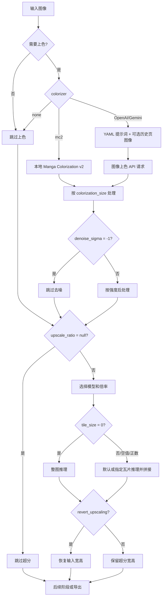

# 超分与上色

## 功能边界

本页覆盖“Mode Specific”页签中的 Upscaling 与 Colorization 两组设置：图像超分、输出尺寸恢复、离线上色、AI 上色提示词和历史页图像上下文。本页不替代 [模式专用设置](./mode-specific.md) 的九种工作流矩阵，也不展开翻译、检测、OCR、修复或排版参数。超分改变像素尺寸；上色改变颜色信息；两者都不会自动启用检测、OCR、翻译或排版。

## UI 操作

打开“设置”，选择 Mode Specific 中的 “Upscaling” 或 “Colorization”。布局文件决定行顺序，动态设置页按字段类型创建下拉框、开关或数值框。编辑完成后内存配置立即更新，并由配置服务合并写入 `config/config.json`；数值框失焦时提交，非法输入不会成为有效配置。

### 超分操作

1. 在“超分模型”（`label_upscaler`）选择 `Waifu2x`、`ESRGAN`、`4x UltraSharp`、`Real-CUGAN` 或 `MangaJaNai`。
2. 在“超分倍数”（`label_upscale_ratio`）选择“不使用”或当前模型提供的倍率。Real-CUGAN 的选择同时写入其内部模型字段。
3. 在“分块大小(0=不分割)”输入瓦片边长；`0` 关闭分块，空值使用运行时默认 400。
4. 需要超分后仍输出原始宽高时启用“还原超分”。这不会跳过超分，只恢复最终尺寸。

### 上色操作

1. 在“上色模型”（`label_colorizer`）选择“不使用”、`Manga Colorization v2`、`OpenAI Colorizer` 或 `Gemini Colorizer`。
2. 选择 AI 上色器后，API 管理页会显示对应的上色凭据组；必须准备有效配置，否则 UI 可能阻止启动或请求失败。
3. 点击“AI 上色提示词”（`label_ai_colorizer_prompt_path`）的编辑动作修改固定 YAML 文件。它是资源编辑器，不是普通 JSON 配置字段。
4. 调整“上色大小”和“降噪强度”；AI 上色可用“AI 上色历史页数”附加已完成上色的前置页面图像，`0` 关闭。

“仅上色”显示“开始上色”，“仅超分”显示“开始超分”；两种流程都跳过检测、OCR、翻译和排版。其余九种流程的强制覆盖和输入输出归属模式专用页。

| UI 调用 key | English 实际值 | 简体中文实际值 |
| --- | --- | --- |
| `Upscaling` | Upscaling | 超分 |
| `Colorization` | Colorization | 上色 |
| `label_upscaler` | Upscaling Model | 超分模型 |
| `label_upscale_ratio` | Upscale Ratio | 超分倍数 |
| `label_realcugan_model` | Real-CUGAN Model | Real-CUGAN模型 |
| `label_tile_size` | Tile Size (0=No Split) | 分块大小(0=不分割) |
| `label_revert_upscaling` | Revert Upscaling | 还原超分 |
| `label_colorizer` | Colorization Model | 上色模型 |
| `label_colorization_size` | Colorization Size | 上色大小 |
| `label_denoise_sigma` | Denoise Strength | 降噪强度 |
| `label_ai_colorizer_prompt_path` | AI Colorizer Prompt | AI 上色提示词 |
| `label_ai_colorizer_history_pages` | AI Colorizer History Pages | AI 上色历史页数 |
| `upscale_ratio_not_use` | Not Use | 不使用 |
| `Colorize Only` | Colorize Only | 仅上色 |
| `Upscale Only` | Upscale Only | 仅超分 |
| `Start Colorizing` | Start Colorizing | 开始上色 |
| `Start Upscaling` | Start Upscaling | 开始超分 |

## 选项中英对照

### 超分模型与倍率

| 存储值 | English | 简体中文 |
| --- | --- | --- |
| `waifu2x` | Waifu2x | Waifu2x |
| `esrgan` | ESRGAN | ESRGAN |
| `4xultrasharp` | 4x UltraSharp | 4x UltraSharp |
| `realcugan` | Real-CUGAN | Real-CUGAN |
| `mangajanai` | MangaJaNai | MangaJaNai |
| `null` | Not Use | 不使用 |
| `2` / `3` / `4` | 2 / 3 / 4 | 2 / 3 / 4 |
| `x2` / `x4` / `DAT2 x4` | x2 / x4 / DAT2 x4 | x2 / x4 / DAT2 x4 |

普通模型将倍率保存为整数或 `null`；MangaJaNai 保存字符串档位；Real-CUGAN 的下拉项为以下完整模型值，并同时写入倍率：`2x-conservative`、`2x-conservative-pro`、`2x-no-denoise`、`2x-denoise1x`、`2x-denoise2x`、`2x-denoise3x`、`2x-denoise3x-pro`、`3x-conservative`、`3x-conservative-pro`、`3x-no-denoise`、`3x-no-denoise-pro`、`3x-denoise3x`、`3x-denoise3x-pro`、`4x-conservative`、`4x-no-denoise`、`4x-denoise3x`。这些名称在当前 UI 中直接显示存储值。

### Real-CUGAN 模型档位

| 存储值 | English | 简体中文 |
| --- | --- | --- |
| `2x-conservative` | 2x-conservative | 2x-conservative |
| `2x-conservative-pro` | 2x-conservative-pro | 2x-conservative-pro |
| `2x-no-denoise` | 2x-no-denoise | 2x-no-denoise |
| `2x-denoise1x` | 2x-denoise1x | 2x-denoise1x |
| `2x-denoise2x` | 2x-denoise2x | 2x-denoise2x |
| `2x-denoise3x` | 2x-denoise3x | 2x-denoise3x |
| `2x-denoise3x-pro` | 2x-denoise3x-pro | 2x-denoise3x-pro |
| `3x-conservative` | 3x-conservative | 3x-conservative |
| `3x-conservative-pro` | 3x-conservative-pro | 3x-conservative-pro |
| `3x-no-denoise` | 3x-no-denoise | 3x-no-denoise |
| `3x-no-denoise-pro` | 3x-no-denoise-pro | 3x-no-denoise-pro |
| `3x-denoise3x` | 3x-denoise3x | 3x-denoise3x |
| `3x-denoise3x-pro` | 3x-denoise3x-pro | 3x-denoise3x-pro |
| `4x-conservative` | 4x-conservative | 4x-conservative |
| `4x-no-denoise` | 4x-no-denoise | 4x-no-denoise |
| `4x-denoise3x` | 4x-denoise3x | 4x-denoise3x |

### 上色模型

| 存储值 | English | 简体中文 |
| --- | --- | --- |
| `none` | None | 不使用 |
| `mc2` | Manga Colorization v2 | Manga Colorization v2 |
| `openai_colorizer` | OpenAI Colorizer | OpenAI Colorizer |
| `gemini_colorizer` | Gemini Colorizer | Gemini Colorizer |

## 参数与运行机理

#### `upscale.upscaler` — 超分模型 / Upscaling Model {#upscale-upscaler}

- 控件/位置：下拉框；设置 → Mode Specific → Upscaling。
- 存储值：见上表。默认：核心 `esrgan`；Qt `esrgan`；发行 `config/config-example.json` 为 `mangajanai`。
- 生效阶段/消费者：超分阶段；`manga_translator/upscaling/` 的选定实现和主调度器。
- 原理：选择离线模型，实际是否运行及倍率由 `upscale_ratio` 决定。
- 依赖与冲突：模型文件、设备和后端必须可用；MangaJaNai 资源消耗最高。工作流强制覆盖以 mode-specific 页为准。
- 性能/文件/图示：改变显存、内存、速度和输出；见[#超分与上色分支](#upscale-colorization-flow)。
- 源码/验证：`settings_tab_layout.json`、`dynamic_settings.py`、`app_logic.py`、`config.py`、upscaling 实现；静态完成，脱敏推理待统一验收。

#### `upscale.upscale_ratio` — 超分倍数 / Upscale Ratio {#upscale-upscale-ratio}

- 控件/位置：随模型重建的下拉框；Real-CUGAN 同步管理 `realcugan_model`。
- 存储值/默认：普通模型为 `null`、整数 `2/3/4`；MangaJaNai 为 `null`、`x2`、`x4`、`DAT2 x4`；核心、Qt、发行均为 `null`。
- 生效阶段/消费者：超分；倍率解析和模型加载。
- 原理：`null` 跳过超分；其他值决定倍率或 MangaJaNai 档位，不是检测尺寸。
- 依赖与冲突：选项随 `upscaler` 改变，切换模型会重填并清理不兼容值；倍率越高资源和输出像素越多。
- 关联文件/图示/依据：输出图像及超分元数据；动态选项逻辑、`app_logic.py`、`config.py` 和 upscaling consumer；需要分支图。
- 验证：静态完成；各模型实际输出尺寸待统一运行验证。

#### `upscale.realcugan_model` — Real-CUGAN 模型 / Real-CUGAN Model {#upscale-realcugan-model}

- 控件/位置：不单独显示，由“超分倍数”选择器维护；存储为完整档位值，默认核心/Qt/发行均为 `null`。
- 生效阶段/消费者：超分模型解析；Real-CUGAN loader。
- 原理：选择档位时同时写模型和可解析倍率；手改字段可能使 UI 与档位不一致。
- 依赖与冲突：仅 `upscaler=realcugan` 使用；档位中的 conservative/no-denoise/denoise 影响质量与资源。图示不需要独立图：分支已在倍率图中表达。
- 文件/依据/验证：配置 JSON 字段；`dynamic_settings.py`、`app_logic.py`、`config.py`；静态完成。

#### `upscale.tile_size` — 分块大小 / Tile Size {#upscale-tile-size}

- 控件/位置：可选整数框；设置 → Mode Specific → Upscaling。
- 存储值/默认：`0` 不分块，正整数为瓦片边长，`null` 使用运行时默认 400；核心/Qt `null`，发行 `400`。
- 生效阶段/消费者：超分预处理/推理；`upscaling/tile_utils.py` 和模型实现。
- 原理：大图拆块推理后拼回；分块降低峰值显存，整图处理则可能更快但更易 OOM。
- 依赖与冲突：过大仍可能 OOM，过小增加边界与拼接开销；不改变倍率或恢复尺寸。
- 文件/性能/图示：只改变中间块和最终图；显存、速度受影响；需要分支图。依据 `config.py`、`config_models.py`、`dynamic_settings.py`、`upscaling/tile_utils.py`；静态完成，运行待验收。

#### `upscale.revert_upscaling` — 还原超分 / Revert Upscaling {#upscale-revert-upscaling}

- 控件/存储值：开关，`true`/`false`；核心、Qt、发行默认均 `false`。
- 生效阶段/消费者：超分后输出尺寸；主调度器和导出保存路径。
- 原理：`true` 先超分再将最终输出恢复到输入宽高，`false` 保留放大尺寸；它不跳过超分。
- 依赖与冲突：与仅超分流程组合时仍可能输出原尺寸；完整模式覆盖以 mode-specific 页为准。影响一次缩放和最终图尺寸，需分支图。
- 源码/文件/验证：`config.py`、主调度器、保存消费者；静态完成，尺寸回归待统一验收。

#### `colorizer.colorizer` — 上色模型 / Colorization Model {#colorizer-colorizer}

- 控件/位置：下拉框；设置 → Mode Specific → Colorization。存储值：`none`、`mc2`、`openai_colorizer`、`gemini_colorizer`。
- 默认：核心/Qt/发行均 `none`。
- 生效阶段/消费者：上色；`colorization/manga_colorization_v2.py`、`model_api_colorizer.py` 和主调度器。
- 原理：`none` 跳过；`mc2` 本地推理；OpenAI/Gemini 构造图像请求并使用对应 color API 功能组。
- 依赖与冲突：AI 值需对应 API key/base/model；网络、鉴权和配额会影响结果。翻译器选择、API 槽轮换不属于本页。需分支图。
- 文件/成本/验证：专用 YAML、请求图像、输出图像；AI 产生网络成本，静态完成，脱敏运行待验收。

#### `colorizer.ai_colorizer_prompt_path` — AI 上色提示词 / AI Colorizer Prompt {#colorizer-ai-colorizer-prompt-path}

- 控件/位置：固定提示词 YAML 编辑动作；不是普通配置行。
- 存储值/默认：资源路径和加载目标；布局有该字段，但 Qt 模型和发行模板没有同名持久化字段，不能伪造三类数值默认。
- 生效阶段/消费者：AI 上色请求构建；OpenAI/Gemini colorizer prompt loader。
- 原理：编辑专用 YAML；不要与 AI OCR、AI renderer 或翻译提示词混用。格式错误会使加载/请求失败；不需要独立图示。
- 文件/安全/依据/验证：`dict/ai_colorizer_prompt.yaml`；分享须删除私有提示词和路径；`dynamic_settings.py`、加载器、colorizer consumer；编辑运行待验收。

#### `colorizer.ai_colorizer_history_pages` — AI 上色历史页数 / AI Colorizer History Pages {#colorizer-ai-colorizer-history-pages}

- 控件/存储值/默认：整数框；非负整数，`0` 关闭；核心/Qt/发行均 `0`。
- 生效阶段/消费者：AI 上色请求上下文；图像消息构建器。
- 原理：附加当前任务前已完成上色的前置页面图像；只传图像，不是翻译文字历史。历史不足时只使用已有页。
- 依赖与冲突：只对 OpenAI/Gemini colorizer 生效；任务顺序和隔离限制可用页数。增大值会增加上传、内存、延迟和费用，需历史上下文图。
- 文件/依据/验证：已上色中间/输出图像；`config.py`、历史选择和请求构建代码；静态完成，脱敏运行待验收。

#### `colorizer.colorization_size` — 上色大小 / Colorization Size {#colorizer-colorization-size}

- 控件/存储值：整数框；正数为处理尺寸，`-1` 请求原始/完整尺寸。默认：核心/Qt `576`；发行 `2048`。
- 生效阶段/消费者：上色 resize 与推理；MC2/AI colorizer。
- 原理：尺寸越大通常细节更好但更慢；它不是检测尺寸或超分倍率。依赖模型及显存/网络限制，需流程图。
- 文件/性能/依据/验证：上色前后图像；`config.py`、`config_models.py`、上色 resize consumer；静态完成，实际输出待验收。

#### `colorizer.denoise_sigma` — 降噪强度 / Denoise Strength {#colorizer-denoise-sigma}

- 控件/存储值/默认：整数框，范围 `0–255`，`-1` 禁用；核心、Qt、发行均 `30`。
- 生效阶段/消费者：上色后处理；colorization 降噪/融合步骤。
- 原理：数值越大平滑作用越强，`-1` 跳过；不是检测阈值，也不是 Real-CUGAN 档位。仅上色结果存在时有效；过强会抹细节。需流程图。
- 文件/依据/验证：上色中间和最终图；`config.py`、`config_models.py`、后处理 consumer；静态完成，视觉效果待验收。

## 运行机理

### 超分与上色分支 {#upscale-colorization-flow}

“仅上色”和“仅超分”在完成对应阶段后直接导出；检测、OCR、翻译和排版的完整主链及互斥覆盖由其他页面说明。

## 依赖与冲突

- `upscale_ratio=null` 跳过超分；`tile_size=0` 只关闭分块，两者不可混为一谈。
- 倍率选项随模型变化；Real-CUGAN 档位同步维护内部模型字段。
- `revert_upscaling` 只恢复输出尺寸，不取消超分。
- `colorizer=none` 跳过上色；MC2 需本地模型，AI 值需对应 API 配置和网络。
- 历史页是 AI 上色的图像上下文，不是翻译器文字上下文；增大它会增加上传、内存、延迟和费用。
- 上色大小、瓦片大小和超分倍率分别作用于不同阶段。
- 仅上色/仅超分跳过检测、OCR、翻译、排版；九种工作流强制覆盖归属 `mode-specific.md` 和 workflows 页面。

## 关联文件与格式

| 文件/目录 | 用途 | 格式与注意事项 |
| --- | --- | --- |
| `config/config-example.json` | 发行默认模板 | JSON；默认可不同于核心/Qt；不读取用户配置 |
| `config/config.json` | 应用持久化 | JSON；只记录字段边界，不展示用户值 |
| `dict/ai_colorizer_prompt.yaml` | AI 上色固定提示词 | YAML；编辑动作直接修改；分享前脱敏 |
| `COLOR_OPENAI_*` / `COLOR_GEMINI_*` | AI 上色连接组 | 不展示真实 key、token 或配置 |
| 每图结果/调试目录 | 条件性图像产物 | 仅触发阶段时存在；只分享脱敏文件 |

本页不展开翻译 JSON、蒙版和覆盖层 schema；这些属于工作流/编辑器页面。

## 源码依据 {#source-evidence}

| 层级 | 文件 | 已核对内容 |
| --- | --- | --- |
| UI 布局 | `desktop_qt_ui/ui/main_page/settings_tab_layout.json` | 两组行和顺序 |
| UI 构造/提交 | `desktop_qt_ui/ui/main_page/dynamic_settings.py` | 动态控件、倍率依赖、Real-CUGAN 双字段、提示词编辑 |
| UI 文案 | `desktop_qt_ui/app_logic.py` | 模型映射和选项 |
| locale | `desktop_qt_ui/locales/en_US.json`、`zh_CN.json` | 三列实际值和描述 |
| Qt/核心默认 | `desktop_qt_ui/core/config_models.py`、`manga_translator/config.py` | 字段、特殊值和代码默认 |
| 发行默认 | `config/config-example.json` | 模板默认差异 |
| 持久化 | `desktop_qt_ui/app_logic.py`、`desktop_qt_ui/services/config_service.py` | 更新、合并写盘、优先级 |
| 最终消费者 | `manga_translator/upscaling/`、`manga_translator/colorization/`、主调度器 | 模型、倍率、瓦片、尺寸、降噪、历史图像 |
| 工作流 | locale 和模式/工作流调度源码 | 仅上色/仅超分按钮、提示及跳过边界 |

## 安全审查与验证记录 {#verification}

- 未读取或展示真实 `.env`、用户配置、API key/token、用户名、私有绝对路径、用户图片、私有提示词或任务产物。
- 源码、UI 布局/绑定、en/zh locale 三列和三类默认差异已核对。
- Mermaid 已表达模型、倍率、瓦片、历史页、降噪和恢复尺寸的实际分支。
- 脱敏模型/API 运行、历史页、实际尺寸和视觉效果待统一验收；不能以“应该可用”代替运行证据。
- 页面完成后运行 route mirror、source evidence、coverage 脚本和 VitePress 构建。
