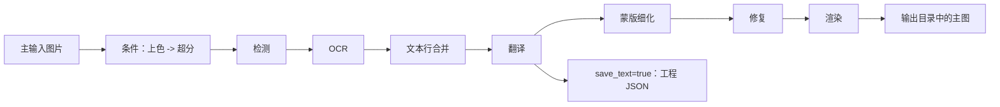

# 输出目录与工作流

在翻译页的“翻译任务”卡片中，可以指定主输出目录并选择处理模式。本页只说明输出路径控件、九种工作流的选择和它们对输出与处理阶段的影响；输入文件添加和列表状态见[文件列表与输入](./file-list-and-input.md)，开始、进度和停止状态见[进度、停止与任务状态](./progress-stop-and-task-state.md)。

## 功能边界

本页覆盖：

- 输出目录的输入、浏览和打开操作。
- “翻译流程模式：”下拉框的九个选项、切换后的按钮和说明文字。
- 每种模式的输入发现、输出文件、处理阶段、跳过阶段和互斥限制。

本页不定义各检测器、OCR、翻译器、修复器或渲染器的参数算法，也不把工作流选择当作翻译器或 API 候选槽切换。手工同时设置多个工作流字段也不构成 GUI 支持的组合。

## UI 操作

### 设置输出目录

1. 在“输出目录:”旁的输入框中填写路径，或把输出文件夹拖入输入框。输入框的占位文案是“选择或拖入输出文件夹...”。
2. 点击“浏览...”打开目录选择动作并选择目标文件夹。
3. 点击“打开”调用系统打开所选输出目录。
4. 选择文件后，在“翻译流程模式：”中选定处理方式，再点击该模式对应的开始按钮。

源码中输出输入框与浏览、打开按钮连接到控制器的目录选择和打开动作；本次静态取证没有启动 GUI，因此目录不存在、不可写或打开失败时的实际弹窗文案仍待运行核对。输出目录不会替代每图工作目录，JSON、TXT 和修复图仍按输入图片的工作目录规则保存。

### 选择工作流

下拉框切换时，GUI 先清除八个互斥 CLI 工作流字段，再只设置所选模式对应的字段并保存配置。切换也会更新标题、说明文字和开始按钮；模式切换不会自动运行任务。

| UI 调用 key | English 实际值 | 简体中文实际值 |
| --- | --- | --- |
| `Output Directory:` | Output Directory: | 输出目录: |
| `Select or drag output folder...` | Select or drag output folder... | 选择或拖入输出文件夹... |
| `Browse...` | Browse... | 浏览... |
| `Open` | Open | 打开 |
| `Translation Workflow Mode:` | Translation Workflow Mode: | 翻译流程模式： |
| `Start Translation` | Start Translation | 开始翻译 |
| `Export Translation` | Export Translation | 导出翻译 |
| `Generate Original Text Template` | Generate Original Text Template | 仅生成原文模板 |
| `Start JSON Translation` | Start JSON Translation | 开始仅翻译（JSON） |
| `Import Translation and Render` | Import Translation and Render | 导入翻译并渲染 |
| `Start Colorizing` | Start Colorizing | 开始上色 |
| `Start Upscaling` | Start Upscaling | 开始超分 |
| `Start Inpainting` | Start Inpainting | 开始修复 |
| `Start Replace Translation` | Start Replace Translation | 开始替换翻译 |

选择后，标题会显示当前模式，副标题会显示对应提示。例如导出翻译提示检查 `manga_translator_work/translations/`，导入翻译并渲染提示从 `manga_translator_work/originals/` 或 `translations/` 读取 TXT，并优先 `_original.txt`。这些路径是程序显示的提示和工作目录名，不是用户私有路径。

## 选项中英对照

下拉框没有独立 `userData`；索引是模式值，运行时代码把索引映射到以下 CLI 字段。表中同时保留三列 UI 证据和行为列。

| 存储值 | English | 简体中文 | 写入的工作流字段 | 开始按钮（English / 简体中文） |
| --- | --- | --- | --- | --- |
| `0` | Normal Translation | 正常翻译流程 | 八个字段均为 `false` | Start Translation / 开始翻译 |
| `1` | Export Translation | 导出翻译 | `generate_and_export=true` | Export Translation / 导出翻译 |
| `2` | Export Original Text | 导出原文 | `template=true` | Generate Original Text Template / 仅生成原文模板 |
| `3` | Translate JSON Only | 仅翻译（JSON） | `translate_json_only=true` | Start JSON Translation / 开始仅翻译（JSON） |
| `4` | Import Translation and Render | 导入翻译并渲染 | `load_text=true` | Import Translation and Render / 导入翻译并渲染 |
| `5` | Colorize Only | 仅上色 | `colorize_only=true` | Start Colorizing / 开始上色 |
| `6` | Upscale Only | 仅超分 | `upscale_only=true` | Start Upscaling / 开始超分 |
| `7` | Inpaint Only | 仅修复 | `inpaint_only=true` | Start Inpainting / 开始修复 |
| `8` | Replace Translation | 替换翻译 | `replace_translation=true` | Start Replace Translation / 开始替换翻译 |

### 输出路径与工作目录

主输出图由 `MangaTranslator._calculate_output_path()` 决定：一般情况下，输出目录下保留输入文件夹名和相对层级；`save_to_source_dir=true` 时，输出改到原图同级的 `manga_translator_work/result/`。当 `cli.format` 为空或为 `none` 时保留原扩展名，否则使用指定扩展名。

每张图的工作目录以输入文件的 `<stem>`（不含扩展名）组织：

| 资源 | 路径 | 查找/兼容规则 |
| --- | --- | --- |
| 译文工程 JSON | `manga_translator_work/json/<stem>_translations.json` | 优先新位置，回退到图片同级 `<stem>_translations.json` |
| 原文导出 | `manga_translator_work/originals/<stem>_original.<template-format>` | 模板格式不可读或未指定时回退 `json` |
| 译文导出 | `manga_translator_work/translations/<stem>_translated.<template-format>` | 同上 |
| 修复图 | `manga_translator_work/inpainted/<stem>_inpainted.<original-ext>` | 没有其他查找位置 |
| 上色/超分编辑器底图 | `manga_translator_work/editor_base/<original-filename>` | 兼容旧工作目录根部的同名底图 |
| 替换翻译配对图 | `manga_translator_work/translated_images/<stem><ext>` | 先找同扩展名，再遍历支持的图片扩展名 |

`config/translation_template.json` 的首个 `output_format:` 行决定 TXT/模板扩展名；合法值是安全的 1–32 字符扩展名，缺失或非法时回退为 `json`。模板文本使用 `<original>` 和 `<translated>` 占位符生成。

## 运行机理

### 常规输出链

正常翻译会按条件执行上色和超分，然后进入检测、OCR、文本行合并、翻译、蒙版细化、修复和渲染。无检测框或没有 OCR 文本时，核心可能提前返回输入图或超分后的图。正常模式是九种模式中唯一允许进入 `batch_concurrent` 并发管线的模式。

### 九种模式的阶段和输出

| 工作流 | 输入/发现 | 输出 | 运行阶段 | 跳过或特殊边界 |
| --- | --- | --- | --- | --- |
| 正常翻译 | 主输入图片 | 主输出图；`save_text=true` 时工程 JSON；修复完成时修复图；启用上色/超分时编辑器底图 | 条件上色 → 超分 → 检测 → OCR → 合并 → 翻译 → 蒙版 → 修复 → 渲染 | 没有检测框或 OCR 文本时可能提前返回；仅此模式使用并发管线 |
| 导出翻译 | 主输入图片和可用模板 | 工程 JSON、`<stem>_translated.<template-format>`；不写主输出图 | 条件上色 → 超分 → 检测 → OCR → 合并 → 翻译；有区域和原始蒙版时细化蒙版 | 跳过修复、渲染和主图保存；`generate_and_export=true`；导入 YOLO 标签时跳过蒙版细化并不保存蒙版 |
| 导出原文 | 主输入图片和可用模板 | 工程 JSON、`<stem>_original.<template-format>`；不写主输出图 | 条件上色 → 超分 → 检测 → OCR → 合并；通常可细化蒙版 | 仅 `template=true` 且 `save_text=true` 进入导出分支；跳过翻译、修复、渲染和主图保存；YOLO 例外同导出翻译 |
| 仅翻译（JSON） | 必须找到工程 JSON；兼容旧区域列表和新 `regions` 对象 | 回写工程 JSON；成功后删除同图原文副文件；不写主输出图 | 载入 JSON → 翻译 → 回写 JSON | 跳过上色、超分、检测、OCR、合并、蒙版、修复和渲染；不以 `save_text` 为保存条件 |
| 导入翻译并渲染 | 必须有工程 JSON；TXT 优先原文副文件，否则译文副文件 | 主输出图和更新后的工程 JSON；必要时修复图 | 读取 JSON/内存载荷 → 复用或细化蒙版 → 修复 → 渲染 | 跳过上色、超分、检测、OCR、合并和翻译；JSON 无蒙版且导入 YOLO 标签时会额外检测；已有修复图可复用，AI renderer 可跳过真正修复 |
| 仅上色 | 主输入图片 | 主输出图；上色有效时编辑器底图 | 条件上色 | 跳过超分、检测、OCR、合并、翻译、蒙版、修复和渲染；不强制选择上色器，选择 `none` 时可能原样输出 |
| 仅超分 | 主输入图片；倍率由 `upscale.upscale_ratio` 决定 | 主输出图；启用上色或倍率时编辑器底图 | 条件上色 → 条件超分 | 跳过检测、OCR、合并、翻译、蒙版、修复和渲染；不强制倍率，倍率为空时保留上色结果或原图 |
| 仅修复 | 主输入图片 | 主输出图；分支清空 `text_regions`，不按译文渲染 | 条件上色 → 超分 → 检测 → 以字面量 `TEXT` 填充检测行 → 合并 → 蒙版 → 修复 | 跳过 OCR、翻译和渲染；无检测行/蒙版/合并区域时可能返回未修复图；AI renderer 会跳过真正修复并使用工作图 |
| 替换翻译 | 生肉图；工作目录中必须有同名翻译图 | 主输出图；重新渲染分支可写修复图和 JSON，直接粘贴分支不写二者或 PSD | 两张图条件上色 → 超分 → 检测 → OCR → 合并 → 区域配对 → 修复并渲染，或直接粘贴文字 | 不调用翻译服务；强制 `disable_auto_wrap=true`、`layout_mode='strict'`；`enable_template_alignment=true` 走直接粘贴，`paste_mask_dilation_pixels` 仅该分支消费 |

工作流的显示名称描述“目标”，并不总是自动开启相关模型：例如仅超分不强制倍率，且源码仍可能先执行已启用的上色；仅上色也不强制把上色器从 `none` 改为具体实现。

### 工作流互斥和并发

GUI 切换时八个布尔字段互斥；从已有配置同步下拉框时，源码优先级为：替换翻译、仅修复、仅超分、仅上色、导入翻译、仅翻译 JSON、导出原文、导出翻译、正常。手工 JSON、服务请求或其他入口可提供组合，但运行时分派按固定优先级处理，不存在“同时执行”契约。

`batch_concurrent` 对导入翻译、JSON-only、两种导出、仅上色、仅超分、仅修复和替换翻译均不兼容；桌面控制层和核心都会把这些模式按非并发处理。特殊模式不会因为界面仍保存并发配置就变成并发管线。

## 依赖与冲突

- 主输入必须是文件服务支持的图片；添加文件夹时递归查找并按自然排序，跳过名为 `manga_translator_work` 的目录。压缩包和文档扩展名由同一服务识别，但压缩包内副文件与工作流的配对尚未运行验证。
- 导出翻译和导出原文依赖可读取的模板；模板格式非法时使用 `json`。导入翻译、JSON-only 和替换翻译依赖相应工程 JSON、TXT 或配对图。
- `cli.overwrite` 在开始前按模式检查既有 TXT、副文件或主输出图；覆盖提示和 JSON-only 原文副文件不存在时的行为仍需运行验证。
- `cli.save_text` 默认由 Qt/发行配置设为 `true`，同时影响普通模式的 JSON、修复图和工程写入；导出原文进入导出分支要求它为 `true`。JSON-only 无条件回写 JSON。
- 上色、超分、检测、OCR、修复和渲染的模型、显存、网络和 API 成本由所选阶段参数决定，本页不重复其参数说明。

## 关联文件与格式

本页实际涉及的文件只限工作流输入输出和路径发现：

- `config/translation_template.json`：控制原文/译文导出模板和 `output_format`；不要把私有路径或内容写入公开样例。
- `manga_translator_work/json/*_translations.json`：工程数据；旧图片同级 JSON 仍作为回退位置。
- `manga_translator_work/originals/*_original.<format>` 与 `translations/*_translated.<format>`：模板导出和 TXT 导入的副文件，文件名必须与输入 `<stem>` 匹配。
- `manga_translator_work/inpainted/`、`editor_base/`、`translated_images/`：分别保存修复图、编辑器底图和替换翻译配对图。
- 输出目录中的主图：由输出路径计算器根据相对层级、`save_to_source_dir` 和 `cli.format` 决定。

不在本页展示真实用户配置、密钥、令牌、用户名、私有绝对路径、用户图片或任务产物。当前没有可用于本页的真实运行截图；不得用示意图冒充运行截图。

## 截图与流程图

上面的 Mermaid 只表达源码已确认的常规阶段顺序和 JSON 分支。九种模式的真实 GUI 状态、目录选择结果、覆盖提示、取消后的文件保留和错误弹窗尚未运行核对，后续截图必须使用脱敏输入和测试配置，并同时提供中英 alt 与图注。

## 源码依据

| 层级 | 文件 | 本页核对内容 |
| --- | --- | --- |
| UI 布局 | `desktop_qt_ui/ui/main_page/pages/translation_page.py:64-110` | “翻译任务”卡片、输出目录输入框、浏览/打开按钮、工作流下拉和开始按钮 |
| 工作流状态 | `desktop_qt_ui/ui/main_page/runtime.py:21-47` | 九个模式的标题/提示调用 key |
| 工作流写入 | `desktop_qt_ui/ui/main_page/runtime.py:151-215` | 配置同步、八字段清零、索引到 CLI 字段映射和配置保存 |
| 开始按钮 | `desktop_qt_ui/ui/main_page/runtime.py:218-238` | 模式对应开始按钮文案 |
| i18n | `desktop_qt_ui/locales/en_US.json:481-505`; `desktop_qt_ui/locales/zh_CN.json:479-503` | 控件、工作流、按钮和提示的实际双语值 |
| 输入与发现 | `desktop_qt_ui/services/file_service.py:31` | 支持扩展名、递归、自然排序和工作目录排除 |
| 控制层 | `desktop_qt_ui/app_logic.py:3094` | 输出路径传递、覆盖检查和特殊模式并发禁用 |
| Qt 配置 | `desktop_qt_ui/core/config_models.py:123` | 工作流字段和 `save_text` 默认值 |
| 核心分派 | `manga_translator/manga_translator.py:504,3399,4236,5206` | 输出、特殊模式优先级、预处理和常规后处理 |
| 路径/模板 | `manga_translator/utils/path_manager.py:12`; `manga_translator/utils/translation_template.py:10` | 工作目录、副文件查找和模板格式回退 |
| 替换翻译 | `manga_translator/utils/replace_translation.py:128,726` | 配对图查找、区域匹配、直接粘贴和输出边界 |

## 验证记录

| 验证内容 | 状态 | 说明 |
| --- | --- | --- |
| 源码与研究资料 | 已完成 | 已核对 `workflow-matrix-source-evidence.md` 及列出的 UI、i18n、控制层和核心源码 |
| i18n 三列证据 | 已完成 | 操作控件和九个工作流均记录调用 key、English 实际值、简体中文实际值 |
| 路由/页面镜像 | 待运行 | 完成页面后运行 route mirror 和 source evidence 检查 |
| GUI 九模式与文件输出 | 待运行 | 研究资料明确列出的运行验证尚未完成，不能将静态结论写成运行结论 |
| 生产构建 | 待运行 | 必要时运行 `npm run docs:build --prefix doc/wiki` |

- [ ] [进行中] 运行态待确认：九种模式的实际按钮、提示、输出目录、覆盖/错误反馈和取消后文件保留。
