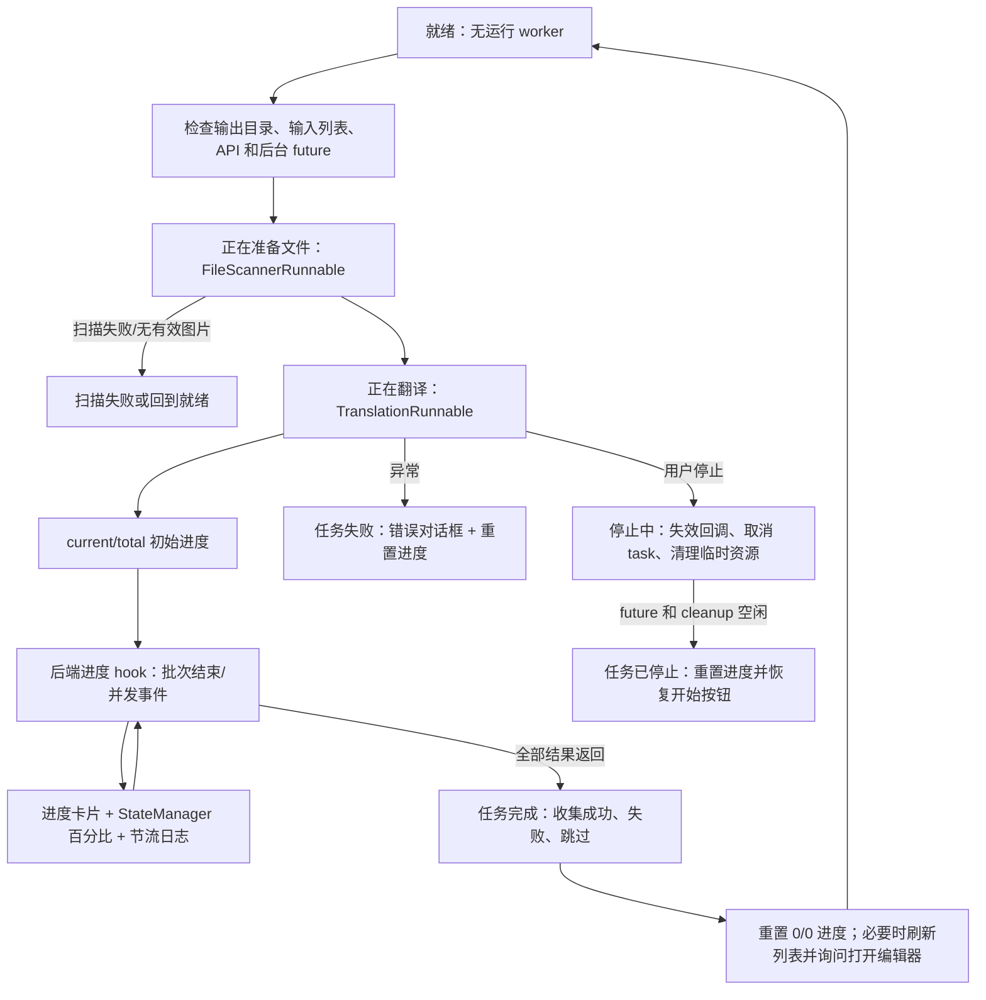

# 进度、停止与任务状态

当翻译页已经有输入文件、输出目录有效且 API 校验通过后，本页说明点击开始按钮后的状态变化、文件计数、百分比、停止请求和任务结束处理。工作流选择及每种模式的输入输出见[输出目录与工作流](./output-directory-and-workflow.md)，文件列表的添加、扫描和空列表状态见[文件列表与输入](./file-list-and-input.md)。

## 功能边界

本页覆盖桌面 Qt 翻译工作区的：

- 开始按钮在准备、启动、运行、停止中和就绪之间的切换。
- 扫描文件、处理文件、已跳过文件、失败文件和完成数量如何进入进度显示。
- 停止请求的取消边界、后台收尾、错误反馈和完成后打开编辑器的询问。

本页不定义检测、OCR、翻译器、修复器或渲染器的算法，也不把进度条当作服务端任务协议。九种工作流的阶段差异仍以工作流页为准。

## UI 操作

### 开始任务

1. 确认输出目录存在且为目录，并在文件列表中至少保留一个输入项。
2. 选择工作流后，点击当前模式的开始按钮。控制器会再次检查任务是否正在运行、上一次扫描/翻译/清理是否仍在后台，以及 API 凭据是否满足当前配置。
3. 通过检查后，界面先进入“正在准备文件...”，后台扫描文件夹、压缩包和排除项；扫描完成后才创建翻译 worker，并进入“正在翻译...”。
4. 处理开始后，按钮先短暂显示“Starting...”（中文 locale 没有此 key，实际回退为英文 key），约 2 秒后才可点击“停止翻译”。这是为了避免任务刚提交时重复启动或过早停止。

扫描或翻译无法启动时，状态会回到非运行状态并记录“任务启动失败”；无有效图片时回到“就绪”。输出目录、文件列表或 API 校验失败会在任务真正启动前弹窗阻止开始。

### 查看进度

进度卡片显示一条说明文字、`current/total (percentage%)` 计数和进度条。`current` 是已完成或已跳过的原始输入数量，`total` 是扫描后的原始总数，因此禁用覆盖并跳过已有输出时，跳过项仍计入总数。没有有效总数时显示 `0/0 (0%)`，不会把未知数量伪装成百分比。

说明文字可能包含“批量处理中”或“并发处理中”、平均每张耗时、预计剩余时间、已跳过数量和已失败数量。控制器同时写入状态管理器的 `[current/total] message`；日志以大约每秒一次的节流频率记录，但首个、最后一个和边界进度会记录。

### 停止任务

1. 任务运行且延迟停止按钮已经启用时，点击“停止翻译”。
2. 控制器立即设置停止请求标志，状态消息变为“正在停止...”，按钮禁用并显示“停止中...”。
3. 扫描请求 ID 和任务 ID 都递增，使已经排队但晚到的扫描、进度、完成或错误回调失效；worker 的 `stop()` 将运行标志设为 false，并取消当前 asyncio task。
4. 扫描 future、翻译 future 和压缩包临时文件清理全部结束后，状态才变为“任务已停止”，进度卡片重置为 `0/0 (0%)`，按钮恢复为当前工作流的开始文案。

停止是协作式取消，不保证中断已经发出的网络请求、模型内部不可取消的同步调用或已经写入磁盘的输出。停止中不可再次点击按钮，也不能用“停止”马上恢复开始状态；若后台仍在收尾，控制器会保持停止中。

### 处理完成或失败

成功完成后，控制器收集后端返回的已保存路径，按成功、失败和跳过数量设置状态消息并重置进度条。对于会产生编辑器结果的工作流，主窗口会刷新文件快照并询问“翻译完成，成功保存 {count} 个文件。\n\n是否在编辑器中打开结果？”；导出、JSON-only、仅上色、仅超分、仅修复等不适合编辑器的模式不显示该询问。

任务失败时状态为“任务失败”、进度重置，并弹出“翻译错误”对话框。对话框显示友好错误摘要，并提供“打开日志文件夹”；批量任务部分失败时仍会保留成功结果，同时在完成状态中列出成功和失败数量。全部输入因已有输出被跳过时，不视为 API 翻译失败，而是提示删除同名文件或开启覆盖。

## 选项中英对照

下表列出本页操作中实际调用的 i18n key。工作流开始按钮由所选模式决定；完整存储值和阶段差异见工作流页。

| UI 调用 key | English 实际值 | 简体中文实际值 |
| --- | --- | --- |
| `Start Translation` | Start Translation | 开始翻译 |
| `Stop Translation` | Stop Translation | 停止翻译 |
| `Starting...` | 缺失（回退为 key） | 缺失（回退为 key；代码会直接显示 `Starting...`） |
| `Stopping...` | Stopping... | 停止中... |
| `Start Colorizing` | Start Colorizing | 开始上色 |
| `Start Upscaling` | Start Upscaling | 开始超分 |
| `Start Inpainting` | Start Inpainting | 开始修复 |
| `Start JSON Translation` | Start JSON Translation | 开始仅翻译（JSON） |
| `Import Translation and Render` | Import Translation and Render | 导入翻译并渲染 |
| `Generate Original Text Template` | Generate Original Text Template | 仅生成原文模板 |
| `Export Translation` | Export Translation | 导出翻译 |
| `Start Replace Translation` | Start Replace Translation | 开始替换翻译 |
| `Task Completed` | Task Completed | 任务完成 |
| `Translation completed, {count} files saved.\n\nOpen results in editor?` | Translation completed, {count} files saved.\n\nOpen results in editor? | 翻译完成，成功保存 {count} 个文件。\n\n是否在编辑器中打开结果？ |
| `Translation Error` | Translation Error | 翻译错误 |
| `Open log folder` | Open log folder | 打开日志文件夹 |
| `Warning` | Warning | 警告 |

以下是代码直接写入状态管理器的状态文字，不是通过 `_t()` 查找的 UI i18n key，因此不能将其改写成假想的英文 locale 值：`正在准备文件...`、`正在翻译...`、`正在停止...`、`任务已停止`、`任务完成...`、`任务失败`、`就绪` 和扫描/进度详情文字。静态源码确认这些字符串当前以中文显示；运行态尚未启动核对。

## 运行机理

### 状态与进度流

`TranslationWorker` 的进度钩子解析后端 `batch:start:end:total[:failed]` 事件。控制器根据跳过偏移修正当前数和总数，并由 `TranslationRunnable` 通过 Qt 队列信号传给 `MainAppLogic.on_task_progress()`。后者把百分比限制在 0–100 的状态管理器范围，同时更新主视图的进度条。并发模式和普通批处理都使用原始输入总数；特殊工作流由控制层强制关闭并发。

### 停止和资源边界

停止会先使回调失效，再请求 worker 取消；不会直接把 `is_translating` 设为 false。`_cleanup_stopped_task_when_idle()` 轮询扫描、翻译和压缩包清理 future，只有后台真正空闲后才执行 `_finish_stop_task()`。worker 的 `stop()` 还会取消 asyncio 当前任务并调用完整内存清理；是否卸载模型取决于 `app.unload_models_after_translation`。

## 依赖与冲突

- 开始前依赖有效输出目录、非空输入列表、当前翻译器所需 API 凭据和没有未完成的前一任务收尾。
- 扫描阶段仍属于“正在翻译”状态，因此添加文件、添加文件夹、清空列表、文件列表和 API 管理页会被禁用。
- 停止与后台线程、asyncio task、压缩包临时目录和模型内存清理协作；强制终止进程可能留下部分输出或临时文件。
- `cli.overwrite=false` 时已有输出会计入进度但不处理；所有文件都跳过时任务会完成并提示覆盖设置，而不是调用翻译服务。
- `batch_concurrent` 仅对正常工作流有效；导入 TXT/JSON、导出、仅上色、仅超分、仅修复和替换翻译会按串行处理。
- 任务 ID 防止旧任务的延迟信号污染新任务，但不能撤销已落盘文件；需要由用户检查输出目录决定是否清理。

## 关联文件与格式

- `manga_translator_work/` 下的 JSON、TXT、修复图和替换翻译配对图属于工作流页定义的任务产物；本页只说明它们可能影响跳过计数、完成结果和清理。
- 主输出路径由配置的输出目录、输入文件夹相对层级、`cli.format`、`cli.overwrite` 和 `save_to_source_dir` 共同决定。
- 日志写入应用的 `result/` 日志目录；错误对话框只提供打开日志文件夹动作，不在文档中展示真实日志、路径或任务内容。
- 停止时清理压缩包解压临时目录；清理失败只记录 warning，不应伪称所有临时文件必然已删除。
- 不展示真实 API Key、Token、用户名、私有绝对路径、用户图片、提示词或任务产物。当前没有运行截图；Mermaid 是源码流程图，不是运行态截图。

## 截图与流程图

上方状态图覆盖开始、扫描、处理、进度、完成、失败和停止中的源码分支。按蓝图要求，未来有头模式截图应至少包括启动中、进度、停止中和完成状态，并使用脱敏输入、空 API 凭据显示和双语 alt/图注。本次没有启动 GUI，因此未声称按钮延迟、弹窗或取消后文件保留已经运行验证。

## 源码依据

| 层级 | 文件 | 本页核对内容 |
| --- | --- | --- |
| UI 布局 | `desktop_qt_ui/ui/main_page/view.py:163-188` | 进度卡片、说明文字、`0/0 (0%)` 计数和进度条 |
| UI 状态 | `desktop_qt_ui/ui/main_page/runtime.py:95-149` | 启动中延迟、停止按钮、停止中禁用和按钮连接 |
| 工作流按钮 | `desktop_qt_ui/ui/main_page/runtime.py:218-245` | 九种模式的开始按钮调用 key |
| 任务控制 | `desktop_qt_ui/app_logic.py:1715-1843` | 扫描、worker 创建、任务 ID 和启动状态 |
| 进度控制 | `desktop_qt_ui/app_logic.py:2062-2075`; `desktop_qt_ui/ui/main_page/runtime.py:55-92` | 数量、百分比、状态消息和 UI 进度条更新 |
| 完成/失败 | `desktop_qt_ui/app_logic.py:1915-2009,2044-2057` | 成功、跳过、失败计数、重置和信号 |
| 停止/清理 | `desktop_qt_ui/app_logic.py:2077-2140,2433-2447` | 回调失效、取消、后台收尾、临时资源和内存清理 |
| 状态存储 | `desktop_qt_ui/services/state_manager.py:11-18,45-183` | `is_translating`、进度、状态消息及 Qt 信号 |
| 完成对话框 | `desktop_qt_ui/ui/main_window.py:611-724` | 列表刷新、打开编辑器询问、错误/警告对话框 |
| i18n | `desktop_qt_ui/locales/en_US.json:157-169,481-505,1224`; `desktop_qt_ui/locales/zh_CN.json:157-169,479-503,1223` | 按钮、完成、错误、警告和缺失 key 的实际值 |
| 测试依据 | `test/test_app_logic_file_sources.py:88-180` | 停止中保持状态直到 worker 与清理 future 完成 |

## 验证记录

| 验证内容 | 状态 | 说明 |
| --- | --- | --- |
| 源码与 i18n 静态核对 | 已完成 | 已核对 UI、运行控制器、状态管理器、worker、完成对话框和 en/zh locale |
| UI 调用 key 三列 | 已完成 | 按钮、完成/失败/警告和停止状态均记录 key、实际 en_US、实际 zh_CN；`Starting...` 缺失项如实标出 |
| 停止状态回归测试 | 已有测试依据 | `test/test_app_logic_file_sources.py::test_stopping_state_remains_until_worker_and_cleanup_finish` 覆盖停止中不提前恢复，未新增或修改测试 |
| GUI 有头运行 | 未运行 | 未启动桌面 GUI，未虚构启动中、弹窗、取消后的运行态结果 |
| 真实翻译任务/文件保留 | 未运行 | 未使用 API、模型或用户输入验证落盘与取消边界 |
| 页面镜像、源码证据和生产构建 | 待本次静态检查 | 完成本页后运行可用的 Wiki 检查和构建命令 |

敏感信息审查：正文、表格、流程图和源码依据没有真实密钥、令牌、用户名、私有绝对路径、用户图片或私有提示词。
