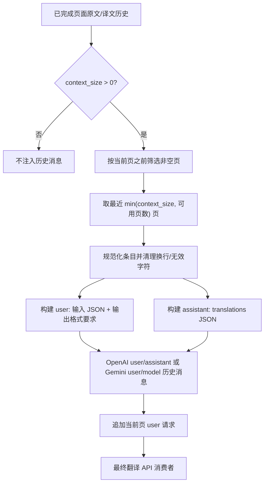
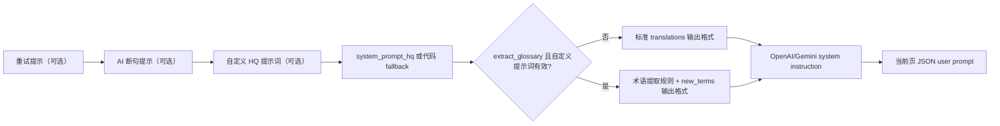

# 上下文与提示词

当相邻页面共享人名、术语、语气或格式时，本页用于配置翻译请求携带的历史页面，以及翻译器使用的系统、自定义和断句提示词。本页不负责选择翻译器、API 凭据和候选槽（见[翻译器选择](./selection-and-languages.md)及 API 管理页面），也不负责提示词文件列表的完整 CRUD（见[提示词列表、应用与预览](../prompts/list-apply-and-preview.md)）。

## 功能边界

- `cli.context_size` 决定联合翻译时最多选取多少个最近的非空历史页；它不是文本区域数量，也不是 API 候选槽数量。
- `translator.high_quality_prompt_path` 是翻译器读取自定义 HQ 提示词的资源路径/文件编辑动作。它不是把私密提示词内容写入本文档，也不是 AI OCR、AI 上色或 AI 渲染提示词。
- 系统 HQ 提示词、输出格式提示词、术语提取提示词和 AI 断句提示词由运行时分别加载并按固定顺序组合；本页只解释翻译链路中的消费者。

## UI 操作

### 在设置页选择上下文和提示词

1. 打开“设置”（`Settings`），选择“翻译”（`Translation`）分组。
2. 在“上下文页数”（`Context Pages`）输入非负整数。输入框保存到 `cli.context_size`；设为 `0` 表示不注入历史上下文。
3. 在“自定义提示词”（`Custom Prompt`）对应的文件编辑动作中选择或编辑提示词文件。动态设置控件通过 `get_hq_prompt_options()` 扫描 `dict/` 下的 `.yaml`、`.yml`、`.json` 文件，并排除系统提示词文件名。
4. 点击“编辑”（`Edit`）后直接修改文件；保存前应保持可解析的 YAML/JSON 结构。设置页重建或重新加载配置后，路径显示和说明面板会刷新。
5. “启用流式传输”（`Enable Streaming`）只改变响应传输方式，不改变上下文选择或提示词组合。

### 在提示词管理页检查和应用文件

打开“提示词管理”（`Prompt Management`）。列表显示可用的用户提示词文件；选中后可使用“应用所选提示词”（`Apply Selected Prompt`）将路径写入翻译器配置，也可使用“提示词预览”（`Prompt Preview`）和“编辑”（`Edit`）查看结构化字段或 Raw 内容。

| UI 调用 key | English 实际值 | 简体中文实际值 |
| --- | --- | --- |
| `Settings` | Settings | 设置 |
| `Translation` | Translation | 翻译 |
| `label_context_size` | Context Pages | 上下文页数 |
| `label_high_quality_prompt_path` | Custom Prompt | 自定义提示词 |
| `Prompt Management` | Prompt Management | 提示词管理 |
| `Prompt List` | Prompt List | 提示词列表 |
| `Apply Selected Prompt` | Apply Selected Prompt | 应用所选提示词 |
| `Prompt Preview` | Prompt Preview | 提示词预览 |
| `Edit` | Edit | 编辑 |
| `System Prompt` | System Prompt | 系统提示词 |
| `Prompt Text` | Prompt Text | 提示词正文 |
| `New Prompt` | New Prompt | 新建提示词 |
| `Copy Prompt` | Copy Prompt | 复制提示词 |
| `Rename Prompt` | Rename Prompt | 重命名提示词 |
| `Delete` | Delete | 删除 |

如果列表为空、文件不存在或无法解析，预览页显示对应错误/空状态；不要把错误信息中的本机路径复制到公开报告。

## 参数与选项

#### `cli.context_size` — 上下文页数 / Context Pages {#cli-context-size}

- 控件：整数输入框。
- 所在界面：设置 → 翻译；UI 调用 key 为 `label_context_size`。
- 存储值：非负整数；`0` 禁用历史消息注入。运行时还会将可用页数限制为实际已完成且含有效原文/译文的页数。
- 可选值：整数；没有枚举下拉选项。
- 默认值：核心代码 `manga_translator/config.py#Config` 读取参数时兜底为 `0`；Qt 模型 `desktop_qt_ui/core/config_models.py#CliSettings.context_size` 为 `3`；发行配置 `config/config-example.json` 为 `3`。三者不应合并写成单一默认。
- 生效阶段：翻译前的批量编排，以及翻译请求构建。
- 原理：每页翻译完成后保存原文/译文条目；下一页从当前页之前筛选非空页，取最近 `context_size` 页。每页被编码为一轮 `user` 请求和 `assistant` JSON 回复，当前请求再追加为新的 `user` 消息。
- 依赖与冲突：需要按顺序处理页面；开启 `batch_concurrent` 或特殊 JSON/导入工作流时，页面可用历史受调度路径限制。页数越大，提示词字符数和 token 成本越高；空页不会占用名额。
- 关联文件和调试产物：只影响内存中的 `all_page_translations`、`_original_page_texts` 和翻译请求消息；不把历史消息另存为用户文件。长批任务会裁剪旧历史（保留 `context_size + 5` 的缓冲）。
- 图示：必须有上下文历史到 API 消息的 Mermaid 数据流，见[历史消息构建](#history-to-messages)。
- 源码依据：定义/默认 `manga_translator/config.py`、`desktop_qt_ui/core/config_models.py`；界面绑定 `settings_tab_layout.json`、`app_logic.py#get_display_name`；编排与历史 `manga_translator/manga_translator.py#_build_prev_context`；最终消费者 `translators/openai.py`、`gemini.py` 的 context message builder。
- 验证状态：源码静态核对完成；脱敏运行验证待在完整桌面验收阶段执行。

#### `translator.high_quality_prompt_path` — 自定义提示词 / Custom Prompt {#translator-high-quality-prompt-path}

- 控件：提示词文件选择/编辑动作，不是普通文本参数输入。
- 所在界面：设置 → 翻译的“自定义提示词”行，或“提示词管理”页应用按钮。
- 存储值：相对或绝对资源路径；示例可写为 `dict/prompt_example.yaml`，不得写真实用户路径。支持 YAML/JSON；空值表示不加载自定义提示词。
- 可选值：扫描到的 `.yaml`、`.yml`、`.json` 文件名；系统专用 stem（如 `system_prompt_hq`、`system_prompt_hq_format`、`system_prompt_line_break`、`glossary_extraction_prompt`）不会作为普通用户提示词列出。
- 默认值：核心 `manga_translator/config.py#TranslatorSettings.high_quality_prompt_path` 为 `None`；Qt 模型 `desktop_qt_ui/core/config_models.py#TranslatorSettings.high_quality_prompt_path` 为 `dict/prompt_example.yaml`；发行配置 `config/config-example.json` 同为脱敏示例路径。
- 生效阶段：翻译上下文准备和系统提示词构建；若启用术语提取，成功响应中的 `new_terms` 还会回写该文件。
- 原理：`_load_and_prepare_prompts()` 解析路径并将结构化数据放入 `Context.custom_prompt_json`；`_build_system_prompt()` 展平结构化字段，将目标语言占位符（示例：`target_lang` 三层花括号占位符）替换为目标语言全称，再与系统/格式提示词组合。解析失败只记录警告/错误，不应把无效内容当作有效提示词发送。
- 依赖与冲突：只有支持 HQ/自定义提示词的 OpenAI/Gemini 翻译实现会消费它；AI OCR、上色、渲染使用各自固定提示词文件。启用术语提取必须同时有可解析的自定义提示词和写入权限；提示词越长，token 和网络成本越高。
- 关联文件和调试产物：`dict/prompt_example.yaml`、`dict/system_prompt_hq.yaml`、`dict/system_prompt_hq_format.yaml`、`dict/glossary_extraction_prompt.yaml`；文件编码和 YAML/JSON 根结构必须有效。不要将文件内容、API 请求或日志中的私有提示词公开。
- 图示：必须有提示词组合 Mermaid 数据流，见[提示词组合顺序](#prompt-composition)。
- 源码依据：配置 `manga_translator/config.py`、`desktop_qt_ui/core/config_models.py`；UI `desktop_qt_ui/app_logic.py#get_hq_prompt_options`、`ui/main_page/dynamic_settings.py`、`ui/main_page/layout.py`、`ui/secondary_pages/prompt_preview.py`；加载/解析 `manga_translator/translators/prompt_loader.py`；组合和消费者 `manga_translator/translators/common.py`、`openai.py`、`gemini.py`。
- 验证状态：源码/i18n 静态核对完成；禁止使用真实凭据或私有文件的运行验证待后续桌面验收。

## 运行机理

### 历史页如何成为上下文消息 {#history-to-messages}

处理器只使用当前页之前已经完成的页面，并跳过没有同时存在有效原文和译文的页面。旧历史 dict 和当前 list 条目都被规范化；换行会压成空格，替换无效字符后生成带 `id` 的输入 JSON 与 `translations` 输出 JSON。OpenAI 转成 `role=user`/`role=assistant` 消息，Gemini 转成 `user`/`model` parts；两者都不附带历史图片。

处理结束后历史会被裁剪以避免长批次内存增长；它是本次进程的运行时状态，不是持久化的提示词档案。并发或导入型工作流若没有严格的先后完成页，不能假定所有图片都能看到同一历史序列。

### 提示词组合顺序 {#prompt-composition}

每次重试都会重新构建系统提示词，并在开头加入重试提示（若有）。随后是 AI 断句提示（仅 `render.disable_auto_wrap` 开启且提示词文件可载入时），自定义 HQ 提示词，基础 HQ 系统提示词，最后是标准输出格式提示词。启用 `translator.extract_glossary` 且自定义提示词有效时，在基础提示词后追加术语提取规则和带 `new_terms` 的扩展输出格式。

自定义字段中的目标语言占位符（写作 `target_lang` 三层花括号占位符）会替换为目标语言全称。用户提示词包含按阅读顺序编号的区域 JSON；启用 AI 断句时还附加 `original_region_count`，让最终渲染检查能判断 `[BR]` 标记数量。

## 依赖与冲突

- 上下文质量依赖先前页面的 OCR 文本和成功译文；错误 OCR 不会被历史机制自动修正。
- `context_size`、`batch_size` 和 `batch_concurrent` 是不同层级：前者控制历史页数量，后者控制单次区域批量与图片编排，不能相互替代。
- 自定义 HQ 提示词只影响翻译请求；固定 AI OCR/上色/渲染提示词有各自配置键和消费者，勿混用文件。
- OpenAI/Gemini 请求还受流式、RPM、普通重试和 API 候选轮换影响；这些机制不改变历史内容，详见翻译设置及 API 管理页。
- 提示词内容可能包含业务文本。共享日志、请求导出或调试目录前必须删除请求正文、历史页文本、路径和凭据。

## 关联文件与格式

| 文件/格式 | 本页实际作用 | 手改与兼容注意 |
| --- | --- | --- |
| `config/config-example.json` | 发行默认 `context_size: 3` 和示例 HQ 路径 | 只使用脱敏示例；用户配置导入会覆盖内存设置，未知键按配置校验处理 |
| `config/config.json` | 运行时用户设置的持久化位置 | 不读取或展示真实用户文件；不要把私有绝对路径提交到文档 |
| `dict/prompt_example.yaml` | 默认自定义 HQ 提示词示例 | YAML 根结构需可解析，字段由提示词加载器支持 |
| `dict/system_prompt_hq.yaml` / `system_prompt_hq_format.yaml` | 基础系统提示词与输出格式 | 缺失时基础提示词有代码 fallback；格式提示词缺失会减少约束 |
| `dict/glossary_extraction_prompt.yaml` | 自动术语提取规则 | 只有有效自定义 HQ 提示词且 `extract_glossary` 开启时参与 |
| `dict/system_prompt_line_break.yaml` | AI 断句提示词 | 由 `render.disable_auto_wrap` 开关触发，不属于上下文历史 |
| `.yaml` / `.yml` / `.json` | 提示词编辑器支持的输入格式 | 仅记录结构和脱敏占位符，不展示真实提示词正文 |

## Mermaid 数据流限制

上图描述的是源码中的真实数据转换和最终 OpenAI/Gemini 消费者，不代表所有页面都必然有历史或网络请求。`context_size=0`、空历史、无效文件、非 HQ 翻译器和特殊工作流都会走相应旁路；文档没有伪造运行截图或私有任务产物。

## 源码依据 {#source-evidence}

| 层级 | 文件 | 本页核对内容 |
| --- | --- | --- |
| 设置 UI | `desktop_qt_ui/ui/main_page/settings_tab_layout.json`、`desktop_qt_ui/ui/main_page/dynamic_settings.py` | 翻译分组、整数控件、提示词文件编辑动作 |
| UI/i18n | `desktop_qt_ui/app_logic.py`、`desktop_qt_ui/locales/en_US.json`、`zh_CN.json` | key 映射和实际中英文显示值 |
| 配置模型 | `desktop_qt_ui/core/config_models.py`、`manga_translator/config.py` | Qt、发行和核心默认值 |
| 持久化/调度 | `desktop_qt_ui/services/config_service.py`、`manga_translator/manga_translator.py` | 配置写入、历史筛选、裁剪和提示词准备 |
| 提示词加载/组合 | `manga_translator/translators/prompt_loader.py`、`translators/common.py` | YAML/JSON 解析、占位符、系统/格式/术语组合 |
| 最终消费者 | `manga_translator/translators/openai.py`、`gemini.py` | 历史消息角色、当前 system/user 请求和响应格式 |

## 验证记录 {#verification}

| 验证内容 | 状态 | 说明 |
| --- | --- | --- |
| BLUEPRINT、PAGE_GUIDELINES、TODO | 完成 | 已完整读取并按页面合同编写 |
| UI 布局与调用 | 完成 | 静态核对设置布局、动态设置、提示词管理/预览调用 |
| `en_US` / `zh_CN` 实际 locale | 完成 | 页面表格逐项记录 key、English、简体中文实际值 |
| 上下文与提示词运行链 | 完成 | 静态核对历史构建、OpenAI/Gemini 消息和提示词组合 |
| 脱敏运行验证 | 待后续 | 本页未读取真实 `.env`、用户 `config.json`、API key/token、用户名、用户图片或私有提示词 |
| VitePress | 待运行 | 由协调代理在合并前运行 `npm run docs:build --prefix doc/wiki` 及镜像/源码检查 |