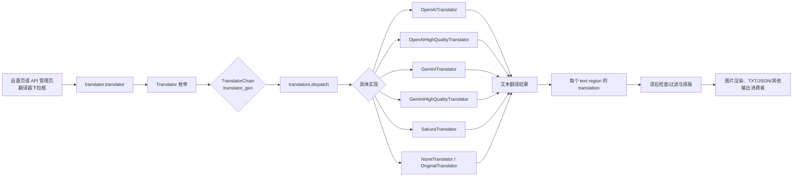
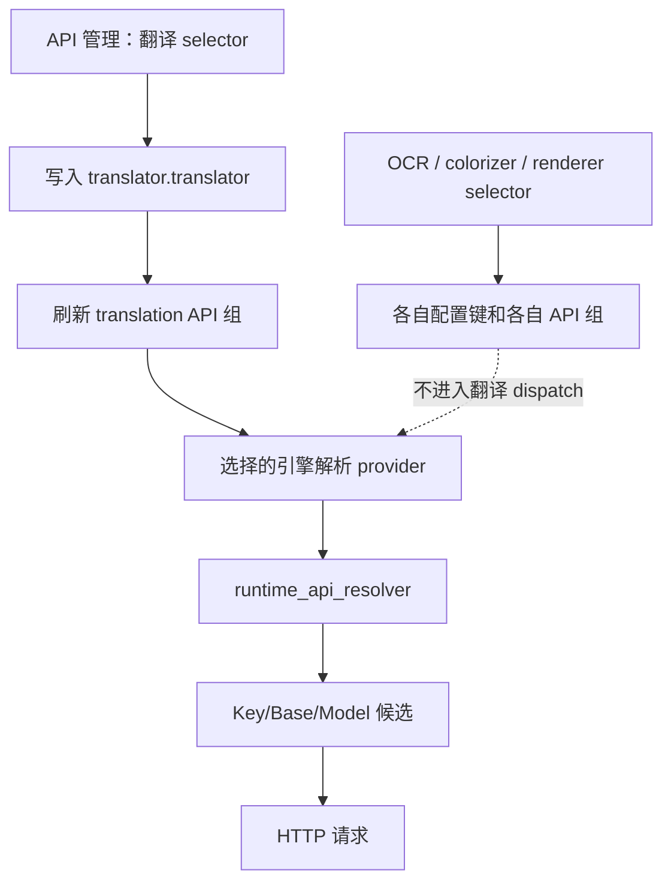

# 翻译器引擎分发

当需要知道“翻译器”下拉框到底会调用哪个实现、何时需要 API，以及多步翻译如何串联时使用本页。本页只讲 `translator.translator` 到翻译实现和最终文本消费者的分发边界；目标语言、跳过语言、上下文、提示词、流式和译后处理见[翻译器选择与语言](./selection-and-languages.md)及相邻专题页。

## 功能边界

- **负责**：桌面设置页和 API 管理页中的翻译器选择；存储值到 `Translator` 枚举、`TranslatorChain` 和 `dispatch` 的映射；OpenAI/Gemini 普通与高质量实现、Sakura、无翻译和保留原文的差异。
- **不负责**：OCR、上色、渲染下拉框；同一提供商内的 Key/Base/Model 候选轮换；提示词内容、上下文构造和质量重试；这些分别属于 API 管理或其他翻译器专题。
- API 管理页的“翻译器”选择器不是仅筛选界面：它写入同一个 `translator.translator`，并刷新下方翻译 API 分组；但 API 槽本身不会改变所选引擎。

## UI 操作

### 设置页选择引擎

1. 打开“设置”，进入“Translation”分组，在“翻译器”下拉框选择实现。
2. 下拉框显示本地化名称，但写入配置的是存储值（如 `openai_hq`）。选择后，动态设置发出 `translator.translator` 变更；`MainAppLogic.update_single_config()` 更新内存配置、保存配置文件，并通知 `TranslationService.set_translator()`。
3. 目标语言和其他翻译参数仍在同一分组配置；改变引擎不会自动改变目标语言。
4. 打开“API 管理”的翻译页签时，可在顶部同样改变翻译器。改变后页面异步重建当前功能的凭据/地址/模型分组；不会改 OCR、上色或渲染的配置键。

界面文案的实际证据如下。代码中的 API 环境变量名只用于字段绑定，不是用户在下拉框中看到的名称。

| UI 调用 key | English 实际值 | 简体中文实际值 |
| --- | --- | --- |
| `label_translator` | Translator | 翻译器 |
| `Translator:` | Translator: | 翻译器： |
| `translator_openai_hq` | OpenAI High Quality | OpenAI高质量翻译 |
| `translator_gemini_hq` | Gemini High Quality | Gemini高质量翻译 |
| `translator_none` | None | 无 |
| `translator_original` | Original | 原文 |
| `desc_translator_translator` | Choose the translation engine. The current Qt UI offers OpenAI, Google Gemini, Sakura, High-Quality OpenAI, High-Quality Gemini, plus No Translation and Keep Original. High-Quality OpenAI is recommended. | 选择翻译引擎。当前 Qt UI 可选翻译器包括 OpenAI、Google Gemini、Sakura、高质量翻译 OpenAI、高质量翻译 Gemini，以及“不翻译”“保留原文”。推荐高质量翻译 OpenAI。 |
| `log_translator_switched` | Translator switched: '{value}' | 翻译器已切换: '{value}' |
| `No translation API required` | The current translator does not require an OpenAI/Gemini API key. | 当前翻译器不需要 OpenAI/Gemini API Key。 |

## 选项中英对照

“设置”下拉框的选项来自 `get_options_for_key("translator")`，存储值是 `Translator` 枚举的 `.value`；显示映射由 `app_logic.py` 动态生成。API 管理翻译功能选择器使用同一组选项和同一配置键。

| 存储值 | English | 简体中文 | 需要的翻译 API |
| --- | --- | --- | --- |
| `openai` | OpenAI | OpenAI | OpenAI 兼容 API |
| `openai_hq` | OpenAI High Quality | OpenAI高质量翻译 | OpenAI 兼容 API；高质量提示词/结构处理 |
| `gemini` | Google Gemini | Google Gemini | Gemini API |
| `gemini_hq` | Gemini High Quality | Gemini高质量翻译 | Gemini API；高质量提示词/结构处理 |
| `sakura` | Sakura | Sakura | Sakura 服务地址/字典配置 |
| `none` | None | 无 | 不请求翻译服务；翻译结果为空 |
| `original` | Original | 原文 | 不请求翻译服务；保留原文 |

注意：locale 中还存在 `translator_google`、`translator_deepl`、`translator_papago`、`translator_gpt3`、`translator_groq` 等历史或通用文案，但当前桌面 `Translator` 枚举和动态选择器并不提供这些值，不能据此声称当前 Qt UI 支持它们。`Translator._missing_()` 只把旧的 `gpt*`/`chatgpt` 输入兼容映射为 `openai`，不增加新的 UI 选项。

## 默认值与配置生命周期

| 来源 | `translator.translator` 默认 | `translator.target_lang` 默认 | 说明 |
| --- | --- | --- | --- |
| 核心 `manga_translator/config.py` | `openai_hq` | `ENG` | `TranslatorConfig` 的 Pydantic 兜底 |
| Qt `desktop_qt_ui/core/config_models.py` | `openai_hq` | `CHS` | `AppSettings` 首次创建时的桌面模型默认 |
| 当前发行配置 | `openai_hq` | `CHS` | 发行配置沿用 Qt 首次启动默认；用户保存的配置优先，不应将其当成每台机器的实际值 |

改变选择器后，`ConfigService` 负责 Pydantic 配置对象和脱敏持久化；不要直接复制用户的 `config.json` 或凭据文件来“迁移”选择。核心配置还可能接受 CLI/Web 显式覆盖，最终运行值以传给核心的 `Config` 为准。

## 运行机理：从 key 到最终消费者

1. `TranslatorConfig.translator_gen` 若没有 `selective_translation` 或 `translator_chain`，构造 `TranslatorChain("<translator>:<target_lang>")`。链字符串的每一段必须是 `枚举名:语言`，语言必须存在于 `VALID_LANGUAGES`。
2. `translators.get_translator()` 查 `TRANSLATORS`。无状态的 `none`、`original` 可从 `translator_cache` 复用；其他实现每次取得新实例，避免请求状态互相污染。
3. `dispatch()` 对每个链节点执行 `parse_args(config)`，再调用 `translate('auto', target, queries, ...)`；高质量实现接收上下文参数，普通 AI 实现也可接收用于 AI 断句的上下文。空查询直接返回，不产生 API 请求。
4. 核心批处理入口在 `_batch_translate_texts()` 对 OpenAI/Gemini 四种实现显式创建对应类；其他枚举（包括 Sakura、无翻译、原文）走通用 `dispatch_translation()`。`none` 在入口直接为每段文本返回空字符串。
5. 翻译结果回到 `text_regions` 的 `translation` 字段，随后由翻译后处理、排版 renderer 和保存器消费；翻译器选择并不直接写最终图片。

### 普通、高质量与本地分支

- `openai` 与 `gemini` 是通用聊天翻译实现，仍可使用统一流式传输和上下文。
- `openai_hq` 与 `gemini_hq` 走专用高质量类；它们的提示词/结构化处理和质量行为不要与普通重试混写。
- `sakura` 是独立服务实现，不会因为选择 OpenAI/Gemini API 候选而自动切换。
- `none` 与 `original` 不应被当成“API 失败后的回退”。前者清空译文，后者保留原文；它们是用户主动选择的实现。

## API 功能选择器的边界

API 管理页有四个 feature selector：翻译、OCR、上色、渲染。规格表将它们绑定到四个真实配置键：

| UI 调用 key | 配置键 | 选择器选项来源 | 刷新的 API 分组 |
| --- | --- | --- | --- |
| `label_translator` | `translator.translator` | `get_options_for_key("translator")` | `translation` |
| `label_ocr` | `ocr.ocr` | `get_options_for_key("ocr")` | `ocr` |
| `label_colorizer` | `colorizer.colorizer` | `get_options_for_key("colorizer")` | `colorizer` |
| `label_renderer` | `render.renderer` | `get_options_for_key("renderer")` | `renderer` |

所以，在 API 管理页把翻译 selector 改为 `gemini` 会真正改变翻译引擎，并刷新 Gemini 的翻译 API 字段；它不是只切换“凭据标签”。相反，填写多个 OpenAI Key、Base 或 Model 槽只影响已选 OpenAI 提供商的运行时候选。候选解析、`failover`/`round_robin`、冷却和恢复属于 API 管理页，不在这里重复实现。

### 依赖与冲突

- `openai*` 需要至少一个可用的 OpenAI 或 OpenAI-compatible 凭据/地址/模型；`gemini*` 需要 Gemini 凭据。真实 key 只应由本地环境或安全的运行时覆盖提供，本文和截图不展示其值。
- `sakura` 依赖 Sakura 服务地址及其字典/服务配置；它与 OpenAI/Gemini API 字段不是同一组，切换后必须检查对应分组。
- `none`、`original` 不需要网络 API，但仍会进入后续工作流的不同语义：空译文可能导致渲染为空，原文则保留源文本。不要将它们作为自动故障转移策略。
- `translator_chain`/`selective_translation` 与单一 `translator` 是互斥的选择来源：存在链或按语言选择配置时，`translator_gen` 优先构造链；链内每个 provider 仍须满足自己的凭据和语言能力。
- `batch_size` 只改变一次调度提交的文本数量，`batch_concurrent` 改变图片阶段的并发流水线；二者都不改变引擎枚举。上下文相关的并发限制和 API 请求并发见翻译设置页。
- 目标语言不受 UI 语言影响；`auto` 是输入语言传给实现的标志，不是“自动选择翻译器”。

## 关联文件与格式

| 文件/格式 | 本页实际用途 | 手改/兼容注意 |
| --- | --- | --- |
| 配置 JSON（通过 `ConfigService`） | 保存 `translator.translator`、目标语言及翻译参数 | 不读取或展示用户配置；未知键和版本迁移以 Pydantic 校验为准 |
| `config/custom_api_params.json` | 可选的 AI 请求额外参数，由 `use_custom_api_params` 控制 | 只影响支持的 AI 请求字段，不选择引擎、不保存 API key |
| `.env` | OpenAI/Gemini/Sakura 及 feature-specific API 环境变量 | 只说明变量类别和脱敏规则；不要复制真实值 |
| `dict/prompt_example.yaml` 或自定义高质量提示词路径 | 高质量翻译实现的提示词输入 | 保持 YAML/编码/占位结构；路径是资源字段，不要把提示词内容贴入文档 |
| 翻译 JSON / TXT 输出 | 保存区域原文和 `translation`，供排版、编辑器和后续工作流读取 | 文件名匹配、字段兼容和覆盖层属于工作流/编辑器页面 |

## 源码依据

| 层级 | 文件 | 本页核对内容 |
| --- | --- | --- |
| 核心配置 | `manga_translator/config.py` | `Translator` 枚举、`TranslatorConfig` 默认、`translator_gen`、链/选择性翻译优先级 |
| 实现注册 | `manga_translator/translators/__init__.py` | `TRANSLATORS`、缓存集合、`get_translator()`、`dispatch()`、`dispatch_batch()` |
| Qt 配置模型 | `desktop_qt_ui/core/config_models.py` | Qt 默认 `openai_hq`/`CHS` 和桌面字段 |
| 设置 UI | `desktop_qt_ui/ui/main_page/dynamic_settings.py` | 动态翻译器选项、显示映射、设置变更与 API 组刷新 |
| API 管理 UI | `desktop_qt_ui/ui/main_page/env_management.py` | 四个 feature selector 与真实配置键、选择后刷新 |
| UI 业务层 | `desktop_qt_ui/app_logic.py` | `update_single_config()`、i18n 显示映射、选项枚举和翻译器状态更新 |
| 运行入口 | `manga_translator/manga_translator.py` | 预加载 `prepare_translation`、四种 AI 实现分支、最终批量翻译调用 |
| API 候选 | `manga_translator/runtime_api_resolver.py` | feature/provider 覆盖、环境槽读取、默认 Base/Model 和候选生成 |
| 最终消费者 | 核心翻译流水线、rendering/save/editor 服务 | 区域 `translation`、渲染结果和 TXT/JSON 输出的后续消费 |

## 验证记录

| 验证内容 | 状态 | 说明 |
| --- | --- | --- |
| 页面合同与双语镜像 | 完成 | 中英文 frontmatter、章节顺序、锚点和 Mermaid 分支保持镜像 |
| UI/i18n 三列 | 完成 | 已核对动态 UI 调用 key、`en_US.json` 与 `zh_CN.json`；历史 locale key 与当前枚举差异已明确标注 |
| 核心/Qt/发行默认 | 完成（静态） | 核心和 Qt 默认来自源码；发行默认按当前发行配置沿用 Qt 默认，未读取用户配置 |
| API/网络运行验证 | 未执行 | 需要脱敏凭据和可控端点；不在文档构建中发起真实请求 |
| 安全审查 | 完成 | 页面未包含 API key/token、用户名、私有绝对路径、用户图片、私有提示词或任务产物 |
| VitePress 构建与静态检查 | 待本分支执行 | 使用 `npm run docs:build --prefix doc/wiki`、路由镜像和源码证据脚本验证 |
