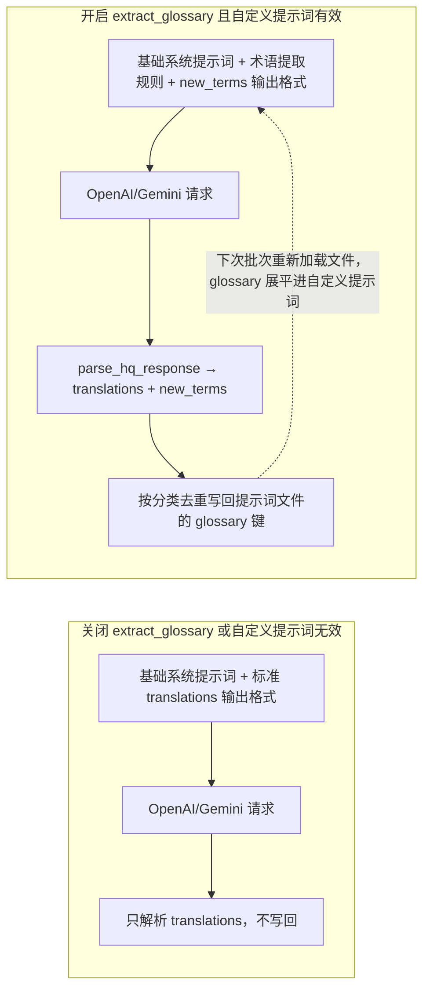
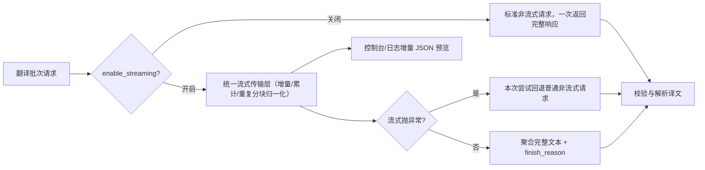

# 术语表、流式传输与断句换行

当长篇漫画需要保持一致的人名、地名和技能名，或希望翻译过程中能实时看到增量输出、让译文按原文行数断句时，本页用于配置自动术语提取（`translator.extract_glossary`）、流式传输（`translator.enable_streaming`）和 AI 断句（`render.disable_auto_wrap`）。术语提取结果会写回自定义提示词文件；流式传输只改变请求的传输方式；AI 断句通过断句提示词和 `original_region_count` 让模型输出 `[BR]` 换行标记。

本页不负责翻译器与目标语言选择（见[翻译器选择](./selection-and-languages.md)）、上下文历史与提示词组合全貌（见[上下文与提示词](./context-and-prompts.md)），也不负责渲染端自动换行、语义断句和标点清理的完整排版行为（见[排版与渲染](../settings/typesetting-and-rendering.md)）。

## 功能边界

- 当前配置模型中没有 `translator.glossary` 配置键；术语表以 `glossary` 键的形式存放在自定义 HQ 提示词文件（`translator.high_quality_prompt_path`）内，由自动提取功能写回。
- `translator.extract_glossary` 是自动术语提取开关；只有自定义 HQ 提示词成功加载时它才会进入提取分支，否则即使开关开启也走普通翻译。
- `translator.enable_streaming`（任务简报中的 `translator.stream` 即此键）只改变 OpenAI/Gemini（含 HQ 模式）请求的传输方式，不改变提示词、上下文、术语提取或最终译文。
- `render.disable_auto_wrap` 在界面中显示为“AI 断句 / AI Line Breaking”；它同时驱动翻译端断句提示词和渲染端的 `[BR]` 强制换行语义，渲染端自动换行等行为见排版与渲染页。
- `OPENAI_GLOSSARY_PATH`（“术语表路径 / Glossary Path”）是环境变量背书的旧式术语表路径，与 `extract_glossary` 的写回位置（自定义提示词文件）不同。

## UI 操作

### 在设置页开启术语提取与流式传输

1. 打开“设置”（`Settings`），选择“翻译”（`Translation`）分组。
2. 在“自动提取新术语”（`Auto Extract Glossary`）开关上启用或关闭。启用后右侧说明面板显示“自动从翻译结果中提取人名、地名等专有名词，确保长篇漫画翻译一致性。”
3. 在“启用流式传输”（`Enable Streaming`）开关上启用或关闭。说明面板显示流式与普通请求的差异。
4. 术语提取需要先在“自定义提示词”（`Custom Prompt`）中选择一个可解析的提示词文件，否则开关不会产生提取分支。
5. 打开“设置”→“排版”（`Typesetting`），在“AI 断句”（`AI Line Breaking`）开关上启用或关闭 AI 断句提示词。

### 在提示词预览中查看术语表

打开“提示词管理”（`Prompt Management`），选中自定义提示词文件后点击“提示词预览”（`Prompt Preview`）。若文件含 `glossary` 键，预览会显示“术语词典”（`Glossary`）分节和条目总数，并按 Person / Location / Org / Item / Skill / Creature 分类页签展示；没有条目时显示“没有术语条目”（`No glossary entries`）。

| UI 调用 key | English 实际值 | 简体中文实际值 |
| --- | --- | --- |
| `Settings` | Settings | 设置 |
| `Translation` | Translation | 翻译 |
| `Typesetting` | Typesetting | 排版 |
| `label_extract_glossary` | Auto Extract Glossary | 自动提取新术语 |
| `desc_translator_extract_glossary` | Auto-extract proper nouns (names, places) from translations to ensure consistency in long manga series. | 自动从翻译结果中提取人名、地名等专有名词，确保长篇漫画翻译一致性。 |
| `label_enable_streaming` | Enable Streaming | 启用流式传输 |
| `desc_translator_enable_streaming` | When enabled, supported OpenAI/Gemini translators, including HQ modes, prefer the unified streaming transport for incremental responses. When disabled, they always use standard non-streaming requests. | 启用后，OpenAI/Gemini（含高质量模式）会优先使用统一流式传输层实时接收增量响应；关闭后始终使用普通非流式请求。 |
| `label_disable_auto_wrap` | AI Line Breaking | AI 断句 |
| `desc_render_disable_auto_wrap` | Disable auto line wrapping. Recommended when AI line breaking is enabled. | 禁用自动换行。启用 AI 断句时建议开启。 |
| `label_check_br_and_retry` | AI Line Break Check | AI 断句检查 |
| `desc_render_check_br_and_retry` | Check AI line break results, auto-retry if unsatisfactory. ⚠️ Warning: May cause infinite loops, use with caution. | 检查 AI 断句结果，不符合要求则自动重试。⚠️ 注意：可能会陷入无限循环，请谨慎使用。 |
| `label_optimize_line_breaks` | AI Line Break Auto Enlarge | AI断句自动扩大文字 |
| `label_semantic_linebreak` | Chinese Semantic Line Break | 中文语义断句 |
| `label_remove_linebreak_punctuation` | Trim Around Line Breaks | 去除换行符周围逗号句号 |
| `label_OPENAI_GLOSSARY_PATH` | Glossary Path | 术语表路径 |
| `Glossary` | Glossary | 术语词典 |
| `No glossary entries` | No glossary entries | 没有术语条目 |
| `Settings Desc Header` | Parameter Description | 参数说明 |
| `Settings Desc Placeholder` | Click any setting on the left to view details | 点击左侧任意设置项查看详细说明 |

设置行右侧的说明面板由 `_get_setting_description()` 用 `desc_{full_key}`（`.` 替换为 `_`）查 locale，缺失时显示占位文案。

## 参数与选项

#### `translator.extract_glossary` — 自动提取新术语 / Auto Extract Glossary {#translator-extract-glossary}

- 控件：开关。
- 所在界面：设置 → 翻译；UI 调用 key 为 `label_extract_glossary`。
- 存储值：布尔；`true` 开启自动术语提取。
- 可选值：`true` / `false`；没有枚举下拉。
- 默认值：核心代码 `manga_translator/config.py#TranslatorConfig.extract_glossary` 为 `false`；Qt 模型 `desktop_qt_ui/core/config_models.py#TranslatorSettings.extract_glossary` 为 `false`；发行配置 `config/config-example.json` 为 `false`。
- 生效阶段：翻译（系统提示词构建、响应解析、术语写回提示词文件）。
- 原理：翻译器在每次尝试时计算 `extract_glossary = bool(custom_prompt_json) and config.extract_glossary`；两者都成立才走术语提取分支。开启时 `_build_system_prompt_with_glossary()` 在基础系统提示词后追加 `dict/glossary_extraction_prompt.yaml`（专有名词提取规则）和带 `new_terms` 要求的扩展输出格式；`parse_hq_response()` 返回 `(translations, new_terms)`，`new_terms` 经 `_emit_terms_from_list()` 去重输出，并通过 `merge_glossary_to_file(prompt_path, new_terms)` 写回自定义提示词文件的 `glossary` 键（按 Person / Location / Org / Item / Skill / Creature 分类，按原文去重）。每个批次重新加载提示词文件，`glossary` 内容会被 `_flatten_prompt_data()` 展平进自定义提示词文本，形成“提取 → 写回 → 下次请求携带”的反馈回路。
- 依赖与冲突：依赖 `translator.high_quality_prompt_path` 指向可解析的 YAML/JSON 文件；文件不可写或解析失败时只记录日志。只对 OpenAI/Gemini（含 HQ 模式）翻译器生效；Sakura、离线翻译器不消费该开关。写回会修改用户提示词文件，共享前需脱敏。
- 性能/API 成本：提示词增加提取规则与 `new_terms` 输出格式，单次请求 token 略增；写回是本地文件操作。
- 关联文件和调试产物：`dict/glossary_extraction_prompt.yaml`、`dict/system_prompt_hq_format.yaml`、自定义提示词文件（如 `dict/prompt_example.yaml` 或用户文件）、控制台/日志中的术语输出。
- 图示：术语提取开关分支（下图）。
- 源码依据：定义 `manga_translator/config.py`、`desktop_qt_ui/core/config_models.py`；界面绑定 `settings_tab_layout.json`、`app_logic.py`；消费者 `manga_translator/translators/common.py`、`openai.py`、`gemini.py`；持久化 `manga_translator/manga_translator.py#_load_and_prepare_prompts`、`prompt_loader.py`。
- 验证状态：完成（静态核对）。



开关只改变提示词内容与写回行为；译文数量校验、重试和候选轮换仍然照常。

#### `translator.enable_streaming` — 启用流式传输 / Enable Streaming {#translator-enable-streaming}

- 控件：开关。
- 所在界面：设置 → 翻译；UI 调用 key 为 `label_enable_streaming`。
- 存储值：布尔；`true` 优先使用流式传输。
- 可选值：`true` / `false`；没有枚举下拉。
- 默认值：核心代码 `manga_translator/config.py#TranslatorConfig.enable_streaming` 为 `true`；Qt 模型 `desktop_qt_ui/core/config_models.py#TranslatorSettings.enable_streaming` 为 `true`；发行配置 `config/config-example.json` 为 `false`。
- 生效阶段：翻译（请求传输）。
- 原理：`_is_streaming_enabled(ctx)` 优先读取 `ctx.config.translator.enable_streaming`，缺省回退实例 `_enable_streaming=True`。开启时 OpenAI 请求带 `stream=true`、Gemini 使用 `generate_content_stream`，统一由 `_run_unified_stream_transport()` 消费：归一化增量/累计/重复三种分块格式、轮询取消、首包与空闲 300 秒超时，并边收边输出 JSON 增量预览（`_emit_stream_json_preview`）。若流式请求抛出异常（如端点不支持流式），本次尝试回退为普通非流式请求；关闭时始终使用标准非流式请求。
- 依赖与冲突：只对 OpenAI/Gemini（含 HQ 模式）翻译器生效；流式与 API 候选槽轮换正交——整个发送操作包裹在 `_run_with_api_rotation()` 内，候选切换照常；RPM 限流在每次请求前生效，与是否流式无关。
- 性能/API 成本：流式不减少 token 用量，但能更早看到增量内容；对不支持流式的端点自动回退，不中断任务。
- 关联文件和调试产物：`manga_translator/translators/common.py#_run_unified_stream_transport`、`openai.py`、`gemini.py`、`openai_hq.py`、`gemini_hq.py`；控制台/日志的流式预览。
- 图示：流式开关与回退分支（下图）。
- 源码依据：定义 `manga_translator/config.py`、`desktop_qt_ui/core/config_models.py`；界面绑定 `settings_tab_layout.json`、`app_logic.py`；消费者 `manga_translator/translators/common.py`、`openai.py`、`gemini.py`。
- 验证状态：完成（静态核对）。



回退只影响单次尝试；若端点持续失败，重试与候选轮换机制照常接管。

#### `render.disable_auto_wrap` — AI 断句 / AI Line Breaking {#render-disable-auto-wrap}

- 控件：开关。
- 所在界面：设置 → 排版；UI 调用 key 为 `label_disable_auto_wrap`。
- 存储值：布尔；`true` 开启 AI 断句。
- 可选值：`true` / `false`；没有枚举下拉。
- 默认值：核心代码 `manga_translator/config.py#RenderConfig.disable_auto_wrap` 为 `false`；Qt 模型 `desktop_qt_ui/core/config_models.py#RenderSettings.disable_auto_wrap` 为 `true`；发行配置 `config/config-example.json` 为 `false`。
- 生效阶段：翻译（断句提示词与 `original_region_count`）与排版/渲染（`[BR]` 强制换行）。
- 原理：开启后两个消费点同时生效。翻译端 `manga_translator.py#_load_and_prepare_prompts()` 加载 `dict/system_prompt_line_break.yaml` 到 `ctx.line_break_prompt_json`；`_build_system_prompt_prefix()` 把它放到重试提示之后、自定义提示词之前；`_build_unified_user_prompt()` 为每个区域附加 `original_region_count`（区域行数，来自 `text_regions[].lines`，纯文本模式回退按换行符计数）。断句提示词按 N 给出 `[BR]` 数量指引（N=1 不插、N=2 恰好一个、N≥3 建议 N-1 或 N 段），并要求只用 `[BR]`、不用 `\n`。渲染端把 `[BR]`（含 `<br>`、`【BR】`）归一化为强制换行参与排版；`render.check_br_and_retry` 开启时，对区域数≥2 的译文检查 `[BR]` 缺失并触发重试，分割层级过深时跳过检查避免无限循环。
- 依赖与冲突：只对 OpenAI/Gemini（含 HQ 模式）翻译器有断句提示词意义；本地渲染始终处理 `[BR]` 标记。与 `optimize_line_breaks`、`semantic_linebreak`、`remove_linebreak_punctuation`、`check_br_and_retry` 联动，完整行为见[排版与渲染](../settings/typesetting-and-rendering.md)。替换翻译模式会强制 `disable_auto_wrap=true` 与 `layout_mode='strict'`。
- 性能/API 成本：断句提示词与 `original_region_count` 增加提示词长度；`check_br_and_retry` 可能触发多次重试。
- 关联文件和调试产物：`dict/system_prompt_line_break.yaml`、`manga_translator/translators/common.py`、`manga_translator/manga_translator.py`、`manga_translator/rendering/__init__.py`。
- 图示：断句开关分支（下图）。
- 源码依据：定义 `manga_translator/config.py`、`desktop_qt_ui/core/config_models.py`；界面绑定 `settings_tab_layout.json`、`app_logic.py`；消费者 `manga_translator/manga_translator.py#_load_and_prepare_prompts`、`manga_translator/translators/common.py`、`manga_translator/rendering/__init__.py`。
- 验证状态：完成（静态核对）。

```mermaid
flowchart LR
    subgraph Off["关闭 disable_auto_wrap"]
        O1["不加载断句提示词"] --> O2["用户提示词不带 original_region_count"]
        O2 --> O3["渲染：自动换行排版"]
    end
    subgraph On["开启 disable_auto_wrap"]
        A1["加载 system_prompt_line_break.yaml"] --> A2["断句提示进入系统提示词前缀"]
        A1 --> A3["每个区域附加 original_region_count"]
        A2 --> A4["OpenAI/Gemini 输出 [BR] 标记"]
        A3 --> A4
        A4 --> A5["渲染：按 [BR] 强制换行"]
        A5 --> A6{"check_br_and_retry 且区域≥2?"}
        A6 -->|译文缺 [BR]| A7["触发重试"]
        A6 -->|正常| A8["进入下一阶段"]
    end
```

渲染端自动换行、HanLP 语义断句和标点清理的完整分支见排版与渲染页；本页只说明断句提示词如何进入翻译请求。

## 运行机理

### 术语提取、合并与回填 {#glossary-feedback-loop}

术语提取依赖两条事实：只有 `custom_prompt_json` 非空且 `extract_glossary` 开启才进入提取分支；`merge_glossary_to_file()` 把新术语写回的是自定义提示词文件（`high_quality_prompt_path`），而不是 `OPENAI_GLOSSARY_PATH` 环境变量指向的文件。写回的 `glossary` 键按标准分类组织，同一原文去重；预览页按分类页签展示这些条目。反馈回路只在下次批次重新加载文件后生效，不修改当前已构建的请求。

### 流式传输层与回退 {#streaming-transport}

`_run_unified_stream_transport()` 兼容 OpenAI 异步迭代与 Gemini 同步迭代（后者放入线程消费），把增量、累计、重复三种常见分块统一为“只取新增部分”，支持取消轮询与超时。流式预览只作用于控制台/日志输出，最终仍以聚合完整文本走统一的响应校验与 `parse_hq_response()`。流式失败不会切换翻译器或候选，只是本次尝试回退普通请求。

### AI 断句提示词与 `[BR]` 标记 {#ai-line-break}

断句提示词位于系统提示词前缀：重试提示 → 断句提示 → 自定义提示词 → 基础系统提示词 → 输出格式。用户提示词附带 `original_region_count`，渲染端据此判断译文中的 `[BR]` 数量是否符合原文行数；`check_br_and_retry` 只对区域数≥2 且缺少 `[BR]` 的译文触发重试。

## 依赖与冲突

- `extract_glossary` 与 `high_quality_prompt_path` 强相关：没有有效自定义提示词就不会进入提取分支，术语也不会写回。
- `enable_streaming` 与提示词、上下文、术语提取相互独立；它只改变传输方式。
- `disable_auto_wrap` 同时影响翻译与渲染两个阶段；`optimize_line_breaks`、`semantic_linebreak`、`remove_linebreak_punctuation`、`check_br_and_retry` 的完整组合见排版与渲染页。
- 流式、RPM、普通重试与 API 候选轮换在同一请求路径上叠加；这些机制不改变术语与断句内容。
- 术语表与提示词文件可能包含业务文本。共享日志、请求导出或调试目录前必须删除请求正文、术语条目、路径与凭据。

## 关联文件与格式

| 文件/格式 | 本页实际作用 | 手改与兼容注意 |
| --- | --- | --- |
| `dict/glossary_extraction_prompt.yaml` | 自动术语提取规则 | 只有自定义提示词有效且 `extract_glossary` 开启时参与 |
| `dict/system_prompt_hq_format.yaml` | 标准/扩展输出格式（含 `new_terms` 规则占位符） | 缺失时减少输出约束，`new_terms` 规则不注入 |
| 自定义提示词文件（如 `dict/prompt_example.yaml`） | 术语 `glossary` 键的写回位置与下次请求的来源 | 写回会修改文件；共享前脱敏 |
| `dict/system_prompt_line_break.yaml` | AI 断句提示词 | 由 `render.disable_auto_wrap` 触发；只约束模型输出，不属于上下文历史 |
| `config/config-example.json` | 发行默认 `enable_streaming: false`、`extract_glossary: false`、`disable_auto_wrap: false` | 与核心/Qt 默认分开记录，不合并 |
| `config/config.json` | 运行时用户设置的持久化位置 | 不读取或展示真实用户文件 |
| `OPENAI_GLOSSARY_PATH`（`.env` 环境变量） | 旧式术语表路径（`keys.py` 定义） | 与 `extract_glossary` 的写回位置不同，当前翻译链路未消费 |

## Mermaid 数据流限制

上图描述的是源码中确认的提示词组装、请求传输与术语写回路径；不表示每次运行都开启术语提取或一定走流式。`extract_glossary` 关闭、自定义提示词无效、流式端点不支持、`disable_auto_wrap` 关闭都会走相应旁路。文档没有伪造运行截图或私有任务产物。

## 源码依据 {#source-evidence}

| 层级 | 文件 | 本页核对内容 |
| --- | --- | --- |
| 设置 UI | `desktop_qt_ui/ui/main_page/settings_tab_layout.json`、`desktop_qt_ui/ui/main_page/dynamic_settings.py` | 翻译/排版分组、开关控件、说明面板 |
| UI/i18n | `desktop_qt_ui/app_logic.py`、`desktop_qt_ui/locales/en_US.json`、`zh_CN.json` | key 映射与实际中英文显示值 |
| 配置模型 | `desktop_qt_ui/core/config_models.py`、`manga_translator/config.py` | Qt、发行与核心默认值 |
| 提示词加载/组合 | `manga_translator/translators/prompt_loader.py`、`translators/common.py` | YAML/JSON 解析、系统提示词前缀、术语与断句分支 |
| 翻译消费者 | `manga_translator/translators/openai.py`、`gemini.py`、`openai_hq.py`、`gemini_hq.py` | 流式传输、`parse_hq_response`、术语写回 |
| 调度与渲染 | `manga_translator/manga_translator.py`、`manga_translator/rendering/__init__.py` | `_load_and_prepare_prompts`、`[BR]` 强制换行 |
| 术语预览 | `desktop_qt_ui/ui/secondary_pages/prompt_preview.py` | `Glossary` 分节与分类页签 |

## 验证记录 {#verification}

| 验证内容 | 状态 | 说明 |
| --- | --- | --- |
| BLUEPRINT、PAGE_GUIDELINES、TODO | 完成 | 已完整读取并按页面合同编写 |
| UI 布局与调用 | 完成 | 静态核对设置布局、动态设置、提示词预览调用 |
| `en_US` / `zh_CN` 实际 locale | 完成 | 页面表格逐项记录 key、English、简体中文实际值 |
| 术语提取/流式/断句运行链 | 完成 | 静态核对提示词组装、统一流式传输层、术语写回与 `[BR]` 检查 |
| 脱敏运行验证 | 待后续 | 本页未读取真实 `.env`、用户 `config.json`、API key/token、用户名、用户图片或私有提示词 |
| VitePress | 待运行 | 由协调代理在合并前运行 `npm run docs:build --prefix doc/wiki` 及镜像/源码检查 |