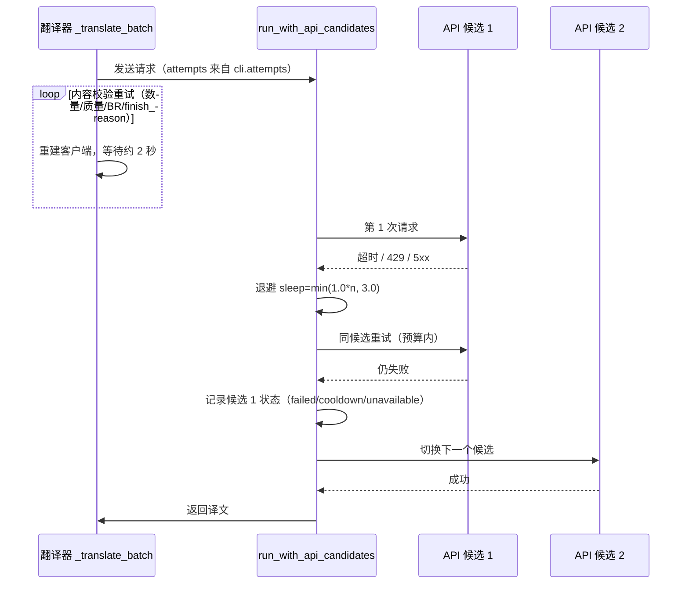
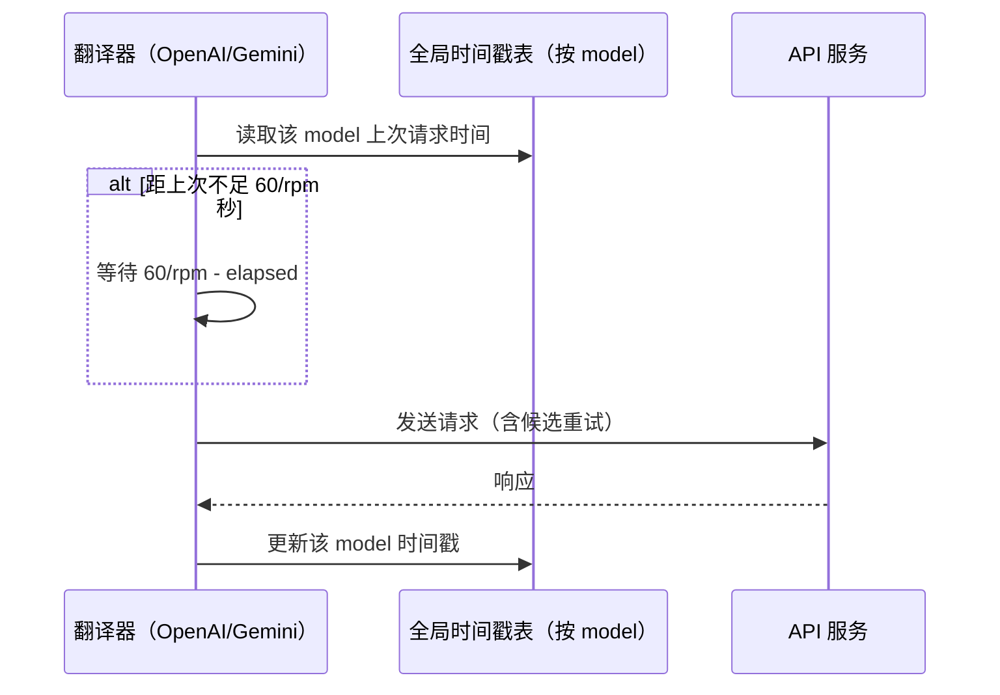
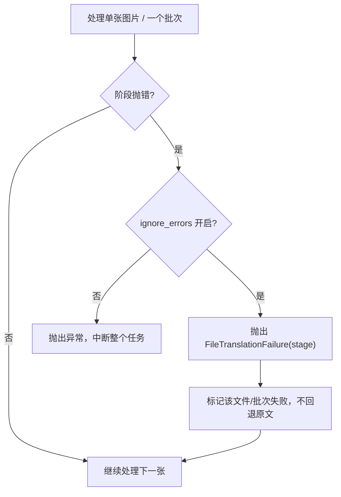
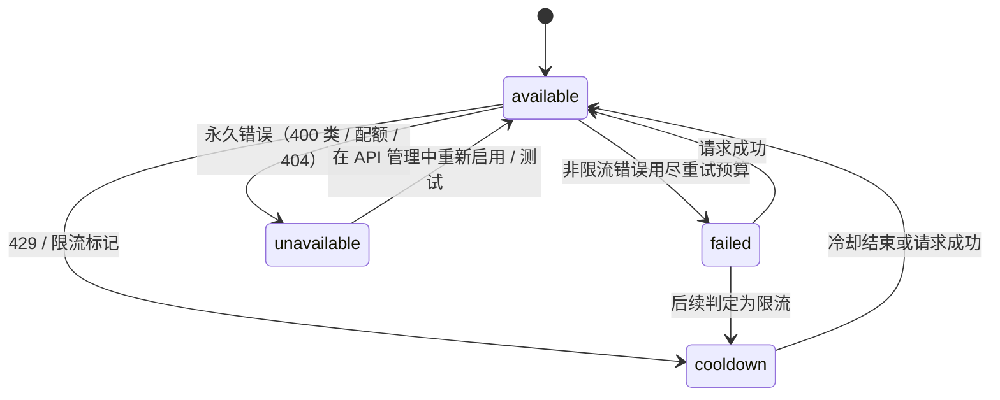
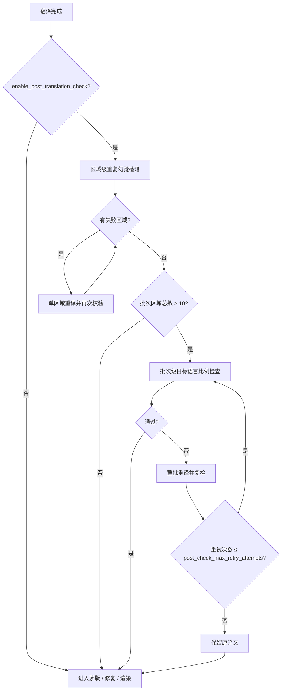

# 重试、限流与翻译质量

当翻译请求偶发超时、触发速率限制，或者需要控制 API 成本和失败对整批任务的影响时，使用本页配置重试次数（`cli.attempts`）、每分钟最大请求数（`translator.max_requests_per_minute`）、忽略错误（`cli.ignore_errors`）以及译后质量检查参数。本页不负责选择翻译器（见[翻译器选择与语言](./selection-and-languages.md)）、提示词与上下文组合（见[上下文与提示词](./context-and-prompts.md)），也不负责 API 候选槽的增删、`failover`/`round_robin` 策略和冷却恢复（见 API 管理页面）。

## 功能边界

- **负责**：`cli.attempts` 决定翻译请求在传输层与内容校验层的重试预算；`translator.max_requests_per_minute` 决定每分钟实际请求节奏；`cli.ignore_errors` 决定失败在文件/批次层面的隔离方式；`translator.enable_post_translation_check` 与三个 `post_check_*` 阈值参数决定译后质量检查。
- **不负责**：`OPENAI_API_KEY`/`_2`/`_3` 等候选槽的增删、轮换策略、冷却与不可用状态属于 API 管理；`cli.save_quality`（图像保存质量）是输出文件压缩质量，不是翻译质量。
- 高质量翻译（`openai_hq`/`gemini_hq`）与自定义提示词影响译文质量，但属于翻译器选择与提示词页面；本页只说明它们不参与重试计数。
- `cli.attempts` 与 `translator.post_check_max_retry_attempts` 是两个独立的重试预算：前者覆盖请求发送，后者覆盖译后检查，不能互相替代。

## UI 操作

### 在设置页配置重试与错误处理

1. 打开“设置”（`Settings`），选择“通用”（`General`）分组。
2. 在“重试次数”（`Retry Attempts`）输入整数：`-1` 表示无限重试，`0` 表示首次失败后不再重试，正数表示额外重试次数。
3. 打开“忽略错误”（`Ignore Errors`）后，单张图片或单个批次失败会被标记并继续处理后续图片；关闭时任一阶段异常会中断整个任务。

### 在设置页配置请求节奏

1. 在“设置”中选择“翻译”（`Translation`）分组。
2. 在“每分钟最大请求数”（`Max Requests Per Minute`）输入非负整数：`0` 表示不限制，正数表示每分钟最多发出的请求数。

### 译后质量检查选项

当前桌面设置布局 `desktop_qt_ui/ui/main_page/settings_tab_layout.json` 的“翻译”分组不包含译后检查开关和阈值行；`translator.enable_post_translation_check`、`translator.post_check_max_retry_attempts`、`translator.post_check_repetition_threshold`、`translator.post_check_target_lang_threshold` 由后端 `Config` 读取，仅通过 CLI/JSON 配置生效。i18n 中已存在对应标签（如 `label_enable_post_translation_check`），但当前 Qt 模型 `TranslatorSettings` 与设置布局均未绑定这些字段，不能把它们描述为界面可见控件。

| UI 调用 key | English 实际值 | 简体中文实际值 |
| --- | --- | --- |
| `Settings` | Settings | 设置 |
| `General` | General | 通用 |
| `Translation` | Translation | 翻译 |
| `label_attempts` | Retry Attempts | 重试次数 |
| `desc_cli_attempts` | Retry count when an API call fails. Set to -1 for unlimited retries. | 调用 API 出错时的重试次数。设为 -1 表示无限重试。 |
| `label_ignore_errors` | Ignore Errors | 忽略错误 |
| `desc_cli_ignore_errors` | Ignore errors and continue processing remaining images without interrupting the task. | 遇到错误时忽略并继续处理后续图片，不中断整个任务。 |
| `label_max_requests_per_minute` | Max Requests Per Minute | 每分钟最大请求数 |
| `desc_translator_max_requests_per_minute` | Maximum requests per minute. Set to 0 for no limit. Used to avoid API rate limits. | 每分钟最大请求数。设为 0 表示不限制。用于避免触发 API 速率限制。 |
| `label_enable_post_translation_check` | Enable Post-Translation Check | 启用翻译后检查 |
| `label_post_check_max_retry_attempts` | Max Retry Attempts | 翻译检查最大重试次数 |
| `label_post_check_repetition_threshold` | Repetition Detection Threshold | 重复检测阈值 |
| `label_post_check_target_lang_threshold` | Target Language Ratio Threshold | 目标语言比例阈值 |
| `label_save_quality` | Image Save Quality | 图像保存质量 |

## 参数与选项

#### `cli.attempts` — 重试次数 / Retry Attempts {#cli-attempts}

- 控件：整数输入框。
- 所在界面：设置 → 通用；UI 调用 key 为 `label_attempts`，说明 key 为 `desc_cli_attempts`。
- 存储值：整数；`-1` 无限重试，`0` 不重试，正数表示额外重试次数。小于 `-1` 的值被 `utils/retry.py` 归一化为 `0`（不重试）。
- 可选值：整数，没有枚举下拉选项。
- 默认值：核心 `manga_translator/config.py#CliConfig.attempts` 为 `-1`；Qt 模型 `desktop_qt_ui/core/config_models.py#CliSettings.attempts` 为 `-1`；发行配置 `config/config-example.json` 为 `3`。
- 生效阶段：翻译请求的发送与内容校验。
- 原理：该值先被归一化，再换算为“总尝试次数”（`attempts + 1`，`-1` 保持无限）。同一预算在两个嵌套层生效：`api_key_rotation.run_with_api_candidates` 在每个候选上对可重试错误（超时、429、5xx 等）按此预算重试，间隔为 `min(1.0 * 尝试序号, 3.0)` 秒；OpenAI/Gemini 的 `_translate_batch` 再对数量不匹配、质量检查失败、BR 标记缺失和异常 `finish_reason` 按同一上限重试，重试前重建客户端并等待约 2 秒。两层嵌套会让实际 HTTP 请求数超过 `attempts + 1`。
- 依赖与冲突：`-1` 可能让内容过滤或持续 5xx 无限重试；`attempts` 不限制译后检查的重试，也不改变 RPM 限流节奏。
- 性能/API 成本：无限或过大的预算会放大请求量并延长单图耗时；与 RPM 限流叠加时总等待时间更长。
- 源码依据：`manga_translator/utils/retry.py`、`manga_translator/api_key_rotation.py#run_with_api_candidates`、`manga_translator/translators/openai.py#_translate_batch`、`desktop_qt_ui/app_logic.py#get_display_mapping`。

#### `translator.max_requests_per_minute` — 每分钟最大请求数 / Max Requests Per Minute {#max-requests-per-minute}

- 控件：整数输入框。
- 所在界面：设置 → 翻译；UI 调用 key 为 `label_max_requests_per_minute`，说明 key 为 `desc_translator_max_requests_per_minute`。
- 存储值：非负整数；`0` 表示不限制。
- 可选值：整数，没有枚举下拉选项。
- 默认值：核心 `manga_translator/config.py#TranslatorConfig.max_requests_per_minute`、Qt 模型与发行配置均为 `0`。
- 生效阶段：翻译请求发送前的节奏控制，以及请求后的时间戳更新。
- 原理：OpenAI/Gemini（含 HQ）在 `parse_args` 中把该值写入 `_MAX_REQUESTS_PER_MINUTE`，并按模型名在类级全局时间戳表 `_GLOBAL_LAST_REQUEST_TS` 中记录上次请求时间。每次发送前若距上次不足 `60 / rpm` 秒则等待；重试会重新进入该检查，因此重试也计入限流。基础 `CommonTranslator.translate()` 另有 `_ratelimit_sleep()`，使用实例级 `_last_request_ts`。
- 依赖与冲突：该值是请求速率上限而非并发上限；它不自动处理 429，429 的重试与候选切换由 `cli.attempts` 和候选轮换负责。
- 性能/API 成本：值越小请求越稀疏；设为 `1` 时相邻请求至少间隔 60 秒，长漫画会显著变慢。
- 源码依据：`manga_translator/translators/openai.py#parse_args`、`gemini.py#parse_args`、`manga_translator/translators/common.py#_ratelimit_sleep`、`manga_translator/config.py#TranslatorConfig`。

#### `cli.ignore_errors` — 忽略错误 / Ignore Errors {#cli-ignore-errors}

- 控件：开关。
- 所在界面：设置 → 通用；UI 调用 key 为 `label_ignore_errors`，说明 key 为 `desc_cli_ignore_errors`。
- 存储值：布尔值。
- 可选值：`true` / `false`（开关）。
- 默认值：核心 `manga_translator/config.py#CliConfig.ignore_errors`、Qt 模型与发行配置均为 `false`。
- 生效阶段：单图各阶段（上色、超分、检测、OCR、修复、渲染）与翻译批次的异常处理。
- 原理：各阶段捕获异常后先判断 `self.ignore_errors`：关闭时直接抛出并中断任务；开启时抛出 `FileTranslationFailure(stage)`，由批次循环把该文件标记为失败并继续处理后续图片。翻译批次失败时标记当前批次全部文件失败，不回退原文。取消检查不受该开关影响。
- 依赖与冲突：隔离粒度是文件/批次，不是单个文本区域；它不能掩盖模型加载失败、取消或致命初始化错误。
- 源码依据：`manga_translator/manga_translator.py#parse_init_params`、`#_translate_batch`、`#FileTranslationFailure`、`desktop_qt_ui/app_logic.py#get_display_mapping`。

#### `translator.enable_post_translation_check` — 启用翻译后检查 / Enable Post-Translation Check {#enable-post-translation-check}

- 控件：无界面控件（当前桌面布局未绑定；i18n 存在 `label_enable_post_translation_check`）。
- 所在界面：后端 `Config.translator`，通过 CLI/JSON 配置。
- 存储值：布尔值。
- 可选值：`true` / `false`。
- 默认值：核心 `manga_translator/config.py#TranslatorConfig.enable_post_translation_check` 为 `false`；Qt 模型与发行配置未序列化该键（`—`）。
- 生效阶段：翻译完成后、蒙版/修复/渲染之前。
- 原理：开启后对每个文本区域做重复内容幻觉检测；失败区域进入 `_retry_translation_with_validation` 重译，最多重试 `post_check_max_retry_attempts` 次。批次级目标语言比例检查在批次区域总数超过 10 时参与，失败时按同一上限整批重译；最终仍不合格时保留原译文。
- 依赖与冲突：依赖 `translator.target_lang` 与 `post_check_*` 阈值；`cli.attempts` 不控制本开关下的重试。
- 源码依据：`manga_translator/config.py#TranslatorConfig`、`manga_translator/manga_translator.py#_validate_translation`、`#_retry_translation_with_validation`。

#### `translator.post_check_max_retry_attempts` — 翻译检查最大重试次数 / Max Retry Attempts {#post-check-max-retry-attempts}

- 控件：无界面控件（i18n 存在 `label_post_check_max_retry_attempts`）。
- 所在界面：后端 `Config.translator`，通过 CLI/JSON 配置。
- 存储值：非负整数。
- 可选值：整数，没有枚举下拉选项。
- 默认值：核心 `manga_translator/config.py#TranslatorConfig.post_check_max_retry_attempts` 为 `3`；Qt 模型与发行配置未序列化该键（`—`）。翻译器内部兜底为 `2`（`common.py#Translator.__init__`）。
- 生效阶段：译后质量检查失败区域的单区域重译。
- 原理：`_retry_translation_with_validation` 循环调用 `_validate_translation`，不合格时对单个区域重新调用 `dispatch` 翻译并再次校验；达到上限仍未通过时保留原译文。
- 依赖与冲突：只在 `enable_post_translation_check=true` 时生效；与 `cli.attempts` 相互独立。
- 源码依据：`manga_translator/manga_translator.py#_retry_translation_with_validation`、`manga_translator/translators/common.py#parse_args`。

#### `translator.post_check_repetition_threshold` — 重复检测阈值 / Repetition Detection Threshold {#post-check-repetition-threshold}

- 控件：无界面控件（i18n 存在 `label_post_check_repetition_threshold`）。
- 所在界面：后端 `Config.translator`，通过 CLI/JSON 配置。
- 存储值：正整数。
- 可选值：整数，没有枚举下拉选项。
- 默认值：核心 `manga_translator/config.py#TranslatorConfig.post_check_repetition_threshold` 为 `20`；Qt 模型与发行配置未序列化该键（`—`）。翻译器内部兜底为 `5`。
- 生效阶段：译后质量检查的区域级重复幻觉检测。
- 原理：`_check_repetition_hallucination` 依次检查字符级连续重复、词语/汉字连续重复和短语重复；达到阈值即判定为幻觉并触发重译。
- 依赖与冲突：阈值越小越敏感；与目标语言比例检查是“或”关系，任一失败都会触发重试路径。
- 源码依据：`manga_translator/manga_translator.py#_check_repetition_hallucination`。

#### `translator.post_check_target_lang_threshold` — 目标语言比例阈值 / Target Language Ratio Threshold {#post-check-target-lang-threshold}

- 控件：无界面控件（i18n 存在 `label_post_check_target_lang_threshold`）。
- 所在界面：后端 `Config.translator`，通过 CLI/JSON 配置。
- 存储值：浮点数（比例）。
- 可选值：`0`–`1` 之间的比例值；没有枚举下拉选项。
- 默认值：核心 `manga_translator/config.py#TranslatorConfig.post_check_target_lang_threshold` 为 `0.5`；Qt 模型与发行配置未序列化该键（`—`）。
- 生效阶段：译后质量检查的批次级目标语言比例检查。
- 原理：批次内文本区域总数超过 10 时，把该批次所有区域的译文合并后用 py3langid 检测语言，并与 `target_lang` 比较；不通过时按 `post_check_max_retry_attempts` 整批重译。当前 `_check_target_language_ratio` 保留了 `min_ratio` 参数但新逻辑未实际使用该值，只做“是否为目标语言”的二元判断。
- 依赖与冲突：需要 `enable_post_translation_check=true` 且批次区域总数大于 10；区域较少时跳过该检查。
- 源码依据：`manga_translator/manga_translator.py#_check_target_language_ratio`、`#_validate_translation`。

## 运行机理

### 重试层级与候选轮换 {#retry-layers}

`cli.attempts` 是“重试次数”，不是“总请求次数”。它同时被两个嵌套层使用：候选轮换层在同一个 API 候选上重试可重试错误，直到预算用尽或遇到永久错误才切换候选；内容校验层对“数量不匹配、质量检查失败、BR 标记缺失、异常 finish_reason”重试。因此一次翻译操作可能发出远多于 `attempts + 1` 次 HTTP 请求。

### RPM 请求节奏 {#rpm-pacing}

`translator.max_requests_per_minute` 为 `0` 时不限流；为正数时相邻请求至少间隔 `60 / rpm` 秒。OpenAI/Gemini 系列按模型名维护跨实例共享的时间戳，重试也会重新进入节奏检查。

### 失败隔离与候选状态 {#failure-isolation}

失败隔离有两层。文件/批次层由 `cli.ignore_errors` 控制：关闭时异常直接中断任务，开启时抛出 `FileTranslationFailure(stage)` 标记当前文件失败并继续。候选层由 `api_key_rotation` 的状态机控制：只有 `unavailable` 和仍在冷却期的 `cooldown` 会从候选列表中排除，普通 `failed` 状态不排除候选，下次请求仍可再试。

候选状态机如下。冷却时长默认 60 秒，若响应带 `Retry-After` 则采用该值，上限 600 秒；永久错误（400 类、402、404、配额、无效密钥）直接进入 `unavailable`，只能通过 API 管理中重新启用或测试来清除。

### 译后质量检查流程 {#post-check-flow}

译后检查只在 `translator.enable_post_translation_check=true` 时运行，且当前桌面布局未暴露该开关。检查分两层：先对每个区域做重复幻觉检测并对失败区域单区域重译，再对整批做目标语言比例检查并对整批重译；两个循环都受 `post_check_max_retry_attempts` 约束。

## 依赖与冲突

- `cli.attempts`、`translator.max_requests_per_minute`、`cli.ignore_errors` 与译后检查是四个独立维度：重试预算、请求节奏、失败隔离和质量检查互不替代。
- `attempts=-1` 与内容过滤/持续 5xx 叠加可能长时间不退出；`max_requests_per_minute` 只限制发送节奏，不降低单次请求成本。
- `ignore_errors` 是文件/批次级隔离；区域内单条失败仍会走质量重试或保留原文，不受该开关影响。
- 候选轮换只在存在多个 API 候选时发挥作用；单候选时 `cli.attempts` 决定该候选上的重试预算。候选状态跨任务保留在进程内，不写入配置文件。
- `save_quality`（图像保存质量）与 `context_size`（上下文页数）也会影响“质量”观感，但它们分别是输出压缩质量和上下文质量，见[CLI 批量与输出](../settings/cli-batch-and-output.md)和[上下文与提示词](./context-and-prompts.md)。

## 关联文件与格式

| 文件/格式 | 本页实际作用 | 手改与兼容注意 |
| --- | --- | --- |
| `config/config-example.json` | 发行默认 `attempts: 3`、`max_requests_per_minute: 0`、`ignore_errors: false` | 只使用脱敏示例；用户配置导入会覆盖内存设置 |
| `config/config.json` | 运行时用户设置的持久化位置 | 不读取或展示真实用户文件 |
| `.env` 与 API 管理槽 | 提供 API 候选；重试与限流作用于候选请求 | 不展示真实密钥；候选增删与策略见 API 管理页面 |
| `manga_translator_work/` 调试目录 | 失败文件按工作流规则保留调试产物 | 分享前删除请求正文、密钥与私有路径 |

## Mermaid 数据流限制

上图描述的是源码中可确认的请求与状态转换，不表示每次运行都会重试或限流。`attempts=0`、RPM 为 `0`、单候选、`ignore_errors=false`、译后检查关闭都会走相应旁路；候选冷却/不可用只在发生过失败后出现。文档没有伪造运行截图或私有任务产物。

## 源码依据 {#source-evidence}

| 层级 | 文件 | 本页核对内容 |
| --- | --- | --- |
| 设置 UI | `desktop_qt_ui/ui/main_page/settings_tab_layout.json`、`desktop_qt_ui/ui/main_page/dynamic_settings.py` | 通用/翻译分组的整数输入与开关控件 |
| UI/i18n | `desktop_qt_ui/app_logic.py`、`desktop_qt_ui/locales/en_US.json`、`zh_CN.json` | 标签与说明 key 的实际中英文值 |
| 配置模型 | `desktop_qt_ui/core/config_models.py`、`manga_translator/config.py` | Qt、发行与核心默认值；Qt 模型未序列化译后检查键 |
| 重试归一化 | `manga_translator/utils/retry.py` | `normalize_retry_attempts`、`resolve_total_attempts`、可重试错误分类 |
| 候选轮换 | `manga_translator/api_key_rotation.py`、`manga_translator/runtime_api_resolver.py` | 候选状态机、冷却/不可用、`run_with_api_candidates` |
| 翻译消费者 | `manga_translator/translators/openai.py`、`gemini.py`、`openai_hq.py`、`gemini_hq.py`、`common.py` | `_translate_batch` 重试循环、RPM 时间戳、`parse_args` |
| 失败隔离 | `manga_translator/manga_translator.py` | `ignore_errors` 分支、`FileTranslationFailure`、批次失败标记 |
| 译后检查 | `manga_translator/manga_translator.py` | `_validate_translation`、`_retry_translation_with_validation`、重复幻觉与目标语言检查 |
| 桌面装配 | `desktop_qt_ui/app_logic.py#_do_processing` | 配置字典到 `MangaTranslator` 参数的传递 |

## 验证记录 {#verification}

| 验证内容 | 状态 | 说明 |
| --- | --- | --- |
| BLUEPRINT、PAGE_GUIDELINES、TODO | 完成 | 已完整读取并按页面合同编写 |
| UI 布局与调用 | 完成 | 静态核对设置布局、动态设置与显示映射 |
| `en_US` / `zh_CN` 实际 locale | 完成 | 页面表格逐项记录 key、English、简体中文实际值 |
| 重试/RPM/译后检查运行链 | 完成 | 静态核对 `utils/retry.py`、`api_key_rotation.py`、OpenAI/Gemini 与 `manga_translator.py` |
| 脱敏运行验证 | 待后续 | 未读取真实 `.env`、用户 `config.json`、API key/token、用户名、用户图片或私有提示词 |
| VitePress | 待运行 | 由协调代理在合并前运行 `npm run docs:build --prefix doc/wiki` 及镜像/源码检查 |
