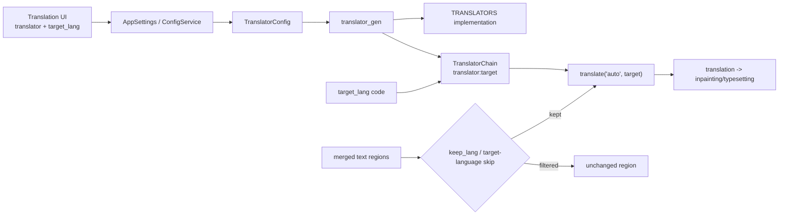
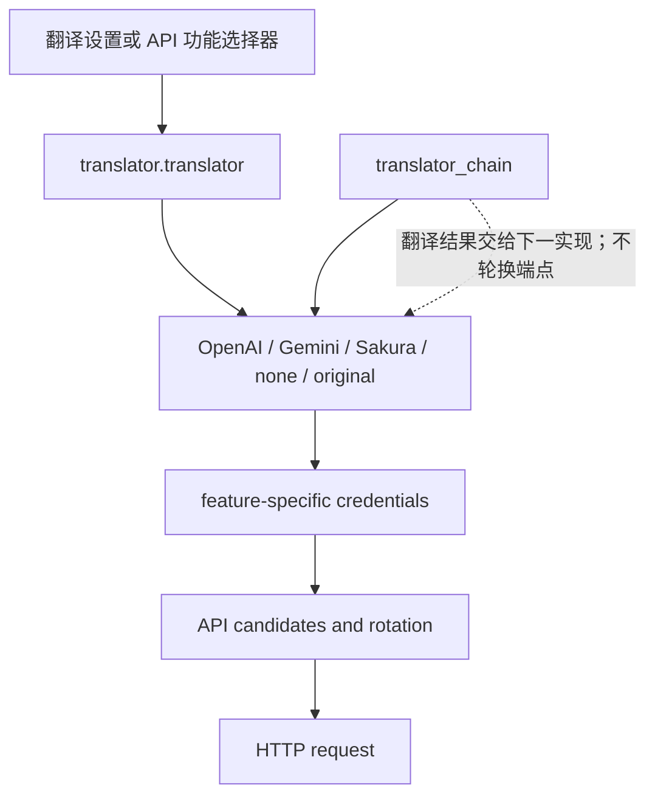

# 翻译器选择与目标语言

本页说明桌面设置中的翻译器选择、目标语言以及合并后的源语言过滤。它决定使用哪个翻译实现和翻译成什么语言，不负责 API 密钥槽轮换、提示词编辑、上下文构造或翻译链的详细策略。

## 功能边界

- `translator.translator` 选择 OpenAI、Gemini、Sakura、高质量变体、无翻译或保留原文；它改变翻译实现，不是同一提供商内的 API 候选切换。
- `translator.target_lang` 使用三字母存储代码，作为单个翻译请求的目标语言。
- `translator.keep_lang` 在文本行合并后按检测到的源语言筛选继续处理的区域；不匹配的区域保留原图，不擦除、不翻译、不渲染。
- `translator.no_text_lang_skip` 控制是否跳过已经是目标语言的文本；开启“不跳过目标语言文本”时强制送入翻译。
- API Key/Base/Model、`failover`/`round_robin`、提示词、术语、流式、RPM 和质量重试属于 API 管理或其他翻译器页面。

## UI 操作

### 在 Translation 设置页选择

1. 打开设置页并选择“Translation”。`settings_tab_layout.json` 将本页字段依次绑定到 `translator.translator`、`translator.target_lang`、`translator.keep_lang` 和 `translator.no_text_lang_skip`。
2. 在“翻译器”下拉框选择实现；显示值来自 `app_logic.py` 动态映射，不直接显示 Python 枚举名。
3. 在“目标语言”下拉框选择语言；显示值由 `lang_<code>` locale key 生成，保存时反向映射回代码，例如“英语”保存为 `ENG`。
4. 在“保留源语言”中选择源语言或“不过滤”。选择语言后，只有检测为该语言的区域继续到翻译和后续图像处理。
5. 打开“不跳过目标语言文本”后，目标语言检测结果也会被强制翻译；修改会立即更新内存配置并持久化。

API 管理页的翻译器功能选择器也写入同一个 `translator.translator` 键，并刷新所需凭据分组；它不是另一个独立翻译器配置。API 槽只改变已选提供商内部的请求端点。

### 文案证据：调用 key -> locale 实际值

| UI 调用 key | `en_US.json` 实际值 | `zh_CN.json` 实际值 |
| --- | --- | --- |
| `label_translator` | Translator | 翻译器 |
| `label_target_lang` | Target Language | 目标语言 |
| `label_keep_lang` | Keep Source Language | 保留源语言 |
| `label_no_text_lang_skip` | Don't Skip Target Lang | 不跳过目标语言文本 |
| `translator_openai_hq` | OpenAI High Quality | OpenAI高质量翻译 |
| `translator_gemini_hq` | Gemini High Quality | Gemini高质量翻译 |
| `translator_none` | None | 无 |
| `translator_original` | Original | 原文 |
| `lang_CHS` | Simplified Chinese | 简体中文 |
| `lang_CHT` | Traditional Chinese | 繁体中文 |
| `lang_ENG` | English | 英语 |
| `lang_JPN` | Japanese | 日语 |
| `lang_KOR` | Korean | 韩语 |
| `lang_FRA` | French | 法语 |
| `lang_DEU` | German | 德语 |
| `lang_ESP` | Spanish | 西班牙语 |
| `lang_RUS` | Russian | 俄语 |
| `lang_ARA` | Arabic | 阿拉伯语 |

`Google Gemini`、`OpenAI` 和 `Sakura` 是 `app_logic.py` 中的硬编码显示值，而不是 locale key；页面保留代码实际值，不自行改写。

## 选项中英对照

### `translator.translator` — 翻译器 / Translator

| 存储值 | English | 简体中文 | 适用条件 |
| --- | --- | --- | --- |
| `openai` | OpenAI | OpenAI | 需要翻译 API 凭据 |
| `openai_hq` | OpenAI High Quality | OpenAI高质量翻译 | 需要 OpenAI 凭据和高质量提示词；Qt 默认 |
| `gemini` | Google Gemini | Google Gemini | 需要 Gemini 凭据 |
| `gemini_hq` | Gemini High Quality | Gemini高质量翻译 | 需要 Gemini 凭据和高质量提示词 |
| `sakura` | Sakura | Sakura | 需要 Sakura 地址/字典配置 |
| `none` | None | 无 | 不执行翻译 |
| `original` | Original | 原文 | 保留原文结果 |

OpenAI/Gemini（含 HQ）分别激活 `translator_openai`/`translator_gemini` API 分组；Sakura 激活 `translator_sakura`。无 API 实现不会要求凭据卡片。

### `translator.target_lang` — 目标语言 / Target Language

目标语言由 `TranslationService.get_target_languages()` 实际提供，不是任意 locale 名称。

| 存储值 | English | 简体中文 |
| --- | --- | --- |
| `CHS` | Simplified Chinese | 简体中文 |
| `CHT` | Traditional Chinese | 繁体中文 |
| `CSY` | Czech | 捷克语 |
| `NLD` | Dutch | 荷兰语 |
| `ENG` | English | 英语 |
| `FRA` | French | 法语 |
| `DEU` | German | 德语 |
| `HUN` | Hungarian | 匈牙利语 |
| `ITA` | Italian | 意大利语 |
| `JPN` | Japanese | 日语 |
| `KOR` | Korean | 韩语 |
| `POL` | Polish | 波兰语 |
| `PTB` | Portuguese (Brazil) | 葡萄牙语（巴西） |
| `ROM` | Romanian | 罗马尼亚语 |
| `RUS` | Russian | 俄语 |
| `ESP` | Spanish | 西班牙语 |
| `TRK` | Turkish | 土耳其语 |
| `UKR` | Ukrainian | 乌克兰语 |
| `VIN` | Vietnamese | 越南语 |
| `ARA` | Arabic | 阿拉伯语 |
| `SRP` | Serbian | 塞尔维亚语 |
| `HRV` | Croatian | 克罗地亚语 |
| `THA` | Thai | 泰语 |
| `IND` | Indonesian | 印度尼西亚语 |
| `FIL` | Filipino (Tagalog) | 菲律宾语（他加禄语） |

这是 UI 当前展示的 25 个值。后端 `VALID_LANGUAGES` 是链配置校验边界；不要把未出现在服务映射中的语言写成 UI 可选项。

### `translator.keep_lang` — 保留源语言 / Keep Source Language

| 存储值 | English | 简体中文 | 行为 |
| --- | --- | --- | --- |
| `none` | No Filter | 不过滤 | 关闭源语言筛选 |
| `CHS` | Simplified Chinese | 简体中文 | 仅保留检测为简体中文的区域 |
| `CHT` | Traditional Chinese | 繁体中文 | 仅保留检测为繁体中文的区域 |
| `ENG` | English | 英语 | 仅保留检测为英语的区域 |
| `JPN` | Japanese | 日语 | 仅保留检测为日语的区域 |
| `KOR` | Korean | 韩语 | 仅保留检测为韩语的区域 |
| 其他 `KEEP_LANGUAGES` 代码 | 对应 `lang_<code>` English 值 | 对应 `lang_<code>` 中文值 | 由后端实际集合决定 |

`none` 是 UI 添加的禁用值；“保留源语言”不是目标语言选择。

## 默认值矩阵与参数边界

| 参数 | 核心 `manga_translator/config.py` | Qt `desktop_qt_ui/core/config_models.py` | 发行配置/启动时可见值 | 阶段与最终消费者 |
| --- | --- | --- | --- | --- |
| `translator.translator` | `openai_hq` | `openai_hq` | `openai_hq` | 翻译；`translator_gen`、`get_translator()` |
| `translator.target_lang` | `ENG` | `CHS` | `CHS` | 翻译；`TranslationService`、`TranslatorChain`、区域默认值 |
| `translator.keep_lang` | `none` | `none` | `none` | 合并后语言过滤；翻译流水线 |
| `translator.no_text_lang_skip` | `False` | `False` | `False` | 翻译前跳过判断 |

核心默认与 Qt 默认不同：桌面启动使用 `CHS`，独立核心兜底为 `ENG`。导入配置、显式 CLI 参数或编辑器区域级目标语言可以覆盖它们。

#### `translator.translator` — 翻译器 / Translator

- 控件：下拉框；Translation 设置页和 API 管理翻译选择器共用配置键。
- 生效阶段：翻译调度前；创建具体实现并刷新 API 分组。
- 依赖与冲突：OpenAI/Gemini/HQ 需要凭据，Sakura 需要地址/字典；`none`/`original` 不产生远程请求。提供商切换不等于槽轮换。
- 消费者：`Translator`、`TRANSLATORS`、`get_translator()`、`TranslationService`。

#### `translator.target_lang` — 目标语言 / Target Language

- 控件：下拉框；保存三字母代码，显示使用 `lang_<code>`。
- 生效阶段：请求构造；请求表示为 `<translator>:<target_lang>`，区域缺省值使用当前配置。
- 依赖与冲突：必须属于 UI 列表和翻译器支持边界；`supports_languages(..., fatal=True)` 可拒绝不支持的链目标。
- 消费者：`TranslationService.set_target_language()`、`TranslatorChain`、`translators.prepare/dispatch()` 和文件服务。

#### `translator.keep_lang` — 保留源语言 / Keep Source Language

- 控件：下拉框；`none` 关闭过滤。
- 生效阶段：文本行合并后、翻译/擦除/渲染前。
- 依赖与冲突：依赖 OCR、语言检测和合并区域；误判会留下原文，不能替代目标语言。
- 消费者：`KEEP_LANGUAGES`、翻译流水线语言筛选和区域状态。

#### `translator.no_text_lang_skip` — 不跳过目标语言文本 / Don't Skip Target Lang

- 控件：开关；默认 `False`。
- 生效阶段：翻译前过滤。
- 依赖与冲突：开启会增加请求和 API 成本；不改变 `keep_lang` 或目标语言。
- 消费者：`TranslatorConfig` 和目标语言跳过判断。

## 运行机理

`TranslationService` 接收 UI 保存的枚举和语言代码，构造一个 `TranslatorChain`，再由 `translators.dispatch()` 按链顺序调用实现。`translator_chain` 或 `selective_translation` 是串联/按语言选择，不是 API 槽轮换。API 管理仍可改变同一个 `translator.translator` 键；候选解析和冷却属于 API 管理范围。

## 依赖与冲突

- Detection/OCR 必须先产生文本区域和源语言信息，`keep_lang` 才能工作；它在合并后执行。
- `none` 不执行翻译，`original` 明确保留原文结果。二者都不需要远程 API，后续排版仍由工作流决定。
- HQ 选项依赖对应高质量提示词资源；`extract_glossary` 也依赖 HQ 提示词配置。
- 改变目标语言会改变请求和排版输入，但不会自动改变 OCR 语言、渲染方向或提供商。
- `keep_lang` 按源语言过滤；`no_text_lang_skip` 控制目标语言跳过。源语言过滤仍先执行。

## 关联文件与格式

| 文件或字段 | 用途 | 格式与注意事项 |
| --- | --- | --- |
| `config/config.json` | 持久化 `translator` 设置 | JSON；导入会校验并替换内存设置；不要粘贴用户私有配置 |
| `config/config-example.json` | 无私密字段示例 | 仅作字段参考；核心和 Qt 默认可能不同 |
| `.env` | API 凭据、地址和模型 | 不展示真实密钥、令牌或用户值 |
| `dict/prompt_example.yaml` | HQ 提示词资源路径 | YAML；自定义提示词另页说明 |
| 翻译 JSON 区域 `target_lang` | 区域级回退/序列化 | 仅在写入它的工作流中出现，与全局设置不同 |

## 翻译器与 API 选择边界

翻译器选择改变实现；API 功能选择器是另一个 UI 写入点；Key/Base/Model 槽与 `failover`/`round_robin` 只在已选实现内部轮换；`translator_chain` 把结果传给下一翻译器。

## 源码依据

| 层级 | 绝对路径 | 核对内容 |
| --- | --- | --- |
| UI 布局 | `C:/manga-translator-ui-package/desktop_qt_ui/ui/main_page/settings_tab_layout.json` | Translation 页字段和顺序 |
| UI 映射 | `C:/manga-translator-ui-package/desktop_qt_ui/app_logic.py` | 翻译器、语言、保留语言和标签映射 |
| UI 服务 | `C:/manga-translator-ui-package/desktop_qt_ui/services/translation_service.py` | 翻译器/语言列表和请求链构造 |
| Qt 默认 | `C:/manga-translator-ui-package/desktop_qt_ui/core/config_models.py` | 桌面默认值 |
| 核心定义 | `C:/manga-translator-ui-package/manga_translator/config.py` | 枚举、`TranslatorConfig`、链解析和核心默认 |
| 调度 | `C:/manga-translator-ui-package/manga_translator/translators/__init__.py` | `TRANSLATORS`、准备、调度和链执行 |
| locale | `C:/manga-translator-ui-package/desktop_qt_ui/locales/en_US.json` | English 实际值 |
| locale | `C:/manga-translator-ui-package/desktop_qt_ui/locales/zh_CN.json` | 简体中文实际值 |

## 验证记录

| 验证内容 | 状态 | 说明 |
| --- | --- | --- |
| BLUEPRINT/PAGE_GUIDELINES/TODO | 完成 | 编辑前已完整读取 |
| 占位页面检查 | 完成 | 在现有镜像占位内容上继续 |
| UI 布局、调用 key 与 locale | 完成（静态） | 已核对布局、映射、服务和两个 locale |
| 核心/Qt 默认值 | 完成（静态） | 已记录 `ENG` 与 `CHS` 差异 |
| 运行态 UI/网络翻译 | 待确认 | 需要脱敏配置和可控服务；未伪造运行结果 |
| 安全审查 | 完成 | 未包含密钥、令牌、用户图片、私有提示词或用户配置值 |
| VitePress 构建 | 待执行 | 运行 `npm run docs:build --prefix doc/wiki` |

