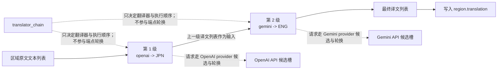
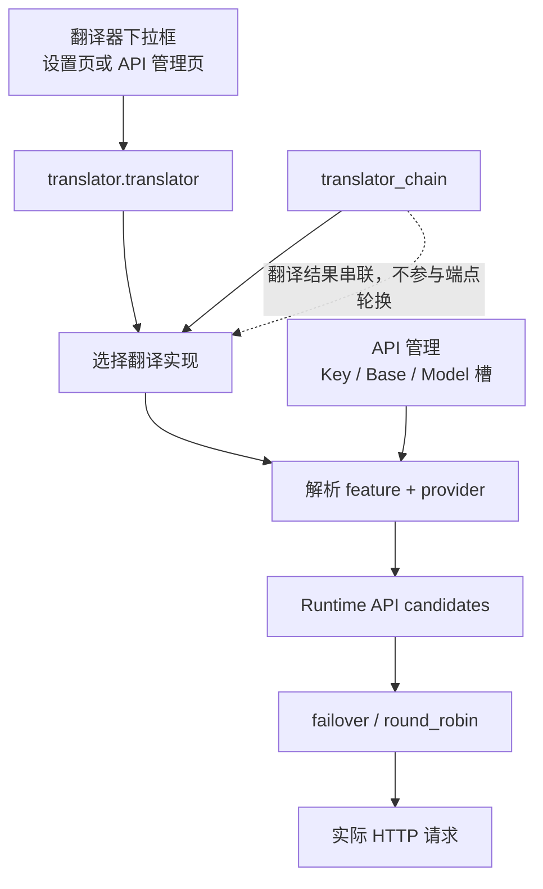

# 翻译器串联

当同一批文本需要先由一个翻译器译到中间语言、再由另一个翻译器继续译到最终语言时，使用 `translator_chain`。它把上一级翻译器的输出文本列表直接交给下一级翻译器，按配置顺序逐级执行。本页说明链字符串的配置形式、执行顺序、与 API 候选槽轮换的区别，以及与上下文/提示词的边界。

## 功能边界

- `translator.translator_chain` 是核心 `TranslatorConfig` 的字符串字段，默认 `null`；它把翻译拆成多个“翻译器:目标语言”阶段并依次执行。
- 链式翻译只决定“用哪些翻译器、按什么顺序、每级翻译到什么语言”；它不选择请求端点，也不处理重试、冷却、不可用或恢复。
- 链式翻译不改变上下文与提示词配置：`cli.context_size` 历史页数、`translator.high_quality_prompt_path`、`extract_glossary` 等仍按各自机制生效。
- 它与单一 `translator` 是互斥的选择来源：`translator_gen` 的构造优先级是 `selective_translation` > `translator_chain` > 单一 `translator`。
- `selective_translation` 是同级字段，解析到同一个 `TranslatorChain`（按检测语言选择翻译器），本页不展开；见[翻译器引擎分发](./engine-dispatch.md)。
- 桌面设置页的 Translation 分组没有 `translator_chain` 控件行；Web UI 默认把该字段列入隐藏高级参数。

## 配置形式

### 链字符串格式

`translator_chain` 的值是一个用 `;` 分隔的链字符串，每一段是 `翻译器:语言代码`，例如 `openai:JPN;gemini:ENG`。`TranslatorChain.__init__()` 逐段解析：

- 翻译器名必须是 `Translator` 枚举成员名（`openai`、`openai_hq`、`gemini`、`gemini_hq`、`sakura`、`none`、`original`），并且必须在 `TRANSLATORS` 注册表中。
- 语言代码必须是 `VALID_LANGUAGES` 的三字母存储代码（如 `JPN`、`ENG`、`CHS`、`CHT`、`KOR`），大小写敏感。
- 每级的源语言固定传 `auto`，目标语言使用该级代码；`prepare_translation()` 在运行前逐级校验 `supports_languages('auto', 目标语言)`。
- 空串、缺少 `:`、未知翻译器名或未知语言代码都会在配置解析时抛错，不会在翻译时静默跳过。

| 存储值 | English | 简体中文 |
| --- | --- | --- |
| `JPN` | Japanese | 日语 |
| `ENG` | English | 英语 |
| `CHS` | Simplified Chinese | 简体中文 |
| `CHT` | Traditional Chinese | 繁体中文 |
| `KOR` | Korean | 韩语 |

`openai:JPN;gemini:ENG` 的含义：先用 OpenAI 把原文翻译到日语，再把日语译文交给 Gemini 翻译到英语。完整语言代码集合在 `manga_translator/translators/common.py#VALID_LANGUAGES`。

### 配置入口与界面文案

`translator_chain` 不是桌面设置页的一行控件，它的可配置位置如下：

- 配置文件：JSON 键 `translator.translator_chain`（例如 `config/config.json`；它是核心 `TranslatorConfig` 字段，默认 `null`，Qt 模型与发行模板不含该字段）。
- CLI：local 模式通过 `--config <file>` 读取配置文件；当前 `args.py` 没有独立的 `--translator-chain` 参数（`config.py` 异常消息里的 `--translator ... -l ...` 是历史示例，不作为当前 CLI 参数）。
- Web/服务端：`/config` 配置 API 可读写该字段，但 `translator.translator_chain` 被列入服务端与 Web 前端的隐藏键集合，默认不显示给用户。

界面文案的实际证据如下。`translator_chain` 与 `translator_selective` 两个 locale key 存在于两个语言文件，但当前桌面设置布局没有引用它们（没有绑定控件），与 `translator_google` 等历史文案同类；不能据此声称桌面 UI 提供链式翻译选项。

| UI 调用 key | English 实际值 | 简体中文实际值 |
| --- | --- | --- |
| `label_translator` | Translator | 翻译器 |
| `translator_chain` | Chain Translator | 链式翻译 |
| `translator_selective` | Selective Translator | 智能选择翻译器 |
| `desc_translator_translator` | Choose the translation engine. The current Qt UI offers OpenAI, Google Gemini, Sakura, High-Quality OpenAI, High-Quality Gemini, plus No Translation and Keep Original. High-Quality OpenAI is recommended. | 选择翻译引擎。当前 Qt UI 可选翻译器包括 OpenAI、Google Gemini、Sakura、高质量翻译 OpenAI、高质量翻译 Gemini，以及“不翻译”“保留原文”。推荐高质量翻译 OpenAI。 |

Web 前端 `manga_translator/server/static/script.js` 隐藏键注释 `'translator.translator_chain',  // 链式翻译` 只是代码注释，不是用户可见标签。

## 执行顺序与数据流

`Config.translator_gen` 把 `translator_chain` 字符串解析为 `TranslatorChain`；`dispatch()` 按 `chain.chain` 顺序执行每一级：先 `translator.parse_args(config)`，再调用 `translator.translate('auto', 本级语言, 文本列表)`。上一级返回的译文列表直接作为下一级的输入，最后一级的返回值写回区域 `region.translation`。

图例说明：`S1` 的输出不是文件也不是中间渲染图，而是内存中的译文字符串列表；它原样作为 `S2` 的查询输入。`A1`/`A2` 表示每个链级内部仍会解析自己 provider 的 Key/Base/Model 候选，并在请求时执行 `failover`/`round_robin`；这些轮换发生在每一级的请求内部，`translator_chain` 本身不参与。

用假翻译器对 `openai:JPN;gemini:ENG` 做的无网络验证中，Gemini 级收到的输入就是 OpenAI 级返回的译文（见验证记录）。`dispatch_batch()` 是批量包装：它把批量查询平铺后调用同一个 `dispatch()`，再按原批次重组，链语义不变。

## 与 API 候选槽轮换的区别

- 链决定“用哪些翻译器、按什么顺序、每级翻译到什么语言”；候选槽决定“已选 provider 内部选哪个请求端点”。
- 每个链级是独立翻译器实例，仍通过 `resolve_runtime_api_config(feature, provider)` 解析自己的 Key/Base/Model 候选（OpenAI 级解析 `translator`/`openai`，Gemini 级解析 `translator`/`gemini`），并在请求时用 `run_with_api_candidates` 处理重试、冷却和恢复。
- `translator_chain` 与 `OPENAI_API_KEY_2` 这类编号槽没有对应关系；链不会因为某级失败就切到另一个 API 候选。
- API 管理页的 Key/Base/Model 槽与 `failover`/`round_robin` 属于[API 通道与轮询策略](../api-management/slots-and-rotation.md)。

## 与上下文和提示词的边界

- `cli.context_size`（历史页数）与提示词字段仍由整体翻译阶段使用；链本身不构造历史消息，也不改变提示词组合。
- 链式 `dispatch()` 分支以纯文本列表传递：它不调用 `set_prev_context()`，也不向 `translate()` 传 `ctx`。多页历史注入、区域级 AI 断句和 HQ 批量数据由单翻译器分支与上下文机制处理（静态核对结论，需脱敏运行验证）。
- 每个链级都 `parse_args(config)` 读取同一份 `TranslatorConfig`，因此流式、RPM、普通重试等配置按各自翻译器实例生效，但不属于本页的链语义。
- 上下文与提示词的配置边界详见[上下文与提示词](./context-and-prompts.md)。

## 限制与注意事项

- 链中每个 provider 都需要满足自己的凭据与语言能力；`prepare_translation()` 会在运行前逐级校验目标语言。
- 把 `none` 放进链会输出空字符串并继续传给下一级，一般不作为链级使用；`original` 原样透传。
- 链中若包含 HQ 级（`openai_hq`/`gemini_hq`），其区域级批量行为与单翻译器路径不同，需脱敏运行验证；文档不伪造运行结果。
- 入口路由注意（静态核对）：`_batch_translate_texts()` 先按单一 `translator` 值分支；默认 AI 翻译器（`openai`/`gemini`/`openai_hq`/`gemini_hq`）走单翻译器分支，链式只在通用 `dispatch_translation` 分支被调用。实际哪种入口真正执行链，需要脱敏配置的运行验证确认。
- 每级都会产生一次（或多级多次）翻译请求；链越长，API 调用与成本成倍增加，错误面也更大。

## 关联配置

| 配置 | 作用 | 注意事项 |
| --- | --- | --- |
| `translator.translator_chain` | 定义链字符串与执行顺序 | 核心字段，默认 `null`；Qt/发行模板不含 |
| `translator.translator` | 无链时的单一翻译器 | 与链互斥；桌面下拉框仍写入该键 |
| `translator.target_lang` | 无链时的单一目标语言 | 链模式下每级用自己的语言代码 |
| `selective_translation` | 按检测语言选择翻译器（同级字段） | 解析为同一 `TranslatorChain`；本页不展开 |
| `cli.context_size` 与提示词字段 | 历史与提示词配置 | 与链正交，见上下文与提示词页 |
| API Key/Base/Model 槽与策略 | 每级 provider 的端点候选与轮换 | 不参与链语义，见 API 管理页 |

## 源码依据 {#source-evidence}

| 层级 | 文件 | 本页核对内容 |
| --- | --- | --- |
| 核心配置 | `manga_translator/config.py` | `TranslatorChain` 解析、`translator_chain`/`selective_translation` 字段、`translator_gen` 优先级 |
| 实现注册与调度 | `manga_translator/translators/__init__.py` | `TRANSLATORS`、`get_translator()`、`prepare()`、`dispatch()`、`dispatch_batch()` 的链式顺序 |
| 语言与翻译器实现 | `manga_translator/translators/common.py`、`none.py`、`original.py` | `VALID_LANGUAGES`、`translate()` 语义 |
| 运行流水线 | `manga_translator/manga_translator.py` | `prepare_translation`、`_batch_translate_texts` 路由、译文写回区域 |
| 端点解析 | `manga_translator/runtime_api_resolver.py`、`translators/openai.py`、`gemini.py` | 每级 `feature/provider` 候选与内部轮换 |
| 桌面 UI | `desktop_qt_ui/ui/main_page/settings_tab_layout.json`、`app_logic.py` | Translation 分组无链控件；`label_translator`/`desc_translator_translator` 映射 |
| i18n | `desktop_qt_ui/locales/en_US.json`、`zh_CN.json` | `translator_chain`/`translator_selective` 实际值及未绑定状态 |
| Web 服务端 | `manga_translator/server/routes/config.py`、`server/core/config_manager.py`、`server/static/script.js` | `translator.translator_chain` 隐藏键与默认隐藏 |
| 调查产物 | `doc/wiki/research/default-sources.md`、`doc/wiki/data/settings.generated.json`、`doc/wiki/data/i18n.generated.json` | 三层默认矩阵与 i18n 实际值 |

## 验证记录 {#verification}

| 验证内容 | 状态 | 说明 |
| --- | --- | --- |
| BLUEPRINT、PAGE_GUIDELINES、TODO | 完成 | 已完整读取并按页面合同编写 |
| 链解析与 `translator_gen` | 完成 | 用 `uv run python` 验证 `openai:JPN;gemini:ENG` 解析与构造优先级 |
| 链式数据流 | 完成 | 假翻译器验证上一级输出作为下一级输入（无网络） |
| UI 与 i18n 实际值 | 完成（静态） | `translator_chain`/`translator_selective` 存在但未绑定桌面控件 |
| 真实 API 链式运行 | 未执行 | 需要脱敏凭据与可控端点；不在文档构建中发起真实请求 |
| 入口路由运行验证 | 待后续 | `_batch_translate_texts` 分支行为需脱敏运行确认 |
| 安全审查 | 完成 | 页面未包含 API key/token、用户名、私有绝对路径、用户图片或私有提示词 |
| VitePress 与静态检查 | 完成 | `npm run docs:build --prefix doc/wiki` 构建通过；`verify-route-mirror.mjs` 与 `verify-source-evidence.mjs` 均 PASS |
