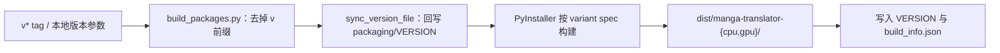
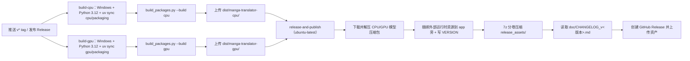

# 打包与发布

本页面向维护者，说明项目如何从源码生成可分发的桌面端与 Docker 产物、如何确定版本号、如何通过 CI 发布到 GitHub Releases 与镜像仓库，以及版本检查与更新维护的边界。它不覆盖用户安装与更新步骤（见[更新与版本切换](../install/update-and-version-switching.md)）、Web 服务端口与部署（见[Web 服务端口与部署](./web-server-ports-and-deployment.md)）、仓库模块边界（见[架构与代码边界](./architecture-and-code-boundaries.md)）或测试与代码质量（见[测试与代码质量](./tests-and-code-quality.md)）。

## 功能边界 {#feature-boundary}

- 版本号：发布版本以 `v*` Git tag（例如 `v2.2.10`）为权威；`packaging/VERSION` 是构建脚本与版本检查脚本共同读取的版本文件；`pyproject.toml` 的 `[project] version` 与 `packaging/launch.py` 中的硬编码 `VERSION` 只是开发标记，不参与 CI 发布。
- 桌面端产物：`packaging/build_packages.py` 调用 PyInstaller，按 `packaging/manga-translator-cpu.spec` 与 `packaging/manga-translator-gpu.spec` 生成 `dist/manga-translator-{cpu,gpu}/`。
- CI 发布：`.github/workflows/build-and-release.yml` 在推送 `v*` tag、发布 Release 或手动触发时构建两个变体、捆绑外部运行时资源、分卷压缩并创建 GitHub Release；`.github/workflows/docker-build-push.yml` 构建并推送 CPU/GPU Docker 镜像。
- 本页只写打包与发布；模块代码边界、测试流程、Web 端口与部署细节分别属于[架构与代码边界](./architecture-and-code-boundaries.md)、[测试与代码质量](./tests-and-code-quality.md)和[Web 服务端口与部署](./web-server-ports-and-deployment.md)。

## UI 操作 {#ui-operations}

与打包发布相关的可见文案只有两类：桌面窗口标题/侧边栏的版本显示，以及源码安装版维护菜单的版本检查入口。它们都不是设置页参数；维护菜单完整操作见[更新与版本切换](../install/update-and-version-switching.md)。

## 版本号 {#version-number}

### 版本号来源 {#version-sources}

| 文件/位置 | 当前值 | 作用 |
| --- | --- | --- |
| `packaging/VERSION` | `v2.2.10`（带 `v`） | 构建与版本检查的权威文件；`build_packages.py` 会把 tag 版本回写到这里 |
| Git tag `v*` | 如 `v2.2.10` | CI 发布版本来源；`github.ref_name` 直接传给构建脚本 |
| `pyproject.toml [project] version` | `1.7.6` | 项目元数据标记；与发布版本不同步，不参与 CI 打包 |
| `packaging/launch.py` 常量 `VERSION` | `1.7.6` | 启动横幅的硬编码显示值；不参与 CI 打包 |

`build_packages.py` 的版本归一化：版本参数先去掉 `v` 前缀；`sync_version_file()` 把有效版本写回 `packaging/VERSION`；每个变体产物目录内写入 `VERSION`（不带 `v`）和 `build_info.json`（`{"variant": ..., "version": ...}`）。桌面端运行时读取并显示该版本。

### 版本检查 {#version-check}

`packaging/check_version.py` 与 `launch.py#check_version_info()` 都读取本地 `packaging/VERSION`，在 `git fetch` 成功后读取 `origin/<分支>:packaging/VERSION` 与远程对比；`launch.py` 还会统计 `HEAD..origin/<分支>` 的落后提交数。fetch 失败或无法联网时如实显示“无法获取远程版本信息”，不会用旧的 `origin/*` 引用误报“已是最新”。

## 桌面端打包 {#desktop-packaging}

### 打包脚本 {#packaging-script}

`packaging/build_packages.py` 是唯一的 PyInstaller 入口：

```powershell
uv run --no-sync python packaging/build_packages.py <版本> --build cpu|gpu|both
```

- `<版本>` 必填；`--build` 默认 `both`，可只构建 `cpu` 或 `gpu`。
- CI 先执行 `uv sync --locked --no-default-groups --group cpu|gpu --group packaging` 准备环境；`packaging` 依赖组只含 `pyinstaller` 与 `pyinstaller-hooks-contrib`。
- spec 文件入口是 `desktop_qt_ui/main.py`，收集 `onnxruntime`、`py3langid`、`unidic_lite`、`pythainlp`、`nlpo3`、`opencc` 的数据与二进制，并携带运行时钩子 `pyi_rth_onnxruntime.py`。
- 构建完成后写入 `dist/manga-translator-{variant}/VERSION` 与 `build_info.json`；任一变体失败都会终止整个脚本。

### 构建步骤 {#build-steps}



图说明：这是源码确认的版本归一化与 PyInstaller 产物生成流程，不是通用“配置→算法→输出”占位图。`build_info.json` 记录 `variant` 与 `version`；同一版本参数可连续构建 `cpu` 与 `gpu` 两个互斥依赖组的产物，但一次环境只安装其中一个组。

## 发布产物 {#release-artifacts}

### 产物布局 {#artifact-layout}

CI 的“Bundle external runtime resources next to app”步骤把可替换资源放到 `app.exe` 旁而不是 `_internal/` 内：先从 `_internal/` 删除 `config`、`examples`、`fonts`、`models`、`dict`、`doc`、`desktop_qt_ui`、`presets`、`logs`、`result` 与 `VERSION`，再从仓库复制 `config`、`fonts`、`dict`、`doc`、`desktop_qt_ui/locales`、`desktop_qt_ui/ui`、`manga_translator/server/static`，并把发布版本写入根目录 `VERSION`。模型目录从单独的模型压缩包解压到产物根目录。

| 目录/文件 | 内容 | 说明 |
| --- | --- | --- |
| `app.exe` | PyInstaller 单文件入口 | `desktop_qt_ui/main.py` 的编译结果 |
| `_internal/` | Python 运行时与第三方库 | 不包含可替换的 config/fonts/models/dict/doc |
| `config/`、`fonts/`、`dict/`、`doc/` | 仓库资源 | 从仓库复制到可执行文件旁 |
| `desktop_qt_ui/locales/`、`ui/` | Qt 界面资源 | 打包版从外部读取，便于替换 |
| `manga_translator/server/static/` | Web 前端静态资源 | 供内置 Web 服务使用 |
| `models/` | 模型权重 | 发布阶段从模型压缩包解压 |
| `VERSION` | 版本号（不带 `v`） | 桌面端启动时读取并显示 |

### 分卷压缩 {#split-archives}

发布资产按变体分卷压缩为 7z：`manga-translator-{cpu,gpu}-<tag>.7z.001`、`.002`…，命令为 `7z a -v1990m -m0=lzma2 -ms=on`（1990 MiB 分卷、LZMA2、固态压缩）。解压后是完整的可分发目录。

## CI 发布流水线 {#ci-release-pipeline}

### 触发方式 {#release-triggers}

`build-and-release.yml` 在推送 `v*` tag、GitHub Release 发布（`release: published`）或手动 `workflow_dispatch` 时触发；`docker-build-push.yml` 在推送 `v*` tag 或手动触发时构建并推送 Docker 镜像。GitHub Releases 产物还会随镜像同步到 Gitee/GitCode 仓库（`sync-to-gitee.yml`）。

### 流水线步骤 {#pipeline-steps}



图说明：这是工作流文件的真实依赖与步骤顺序。`release-and-publish` 的 `needs: [build-cpu, build-gpu]` 保证两个变体都成功后才发布；CHANGELOG 文件缺失时发布正文显示“未找到更新日志文件”。工作流中注释掉的 TUF 更新仓库与密钥恢复步骤当前未启用，不代表存在真实的自动更新签名通道。

## Docker 镜像 {#docker-images}

### 镜像构建 {#docker-build}

`packaging/Dockerfile` 是多阶段构建：`base-cpu` 基于 `python:3.12-slim`，`base-gpu` 基于 `nvidia/cuda:12.1.0-cudnn8-runtime-ubuntu22.04`，由 `BUILD_TYPE` 参数选择。两者都安装系统依赖后执行 `uv sync --locked --no-default-groups --group cpu|gpu`，调用 `ensure_runtime_files()` 生成运行时配置与提示词表，并把 `config`、`fonts`、`dict`、`server data` 备份到 `default_*` 目录，供入口脚本在挂载空卷时恢复。镜像以 Web 服务方式启动（`MANGA_TRANSLATOR_WEB_SERVER=true`、`QT_QPA_PLATFORM=offscreen`、`EXPOSE 8000`），健康检查请求 `http://localhost:8000/`，默认命令为 `python -m manga_translator web --host 0.0.0.0 --port 8000`。

`docker-build-push.yml` 用矩阵 `[cpu, gpu]` 构建 `linux/amd64`，登录 Docker Hub 与 ghcr.io 后推送镜像，tag 均带 `-cpu`/`-gpu` 后缀：分支/PR 引用、semver `<版本>` 与 `<主>.<次>`、`latest`。

### Compose 部署 {#compose-deployment}

`packaging/docker-compose.yml` 提供两个服务：`manga-translator-cpu` 映射宿主 `8000:8000`，`manga-translator-gpu` 映射 `8001:8000`。两者把 `./data/{fonts,dict,result,models,logs,server,config}` 挂载到容器内，通过 `MT_*` 环境变量控制 Web 主机、端口、GPU、模型 TTL、重试与 verbose，并通过 `MANGA_TRANSLATOR_ADMIN_PASSWORD` 设置管理员密码（模板带默认占位值，首次启动必须替换）。取消注释 `./data/app.env:/app/.env` 挂载，可让 Web 管理界面保存的 API 密钥在重建容器后保留。

## 依赖与冲突 {#dependencies-and-conflicts}

- `cpu`、`gpu`、`amd`、`metal` 四个硬件后端依赖组互斥（`pyproject.toml` 的 `[tool.uv] conflicts`），一次只能安装一个；CI 的桌面打包只构建 `cpu` 与 `gpu`。
- PyInstaller 产物不包含模型权重；模型在发布阶段从单独的 release 资产下载，因此产物体积与模型体积分开管理。
- `packaging/VERSION` 与 `pyproject.toml` 的 `[project] version`、`launch.py` 的硬编码 `VERSION` 可能不同步；发布以 tag 为准，不要把三者当作同一来源。
- 发布流水线依赖 GitHub Release 中预置的模型压缩包；缺失或下载失败时发布会失败。
- Docker 构建通过 `.dockerignore` 排除 `doc/`、`*.md`、测试与构建产物，镜像内只含运行所需资源。
- 本页不写真实 API 密钥、令牌、用户名或私有绝对路径；compose 中的管理员密码与环境变量值属于发行模板，不在文档中复制。

## 开发指南 {#developer-guide}

### 选项中英对照 {#option-matrix}

#### 窗口标题与版本显示 {#window-title-and-version-display}

打包版启动时通过 `desktop_qt_ui/utils/app_version.py#get_app_version()` 从运行时资源读取 `VERSION` 文件（读取顺序 `VERSION` → `packaging/VERSION`，去掉 `v` 前缀；失败回退为 `unknown`），再拼进窗口标题与 Qt 应用版本：

| UI 调用 key | English 实际值 | 简体中文实际值 |
| --- | --- | --- |
| `Manga Translator` | Manga Translator | 漫画翻译器 |
| `format_app_title` 拼接结果 | Manga Translator v2.2.10 | 漫画翻译器 v2.2.10 |
| `format_version_label` 结果 | v2.2.10 | v2.2.10 |

#### 维护菜单 {#maintenance-menu}

`Win-Install-or-Update.bat` / `Unix-Install-or-Update.sh` 最终调用 `packaging/launch.py --maintenance`。菜单文案由 `launch.py` 的 `L(简体中文, English)` 硬编码提供，不经过 `en_US.json`/`zh_CN.json`；下表用代码字面量作为 key：

| UI 调用 key | English 实际值 | 简体中文实际值 |
| --- | --- | --- |
| `[1] Install (...)` | Install (detect GPU, choose CPU/GPU build, install dependencies) | 安装 (检测显卡, 选择 CPU/GPU 版本并安装依赖) |
| `[2] Update (code + dependencies)` | Update (code + dependencies) | 更新 (代码+依赖) |
| `[3] Switch branch (main/beta)` | Switch branch (main/beta) | 切换分支 (main/beta) |
| `[4] Switch version (by tag)` | Switch version (by tag) | 切换版本 (按 tag) |
| `[5] Switch mirror` | Switch mirror | 切换镜像源 |
| `[6] Re-check version` | Re-check version | 重新检查版本 |
| `[7] Language (中文/English)` | Language (中文/English) | 切换语言 (中文/English) |
| `[8] Exit` | Exit | 退出 |

### 关联文件与格式 {#related-files-and-formats}

| 文件/目录 | 本页作用 | 注意 |
| --- | --- | --- |
| `packaging/VERSION` | 版本权威文件 | 带 `v` 前缀；构建与检查脚本读取 |
| `packaging/build_packages.py` | 桌面端打包入口 | 版本必填；回写 VERSION、写 `build_info.json` |
| `packaging/manga-translator-{cpu,gpu}.spec` | PyInstaller spec | 入口 `desktop_qt_ui/main.py`，收集运行时数据 |
| `packaging/Dockerfile`、`docker-compose.yml`、`docker-entrypoint.sh` | Docker 镜像与部署 | 多阶段构建、空卷恢复、健康检查 |
| `packaging/check_version.py` | 版本检查脚本 | 对比 `origin/main:packaging/VERSION` |
| `packaging/launch.py` | 启动与维护菜单 | `--maintenance`、`--update`、`--frozen` 等参数 |
| `Win-Start.bat`、`Win-Install-or-Update.bat`、`Unix-*.sh` | 源码安装版入口 | 调用 `launch.py`；本页不复制其内容 |
| `.github/workflows/build-and-release.yml` | 桌面发布 CI | tag/release 触发；捆绑资源、分卷、建 Release |
| `.github/workflows/docker-build-push.yml` | Docker 发布 CI | 推送 Docker Hub 与 ghcr.io |
| `.github/workflows/docs-pages.yml` | Wiki 站点发布 | 与桌面发布独立，仅部署 `doc/wiki` |
| `.github/workflows/sync-to-gitee.yml` | 仓库镜像同步 | 每次 push 同步分支与 tag 到 Gitee/GitCode |
| `doc/CHANGELOG_v<版本>.md` | 发布说明正文 | 缺失时发布正文显示占位文案 |

### 源码依据 {#source-evidence}

| 层级 | 文件 | 本页核对内容 |
| --- | --- | --- |
| 版本 | `packaging/VERSION`、`packaging/build_packages.py`、`packaging/check_version.py`、`desktop_qt_ui/utils/app_version.py` | 版本来源、去 `v`、回写、运行时读取与显示 |
| 桌面打包 | `packaging/manga-translator-{cpu,gpu}.spec`、`pyproject.toml` | 入口、数据收集、依赖组与 packaging 组 |
| CI 发布 | `.github/workflows/build-and-release.yml`、`.github/workflows/docker-build-push.yml` | 触发条件、构建矩阵、资源捆绑、分卷、Release/镜像推送 |
| Docker | `packaging/Dockerfile`、`packaging/docker-compose.yml`、`packaging/docker-entrypoint.sh`、`packaging/.dockerignore` | 多阶段构建、空卷恢复、端口、健康检查 |
| 维护/更新 | `packaging/launch.py`、`Win-*.bat`、`Unix-*.sh` | 维护菜单、版本检查、更新与切换 |
| UI/i18n | `desktop_qt_ui/main.py`、`desktop_qt_ui/ui/main_window.py`、`desktop_qt_ui/locales/en_US.json`、`zh_CN.json` | 窗口标题版本拼接与可见文案 |
