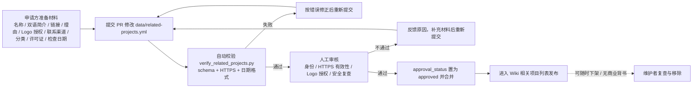

# 相关项目与链接

当你想把某个翻译、OCR、排版、图像处理、社区或工具项目加入 Manga Translator Wiki 的“相关项目”列表，或者想了解一条链接如何被收录、审核和下架时，使用本页。相关项目列表的唯一审核数据源是 `doc/wiki/data/related-projects.yml`；提交 PR 修改该文件不等于自动发布，只有 `approval_status: approved` 的条目才会进入公开列表。

本页只写友情链接的申请材料、审核流程、安全复查和无商业背书规则；代码贡献的模块边界与修改步骤见[架构与代码边界](./architecture-and-code-boundaries.md)和[新增或修改功能](./adding-or-changing-a-feature.md)，测试与代码质量规范见[测试与代码质量](./tests-and-code-quality.md)。

## 功能边界

- 相关项目列表是 Wiki 站点功能，不是桌面端、CLI 或 Web 服务器的运行时功能；`desktop_qt_ui/locales/en_US.json` 与 `zh_CN.json` 中没有 related-projects 相关 key。
- 双语文案（名称、简介、关联理由）由 `data/related-projects.yml` 中每条项目的 `LocalizedText`（`en` 与 `zh-CN` 两个字段）提供，站点不做二次翻译。
- 收录必须经过人工审核和 HTTPS/有效性复查；拒绝冒充、恶意下载、隐私追踪和未经授权 Logo；链接可随时下架，并标注外链风险和无商业背书。
- 本页不负责普通代码 PR 的贡献规范、测试命令或打包发布流程，那些内容见对应的开发者页面。

## 申请材料

一条申请需要同时提供以下材料，缺任一项都可能退回补充。字段名与 `data/related-projects.schema.json` 保持一致；下表的 English 与简体中文是申请材料的约定含义，不是桌面 UI 显示文案（两个 locale 中都没有相关 key）。

| 字段 | English | 简体中文 |
| --- | --- | --- |
| `name` | Project name | 项目名称 |
| `description` | Bilingual description | 双语简介 |
| `url` | Public HTTPS URL | 公开 HTTPS 链接 |
| `relationship` | Relationship to this project | 关联理由 |
| `logo.authorization` | Logo usage authorization | Logo 使用授权 |
| `contact_url` | Official contact channel | 官方联系渠道 |
| `category` | Expected category | 期望分类 |
| `license_status` | License / authorization status | 许可证 / 授权状态 |
| `last_checked` | Last check date | 最后检查日期 |

### 必填字段

`verify_related_projects.py` 与 JSON Schema 共同强制以下字段，缺任一字段或类型/格式不合法都会校验失败：

| 字段 | 格式要求 | 说明 |
| --- | --- | --- |
| `id` | `^[a-z0-9]+(?:-[a-z0-9]+)*$` | 稳定的小写连字符 ID |
| `name` / `description` / `relationship` | 对象，含非空 `en` 与 `zh-CN` | 双语文案 |
| `url` | `^https://…` 且带主机名 | 公开项目链接 |
| `category` | 六种枚举之一 | 见[分类枚举](#category-enum) |
| `logo.url` + `logo.authorization` | HTTPS + 非空授权说明 | Logo 地址与使用授权 |
| `contact_url` | `^https://…` 且带主机名 | 官方联系渠道 |
| `license_status` | 非空字符串 | 许可证 / 授权状态 |
| `approval_status` | `pending` 或 `approved` | 审核状态 |
| `last_checked` | ISO `YYYY-MM-DD` | 最后人工检查日期 |

`approval_status` 只能由维护者在审核后改为 `approved`；申请方提交 PR 时应保持 `pending`。`contact_url` 只接受仓库已公开的官方反馈渠道，未确认前不要硬编码作者邮箱或社交账号。

### 提交前自检

1. 在仓库根目录运行 `uv run python doc/wiki/verify_related_projects.py`，确认输出为 `PASS` 且 schema 未过期。
2. 确认所有 URL 都是 HTTPS 且带主机名；不要放 `http://`、个人邮箱、API Key、追踪链接或未授权 Logo 资产。
3. 确认 `name`、`description`、`relationship` 三处双语都填写且不是空白。
4. 确认 `last_checked` 使用 ISO 日期、`approval_status` 保持 `pending`。
5. 只修改 `doc/wiki/data/related-projects.yml`；schema 由校验脚本用 `--write-schema` 重新生成，不要手改。

一个最小占位模板（只展示结构，不包含真实项目）：

```yaml
schema_version: 1
projects:
  - id: example-project
    name:
      en: Example Project
      zh-CN: 示例项目
    description:
      en: One-sentence public description.
      zh-CN: 一句话公开简介。
    url: https://example.com/
    relationship:
      en: Why this project relates to Manga Translator.
      zh-CN: 与本项目的关联理由。
    category: tooling
    logo:
      url: https://example.com/logo.png
      authorization: Maintainer confirmed logo use for the Wiki list.
    contact_url: https://example.com/contact
    license_status: MIT
    approval_status: pending
    last_checked: 2026-08-07
```

## 提交与审核流程



提交申请不等于自动发布链接：`pending` 条目不会出现在公开列表，只有人工审核通过并置为 `approved` 后才发布。审核不通过不会留下永久负面记录，可补充材料后重新提交。访问者自行承担外链跳转风险，Wiki 不保证第三方站点内容或安全性。

## 安全复查与无商业背书

维护者人工审核时逐项复查以下内容，任何一项不满足都会被拒或下架：

- **身份核实**：拒绝冒充官方或他人的项目；名称、Logo、域名必须与真实项目一致。
- **链接安全**：只接受 HTTPS；复查目标页可访问、无恶意下载、无隐私追踪脚本和重定向陷阱。
- **Logo 授权**：`logo.authorization` 必须写明授权来源；未经授权的 Logo 一律拒绝。
- **联系渠道**：只接受官方公开渠道，不接受个人邮箱、社交账号或需额外确认的私密联系方式。
- **无商业背书**：列表内链接不构成对任何商业产品、服务或项目的背书；维护者可随时下架任何条目，并同步更新 `approval_status` 与 `last_checked`。

## 数据文件与格式

| 文件 | 本页实际作用 | 注意 |
| --- | --- | --- |
| `doc/wiki/data/related-projects.yml` | 相关项目列表的唯一审核数据源 | 当前为 `projects: []`（空列表）；只通过 PR 修改 |
| `doc/wiki/data/related-projects.schema.json` | JSON Schema，定义全部字段与格式 | 由 `verify_related_projects.py --write-schema` 生成，手改会导致校验失败 |
| `doc/wiki/verify_related_projects.py` | Pydantic 模型校验脚本 | 从仓库根目录运行 `uv run python doc/wiki/verify_related_projects.py` |
| `doc/wiki/data/README.md` | 数据治理说明 | 记录“提交不等于自动发布”与人工审核规则 |
| `desktop_qt_ui/locales/en_US.json` / `zh_CN.json` | 不参与本页 | 已核对无相关 key；双语文案来自数据文件 |

### 分类枚举 {#category-enum}

`category` 只能是以下六个值之一，对应申请方填写的“期望分类”：

| 存储值 | English | 简体中文 |
| --- | --- | --- |
| `translation` | Translation | 翻译 |
| `ocr` | OCR | OCR / 文字识别 |
| `typesetting` | Typesetting | 排版 |
| `image-processing` | Image processing | 图像处理 |
| `community` | Community | 社区 |
| `tooling` | Tooling | 工具 |

## 关联页面

- [架构与代码边界](./architecture-and-code-boundaries.md)：代码模块边界与调用关系。
- [新增或修改功能](./adding-or-changing-a-feature.md)：功能修改的 PR 检查表。
- [测试与代码质量](./tests-and-code-quality.md)：测试目录、uv 命令与格式检查。
- [打包与发布](./packaging-and-release.md)：版本发布流程（不包含友情链接审核）。

## 源码依据 {#source-evidence}

| 层级 | 文件 | 本页核对内容 |
| --- | --- | --- |
| 数据源 | `doc/wiki/data/related-projects.yml` | 当前空列表、`schema_version`、字段结构与 `LocalizedText` 双语约定 |
| Schema | `doc/wiki/data/related-projects.schema.json` | 全部字段、正则、枚举、必填项与日期格式 |
| 校验脚本 | `doc/wiki/verify_related_projects.py` | Pydantic 模型、HTTPS URL 校验、`--write-schema` 与 PASS 输出 |
| 数据治理 | `doc/wiki/data/README.md` | 提交不等于自动发布、人工审核、无商业背书 |
| 契约 | `doc/wiki/BLUEPRINT.md` 第 9.6 节 | 申请材料清单、官方反馈渠道、收录与下架规则 |
| 覆盖矩阵 | `doc/wiki/research/phase0-page-coverage-matrix.md` | W104 行与 S00 证据族 |

## 验证记录 {#verification}

| 验证内容 | 状态 | 说明 |
| --- | --- | --- |
| BLUEPRINT、PAGE_GUIDELINES、TODO | 完成 | 已完整读取并按页面合同编写 |
| `data/related-projects.yml` 与 schema | 完成 | 已核对空列表、schema 字段与必填项；校验脚本运行输出 `PASS: projects=0, approved=0` |
| `en_US` / `zh_CN` | 完成 | 已确认两个 locale 无相关 key；本页三列表来自数据文件约定，不是 UI 文案 |
| 审核流程 Mermaid | 完成 | 静态绘制提交、自动校验、人工审核、发布与下架流程 |
| 脱敏运行验证 | 待后续 | 本页未读取真实 `.env`、用户配置、API key/token、用户名或私有提示词 |
| VitePress | 待运行 | 由协调代理在合并前运行 `npm run docs:build --prefix doc/wiki` 及镜像/源码检查 |
