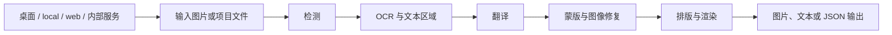

# Manga Translator Wiki

这里是文档站首页。先按运行方式选择入口，再进入对应的操作页；页面内容以当前仓库源码、桌面 i18n 和服务端公开代码为依据，不把未核对的能力写成宣传语。

## 产品形态 {#product-forms}

项目共用 MangaTranslator 处理链，但提供不同的交互边界：

| 形态 | 适合场景 | 入口 |
| --- | --- | --- |
| Qt 桌面应用 | 本机选图、调整参数、查看进度并在可视化编辑器中修订 | [产品形态](./introduction/product-forms.md) · [首次翻译](./introduction/first-translation.md) |
| `local` 命令行 | 无桌面环境、脚本化和批量处理 | [命令结构](./cli/command-structure.md) · [本地输入与输出](./cli/local-input-output.md) |
| `web` Web 界面 | 浏览器上传、配置任务、查看结果和历史 | [启动与访问](./web/launch-and-access.md) · [上传、配置与翻译](./web/upload-config-and-translate.md) |
| `ws` / `shared` | 已有本地集成所需的内部服务协议 | [Web、WS 与 shared 模式](./cli/web-ws-and-shared-modes.md) · [内部协议](./developer/internal-shared-and-websocket.md) |
| Docker | 以容器方式运行 Web 形态，并用卷保存资源和服务器数据 | [Docker](./install/docker.md) |

`ws` 和 `shared` 是内部集成形态，不应当作无需鉴权的公共 API；Web 默认监听 `0.0.0.0:8000`，而内部服务默认使用本机地址和不同端口。端口、鉴权和暴露风险见[部署、安全与排错](./web/deployment-security-and-troubleshooting.md)及[服务器端口与部署](./developer/web-server-ports-and-deployment.md)。

## 从哪个入口开始 {#entry-navigation}

### Qt 桌面入口 {#desktop-entry}

桌面窗口启动后进入“翻译界面”。侧栏按源码注册以下七个常规页面；底部另有“编辑器视图”。这些名称是代码调用的 i18n key 对应的实际值：

| 顺序 | UI 调用 key | English 实际值 | 简体中文实际值 | 用于 |
| --- | --- | --- | --- | --- |
| 1 | `Translation Interface` | Translation Interface | 翻译界面 | 添加输入、选择流程、开始任务 |
| 2 | `Settings` | Settings | 设置 | 修改检测、OCR、翻译、修复和排版参数 |
| 3 | `API Management` | API Management | API 管理 | 选择功能提供商并配置连接信息 |
| 4 | `Prompt Management` | Prompt Management | 提示词管理 | 管理和应用提示词文件 |
| 5 | `Replacement Rules` | Replacement Rules | 替换规则 | 管理渲染前文字替换 |
| 6 | `Rich Text Rules` | Rich Text Rules | 富文本规则 | 管理富文本匹配和样式规则 |
| 7 | `Batch Management` | Batch Management | 批量管理 | 按条件批量修改翻译项目 |
| 底部 | `Editor View` | Editor View | 编辑器视图 | 打开结果并手工编辑区域、文本和样式 |

按任务继续：

- [主导航与语言](./desktop/navigation-and-language.md)：页面切换、主题、桌面语言和当前页保持边界。
- [翻译工作区：文件列表与输入](./desktop/translation/file-list-and-input.md)：加入图片、文件夹或拖放输入。
- [输出目录与工作流](./desktop/translation/output-directory-and-workflow.md)：选择输出位置和九种工作流。
- [设置总览](./desktop/settings/index.md)：配置生命周期、导入导出和九个参数页面。
- [API 功能选择器](./desktop/api-management/feature-selectors.md)：区分功能选择器、翻译器选择和 API 候选槽。
- [编辑器布局与文件列表](./desktop/editor/layout-and-file-list.md)：进入编辑器后的工作区布局。

### CLI 与 Web 入口 {#cli-web-entry}

CLI 正式入口由 `manga_translator` 分发到 `local`、`web`、`ws` 或 `shared`。常用形式如下：

```text
uv run --no-sync python -m manga_translator local -i <图片或文件夹> [选项]
uv run --no-sync python -m manga_translator web
uv run --no-sync python -m manga_translator ws
uv run --no-sync python -m manga_translator shared
```

命令行选项和显式配置覆盖见[配置覆盖](./cli/configuration-overrides.md)；工作流文件和特殊模式见[工作流与文件模式](./cli/workflow-and-file-modes.md)。Web 用户从[启动与访问](./web/launch-and-access.md)开始，HTTP 方法、鉴权和流协议则留在[开发者 HTTP API](./developer/http-api/authentication-and-errors.md)，不与用户操作混写。

## 处理链与文档边界 {#processing-boundary}

不同入口最终进入共用的阶段链；特殊工作流会跳过或覆盖部分阶段，不能只根据首页的简化图推断每个流程：



首页只提供索引。具体页面负责自己的 UI 操作、运行机理、依赖冲突、文件格式和源码依据：

- [检测](./desktop/settings/detection.md)、[OCR、过滤与合并](./desktop/settings/ocr-filter-and-merge.md)、[翻译设置](./desktop/settings/translation.md)解释各阶段参数。
- [蒙版与修复](./desktop/settings/mask-and-inpainting.md)、[排版与渲染](./desktop/settings/typesetting-and-rendering.md)、[超分与上色](./desktop/settings/upscale-and-colorization.md)解释图像后处理。
- [正常工作流](./workflows/normal.md)及其余八个工作流分别说明输入、跳过阶段和输出。
- [数据与隐私](./introduction/data-and-privacy.md)说明哪些内容可能进入本地文件、服务端存储或外部 API。

## 双语切换边界 {#language-boundary}

右上角的语言按钮是文档站功能：自定义 `LanguageSwitch.vue` 根据当前 URL 的 `/zh/` 或 `/en/` 前缀，跳转到**同一页面路径**的另一语言版本。例如 `/zh/desktop/settings/index.html` 切换到 `/en/desktop/settings/index.html`。它不会翻译源码、用户配置或页面中没有镜像文件的内容；两种语言页面必须保持相同标题层级、锚点、表格和链接结构。

桌面应用里的“语言：”是另一条边界：它由 `I18nManager` 填充 locale，下拉值写入 `app.ui_language` 并刷新 Qt 控件文字。它只改变应用界面语言，不改变翻译目标语言；目标语言仍由翻译设置中的 `translator.target_lang` 等配置决定。Web 页面还拥有自己的静态脚本 i18n，不能假定桌面 locale 覆盖所有 Web 文案。

| 层级 | 切换控件/来源 | 实际影响 | 不会改变 |
| --- | --- | --- | --- |
| Wiki | `.vitepress/theme/components/LanguageSwitch.vue` | 当前文档路由在 `zh` 与 `en` 间切换 | 应用配置、翻译目标语言、源码和用户数据 |
| Qt 桌面 | `Language:` / `语言：`，写入 `app.ui_language` | 桌面控件、窗口和已创建视图的显示文字 | `translator.target_lang`、API 提供商和处理流程 |
| Web | `server/static/js/i18n.js` 及页面脚本 | Web 页面自身可翻译的文案 | 桌面 locale 文件和服务器端翻译配置 |

## 关联文件与安全边界 {#files-and-safety}

首页只列公开的文件角色，不读取或展示用户实例中的敏感值：

| 文件或目录 | 公开角色 | 注意事项 |
| --- | --- | --- |
| `config/config-example.json` | 配置字段的无密钥示例 | 不要用用户 `config.json` 覆盖文档，也不要公开私有路径 |
| `desktop_qt_ui/locales/en_US.json` / `zh_CN.json` | 桌面 UI 实际显示值 | 页面表格记录 key 与实际值，不自行补译 |
| `manga_translator/args.py` | CLI 模式和参数定义 | 以正式入口和实际帮助为准 |
| `manga_translator/server/static/` | Web 用户界面及其文案 | 用户操作与开发者 HTTP 契约分开记录 |
| `packaging/docker-compose.yml` | 容器端口、卷和服务形态 | 示例密码不能直接用于生产；不要提交 `.env` |

## 源码依据 {#source-evidence}

| 层级 | 文件 | 本页核对内容 |
| --- | --- | --- |
| 桌面入口与导航 | `desktop_qt_ui/main.py`、`desktop_qt_ui/ui/main_window.py`、`desktop_qt_ui/ui/main_page/view.py` | Qt 启动、七个侧栏页面、编辑器底部入口和页面切换 |
| 桌面 i18n 与设置 | `desktop_qt_ui/locales/en_US.json`、`desktop_qt_ui/locales/zh_CN.json`、`desktop_qt_ui/services/i18n_service.py` | 调用 key 的 English/简体中文实际值、locale 映射和 `app.ui_language` 边界 |
| Wiki 路由切换 | `doc/wiki/.vitepress/config.ts`、`doc/wiki/.vitepress/theme/components/LanguageSwitch.vue` | `/zh/`、`/en/` 路由、同路径双语切换和站点语言标签 |
| CLI 分发 | `manga_translator/__main__.py`、`manga_translator/args.py` | `local`、`web`、`ws`、`shared` 正式入口 |
| Web 入口 | `manga_translator/server/static/index.html`、`script.js`、`js/i18n.js` | 浏览器工作区、语言文案和用户入口 |
| 容器形态 | `packaging/Dockerfile`、`packaging/docker-compose.yml` | Web 容器、端口映射和资源卷 |

## 验证记录 {#verification}

| 验证内容 | 状态 | 说明 |
| --- | --- | --- |
| 页面责任边界 | 完成 | 对照 `BLUEPRINT.md` 首页/主导航/产品形态要求，首页只做索引和边界说明 |
| 桌面入口与 i18n 三列 | 完成（静态） | 已核对 `main_window.py`、`main_page/view.py`、`en_US.json` 与 `zh_CN.json` |
| Wiki 双语切换边界 | 完成（静态） | 已核对 `config.ts` 与 `LanguageSwitch.vue`；未声称运行态浏览器结果 |
| 敏感信息审查 | 完成 | 未写入 API Key、Token、用户名、私有绝对路径、用户图片或私有提示词 |
| 有头 UI / 浏览器运行验证 | 未执行 | 本次未启动 Qt/Web，未生成截图 |
| 路由、源码依据和生产构建 | 待命令验证 | 完成页面后运行 route mirror、source evidence 和 VitePress build |

首页不替代具体功能页；若某页尚未完成，仍以该页和 `TODO.md` 的状态为准。
