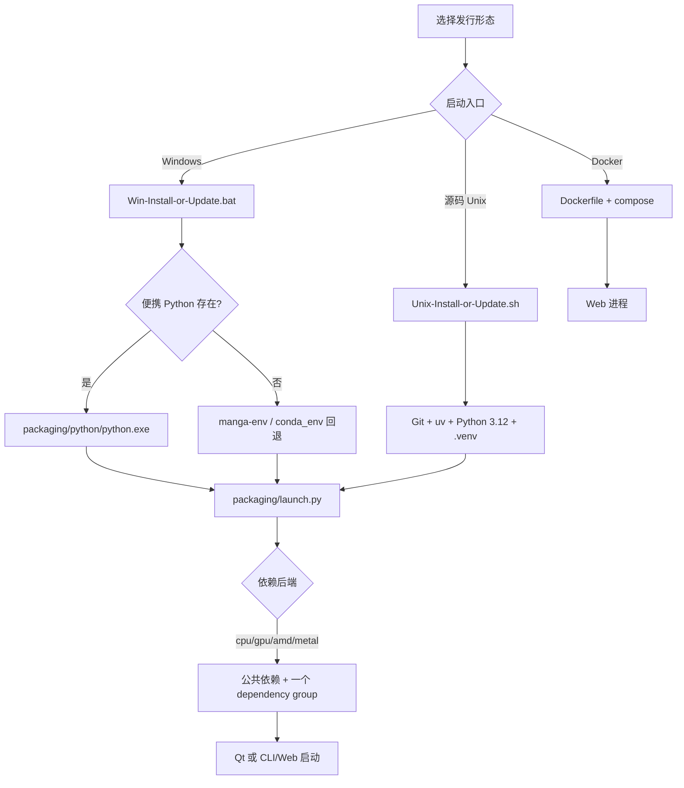

# 选择版本

本页帮助你在开始安装前选择发行形态和计算后端。它只回答“应该使用哪套安装入口”；具体 Python/uv 前置条件见[安装要求](./requirements.md)，Windows 便携包、源码环境、Docker 的完整步骤分别见[Windows 便携版](./windows-portable.md)、[Windows 源码安装](./source-windows.md)和[Docker 部署](./docker.md)。

## 功能边界 {#scope}

| 版本或形态 | 适合 | 本页不负责 |
| --- | --- | --- |
| Windows 便携安装/更新 | Windows 用户希望解压后使用，并由维护菜单安装依赖、同步代码和更新版本 | 不承诺无需下载依赖；首次安装仍需网络和磁盘空间 |
| 源码环境 | 开发者、需要修改源码或在 Linux/macOS 上运行的用户 | 不提供打包的 Python；需要 Git、uv 和 Python 3.12 |
| Docker CPU | 服务器或本地容器中运行 Web UI，优先兼容性 | 不启动 Qt 桌面界面；不自动获得 GPU |
| Docker GPU | 使用 NVIDIA 容器运行 Web UI | 只覆盖 compose 中声明的 NVIDIA 路径；不等同于 AMD/Metal 方案 |
| 计算后端选择 | 在安装脚本或 `uv sync` 时选择 CPU、NVIDIA GPU、AMD ROCm 或 Apple Metal 依赖组 | 不会改变翻译器、OCR 或工作流选择 |

不要把“便携包/源码/Docker”与“CPU/GPU/AMD/Metal”混成同一个选项：前者决定如何得到并启动项目，后者决定 PyTorch、ONNX 等运行依赖。

## UI 操作与选择流程 {#ui-operations}

### Windows 便携包

1. 解压发行包后，在包根目录运行 `Win-Install-or-Update.bat`。脚本以自身目录为工作目录，优先寻找 `packaging/python/python.exe`。
2. 如果没有便携 Python，脚本会按旧布局寻找 `manga-env` Conda 环境或 `conda_env`；两者都不存在时显示错误并退出，不会静默使用系统 Python。
3. 维护菜单显示当前分支和镜像源。选择“安装”后先选择下载线路，再同步代码、检测计算设备、选择依赖方案并安装依赖。
4. 安装完成后运行 `Win-Start.bat`。它沿用同样的便携 Python 优先、旧 Conda 回退顺序，然后启动 `desktop_qt_ui\main.py`。
5. 启动失败时，脚本显示退出码并提示重新运行安装/更新脚本；不要把错误窗口截图中的本地路径或环境变量上传。

维护菜单的选项如下。菜单实际由 `packaging/launch.py --maintenance` 在终端中打印，不是 Qt 设置页。

| UI 调用 key（源码调用） | English 实际值 | 简体中文实际值 |
| --- | --- | --- |
| `L("漫画翻译器 - 安装或更新", "Manga Translator UI - Install / Update")` | Manga Translator UI - Install / Update | 漫画翻译器 - 安装或更新 |
| `L("[1] 安装 (检测显卡, 选择 CPU/GPU 版本并安装依赖)", "[1] Install (detect GPU, choose CPU/GPU build, install dependencies)")` | [1] Install (detect GPU, choose CPU/GPU build, install dependencies) | [1] 安装 (检测显卡, 选择 CPU/GPU 版本并安装依赖) |
| `L("[2] 更新 (代码+依赖)", "[2] Update (code + dependencies)")` | [2] Update (code + dependencies) | [2] 更新 (代码+依赖) |
| `L("[3] 切换分支 (main/beta)", "[3] Switch branch (main/beta)")` | [3] Switch branch (main/beta) | [3] 切换分支 (main/beta) |
| `L("[4] 切换版本 (按 tag)", "[4] Switch version (by tag)")` | [4] Switch version (by tag) | [4] 切换版本 (按 tag) |
| `L("[5] 切换镜像源", "[5] Switch mirror")` | [5] Switch mirror | [5] 切换镜像源 |
| `L("[6] 重新检查版本", "[6] Re-check version")` | [6] Re-check version | [6] 重新检查版本 |
| `L("[7] 切换语言 (中文/English)", "[7] Language (中文/English)")` | [7] Language (中文/English) | [7] 切换语言 (中文/English) |
| `L("[8] 退出", "[8] Exit")` | [8] Exit | [8] 退出 |

这里没有 `en_US.json`/`zh_CN.json` 的 locale key；维护菜单使用 `L(zh, en)` 硬编码双语调用，并将语言保存到 `packaging/maintenance_config.json`。表中把调用表达式作为 key，避免把环境变量或后端字段冒充 UI i18n key。

### 源码环境

在项目根目录使用 Python 3.12 和 uv。按硬件只选择一组依赖：

```bash
python -m pip install uv
uv sync                                      # 默认 GPU 组：NVIDIA CUDA 13.0
uv sync --no-default-groups --group cpu     # CPU
uv sync --no-default-groups --group amd     # Linux AMD ROCm
uv sync --no-default-groups --group metal   # macOS Apple Silicon
```

AMD 方案在 Windows 上不是普通 `uv sync --group amd` 的等价替代；安装入口还要按源码逻辑安装 Radeon SDK/配套 PyTorch。不要从多个后端组重复同步。

### Docker

使用 `packaging/docker-compose.yml` 时，选择一个服务而不是同时启动 CPU 和 GPU 服务：

```bash
docker compose -f packaging/docker-compose.yml up --build manga-translator-cpu
docker compose -f packaging/docker-compose.yml up --build manga-translator-gpu
```

CPU 服务把宿主机 `8000` 映射到容器 `8000`；GPU 服务把宿主机 `8001` 映射到容器 `8000`。浏览器访问宿主机端口，不要直接把容器端口当作地址。Docker 镜像的默认命令是 Web 服务，不会打开 Qt 界面。

## 版本与后端选项 {#options}

| 存储值 | English | 简体中文 | 选择条件与效果 |
| --- | --- | --- | --- |
| `portable` | Portable Windows package | Windows 便携包 | Windows；脚本优先使用包内 Python，可回退旧 Conda |
| `source` | Source environment | 源码环境 | 需要修改源码、开发或在 Unix 系统运行 |
| `docker-cpu` | Docker CPU | Docker CPU 版 | 容器 Web UI；使用 CPU 依赖组 |
| `docker-gpu` | Docker GPU | Docker GPU 版 | 容器 Web UI；compose 声明 NVIDIA GPU |
| `cpu` | CPU build | CPU 版本 | 通用兼容性优先；速度和模型阶段性能通常较低 |
| `gpu` | NVIDIA CUDA build | NVIDIA CUDA 版本 | 需要 NVIDIA 驱动支持 CUDA 13.0；使用 `onnxruntime-gpu`、CUDA PyTorch 和 `xformers` |
| `amd` | AMD ROCm build | AMD ROCm 版本 | Linux 使用 ROCm 依赖组；Windows 是实验路径且有额外驱动/SDK要求 |
| `metal` | Apple Metal build | Apple Metal 版本 | macOS Apple Silicon；使用 MPS PyTorch 和 CPU ONNX Runtime |

`portable`、`source` 和 `docker-*` 是发行形态说明值，维护脚本实际接收的 `--requirements` 值只有 `auto`、`cpu`、`gpu`、`amd`、`metal`。它们不是可以直接传给同一参数的五个值。

## 运行机理 {#runtime}



Windows 维护菜单的“安装”顺序是选择 Git 镜像、强制同步代码、调用 `prepare_environment` 检测 GPU 并选择依赖组，最后安装包并清理缓存。自动选择不是无条件保证：NVIDIA 会检查 CUDA/驱动；AMD 会检查可识别的 gfx 和 ROCm 支持；Apple Silicon 选择 Metal；无法确定时提供手动选择，默认通常偏向 CPU。

源码环境的 `pyproject.toml` 将公共依赖放在 `[project].dependencies`，把 `cpu`、`gpu`、`amd`、`metal` 放在互斥 dependency groups；`uv` 的 `conflicts` 明确禁止多个后端组一起安装。Docker 在构建阶段执行 `uv sync --locked --no-default-groups --group "$BUILD_TYPE"`，因此 CPU/GPU 镜像在构建时已固定后端。

## 依赖与冲突 {#dependencies}

- **Python**：当前项目要求 `>=3.12,<3.13`。不要使用 Python 3.13；启动器会拒绝超出范围的版本。
- **后端互斥**：CPU、NVIDIA GPU、AMD ROCm、Metal 四组不能并装。切换已安装的 PyTorch 类型时，启动器可能先卸载 `torch`、`torchvision`、`torchaudio` 并清理 pip 缓存。
- **NVIDIA**：当前 uv 组绑定 CUDA 13.0 PyTorch 源；Docker compose 使用 CUDA 12.1 基础镜像，这是容器构建实现的独立路径，不要将两者写成同一版本承诺。
- **AMD**：Linux 由 ROCm 索引和依赖组处理；Windows 先安装 Radeon ROCm SDK，再安装配套 wheel，并要求源码提示的驱动版本。强制安装可能不兼容。
- **macOS**：Metal 组面向 Apple Silicon；macOS 不使用 GPU 版 ONNX Runtime。
- **网络与磁盘**：安装会下载公共依赖、PyTorch/ONNX 包和可能的模型；镜像源失败时安装菜单会允许重试，已安装包会保留。不要在其他 Python 进程占用 PyTorch 文件时切换后端。
- **Docker 资源**：compose 为 CPU 服务设置 8G 内存上限，为 GPU 服务设置 16G 上限，并为 GPU 服务声明 NVIDIA 设备；这不是所有机器的最低要求。

## 关联文件与格式 {#files}

| 文件/目录 | 本页涉及的作用 | 手改、兼容与安全注意 |
| --- | --- | --- |
| `pyproject.toml` | Python 版本、公共依赖、四个后端组、uv 冲突和索引 | 依赖组必须与平台匹配；不要同时启用冲突组 |
| `uv.lock` | 锁定源码/Docker 的解析结果 | 修改依赖声明后应重新锁定；`--locked` 会拒绝不一致的 lock |
| `packaging/launch.py` | 维护菜单、GPU 检测、后端选择、安装/更新、版本切换 | 菜单配置只保存语言；不要把密钥或私有地址写入维护配置 |
| `Win-Install-or-Update.bat`、`Win-Start.bat` | Windows 入口和 Python 回退 | 以脚本目录为工作目录；路径含非 ASCII 时旧 Conda 搜索位置会变化 |
| `Unix-Install-or-Update.sh`、`Unix-Start.sh` | Linux/macOS 的 Git、uv、`.venv` 和启动入口 | 安装脚本会克隆代码并创建 `.venv`；仅在可信目录运行 |
| `packaging/Dockerfile`、`packaging/docker-compose.yml` | CPU/GPU 镜像、端口、卷和健康检查 | compose 中管理员密码只是示例，生产部署必须替换并使用安全注入 |
| `packaging/docker-entrypoint.sh` | 空卷首次启动时恢复默认 config/fonts/dict/server data | 恢复只在目标目录为空时发生；卷内数据不会被自动覆盖 |
| `packaging/maintenance_config.json` | 维护菜单语言的 JSON 小配置 | 不公开用户环境信息；该文件不是核心 `config.json` |

安装选择不会直接读写用户图片、翻译 JSON 或调试产物；这些文件由实际运行形态创建，分别见工作流、编辑器和调试页面。

## 截图与流程图边界 {#visuals}

本页使用 Mermaid 表达发行形态、入口、后端组和启动链；图中没有真实主机、用户名、路径或凭据。按截图计划，未来可在脱敏有头模式下补充 Windows 维护菜单、`--help` 和 Docker Web 健康状态截图，但本次没有启动安装器、没有生成截图，也不把终端静态输出伪装成运行验证。

截图若补充，必须隐藏用户目录、Git 远程以外的私有地址、环境变量值、管理员密码、API Key、令牌、模型缓存路径以及用户图片/提示词。

## 源码依据 {#source-evidence}

| 层级 | 文件 | 本页核对内容 |
| --- | --- | --- |
| 项目约束 | `pyproject.toml` | Python 3.12、公共依赖、CPU/GPU/AMD/Metal 组、uv conflicts 和 PyTorch 索引 |
| Windows 入口 | `Win-Install-or-Update.bat`、`Win-Start.bat` | 便携 Python 优先、旧 Conda 回退、维护启动和 Qt 启动 |
| Unix 入口 | `Unix-Install-or-Update.sh`、`Unix-Start.sh` | Git/uv/Python/.venv 创建、源码检查和启动回退 |
| 安装与调度 | `packaging/launch.py` | `DEP_VARIANTS`、GPU/架构检测、PyTorch 冲突处理、维护菜单、版本/分支/镜像操作 |
| 容器 | `packaging/Dockerfile`、`packaging/docker-compose.yml`、`packaging/docker-entrypoint.sh` | 构建组、8000/8001 映射、卷、资源限制、默认文件恢复和 healthcheck |
| 研究依据 | `doc/wiki/research/phase0-related-files-formats-debug-safety.md`、`default-sources.md` | 文件安全边界、配置层级和不展示敏感内容的规则 |

## 验证记录 {#verification}

| 验证内容 | 状态 | 说明 |
| --- | --- | --- |
| 页面合同与中英文镜像 | 完成 | 两页保持相同章节、锚点、表格和 Mermaid 结构 |
| 源码与安装入口 | 完成 | 已核对 `pyproject.toml`、Windows/Unix 脚本、`launch.py` 和 Docker 文件 |
| UI 调用与双语值 | 完成 | 维护菜单按 `L(zh, en)` 调用逐项记录；该菜单没有 locale JSON key |
| 敏感信息审查 | 完成 | 未写入真实密钥、令牌、用户名、私有绝对路径、密码、图片或提示词 |
| 有头安装/运行 | 待运行验证 | 本次未执行安装、未启动 Qt/Web、未生成截图 |
| 静态检查与构建 | 待执行 | 目标命令：`node scripts/verify-route-mirror.mjs doc/wiki`、`node scripts/verify-source-evidence.mjs doc/wiki`、`npm run docs:build --prefix doc/wiki` |
