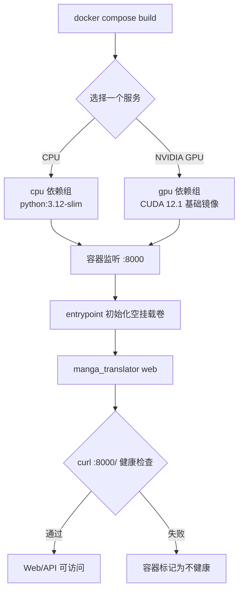

# Docker 部署

本页说明如何从当前源码构建 Web 服务的 CPU 或 NVIDIA GPU 容器，以及如何映射端口、保存配置和检查服务状态。Docker 镜像提供 Web 界面与 HTTP API，不包含桌面 Qt 工作区；Web 用户操作和 HTTP 契约分别见对应页面。本页不覆盖 Docker 发布镜像的来源、反向代理的具体配置或宿主机级备份策略。

## 使用 Compose 启动

`packaging/docker-compose.yml` 同时定义 CPU 和 GPU 服务，但通常只启动其中一个，避免占用两个 Web 端口和两份模型资源。先在仓库的 `packaging/` 目录执行命令；Compose 的 build context 仍是项目根目录。

### CPU 服务

```bash
docker compose up --build -d manga-translator-cpu
docker compose logs -f manga-translator-cpu
```

健康后访问 `http://127.0.0.1:8000/`。停止容器但保留绑定卷中的数据：

```bash
docker compose stop manga-translator-cpu
docker compose down
```

### NVIDIA GPU 服务

宿主机必须已经安装兼容的 NVIDIA 驱动和 NVIDIA Container Toolkit：

```bash
docker compose up --build -d manga-translator-gpu
docker compose logs -f manga-translator-gpu
```

健康后访问 `http://127.0.0.1:8001/`。容器内部仍监听 `8000`，只是 GPU Compose 服务把宿主机 `8001` 映射到容器 `8000`。

首次访问 Web 登录页时，按页面提示创建第一个管理员账号。Compose 中的 `MANGA_TRANSLATOR_ADMIN_PASSWORD` 只是旧的服务管理密码设置：它要求至少 6 个字符，不能替代 `/auth/setup`，也不会自动创建登录账号。不要使用仓库 Compose 文件中的示例密码；公开部署前应通过未提交的环境覆盖或管理配置设置新的随机密码。

## 配置与选项对照

Docker 部署没有桌面 Qt 控件，因此没有可核对的桌面 UI 调用 key；以下表格记录此边界，而不是把环境变量冒充界面文案。Web 页面自己的文字属于 Web 页面范围，不在本页重复。

| UI 调用 key | English 实际值 | 简体中文实际值 |
| --- | --- | --- |
| 无（Docker Compose/CLI 操作） | None (Docker Compose/CLI operation) | 无（Docker Compose/CLI 操作） |
| `MT_WEB_HOST`（启动参数/环境变量） | Web host (not a desktop label) | Web 监听地址（不是桌面标签） |
| `MT_WEB_PORT`（启动参数/环境变量） | Web port (not a desktop label) | Web 监听端口（不是桌面标签） |
| `MT_USE_GPU`（启动参数/环境变量） | Use GPU (runtime flag, not a desktop label) | 使用 GPU（运行时标志，不是桌面标签） |
| `MT_MODELS_TTL`（启动参数/环境变量） | Models TTL (runtime flag, not a desktop label) | 模型 TTL（运行时标志，不是桌面标签） |
| `MT_RETRY_ATTEMPTS`（启动参数/环境变量） | Retry attempts (runtime flag, not a desktop label) | 重试次数（运行时标志，不是桌面标签） |
| `MT_VERBOSE`（启动参数/环境变量） | Verbose logging (runtime flag, not a desktop label) | 详细日志（运行时标志，不是桌面标签） |

Compose 当前为 CPU 设置 `MT_WEB_HOST=0.0.0.0`、容器端口 `8000`、`MT_USE_GPU=false`；GPU 服务仍使用容器端口 `8000`，但设置 `MT_USE_GPU=true` 并映射宿主机 `8001`。这些是部署配置，不是 `en_US.json`/`zh_CN.json` 中的 UI key。

## 镜像如何运行

Dockerfile 使用多阶段构建：CPU 基于 `python:3.12-slim`，GPU 基于 `nvidia/cuda:12.1.0-cudnn8-runtime-ubuntu22.04`，两者都安装系统库并在 `/app` 中运行源码。构建阶段执行 `uv sync --locked --no-default-groups --group cpu` 或 `--group gpu`，因此依赖必须与锁文件和构建类型匹配。

镜像暴露并监听容器端口 `8000`，默认命令是 `python -m manga_translator web --host 0.0.0.0 --port 8000`。entrypoint 在启动前检查挂载的 `config`、`fonts`、`dict` 和服务端数据目录：目录为空时，从镜像内的默认备份复制初始化内容，然后执行主命令。镜像和 Compose 都以 `curl http://localhost:8000/` 做健康检查；连续失败三次且经过 60 秒启动宽限期后，容器会被标记为不健康。



宿主机 `8000:8000`（CPU）或 `8001:8000`（GPU）只改变外部入口，不改变服务内部端口。`0.0.0.0` 是监听所有 IPv4 接口，不是浏览器地址；局域网或公网访问还受防火墙、路由和反向代理影响。

## 依赖、资源与冲突

- CPU 与 GPU 是 Compose 中的两个替代服务；不要同时启动，除非确实需要两套隔离服务并能承担各自的内存、模型缓存和端口。
- GPU 服务要求 NVIDIA Container Toolkit，并在 Compose 中请求所有可用 NVIDIA GPU；AMD ROCm 和 macOS Metal 没有对应的 Compose 服务定义，不能把 CPU/GPU 服务当作它们的安装方案。
- CPU 镜像使用 `uv` 的 `cpu` 组；GPU 镜像使用 `gpu` 组。两组分别包含 `onnxruntime` 或 `onnxruntime-gpu`，GPU 还包含 CUDA 对应的 Torch 和 `xformers`，不可交叉复制依赖。
- 模型首次启用时可能下载并占用大量磁盘、内存或显存；Compose 的内存限制只是容器限制，不是模型兼容性保证。CPU 服务配置上限 8G、预留 2G；GPU 服务上限 16G、预留 4G，需按机器调整。
- Dockerfile 使用 CUDA 12.1 运行时基础镜像，而项目裸 `uv sync` 的默认 GPU 索引以当前 `pyproject.toml` 为准；不要从 Dockerfile 推断其他平台的安装命令。

## 持久化卷、环境变量与格式

Compose 路径均相对于 `packaging/`：

| 宿主目录 | 容器目录 | 内容与注意事项 |
| --- | --- | --- |
| `data/fonts` | `/app/fonts` | 字体资源；支持项目实际字体格式，不要放入私人字体文件后直接分享卷 |
| `data/dict` | `/app/dict` | 提示词、词典和规则；可能包含私有提示词 |
| `data/result` | `/app/result` | 翻译结果和可能的用户图片/文本 |
| `data/models` | `/app/models` | 模型权重与缓存，通常占用较大空间 |
| `data/logs` | `/app/logs` | 日志目录；日志可能包含路径、错误和任务信息 |
| `data/server` | `/app/manga_translator/server/data` | 账号、权限、会话、历史和用户资源 |
| `data/config` | `/app/config` | 配置文件和模板；空目录会由 entrypoint 初始化 |

若要让 Web 管理界面保存的服务器 API 配置在重建容器后保留，先创建空的 `packaging/data/app.env`，再取消 Compose 中 `./data/app.env:/app/.env` 的注释。不要把 `.env`、账号数据、会话令牌、API Key、用户图片或提示词提交到 Git；挂载目录也应按最小权限和备份保留期管理。

运行时环境变量包括 `MT_WEB_HOST`、`MT_WEB_PORT`、`MT_USE_GPU`、`MT_DISABLE_ONNX_GPU`、`MT_MODELS_TTL`、`MT_RETRY_ATTEMPTS` 和 `MT_VERBOSE`。它们覆盖 Web 启动行为、后端选择、模型缓存、重试或日志；具体默认值以 `manga_translator/args.py` 和 Compose 为准。`MANGA_TRANSLATOR_ADMIN_PASSWORD` 只记录其存在和最短长度校验，不在页面展示其值。

## 截图与 Mermaid 边界

本页只使用 Mermaid 表达构建、启动、卷初始化和健康检查，不伪造 Docker Desktop、终端或 GPU 运行截图。未来截图必须使用脱敏镜像、虚构账号和最小公开样例，并裁掉用户名、私有绝对路径、密钥、Token、服务器地址、用户图片、OCR/译文和提示词。容器实际启动、GPU 可见性、健康检查和 Web 登录应在独立运行验证中确认；静态页面完成不等待未来统一验收。

## 源码依据

| 层级 | 文件 | 本页核对内容 |
| --- | --- | --- |
| 镜像构建 | `packaging/Dockerfile` | CPU/GPU 基础镜像、Python、依赖组、端口、entrypoint、健康检查和启动命令 |
| Compose 编排 | `packaging/docker-compose.yml` | 8000/8001 映射、环境变量、卷、GPU 设备、内存限制、重启策略和健康检查 |
| 启动初始化 | `packaging/docker-entrypoint.sh` | 空的配置、字体、字典和服务端数据挂载卷如何从默认备份恢复 |
| Web CLI | `manga_translator/args.py` | `web` 的 host/port/GPU/TTL/重试/详细日志参数及环境变量覆盖 |
| 管理密码 | `manga_translator/server/core/config_manager.py` | `MANGA_TRANSLATOR_ADMIN_PASSWORD` 最短长度和写入旧管理设置的行为 |
| Web 服务 | `manga_translator/server/main.py`、`manga_translator/server/routes/` | Web 页面、会话、翻译端点和健康检查目标的服务边界 |
| 依赖声明 | `pyproject.toml`、`uv.lock` | Python 版本、CPU/GPU 互斥组、Torch/ONNX 来源和锁定安装 |

## 验证记录

| 验证内容 | 状态 | 说明 |
| --- | --- | --- |
| 双语页面、frontmatter、pageId、章节和锚点 | 已完成 | 中文与英文逐节镜像，`pageId` 为 `install.docker` |
| Dockerfile/Compose/entrypoint 静态核对 | 已完成 | 已核对构建类型、端口、卷、环境变量、初始化和 healthcheck |
| 依赖、端口、管理密码与安全边界 | 已完成 | 源码核对；未展示密码值、令牌、用户名、私有路径或用户内容 |
| Docker Compose 实际构建/启动、GPU 可见性和 Web 登录 | 未运行 | 需要具备 Docker、NVIDIA Toolkit 和脱敏运行环境；不以静态结论替代运行验证 |
| Mermaid/图片边界 | 已完成 | 仅保留有信息量的 Mermaid；未伪造截图 |
| VitePress 静态检查与构建 | 已完成 | `npm run docs:build --prefix doc/wiki` 通过 |
