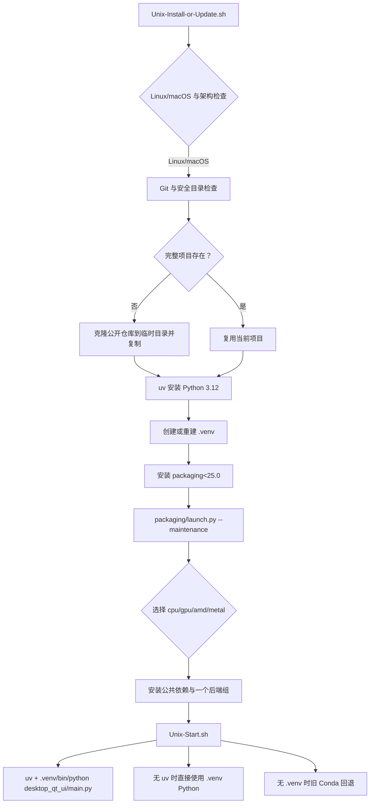

# Linux 与 macOS 安装

本页说明 Linux/macOS 的源码安装、更新和 Qt 桌面启动入口。它只负责 Unix 引导脚本、`.venv`、uv 和平台依赖选择；Windows 便携版、Docker、版本切换和卸载分别见对应安装页。

脚本会在脚本所在目录工作。可以在一个新的、可写且信任的目录中下载两个脚本，也可以在已经克隆的完整仓库根目录中运行安装脚本。安装过程中不会要求把密钥、Token 或用户图片写入命令行。

## 安装与启动

### 首次安装

1. 在目标目录下载 `Unix-Install-or-Update.sh`。不要把它放进含有无关文件的非空目录；脚本会拒绝在那里克隆。
2. 赋予两个入口执行权限：

   ```bash
   chmod +x Unix-Install-or-Update.sh Unix-Start.sh
   ```

3. 运行安装/更新入口：

   ```bash
   ./Unix-Install-or-Update.sh
   ```

4. 首次确认后，脚本检查平台和 Git；没有 Git 时在 macOS 尝试 Homebrew 或 Xcode Command Line Tools，在 Linux 尝试 `apt-get`、`dnf`、`pacman` 或 `apk`。随后自动安装 uv、Python 3.12，并创建项目根目录下的 `.venv`。
5. 引导脚本只预装维护菜单所需的 `packaging<25.0`，然后进入双语 Python 维护菜单。首次完整依赖安装在菜单的“安装”操作中进行。

已下载完整仓库时，可直接在仓库根目录运行同一入口。它会复用该目录，不会再次克隆。

### 启动桌面 UI

安装完成后，在项目根目录运行：

```bash
./Unix-Start.sh
```

`Unix-Start.sh` 优先使用 `.venv/bin/python`，并优先通过 uv 执行 `desktop_qt_ui/main.py`；找不到 uv 时仍可直接调用 `.venv` Python。只有 `.venv` 不存在时，才按固定路径或 Conda 环境尝试旧环境回退。旧环境只适合兼容已有安装，不是新的安装路径。

可以先做不启动 UI 的检查：

```bash
MANGAT_DRY_RUN=1 ./Unix-Start.sh
```

该模式只打印将要执行的命令；它仍会检查项目文件和 `.venv`。安装引导脚本也支持 `MANGAT_AUTO_CONFIRM=1` 自动回答第一次确认，适合受控自动化，不应把它与未知目录或未知仓库地址组合使用。

### 维护菜单

`Unix-Install-or-Update.sh` 最终执行 `packaging/launch.py --maintenance`。菜单会显示当前分支和镜像源，并把语言选择持久化到 `packaging/maintenance_config.json`。更新、切换分支或 tag 前先备份未提交的源码和本地配置；更新操作可能改变工作树内容。

| UI 调用 key | English 实际值 | 简体中文实际值 |
| --- | --- | --- |
| `maintenance_menu.title` | Manga Translator UI - Install / Update | 漫画翻译器 - 安装或更新 |
| `maintenance_menu.prompt` | Select an action: | 请选择操作： |
| `maintenance_menu.1` | [1] Install (detect GPU, choose CPU/GPU build, install dependencies) | [1] 安装 (检测显卡, 选择 CPU/GPU 版本并安装依赖) |
| `maintenance_menu.2` | [2] Update (code + dependencies) | [2] 更新 (代码+依赖) |
| `maintenance_menu.3` | [3] Switch branch (main/beta) | [3] 切换分支 (main/beta) |
| `maintenance_menu.4` | [4] Switch version (by tag) | [4] 切换版本 (按 tag) |
| `maintenance_menu.5` | [5] Switch mirror | [5] 切换镜像源 |
| `maintenance_menu.6` | [6] Re-check version | [6] 重新检查版本 |
| `maintenance_menu.7` | [7] Language (中文/English) | [7] 切换语言 (中文/English) |
| `maintenance_menu.8` | [8] Exit | [8] 退出 |
| `maintenance_menu.continue` | Press Enter to continue... | 按回车键继续... |
| `Unix-Start.sh` error literal | Run ./Unix-Install-or-Update.sh first | Run ./Unix-Install-or-Update.sh first |

这些不是 `desktop_qt_ui/locales/*.json` 中的 Qt 控件 key：维护菜单由 `packaging/launch.py` 的 `L(chinese, english)` 调用生成，Unix shell 的错误提示则是源码硬编码英文。不要把脚本提示改写成桌面 UI 标签；页面中保留实际显示值。

## 平台依赖选择

项目要求 Python `>=3.12,<3.13`，即当前安装脚本固定使用 Python 3.12。`pyproject.toml` 把公共依赖与四个互斥 dependency group 分开；一次环境只能选择一个后端组。

| 存储值 | English | 简体中文 |
| --- | --- | --- |
| `cpu` | CPU version | CPU 版本 |
| `gpu` | NVIDIA CUDA GPU version | NVIDIA CUDA GPU 版本 |
| `amd` | AMD ROCm version | AMD ROCm 版本 |
| `metal` | Apple Metal version | Apple Metal 版本 |
| `auto` | Automatic selection | 自动选择 |
| `1`（维护菜单） | Install | 安装 |
| `2`（维护菜单） | Update | 更新 |
| `3`–`8`（维护菜单） | Branch / tag / mirror / version / language / exit actions | 分支、版本、镜像、语言和退出操作 |

安装阶段的自动选择大致如下：

- Apple Silicon macOS 选择 `metal`，使用 PyTorch MPS 版本、CPU 版 ONNX Runtime，以及 Cocoa 框架支持。
- Linux NVIDIA 在 CUDA 驱动可用且兼容时选择 `gpu`，否则可以选择 `cpu`。
- Linux AMD 只在检测到受支持的 ROCm 架构时建议 `amd`；无法识别或不兼容时默认建议 `cpu`。强制 AMD 选项明确提示兼容性不能保证。
- 无法检测硬件或 Intel GPU 时提供手动选择，CPU 是兼容性优先的回退。

`uv sync` 的项目默认组是 `gpu` 和 `packaging`，但 Unix 维护流程根据检测结果选择对应变体。不要手动同时启用 `cpu`、`gpu`、`amd`、`metal`；`tool.uv.conflicts` 已将它们声明为互斥，混装会造成 PyTorch/ONNX 后端冲突。

## 运行机理



引导脚本的职责止于项目、Python 和维护菜单的 bootstrap；完整依赖安装、代码更新、分支/tag、镜像源与依赖完整性检查由 `packaging/launch.py` 完成。启动脚本不会自动同步依赖，也不会把缺少 `.venv` 静默变成系统 Python；缺少环境时会要求重新运行安装入口。

在更新操作中，维护菜单会检查本地/远程版本和 commit，并检查当前 PyTorch 变体所需依赖；需要时再拉取代码和安装缺失依赖。网络失败可通过菜单切换镜像源重试，但镜像源不改变软件后端选择。

## 依赖、冲突与平台限制

- **Python**：只支持 3.12；3.13 或其他版本不能作为受支持环境。
- **后端互斥**：`cpu`、`gpu`、`amd`、`metal` 不能同时安装。NVIDIA GPU 组包含 `onnxruntime-gpu` 与 `xformers`；CPU 组使用 `onnxruntime`；macOS Metal 组也使用 CPU 版 ONNX Runtime。
- **AMD**：ROCm 组中的 PyTorch/Triton 条件限定 Linux x86_64；macOS 不应选择 `amd`。不受支持的 AMD 架构即使强制安装也可能无法运行。
- **架构**：安装脚本明确支持 macOS `arm64`/`x86_64` 和 Linux `x86_64`/`amd64`；其他 Linux 架构需用户确认，项目未承诺 bundled wheels 可用。
- **编译与 wheel**：`pydensecrf` 按平台从项目声明的预编译 wheel 来源解析；目标平台没有匹配 wheel 时安装会失败，不应自行展示或提交私有 wheel。
- **图形前置**：桌面 UI 依赖 PyQt6。Linux 的 Qt/系统图形库、macOS 的图形权限与驱动仍由操作系统提供；无头服务器不是本页的桌面 UI 运行环境。
- **运行资源**：检测、OCR、修复、翻译和排版还可能按所选功能下载/读取模型、字体和字典。API 密钥只在用户自己的配置中填写，不能放进脚本参数、日志或截图。

## 关联文件与格式

| 文件或目录 | 作用 | 手动修改/兼容提醒 |
| --- | --- | --- |
| `Unix-Install-or-Update.sh` | 检查平台、Git、仓库目录、uv、Python 和 `.venv`，再进入维护菜单 | 只从可信公开来源取得；保留 shell 执行权限 |
| `Unix-Start.sh` | 检查项目并按 `.venv`、uv、旧 Conda 顺序启动 Qt UI | 不要指向含未知代码的环境；`MANGAT_DRY_RUN=1` 仅用于无副作用检查 |
| `pyproject.toml` | Python 版本、公共依赖、四个后端组、PyTorch index 和平台 wheel 来源 | 后端组互斥；改动后应同步 `uv.lock` 并重新验证 |
| `uv.lock` | 锁定解析后的依赖版本和来源 | 不手工复制另一平台的 torch/ONNX 条目 |
| `.venv/` | Unix 项目虚拟环境 | 可删除后重新运行安装；不要提交到 Git |
| `packaging/launch.py` | 双语维护菜单、GPU 检测、依赖安装、更新与版本信息 | 菜单更新可能修改代码工作树；不要把敏感配置写入日志 |
| `packaging/maintenance_config.json` | 保存维护菜单语言等维护偏好 | 仅保存维护配置，不是 API 密钥仓库 |
| `config/`、`fonts/`、`dict/` | 运行时配置、字体和字典资源 | 只使用公开/脱敏样例；用户配置和私有提示词不进入文档 |

## Mermaid 与截图边界

上图只表达脚本和环境的静态调用边界，不代表每台机器都会走同一硬件分支。实际安装菜单的显卡检测、镜像回退和错误路径应在受控环境中复现后再补充截图。

本页不嵌入真实用户截图，也不记录用户名、私有绝对路径、密钥、Token、用户图片或提示词。未来截图只能使用公开样例、脱敏配置，并同时提供中英文 alt、图注、平台/版本/主题信息；终端截图应裁去路径和仓库私密信息。无头环境只做 shell/静态验证，不能冒充 Qt 有头模式截图。

## 源码依据

| 层级 | 文件 | 本页核对内容 |
| --- | --- | --- |
| Unix 引导 | `Unix-Install-or-Update.sh` | 平台/架构、Git 安装、目录安全检查、克隆、uv、Python 3.12、`.venv` 和维护入口 |
| Unix 启动 | `Unix-Start.sh` | `.venv` 优先、uv 调用、直接 Python 启动、旧 Conda 回退和 dry-run |
| 依赖定义 | `pyproject.toml` | Python 版本、公共依赖、`cpu`/`gpu`/`amd`/`metal` 组、互斥声明、平台来源 |
| 维护调度 | `packaging/launch.py` | 双语菜单、GPU/架构识别、PyTorch 源、依赖缺失检查、更新和版本切换 |
| 维护偏好 | `packaging/maintenance_config.json` | 维护菜单语言配置的持久化位置 |

## 安全审查

- 仅在信任的目录执行脚本。脚本会拒绝向含无关文件的非空目录克隆，但不会替用户审查下载内容。
- `Unix-Install-or-Update.sh` 会通过网络获取 Git、uv、公开仓库和依赖；在企业网络中应按组织策略审查网络出口、证书和镜像源。
- `sudo` 只用于安装系统 Git；输入 sudo 密码时不要把密码写入命令、终端记录或文档。
- `MANGAT_REPO_URL`、`MANGAT_UV` 等环境变量属于执行控制项。使用自定义仓库/uv 前先验证来源；不要把包含密钥的环境变量或 `.env` 分享给他人。
- 更新、克隆和解压会写入当前目录；先备份未提交改动。不要以 root 运行整个应用，除非明确了解文件所有权影响。
- 文档验证使用公开路径和脱敏占位，不展示真实密钥、Token、用户名、私有路径、用户图片或提示词。

## 验证记录

| 验证内容 | 状态 | 说明 |
| --- | --- | --- |
| 源码与依赖核对 | 完成 | 已核对两个 Unix 脚本、`pyproject.toml` 与 `packaging/launch.py` 的静态行为 |
| UI 调用与双语值 | 完成 | 维护菜单 `L(chinese, english)` 调用和 shell 硬编码提示已逐项列出；无 desktop locale key 被冒充为脚本菜单 |
| shell 静态检查 | 完成 | `bash -n Unix-Install-or-Update.sh Unix-Start.sh` 通过 |
| 启动 dry-run | 完成 | `MANGAT_DRY_RUN=1 ./Unix-Start.sh` 在本仓库 `.venv` 可用时验证命令路径；不启动 Qt、不访问用户图片 |
| VitePress 构建 | 完成 | `npm run docs:build --prefix doc/wiki` 通过 |
| 双语镜像/源码字段检查 | 完成 | `verify-route-mirror.mjs`、`verify-source-evidence.mjs` 通过 |
| 有头模式截图 | 未执行 | 本次范围只完成静态文档和脱敏边界；不把截图缺失伪装成运行证据 |
