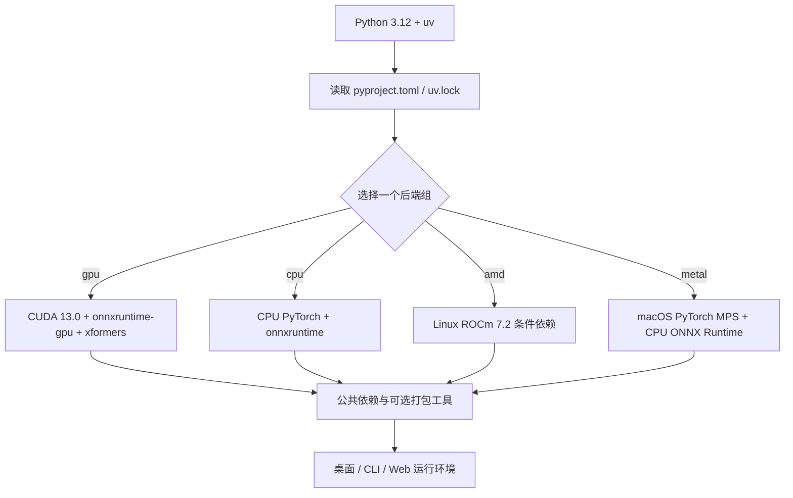

# 运行环境与依赖要求

## 功能边界

本页说明安装前置：Python/uv 版本、CPU/NVIDIA/AMD/Apple Silicon 后端、公共 Python 包、模型、字体和字典。Windows 便携包菜单与更新见[Windows 便携版](./windows-portable.md)，Unix 脚本见[Linux 与 macOS](./linux-and-macos.md)，Docker 卷见[Docker](./docker.md)。本页不记录 API Key、用户配置或翻译质量。

当前定义以 `pyproject.toml` 与 `uv.lock` 为准；`requirements_cpu.txt`、`requirements_gpu.txt`、`requirements_amd.txt`、`requirements_metal.txt` 是保留的旧式/平台说明，不应与当前 uv 环境混装。

## 安装前检查

1. 使用 Python **3.12**。约束为 `>=3.12,<3.13`，Python 3.13+ 不在支持范围内。
2. 安装 `uv`，在仓库根目录执行且只选择一个后端组。
3. 准备下载 PyTorch、模型和（启用语义断句时）HanLP 模型所需的网络与磁盘空间。
4. 在线翻译器仍需提供商凭据；凭据不属于本页。

| 目标环境 | 命令 | 说明 |
| --- | --- | --- |
| NVIDIA CUDA（默认） | `uv sync` | 默认 `gpu` 与 `packaging` 组，PyTorch 使用 CUDA 13.0 索引 |
| CPU | `uv sync --no-default-groups --group cpu` | CPU PyTorch 与 `onnxruntime` |
| Linux AMD ROCm | `uv sync --no-default-groups --group amd` | ROCm 7.2 索引；Linux x86_64 条件项安装 ROCm PyTorch/Triton |
| macOS Apple Silicon | `uv sync --no-default-groups --group metal` | PyPI PyTorch/MPS；ONNX Runtime 仍为 CPU 版 |

完成后可用 `uv run --no-sync python -m desktop_qt_ui.main` 启动桌面 UI；`--no-sync` 不重新解析或安装依赖。

## UI 操作

本页没有独立的桌面安装页：源码运行时通过终端选择依赖组，Windows 安装器检测显卡并选择方案。安装器文案来自 `packaging/launch.py` 与脚本，不是 `desktop_qt_ui/locales/*.json` 的桌面 i18n。

安装后桌面控件只改变运行行为，不替换已安装后端：

- “使用 GPU”（`label_use_gpu`）请求 GPU 加速，不会把 CPU 环境变成 CUDA 环境。
- “禁用 ONNX GPU 加速”（`label_disable_onnx_gpu`）仅关闭 ONNX Runtime GPU 路径。
- “翻译完成后卸载模型”（`label_unload_models_after_translation`）控制任务后释放显存/内存。
- “字体”（`label_font_family`）扫描系统字体和项目 `fonts/`；加入字体后重新打开下拉框刷新。

## 选项中英对照

| UI 调用 key | English 实际值 | 简体中文实际值 |
| --- | --- | --- |
| `label_use_gpu` | Use GPU | 使用 GPU |
| `label_disable_onnx_gpu` | Disable ONNX GPU Acceleration | 禁用 ONNX GPU 加速 |
| `label_unload_models_after_translation` | Unload Models After Translation | 翻译完成后卸载模型 |
| `label_font_family` | Font | 字体 |
| 安装器硬编码 `cpu` | CPU | CPU |
| 安装器硬编码 `gpu` | NVIDIA GPU / CUDA | NVIDIA GPU / CUDA |
| 安装器硬编码 `amd` | AMD GPU / ROCm | AMD GPU / ROCm |
| 安装器硬编码 `metal` | Apple Silicon / Metal | Apple Silicon / Metal |

最后四行是安装配置组和值，不是声称存在的 i18n key；`en_US.json`/`zh_CN.json` 没有对应安装方案 key。

## 运行机理

公共依赖在 `[project].dependencies`，硬件后端在 `[dependency-groups]`。`default-groups = ["gpu", "packaging"]` 使 `uv sync` 默认采用 NVIDIA；`conflicts` 声明 `cpu`、`gpu`、`amd`、`metal` 互斥。PyTorch/torchvision 按组绑定显式索引，`xformers` 仅 GPU 组，Metal 不使用 CUDA 索引。

安装和模型是两个阶段。`manga_translator/utils/inference.py` 以 `models/` 为模型根目录，OCR、检测、修复、上色、超分模型通常在首次启用时创建目录并下载/加载。`rendering/chinese_linebreak.py` 检查 HanLP 模型；缺失时记录并回退普通换行。

## 依赖与冲突

- **CPU**：不需要 CUDA/ROCm，兼容性高但速度受 CPU/内存限制。
- **NVIDIA GPU**：当前组含 `torch==2.13.0`、`torchvision==0.28.0`、`onnxruntime-gpu==1.28.0`、`xformers==0.0.35`；驱动需支持对应 CUDA。
- **AMD ROCm**：Linux x86_64 由 `pytorch-rocm72` 提供；Windows AMD 由安装器先装 Radeon ROCm SDK、再装配套 PyTorch wheels，属实验性路径。
- **Metal**：Apple Silicon 使用 PyPI PyTorch/MPS，不装 CUDA、`onnxruntime-gpu` 或 `xformers`。

不要在同一环境追加另一后端，或混用 `onnxruntime` 与 `onnxruntime-gpu`、不同 CUDA/ROCm 索引的 Torch。更换后端应新建环境或清理后按一组同步。

| 组件 | 冲突/前置 | 处理 |
| --- | --- | --- |
| `pydensecrf` | Python 3.12 的 Windows/macOS/Linux x86_64 优先预编译 wheel，其他回退可能需 C++ 工具 | 让 uv 按平台 source 选择，不跨平台复制 wheel |
| `xformers` | 仅 GPU 组 | 不从旧 GPU 文件复制到其他组 |
| Torch/Triton | 必须匹配同一平台索引；Windows AMD 还需 SDK/驱动 | 用锁文件或安装器成套安装 |
| 旧 requirements | 版本可能与当前 pyproject/lock 不同 | 当前安装优先 `uv sync --locked` |

**硬件与资源前置**：GPU 需相应驱动；模型下载需网络和空间；`fonts/` 支持 `.ttf`、`.otf`、`.ttc`；`dict/` 包含 `.txt` 词典及 `.yaml`/`.json` 提示词。在线服务还需网络、模型名、地址和凭据。

## 关联文件与格式

| 文件/目录 | 格式与作用 | 注意 |
| --- | --- | --- |
| `pyproject.toml` | TOML；依赖组、平台 marker、索引、互斥 | 修改后重锁并审查 marker |
| `uv.lock` | uv 解析版本和来源 | `uv sync --locked` 拒绝不一致锁文件 |
| `requirements_*.txt` | pip requirements 文本及索引/条件 | 旧式兼容资料，版本不代表当前 uv 环境 |
| `packaging/launch.py` | 安装器检查、GPU 检测、镜像回退、AMD 特殊安装 | 输出不是稳定 i18n 文案 |
| `models/` | 模型权重和缓存 | 按需创建，可能含大文件 |
| `fonts/` | `.ttf`/`.otf`/`.ttc` | 影响排版与 PSD 文本图层 |
| `dict/` | `.txt` 词典、`.yaml`/`.json` 提示词 | 按消费者 schema 编辑 |
| `config/config-example.json` / `config/config.json` | UTF-8 JSON；发行默认/用户配置 | 用户配置优先；不得公开私有路径或 API 配置 |

## 截图与流程图边界

本页只用 Mermaid 表达依赖组分支，不伪造安装器截图。未来截图须用脱敏环境，标注版本/平台/主题，裁掉用户名、私有绝对路径、令牌、Key、私有模型名和下载目录；安装失败与维护菜单截图归 Windows 便携版页。

## 源码依据

| 层级 | 文件 | 核对内容 |
| --- | --- | --- |
| 项目声明 | `pyproject.toml`、`uv.lock` | Python 范围、公共依赖、四组互斥、PyTorch 索引和 pydensecrf 来源 |
| 安装器 | `packaging/launch.py` | 版本检查、依赖解析、镜像回退、GPU 检测、Windows AMD ROCm 两阶段安装 |
| 模型 | `manga_translator/utils/inference.py` 及各模型模块 | `models/` 根目录和按需加载/下载 |
| 断句 | `manga_translator/rendering/chinese_linebreak.py` | HanLP 下载检查和普通换行回退 |
| 字体 | `desktop_qt_ui/utils/font_list.py`、`desktop_qt_ui/app_logic.py`、`desktop_qt_ui/ui/main_page/dynamic_settings.py` | 字体扫描、目录打开、下拉刷新 |
| i18n | `desktop_qt_ui/locales/en_US.json`、`zh_CN.json` | 四个桌面 key 的实际值 |
| 配置 | `desktop_qt_ui/core/config_models.py`、`desktop_qt_ui/services/config_service.py`、`config/config-example.json` | 默认值与用户配置边界 |

## 验证记录

| 内容 | 状态 | 说明 |
| --- | --- | --- |
| 双语结构、frontmatter、pageId | 已完成 | 两页同构，三列 i18n 表存在 |
| 源码和配置核对 | 已完成 | 已核对 pyproject、安装器、平台 requirements、模型/字体/字典路径和 locale |
| 四套环境实际安装 | 未完成 | 未下载或重建完整环境，需各平台脱敏验证 |
| 截图 | 未完成 | 未伪造截图，归属对应安装页 |
| 敏感信息审查 | 已完成 | 未写入 Key、Token、用户名、私有路径、用户图片或私有提示词 |
| Wiki 静态检查/build | 待主工作区执行 | 需在完整 doc/wiki 骨架中执行 |
