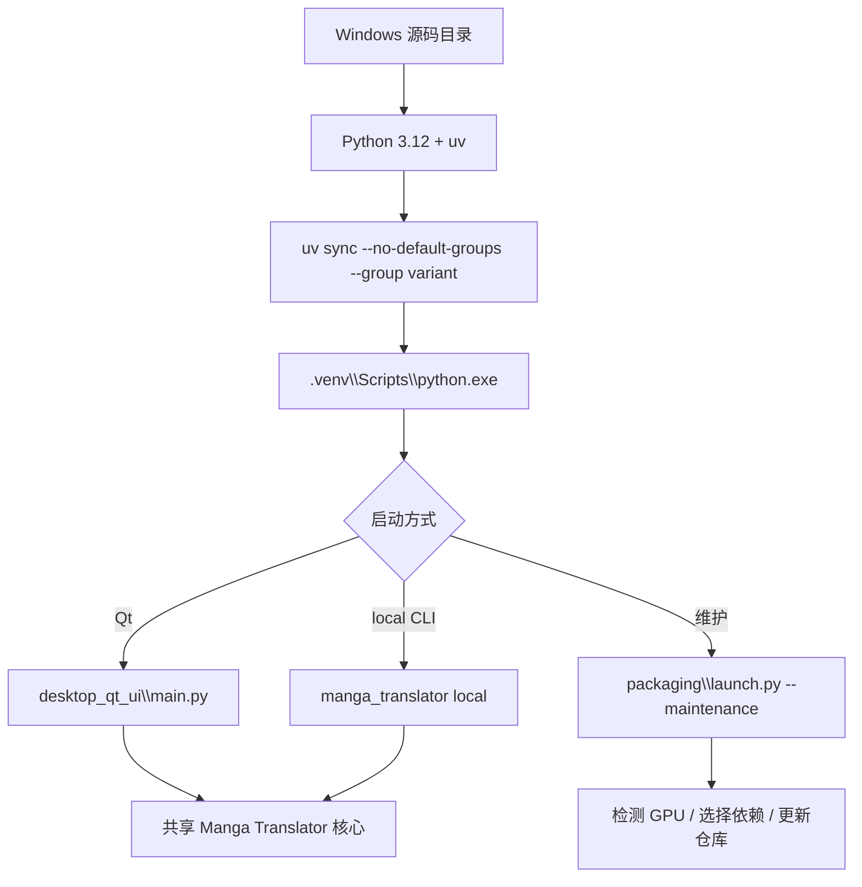

# Windows 源码安装

本页适合需要修改源码、运行未打包版本或希望自行管理 Python 环境的 Windows 用户。它说明从仓库到 Qt 启动的最小路径，不替代[安装要求](./requirements.md)中的硬件和依赖总表，也不替代[Windows 便携版](./windows-portable.md)的打包运行方式。

## 功能边界 {#scope}

源码安装会在仓库目录内使用 Python 3.12 和 uv 管理依赖，随后直接启动 Qt 桌面程序或 CLI。它不安装 Windows 便携 Python，不创建 Conda 环境，也不会自动把源码环境变成 Docker 镜像；AMD Windows 的特殊 ROCm 安装仍由项目启动器处理。

如果只想解压即用，选择便携包；如果只部署浏览器服务，选择 Docker。源码环境的优点是可以切换分支、修改代码、运行测试和精确选择依赖组，代价是需要自行维护 Git、uv、Python、模型和驱动。

## UI 操作 {#ui-operations}

### 准备仓库和工具

在 PowerShell 中执行以下命令。Python 版本必须在 `>=3.12,<3.13` 范围内：

```powershell
git clone https://github.com/hgmzhn/manga-translator-ui.git
Set-Location manga-translator-ui
py -3.12 --version
py -3.12 -m pip install uv
```

如果仓库已经存在，先进入仓库并确认工作区状态，再决定是否切换到 `main`、`beta` 或 tag。不要在有未提交修改时直接覆盖分支或执行会丢弃修改的 Git 操作。

### 按硬件选择一个依赖组

从项目根目录运行以下命令中的一个：

```powershell
# NVIDIA：pyproject.toml 的默认组，使用 CUDA 13.0 PyTorch 源
uv sync

# CPU：不启用默认组，只启用 CPU
uv sync --no-default-groups --group cpu

# Linux AMD；Windows AMD 不走此普通源码命令
uv sync --no-default-groups --group amd

# macOS Apple Silicon；不适用于 Windows
uv sync --no-default-groups --group metal
```

Windows 用户通常在 NVIDIA 和 CPU 之间选择。若是 AMD Windows，不要将 Linux 的 `amd` 命令照搬到 Windows；见下方“AMD Windows”小节。

### 启动源码程序

```powershell
# Qt 桌面界面
uv run --no-sync --python .venv\Scripts\python.exe desktop_qt_ui\main.py

# 正式命令行入口
uv run --no-sync python -m manga_translator local -i <图片或目录>
```

项目也提供 `Win-Start.bat`。它以脚本目录为当前目录，优先寻找包内 `packaging\python\python.exe`，其次回退到旧的 `manga-env`/`conda_env`；因此它不是源码环境的唯一启动器。源码环境应优先使用上面的 `uv run` 命令，或在确认环境布局后直接调用 `.venv\Scripts\python.exe`。

### 维护和版本切换

需要由项目启动器执行安装/更新、检查 GPU 或切换版本时，可运行：

```powershell
uv run --no-sync python packaging\launch.py --maintenance
```

维护菜单提供安装、更新代码和依赖、切换 `main`/`beta`、按 tag 切换、切换 Git 镜像、重新检查版本、切换菜单语言和退出。切换分支/tag 前先保存自己的修改；维护菜单会操作仓库同步状态，不是只读检查。

## 选项中英对照 {#options}

源码安装的后端选择来自 `pyproject.toml` 的 dependency group，而不是桌面 Qt 的 locale key。维护菜单文本由 `L(zh, en)` 硬编码生成，因此以下三列同时记录源码调用和实际显示值。

| 存储值 | English | 简体中文 | 适用条件 |
| --- | --- | --- | --- |
| `auto` | Auto-select | 自动选择 | `packaging/launch.py` 默认值；根据设备检测结果进入后端选择流程 |
| `cpu` | CPU | CPU 版本 | 通用兼容性；不依赖 CUDA/ROCm GPU |
| `gpu` | NVIDIA CUDA | NVIDIA CUDA 版本 | NVIDIA 驱动支持 CUDA 13.0；`uv` 绑定 `pytorch-cu130` |
| `amd` | AMD ROCm | AMD ROCm 版本 | Linux x86_64 ROCm；Windows 需要特殊安装流程 |
| `metal` | Apple Metal | Apple Metal 版本 | macOS Apple Silicon；不适用于 Windows |
| `--maintenance` | Install / Update maintenance menu | 安装或更新维护菜单 | 启动 `packaging/launch.py` 的维护模式，不是后端组 |

| UI 调用 key（源码调用） | English 实际值 | 简体中文实际值 |
| --- | --- | --- |
| `L("[1] 安装 (检测显卡, 选择 CPU/GPU 版本并安装依赖)", "[1] Install (detect GPU, choose CPU/GPU build, install dependencies)")` | [1] Install (detect GPU, choose CPU/GPU build, install dependencies) | [1] 安装 (检测显卡, 选择 CPU/GPU 版本并安装依赖) |
| `L("[2] 更新 (代码+依赖)", "[2] Update (code + dependencies)")` | [2] Update (code + dependencies) | [2] 更新 (代码+依赖) |
| `L("[3] 切换分支 (main/beta)", "[3] Switch branch (main/beta)")` | [3] Switch branch (main/beta) | [3] 切换分支 (main/beta) |
| `L("[4] 切换版本 (按 tag)", "[4] Switch version (by tag)")` | [4] Switch version (by tag) | [4] 切换版本 (按 tag) |
| `L("[5] 切换镜像源", "[5] Switch mirror")` | [5] Switch mirror | [5] 切换镜像源 |
| `L("[6] 重新检查版本", "[6] Re-check version")` | [6] Re-check version | [6] 重新检查版本 |
| `L("[7] 切换语言 (中文/English)", "[7] Language (中文/English)")` | [7] Language (中文/English) | [7] 切换语言 (中文/English) |
| `L("[8] 退出", "[8] Exit")` | [8] Exit | [8] 退出 |

维护菜单没有 `en_US.json`/`zh_CN.json` key；`maintenance_config.json` 只保存菜单语言。不要把 `--requirements`、`MT_*` 或 API 环境变量名称写成界面标签。

## 运行机理 {#runtime}



`uv sync` 读取公共 `[project].dependencies` 和所选 dependency group，并依据 `tool.uv.sources` 为 CPU、CUDA 或 ROCm 的 PyTorch 选择索引。`uv run --no-sync` 使用现有 `.venv`，不会因为启动命令再次解析或升级依赖；依赖声明与 `uv.lock` 不一致时，应先重新锁定并同步，而不是忽略锁文件错误。

维护模式的 `prepare_environment` 会检测设备并检查当前 PyTorch 类型。自动模式可能在 NVIDIA、AMD、Apple Silicon、CPU 或 Intel GPU 路径之间选择；显式传入 `--requirements cpu|gpu|amd|metal` 时使用指定组，但仍会处理 AMD Windows 的额外流程和 PyTorch 不匹配。安装完成后，Qt 入口调用 `desktop_qt_ui.main`，CLI 入口调用 `manga_translator.__main__`；二者共享核心处理链。

## 依赖与冲突 {#dependencies}

- **Python 版本**：`pyproject.toml` 和启动器都限制 Python 3.12；Python 3.13 会被拒绝。检查 `uv run --no-sync python --version`，不要只检查系统默认 `python`。
- **后端组互斥**：`cpu`、`gpu`、`amd`、`metal` 在 `[tool.uv].conflicts` 中互斥。不要用 `uv sync --group cpu --group gpu` 混装，也不要把默认 `gpu` 组和另一个后端组一起保留。
- **默认组**：项目默认组为 `gpu` 和 `packaging`；`uv sync` 因而会安装 CUDA GPU 与打包工具。CPU/AMD/Metal 必须使用 `--no-default-groups`。
- **NVIDIA**：GPU 组使用 `torch`/`torchvision` 的 `pytorch-cu130` 索引、`onnxruntime-gpu` 和 `xformers`；驱动必须支持 CUDA 13.0。CUDA 版本不满足时，维护流程可建议改用 CPU。
- **AMD**：Linux AMD 组使用 ROCm 7.2 索引和带平台标记的 torch/torchvision/triton；Windows AMD 由启动器先安装 Radeon ROCm SDK，再安装固定的 AMD PyTorch，兼容性受驱动和 gfx 架构影响。
- **Metal**：Metal 组面向 macOS Apple Silicon，使用普通 PyPI 的 MPS PyTorch、CPU ONNX Runtime 和 Cocoa；不要在 Windows 选择该组。
- **依赖冲突切换**：启动器检测到已安装 PyTorch 类型与目标不同，可能卸载 `torch`、`torchvision`、`torchaudio` 并清理 pip 缓存。先关闭其他使用 PyTorch 的 Python 进程。
- **模型和网络**：依赖安装不等于模型下载完成；检测器、OCR、翻译器和修复模型可能在首次运行时下载或读取本地模型。API 凭据和代理设置不要写进公开脚本。

## 关联文件与格式 {#files}

| 文件/目录 | 源码安装中的作用 | 手改、兼容和安全注意 |
| --- | --- | --- |
| `pyproject.toml` | Python 版本、公共依赖、后端 groups、uv 冲突和平台索引 | 只启用一个后端组；改依赖后要更新 lock |
| `uv.lock` | 精确锁定解析后的版本和来源 | `uv sync --locked` 会拒绝与声明不一致的锁文件 |
| `.venv/` | uv 创建的 Windows 虚拟环境 | 不提交到 Git；删除后可用 uv 重新创建 |
| `packaging/launch.py` | 维护菜单、设备检测、依赖安装和版本/分支操作 | 菜单配置不是核心用户配置；不要写入密钥 |
| `packaging/maintenance_config.json` | JSON 格式的维护菜单语言配置 | 仅保存 `language` 等维护状态；不应包含 API Key |
| `Win-Start.bat`、`Win-Install-or-Update.bat` | Windows 入口脚本 | 优先找便携 Python，源码用户应明确使用 `uv run` |
| `config/config.json`、`config/config-example.json` | 应用运行时配置，通常由首次运行生成/读取 | 用户配置可能包含私有路径；不要复制用户配置到文档或提交 |
| `.env` | API 地址、模型、密钥等 dotenv 文本 | 只说明变量名和用途，不读取或展示值；不要提交 |

源码安装本身不规定翻译结果文件格式。运行后产生的工作目录、项目 JSON、TXT、图片和调试产物由核心工作流消费者决定，应参考对应功能页；不要把 `.venv` 或 `uv.lock` 当成用户翻译数据。

## 截图与流程图边界 {#visuals}

本页的 Mermaid 只表达 Windows 源码环境从同步、虚拟环境到 Qt/CLI/维护入口的关系。未来若补充截图，应使用脱敏的 PowerShell、维护菜单和 Qt 启动状态，并隐藏用户名、绝对路径、Git 凭据、代理地址、API Key、令牌、模型路径和用户图片。当前未启动 Qt、未执行完整依赖安装，也未生成截图；静态命令示例不是运行证据。

## 源码依据 {#source-evidence}

| 层级 | 文件 | 本页核对内容 |
| --- | --- | --- |
| 依赖声明 | `pyproject.toml` | Python 3.12、默认组、CPU/GPU/AMD/Metal groups、互斥关系和 PyTorch 索引 |
| 启动器 | `packaging/launch.py` | 版本检查、`--requirements`、GPU 检测、PyTorch 冲突处理、维护菜单和 Qt/CLI 分发 |
| Windows 入口 | `Win-Install-or-Update.bat`、`Win-Start.bat` | 工作目录、便携 Python 优先、旧 Conda 回退和启动行为 |
| Qt/CLI | `desktop_qt_ui/main.py`、`manga_translator/__main__.py`、`manga_translator/args.py` | 桌面和正式 CLI 入口 |
| 配置与运行时 | `desktop_qt_ui/services/config_service.py`、`manga_translator/runtime_paths.py` | 配置持久化和运行时目录边界 |
| 调查依据 | `doc/wiki/research/phase0-related-files-formats-debug-safety.md`、`doc/wiki/research/default-sources.md` | 文件格式、默认层级和敏感信息边界 |

## 验证记录 {#verification}

| 验证内容 | 状态 | 说明 |
| --- | --- | --- |
| 页面合同与中英文镜像 | 完成 | 中英文保持相同章节、锚点、选项表、流程图和源码依据范围 |
| 源码与依赖声明 | 完成 | 已核对 `pyproject.toml`、`launch.py`、Windows 启动脚本和入口模块 |
| UI 调用与双语值 | 完成 | 维护菜单按源码 `L(zh, en)` 调用记录；无 locale JSON key 时如实说明 |
| 敏感信息审查 | 完成 | 未写入真实密钥、令牌、用户名、私有绝对路径、图片或提示词 |
| 有头运行与完整安装 | 待运行验证 | 本次未启动 Qt，未执行完整依赖安装或 GPU/AMD 安装 |
| 静态检查与构建 | 待执行 | 目标命令：`node scripts/verify-route-mirror.mjs doc/wiki`、`node scripts/verify-source-evidence.mjs doc/wiki`、`npm run docs:build --prefix doc/wiki` |
