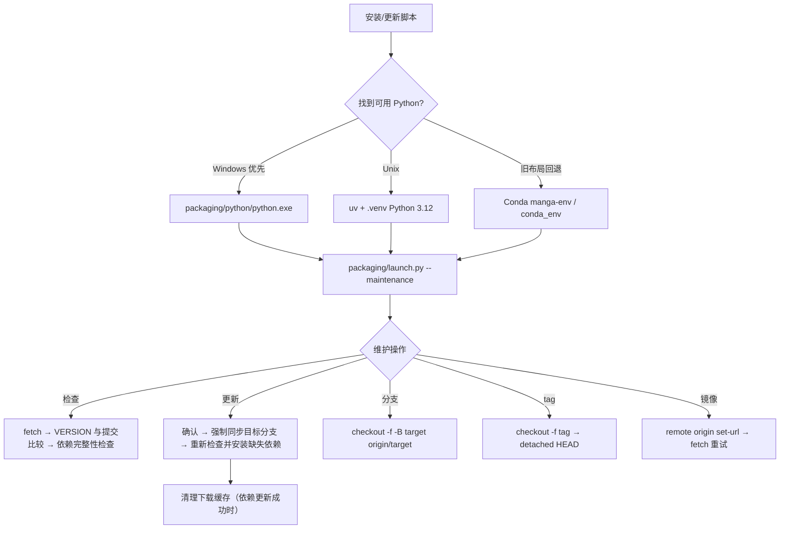

# 更新与版本切换

## 功能边界 {#scope}

本页说明安装脚本交给 `packaging/launch.py --maintenance` 的更新维护流程：检查代码与依赖、切换 Git 分支或 tag、切换镜像源，以及维护菜单语言。它不替代首次安装、Windows 运行时选择、Linux/macOS 引导或卸载/数据清理页面；其中“版本”指代码版本和依赖环境，不是桌面应用内的翻译器设置。

维护菜单是交互式命令行界面。Windows 使用 `Win-Install-or-Update.bat`，Linux/macOS 使用 `Unix-Install-or-Update.sh` 引导；两者最终都进入同一个 Python 维护菜单。

## UI 操作 {#operations}

### 运行维护菜单

- Windows：在项目目录运行 `Win-Install-or-Update.bat`。脚本先切换到自身目录，再优先使用 `packaging\\python\\python.exe`；找不到时才使用旧 Conda 布局。
- Linux/macOS：运行 `Unix-Install-or-Update.sh`。脚本检查平台和 Git，在需要时引导安装 uv、Python 3.12 和 `.venv`，然后启动维护菜单。已有完整项目目录不会重复克隆；非空的无关目录会被拒绝。
- 维护菜单首次显示当前分支/tag 状态、镜像源、本地版本和远程版本。需要网络的检查失败时，远程版本显示为不可用，不应据此判断“已是最新”。

### 更新代码和依赖

1. 选择 `[2] Update (code + dependencies)` / `[2] 更新 (代码+依赖)`。
2. 菜单先执行远程 fetch，并比较 `packaging/VERSION` 与目标分支的版本，同时比较本地和远程提交；然后检查当前环境是否缺少 `pyproject.toml` 所声明的依赖。
3. 若代码和依赖均满足，显示无需更新；否则明确询问是否继续。输入 `y` 或 `yes` 才继续，其他输入取消。
4. 代码更新成功后会重新检查依赖，再按已检测到的 CPU/GPU/AMD/Metal 方案安装缺失项。代码同步失败时跳过依赖更新，避免把半套更新报告为成功。
5. 依赖失败时已成功安装的包会保留；可以重试，重试从剩余包继续。依赖更新成功后会自动清理 uv/pip 下载缓存；代码和依赖都完成才显示更新完成。

更新代码使用强制同步到 `origin/<分支>` 的方式，未提交修改可能被覆盖。执行前请在应用目录外备份需要保留的配置或资源，并先确认工作树状态；不要把维护脚本当作版本备份工具。

### 切换分支

选择 `[3] Switch branch (main/beta)` / `[3] 切换分支 (main/beta)`，在 `main`（稳定版）和 `beta`（测试版）中选择。脚本 fetch 后以 `git checkout -f -B <目标> origin/<目标>` 强制同步，确认提示明确说明本地修改会被覆盖。切换成功后建议再选择一次更新，使依赖与新分支重新匹配。

从 tag 或游离提交切换分支时，当前状态会被标记为 `tag/detached`；更新比较会回落到 `main`，但不要把这当作自动回到 main。

### 按 tag 切换版本

选择 `[4] Switch version (by tag)` / `[4] 切换版本 (按 tag)`。菜单获取 tag 列表，按创建时间倒序最多显示 20 项，也接受直接输入 tag 名。确认后执行强制 `git checkout`，进入 detached HEAD；成功后提示更新该版本依赖。要回到最新分支代码，使用 `[3] Switch branch`，不要在 detached 状态直接执行常规开发提交。

### 镜像、检查和语言

- `[5] Switch mirror` / `[5] 切换镜像源`：在 GitHub 官方源、Gitee 镜像或手动仓库地址之间选择，修改 `origin`；fetch 失败时菜单也会建议切换另一条线路后重试。包下载还会使用 PyPI/PyTorch 镜像回退，它与 Git 远程地址是两层配置。
- `[6] Re-check version` / `[6] 重新检查版本`：只 fetch 并显示本地/远程版本和提交差异，不修改代码或依赖。
- `[7] Language (中文/English)` / `[7] 切换语言 (中文/English)`：只改变维护菜单 `L()` 输出，并写入 `packaging/maintenance_config.json`；不改变桌面 Qt 的 `app.ui_language`。
- `[8] Exit` / `[8] 退出`：离开维护菜单。更新或切换完成后，Windows 再运行 `Win-Start.bat`，Unix/macOS 再运行 `Unix-Start.sh`。

## 维护菜单文案与选项 {#options}

维护菜单的英文不是桌面 Qt locale。代码调用 `L(简体中文, English)`，下表把调用位置/代码字面量作为 key，并保留两种实际值。

| UI 调用 key | English 实际值 | 简体中文实际值 |
| --- | --- | --- |
| `maintenance_menu.title` | Manga Translator UI - Install / Update | 漫画翻译器 - 安装或更新 |
| `maintenance_menu.action.1` | Install (detect GPU, choose CPU/GPU build, install dependencies) | 安装 (检测显卡, 选择 CPU/GPU 版本并安装依赖) |
| `maintenance_menu.action.2` | Update (code + dependencies) | 更新 (代码+依赖) |
| `maintenance_menu.action.3` | Switch branch (main/beta) | 切换分支 (main/beta) |
| `maintenance_menu.action.4` | Switch version (by tag) | 切换版本 (按 tag) |
| `maintenance_menu.action.5` | Switch mirror | 切换镜像源 |
| `maintenance_menu.action.6` | Re-check version | 重新检查版本 |
| `maintenance_menu.action.7` | Language (中文/English) | 切换语言 (中文/English) |
| `maintenance_menu.action.8` | Exit | 退出 |
| `maintenance.prompt.continue` | Continue update? (y/n): | 是否继续更新? (y/n): |
| `maintenance.prompt.retry` | Retry? (y/n, default y): | 是否重试? (y/n, 默认y): |
| `maintenance.prompt.tag` | Select a number or type a tag name (Enter to cancel): | 请选择序号或直接输入 tag 名 (回车取消): |

批处理错误提示中的 `Please try reinstalling first: run Win-Install-or-Update.bat and choose [1] Install.` 是硬编码英文，不属于 `L()` 菜单翻译；不要声称切换维护语言会翻译它。GitHub/Gitee 地址是源码中的公开默认值，用户手动输入的私有地址不应写入文档或截图。

| 存储值/选项 | English | 简体中文 | 实际作用 |
| --- | --- | --- | --- |
| `1` | Install | 安装 | 同步代码、检测显卡并安装依赖 |
| `2` | Update | 更新 | 检查并更新代码与依赖 |
| `3` | main / beta | main / beta | 切换稳定版或测试版分支 |
| `4` | Switch version by tag | 按 tag 切换版本 | 检出指定 tag，进入 detached HEAD |
| `5` | Switch mirror | 切换镜像源 | 修改 Git `origin`，并影响后续 Git 下载 |
| `6` | Re-check version | 重新检查版本 | 只读远程版本/提交检查 |
| `7` | 中文 / English | 中文 / English | 维护菜单输出语言 |
| `8` | Exit | 退出 | 离开维护菜单 |

## 运行机理 {#runtime}

更新判断不是只看版本字符串：代码更新条件包含 fetch 失败、远程 `packaging/VERSION` 不同或提交不同；依赖更新条件来自当前 PyTorch 方案和包完整性检查。代码更新完成后才重新计算依赖，避免用旧代码的依赖清单作结论。

包安装优先使用可发现的 uv 批量安装；uv 不可用时回退为 pip 逐包安装。普通包走 PyPI 镜像回退，PyTorch 包走对应 CPU/CUDA/ROCm 专用索引或其回退源。安装缓存清理不删除项目配置、模型或字体。

## 依赖与冲突 {#dependencies}

- `pyproject.toml` 要求 Python `>=3.12,<3.13`；Python 3.13 不可作为替代环境。
- `cpu`、`gpu`、`amd`、`metal` 是 uv 互斥 dependency groups。切换硬件后不要在同一个环境叠加多个后端；应按维护菜单检测结果重装匹配方案。
- Windows AMD 由 `packaging/launch.py` 单独按 Radeon SDK → PyTorch 顺序处理，不能把 Linux `amd` 组的 ROCm 条件直接套用到 Windows。显卡品牌被检测到不等于驱动和 ROCm 已可用。
- 旧 Conda 只在便携 Python/Unix `.venv` 不可用时回退。混用 `packaging/python`、`.venv`、`conda_env` 或外部环境可能造成 DLL、Torch、ONNX Runtime 冲突。
- 代码更新可能覆盖本地源码修改；tag 会进入 detached HEAD。配置、提示词、模型、字体和工作目录资源应在切换前单独备份并审查。
- 更新需要 Git 和包索引/镜像网络；翻译 API 的运行时网络、密钥和配额是另一条链路。更新成功不代表 API 可用，也不保证模型已下载或显存足够。

## 关联文件与格式 {#files}

| 文件/目录 | 实际作用 | 格式与手改风险 |
| --- | --- | --- |
| `Win-Install-or-Update.bat`、`Win-Start.bat` | Windows 定位解释器并进入维护/启动 | CMD 批处理；不要删去自身目录切换和运行时优先级 |
| `Unix-Install-or-Update.sh`、`Unix-Start.sh` | Unix 引导 Git、uv、Python 3.12、`.venv` 并进入维护/启动 | Bash；脚本拒绝覆盖无关非空目录，`.venv` 版本不符时会重建 |
| `packaging/launch.py` | 菜单、Git 操作、版本检查、依赖检测/安装和缓存清理 | Python；菜单执行时不要编辑工作树或切换远程 |
| `packaging/maintenance_config.json` | 持久化维护菜单语言 | JSON；仅保存菜单偏好，不是桌面设置 |
| `packaging/VERSION` | 本地发行版本文本 | 纯文本；需与远程分支版本及提交一起判断 |
| `pyproject.toml`、`uv.lock` | 依赖组、索引和锁定解析 | TOML/锁文件；不要混装互斥组，版本变更应走项目维护流程 |
| `.env`、`config/config.json` | API 凭据与应用配置 | 不要复制、上传或截图真实值、令牌和私有路径 |
| `config/`、`dict/`、`models/`、`fonts/`、`manga_translator_work/` | 用户资源、提示词、模型、字体和工作产物 | 更新/切换不应被当作资源备份；迁移前逐项脱敏和备份 |

## 截图与流程图边界 {#visuals}

本页 Mermaid 只表达静态调用链、检查分支和 Git/依赖更新边界。本次未运行真实发行包维护菜单，也未生成更新日志、GPU 选择或版本切换截图；因此没有把静态源码结论写成运行成功。未来截图必须使用脱敏测试配置和虚构路径，裁去用户名、私有绝对路径、密钥、token、模型下载日志、用户图片和提示词，并提供中英 alt 与图注。

## 源码依据 {#source-evidence}

| 层级 | 文件 | 本页核对内容 |
| --- | --- | --- |
| Windows 入口 | `Win-Install-or-Update.bat`、`Win-Start.bat` | 工作目录、便携 Python 优先、Conda 回退、PATH、退出码 |
| Unix 入口 | `Unix-Install-or-Update.sh`、`Unix-Start.sh` | Git/uv/Python 3.12/.venv 引导、项目目录保护、维护启动 |
| 维护菜单 | `packaging/launch.py` | `--maintenance`、菜单选项、语言持久化、分支/tag/镜像操作 |
| 更新判断 | `packaging/launch.py` | `check_all_updates`、版本/提交比较、依赖完整性和更新顺序 |
| 依赖定义 | `pyproject.toml`、`uv.lock` | Python 约束、互斥组、PyTorch 索引和固定版本 |
| 发行版本与路径 | `packaging/VERSION`、`manga_translator/runtime_paths.py` | 版本文件以及 checkout/发行目录资源边界 |

## 验证记录 {#verification}

| 验证内容 | 状态 | 说明 |
| --- | --- | --- |
| 页面责任边界与正文 | 完成 | 已覆盖更新、分支、tag、镜像、依赖、文件、安全和静态机理 |
| UI 调用 key → en_US → zh_CN | 完成 | 维护菜单采用 `packaging/launch.py` 的 `L()` 实际字面量；不是 Qt locale |
| Windows/Unix 脚本与启动器静态核对 | 完成 | 已核对解释器回退、维护入口、更新和版本切换路径 |
| 运行维护菜单/真实发行包 | 未运行 | 本环境未执行有头/交互安装；未将其冒充运行成功 |
| 路由、来源和脱敏静态检查 | 待执行 | 由本次页面任务完成后运行仓库 Wiki 检查脚本 |
| VitePress 构建 | 待执行 | 由本次页面任务完成后运行 `npm run docs:build --prefix doc/wiki` |

## 敏感信息审查 {#privacy}

正文没有 API Key、token、管理员密码、用户名、私有绝对路径、用户图片、OCR/译文或私有提示词。`.env`、用户 `config.json`、缓存和工作目录仅作为边界说明；分享更新日志或截图前仍需逐项脱敏。
