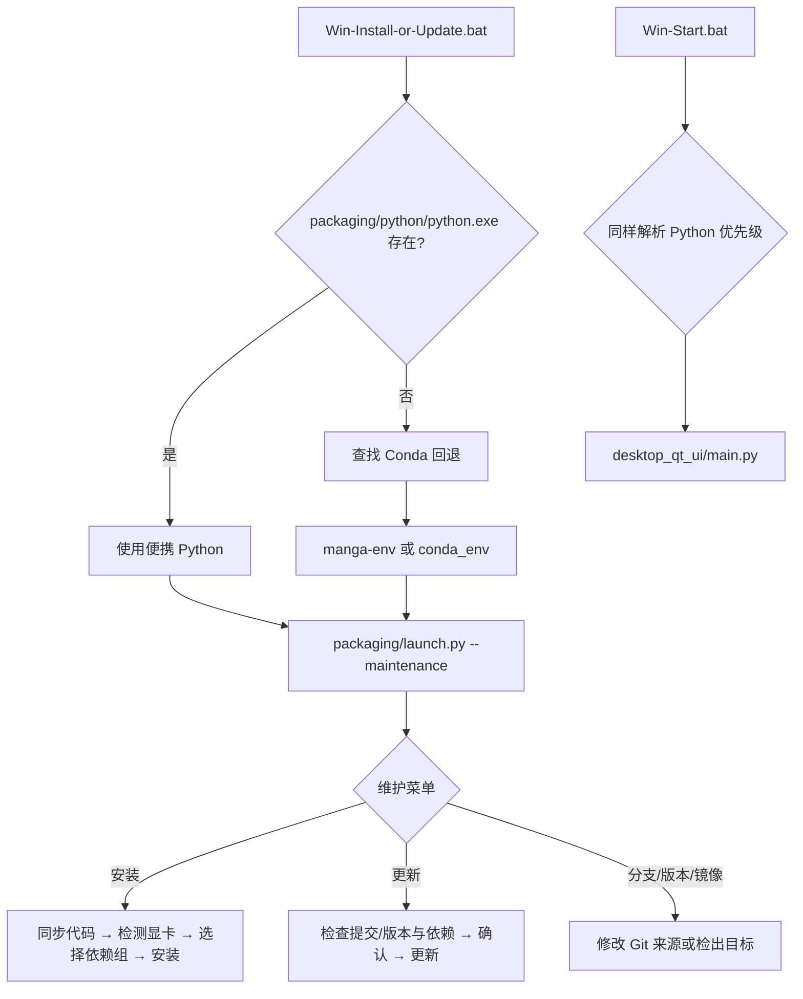

# Windows 便携版

## 功能边界 {#scope}

本页说明仓库根目录下 `Win-Install-or-Update.bat`、`Win-Start.bat` 的 Windows 启动链、环境选择和维护菜单。它适用于源码/发行目录中已有这些脚本的 Windows 用户；它不替代从源码安装、Docker、Linux/macOS 或版本卸载页面，也不描述桌面翻译参数。

“便携”指脚本优先使用应用目录内的 `packaging/python/python.exe`，而不是要求用户先激活系统环境。若没有该解释器，当前脚本仍兼容旧版 Conda 布局；这不是两套可以同时混装的依赖方案。

## UI 操作 {#operations}

### 首次安装或维护

1. 将发行包解压到一个可写目录。双击 `Win-Install-or-Update.bat`；脚本先切换到自身目录，因此从资源管理器、管理员命令提示符或其他当前目录启动都使用正确的项目根目录。
2. 维护菜单显示当前分支/标签状态、镜像源和版本检查结果。按屏幕提示输入编号；菜单不是 Qt 窗口，必须在可交互的命令提示符中运行。
3. 选择“安装”后，脚本同步代码，检测显卡，再让启动器选择 CPU、NVIDIA GPU 或 Windows AMD 路径并安装依赖。依赖失败时，已成功安装的包会保留，可选择重试或取消。
4. 安装完成后按回车回到维护菜单，选择“退出”，再双击 `Win-Start.bat` 启动桌面应用。

### 维护菜单的实际文案

`packaging/launch.py` 的 `L(中文, English)` 是启动器自己的双语文案，不是桌面 Qt locale key。下表保留调用位置/代码字面量作为 key，避免把启动器提示误写成 Qt i18n。

| UI 调用 key | English 实际值 | 简体中文实际值 |
| --- | --- | --- |
| `maintenance_menu.title` | Manga Translator UI - Install / Update | 漫画翻译器 - 安装或更新 |
| `maintenance_menu.action.1` | Install (detect GPU, choose CPU/GPU build, install dependencies) | 安装 (检测显卡, 选择 CPU/GPU 版本并安装依赖) |
| `maintenance_menu.action.2` | Update (code + dependencies) | 更新 (代码+依赖) |
| `maintenance_menu.action.3` | Switch branch (main/beta) | 切换分支 (main/beta) |
| `maintenance_menu.action.4` | Switch version (by tag) | 切换版本 (按 tag) |
| `maintenance_menu.action.5` | Switch mirror | 切换镜像源 |
| `maintenance_menu.action.6` | Re-check version | 重新检查版本 |
| `maintenance_menu.action.7` | Language (中文/English) | 切换语言 (中文/English) |
| `maintenance_menu.action.8` | Exit | 退出 |
| `Win-Start.bat.error.reinstall` | Please try reinstalling first: run Win-Install-or-Update.bat and choose [1] Install. | 请先尝试重新安装：运行 Win-Install-or-Update.bat 并选择 [1] Install。 |
| `Win-Start.bat.prompt.open-maintenance` | Open Win-Install-or-Update.bat now? (y/n): | Open Win-Install-or-Update.bat now? (y/n): |

最后一行是批处理硬编码英文，没有中文回退；不要自行声称它有完整双语切换。维护菜单的语言切换只影响 `packaging/launch.py` 的 `L()` 输出，不改变桌面 Qt 的 `app.ui_language`。

### 更新、分支和版本

- “更新”先检查远程代码版本/提交和当前 PyTorch 依赖；没有更新时明确提示无需更新，有更新时要求输入 `y/yes` 确认。
- “切换分支”在 `main` 与 `beta` 间切换；“切换版本”按 tag 切换。切换后不要把本地未提交修改当作可恢复备份，先自行备份并确认工作树状态。
- “切换镜像源”改变后续 Git/包下载的来源；网络失败不会被解释为安装成功。
- “重新检查版本”只做检查；“切换语言”改变维护菜单输出语言；“退出”离开菜单。

### 启动与错误反馈

`Win-Start.bat` 先输出 `Starting...`，运行 `desktop_qt_ui\\main.py`。应用正常关闭时显示 `Application closed.`；非零退出时显示错误码、建议重新安装和公开 Issue 地址，并询问是否打开维护脚本。若既找不到便携 Python，也找不到有效 Conda 环境，脚本报告环境缺失并退出，不会静默使用另一个 Python。

## 选项中英对照 {#options}

| 存储值/选项 | English | 简体中文 | 适用条件 |
| --- | --- | --- | --- |
| `1` | Install | 安装 | 维护菜单；检测显卡并安装代码依赖 |
| `2` | Update | 更新 | 维护菜单；检查并更新代码和依赖 |
| `3` | main / beta | main / beta | 维护菜单；分支切换 |
| `4` | Switch version by tag | 按 tag 切换版本 | 维护菜单；版本切换 |
| `5` | Switch mirror | 切换镜像源 | 维护菜单；下载源切换 |
| `6` | Re-check version | 重新检查版本 | 维护菜单；只读检查 |
| `7` | 中文 / English | 中文 / English | 维护菜单输出语言 |
| `8` | Exit | 退出 | 维护菜单 |
| `auto` | Automatic selection | 自动选择 | 启动器依赖方案默认值；按平台/显卡选择 |
| `cpu` | CPU | CPU | 无可用 GPU 或明确选择 CPU |
| `gpu` | NVIDIA CUDA GPU | NVIDIA CUDA GPU | NVIDIA/CUDA 依赖组 |
| `amd` | AMD ROCm | AMD ROCm | Windows AMD 实验路径；需满足启动器检测的驱动/显卡条件 |
| `metal` | Apple Metal | Apple Metal | 非 Windows；列在统一 `pyproject.toml` 依赖定义中，本页不提供安装步骤 |

## 运行机理 {#runtime}

批处理只负责定位运行时、设置 `PYTHONUTF8=1`、补充 PATH 并调用 Python。便携 Python 的优先级高于 Conda：脚本寻找 `packaging\\python\\python.exe`；缺失时才查找目录旁或盘符根目录的 `Miniconda3`、`CONDA_EXE` 能找到的 Conda 根、命名环境 `manga-env`，最后兼容应用目录下的 `conda_env`。Conda 回退通过 PATH 前置模拟激活，但不会修改系统环境。

`launch.py` 的安装流程从 `pyproject.toml` 读取依赖和 PyTorch 源；更新同时比较 `packaging/VERSION`、远程提交和依赖完整性。优先使用可找到的 uv 批量安装，找不到 uv 时按包使用 pip 回退，并在源失败时尝试其他配置的镜像。AMD Windows 路径会先检查显卡/驱动兼容性，再按脚本逻辑安装 Radeon SDK 与 PyTorch；不兼容时可能退回 CPU 或要求用户取消，不能把“检测到 AMD”当成成功启用 ROCm。

## 依赖与冲突 {#dependencies}

- **Python 版本**：当前启动器只接受 Python 3.12；`pyproject.toml` 约束为 `>=3.12,<3.13`。系统 Python 3.13 或其他版本不能作为便携运行时的替代品。
- **依赖组互斥**：`cpu`、`gpu`、`amd`、`metal` 在 uv 配置中互斥。不要把 CPU、NVIDIA CUDA、AMD ROCm 组叠加到同一个环境；切换硬件后应使用维护菜单检查并按提示重装匹配依赖。
- **Windows AMD**：Windows AMD 不是 Linux `amd` 组的简单复制；脚本单独处理 ROCm/PyTorch 顺序，并提示驱动与支持列表限制。兼容性不能仅凭显卡品牌判断。
- **旧 Conda**：只有便携解释器不存在时才回退。不要同时把 `packaging\\python`、`conda_env` 和外部环境的包混作一个环境；错误的 PATH 可能导致 DLL、Torch 或 ONNX Runtime 冲突。
- **GPU/CPU 资源**：GPU 依赖不等于模型已下载，也不保证显存足够；首次启动仍可能下载或初始化模型。CPU 方案可运行但通常更慢。安装失败时不要删除已成功包后反复切换方案。
- **目录路径**：脚本对非 ASCII 安装路径有特殊 Miniconda 根目录查找回退（盘符根目录）；为降低 DLL、Git 和模型路径问题，优先使用可写且不含特殊字符的短路径。
- **网络**：安装/更新需要 Git、包索引或镜像网络；API 网络是应用运行时的另一条链路，不能用“安装成功”证明翻译 API 可用。

## 关联文件与格式 {#files}

| 文件/目录 | 实际作用 | 手改、格式和兼容风险 |
| --- | --- | --- |
| `Win-Install-or-Update.bat` | 进入维护模式 | Windows CMD 批处理；不要改掉 `%~dp0` 工作目录切换和 Python 优先级 |
| `Win-Start.bat` | 启动 Qt 桌面 | Windows CMD 批处理；非零退出码用于错误提示 |
| `packaging/launch.py` | 维护菜单、版本检查、显卡检测、依赖安装和 Qt 启动分发 | Python 源码；菜单操作会读写 Git 状态/远程和环境包，不要在运行中手改 |
| `packaging/python/` | 发行包首选便携 Python 目录 | 目录需包含 `python.exe`；当前仓库未提交实际解释器，源码 checkout 不能假定它存在 |
| `Miniconda3/`, `conda_env/` | 旧版 Conda 回退布局 | `manga-env` 优先于旧路径；仅在便携 Python 缺失时使用 |
| `pyproject.toml` / `uv.lock` | 依赖版本、互斥组、索引与锁定解析 | 不要把不同组的锁定结果混装；版本变化应通过项目维护流程更新 |
| `packaging/VERSION` | 当前发行版本比较 | 文本版本号；维护脚本还比较 Git 提交，不能只看这一行 |
| `config/config.json`、`.env` | 应用设置/API 凭据 | 不应随发行包复制真实用户值；密钥和绝对路径不进入文档或截图 |
| `config/`、`dict/`、`models/`、`fonts/` | 运行资源与用户数据 | 可能含提示词、模型、字体和个人路径；便携目录备份/迁移时逐项审查 |

安装器没有把所有资源下载行为封装成一个独立文件格式；代码、依赖和资源是分开的。不要把 `uv.lock` 当作用户配置，也不要把 `.env` 或 `config/config.json` 打包上传求助。

## 截图与流程图边界 {#visuals}

本页 Mermaid 只表达脚本的静态分支和维护/启动调用链。根据当前任务没有启动 Windows 发行包，也没有生成“维护菜单”“显卡选择”或安装日志截图；因此不伪造截图，也不把命令行文案当作运行验证。未来截图只能使用脱敏发行包和虚构路径，裁去用户名、绝对私有路径、令牌、密钥、模型下载日志及用户图片，并同时提供中英文 alt/图注。

## 源码依据 {#source-evidence}

| 层级 | 文件 | 本页核对内容 |
| --- | --- | --- |
| 批处理入口 | `Win-Install-or-Update.bat`、`Win-Start.bat` | 工作目录、便携 Python 优先、Conda 回退、PATH、错误码和调用目标 |
| 维护/启动器 | `packaging/launch.py` | `--maintenance` 菜单、安装/更新、分支/tag/镜像、版本、显卡和依赖流程 |
| 依赖定义 | `pyproject.toml`、`uv.lock` | Python 版本、CPU/GPU/AMD/Metal 组互斥、PyTorch 索引和固定版本 |
| 发行版本 | `packaging/VERSION` | 版本检查使用的本地版本文件 |
| 运行时路径 | `manga_translator/runtime_paths.py` | 开发 checkout 与冻结/发行目录的资源配置边界 |
| 调查证据 | `doc/wiki/research/default-sources.md`、`phase0-related-files-formats-debug-safety.md` | 默认来源、文件格式、敏感信息和未决运行验证边界 |

## 验证记录 {#verification}

| 验证内容 | 状态 | 说明 |
| --- | --- | --- |
| 三份页面合同 | 完成 | 已覆盖边界、操作、三列文案、机理、依赖冲突、文件、源码和视觉边界 |
| 批处理与启动器静态核对 | 完成 | 已核对根目录两个 `.bat` 与 `packaging/launch.py` 菜单/入口 |
| `pyproject.toml` 与锁文件 | 完成 | 已核对 Python 3.12 约束、互斥依赖组和 Windows AMD 注释 |
| 有头 Windows 安装/启动 | 未运行 | 当前环境未执行发行包维护菜单；没有把静态结论写成运行成功 |
| 路由/来源静态检查 | 待执行 | 由仓库 Wiki 校验脚本统一执行 |
| VitePress 构建 | 待执行 | 运行 `npm run docs:build --prefix doc/wiki` |

## 敏感信息审查 {#privacy}

本文没有记录 API Key、Token、管理员密码、用户名、私有绝对路径、用户图片、OCR/译文或私有提示词。`.env`、用户 `config.json`、模型缓存和 `manga_translator_work/` 只以文件边界说明；共享日志、安装截图和错误窗口仍需逐项脱敏。
