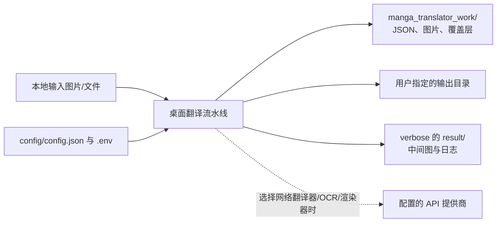
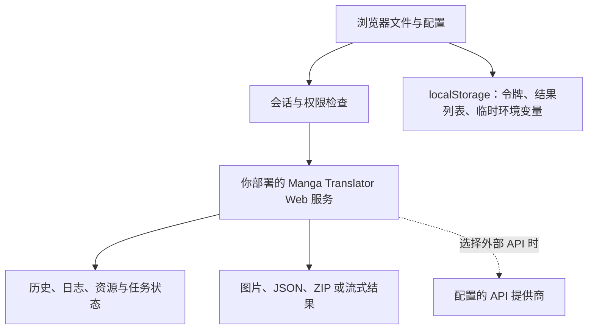

# 数据与隐私

本页帮助你判断漫画图片、识别文本、翻译结果、配置和日志的去向。它说明当前源码能确认的保存与传输边界，不是法律隐私声明，也不替代 API 管理、Web 用户端或调试产物页面。

## 功能边界

- **桌面本地处理**：输入图片和处理中间结果由本机程序读取；配置目录、工作目录和 `result/` 诊断目录也在本机。
- **外部翻译或 AI 服务**：选择需要网络 API 的翻译器、OCR、上色或渲染器后，请求内容会发送到该提供商或你配置的兼容地址。服务商的保留、训练和跨境策略不由本项目源码决定。
- **Web 模式**：浏览器把文件和配置提交给你启动的服务器；服务器还会维护账号、会话、历史、资源和日志。服务器地址、反向代理、Docker 卷和备份策略由部署者负责。
- **本页不负责**：具体 API 槽轮换见[凭据、地址与模型](../desktop/api-management/credentials-addresses-models.md)，Web 操作见[上传、配置与翻译](../web/upload-config-and-translate.md)，调试文件逐项说明见[调试产物索引](../reference/debug-artifact-index.md)。

## UI 操作

### 桌面端

1. 在翻译页选择输入文件或目录，并把输出目录设为你有权限管理的本地位置。程序会在输入目录附近创建 `manga_translator_work/`，具体输出仍由工作流和输出设置决定。
2. 在“设置”中使用配置导入/导出时，只选择脱敏的 JSON；不要把含密钥的 `.env` 或含原图、译文的工作目录上传到公共位置。
3. 在“API 管理”中，API 密钥字段默认以密码模式显示。只有你主动点击显示图标才会在窗口中显示；这不是对系统剪贴板、屏幕录制或外部服务的保护。
4. “API Keys (.env)”和“Log output...”分别对应凭据编辑与日志区域。测试 API、获取模型和开始翻译会产生网络请求或服务端响应，错误信息也可能包含地址、模型名和请求阶段。

### Web 端

- 登录后浏览器把会话令牌保存在 `localStorage.session_token`，后续业务请求通过 `X-Session-Token` 发送；退出时前端清除本地令牌。
- 配置导入/导出在浏览器本地读写 JSON 文件。当前输入的用户环境变量可能暂存在 `localStorage.user_env_vars`；不要在共享浏览器或开发者工具中留下它们。
- 结果列表保存在浏览器 `localStorage`，这与服务器历史记录是两套数据。服务器端的历史、日志、字体和提示词仍受账号权限与部署保留策略影响。
- API Key 标签默认隐藏；服务器的 `/env` 与 `/env/effective` 不应返回服务器密钥明文。权限控制是服务端最终边界，前端隐藏控件不能替代它。

## 选项中英对照

本页没有独立的隐私开关；下表列出正文所引用的实际界面文案。英文值和中文值来自当前桌面 locale，Web 主页面还存在 HTML/脚本硬编码文字，不能只依据桌面 locale 推断。

| UI 调用 key | English 实际值 | 简体中文实际值 |
| --- | --- | --- |
| `API Management` | API Management | API 管理 |
| `Manage API keys and environment variables for each translator` | Manage API keys and environment variables for each translator | 管理每个翻译器的 API 密钥和环境变量 |
| `API Keys (.env)` | API Keys (.env) | API密钥 (.env) |
| `Log output...` | Log output... | 日志输出... |
| `Export Config` | Export Config | 导出配置 |
| `Import Config` | Import Config | 导入配置 |
| `Show Secret` | Show Secret | 显示密钥 |
| `Hide Secret` | Hide Secret | 隐藏密钥 |
| `Clear List` | Clear List | 清空列表 |
| `Start Translation` | Start Translation | 开始翻译 |
| `Normal Translation` | Normal Translation | 正常翻译流程 |
| `Export Translation` | Export Translation | 导出翻译 |
| `Export Original Text` | Export Original Text | 导出原文 |

这些 key 只用于核对界面文字；`.env`、`X-Session-Token`、`localStorage.session_token` 等是代码标识，不是可以在界面中照抄的标签或秘密值。

## 运行机理

### 桌面数据流

桌面配置服务先立即更新内存和 `os.environ`，再以 250 ms 防抖合并磁盘写入；配置与 `.env` 都采用临时文件写完后替换目标文件的原子写入。运行目录在开发环境是仓库根目录下的 `config/`，冻结包则是可执行文件旁的 `config/`。

逐图 JSON 位于 `<image-dir>/manga_translator_work/json/<stem>_translations.json`。它可能包含绝对图片路径、原文、译文、区域坐标、样式、`mask_raw`（base64 PNG）、`mask_is_refined`、覆盖层和最后导出目录；因此它不是适合公开分享的最小样例。`verbose` 产生的 `result/` 中间 PNG、JSON、日志、PSD 或 JSX 同样可能含原图、文字、坐标、译文和本地路径。

### Web 数据流

服务器的认证依赖会校验 `X-Session-Token`、刷新活动时间并拒绝无效或过期会话。翻译请求还会检查功能权限、并发和每日配额。服务端的配置展示会递归把键名包含 `api_key`、`api_secret`、`password`、`token` 或 `key` 的值替换为 `***`；这只能约束该输出路径，不能把原始配置、日志、浏览器存储或 API 提供商日志视为自动脱敏。

## 依赖与冲突

- 只使用本地模型并不等于没有敏感数据落盘：工作目录、JSON、调试图和日志仍可能保存原图及文字。
- 选择云端或兼容 API 会引入网络、鉴权、限流和第三方保留策略；自托管兼容地址也应按该服务器的访问控制和日志策略审查。
- `verbose` 适合排查阶段问题，但会增加包含图像、文本、坐标和路径的诊断产物。分享前应关闭 verbose 或逐文件清理。
- `mask_raw` 是 base64 编码的 PNG，不是匿名化；`mask_is_refined` 只描述蒙版是否已细化，不提供隐私保护。
- Web 的 `0.0.0.0:8000` 表示监听所有 IPv4 接口，不是安全的访问地址。防火墙、反向代理、Docker 端口映射和备份保留期需要单独配置与验证。
- 浏览器历史列表和服务器历史不是同一存储；删除一个不会自动证明另一个已删除。下载票据也可能在短时间内允许取回文件。

## 关联文件与格式

| 文件或数据 | 保存/传输内容 | 脱敏与清理注意事项 |
| --- | --- | --- |
| `config/config.json` | 桌面/Web 配置和用户选项，用户配置优先于示例配置 | 不提交个人路径、私有选项或由配置间接引用的秘密 |
| `.env` | `KEY=VALUE` 文本形式的 API、认证和模型环境变量 | 不展示、不复制真实值；密钥、认证密钥和令牌一律使用虚构占位符 |
| `config/custom_api_params.json` | 各 provider 的额外请求参数 | 自定义 header、Bearer 值和私有地址按秘密处理 |
| `manga_translator_work/json/<stem>_translations.json` | 区域、原文/译文、尺寸、蒙版、样式、覆盖层和路径元数据 | 不直接公开；`mask_raw` 和绝对路径都属于用户内容 |
| `manga_translator_work/` 下的图片、TXT、PSD、JSX、`result/` | 中间图、导出文本、可编辑工程、脚本和诊断日志 | 逐文件检查原图、文字、译文、参考图、令牌和本地路径 |
| Web 浏览器 `localStorage` | `session_token`、结果列表、locale，以及可能的 `user_env_vars` | 共享设备退出登录并清理站点数据；不要复制开发者工具内容 |
| Web 服务器数据目录 | 账号、会话、历史、日志、字体、提示词、任务和下载票据 | 由部署者制定权限、备份、保留和清理策略；不要把哈希或令牌当示例 |

`config/translation_template.json` 虽然扩展名是 `.json`，模板解析器按文本读取可选 `output_format` 行；它影响 `originals/` 与 `translations/` 导出扩展名，不是逐图翻译 JSON。系统提示词与用户提示词也应分开审查，不能把私有提示词贴进文档。

## 源码依据

| 层级 | 文件 | 本页核对内容 |
| --- | --- | --- |
| 运行路径 | `manga_translator/runtime_paths.py:11-30` | 开发环境与冻结包的应用/配置目录 |
| 环境变量 | `manga_translator/utils/dotenv_utils.py:17-80` | `MANGA_TRANSLATOR_ENV_PATH`、dotenv 解析、加载与 UTF-8 写入 |
| 桌面持久化 | `desktop_qt_ui/services/config_service.py:144, 477-559, 752-821` | 250 ms 防抖、内存更新、`.env`/JSON 原子写入 |
| 密钥 UI | `desktop_qt_ui/ui/main_page/env_management.py:190-223` | 秘密 key 判断、密码显示模式和显示/隐藏提示 |
| 逐图数据 | `manga_translator/manga_translator.py:713-872` | 区域 JSON、样式、跳过标志、超分/上色元数据与 base64 蒙版 |
| 诊断路径 | `manga_translator/manga_translator.py:3315-3347` | verbose、Web 和结果目录分支 |
| Web 前端 | `manga_translator/server/static/script.js`、`static/js/history-gallery.js` | localStorage、上传、结果列表、历史和下载交互 |
| Web 鉴权 | `manga_translator/server/core/middleware.py:94-164` | `X-Session-Token` 校验、活动刷新和 401 边界 |
| 配置脱敏 | `manga_translator/server/core/translation_integration.py:323-352` | 服务端配置输出的递归敏感键替换 |
| Phase 0 资料 | `doc/wiki/research/phase0-related-files-formats-debug-safety.md`、`phase0-web-user-http.md` | 文件格式、调试产物、Web 存储与敏感信息分类 |

## 验证记录

| 验证内容 | 状态 | 说明 |
| --- | --- | --- |
| 页面合同与 frontmatter | 完成 | 已阅读 `BLUEPRINT.md`、`PAGE_GUIDELINES.md`、`TODO.md`；页面含边界、操作、三列 i18n、机理、限制、文件、源码和验证章节 |
| UI/i18n 三列证据 | 完成（静态） | 桌面调用 key 与 `en_US.json`/`zh_CN.json` 实际值已核对；Web 的硬编码/回退限制按研究资料标注 |
| 源码依据 | 完成（静态） | 配置、路径、逐图 JSON、诊断产物、Web localStorage、会话和服务端脱敏均有文件与行号依据 |
| 敏感信息审查 | 完成 | 未写入真实密钥、令牌、账号、绝对私有路径、用户图片或私有提示词 |
| 脱敏运行验证 | 待确认 | 未启动 Web、未执行真实翻译；实际保留期、网络服务商日志和条件产物需用脱敏样例分别验证 |
| 中英镜像与源码检查 | 完成（目标页静态） | 目标页标题层级、frontmatter、源码依据章节和中英路径已核对；全站脚本因本 worktree 未包含未跟踪的 scripts 目录，另以等价目标页检查通过 |
| VitePress 构建 | 未通过（其他页面阻塞） | 构建被现有 `en/introduction/product-forms.md` 的占位 frontmatter YAML 解析错误阻塞，未指向本页 |
