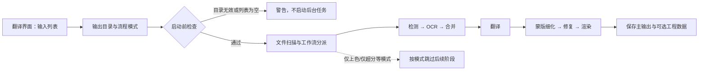

# 第一次翻译

当你已经完成安装并希望先处理一张或一组漫画图片时，从本页开始。页面说明桌面“翻译界面”中最短的可用路径：加入输入、确认输出目录、选择流程模式并启动任务；检测器、OCR、翻译器、排版和 API 凭据的详细设置分别见[设置](/zh/desktop/settings/index.md)、[翻译器](/zh/desktop/translator/selection-and-languages.md)和[API 管理](/zh/desktop/api-management/feature-selectors.md)。

## 功能边界 {#feature-boundary}

本页负责第一次运行所需的桌面操作、九种流程的选择差异、输入/输出发现规则、任务状态和安全边界。不在本页展开每个检测器、OCR 模型、翻译提供商、提示词字段或编辑器属性；这些功能在对应模块页维护。

第一次运行建议使用一张可公开、无敏感内容的图片，并先使用“正常翻译流程”。“正常翻译流程”不是跳过配置的演示模式：它仍会按当前配置检查所需 API 凭据，并使用已安装或可用的模型。

## UI 操作 {#ui-operations}

### 从输入到开始

1. 打开侧栏的“翻译界面”（`Translation Interface`）。页面初始选中该页面，页面标题默认显示“正常翻译流程”（`Normal Translation`）。
2. 在输入列表上方点击“添加文件”（`Add Files`）选择图片，或点击“添加文件夹”（`Add Folder`）递归加入文件夹内的受支持图片。也可以把文件或文件夹拖到列表中。列表会以缩略图树显示文件；每个文件可以使用行内删除操作移除。
3. 确认列表不是空的。点击“清空列表”（`Clear List`）会移除当前输入列表，但不会删除磁盘上的原图或此前生成的结果。
4. 在“翻译任务”（`Translation Task`）中检查“输出目录：”（`Output Directory:`）。可以在输入框中填写或拖入目录，使用“浏览...”（`Browse...`）选择目录，使用“打开”（`Open`）打开当前目录。
5. 第一次运行保持“翻译流程模式：”（`Translation Workflow Mode:`）为“正常翻译流程”，然后点击“开始翻译”（`Start Translation`）。选择其他流程时，标题、说明文字和开始按钮会随流程改变。

开始前，程序会先检查输出目录是否存在、输入列表是否为空，并按当前配置检查 API 要求；检查不通过时任务不会进入后台翻译。文件夹扫描完成后，如果没有找到有效图片，程序会显示“文件列表为空”（`File List Empty`）警告并停止启动。

### 任务中与任务后

- 启动后，开始按钮先显示 `Starting...`（该调用 key 在两个 locale 文件中均缺失，因此当前代码会回退显示 key 本身）。输入按钮、清空按钮、文件列表和 API 页面在翻译期间禁用；随后按钮变为“停止翻译”（`Stop Translation`）。
- 进度区以当前数、总数和消息更新状态。点击“停止翻译”后按钮变为“停止中...” (`Stopping...`)，停止请求完成后任务状态回到已停止，进度重置。停止只取消当前任务，不删除已经保存的文件。
- 成功、部分失败和因输出文件已存在而跳过的结果分别记录在任务状态和日志中。若关闭覆盖选项，已有同名输出可能被跳过；此时可删除旧输出，或在设置中开启覆盖后重试。
- “打开”只打开输出目录，不等于打开编辑器。结果是否在编辑器中继续修改取决于编辑器页面和生成的工程 JSON，见[编辑器导入、导出与回写](../desktop/editor/import-export-and-writeback.md)。

## 选项中英对照 {#option-matrix}

下表记录流程下拉框的存储字段和实际界面文字。流程选择在桌面运行时会先清除其他流程字段，再只写入所选项；“正常翻译流程”表示这些特殊字段均为 `false`，并不代表其他设置恢复默认。

| 存储值 | English | 简体中文 | 选择后的行为 |
| --- | --- | --- | --- |
| `normal`（特殊字段均为 `false`） | Normal Translation | 正常翻译流程 | 进入上色（如启用）、超分（如启用）、检测、OCR、文本行合并、翻译、蒙版细化、修复和渲染的常规路径 |
| `cli.generate_and_export=true` | Export Translation | 导出翻译 | 生成工程 JSON 和译文文本，不保存主结果图 |
| `cli.template=true` | Export Original Text | 导出原文 | 生成工程 JSON 和原文模板，供手动翻译后再导入；实际分支还要求 `cli.save_text=true` |
| `cli.translate_json_only=true` | Translate JSON Only | 仅翻译（JSON） | 读取已有工程 JSON，只翻译区域并回写 JSON，不执行检测、OCR、修复或渲染 |
| `cli.load_text=true` | Import Translation and Render | 导入翻译并渲染 | 读取已有 JSON 与文本文件，导入译文、修复并渲染输出图 |
| `cli.colorize_only=true` | Colorize Only | 仅上色 | 只运行上色阶段；上色器为 `none` 时不会强制产生颜色变化 |
| `cli.upscale_only=true` | Upscale Only | 仅超分 | 运行上色（若配置启用）和超分；倍率为空时可能只保留原图或前置上色结果 |
| `cli.inpaint_only=true` | Inpaint Only | 仅修复 | 检测文字区域并修复原图，不执行 OCR、翻译或渲染译文 |
| `cli.replace_translation=true` | Replace Translation | 替换翻译 | 从 `translated_images/` 的配对译图提取/匹配文字，再修复生肉图并渲染，或按模板对齐直接粘贴 |

“导出翻译”“导出原文”“仅翻译（JSON）”和“导入翻译并渲染”需要理解工程副文件；首次只想得到译后图片时不要误选导出模式。各模式的完整阶段矩阵见[工作流矩阵](/zh/reference/workflow-matrix.md)。

### UI 调用与 i18n 证据

下表是本页操作中使用的界面文案证据：第一列为代码传给 `_t()` 的调用 key，后两列是 `en_US.json` 和 `zh_CN.json` 的实际值。它不把配置键、环境变量或后端字段冒充界面名称。

| UI 调用 key | `en_US` 实际值 | `zh_CN` 实际值 |
| --- | --- | --- |
| `Translation Interface` | Translation Interface | 翻译界面 |
| `Translation Task` | Translation Task | 翻译任务 |
| `Add Files` | Add Files | 添加文件 |
| `Add Folder` | Add Folder | 添加文件夹 |
| `Clear List` | Clear List | 清空列表 |
| `Output Directory:` | Output Directory: | 输出目录: |
| `Select or drag output folder...` | Select or drag output folder... | 选择或拖入输出文件夹... |
| `Browse...` | Browse... | 浏览... |
| `Open` | Open | 打开 |
| `Choose translation workflow mode before starting the task.` | Choose translation workflow mode before starting the task. | 开始任务前请选择翻译流程模式。 |
| `Translation Workflow Mode:` | Translation Workflow Mode: | 翻译流程模式： |
| `Start Translation` | Start Translation | 开始翻译 |
| `Starting...` | 缺失（运行时回退为 `Starting...`） | 缺失（运行时回退为 `Starting...`） |
| `Stop Translation` | Stop Translation | 停止翻译 |
| `Stopping...` | Stopping... | 停止中... |
| `File List Empty` | File List Empty | 文件列表为空 |
| `Normal Translation` | Normal Translation | 正常翻译流程 |
| `Export Translation` | Export Translation | 导出翻译 |
| `Export Original Text` | Export Original Text | 导出原文 |
| `Translate JSON Only` | Translate JSON Only | 仅翻译（JSON） |
| `Import Translation and Render` | Import Translation and Render | 导入翻译并渲染 |
| `Colorize Only` | Colorize Only | 仅上色 |
| `Upscale Only` | Upscale Only | 仅超分 |
| `Inpaint Only` | Inpaint Only | 仅修复 |
| `Replace Translation` | Replace Translation | 替换翻译 |

流程说明文字也来自同一对 locale 文件，包括标准流程、导出原文/译文、JSON-only、导入渲染、仅上色、仅超分、仅修复和替换翻译的提示；其中会出现 `manga_translator_work/`、`_original.txt` 和 `_translated.txt` 等代码定义路径，路径本身不是用户私有信息。

## 运行机理 {#runtime-behavior}

### 正常翻译的第一条处理链

桌面控制器把文件列表和当前配置复制给后台 worker。对每张输入图，核心流程通常是：上色（启用时）→ 超分（启用时）→ 检测 → OCR → 文本行合并/过滤 → 翻译 → 蒙版细化 → 图像修复 → 文本排版与渲染。没有检测框或没有可翻译文本时，流程可能提前返回输入图或前置处理后的图；这不是每张图片都会生成所有中间产物的保证。

“翻译器选择”决定使用哪个翻译实现；API 管理中的功能选择器会写入对应功能配置，Key/Base/Model 候选和轮换是在已选实现内部选择请求端点。它们不是本页流程下拉框的同义词。`translator_chain` 也属于翻译器串联，详见[翻译器选择与语言](../desktop/translator/selection-and-languages.md)。

### 任务状态、取消和并发

启动任务前会先排空待写入的 API 环境变量，然后检查输出目录和输入列表，再进行文件扫描。后台状态从启动、处理中到完成/失败/停止；停止通过 worker 的 `stop()` 发出协作取消请求，并使较晚到达的扫描/翻译回调失效。已经写入磁盘的输出不会因停止自动回滚。

`batch_concurrent` 只对正常翻译路径有效。导入翻译、JSON-only、两种导出、仅上色、仅超分、仅修复和替换翻译等特殊工作流会被桌面控制层和核心路径视为不兼容，并退回非并发处理。并发也不等于一次 API 请求包含多张图片；批次、队列和翻译器本身的限制仍由核心配置决定。

## 依赖与冲突 {#dependencies-and-conflicts}

- 必须先有可读的输入图片，并选择一个存在且可写的输出目录；文件列表为空、目录无效或扫描后没有有效图片时不会启动翻译。
- 图片扩展名由 `SUPPORTED_IMAGE_EXTENSIONS` 决定；文件服务另行识别 `.pdf`、`.epub`、`.cbz`、`.cbr` 和 `.zip`。压缩包解包后的相对路径和副文件配对需要运行验证，本页不承诺未验证的压缩包行为。
- 正常翻译所需的检测器、OCR、翻译器、修复器和渲染器取决于当前配置。使用需要网络的翻译实现时，必须在 API 管理中提供有效凭据/地址/模型；本页绝不展示真实密钥。
- `save_text` 影响工程 JSON、原文/译文文本等写入；“导出原文”进入其导出分支还要求 `template=true` 且 `save_text=true`。`overwrite=false` 时已有结果或副文件可能被跳过。
- 上色和超分不是所有特殊模式的强制配置。例如“仅超分”不会自动设置倍率；启用上色器时某些路径会先上色。不要只根据按钮文字推断实际阶段。
- 复杂模式的运行态差异（取消后文件保留、无文本页、压缩包映射、TXT 优先级和已有修复图复用）需要使用脱敏小图逐项验证；源码能确认的边界已在上文标明。

## 关联文件与格式 {#related-files-and-formats}

首次正常翻译最常见的结果是输出目录中的主图，以及输入图同级 `manga_translator_work/` 下的工程数据（是否写入取决于 `save_text`）。核心路径还会使用下列受支持位置：

| 文件或目录 | 用途与格式 | 首次运行注意 |
| --- | --- | --- |
| `<output-dir>/<stem>.<format>` | 主结果图；未指定格式时通常保留输入扩展名 | 不要把示例路径当成固定绝对路径；真实层级还取决于输入来源和保存配置 |
| `manga_translator_work/json/<stem>_translations.json` | UTF-8 工程 JSON，含区域、原文、译文、尺寸及可选蒙版/覆盖层 | 可能含用户原文、译文、框坐标和绝对路径，不应直接公开分享 |
| `manga_translator_work/originals/<stem>_original.<format>` | 原文导出文本；格式由 `translation_template.json` 的 `output_format` 决定，默认 `json` | 主要供“导出原文”和导入流程使用 |
| `manga_translator_work/translations/<stem>_translated.<format>` | 译文导出文本；格式同上 | “导出翻译”生成；不要与工程 JSON 混为同一文件 |
| `manga_translator_work/inpainted/<stem>_inpainted.<原图扩展名>` | 修复阶段图像，可被导入渲染路径复用 | 是否生成取决于工作流和阶段成功 |
| `manga_translator_work/editor_base/<原图文件名>` | 上色/超分后供编辑器使用的底图 | 不是每次运行必有 |

启用 verbose 时还可能在 `result/` 中生成输入、检测框、蒙版、修复和最终图等诊断产物；这些文件可能包含完整用户图片、OCR 文本或翻译结果，不能未经检查就上传。不要读取或展示 `.env`、用户 `config.json`、私有提示词、用户图片和任务产物；共享日志时也要删除路径、凭据和原文内容。

## 源码依据 {#source-evidence}

| 层级 | 文件 | 本页核对内容 |
| --- | --- | --- |
| UI 结构 | `desktop_qt_ui/ui/main_page/pages/translation_page.py` | 输入按钮、文件列表、输出目录控件、九项流程下拉框和开始按钮绑定 |
| UI 流程状态 | `desktop_qt_ui/ui/main_page/runtime.py` | 流程索引、互斥字段写入、标题/提示/开始按钮文案、启动/停止状态和进度更新 |
| 控制器 | `desktop_qt_ui/app_logic.py` | 输出目录与空列表检查、API 要求检查、文件扫描、后台 worker、进度、完成、失败和停止回调 |
| 文件输入 | `desktop_qt_ui/services/file_service.py`、`desktop_qt_ui/ui/widgets/file_list_view.py` | 图片/压缩包扩展名、递归扫描、自然排序、跳过工作目录、拖放和空/加载/错误状态 |
| 工作流分派 | `manga_translator/manga_translator.py`、`manga_translator/utils/concurrent_pipeline.py` | 九种模式的阶段分支、输出写入、特殊模式与并发边界 |
| 路径与模板 | `manga_translator/utils/path_manager.py`、`manga_translator/utils/translation_template.py` | 工程 JSON、TXT、修复图、编辑器底图和模板扩展名规则 |
| 配置与 i18n | `desktop_qt_ui/core/config_models.py`、`desktop_qt_ui/locales/en_US.json`、`desktop_qt_ui/locales/zh_CN.json` | `save_text`/工作流字段及本页 UI 文案的三列证据 |

## 验证记录 {#verification}

| 验证内容 | 状态 | 说明 |
| --- | --- | --- |
| 页面合同与双语结构 | 已完成 | 两页使用相同 `pageId`、章节层级和显式锚点；没有创建入口/概览空泛栏目 |
| 源码与 research 对照 | 已完成 | 已核对相关 research 与列出的源码 |
| i18n 三列证据 | 已完成 | 操作涉及的调用 key 已逐项核对两个 locale；没有写入密钥、令牌、用户内容或私有路径 |
| route mirror / source evidence | 待运行 | 提交前运行对应脚本 |
| VitePress 构建 | 待运行 | 页面校验通过后运行构建 |
| 有头运行验证 | 未完成 | 需要脱敏小图和实际模型/配置；静态结论与运行态未决项已分开 |
