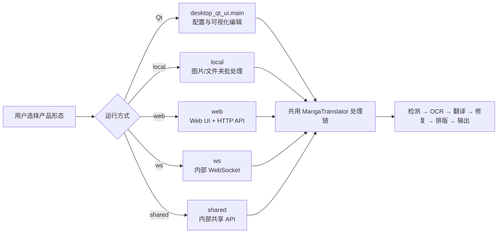

# 产品形态

本项目提供桌面 Qt 界面、`local` 命令行、Web 界面，以及供内部集成使用的 `ws` 与 `shared` 服务形态。它们共用翻译核心，但交互方式、网络边界和适用场景不同；先按使用方式选择，再进入具体参数页面。

本页只帮助选择运行形态，不展开翻译参数、API 凭据、九种工作流或 HTTP 请求字段。共同输入和流程见[首次翻译](./first-translation.md)，安装方式见[选择版本](../install/choose-edition.md)。

## 功能边界 {#scope}

| 形态 | 适合解决的问题 | 不负责的事情 |
| --- | --- | --- |
| Qt 桌面应用 | 本机选择文件、调整设置、查看进度，并在可视化编辑器中修改区域和样式 | 不把编辑器操作变成公共 HTTP API |
| `local` 命令行 | 对图片或文件夹执行可脚本化的本地翻译、输出和批处理 | 不监听端口，不提供浏览器工作区 |
| `web` Web UI | 通过浏览器上传、配置、启动任务、查看结果和历史；同一进程也提供 HTTP API | 不等于内部 `ws`/`shared` 协议 |
| `ws` WebSocket | 作为内部后端连接上游 WebSocket，为本地集成提供处理能力 | 不是面向普通用户的公开 Web API |
| `shared` 内部 API | 让本地集成调用共享的翻译实例 | 不是无需鉴权即可暴露到公网的服务 |
| Docker 部署 | 以容器方式运行 Web 形态，并通过卷保存资源和服务器数据 | 不是另一套翻译引擎；容器端口不能当作宿主机端口 |

## 如何选择与启动 {#choose-and-start}

### Qt 桌面应用 {#desktop}

适合第一次使用、需要逐项检查参数或需要翻译后手工修订的场景。启动后默认进入“翻译界面”，侧栏还提供“设置”“API 管理”“提示词管理”“替换规则”“富文本规则”“批量管理”和底部的“编辑器视图”。语言与主题位于 General 设置区；语言变化会保存 `app.ui_language` 并触发 UI 文本刷新。

| UI 调用 key | English 实际值 | 简体中文实际值 |
| --- | --- | --- |
| `Translation Interface` | Translation Interface | 翻译界面 |
| `Settings` | Settings | 设置 |
| `API Management` | API Management | API 管理 |
| `Prompt Management` | Prompt Management | 提示词管理 |
| `Replacement Rules` | Replacement Rules | 替换规则 |
| `Rich Text Rules` | Rich Text Rules | 富文本规则 |
| `Batch Management` | Batch Management | 批量管理 |
| `Editor View` | Editor View | 编辑器视图 |
| `&Language` | &Language | &语言 |
| `&Theme` | &Theme | &主题 |

最短路径是：启动应用 → 在“API 管理”配置当前功能所需连接 → 在“翻译界面”加入图片或文件夹 → 选择工作流并开始。文件添加、输出目录、进度和编辑器细节由后续页面说明。

### 本地命令行 {#local-cli}

适合自动化、批量处理和无桌面环境。正式入口是：

```text
uv run --no-sync python -m manga_translator local -i <图片或文件夹> [选项]
```

`-i` 可接一个或多个输入；`-o` 指定输出目录，`--config` 指定配置文件，`--overwrite` 允许覆盖已有输出。`--format`、`--batch-size` 和 `--attempts` 是显式覆盖；只有启用 `--subprocess` 时，`--memory-limit`、`--memory-percent` 和 `--batch-per-restart` 才会被下游消费。不启动子进程时，不要把这些内存参数当作普通翻译参数。

当第一个参数不是正式模式且命令行包含 `-i`/`--input` 时，解析器会隐式插入 `local`；自动化脚本仍建议显式写出 `local`。

### Web 界面与服务器 {#web}

适合需要浏览器、多人权限或服务端任务历史的场景。正式入口是：

```text
uv run --no-sync python -m manga_translator web
```

默认监听 `0.0.0.0:8000`，可用 `MT_WEB_HOST` 和 `MT_WEB_PORT` 改写。`0.0.0.0` 只表示监听所有 IPv4 接口，不是浏览器地址；本机通常访问 `http://localhost:8000`。Docker GPU compose 将宿主机 `8001` 映射到容器 `8000`，访问端口应以实际映射为准。

Web 工作区可选择图片、目录以及 `image/*`、PDF、JSON、TXT 输入，选择工作流后启动任务；结果可预览、单项下载或批量下载。登录后的请求使用 `X-Session-Token`，并区分普通工作区与 `/admin` 管理界面。不要把令牌、API Key 或用户图片复制到文档、日志或截图。

Web 的实际文字不完全由桌面 locale 覆盖。以下是主脚本调用并已核对的三列证据；`admin` 在调用处使用中文 fallback：

| UI 调用 key | English 实际值 | 简体中文实际值 |
| --- | --- | --- |
| `Manga Translator` | Manga Translator | 漫画翻译器 |
| `Add Files` | Add Files | 添加文件 |
| `Clear List` | Clear List | 清空列表 |
| `Translation Workflow Mode:` | Translation Workflow Mode: | 翻译流程模式： |
| `Start Translation` | Start Translation | 开始翻译 |
| `Basic Settings` | Basic Settings | 基础设置 |
| `Advanced Settings` | Advanced Settings | 高级设置 |
| `Options` | Options | 选项 |
| `API Keys (.env)` | API Keys (.env) | API密钥 (.env) |
| `admin` | 缺失，使用调用处 fallback | 缺失，使用调用处 fallback |

### `ws` 与 `shared` 内部形态 {#internal-services}

只有在已有本地集成或上游服务要求时才选择它们。两者默认监听 `127.0.0.1:5003`，因此不会像 `web` 那样默认监听所有接口：

```text
uv run --no-sync python -m manga_translator ws
uv run --no-sync python -m manga_translator shared
```

`ws` 还连接默认上游 `ws://localhost:5000`，可通过 `--ws-url`、`--nonce` 等选项调整；`shared` 使用 `--nonce` 保护内部 API 通信。协议消息、锁、流式响应和 nonce/secret 契约属于开发者页面，本页不把它们宣传成普通公共 API。

### Docker {#docker}

Docker 适合已有容器运维流程、希望隔离依赖或运行 Web UI 的用户。CPU compose 服务把宿主机 `8000` 映射到容器 `8000`；GPU 服务把宿主机 `8001` 映射到容器 `8000`，并声明 NVIDIA GPU。持久化卷覆盖 `/app/fonts`、`/app/dict`、`/app/models`、`/app/config`、`/app/manga_translator/server/data` 等目录。

不要把 compose 中的管理员密码示例用于生产部署，也不要提交 `.env`。服务器数据、用户资源、会话、配额和历史元数据都应按敏感数据管理。

## 运行机理 {#runtime}

四种正式命令模式由同一个入口解析后分发；Qt 是独立的桌面入口，但最终与命令模式共用处理链：



命令行入口在分发前确保运行时文件，再调用 `local`、`web`、`ws` 或 `shared` 执行模块。Web 在核心处理链外增加认证、权限、并发、历史和下载票据；Docker 只是把 Web 进程与资源目录放入容器。`local` 普通运行会应用显式 CLI 覆盖；子进程模式另行管理内存阈值和重启。

## 依赖与冲突 {#dependencies}

- **硬件**：各形态都可能加载 PyTorch、ONNX 或阶段模型；CPU/GPU/AMD/Metal 依赖组应按安装页选择。
- **配置**：`config/config.json`、发行示例和代码默认值属于不同层级；用户配置优先于示例，CLI 只覆盖实际写入的字段。
- **端口**：Web 默认 `8000`；WS/shared 默认 `5003`。同时运行内部服务时必须避免端口重复。
- **工作流**：九种工作流由配置字段驱动，特殊工作流通常不能进入 `batch_concurrent` 并发管线；具体跳过阶段见工作流矩阵。
- **网络与隐私**：Web 的 `0.0.0.0` 会扩大监听面；请求可能包含图片、OCR 文本和译文，公开部署前应配置鉴权、防火墙和安全的密钥注入。
- **编辑器**：可视化编辑器属于 Qt 桌面工作区；CLI/Web 生成项目 JSON 不代表具有同等编辑器交互。

## 关联文件与格式 {#files}

| 文件或目录 | 形态中承担的作用 | 手改与兼容注意 |
| --- | --- | --- |
| `config/config.json` | Qt、`local` 与服务运行时的用户配置 | 用户配置优先于示例；不要公开私有路径 |
| `config/config-example.json` | 默认配置和初始化来源 | 仅作无密钥示例 |
| `.env` | API 地址、模型和凭据等环境变量 | 不读取或展示值；是否持久化取决于安全挂载 |
| `config/custom_api_params.json` | API 请求额外参数 | 不负责选择产品形态或保存 API Key |
| `manga_translator_work/` | 每图 JSON、原文/译文文本、修复图和编辑器覆盖层 | 可能含用户内容、坐标和 base64 蒙版，不应直接上传 |
| `packaging/docker-compose.yml` | Docker 端口、卷和硬件服务 | 宿主机端口与容器端口不同；密码不得照搬示例 |

详细格式回到实际消费者页面：工作流文件见各工作流页，API 配置见 API 管理页，逐图 JSON 与编辑器写回见编辑器导入导出页。

## 源码依据 {#source-evidence}

| 层级 | 文件 | 本页核对内容 |
| --- | --- | --- |
| Qt 启动与 UI | `desktop_qt_ui/main.py`、`desktop_qt_ui/ui/main_window.py` | 入口、主窗口、导航、语言/主题刷新 |
| Qt i18n | `desktop_qt_ui/locales/en_US.json`、`desktop_qt_ui/locales/zh_CN.json` | 桌面 key 的实际显示值 |
| 正式分发 | `manga_translator/__main__.py`、`manga_translator/args.py` | 四个命令模式及分发链 |
| Web 用户界面 | `manga_translator/server/static/index.html`、`script.js`、`history-gallery.js` | 输入、工作流、结果、语言、会话和管理入口 |
| Web 服务 | `manga_translator/server/main.py`、`server/routes/` | HTTP 服务与外围能力 |
| 工作流与路径 | `desktop_qt_ui/services/workflow_service.py`、`manga_translator/manga_translator.py`、`manga_translator/utils/path_manager.py` | 分支、输出和工作目录 |
| Docker | `packaging/Dockerfile`、`packaging/docker-compose.yml` | 端口映射、硬件服务和卷 |
| 调查资料 | `doc/wiki/research/desktop-main-navigation.md`、`cli-command-inventory.md`、`phase0-web-user-http.md`、`workflow-matrix-source-evidence.md`、`phase0-related-files-formats-debug-safety.md` | 本页边界、文案、格式和敏感信息审查 |

## 验证记录 {#verification}

| 验证内容 | 状态 | 说明 |
| --- | --- | --- |
| 页面合同与范围 | 完成 | 已按三份合同编写，仅覆盖 `introduction/product-forms.md` |
| 源码与 i18n | 完成 | 已核对 Qt 导航、CLI 分发、Web 脚本、工作流、路径和 Docker；保留三列 i18n 证据 |
| 敏感信息审查 | 完成 | 未写入 API Key、令牌、用户名、真实密码、私有绝对路径、用户图片或私有提示词 |
| 有头 UI 与实际运行 | 待运行验证 | 本次未启动 Qt/Web、未使用真实凭据、未生成截图 |
| 路由镜像与源码依据检查 | 待执行 | `node scripts/verify-route-mirror.mjs doc/wiki`；`node scripts/verify-source-evidence.mjs doc/wiki` |
| VitePress 构建 | 待执行 | `npm run docs:build --prefix doc/wiki` |
