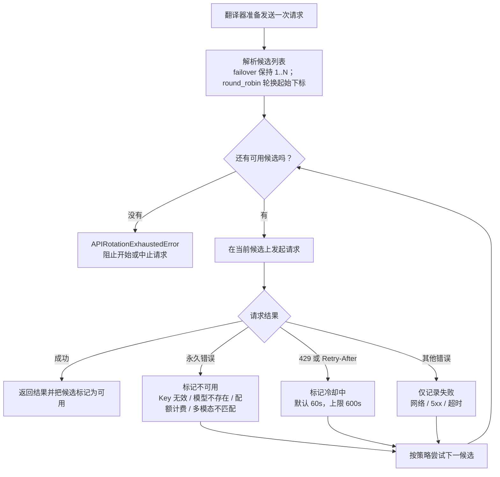

# API、鉴权、限流与超时排障

当翻译、OCR、上色或渲染请求报 API 错误、鉴权失败、限流或超时，先分清问题发生在“本机到外部 API”还是“浏览器到 Web 服务”，再按症状定位配置、网络或候选状态。本页只讲四类症状的诊断顺序与修复入口；候选通道、冷却状态机、重试/RPM 参数、连接测试和 Web 部署安全的具体正文分别在对应页面。

## 功能边界 {#feature-boundary}

- 本页覆盖四类症状：API 错误（4xx/5xx）、鉴权失败（密钥无效、401/403）、限流（429/冷却/RPM）、超时与网络（timeout/connection/DNS）。
- 候选通道的增删、编号与 `failover`/`round_robin` 策略见[API 通道与轮询策略](../desktop/api-management/slots-and-rotation.md)；冷却、不可用、恢复与再失败状态机见[故障、冷却与恢复](../desktop/api-management/failures-cooldown-and-recovery.md)；连接测试与获取模型见[连接测试与模型列表](../desktop/api-management/connection-tests-and-model-list.md)；Key/Base/Model 字段与 `.env` 键映射见[凭据、地址与模型](../desktop/api-management/credentials-addresses-models.md)。
- `cli.attempts`、`translator.max_requests_per_minute` 与译后质量检查的完整参数说明见[重试、限流与质量](../desktop/translator/retry-rate-limit-and-quality.md)，本页不重复参数模板。
- Web 场景：登录/注册/会话限流、并发与配额属于[Web 部署、安全与排错](../web/deployment-security-and-troubleshooting.md)与[登录、语言与会话](../web/login-language-and-session.md)；完整状态码契约属于开发者文档[鉴权与错误](../developer/http-api/authentication-and-errors.md)与[翻译端点](../developer/http-api/translation-endpoints.md)。
- “限流”在桌面端与 Web 服务是两个不同层级：桌面端是外部 API 的 RPM 与候选冷却；Web 服务是登录/注册/并发/配额的服务端限流。不要混用两套概念排查。

## 症状速查 {#symptom-quick-reference}

下表按“错误特征 -> 源码归类 -> 系统行为 -> 排查入口”组织。归类依据 `manga_translator/api_key_rotation.py` 的永久错误/冷却判定；`cli.attempts` 与候选数量控制的是两个不同层级，见[重试、限流与质量](../desktop/translator/retry-rate-limit-and-quality.md)。

| 错误特征 | 归类（源码判定） | 系统行为 | 首选排查入口 |
| --- | --- | --- | --- |
| `invalid api key`、`api key not valid`、`api key expired`、`api key revoked`、`invalid authentication`、`invalid credentials`、`permission denied`、`access denied` | 永久错误（候选不可用） | 候选被标记为不可用，后续请求跳过 | [凭据、地址与模型](../desktop/api-management/credentials-addresses-models.md) 检查 Key；[连接测试](../desktop/api-management/connection-tests-and-model-list.md) 验证 |
| `401`、`403`、`unauthorized`、`forbidden`（消息不含上述标记） | 其他错误（仅记录失败） | 按 attempts 在同一候选重试，然后转下一候选 | 检查 Key 权限、账户状态与地区限制 |
| `404`、`not found`、`model not found`、`model does not exist` | 永久错误（候选不可用） | 候选被标记为不可用 | 检查 API 地址、模型名与翻译器类型是否匹配 |
| `402`、`insufficient_quota`、`billing`、`payment required` | 永久错误（候选不可用） | 候选被标记为不可用 | 检查账户余额、配额与计费状态 |
| `400` 且消息含 `unsupported model`、`invalid model`、`unknown variant image_url`、`did not contain an image` 等 | 永久错误（候选不可用） | 候选被标记为不可用 | 换用支持多模态输出的模型 |
| `429`、`rate limit`、`too many requests`、`Retry-After` | 冷却 | 同一候选按 attempts 重试后进入冷却（默认 60 秒，`Retry-After` 上限 600 秒） | [重试、限流与质量](../desktop/translator/retry-rate-limit-and-quality.md) 调整 RPM；[故障、冷却与恢复](../desktop/api-management/failures-cooldown-and-recovery.md) 查看冷却 |
| `408/409/425/500/502/503/504/520-524`、`bad gateway`、`service unavailable` | 其他错误（可重试） | 按 attempts 在同一候选重试，耗尽后转下一候选 | 增大[重试次数](../desktop/translator/retry-rate-limit-and-quality.md)；等待服务恢复 |
| `timeout`、`timed out`、`connection`、`network`、DNS/`getaddrinfo` | 其他错误（可重试） | 按 attempts 重试；真实请求客户端超时为 600 秒、流式 300 秒 | 检查网络、代理 TUN 与 API 地址 |
| `No available API candidates`、`exhausting API candidates` | 候选耗尽 | 抛出候选耗尽错误，阻止开始或中止请求 | [恢复候选](../desktop/api-management/failures-cooldown-and-recovery.md) 或「测试当前页」 |

## 鉴权失败 {#authentication-failures}

- 桌面端 Key 保存在 `.env`，由 API 管理页的“API 密钥”（`label_*_API_KEY`）字段编辑。先确认当前功能页签与翻译器/提供商匹配：OpenAI 兼容端点应选择 OpenAI 系翻译器，Gemini 官方端点应选择 Gemini 系；再把 Key 粘贴进对应页签，避免多余空格、换行或复制错行。
- 用“测试”（`Test`）或“测试当前页”（`Test Current Tab`）验证。失败弹窗标题为“API连接测试失败”（`API connection test failed`），正文按网络错误、服务端异常或通用配置给出分类建议。
- 源码把密钥无效按消息识别为永久错误：`invalid api key`、`api key not valid`、`api key expired`、`invalid authentication`、`invalid credentials`、`permission denied`、`access denied` 等命中后，候选进入“不可用”，后续请求跳过该候选，直到修改凭据或点击“恢复”（`Restore`）。
- Web 服务有两类“鉴权失败”：浏览器会话 401（令牌缺失/无效/过期，前端清本地令牌并跳转登录页）与服务器端保存的 API Key 无效（翻译请求 401/403）。前者见[登录、语言与会话](../web/login-language-and-session.md)，后者先检查管理界面的 API Key 策略与 `.env` 持久化，见[Web 部署、安全与排错](../web/deployment-security-and-troubleshooting.md)。
- 本页不展示真实 Key；错误弹窗和日志中出现的明文 Key 片段不要复制到公开报告。

## 限流与冷却 {#rate-limit-and-cooldown}

- 外部 API 限流：`translator.max_requests_per_minute`（“每分钟最大请求数”）按模型维护全局请求时间戳，`0` 表示不限制；只影响走 OpenAI/Gemini 系列的真实请求，不影响本地翻译器。
- 收到 `429` 或消息含 `rate limit`/`too many requests` 时，候选进入“冷却中”，默认冷却 60 秒；若响应带 `Retry-After` 头，按该值冷却但上限 600 秒。冷却到期会自动重新参与候选选择，但不保证服务端已经恢复。
- 冷却/不可用状态只保存在进程内存（`_API_STATUS`），不写入 `.env` 或 `config.json`，重启即清空。“恢复”（`Restore`）只清除状态记录，不修复 Key、地址或模型。
- Web 服务的服务端限流与配额口径见下表，完整说明在[Web 部署、安全与排错](../web/deployment-security-and-troubleshooting.md)。

| 限流场景 | 口径（源码） | 超限返回 |
| --- | --- | --- |
| 外部 API RPM | `translator.max_requests_per_minute`，`0` 不限制 | 客户端自行限速，不产生 429 |
| 外部 API 429 / `Retry-After` | 账户级 RPM/TPM 或渠道限流 | 候选进入冷却（默认 60 秒，上限 600 秒） |
| Web 登录 `/auth/login` | 每 IP 10 分钟 15 次；每用户名 10 分钟 8 次 | `429` + `Retry-After` |
| Web 注册 `/auth/register` | 每 IP 10 分钟 5 次 | `429` + `Retry-After` |
| 旧密码门 `/user/login` | 每 IP 10 分钟 10 次 | `429` + `Retry-After` |
| 并发任务 / 每日配额 | 按用户或用户组生效的并发上限与每日配额 | `429` |

## 超时与网络 {#timeout-and-network}

- 真实翻译请求的客户端超时是硬编码：OpenAI/Gemini 普通请求 `timeout=600` 秒、流式 `stream_timeout=300` 秒；连接测试与取模型使用 30 秒（文本/OCR）或 60 秒（图像类）；Sakura 本地服务等待超时为 999 秒并单独重试 3 次。当前没有界面开关可以修改这些值。
- 超时/连接类错误属于可重试错误：`timeout`、`timed out`、`connection`、`network`、`reset by peer`、`temporary failure` 等命中后按 `cli.attempts` 重试；同一候选的重试间隔为 1 秒、2 秒、3 秒封顶。
- 先区分“本机连不上外部 API”与“Web 服务自身超时”：前者检查网络、代理 TUN、DNS 与 API 地址；后者与 Uvicorn `timeout_keep_alive=1800`（连接保持 30 分钟）、会话 60 分钟不活动过期、下载票据默认 5 分钟 TTL 有关，详见[Web 部署、安全与排错](../web/deployment-security-and-troubleshooting.md)与[Web 服务器端口与部署](../developer/web-server-ports-and-deployment.md)。
- `cli.attempts=-1`（无限重试）叠加持续超时或 5xx 可能长时间不退出；中断批量任务后检查失败列表与日志，而不是反复重启。

## 一次失败请求的处理顺序 {#failure-handling-order}

上图是源码确认的候选级处理顺序：先在同一候选上按 `cli.attempts` 重试，只有永久错误和限流才会改变候选状态，然后才按策略尝试下一候选。“重试次数”与“API 通道数量”是两个层级；`attempts=-1`、单候选、无失败等场景会走对应旁路，文档没有伪造运行截图。

## 界面文案对照 {#ui-copy}

| UI 调用 key | English 实际值 | 简体中文实际值 |
| --- | --- | --- |
| `Settings` | Settings | 设置 |
| `General` | General | 通用 |
| `Translation` | Translation | 翻译 |
| `label_attempts` | Retry Attempts | 重试次数 |
| `desc_cli_attempts` | Retry count when an API call fails. Set to -1 for unlimited retries. | 调用 API 出错时的重试次数。设为 -1 表示无限重试。 |
| `label_max_requests_per_minute` | Max Requests Per Minute | 每分钟最大请求数 |
| `desc_translator_max_requests_per_minute` | Maximum requests per minute. Set to 0 for no limit. Used to avoid API rate limits. | 每分钟最大请求数。设为 0 表示不限制。用于避免触发 API 速率限制。 |
| `API Management` | API Management | API 管理 |
| `Test Current Tab` | Test Current Tab | 测试当前页 |
| `Test` | Test | 测试 |
| `API slot cooldown marker` | Cooling down | 冷却中 |
| `API slot unavailable marker` | Unavailable | 不可用 |
| `Restore API channel` | Restore | 恢复 |
| `API connection test failed` | API connection test failed | API连接测试失败 |
| `API candidate availability failed` | No available API candidates | 没有可用的 API 候选 |
| `API Keys Required` | API Keys Required | 需要填写 API 密钥 |

Web 登录页与部分错误弹窗仍有硬编码中文（无 i18n key），由[Web 部署、安全与排错](../web/deployment-security-and-troubleshooting.md)记录，本页不擅自补译。

## 关联配置与文件 {#related-configuration}

| 配置/文件 | 本页实际作用 | 注意 |
| --- | --- | --- |
| `cli.attempts` | 请求发送重试预算；`-1` 无限、`0` 不重试 | 与 API 候选数量是两个层级 |
| `translator.max_requests_per_minute` | 外部 API 每分钟请求节奏 | `0` 不限制；只影响 OpenAI/Gemini 系列 |
| `.env` 的 Key/Base/Model 与 `*_API_ROTATION_STRATEGY` | 提供 API 候选 | 含真实密钥，禁止提交或展示 |
| `config/config.json` | 用户设置持久化 | 不读取或展示真实用户文件 |
| `manga_translator_work/` 调试目录 | 失败任务保留调试产物 | 分享前删除请求正文、Key 与私有路径 |
| `manga_translator/server/data/` | Web 会话、账号、审计与配额数据 | 不分享 `sessions.json`、`accounts.json`、`audit.log` 的真实内容 |
| `admin_config.json` | Web 管理员设置（含并发上限） | 生产环境修改示例密码 |

## 源码依据 {#source-evidence}

| 层级 | 文件 | 本页核对内容 |
| --- | --- | --- |
| 桌面 UI | `desktop_qt_ui/ui/main_page/env_management.py`、`ui/main_page/pages/env_page.py` | 测试/恢复/状态条、缺失 Key 提示、错误弹窗分类 |
| 测试与错误分类 | `desktop_qt_ui/app_logic.py` | `_test_*_api` 超时、`_build_friendly_error_message`、`_format_test_connection_error` 分类 |
| UI/i18n | `desktop_qt_ui/locales/en_US.json`、`zh_CN.json` | 本页三列表 key 与实际中英文值 |
| 候选轮换与状态 | `manga_translator/api_key_rotation.py` | 永久/冷却判定、`Retry-After`、`run_with_api_candidates`、冷却/不可用/耗尽 |
| 重试归一化 | `manga_translator/utils/retry.py` | `normalize_retry_attempts`、`resolve_total_attempts`、退避间隔 |
| 候选解析 | `manga_translator/runtime_api_resolver.py` | 候选构造、策略解析、去重 |
| 翻译消费者 | `manga_translator/translators/openai.py`、`gemini.py`、`sakura.py` | 客户端 600/300 秒超时、RPM 时间戳、Sakura 999 秒与超时重试 |
| Web 服务 | `manga_translator/server/routes/auth.py`、`routes/web.py`、`server/core/middleware.py`、`server/core/request_rate_limiter.py`、`server/core/session_security_service.py`、`server/main.py` | 登录/注册/旧密码门/会话枚举限流、并发/配额 429、Uvicorn 超时 |

## 验证记录 {#verification}

| 验证内容 | 状态 | 说明 |
| --- | --- | --- |
| BLUEPRINT、PAGE_GUIDELINES、TODO | 完成 | 已读取 1.3 节与 5.17 小节并按页面合同编写；未修改 TODO.md |
| UI 与 i18n 实际值 | 完成 | 三列表逐项核对 `en_US.json` / `zh_CN.json`，缺失键标注回退 |
| 错误分类与候选状态 | 完成 | 静态核对 `api_key_rotation.py`、`utils/retry.py`、`app_logic.py` 与翻译器超时 |
| Web 限流与超时 | 完成 | 静态核对 `auth.py`、`web.py`、`middleware.py`、`request_rate_limiter.py`、`main.py` |
| 镜像与源码依据脚本 | 完成 | `node scripts/verify-route-mirror.mjs .` 与 `node scripts/verify-source-evidence.mjs .` 通过 |
| 脱敏运行验证 | 待后续 | 未读取真实 `.env`、用户配置、API key/token、用户名、用户图片或私有提示词 |
| VitePress 构建 | 待运行 | 由协调代理在合并前运行 `npm run docs:build --prefix doc/wiki` |