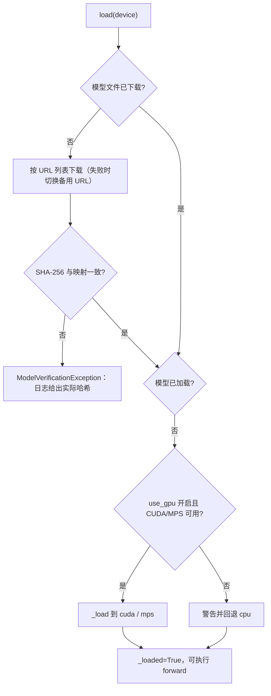
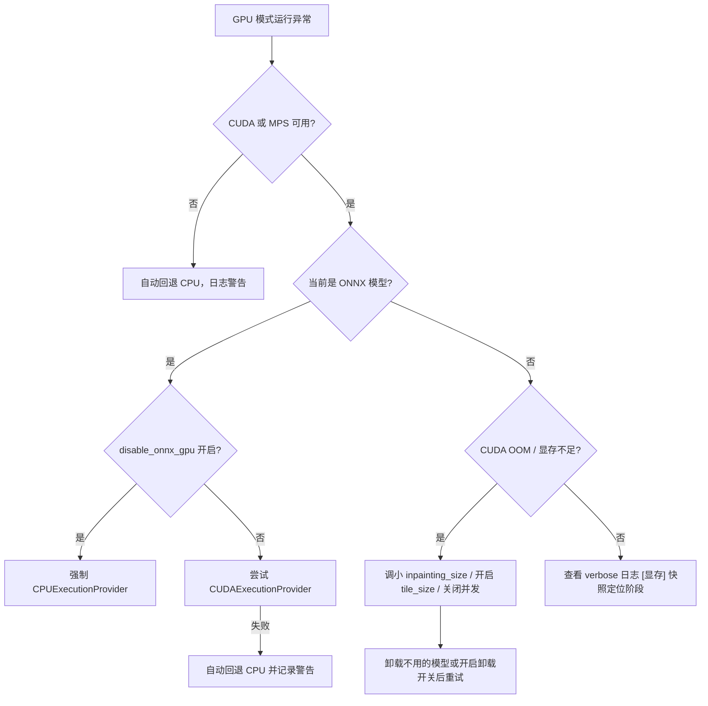
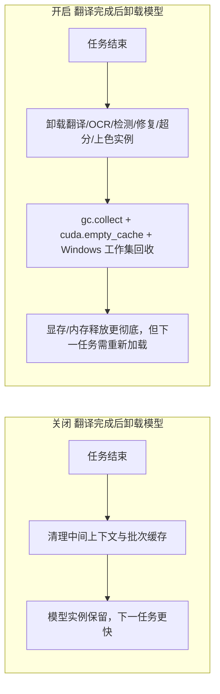

# 模型、GPU 与内存排障

当任务卡在模型下载、报“CUDA out of memory”、GPU 模式无法启动，或翻译结束后内存/显存没有回落时，本页用于定位模型加载、GPU 设备、显存（VRAM）与内存（RAM）相关问题。安装阶段的硬件后端依赖组见[运行环境与依赖要求](../install/requirements.md)，`app.unload_models_after_translation` 等开关在界面中的位置见[通用与应用设置](../desktop/settings/general-and-app.md)。本页不重复翻译、OCR、检测、修复、超分等参数页的完整说明，也不涉及 API 鉴权与限流（见[API 鉴权、限流与超时](./api-auth-rate-limit-and-timeout.md)）和 CLI 子进程的整机内存限制（见[子进程、内存与恢复](../cli/subprocess-memory-and-recovery.md)）。

## 功能边界 {#feature-boundary}

- 本页负责：模型下载/校验失败、`cli.use_gpu` 设备选择、`cli.disable_onnx_gpu` 的 ONNX 路径、`app.unload_models_after_translation` 的任务后卸载，以及 `inpainting_size`、`tile_size` 等与显存相关的处置。
- 本页不负责：安装依赖组如何选择（见 `install/requirements.md`）、修复/超分参数的完整选项（见各自设置页）、日志与调试产物的分享规范（见[如何阅读与分享调试运行](../debugging/how-to-read-and-share-a-debug-run.md)）。
- 开关本身的 UI 归属在设置页记录；本页只解释它们在模型、GPU 与内存排障中的用途和底层行为。

## 常见现象与快速定位 {#symptoms}

| 现象 | 常见原因 | 先查这里 |
| --- | --- | --- |
| 首次启用某模型卡在下载或报哈希校验失败 | 网络不可达、备用 URL 也失败、文件损坏或与实际权重不一致 | `models/` 子目录是否存在；日志中给出的实际哈希；[模型加载与下载](#model-loading) |
| 提示找不到 CUDA/Metal 设备并自动回退 CPU | 安装了 CPU 依赖组、驱动不匹配，或 `cli.use_gpu` 开启但设备不可用 | [运行环境与依赖要求](../install/requirements.md)；`label_use_gpu` |
| ONNX 模型加载报错或有 GPU 兼容问题 | ONNX Runtime 的 CUDA provider 不可用、DLL 冲突 | 开启 `label_disable_onnx_gpu` 强制 CPU 后观察是否恢复 |
| 报 CUDA out of memory / 显存不足 | 单次推理输入过大、`inpainting_size` 过大、并发或缓存占用峰值过高 | 调小 `inpainting_size`、开启 `tile_size`、关闭并发、开启卸载开关 |
| 任务结束后内存/显存没有回落 | 模型实例常驻缓存、Python 与 CUDA 缓存未回收 | 开启 `app.unload_models_after_translation`；查看 verbose 日志中的 `[显存]` 快照 |

## 界面中的相关开关 {#ui-controls}

### 设置 → 通用 {#general-group}

打开“设置”（`Settings`），选择“通用”（`General`）分组。三个开关都位于该分组：

1. “使用 GPU”（`Use GPU`）请求 GPU 加速。它只改变运行时的设备选择，不能把 CPU 依赖环境变成 CUDA 环境。
2. “禁用 ONNX GPU 加速”（`Disable ONNX GPU Acceleration`）只关闭 ONNX Runtime 的 GPU 路径，强制其走 CPU。
3. “翻译完成后卸载模型”（`Unload Models After Translation`）控制每次任务结束后的模型卸载与内存回收；开启后下一任务需要重新加载模型。

| UI 调用 key | English 实际值 | 简体中文实际值 |
| --- | --- | --- |
| `label_use_gpu` | Use GPU | 使用 GPU |
| `desc_cli_use_gpu` | Enable GPU acceleration. Requires CUDA support, significantly speeds up processing. | 启用 GPU 加速。需要 CUDA 支持，可大幅提升处理速度。 |
| `label_disable_onnx_gpu` | Disable ONNX GPU Acceleration | 禁用 ONNX GPU 加速 |
| `desc_cli_disable_onnx_gpu` | Disable ONNX Runtime GPU acceleration. Try enabling this if GPU mode has compatibility issues. | 禁用 ONNX Runtime GPU 加速。如果 GPU 模式出现兼容问题，可尝试启用此选项。 |
| `label_unload_models_after_translation` | Unload Models After Translation | 翻译完成后卸载模型 |
| `desc_app_unload_models_after_translation` | Unload all models after translation to free VRAM and memory. Good for low VRAM, but requires reloading for next translation. | 翻译完成后卸载所有模型以释放显存和内存。适合显存不足的场景，但下次翻译需要重新加载。 |
| `desc_upscale_tile_size` | Tile processing size (0=no tiling). Splits large images into tiles to reduce VRAM usage. Recommended 200-800. | 分块处理大小 (0=不分割)。将大图分割成小块处理以降低显存占用。建议 200-800。 |

最后一行是超分参数 `upscale.tile_size` 的说明面板文案，不是“通用”分组的开关。

### 其他相关设置 {#other-settings}

- 修复尺寸 `inpainter.inpainting_size`：设置 → 蒙版与修复（Inpainting）页。默认 `2048`，过大会直接导致显存不足。
- 超分分块 `upscale.tile_size`：设置 → 超分与上色（Upscale / Colorization）页。`0` 表示不分块整图处理，分块可显著降低显存峰值。
- 并发批量 `cli.batch_concurrent`：设置 → 通用。并发会同时加载多张图的中间结果，放大显存与内存峰值；显存受限时可关闭。

## 关键设置 {#key-settings}

#### `cli.use_gpu` — 使用 GPU / Use GPU {#cli-use-gpu}

- 控件：开关（设置 → 通用；UI 调用 key `label_use_gpu`）。
- 存储值：布尔。
- 可选值：`true | Use GPU | 使用 GPU`；关闭时无独立界面文案，仅表示不使用 GPU。
- 默认值：核心 `manga_translator/config.py#CliConfig.use_gpu` 为 `True`；Qt 模型 `desktop_qt_ui/core/config_models.py#CliSettings.use_gpu` 为 `True`；发行配置 `config/config-example.json` 为 `true`。
- 生效阶段：`MangaTranslator` 初始化时的设备选择，影响后续所有模型的加载设备。
- 原理：开启且设备可用时选择 `cuda`（Apple Silicon 为 `mps`）；开启但 CUDA/MPS 均不可用时打印警告并自动回退 `cpu`。它不改变已安装的依赖组。
- 依赖与冲突：依赖安装阶段选择的后端组与驱动；ONNX 部分还受 `cli.disable_onnx_gpu` 影响。
- 图示：不需要单独图；分支见[GPU 与显存](#gpu-and-vram)。

#### `cli.disable_onnx_gpu` — 禁用 ONNX GPU 加速 / Disable ONNX GPU Acceleration {#cli-disable-onnx-gpu}

- 控件：开关（设置 → 通用；UI 调用 key `label_disable_onnx_gpu`）。
- 存储值：布尔；CLI 对应 `--disable-onnx-gpu`，并在启动时写入环境变量 `MT_DISABLE_ONNX_GPU=1`。
- 可选值：`true | Disable ONNX GPU Acceleration | 禁用 ONNX GPU 加速`；关闭表示允许 ONNX 使用 CUDA provider。
- 默认值：核心 `CliConfig.disable_onnx_gpu` 为 `False`；Qt `CliSettings.disable_onnx_gpu` 为 `False`；发行配置为 `false`。
- 生效阶段：ONNX Runtime 推理会话创建时（检测、OCR、修复等 ONNX 模型）。
- 原理：`set_onnx_gpu_disabled()` 设置进程级开关；开启后 `build_execution_providers` 直接使用 `CPUExecutionProvider`。即使未开启，CUDA provider 创建失败也会自动回退 CPU 并记录警告。
- 依赖与冲突：只影响 ONNX 路径，不影响 PyTorch/MPS 模型；与 `cli.use_gpu` 不是互斥开关。
- 图示：见[GPU 与显存](#gpu-and-vram)。

#### `app.unload_models_after_translation` — 翻译完成后卸载模型 / Unload Models After Translation {#app-unload-models-after-translation}

- 控件：开关（设置 → 通用；UI 调用 key `label_unload_models_after_translation`，动态设置中的自定义复选框）。
- 存储值：布尔。
- 可选值：`true | Unload Models After Translation | 翻译完成后卸载模型`；关闭表示任务结束后保留模型实例。
- 默认值：Qt 模型 `desktop_qt_ui/core/config_models.py#AppSettings.unload_models_after_translation` 为 `False`；发行配置为 `false`；核心 `Config` 没有该字段（桌面应用状态）。
- 生效阶段：每次翻译任务结束后的 `finally` 清理阶段。
- 原理：开启时调用 `full_memory_cleanup(unload_models=True)`，卸载翻译、OCR、检测、修复、超分、上色各模块缓存中的模型实例，随后执行垃圾回收、CUDA `empty_cache`/重置峰值统计，并在 Windows 上调用 `EmptyWorkingSet` 或 `SetProcessWorkingSetSize` 回收物理内存；关闭时只清缓存字典，保留模型实例以便下次更快。
- 依赖与冲突：开启后下一任务需重新加载模型，首次响应变慢；不保证第三方进程占用的显存立即归还。
- 图示：见[卸载与内存回收](#memory-cleanup)。

## 运行机理 {#runtime-behavior}

### 模型加载与下载 {#model-loading}

模型根目录是 `BASE_PATH/models`（`BASE_PATH` 在开发环境为仓库根目录，冻结包为可执行文件目录），检测、OCR、修复、超分、上色、翻译各模块使用独立子目录。`ModelWrapper.load()` 先检查文件是否已下载：缺失时按模块的 `_MODEL_MAPPING` 从 URL 列表下载，计算 SHA-256 并与映射中的 `hash` 比对；不一致时抛出 `ModelVerificationException` 并在日志中打印实际哈希。文件就绪后才执行 `_load(device)`，把权重加载到对应设备。

下载失败或哈希不匹配时，先确认网络与 `models/` 目录权限，再按日志中的实际哈希核对映射或清理损坏文件后重试；不要把下载目录或日志中的本机路径直接复制到公开报告。

### GPU 与显存 {#gpu-and-vram}

设备选择发生在 `MangaTranslator` 初始化：`use_gpu=True` 且可用时选 `cuda`/`mps`，否则回退 `cpu` 并记录警告。ONNX 会话由 `onnx_runtime.py` 创建：未禁用时优先 `CUDAExecutionProvider`，provider 缺失或会话创建失败会自动回退 `CPUExecutionProvider`。桌面端与 CLI 都在导入 PyTorch 前设置 `PYTORCH_ALLOC_CONF=expandable_segments:True`，以减少显存碎片、降低 OOM 概率。verbose 模式下，显存快照会以 `[显存]` 前缀写入日志（allocated/reserved/peak/free），用于定位阶段性增长。

该图描述的是源码中的真实分支。OOM 是否出现还取决于图片尺寸、`batch_concurrent` 和同机其他进程占用；开启分块或卸载开关并不保证所有模型都不再报 OOM。

### 卸载与内存回收 {#memory-cleanup}

`app.unload_models_after_translation` 只在桌面端任务结束后由 `app_logic.py` 读取并调用 `full_memory_cleanup()`。核心 `MangaTranslator` 内部另有按批次的 `_cleanup_gpu_memory()`：普通清理做限流垃圾回收与 CUDA 同步，`aggressive=True` 时执行 `empty_cache` 与 `ipc_collect`；MPS 没有等价缓存清空接口。

开启卸载并不表示第三方进程（浏览器、其他 PyTorch 程序）占用的显存也会立即归还，也不表示系统 RAM 使用率一定立刻降为零；它主要释放本进程持有的模型与缓存。

### 服务模式的空闲卸载 {#idle-unload}

`web`、`ws`、`shared` 模式支持 `--models-ttl`（秒，默认 `0`）。大于 `0` 时，`MangaTranslator` 启动后台清理任务，对超过 TTL 未使用的模型执行卸载；为 `0` 时模型保持常驻。桌面端不使用该 CLI 参数，其行为由 `app.unload_models_after_translation` 控制。

## 依赖与冲突 {#dependencies}

- GPU 加速依赖安装阶段选择的后端组与驱动；装错依赖组或驱动不匹配时，`cli.use_gpu` 只会触发回退而不是修复环境，见[运行环境与依赖要求](../install/requirements.md)。
- `inpainting_size` 过大会直接 OOM；`upscale.tile_size` 分块可降低超分显存峰值；`cli.batch_concurrent` 会放大并发峰值，显存受限时建议关闭。
- `cli.disable_onnx_gpu` 只影响 ONNX 路径；PyTorch/MPS 模型仍按 `cli.use_gpu` 选择设备。
- 开启 `app.unload_models_after_translation` 会牺牲下一次任务的加载速度；它和 `models_ttl` 是不同入口（桌面开关 vs 服务模式 CLI 参数）。
- RAM 限制（子进程 RSS / 整机内存）与 VRAM 是两类问题，前者见[子进程、内存与恢复](../cli/subprocess-memory-and-recovery.md)。
- `cli.ignore_errors` 决定单张图失败是跳过还是中止；CUDA OOM 没有专门的中文友好提示，任务日志会保留原始 traceback，分享日志前按[隐私、清理与日志分享](./privacy-cleanup-and-log-sharing.md)清理。

## 关联文件与格式 {#related-files-and-formats}

| 文件/目录 | 本页实际作用 | 手改与分享注意 |
| --- | --- | --- |
| `models/`（`BASE_PATH` 下） | 模型权重根目录，按模块子目录存放 | 首次启用时按需下载；校验失败时日志给出实际哈希；不要提交大文件或私有模型名 |
| `config/config-example.json` / `config/config.json` | 持久化 `cli.use_gpu`、`cli.disable_onnx_gpu`、`app.unload_models_after_translation` | 只核对脱敏模板；不读取或展示真实用户配置 |
| `MT_DISABLE_ONNX_GPU` / `.env` | CLI 启动时导出的 ONNX 开关环境变量；桌面端 `.env` 存 API 凭据 | 不展示真实密钥值 |
| `result/` | verbose 日志（含 `[显存]` 快照）与调试中间文件 | 分享前清理路径、用户名、令牌和用户图片 |
| `pyproject.toml` / `uv.lock` | 决定安装 CPU 还是 GPU 依赖组 | 换后端需重新 `uv sync`，见 `install/requirements.md` |

## 源码依据 {#source-evidence}

| 层级 | 文件 | 本页核对内容 |
| --- | --- | --- |
| 设置 UI | `desktop_qt_ui/ui/main_page/settings_tab_layout.json`、`desktop_qt_ui/ui/main_page/dynamic_settings.py`、`desktop_qt_ui/ui/main_page/view.py` | General 分组三开关、自定义复选框与显示映射 |
| UI/i18n | `desktop_qt_ui/locales/en_US.json`、`zh_CN.json` | key 与实际中英文显示值 |
| 配置模型 | `desktop_qt_ui/core/config_models.py`、`manga_translator/config.py`、`config/config-example.json` | 核心/Qt/发行三类默认值 |
| 模型加载 | `manga_translator/utils/inference.py`、`manga_translator/utils/generic.py` | `models/` 根目录、下载与备用 URL、SHA-256 校验、`load`/`unload` 与显存清理 |
| 设备与 ONNX | `manga_translator/manga_translator.py`、`manga_translator/utils/onnx_runtime.py`、`manga_translator/__main__.py` | 设备回退、`set_onnx_gpu_disabled`、`MT_DISABLE_ONNX_GPU`、`PYTORCH_ALLOC_CONF` 与显存快照 |
| 内存清理 | `desktop_qt_ui/utils/memory_cleanup.py`、`desktop_qt_ui/app_logic.py` | `full_memory_cleanup`、卸载开关读取与任务结束调用时机 |
| 服务模式 | `manga_translator/args.py`、`manga_translator/manga_translator.py` | `--models-ttl` 与空闲卸载任务 |
| OCR 切换 | `desktop_qt_ui/services/ocr_service.py` | 编辑器切换 OCR 模型时自动卸载旧模型 |

## 验证记录 {#verification}

| 验证内容 | 状态 | 说明 |
| --- | --- | --- |
| 双语结构、frontmatter、pageId | 完成 | 两页同构，标题层级与显式锚点一致；保留占位 pageId |
| UI 布局与 i18n 三列 | 完成 | 静态核对 General 布局、`app_logic.py` 映射及 `en_US.json`/`zh_CN.json` 实际值 |
| 模型加载/设备/ONNX/清理源码链 | 完成 | 静态核对 `inference.py`、`onnx_runtime.py`、`manga_translator.py`、`memory_cleanup.py`、`app_logic.py` |
| 真实 GPU/OOM 复现 | 未运行 | 需对应硬件、脱敏环境与公开样例运行验证 |
| 模型实际下载与校验 | 未运行 | 本页未触发真实下载，未伪造运行结果 |
| 敏感信息审查 | 完成 | 未写入 Key、Token、用户名、私有路径、用户图片或私有提示词 |
| VitePress 与静态检查 | 待主工作区执行 | 由协调代理运行镜像/源码依据检查及文档构建 |
