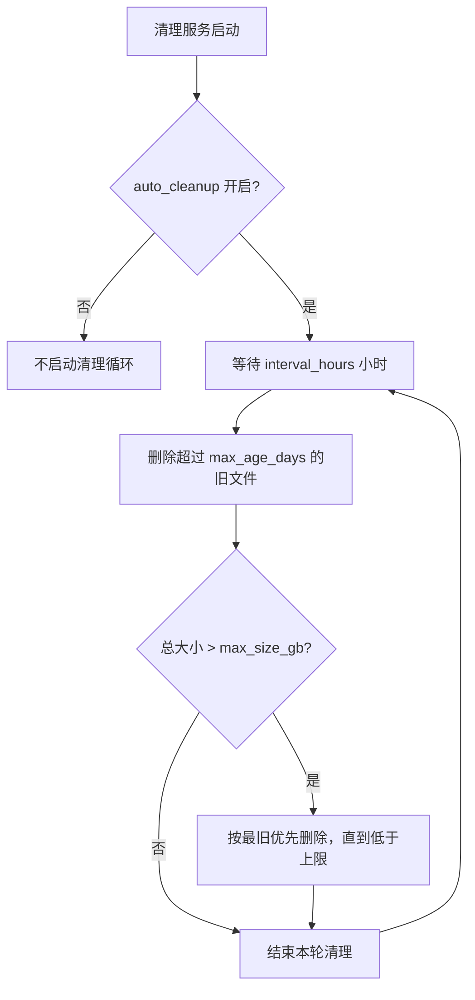
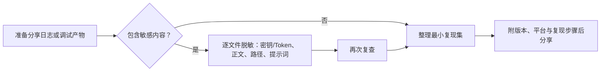

# 隐私、清理与日志分享

当你要释放磁盘空间、删除含个人内容的运行数据，或把日志和调试产物发给别人排查问题时，本页说明数据清理的对象与顺序、脱敏规则以及日志分享的注意事项。数据保存在哪里、何时发往外部服务见[数据与隐私](../introduction/data-and-privacy.md)；逐类调试产物的生成阶段和阅读顺序见[如何阅读与分享一次调试运行](../debugging/how-to-read-and-share-a-debug-run.md)；按安装形态完整卸载见[卸载与数据清理](../install/uninstall-and-data-cleanup.md)；Web 管理界面的完整操作见[管理界面](../web/administrator-interface.md)。

## 功能边界 {#scope}

- 本页覆盖：日志和运行数据的清理、对外分享前的脱敏规则、桌面/CLI 日志与 Web 会话/系统日志的查看导出，以及运行时配置表的自动重建。
- 本页不重复：数据保存位置与外发边界（见数据与隐私页）、逐类调试产物的含义（见调试运行页）、按安装形态的卸载步骤（见卸载页）、Web 管理界面的全部按钮与状态（见管理界面页）。
- 清理不是卸载，也不是备份。删除 `.env`、`config/`、服务器 `data/`、结果、模型缓存和调试目录都是不可逆操作；开始前先确认范围并备份需要保留的内容。

## UI 操作 {#operations}

### 清理运行数据 {#cleanup-data}

桌面端清理前先完全退出 Qt UI（或停止 CLI），否则 `result/` 下的日志文件被文件处理器占用，Windows 上可能删除失败：

1. 打开“设置”（`Settings`）→“通用”（`General`），查看“详细日志”（`Verbose Logging`）说明面板中给出的清理方法：先关闭 Qt UI，再删除 `result/` 下不需要的 `log_*.txt` 和对应的时间戳调试文件夹。
2. 删除 `result/` 下的 `log_<时间戳>.txt` 和 `时间戳-图片MD5-尺寸-语言-翻译器/` 调试子目录；两者配套删除，不要只删一半。
3. 输入目录旁的 `manga_translator_work/` 可能含逐图 JSON、导出文本、PSD/JSX 和中间图片，按任务选择性删除。
4. `config/` 下的运行时表（过滤列表、替换规则、富文本规则、翻译模板、提示词等）删除后会在下次启动时由 `ensure_runtime_files()` 重建默认值，但自定义修改会丢失。

Web 管理端的“清理”（`Cleanup`）模块只作用于服务器清理服务定义的目录，不是删除程序目录的卸载器，也不覆盖桌面 `result/` 或输入目录旁的工作目录。结果页的“清空翻译结果”只清空浏览器结果列表和 blob URL，不等于删除服务器上的结果文件。

### 查看与导出日志 {#view-and-export-logs}

- 桌面端与 CLI 的运行日志都写在应用根目录（开发环境为仓库根目录，打包版为可执行文件所在目录）的 `result/log_<yyyyMMddHHmmss>.txt`。翻译出错弹出“翻译错误”（`Translation Error`）对话框时，可点击“打开日志文件夹”（`Open log folder`）跳转到日志目录。
- Web 管理端的“日志”（`Logs`）模块可查看系统日志和对话框日志，按会话或级别过滤，并可“导出日志”（`Export Logs`）或“清空日志”（`Clear Logs`）。
- 分享日志前按本页“脱敏与日志分享”一节处理：删除本机路径、凭据、用户正文和会话令牌，只保留版本、平台与复现步骤。

### 配置导入导出与密钥显示 {#config-import-export}

- “导出配置”（`Export Config`）的提示文案说明导出文件不包含 API 密钥等敏感信息；“导入配置”（`Import Config`）会保留已有敏感信息不被覆盖。
- API 管理页的密钥字段默认以密码模式显示，只有主动点击显示图标才在窗口中显示；这不是对剪贴板、屏幕录制或外部服务的保护。

## 选项中英对照 {#option-matrix}

下表列出本页正文引用的实际界面文案，英文与中文来自当前 `desktop_qt_ui/locales/en_US.json` 与 `zh_CN.json`。Web 管理页 `admin-new.html` 的部分按钮（如“下载”“清空”“清理”）是脚本硬编码中文，不能只依据桌面 locale 推断显示值。

| UI 调用 key | English 实际值 | 简体中文实际值 |
| --- | --- | --- |
| `label_verbose` | Verbose Logging | 详细日志 |
| `Log output...` | Log output... | 日志输出... |
| `Open log folder` | Open log folder | 打开日志文件夹 |
| `Show Secret` | Show key | 显示密钥 |
| `Hide Secret` | Hide key | 隐藏密钥 |
| `Export Config` | Export Config | 导出配置 |
| `Import Config` | Import Config | 导入配置 |
| `Clear List` | Clear List | 清空列表 |
| `web_cleanup_management` | Cleanup | 清理管理 |
| `web_cleanup_rules` | Cleanup Rules | 清理规则 |
| `web_auto_cleanup` | Auto Cleanup | 自动清理 |
| `web_manual_cleanup` | Manual Cleanup | 手动清理 |
| `web_cleanup_now` | Cleanup Now | 立即清理 |
| `web_cleanup_report` | Cleanup Report | 清理报告 |
| `web_logs` | Logs | 日志 |
| `web_log_management` | Logs | 日志管理 |
| `web_session_logs` | Session Logs | 对话框日志 |
| `web_system_logs` | System Logs | 系统日志 |
| `web_log_level` | Log Level | 日志级别 |
| `web_export_logs` | Export Logs | 导出日志 |
| `web_clear_logs` | Clear Logs | 清空日志 |
| `web_real_time_logs` | Real-time Logs | 实时日志 |
| `web_confirm_clear_logs` | Confirm clear logs? | 确认清空日志？ |
| `web_can_view_logs` | Can View Logs | 可查看日志 |

`Show Secret` 的 key 是 `Show Secret`，但 `en_US.json` 中实际显示为 `Show key`，页面以实际显示值为准。

## 运行机理 {#runtime}

### 日志写入与清理边界 {#log-writing}

`manga_translator/utils/log.py` 提供 `init_logging()`、`set_log_level()`、`add_file_logger()` 和 `remove_file_logger()`：控制台 handler 只保留本项目与 `desktop-ui` 前缀的日志，文件 handler 独立于控制台级别。桌面端 `desktop_qt_ui/main.py` 启动时以 DEBUG 级别创建 `result/log_<yyyyMMddHHmmss>.txt` 文件 handler；CLI 的 `manga_translator/mode/local.py` 写入同一位置和格式。日志可能包含本机绝对路径、错误栈、请求阶段和会话信息，公开前必须脱敏。

### 服务器自动清理 {#server-auto-cleanup}

`manga_translator/server/core/cleanup_service.py` 的 `CleanupService` 只清理三类服务器数据目录：

- 结果目录 `SERVER_DATA_DIR/results`
- 用户字体 `USER_RESOURCES_DIR/fonts`
- 用户提示词 `USER_RESOURCES_DIR/prompts`

设置项（`admin_settings['cleanup']`）默认 `auto_cleanup: false`、`interval_hours: 24`、`max_age_days: 7`、`max_size_gb: 10`。每轮先删除修改时间早于保留期的文件，若总大小仍超过上限，再按最旧优先继续删除直到低于上限，最后移除空目录。该服务不覆盖桌面 `result/`、输入目录旁的 `manga_translator_work/` 或浏览器 `localStorage`。

自动清理只按修改时间和总大小删除，不区分文件是否含敏感内容；被清理目录外的数据仍需手动处理。

### 运行时文件重建 {#runtime-files-rebuild}

`manga_translator/runtime_files.py` 的 `ensure_runtime_files()` 为每个入口点补齐用户可编辑的运行时表：`custom_api_params.json`、AI OCR/渲染/上色提示词、`filter_list.json`、`text_replacements.yaml`、`rich_text_rules.yaml` 和 `translation_template.json`。它不覆盖用户文件；只有内容命中历史内置默认值哈希时才删除并由后续流程重建。因此删除这些文件后重启会恢复默认，但用户自定义修改会丢失，不能把“自动重建”当作备份。

### 脱敏边界 {#sanitization-boundary}

- 服务器 `translation_integration.py` 的 `_sanitize_config()` 只在特定输出边界递归掩盖键名含 `api_key`、`api_secret`、`password`、`token`、`key` 的配置值（替换为 `***`）。这只是该输出边界的脱敏，不是对日志、调试目录或数据库的通用清洗。
- `mask_raw` 只是 base64 编码的 PNG，编码不等于匿名化；PSD/JSX 脚本可能含图层文本和本机文件路径；错误信息可能带地址、模型名和请求阶段。任何包含这些内容的文件都要逐项检查后再分享。

## 清理与脱敏流程 {#cleanup-and-sanitize}

### 数据清理 {#cleanup-table}

| 数据位置 | 可能包含的内容 | 清理动作 | 注意 |
| --- | --- | --- | --- |
| `result/log_<时间戳>.txt` | 桌面/CLI 运行日志、路径、错误栈 | 关闭应用后删除 | Windows 下文件被占用时删除失败 |
| `result/<时间戳>-<MD5>-<尺寸>-<语言>-<翻译器>/` | verbose 调试中间图、`ocrs/`、JSON、JSX | 关闭应用后删除整个目录 | 与 `log_*.txt` 配套删除 |
| `<输入目录>/manga_translator_work/` | 逐图 JSON、导出文本、PSD/JSX、中间图片 | 按任务选择性删除 | 含原图、OCR、译文和路径 |
| `config/` 运行时表 | 过滤列表、替换/富文本规则、翻译模板、提示词 | 删除后重启由 `ensure_runtime_files()` 重建默认 | 自定义修改会丢失 |
| `manga_translator/server/data/` | 账号、会话、历史、日志、用户资源 | 部署者备份后按策略清理 | 清理服务只覆盖 results/fonts/prompts |
| 浏览器 `localStorage` | `session_token`、结果列表、`user_env_vars` | 退出登录并清理站点数据 | 与服务器历史是两套数据 |

### 脱敏与日志分享 {#sanitize-and-share}

分享日志或调试产物的目标是让接收方无需你的图片和密钥就能复现问题。优先整理最小复现集，而不是打包整个 `result/` 或工作目录。

| 应包含 | 不应包含 |
| --- | --- |
| 应用/CLI 版本号与操作系统 | 真实 API Key、Token、密码、会话令牌 |
| 复现步骤、目标语言、翻译器与关键参数 | 用户原图、大段原文/译文、OCR 文本 |
| 脱敏后的日志片段和对应调试子目录 | 整个 `result/` 或整个工作目录 |
| 脱敏后的配置片段 | 本机绝对路径、私有提示词 |

## 依赖与冲突 {#dependencies}

- `verbose` 与最终输出目录相互独立：调试产物写应用根的 `result/`，最终图片按输出配置写入别处；清理调试目录不影响已保存的输出。
- 服务器清理服务不等于卸载；Web 结果页“清空翻译结果”只清浏览器列表与 blob URL，不删除宿主机结果文件。完整卸载见卸载页。
- 运行时文件删除后会重建默认，但自定义内容丢失；不要把自动重建当作备份，也不要拿示例配置当用户配置。
- 服务端 `_sanitize_config` 只作用于特定输出边界，不能替代逐文件检查；`mask_raw` 编码不等于脱敏。
- 删除 `.env`、`config/`、服务器 `data/`、结果和模型缓存是不可逆操作；日志与错误截图必须先脱敏再对外分享。

## 关联文件与格式 {#related-files}

| 文件/目录 | 本页实际作用 | 清理与分享注意 |
| --- | --- | --- |
| `result/log_<时间戳>.txt` | 桌面/CLI 运行日志 | 分享前删除路径与凭据；清理前先关闭应用 |
| `result/<时间戳>-<MD5>-.../` 及 `ocrs/` | verbose 调试产物与 OCR 裁切 | 整目录检查后分享 |
| `manga_translator_work/` | 逐图 JSON、导出文本、PSD/JSX | 含用户内容，不属于 `result/`，分享前必须脱敏 |
| `config/` 运行时表 | 由 `ensure_runtime_files()` 保证存在并可重建 | 删除会重建默认，但丢失自定义内容 |
| `.env` | API/服务器环境变量 | 视为凭据文件；不展示、不复制真实值 |
| `manga_translator/server/data/logs.json` | Web 会话/系统日志仓库 | 导出或分享前删除会话令牌、账号与路径 |
| 浏览器 `localStorage` | 会话令牌、结果列表、环境变量 | 共享设备退出登录并清理站点数据 |

## 源码依据 {#source-evidence}

| 层级 | 文件 | 本页核对内容 |
| --- | --- | --- |
| 日志核心 | `manga_translator/utils/log.py` | `init_logging`、`set_log_level`、`add_file_logger`/`remove_file_logger` |
| 桌面日志 | `desktop_qt_ui/main.py` | `result/log_<时间戳>.txt` 文件 handler 与日志目录 |
| CLI 日志 | `manga_translator/mode/local.py` | CLI 写入同一位置与格式 |
| 服务器清理 | `manga_translator/server/core/cleanup_service.py` | 目录范围、默认设置、按年龄/大小清理与空目录移除 |
| Web 日志路由 | `manga_translator/server/routes/logs.py` | 会话/系统日志查询、导出、清空与旧日志清理 |
| 运行时文件 | `manga_translator/runtime_files.py` | `ensure_runtime_files()` 与旧默认值升级 |
| 路径 | `manga_translator/runtime_paths.py`、`server_paths.py` | 应用目录、`config/`、服务器 `data/` 与用户资源 |
| 配置持久化 | `desktop_qt_ui/services/config_service.py` | 250 ms 防抖、`.env`/JSON 写入、导入导出保留敏感信息 |
| 服务端脱敏 | `manga_translator/server/core/translation_integration.py` | `_sanitize_config` 递归掩盖敏感键 |
| 输出保存 | `manga_translator/save.py` | `save_result` 格式校验，与调试目录相互独立 |
| Web 前端 | `manga_translator/server/static/admin-new.html`、`static/js/admin/modules/cleanup.js`、`logs.js` | 清理/日志模块的按钮、设置与硬编码文案 |
| UI/i18n | `desktop_qt_ui/locales/en_US.json`、`zh_CN.json` | 本页三列表的 key 与实际显示值 |

## 验证记录 {#verification}

| 验证内容 | 状态 | 说明 |
| --- | --- | --- |
| BLUEPRINT、PAGE_GUIDELINES、TODO | 完成 | 已完整读取并按页面合同编写；职责边界与 data-and-privacy、debugging、uninstall 页互链 |
| UI/i18n 三列证据 | 完成（静态） | 逐项核对 `en_US.json`/`zh_CN.json` 实际值；`admin-new.html` 硬编码文案按非 key 处理 |
| 清理与脱敏机理 | 完成（静态） | 核对日志服务、服务器清理服务、运行时文件重建与服务端脱敏边界 |
| 敏感信息审查 | 完成 | 未写入真实密钥、令牌、账号、私有绝对路径、用户图片或私有提示词 |
| 脱敏运行验证 | 待后续 | 未启动 GUI/Web，未执行真实翻译；自动清理实际删除范围与保留期需用脱敏样例分别验证 |
| VitePress | 待运行 | 由协调代理在合并前运行 `npm run docs:build --prefix doc/wiki` 及镜像/源码检查 |