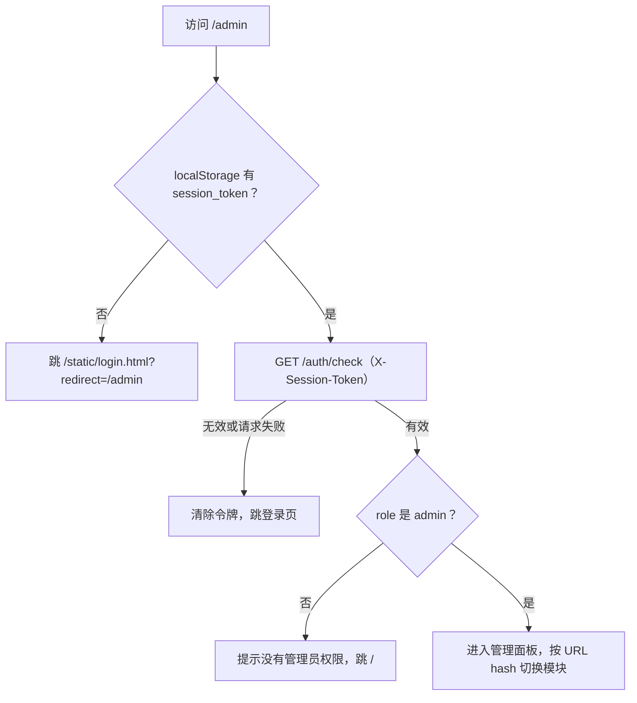
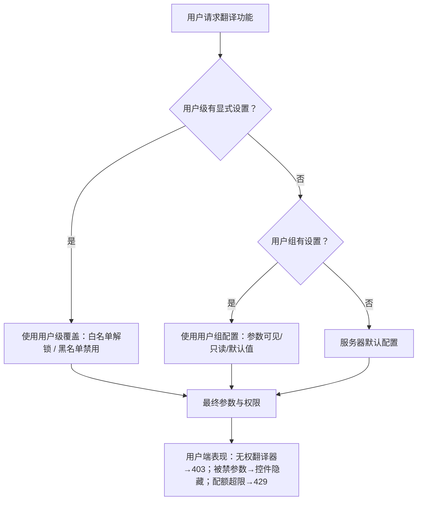

# 管理界面

当服务器开放给多个用户使用时，管理员通过“管理界面”（`GET /admin` 返回的 `admin-new.html`）管理账号与运行状态：创建用户、划分用户组并设置权限、配置配额、查看和撤销会话、监控与取消翻译任务、查看用户历史与系统日志、管理 API 密钥预设与服务器 `.env`、设置服务器参数、发布公告以及清理存储。只有 `role` 为 `admin` 的会话才能进入；非管理员访问会被提示并返回首页。

本页只描述管理员在浏览器中的操作。底层 JSON/表单端点（如 `/api/admin/users`、`/api/admin/groups`、`/api/admin/quota/*`、`/audit/events`）的请求、响应与状态码契约见开发者 HTTP API 页面；登录与首次管理员设置见[登录、语言与会话](./login-language-and-session.md)，用户侧主工作区见[上传、配置与翻译](./upload-config-and-translate.md)。

## 功能边界 {#feature-boundary}

- 入口限定：用户首页顶栏的“管理”链接只在会话角色为 `admin` 时显示（`static/script.js` 检查 `userSession.role === 'admin'`）；直接访问 `/admin` 也会先执行 `GET /auth/check`，令牌缺失/无效时清除 `localStorage.session_token` 并跳转 `/static/login.html?redirect=/admin`，非管理员会被提示“您没有管理员权限”并返回 `/`（`static/js/admin/app.js`）。
- 管理面板共 12 个导航模块：仪表盘、用户管理、用户组管理、配额管理、会话管理、任务监控、历史记录、系统日志、API密钥管理、服务器配置、公告管理、清理管理。
- `app.js` 的标题表还包含“权限管理”，但 `admin-new.html` 的导航与初始化没有注册 `modules/permissions.js`，该模块是未接线的静态列表，本页不把它当作可操作功能。
- 审计（`AuditService` + `/audit/*` 路由）会自动记录登录、改密、创建用户、权限变更、翻译开始/完成/失败等事件；当前管理面板导航没有审计模块，查询与导出走开发者 HTTP API。
- 管理面板不是桌面 Qt 界面的复用：`admin-new.html` 大量文案是硬编码中文，只有少量控件走 i18n（见下方“UI 文案对照”），与用户站和桌面端 locale 不同。

## 进入管理界面 {#enter-admin-panel}

1. 用管理员账号登录，或直接访问 `/admin`；登录页在成功后会按 `redirect=/admin` 回到管理界面。
2. 页面先调用 `GET /auth/check`（请求头 `X-Session-Token`）。会话无效时清除令牌并跳回登录页；`role` 不是 `admin` 时提示并返回首页。
3. 左侧导航按“概览 / 用户管理 / 系统监控 / 系统设置”分组；点击导航项切换模块，同时把模块 ID 写入 URL hash（例如 `#users`），顶部标题与“管理控制台 / 当前模块”面包屑同步更新。
4. 右侧“退出登录”按钮调用 `POST /auth/logout` 后清除令牌并回到登录页。

## 仪表盘与任务监控 {#dashboard-and-tasks}

### 仪表盘

仪表盘显示四张统计卡：活跃用户、今日翻译、进行中任务、存储使用；下方是“活动任务”表（任务ID、用户、状态、进度、开始时间、操作），提供“刷新”按钮。`app.js` 只接入了任务数与用户数统计；今日翻译和存储使用初始显示 `--`，存储卡在清理管理模块才有真实数值。

### 任务监控

“任务监控”列出全部进行中的任务（任务ID、用户、类型、状态、进度条、开始时间、操作），进入模块后每 3 秒自动刷新，可用“暂停刷新 / 自动刷新”切换。“取消”对 `pending/queued/processing/running` 状态的任务调用 `POST /admin/tasks/{task_id}/cancel`；“详情”目前只是前端提示占位。注意“取消全部”调用 `POST /admin/tasks/cancel-all`，该端点在当前 `routes/admin.py` 中未定义（静态源码核对），实际行为需运行验证。

## 用户管理 {#user-management}

### 创建与编辑用户

“用户列表”表列：用户名、角色、用户组、状态、创建时间、操作。

1. 点击“➕ 添加用户”，填写用户名、密码（至少 6 位）、选择用户组、API 密钥预设（留空为“继承用户组设置”）和角色（普通用户 / 管理员），点击“✅ 创建”，对应 `POST /api/admin/users`。
2. 点击行内“编辑”可修改新密码（留空则不修改）、用户组、API 密钥预设、角色和“账户启用”开关，点击“💾 保存”，对应 `PUT /api/admin/users/{username}`。
3. “⚙️ 编辑权限配置（翻译器、参数限制等）”会打开权限编辑器；用户模式下只显示当前所属用户组，并提示“用户的权限和配额完全由所属用户组决定”。

### 删除用户

非 `admin` 角色用户的行内有“删除”按钮，对应 `DELETE /api/admin/users/{username}`；管理员账号不显示删除按钮。被删除用户的会话会随之失效。

## 用户组与权限 {#groups-and-permissions}

### 创建用户组

“用户组列表”表列：组名称（含 ID）、描述、成员数、API 密钥预设、是否默认、操作。

点击“➕ 创建用户组”填写：用户组 ID（只能包含字母、数字和下划线）、显示名称、描述、默认 API 密钥预设（可选，留空使用服务器默认配置），点击“✅ 创建”，对应 `POST /api/admin/groups`。系统组 `admin`、`default`、`guest` 不显示删除按钮；删除用户组会把该组用户移到 `default` 组。

### 通用权限编辑器

点击用户组行内“编辑”打开通用权限编辑器（`components/permission-editor.js`），内含 6 个页签：

| 页签（UI 调用 key） | English 实际值 | 简体中文实际值 | 说明 |
| --- | --- | --- | --- |
| `Basic Settings` | Basic Settings | 基础设置 | 默认 API 密钥预设、翻译器、OCR、检测器等参数选择与输入 |
| `CLI Options` | 缺失（回退“输出选项”） | 输出选项 | 输出格式、保存质量、重试次数、批量大小、GPU 等 CLI 参数 |
| `Advanced Settings` | Advanced Settings | 高级设置 | 修复、超分、上色相关参数 |
| `label_renderer` | Renderer | 渲染器 | 渲染器与排版参数 |
| `web_quota_management` | 缺失（回退“配额限制”） | 配额限制 | 每日配额、批量设置、上传限制 |
| `web_group_permissions` | 缺失（回退“功能权限”） | 功能权限 | 可见 API 预设、能力白名单、工作流、API 密钥策略、资源与功能权限 |

每个参数行带有“✓ 启用 / 🚫 禁用（用户不可见）”开关；禁用后用户端看不到该参数。保存调用 `PUT /api/admin/groups/{group_id}/config`，写入参数配置、白名单/黑名单、默认预设和可见预设。

### 功能权限与继承

“功能权限”页签按翻译器、OCR、上色、渲染四类能力提供“允许所有”与逐项勾选，另有工作流选择器；在“API 密钥”分组可以设置：允许用户在主页编辑 API Keys、允许使用服务器默认 API Keys、强制用户提供 API Keys 或预设、允许把用户填写的 API Keys 保存到服务器（会写入服务器 `.env` 并影响全局，多用户环境不建议开启）。“资源管理”分组控制字体与提示词的上传/删除权限，“功能权限”分组控制批量处理、API 访问、导出文本、查看历史、查看日志。

权限与配额解析的优先级是：用户级显式设置 > 所属用户组配置 > 服务器默认。用户模式只保存相对用户组的差异（勾选解锁被禁用的能力=白名单，取消勾选额外禁用=黑名单）。

## 配额与会话 {#quota-and-sessions}

### 默认配额设置

“默认配额设置”表单包含每日限制、每月限制、最大文件大小、最大批量大小，点击“💾 保存配额设置”对应 `PUT /admin/settings`（写入 `default_quota`）。这些数值是管理员在页面直接编辑的服务器默认值，与用户组权限编辑器里的“配额限制”是不同入口。

### 用户配额使用情况

“用户配额使用情况”表按用户显示今日使用（带进度条，超过 80% 变红）与本月使用。注意：行内“编辑”与“重置”按钮当前只是前端 `prompt`/`alert` 占位，没有调用后端接口；后端存在 `/api/admin/quota/set-limits` 与 `/api/admin/quota/reset`，但本管理界面未接线（静态源码核对），真实保存行为需运行验证。

### 会话管理

“活跃会话”表列：用户、Token（前 12 位）、IP 地址、设备（用户代理前 30 字符）、登录时间、操作。当前会话绿色高亮并标记“当前”，没有撤销按钮；其他会话可点击“撤销”，对应 `DELETE /sessions/{session_token}`。“撤销所有其他会话”调用 `POST /sessions/revoke-all`，该端点在当前 `routes/sessions.py` 中未定义（静态源码核对），需运行验证。

## 历史记录与系统日志 {#history-and-logs}

### 历史记录

“翻译历史”先请求 `/api/history/admin/all?limit=1000&offset=0`，再按用户聚合为：用户、翻译次数、文件数、总大小、最后活动，操作列提供“📷 查看相册”和“🗑 删除全部”。“查看相册”弹窗复用用户端图册风格：预览图片、勾选多条、下载选中打包 ZIP、下载单个、下载用户全部历史（均先申请下载票据），也可删除选中或单条记录。“清空历史”会逐条删除全部记录并提示“此操作不可恢复”。

### 系统日志

“系统日志”以深色终端风格显示日志流（时间、级别、会话 ID 标签、消息），进入模块后每 5 秒自动刷新。支持按会话 ID 过滤、按级别过滤（全部 / DEBUG / INFO / WARNING / ERROR）、“暂停滚动 / 自动滚动”以及“📥 下载”（`GET /admin/logs/export`）。日志可能包含路径、文件名与请求细节，导出或分享前必须脱敏。“清空”调用 `POST /admin/logs/clear`，该端点在当前 `routes/admin.py` 中未定义（静态源码核对），需运行验证。

## API 密钥与预设 {#api-keys-and-presets}

1. “📦 API 密钥预设”区可以创建预设（名称、描述、可见用户组多选、各提供商的 API 密钥表单）、编辑和删除；预设用于分配给用户组，用户组可选择使用哪个预设的密钥。
2. “🔐 服务器默认API密钥”区从服务器 `.env` 读取（`GET /api/admin/config/server?show_values=true`），按分类表单展示各密钥字段；点击“💾 保存API密钥”对应 `PUT /api/admin/config/server`，默认先备份 `.env`。
3. 用户侧生效顺序：用户填写 > 当前预设 > 服务器默认；OCR、上色、渲染专用 Key 留空时回落到对应提供商的通用翻译 Key。

本页不展示任何真实密钥、令牌或 `.env` 内容；文档和截图只使用脱敏占位。前端把用户站输入的 Key 暂存于 `localStorage.user_env_vars`，但服务器不会在普通配置接口返回密钥明文。

## 服务器配置、公告与清理 {#config-announcement-cleanup}

### 服务器配置

“基本设置”包含服务器名称、最大并发任务、任务超时（秒）、最大文件大小（MB）、允许的格式、最大批量大小，以及“允许用户注册”开关和注册默认分组下拉框（不含 `admin` 组），点击“💾 保存设置”对应 `PUT /admin/settings`。

“服务器字体管理”可以上传 `.ttf` / `.otf` / `.ttc` 字体、列出并删除服务器共享字体（所有用户可用）；“服务器提示词管理”可以列出、查看、上传和删除服务器提示词。对应端点分别是 `/upload/font`、`/fonts`、`/fonts/{name}` 与 `/upload/prompt`、`/prompts`、`/prompts/{name}`。

### 公告管理

“公告管理”可以启用公告、选择公告类型（信息=蓝色、警告=黄色、错误=红色）、填写内容并实时预览；“💾 保存公告”对应 `PUT /admin/announcement`，写入 `admin_settings`。启用后用户站通过 `GET /announcement` 读取并在页面显示公告条。“清除公告”只是清空表单，需要再次保存才生效。

### 清理管理

“存储使用情况”显示上传目录（用户字体+提示词）、结果目录、缓存目录和总计的大小与文件数；缓存目录当前恒为 0（源码没有独立缓存目录）。每个目录有“清理”按钮，另有“清理全部”，对应 `POST /admin/cleanup/{uploads|results|cache|all}`，会删除目录内容但保留 `index.json`，并返回释放空间。清理不可恢复，操作前会要求确认。

“自动清理设置”包含启用自动清理、清理间隔（小时）、文件最大保留天数、最大存储空间（GB），点击“💾 保存设置”对应 `PUT /admin/settings`（写入 `cleanup`）。

## UI 文案对照 {#ui-copy}

管理面板的大部分文案是 `admin-new.html` 硬编码中文，没有 i18n key；下表如实标注。key 为 `web_*` 的行来自用户站 i18n（`doc/wiki/data/i18n.generated.json` 与 `desktop_qt_ui/locales/*.json`），它们不一定被管理面板实际使用。

| UI 调用 key | English 实际值 | 简体中文实际值 |
| --- | --- | --- |
| 用户站顶栏“管理”链接（`script.js` 调用 key `admin`） | 缺失（桌面 locale 无 `admin`，回退“管理”） | 管理 |
| `web_admin_panel`（用户站 i18n） | Admin Panel | 管理面板 |
| `admin-new.html` 硬编码：侧边栏标题 | 缺失（仅中文硬编码） | 管理控制台 |
| 硬编码：概览 / 系统监控 / 系统设置 | 缺失（仅中文硬编码） | 概览 / 系统监控 / 系统设置 |
| 硬编码：仪表盘 | 缺失（仅中文硬编码） | 仪表盘 |
| 硬编码：用户管理 | 缺失（仅中文硬编码） | 用户管理 |
| `web_user_management` | User Management | 用户管理 |
| 硬编码：用户组管理 | 缺失（仅中文硬编码） | 用户组管理 |
| `web_group_management` | Group Management | 用户组管理 |
| 硬编码：配额管理 | 缺失（仅中文硬编码） | 配额管理 |
| `web_quota_management` | Quota Management | 配额管理 |
| 硬编码：会话管理 | 缺失（仅中文硬编码） | 会话管理 |
| 硬编码：任务监控 | 缺失（仅中文硬编码） | 任务监控 |
| 硬编码：历史记录 | 缺失（仅中文硬编码） | 历史记录 |
| `web_history_management` | History Management | 历史记录管理 |
| 硬编码：系统日志 | 缺失（仅中文硬编码） | 系统日志 |
| `web_log_management` | Logs | 日志管理 |
| 硬编码：API密钥管理 | 缺失（仅中文硬编码） | API密钥管理 |
| `web_preset_management` | Presets | 预设管理 |
| 硬编码：服务器配置 | 缺失（仅中文硬编码） | 服务器配置 |
| `web_server_config` | Server Configuration | 服务器配置 |
| 硬编码：公告管理 | 缺失（仅中文硬编码） | 公告管理 |
| 硬编码：清理管理 | 缺失（仅中文硬编码） | 清理管理 |
| `web_cleanup_management` | Cleanup | 清理管理 |
| 硬编码：➕ 添加用户 / ➕ 创建用户组 | 缺失（仅中文硬编码） | ➕ 添加用户 / ➕ 创建用户组 |
| 硬编码：编辑 / 删除 / 取消 / 保存 | 缺失（仅中文硬编码） | 编辑 / 删除 / 取消 / 保存 |
| `web_cancel` / `web_save` | Cancel / Save（桌面 locale 缺失，实际回退中文） | 取消 / 保存 |
| 硬编码：💾 保存配额设置 / 💾 保存设置 / 💾 保存API密钥 | 缺失（仅中文硬编码） | 💾 保存配额设置 / 💾 保存设置 / 💾 保存API密钥 |
| 硬编码：撤销所有其他会话 | 缺失（仅中文硬编码） | 撤销所有其他会话 |
| 硬编码：取消全部 / 清空历史 / 清空 / 📥 下载 | 缺失（仅中文硬编码） | 取消全部 / 清空历史 / 清空 / 📥 下载 |
| 硬编码：活跃会话 | 缺失（仅中文硬编码） | 活跃会话 |
| `web_active_sessions` | Active Sessions | 活跃会话 |
| 硬编码：启用公告 / 保存公告 / 清除公告 | 缺失（仅中文硬编码） | 启用公告 / 保存公告 / 清除公告 |
| 硬编码：启用自动清理 / 清理 | 缺失（仅中文硬编码） | 启用自动清理 / 清理 |
| `web_auto_cleanup` | Auto Cleanup | 自动清理 |
| 权限编辑器页签 `Basic Settings` | Basic Settings | 基础设置 |
| 权限编辑器页签 `CLI Options` | 缺失（回退“输出选项”） | 输出选项 |
| 权限编辑器页签 `Advanced Settings` | Advanced Settings | 高级设置 |
| 权限编辑器页签 `label_renderer` | Renderer | 渲染器 |
| 权限编辑器页签 `web_group_permissions` | 缺失（回退“功能权限”） | 功能权限 |
| `web_daily_quota` / `web_daily_limit` | Daily Quota / Daily Limit | 每日配额 / 每日限制 |
| `web_upload_limit` / `web_max_file_size` / `web_max_files` | Upload Limit / Max File Size / Max Files | 上传限制 / 单文件最大 / 最多文件数 |
| `web_can_upload_font` / `web_can_upload_prompt` | Can Upload Font / Can Upload Prompt | 可上传字体 / 可上传提示词 |
| `web_can_view_history` / `web_can_view_logs` | Can View History / Can View Logs | 可查看历史 / 可查看日志 |
| `web_default_preset` | Default Configuration | 默认配置 |
| `data-i18n="API Keys (.env)"`（admin-new.html 唯一 i18n 属性） | API Keys (.env) | 服务器默认API密钥（硬编码回退） |

说明：`admin-new.html` 加载的是 `static/js/i18n.js`，它从 `/locales/{locale}.json` 读取桌面 locale；`js/admin/i18n.js` 中的 `AdminI18n` 类未被 `admin-new.html` 加载。权限编辑器与 envvars 模块通过 `window.i18n.t(key, fallback)` 取词，`web_*` key 不在桌面 locale 中时回退到调用处的中文 fallback，因此英文 locale 下部分控件仍显示中文。这属于静态源码可确认的 i18n 缺口，具体显示以有头浏览器运行验证为准。

## 依赖与冲突 {#dependencies-and-conflicts}

- 用户、用户组、配额、会话、任务、历史、日志由不同服务管理，但相互依赖：配额解析按“用户级 > 用户组级 > 全局默认”的顺序（`quota_service.py`），权限解析由 `permission_service.py` / `permission_calculator.py` 完成；修改用户组会即时影响该组所有用户。
- 管理面板的“配额管理”与权限编辑器里的“配额限制”是两个入口，字段键名不一致（前者 `daily_limit`/`monthly_limit`，后者 `daily_image_limit`/`daily_char_limit`），后端契约以开发者 HTTP API 页为准。
- 保存服务器 `.env`（含“允许把用户填写的 API Keys 保存到服务器”）会影响全局所有用户，多用户环境不建议开启。
- 管理员“历史记录”是跨用户聚合视图，不等同于用户站 `localStorage` 结果列表，也不等同服务器历史存储本身。
- 取消任务、清空历史、清理存储均不可恢复；涉及真实用户的删除与撤销操作必须谨慎并保留审计记录。
- 审计事件由登录、改密、注册、创建任务、权限拒绝、翻译过程及用户/权限管理操作自动写入 `audit.log`（10MB 轮转、保留 5 个备份）；当前管理界面没有审计 UI，查询/导出只能通过 `/audit/*` 接口。

## 关联文件与格式 {#related-files}

| 文件/格式 | 本页实际作用 | 注意 |
| --- | --- | --- |
| `manga_translator/server/static/admin-new.html` | 管理面板页面 | 大量硬编码中文；不写入真实用户名或密钥 |
| `manga_translator/server/static/js/admin/app.js`、`modules/*.js`、`components/permission-editor.js` | 各模块逻辑与权限编辑器 | 部分按钮调用后端未定义的端点（见正文） |
| `manga_translator/server/routes/web.py`、`admin.py`、`users.py`、`groups.py`、`sessions.py`、`quota.py`、`audit.py`、`config_management.py` | `/admin`、`/api/admin/*`、`/sessions/*`、`/audit/*` 端点 | 契约细节归开发者 HTTP API 页 |
| `manga_translator/server/core/config_manager.py` | `DEFAULT_ADMIN_SETTINGS` 与 `admin_config.json` 读写 | 注册开关、公告、权限与配额默认值来源 |
| `manga_translator/server/core/group_management_service.py`、`group_service.py` | 用户组 CRUD 与参数配置 | 系统组 `admin`/`default`/`guest` 不可删除 |
| `manga_translator/server/core/quota_service.py`、`audit_service.py`、`permission_service.py`、`task_manager.py`、`middleware.py` | 配额、审计、权限、任务与鉴权 | `require_admin` 决定 401/403 |
| `manga_translator/server/data/admin_config.json` | 管理设置持久化 | 只记录结构，不展示真实内容 |
| `manga_translator/server/data/accounts.json`、`group_config.json`、`env_presets.json`、`audit.log` | 账户、用户组、预设、审计日志 | 不读取或展示真实用户数据 |
| `.env`（服务器）与 `server/data/backups/.env.backup.{时间戳}` | 服务器密钥配置与保存前备份 | 永不写入或展示真实密钥 |

## 源码依据 {#source-evidence}

| 层级 | 文件 | 本页核对内容 |
| --- | --- | --- |
| 入口与鉴权 | `manga_translator/server/routes/web.py`、`static/js/admin/app.js`、`static/script.js` | `/admin` 页面、会话检查、admin 角色判断、退出 |
| 页面结构 | `manga_translator/server/static/admin-new.html` | 12 个导航模块、统计卡、各模块表单与按钮 |
| 模块逻辑 | `static/js/admin/modules/{users,groups,quota,sessions,tasks,history,logs,envvars,config,announcement,cleanup}.js` | 每个模块的加载、渲染与调用的端点 |
| 权限编辑器 | `static/js/admin/components/permission-editor.js` | 6 个页签、参数锁定、白名单/黑名单、预设与工作流 |
| 后端端点 | `server/routes/{admin,users,groups,sessions,quota,audit,config_management}.py` | 管理端点的存在性、状态码与权限依赖 |
| 服务层 | `server/core/{config_manager,group_management_service,group_service,quota_service,audit_service,permission_service,middleware,task_manager}.py` | 默认值、配额优先级、审计轮转、`require_admin` |
| i18n | `static/js/i18n.js`、`static/js/admin/i18n.js`、`doc/wiki/data/i18n.generated.json`、`desktop_qt_ui/locales/en_US.json`、`zh_CN.json` | key→en_US→zh_CN 实际值与缺失/回退 |

## 验证记录 {#verification}

| 验证内容 | 状态 | 说明 |
| --- | --- | --- |
| BLUEPRINT、PAGE_GUIDELINES、TODO | 完成 | 已完整读取并按页面合同编写 |
| 页面结构与模块清单 | 完成 | 静态核对 `admin-new.html` 与 `app.js` 的导航模块 |
| 模块行为与端点 | 完成 | 静态核对各模块 JS 与后端路由；发现 `cancel-all`、`logs/clear`、`sessions/revoke-all` 前端调用与后端路由不一致，配额编辑/重置为前端占位 |
| `en_US` / `zh_CN` 实际 locale | 完成 | 页面表格逐项记录 key、English、简体中文实际值，硬编码项如实标注缺失/回退 |
| 脱敏运行验证 | 待后续 | 未读取真实 `.env`、账户、审计日志、用户数据或密钥；需有头浏览器 + 脱敏管理员账号验证英文显示、权限过滤与上述未定义端点 |
| VitePress | 待运行 | 由协调代理在合并前运行 `npm run docs:build --prefix doc/wiki` 及镜像/源码检查 |
